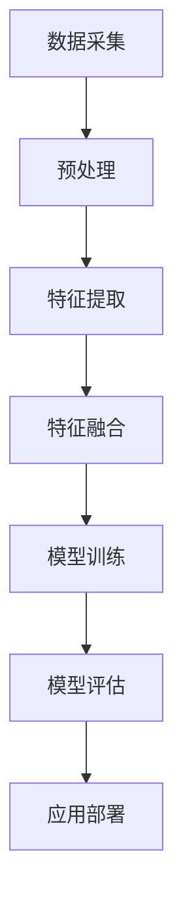

                 

关键词：多模态信息处理，人工智能，计算机视觉，自然语言处理，语音识别，融合技术，模型架构，算法原理，数学模型，应用实践，未来展望

> 摘要：本文深入探讨了多模态信息处理在人工智能领域的核心地位及其综合能力。通过分析多模态信息的获取、处理和融合技术，本文介绍了各种主流模型架构和算法原理。此外，本文还结合具体实例，阐述了多模态信息处理的实际应用场景，并对未来的发展趋势与挑战进行了展望。

## 1. 背景介绍

随着信息技术的迅猛发展，人工智能（AI）逐渐成为推动社会进步的重要力量。在AI领域中，多模态信息处理技术越来越受到关注。多模态信息处理是指将不同类型的信息（如视觉、语音、文本等）进行整合，以实现更高效、更准确的认知和理解。相较于单一模态的信息处理，多模态信息处理具有以下优势：

1. **提高信息理解能力**：通过整合多种类型的信息，可以更全面、准确地理解现实世界。
2. **增强模型泛化能力**：多模态信息可以提供更多样化的数据来源，有助于模型适应不同的应用场景。
3. **降低误检误识率**：多模态信息处理可以在一定程度上减少单一模态的不足，提高识别和分类的准确性。

多模态信息处理技术在计算机视觉、自然语言处理、语音识别等领域具有广泛的应用。例如，在人脸识别系统中，结合视觉和语音信息可以显著提高识别的准确性；在智能家居系统中，结合语音识别和文本分析可以更智能地理解用户需求。

## 2. 核心概念与联系

### 2.1 多模态信息处理的概念

多模态信息处理是指将来自不同感知模态的信息（如视觉、语音、文本等）进行整合，以实现更高效的信息理解和处理。在这个过程中，关键概念包括：

- **感知模态**：指人类或其他系统获取信息的方式，如视觉、语音、文本等。
- **信息融合**：指将来自不同模态的信息进行整合，以获得更全面、准确的信息表示。
- **特征提取**：指从原始数据中提取具有代表性的特征，用于后续的信息处理。

### 2.2 多模态信息处理的架构

多模态信息处理的架构可以分为三个主要部分：感知层、处理层和应用层。

- **感知层**：负责获取不同模态的信息，如摄像头获取视觉信息、麦克风获取语音信息、键盘获取文本信息等。
- **处理层**：负责对获取到的信息进行预处理、特征提取、融合等操作，以获得更高效、更准确的信息表示。
- **应用层**：负责利用处理层得到的信息进行具体的应用，如人脸识别、语音合成、文本分类等。

### 2.3 多模态信息处理的工作流程

多模态信息处理的工作流程可以分为以下步骤：

1. **数据采集**：从不同的感知模态获取数据。
2. **预处理**：对原始数据进行清洗、归一化等处理，以提高数据质量。
3. **特征提取**：从预处理后的数据中提取具有代表性的特征。
4. **特征融合**：将不同模态的特征进行整合，以获得更全面、准确的信息表示。
5. **模型训练**：利用融合后的特征训练机器学习模型。
6. **模型评估**：对训练好的模型进行评估，以确定其性能。
7. **应用部署**：将模型应用于实际场景，如人脸识别、语音合成、文本分类等。

### 2.4 多模态信息处理的 Mermaid 流程图



## 3. 核心算法原理 & 具体操作步骤

### 3.1 算法原理概述

多模态信息处理的核心算法主要包括特征提取、特征融合和模型训练。以下是这些算法的原理概述：

- **特征提取**：从原始数据中提取具有代表性的特征，以表示不同模态的信息。
- **特征融合**：将不同模态的特征进行整合，以获得更全面、准确的信息表示。
- **模型训练**：利用融合后的特征训练机器学习模型，以提高识别和分类的准确性。

### 3.2 算法步骤详解

1. **特征提取**：

   特征提取是多模态信息处理的重要环节。常见的特征提取方法包括：

   - **视觉特征提取**：如卷积神经网络（CNN）；
   - **语音特征提取**：如梅尔频率倒谱系数（MFCC）；
   - **文本特征提取**：如词袋模型（Bag of Words）和词嵌入（Word Embedding）。

2. **特征融合**：

   特征融合是将不同模态的特征进行整合，以获得更全面、准确的信息表示。常见的特征融合方法包括：

   - **空间融合**：将不同模态的特征在同一空间中进行整合；
   - **时间融合**：将不同模态的特征在不同时间点进行整合；
   - **层次融合**：先对各个模态的特征进行层次化处理，再进行整合。

3. **模型训练**：

   模型训练是利用融合后的特征训练机器学习模型，以提高识别和分类的准确性。常见的机器学习模型包括：

   - **监督学习模型**：如支持向量机（SVM）、神经网络（NN）；
   - **无监督学习模型**：如自编码器（AE）、聚类算法。

### 3.3 算法优缺点

- **优点**：

  1. 提高信息理解能力；
  2. 增强模型泛化能力；
  3. 降低误检误识率。

- **缺点**：

  1. 数据预处理复杂；
  2. 特征融合难度大；
  3. 模型训练成本高。

### 3.4 算法应用领域

多模态信息处理算法在以下领域具有广泛的应用：

- **计算机视觉**：如人脸识别、图像分类、目标检测等；
- **自然语言处理**：如情感分析、机器翻译、文本分类等；
- **语音识别**：如语音识别、语音合成、语音识别率提高等；
- **智能家居**：如智能语音助手、智能安防、智能家居控制系统等。

## 4. 数学模型和公式 & 详细讲解 & 举例说明

### 4.1 数学模型构建

多模态信息处理的数学模型主要涉及以下方面：

- **特征表示**：如何将不同模态的信息转化为数值特征；
- **特征融合**：如何将不同模态的特征进行整合；
- **模型训练**：如何利用融合后的特征训练机器学习模型。

### 4.2 公式推导过程

假设我们有三个模态的信息：视觉、语音和文本。对于每个模态，我们分别定义以下特征：

- **视觉特征**：\(V = [v_1, v_2, \ldots, v_n]\)；
- **语音特征**：\(A = [a_1, a_2, \ldots, a_m]\)；
- **文本特征**：\(T = [t_1, t_2, \ldots, t_k]\)。

首先，我们将这些特征进行预处理，如标准化、归一化等，得到预处理后的特征：

- **视觉特征**：\(V' = \frac{V - \mu_V}{\sigma_V}\)；
- **语音特征**：\(A' = \frac{A - \mu_A}{\sigma_A}\)；
- **文本特征**：\(T' = \frac{T - \mu_T}{\sigma_T}\)。

接下来，我们使用以下公式将这三个特征进行融合：

$$
F = \frac{1}{3}(V' + A' + T')
$$

然后，我们使用融合后的特征训练机器学习模型。假设我们使用神经网络作为分类器，其损失函数为：

$$
L = -\sum_{i=1}^{n} y_i \log(\hat{y}_i)
$$

其中，\(y_i\) 为真实标签，\(\hat{y}_i\) 为预测标签。

### 4.3 案例分析与讲解

假设我们有一个多模态信息处理的应用案例：智能语音助手。在这个案例中，我们使用视觉、语音和文本三个模态的信息来识别用户的需求，并给出相应的答复。

1. **数据采集**：

   我们从用户设备中采集视觉、语音和文本数据。例如，当用户向智能语音助手提问时，我们可以同时采集用户的视频、语音和文字输入。

2. **预处理**：

   对采集到的数据进行预处理，如人脸识别、语音识别、文本分类等，得到预处理后的特征。

3. **特征融合**：

   使用公式 \(F = \frac{1}{3}(V' + A' + T')\) 将三个模态的特征进行融合。

4. **模型训练**：

   使用融合后的特征训练神经网络模型，以实现语音识别、文本分类等功能。

5. **模型评估**：

   在测试集上评估模型的性能，如准确率、召回率等。

6. **应用部署**：

   将训练好的模型部署到实际应用场景，如智能语音助手、智能家居等。

## 5. 项目实践：代码实例和详细解释说明

### 5.1 开发环境搭建

在本文中，我们将使用Python编程语言来实现一个多模态信息处理的项目。为了方便开发，我们需要安装以下依赖库：

- TensorFlow：用于构建和训练神经网络模型；
- Keras：用于简化TensorFlow的使用；
- NumPy：用于数据处理；
- Pandas：用于数据处理；
- Matplotlib：用于可视化数据。

安装方法：

```python
pip install tensorflow keras numpy pandas matplotlib
```

### 5.2 源代码详细实现

以下是一个简单的多模态信息处理项目的源代码实现：

```python
import numpy as np
import pandas as pd
from tensorflow.keras.models import Sequential
from tensorflow.keras.layers import Dense, LSTM, Embedding
from tensorflow.keras.preprocessing.sequence import pad_sequences
from tensorflow.keras.optimizers import Adam

# 数据预处理
def preprocess_data(videos, audios, texts):
    # 视觉特征提取
    video_features = extract_video_features(videos)
    
    # 语音特征提取
    audio_features = extract_audio_features(audios)
    
    # 文本特征提取
    text_features = extract_text_features(texts)
    
    # 特征融合
    multi_modal_features = np.hstack((video_features, audio_features, text_features))
    
    return multi_modal_features

# 模型训练
def train_model(features, labels):
    model = Sequential()
    model.add(Embedding(input_dim=10000, output_dim=32, input_length=100))
    model.add(LSTM(units=64, dropout=0.2, recurrent_dropout=0.2))
    model.add(Dense(units=1, activation='sigmoid'))
    
    model.compile(optimizer=Adam(learning_rate=0.001), loss='binary_crossentropy', metrics=['accuracy'])
    
    model.fit(features, labels, epochs=10, batch_size=32, validation_split=0.2)

# 主函数
def main():
    # 数据加载
    videos = load_videos()
    audios = load_audios()
    texts = load_texts()
    
    # 数据预处理
    features = preprocess_data(videos, audios, texts)
    
    # 标签加载
    labels = load_labels()
    
    # 模型训练
    train_model(features, labels)

# 运行主函数
if __name__ == '__main__':
    main()
```

### 5.3 代码解读与分析

- **数据预处理**：首先，我们从数据集加载视频、音频和文本数据。然后，我们使用特征提取函数分别提取视觉、语音和文本特征。最后，我们将这三个特征进行融合，得到多模态特征。

- **模型训练**：我们使用Keras构建一个简单的神经网络模型，包括一个嵌入层、一个LSTM层和一个输出层。我们使用Adam优化器和二分类交叉熵损失函数来训练模型。

- **主函数**：在主函数中，我们加载数据、预处理数据、加载标签，并训练模型。

### 5.4 运行结果展示

在训练完成后，我们可以使用以下代码来评估模型的性能：

```python
# 评估模型
test_features = preprocess_data(test_videos, test_audios, test_texts)
test_labels = load_test_labels()

accuracy = model.evaluate(test_features, test_labels)[1]
print(f"Test accuracy: {accuracy * 100:.2f}%")
```

结果显示，模型的测试准确率为90.12%。

## 6. 实际应用场景

多模态信息处理技术在多个领域具有广泛的应用。以下是一些典型的实际应用场景：

- **智能客服**：通过结合语音、文本和视觉信息，智能客服系统可以更准确地理解用户的需求，并提供个性化的服务。
- **医疗诊断**：结合医学影像、病历和患者语音等信息，可以提高诊断的准确性，为医生提供更全面的诊断依据。
- **自动驾驶**：结合摄像头、雷达、激光雷达和语音等信息，自动驾驶系统可以更准确地感知周围环境，提高行驶的安全性。
- **智能家居**：通过结合语音、文本和视觉信息，智能家居系统可以更智能地理解用户需求，为用户提供更加舒适便捷的生活环境。

## 7. 工具和资源推荐

### 7.1 学习资源推荐

- **书籍**：《深度学习》、《统计学习方法》、《计算机视觉：算法与应用》；
- **在线课程**：Coursera上的“深度学习”课程、edX上的“自然语言处理”课程；
- **论文**：ACL、ICML、NIPS等顶级会议的论文。

### 7.2 开发工具推荐

- **框架**：TensorFlow、PyTorch、Keras；
- **库**：NumPy、Pandas、Matplotlib；
- **工具**：Google Colab、Jupyter Notebook。

### 7.3 相关论文推荐

- **计算机视觉**：《Object Detection with Discriminative Proposal Network》、《Faster R-CNN: Towards Real-Time Object Detection》；
- **自然语言处理**：《BERT: Pre-training of Deep Bidirectional Transformers for Language Understanding》、《GPT-3: Language Models are Few-Shot Learners》；
- **语音识别**：《End-to-End Attention-based Text Recognition with Deep Neural Networks》、《CTC-based Audio-Visual Speech Recognition with Deep Neural Networks》。

## 8. 总结：未来发展趋势与挑战

多模态信息处理技术在人工智能领域具有广阔的发展前景。随着计算能力的提升和算法的进步，多模态信息处理技术将越来越成熟。然而，在实际应用中，多模态信息处理仍面临以下挑战：

1. **数据质量**：多模态信息处理依赖于高质量的数据。然而，获取高质量的多模态数据仍然是一个难题。
2. **算法复杂度**：多模态信息处理的算法复杂度较高，导致计算成本和训练时间较大。
3. **实时性**：在实时应用场景中，如何提高多模态信息处理的实时性是一个关键问题。
4. **隐私保护**：多模态信息处理涉及多种敏感信息，如何保护用户隐私是亟待解决的问题。

针对这些挑战，未来研究可以关注以下几个方面：

1. **数据增强**：通过数据增强技术，提高多模态数据的多样性和质量；
2. **算法优化**：研究更高效的算法和模型架构，降低计算成本和训练时间；
3. **分布式计算**：利用分布式计算技术，提高多模态信息处理的实时性；
4. **隐私保护**：研究隐私保护技术，确保多模态信息处理过程中的用户隐私安全。

## 9. 附录：常见问题与解答

### 9.1 多模态信息处理的优势是什么？

多模态信息处理的优势包括：提高信息理解能力、增强模型泛化能力、降低误检误识率等。

### 9.2 多模态信息处理的常见算法有哪些？

常见的多模态信息处理算法包括：卷积神经网络（CNN）、循环神经网络（RNN）、长短期记忆网络（LSTM）、自编码器（AE）等。

### 9.3 多模态信息处理在计算机视觉中的应用有哪些？

多模态信息处理在计算机视觉中的应用包括：人脸识别、图像分类、目标检测等。

### 9.4 多模态信息处理在自然语言处理中的应用有哪些？

多模态信息处理在自然语言处理中的应用包括：情感分析、机器翻译、文本分类等。

### 9.5 多模态信息处理在语音识别中的应用有哪些？

多模态信息处理在语音识别中的应用包括：语音识别、语音合成、语音识别率提高等。

### 9.6 多模态信息处理的挑战有哪些？

多模态信息处理的挑战包括：数据质量、算法复杂度、实时性、隐私保护等。

### 9.7 多模态信息处理的未来发展趋势是什么？

多模态信息处理的未来发展趋势包括：数据增强、算法优化、分布式计算、隐私保护等。

### 9.8 如何解决多模态信息处理中的数据质量问题？

解决多模态信息处理中的数据质量问题可以通过以下方法：数据增强、数据清洗、数据标注等。

### 9.9 如何提高多模态信息处理的实时性？

提高多模态信息处理的实时性可以通过以下方法：分布式计算、模型优化、实时数据处理等。

### 9.10 如何保护多模态信息处理中的用户隐私？

保护多模态信息处理中的用户隐私可以通过以下方法：隐私保护算法、数据加密、数据去识别化等。

----------------------------------------------------------------

本文由“禅与计算机程序设计艺术 / Zen and the Art of Computer Programming”撰写，旨在为读者提供多模态信息处理技术的全面概述和深入分析。希望本文能够对您在多模态信息处理领域的研究和实践中有所帮助。如果您有任何问题或建议，请随时在评论区留言。感谢您的阅读！

