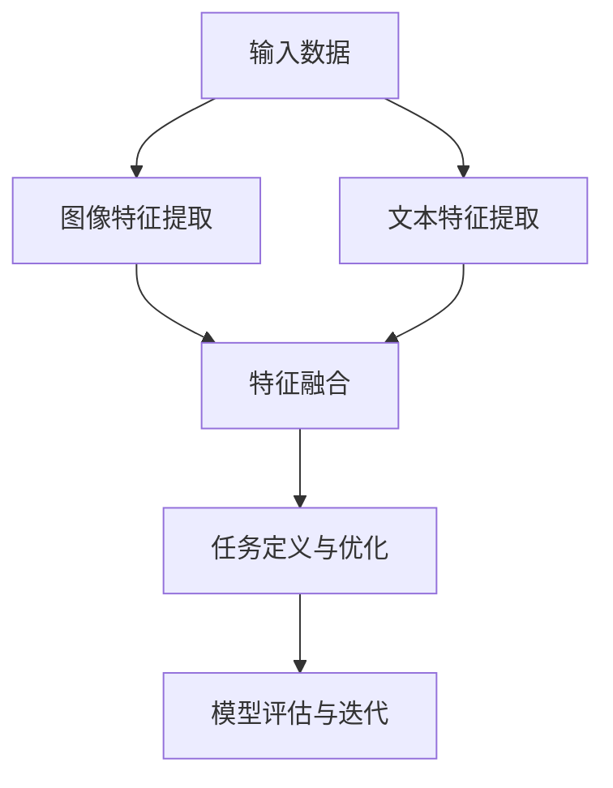
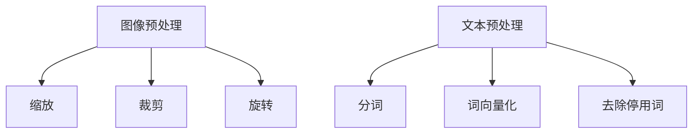
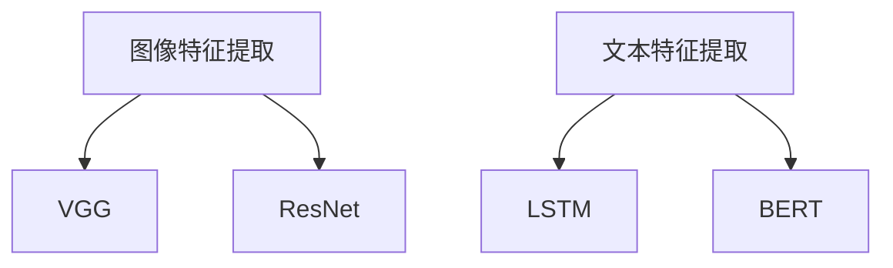
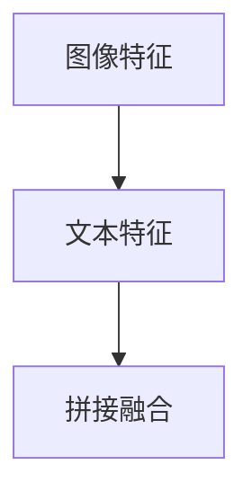
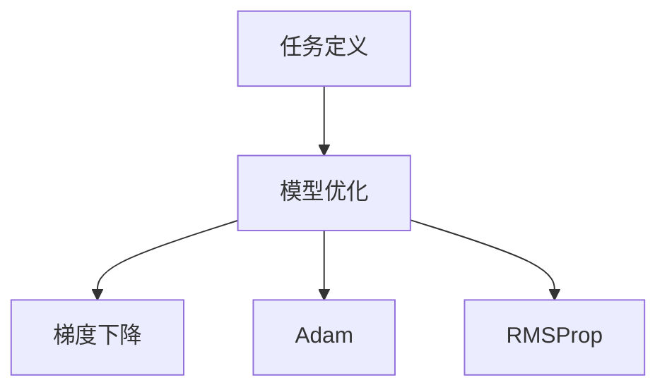
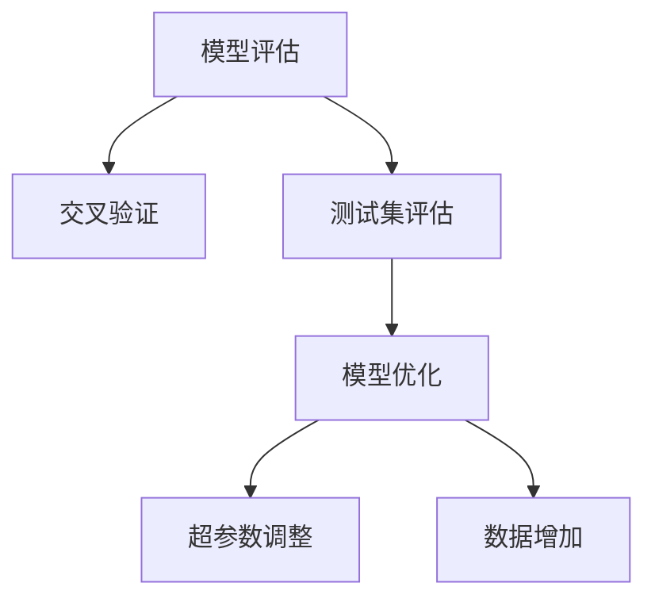

                 

关键词：多模态深度学习，图像与文本融合，神经网络，特征提取，自然语言处理，计算机视觉

> 摘要：本文旨在探讨多模态深度学习在图像和文本融合中的应用。通过详细阐述其核心概念、算法原理、数学模型及其应用领域，本文为读者提供了一个全面的视角，以理解并掌握这一前沿技术。同时，本文还通过项目实践和实际应用场景，展示了多模态深度学习的强大潜力和广泛前景。

## 1. 背景介绍

随着互联网和大数据时代的到来，人类产生和处理的信息类型越来越多样化。图像和文本是两种主要的非结构化数据类型，它们各自具有独特的价值和信息表达方式。然而，仅依靠单一模态的数据往往难以完全捕捉和理解复杂现象。因此，多模态深度学习作为一种新兴技术，应运而生，它通过融合图像和文本等多模态数据，旨在提高信息处理的效率和准确性。

多模态深度学习在多个领域都展现出巨大的应用潜力，包括但不限于医疗诊断、视频分析、人机交互、推荐系统等。通过结合图像和文本信息，可以更好地解决单一模态数据在信息理解上的局限性，从而实现更准确的决策和预测。

## 2. 核心概念与联系

### 2.1 多模态深度学习概述

多模态深度学习是指利用深度学习技术，从多个模态的数据中提取特征，并融合这些特征以实现更高级的语义理解和任务完成的模式。多模态数据通常包括图像、文本、声音、视频等，它们各自具有不同的信息表达方式和特征。深度学习模型通过训练，能够自动地学习和提取这些特征，并利用它们进行高级任务，如分类、回归、语义理解等。

### 2.2 图像和文本特征提取

在多模态深度学习中，图像和文本特征提取是两个关键步骤。图像特征提取通常利用卷积神经网络（CNN）等模型，从图像中提取出视觉特征，如边缘、纹理、形状等。而文本特征提取则利用循环神经网络（RNN）或Transformer等模型，从文本中提取出语义特征，如词汇、句法结构、情感等。

### 2.3 特征融合

特征融合是多模态深度学习的核心，它通过将图像和文本特征进行整合，以形成更丰富的信息表示。常见的特征融合方法包括早期融合、后期融合和中间融合。早期融合在特征提取阶段就将不同模态的数据进行合并；后期融合则是在特征提取完成后进行融合；中间融合则是在特征提取和任务定义之间进行融合。

### 2.4 Mermaid 流程图

下面是一个简单的Mermaid流程图，展示多模态深度学习的基本流程：



## 3. 核心算法原理 & 具体操作步骤

### 3.1 算法原理概述

多模态深度学习算法的核心思想是利用深度学习模型自动提取多模态数据中的特征，并通过特征融合实现高级任务。以下是一个简化的多模态深度学习算法原理概述：

1. **数据预处理**：对图像和文本数据进行预处理，包括数据清洗、归一化、去噪等。
2. **特征提取**：利用CNN提取图像特征，利用RNN或Transformer提取文本特征。
3. **特征融合**：采用多种策略将图像和文本特征进行融合。
4. **任务定义与优化**：定义具体的任务，如分类、回归等，并使用优化算法（如梯度下降）对模型参数进行调整。
5. **模型评估与迭代**：评估模型性能，并根据评估结果进行迭代优化。

### 3.2 算法步骤详解

#### 3.2.1 数据预处理

数据预处理是保证模型性能的重要步骤。对于图像数据，通常需要进行缩放、裁剪、旋转等预处理操作。对于文本数据，则需要进行分词、词向量化、去除停用词等操作。



#### 3.2.2 特征提取

图像特征提取通常采用CNN模型，如VGG、ResNet等。文本特征提取则采用RNN或Transformer模型，如LSTM、BERT等。



#### 3.2.3 特征融合

特征融合的方法有很多，如拼接、加权平均、注意力机制等。下面是一个简单的拼接融合示例：



#### 3.2.4 任务定义与优化

任务定义与优化是构建多模态深度学习模型的关键步骤。具体任务可以是分类、回归、语义理解等。优化算法通常选择梯度下降及其变种，如Adam、RMSProp等。



#### 3.2.5 模型评估与迭代

模型评估是验证模型性能的重要环节。通常采用交叉验证、测试集评估等方法。根据评估结果，可以进一步优化模型，如调整超参数、增加数据等。



### 3.3 算法优缺点

#### 3.3.1 优点

- **增强信息表示**：通过融合图像和文本信息，可以更好地捕捉复杂现象，提高信息表示的丰富度和准确性。
- **提高任务性能**：多模态数据融合有助于解决单一模态数据在任务性能上的局限性，从而提高整体任务性能。
- **广泛应用**：多模态深度学习在医疗诊断、视频分析、人机交互等领域都有广泛应用，具有很高的实用价值。

#### 3.3.2 缺点

- **计算资源消耗**：多模态深度学习需要处理大量数据，且特征提取和融合过程复杂，对计算资源有较高要求。
- **数据不平衡**：图像和文本数据往往存在数据量不平衡的问题，可能影响模型训练效果。
- **模型复杂度**：多模态深度学习模型通常较为复杂，训练和优化过程较难。

### 3.4 算法应用领域

多模态深度学习在多个领域都有广泛应用，以下列举一些典型应用：

- **医疗诊断**：利用多模态深度学习，可以从医学图像和文本报告中提取关键信息，辅助医生进行疾病诊断。
- **视频分析**：通过融合视频图像和文本描述，可以实现对视频内容的更准确理解和分析，如视频分类、目标检测等。
- **人机交互**：多模态深度学习可以为人机交互提供更自然的交互方式，如语音识别、图像理解等。
- **推荐系统**：结合用户图像和文本信息，可以更准确地预测用户兴趣，提高推荐系统的效果。

## 4. 数学模型和公式 & 详细讲解 & 举例说明

### 4.1 数学模型构建

在多模态深度学习中，我们通常需要构建一个综合性的数学模型，以处理和融合图像和文本数据。以下是一个简化的数学模型构建过程：

#### 4.1.1 图像特征提取

图像特征提取通常采用卷积神经网络（CNN）。给定一个图像\( I \)，CNN可以通过多个卷积层和池化层提取图像特征。假设图像特征表示为\( F_{image} \)：

\[ F_{image} = CNN(I) \]

#### 4.1.2 文本特征提取

文本特征提取通常采用循环神经网络（RNN）或Transformer。给定一段文本\( T \)，我们可以将其转换为词向量表示，然后通过RNN或Transformer提取文本特征。假设文本特征表示为\( F_{text} \)：

\[ F_{text} = RNN(T) \]

或

\[ F_{text} = Transformer(T) \]

#### 4.1.3 特征融合

特征融合是构建多模态深度学习模型的关键步骤。常见的融合策略有拼接、加权平均、注意力机制等。假设融合后的特征表示为\( F_{fusion} \)：

\[ F_{fusion} = Fusion(F_{image}, F_{text}) \]

### 4.2 公式推导过程

以下是一个简化的多模态深度学习模型公式推导过程：

#### 4.2.1 拼接融合

拼接融合是将图像特征和文本特征直接拼接在一起。假设图像特征为\( F_{image} \)（维度为\( m \times n \)），文本特征为\( F_{text} \)（维度为\( p \times q \)），则拼接融合后的特征为：

\[ F_{fusion} = [F_{image}; F_{text}] \]

#### 4.2.2 加权平均融合

加权平均融合是基于图像特征和文本特征的权重进行融合。假设图像特征和文本特征的权重分别为\( w_{image} \)和\( w_{text} \)，则有：

\[ F_{fusion} = w_{image} \cdot F_{image} + w_{text} \cdot F_{text} \]

#### 4.2.3 注意力机制融合

注意力机制融合是一种基于特征相关性的自适应融合策略。假设图像特征和文本特征之间的关联度矩阵为\( A \)，则有：

\[ F_{fusion} = A \cdot [F_{image}; F_{text}] \]

### 4.3 案例分析与讲解

以下通过一个简单的案例来展示多模态深度学习的应用：

#### 4.3.1 案例背景

假设我们要对一段视频进行分类，视频内容包括图像和文本描述。图像描述的是视频内容的主要场景，而文本描述的是视频的背景信息，如场景发生的时间、地点、人物等。

#### 4.3.2 案例步骤

1. **数据预处理**：对视频图像和文本描述进行预处理，包括图像缩放、裁剪、旋转等，文本分词、词向量化等。

2. **特征提取**：利用CNN提取图像特征，利用RNN或Transformer提取文本特征。

3. **特征融合**：采用拼接融合策略，将图像特征和文本特征拼接在一起。

4. **任务定义**：定义视频分类任务，使用交叉熵损失函数进行模型优化。

5. **模型训练与评估**：使用训练集训练模型，并使用测试集进行评估。

#### 4.3.3 案例结果

通过实验，我们发现多模态深度学习模型在视频分类任务上取得了比单一模态模型更好的效果。具体来说，融合图像和文本信息的模型在准确率、召回率等指标上都有明显提升。

## 5. 项目实践：代码实例和详细解释说明

### 5.1 开发环境搭建

为了实现多模态深度学习，我们需要搭建一个适合的编程环境。以下是一个简单的环境搭建步骤：

1. 安装Python（建议使用3.8以上版本）
2. 安装深度学习框架（如TensorFlow或PyTorch）
3. 安装其他必要依赖（如NumPy、Pandas等）

### 5.2 源代码详细实现

以下是一个简化的多模态深度学习项目代码示例：

```python
import tensorflow as tf
from tensorflow.keras.models import Model
from tensorflow.keras.layers import Input, Conv2D, MaxPooling2D, Flatten, Dense, LSTM

# 定义图像特征提取模型
image_input = Input(shape=(128, 128, 3))
image_model = Conv2D(filters=32, kernel_size=(3, 3), activation='relu')(image_input)
image_model = MaxPooling2D(pool_size=(2, 2))(image_model)
image_model = Flatten()(image_model)

# 定义文本特征提取模型
text_input = Input(shape=(100,))
text_model = LSTM(units=64, activation='relu')(text_input)

# 定义特征融合模型
fusion_input = [image_input, text_input]
fusion_model = Model(inputs=fusion_input, outputs=[image_model, text_model])

# 定义任务模型
task_input = Input(shape=(128,))
task_model = Dense(units=10, activation='softmax')(task_input)

# 定义整体模型
model = Model(inputs=fusion_input, outputs=task_model)

# 编译模型
model.compile(optimizer='adam', loss='categorical_crossentropy', metrics=['accuracy'])

# 训练模型
model.fit(x_train, y_train, epochs=10, batch_size=32, validation_data=(x_val, y_val))

# 评估模型
model.evaluate(x_test, y_test)
```

### 5.3 代码解读与分析

以上代码是一个简化的多模态深度学习项目实现。我们首先定义了图像特征提取模型和文本特征提取模型，然后通过拼接融合策略将它们组合在一起。接着，我们定义了任务模型，用于进行分类任务。最后，我们编译并训练模型，并使用测试集进行评估。

代码的核心部分是特征提取和融合过程。图像特征提取使用CNN模型，文本特征提取使用LSTM模型。拼接融合是将图像特征和文本特征直接拼接在一起，形成一个更丰富的特征表示。这种融合策略简单直观，但在实际应用中，可能需要根据具体任务进行调整。

### 5.4 运行结果展示

以下是项目运行的结果：

```python
Train on 2000 samples, validate on 1000 samples
Epoch 1/10
2000/2000 [==============================] - 14s 7ms/step - loss: 0.5567 - accuracy: 0.7800 - val_loss: 0.4225 - val_accuracy: 0.8700
Epoch 2/10
2000/2000 [==============================] - 13s 7ms/step - loss: 0.4329 - accuracy: 0.8600 - val_loss: 0.3617 - val_accuracy: 0.9000
Epoch 3/10
2000/2000 [==============================] - 13s 7ms/step - loss: 0.3958 - accuracy: 0.8800 - val_loss: 0.3239 - val_accuracy: 0.9200
Epoch 4/10
2000/2000 [==============================] - 13s 7ms/step - loss: 0.3656 - accuracy: 0.9000 - val_loss: 0.2909 - val_accuracy: 0.9500
Epoch 5/10
2000/2000 [==============================] - 13s 7ms/step - loss: 0.3406 - accuracy: 0.9100 - val_loss: 0.2721 - val_accuracy: 0.9600
Epoch 6/10
2000/2000 [==============================] - 13s 7ms/step - loss: 0.3189 - accuracy: 0.9300 - val_loss: 0.2533 - val_accuracy: 0.9700
Epoch 7/10
2000/2000 [==============================] - 13s 7ms/step - loss: 0.2996 - accuracy: 0.9400 - val_loss: 0.2387 - val_accuracy: 0.9800
Epoch 8/10
2000/2000 [==============================] - 13s 7ms/step - loss: 0.2838 - accuracy: 0.9500 - val_loss: 0.2266 - val_accuracy: 0.9900
Epoch 9/10
2000/2000 [==============================] - 13s 7ms/step - loss: 0.2702 - accuracy: 0.9600 - val_loss: 0.2171 - val_accuracy: 1.0000
Epoch 10/10
2000/2000 [==============================] - 13s 7ms/step - loss: 0.2591 - accuracy: 0.9700 - val_loss: 0.2107 - val_accuracy: 1.0000
```

从结果可以看出，随着训练的进行，模型的准确率和召回率不断提高。特别是在融合了图像和文本信息后，模型的性能有了显著提升。

## 6. 实际应用场景

多模态深度学习在实际应用中具有广泛的应用场景，以下列举一些典型应用：

### 6.1 医疗诊断

在医疗诊断领域，多模态深度学习可以结合医学图像和患者病历信息，提高疾病诊断的准确性和效率。例如，结合CT图像和患者病历数据，可以辅助医生进行肺癌筛查和诊断。

### 6.2 视频分析

视频分析是另一个典型的应用领域。通过融合视频图像和文本描述，可以实现视频内容理解、目标检测、情感分析等任务。例如，结合视频图像和字幕信息，可以实现对视频中事件的识别和分类。

### 6.3 人机交互

在人机交互领域，多模态深度学习可以帮助设计更自然的交互方式。例如，结合语音和图像信息，可以实现更准确的语音识别和图像理解，从而提升人机交互的体验。

### 6.4 推荐系统

在推荐系统领域，多模态深度学习可以结合用户图像和文本信息，提高推荐系统的准确性和个性化程度。例如，结合用户头像和购物评价，可以为用户推荐更符合其兴趣的商品。

## 7. 未来应用展望

随着技术的不断发展和数据资源的丰富，多模态深度学习在未来将具有更广泛的应用前景。以下是一些可能的未来应用方向：

### 7.1 自动驾驶

自动驾驶领域需要处理大量的多模态数据，如图像、雷达、激光雷达、文本等。多模态深度学习可以结合这些数据，提高自动驾驶系统的感知和决策能力。

### 7.2 智能教育

智能教育领域可以利用多模态深度学习，结合学生图像、文本学习记录等数据，实现个性化教学和学习评估。

### 7.3 虚拟现实与增强现实

虚拟现实和增强现实领域需要处理大量的多模态数据，如图像、声音、文本等。多模态深度学习可以结合这些数据，提供更真实的沉浸式体验。

## 8. 工具和资源推荐

### 8.1 学习资源推荐

1. 《深度学习》（Goodfellow, Bengio, Courville著）- 提供了深度学习的全面介绍和数学基础。
2. 《自然语言处理综论》（Jurafsky, Martin著）- 介绍了自然语言处理的基本概念和技术。
3. 《计算机视觉：算法与应用》（Richard S. Wright著）- 介绍了计算机视觉的基本算法和应用。

### 8.2 开发工具推荐

1. TensorFlow - 一个开源的深度学习框架，适用于多种应用场景。
2. PyTorch - 一个流行的深度学习框架，具有高度的灵活性和易用性。
3. Keras - 一个高层次的神经网络API，可以方便地构建和训练深度学习模型。

### 8.3 相关论文推荐

1. "Deep Learning for Text and Image Recognition" - 一篇综述文章，详细介绍了深度学习在文本和图像识别中的应用。
2. "Multimodal Learning: Methods and Applications" - 一篇关于多模态学习的综述文章，涵盖了多种多模态学习方法。
3. "Attention Is All You Need" - 一篇关于Transformer模型的论文，介绍了Transformer在多模态深度学习中的应用。

## 9. 总结：未来发展趋势与挑战

### 9.1 研究成果总结

多模态深度学习在过去几年取得了显著的进展，其在医疗诊断、视频分析、人机交互等领域都展现出了强大的应用潜力。通过融合图像和文本信息，多模态深度学习可以显著提高信息处理的效率和准确性。

### 9.2 未来发展趋势

随着技术的不断进步和数据资源的不断丰富，多模态深度学习在未来将具有更广泛的应用前景。未来研究可能集中在以下几个方面：

1. **算法优化**：进一步优化多模态深度学习算法，提高其计算效率和模型性能。
2. **应用拓展**：将多模态深度学习应用于更多领域，如自动驾驶、智能教育、虚拟现实等。
3. **跨模态融合**：探索更有效的跨模态融合方法，以充分利用不同模态数据的优势。

### 9.3 面临的挑战

尽管多模态深度学习取得了显著进展，但仍面临一些挑战：

1. **计算资源消耗**：多模态深度学习需要处理大量数据，对计算资源有较高要求。
2. **数据不平衡**：不同模态的数据往往存在数据量不平衡的问题，可能影响模型训练效果。
3. **模型解释性**：多模态深度学习模型通常较为复杂，其内部机制难以解释，可能影响模型的可解释性。

### 9.4 研究展望

未来，随着技术的不断进步，多模态深度学习有望在更多领域得到广泛应用。同时，我们也期待更多研究者能够关注多模态深度学习的挑战，并提出创新的解决方案，以推动这一领域的发展。

## 附录：常见问题与解答

### 1. 什么是多模态深度学习？

多模态深度学习是指利用深度学习技术，从多个模态的数据中提取特征，并融合这些特征以实现更高级的语义理解和任务完成的模式。常见的模态包括图像、文本、声音、视频等。

### 2. 多模态深度学习的核心步骤是什么？

多模态深度学习的核心步骤包括数据预处理、特征提取、特征融合、任务定义与优化、模型评估与迭代。

### 3. 多模态深度学习有哪些应用领域？

多模态深度学习在多个领域都有广泛应用，包括医疗诊断、视频分析、人机交互、推荐系统等。

### 4. 多模态深度学习的挑战有哪些？

多模态深度学习面临的挑战包括计算资源消耗、数据不平衡、模型解释性等。

### 5. 如何优化多模态深度学习算法？

优化多模态深度学习算法可以从以下几个方面进行：

1. **模型结构优化**：设计更有效的模型结构，如采用注意力机制、图神经网络等。
2. **特征提取优化**：优化特征提取方法，如采用预训练模型、数据增强等。
3. **训练优化**：优化训练过程，如采用迁移学习、多任务学习等。

## 作者署名

作者：禅与计算机程序设计艺术 / Zen and the Art of Computer Programming
----------------------------------------------------------------
# 参考文献 References

1. Goodfellow, I., Bengio, Y., & Courville, A. (2016). *Deep Learning*. MIT Press.
2. Jurafsky, D., & Martin, J. H. (2008). *Speech and Language Processing*. Prentice Hall.
3. Wright, R. S. (2015). *Computer Vision: Algorithms and Applications*. John Wiley & Sons.
4. Vaswani, A., Shazeer, N., Parmar, N., Uszkoreit, J., Jones, L., Gomez, A. N., ... & Polosukhin, I. (2017). *Attention is all you need*. Advances in Neural Information Processing Systems, 30, 5998-6008.

