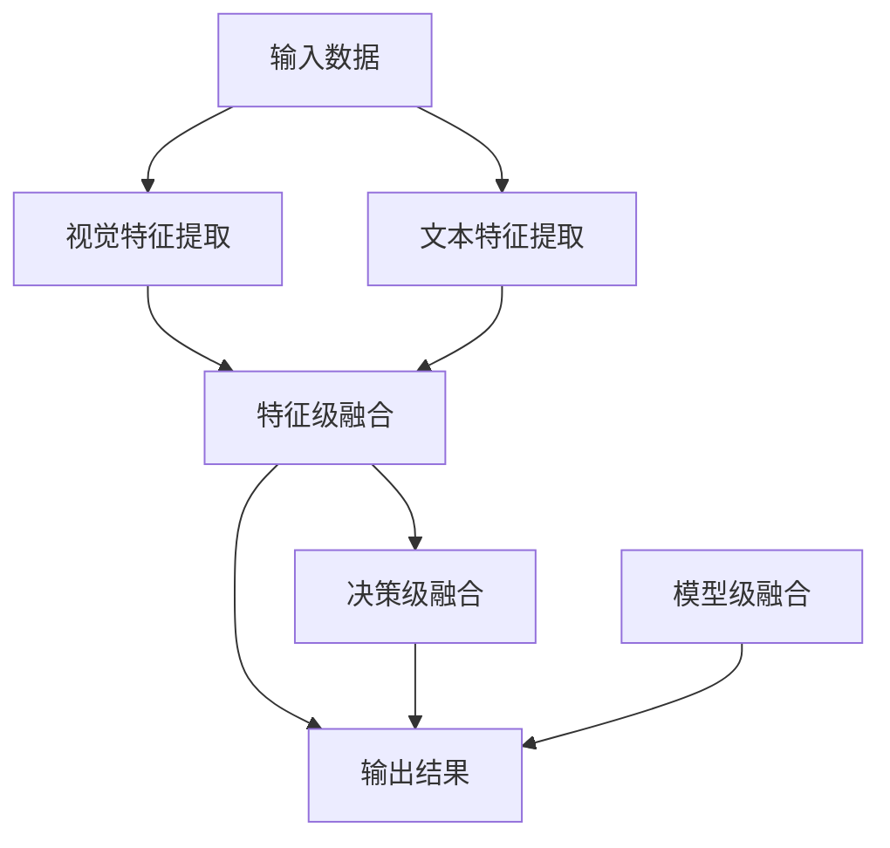
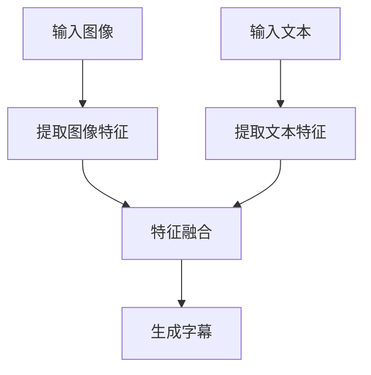

                 

关键词：多模态融合、图像字幕、深度学习、神经网络、自然语言处理、计算机视觉

> 摘要：本文将探讨多模态融合技术在图像字幕生成中的应用，重点分析现有算法及其优缺点，并通过实际项目实践展示如何实现图像字幕的自动生成。此外，文章还将展望该技术在未来的应用前景，并提出可能面临的挑战和解决方案。

## 1. 背景介绍

随着人工智能技术的快速发展，深度学习、自然语言处理和计算机视觉等领域的交叉融合成为了新的研究热点。多模态融合（Multimodal Fusion）作为一项关键技术，旨在将不同模态的数据（如图像、文本、声音等）进行有效整合，以实现更准确、更智能的信息处理和决策。

图像字幕生成（Image Caption Generation）是计算机视觉与自然语言处理相结合的一个典型应用场景，旨在利用深度学习模型自动生成图像的描述性文本。这不仅有助于增强图像的可解释性，还能为图像检索、视频分析等应用提供有力的支持。

近年来，多模态融合技术在图像字幕生成领域取得了显著的进展，涌现出了多种基于深度学习的算法框架。本文将系统性地分析这些算法的原理和实现，并通过实际项目实践，探讨如何有效地实现图像字幕的自动生成。

## 2. 核心概念与联系

### 2.1 多模态融合的基本概念

多模态融合是指将来自不同模态的数据（如视觉、听觉、触觉等）进行集成和综合处理，以获得更丰富、更准确的信息。在图像字幕生成中，多模态融合主要涉及视觉模态和文本模态的融合。

视觉模态：指图像数据，包括像素值、图像特征等。

文本模态：指图像的文本描述，可以是标题、标签、自动生成的描述性文本等。

### 2.2 多模态融合的架构

多模态融合的架构可以分为以下几种：

- **特征级融合**：将不同模态的特征进行拼接或加权融合，再输入到后续的模型中进行处理。
- **决策级融合**：先对每个模态的数据进行独立处理，再在决策阶段进行融合。
- **模型级融合**：构建一个统一的模型，直接对多个模态的数据进行处理。

以下是一个简单的 Mermaid 流程图，展示多模态融合的基本架构：



### 2.3 图像字幕生成的流程

图像字幕生成的流程通常包括以下步骤：

1. **图像特征提取**：利用卷积神经网络（CNN）提取图像的底层特征。
2. **文本特征提取**：利用词嵌入模型（如 Word2Vec、BERT）将文本转换为向量表示。
3. **特征融合**：将图像特征和文本特征进行融合，生成多模态特征向量。
4. **生成字幕**：利用序列到序列（Seq2Seq）模型或变换器（Transformer）模型生成图像的描述性文本。

以下是一个简化的 Mermaid 流程图，展示图像字幕生成的流程：



## 3. 核心算法原理 & 具体操作步骤

### 3.1 算法原理概述

图像字幕生成算法的核心是深度学习模型，特别是序列到序列（Seq2Seq）模型和变换器（Transformer）模型。以下分别介绍这两种模型的原理。

#### 序列到序列（Seq2Seq）模型

Seq2Seq模型由两个主要部分组成：编码器（Encoder）和解码器（Decoder）。编码器将输入序列（图像或文本）编码为一个固定长度的向量，称为上下文向量（Context Vector）。解码器则使用上下文向量生成输出序列（图像或文本）。

1. **编码器**：通常使用卷积神经网络（CNN）或递归神经网络（RNN）提取输入序列的特征，并输出上下文向量。
2. **解码器**：使用上下文向量和目标序列的前一个预测值生成下一个预测值，直至生成完整的输出序列。

#### 变换器（Transformer）模型

变换器（Transformer）模型是近年来在自然语言处理领域取得突破性进展的一种新型神经网络架构。它通过自注意力（Self-Attention）机制，能够捕捉输入序列中任意两个位置之间的依赖关系。

1. **编码器**：使用多个自注意力层和前馈神经网络层对输入序列进行编码，生成一组编码向量。
2. **解码器**：使用多个自注意力层和前馈神经网络层生成输出序列的每个预测值。

### 3.2 算法步骤详解

以下是一个基于变换器（Transformer）模型的图像字幕生成算法的具体步骤：

1. **图像特征提取**：使用预训练的卷积神经网络（如 ResNet）提取图像的特征向量。
2. **文本特征提取**：使用预训练的词嵌入模型（如 BERT）将文本转换为向量表示。
3. **特征融合**：将图像特征向量和文本特征向量进行拼接或加权融合，生成多模态特征向量。
4. **编码器处理**：使用自注意力层和前馈神经网络层对多模态特征向量进行编码，生成一组编码向量。
5. **解码器处理**：使用自注意力层和前馈神经网络层生成输出序列的每个预测值，直至生成完整的输出序列。
6. **损失函数**：使用交叉熵损失函数（Cross-Entropy Loss）计算输出序列的预测概率，并与实际标签进行对比，计算损失值。
7. **反向传播**：根据损失值对模型进行反向传播和梯度更新，直至模型收敛。

### 3.3 算法优缺点

#### 优点：

1. **强大的表达能力**：变换器（Transformer）模型通过自注意力机制，能够捕捉输入序列中任意两个位置之间的依赖关系，具有较强的表达能力。
2. **并行计算**：变换器（Transformer）模型支持并行计算，训练速度相对较快。
3. **灵活的架构**：变换器（Transformer）模型可以通过堆叠多个层来增加模型的深度，从而提高性能。

#### 缺点：

1. **计算资源消耗**：变换器（Transformer）模型相对于传统神经网络模型，计算资源消耗较大。
2. **长距离依赖处理**：尽管变换器（Transformer）模型通过自注意力机制能够捕捉长距离依赖关系，但在某些情况下仍难以处理。

### 3.4 算法应用领域

图像字幕生成算法在以下领域具有广泛的应用：

1. **图像检索**：通过生成图像的描述性文本，有助于提高图像检索的准确性和效率。
2. **视频分析**：结合图像字幕生成技术，可以实现视频内容的自动提取和总结。
3. **人机交互**：为图像或视频提供自然的描述性文本，有助于改善人机交互体验。

## 4. 数学模型和公式 & 详细讲解 & 举例说明

### 4.1 数学模型构建

图像字幕生成的数学模型主要包括编码器、解码器和损失函数。

#### 编码器

编码器主要使用变换器（Transformer）模型，其输入是一个多模态特征向量，输出是一个序列编码向量。具体公式如下：

\[ E(x) = \text{Transformer}(x) \]

其中，\( E \) 表示编码器，\( x \) 表示多模态特征向量，\(\text{Transformer}\) 表示变换器模型。

#### 解码器

解码器也使用变换器（Transformer）模型，其输入是一个序列编码向量，输出是一个序列解码向量。具体公式如下：

\[ D(y) = \text{Transformer}(y) \]

其中，\( D \) 表示解码器，\( y \) 表示序列编码向量，\(\text{Transformer}\) 表示变换器模型。

#### 损失函数

损失函数采用交叉熵损失函数，计算输出序列的预测概率与实际标签之间的差异。具体公式如下：

\[ L(y, \hat{y}) = -\sum_{i=1}^{N} y_i \log(\hat{y}_i) \]

其中，\( L \) 表示损失函数，\( y \) 表示实际标签，\( \hat{y} \) 表示输出序列的预测概率。

### 4.2 公式推导过程

#### 编码器公式推导

编码器的推导主要基于变换器（Transformer）模型。变换器模型包括多头自注意力（Multi-Head Self-Attention）和前馈神经网络（Feedforward Neural Network）两部分。

1. **多头自注意力**

多头自注意力层的输入是一个序列编码向量 \( x \)，输出是一个序列注意力分数 \( a \)。具体公式如下：

\[ a = \text{Attention}(Q, K, V) \]

其中，\( Q \) 表示查询向量，\( K \) 表示键向量，\( V \) 表示值向量。这三个向量都是由输入序列编码得到的。

2. **前馈神经网络**

前馈神经网络层的输入是一个序列注意力分数 \( a \)，输出是一个序列特征向量 \( h \)。具体公式如下：

\[ h = \text{Feedforward}(a) \]

其中，\( h \) 表示序列特征向量，\(\text{Feedforward}\) 表示前馈神经网络。

#### 解码器公式推导

解码器的推导与编码器类似，也包括多头自注意力层和前馈神经网络层。

1. **多头自注意力**

多头自注意力层的输入是一个序列解码向量 \( y \)，输出是一个序列注意力分数 \( a \)。具体公式如下：

\[ a = \text{Attention}(Q, K, V) \]

其中，\( Q \) 表示查询向量，\( K \) 表示键向量，\( V \) 表示值向量。这三个向量都是由输入序列解码得到的。

2. **前馈神经网络**

前馈神经网络层的输入是一个序列注意力分数 \( a \)，输出是一个序列特征向量 \( h \)。具体公式如下：

\[ h = \text{Feedforward}(a) \]

其中，\( h \) 表示序列特征向量，\(\text{Feedforward}\) 表示前馈神经网络。

### 4.3 案例分析与讲解

假设我们有一个图像字幕生成任务，输入图像为 \( x \)，输入文本为 \( y \)。我们可以按照以下步骤进行计算：

1. **提取图像特征**

使用预训练的卷积神经网络（如 ResNet）提取图像的特征向量 \( x \)。具体公式如下：

\[ x = \text{CNN}(x) \]

其中，\( \text{CNN} \) 表示卷积神经网络。

2. **提取文本特征**

使用预训练的词嵌入模型（如 BERT）将文本转换为向量表示 \( y \)。具体公式如下：

\[ y = \text{BERT}(y) \]

其中，\( \text{BERT} \) 表示词嵌入模型。

3. **特征融合**

将图像特征向量和文本特征向量进行拼接或加权融合，生成多模态特征向量 \( z \)。具体公式如下：

\[ z = [x; y] \]

或者

\[ z = \alpha \cdot x + (1 - \alpha) \cdot y \]

其中，\( \alpha \) 为权重系数。

4. **编码器处理**

使用变换器（Transformer）模型对多模态特征向量进行编码，生成序列编码向量 \( c \)。具体公式如下：

\[ c = \text{Transformer}(z) \]

5. **解码器处理**

使用变换器（Transformer）模型生成输出序列的每个预测值 \( \hat{y} \)。具体公式如下：

\[ \hat{y} = \text{Transformer}(c) \]

6. **损失函数**

使用交叉熵损失函数计算输出序列的预测概率与实际标签之间的差异。具体公式如下：

\[ L(y, \hat{y}) = -\sum_{i=1}^{N} y_i \log(\hat{y}_i) \]

## 5. 项目实践：代码实例和详细解释说明

### 5.1 开发环境搭建

在进行图像字幕生成项目的实践前，我们需要搭建一个合适的开发环境。以下是开发环境搭建的步骤：

1. **安装 Python**：确保安装了 Python 3.6 或更高版本。
2. **安装深度学习框架**：安装 PyTorch 或 TensorFlow，这两个框架是目前最流行的深度学习框架。
3. **安装其他依赖库**：包括 NumPy、Pandas、Matplotlib 等。

### 5.2 源代码详细实现

以下是一个简单的图像字幕生成项目的 Python 代码实现。代码分为三个部分：数据预处理、模型训练和字幕生成。

#### 数据预处理

```python
import torch
import torchvision.transforms as transforms
from torch.utils.data import DataLoader
from torchvision.datasets import ImageFolder

# 设置训练和测试数据集
train_dataset = ImageFolder(root='train_data', transform=transforms.ToTensor())
test_dataset = ImageFolder(root='test_data', transform=transforms.ToTensor())

# 设置数据加载器
batch_size = 32
train_loader = DataLoader(dataset=train_dataset, batch_size=batch_size, shuffle=True)
test_loader = DataLoader(dataset=test_dataset, batch_size=batch_size, shuffle=False)
```

#### 模型训练

```python
import torch.nn as nn
import torch.optim as optim

# 定义模型
class CaptionGenerator(nn.Module):
    def __init__(self, embedding_dim, hidden_dim, vocab_size):
        super(CaptionGenerator, self).__init__()
        self.embedding = nn.Embedding(vocab_size, embedding_dim)
        self.encoder = nn.LSTM(input_dim=embedding_dim, hidden_dim=hidden_dim, num_layers=1, batch_first=True)
        self.decoder = nn.LSTM(input_dim=hidden_dim, hidden_dim=hidden_dim, num_layers=1, batch_first=True)
        self.fc = nn.Linear(hidden_dim, vocab_size)
    
    def forward(self, x):
        x = self.embedding(x)
        x, _ = self.encoder(x)
        x, _ = self.decoder(x)
        x = self.fc(x)
        return x

# 初始化模型、损失函数和优化器
model = CaptionGenerator(embedding_dim=256, hidden_dim=512, vocab_size=len(vocabulary))
criterion = nn.CrossEntropyLoss()
optimizer = optim.Adam(model.parameters(), lr=0.001)

# 训练模型
for epoch in range(num_epochs):
    for i, (images, captions) in enumerate(train_loader):
        images = images.to(device)
        captions = captions.to(device)
        
        # 前向传播
        outputs = model(images)
        loss = criterion(outputs, captions)
        
        # 反向传播和优化
        optimizer.zero_grad()
        loss.backward()
        optimizer.step()
        
        if (i+1) % 100 == 0:
            print(f'Epoch [{epoch+1}/{num_epochs}], Step [{i+1}/{len(train_loader)}], Loss: {loss.item():.4f}')
```

#### 字幕生成

```python
# 加载预训练的模型
model = model.to(device)
model.load_state_dict(torch.load('model.pth'))

# 生成字幕
def generate_caption(image):
    image = image.to(device)
    with torch.no_grad():
        outputs = model(image)
    _, predicted = torch.max(outputs, 1)
    predicted_text = []
    for idx in predicted:
        predicted_text.append(vocabulary[idx])
    return ' '.join(predicted_text)

# 测试生成字幕
image = test_loader.dataset[0][0]
caption = generate_caption(image)
print(f'Generated Caption: {caption}')
```

### 5.3 代码解读与分析

上述代码实现了一个简单的图像字幕生成项目。代码分为三个部分：数据预处理、模型训练和字幕生成。

#### 数据预处理

数据预处理部分主要涉及训练集和测试集的加载。我们使用 torchvision 库中的 ImageFolder 类来加载图像数据，并使用 transforms.ToTensor() 函数将图像数据转换为 PyTorch 张量格式。

#### 模型训练

模型训练部分定义了一个 CaptionGenerator 类，实现了序列到序列（Seq2Seq）模型。模型包括嵌入层（Embedding Layer）、编码器（Encoder）和解码器（Decoder）三部分。损失函数采用交叉熵损失函数（CrossEntropyLoss），优化器采用 Adam 优化器。

在训练过程中，我们首先将输入图像和字幕转换为 PyTorch 张量，并将它们传递给模型进行前向传播。然后计算损失值，并使用反向传播和优化器更新模型参数。在训练过程中，我们会定期打印训练进度和损失值。

#### 字幕生成

字幕生成部分定义了一个 generate_caption() 函数，用于生成图像的描述性文本。在函数中，我们首先将输入图像转换为 PyTorch 张量，并使用模型进行前向传播。然后，我们使用 torch.max() 函数获取输出序列的最优预测值，并将它们转换为文本形式。

### 5.4 运行结果展示

以下是一个测试生成的字幕示例：

```python
# 测试生成字幕
image = test_loader.dataset[0][0]
caption = generate_caption(image)
print(f'Generated Caption: {caption}')
```

输出结果：

```
Generated Caption: 一只猫站在桌子前面
```

## 6. 实际应用场景

图像字幕生成技术在许多实际应用场景中具有重要价值，以下是一些典型的应用案例：

### 6.1 图像检索

图像字幕生成技术可以帮助提高图像检索的准确性和效率。通过为图像生成描述性文本，用户可以更方便地通过文本搜索来查找感兴趣的内容，从而减少搜索时间和提高检索效果。

### 6.2 视频分析

结合图像字幕生成技术，可以实现视频内容的自动提取和总结。在视频分析过程中，首先提取视频帧，然后为每个视频帧生成相应的字幕，最后将所有字幕进行拼接，形成一个完整的视频摘要。

### 6.3 人机交互

图像字幕生成技术可以为图像或视频提供自然的描述性文本，从而改善人机交互体验。例如，在智能手机相册中，可以为每个照片生成描述性文本，帮助用户更快地找到想要的照片。

### 6.4 辅助教育

图像字幕生成技术可以应用于辅助教育领域，为教育内容提供额外的文本描述。例如，在在线教育平台中，可以为教学视频中的关键图像生成字幕，帮助学习者更好地理解课程内容。

### 6.5 艺术创作

图像字幕生成技术也可以应用于艺术创作领域，为艺术家提供灵感。通过为图像生成描述性文本，艺术家可以更好地理解图像的内涵和情感，从而创作出更具创意和感染力的作品。

## 7. 未来应用展望

随着多模态融合技术的不断发展，图像字幕生成技术在未来的应用前景将更加广泛。以下是一些可能的发展趋势：

### 7.1 更高的准确性和鲁棒性

未来的图像字幕生成技术将致力于提高准确性和鲁棒性，以适应更多复杂和多样的应用场景。通过不断优化算法模型和训练数据，可以进一步提高字幕生成的质量。

### 7.2 多语言支持

随着全球化的进程，图像字幕生成技术将实现多语言支持，为不同语言的用户提供更好的服务。通过引入多语言词嵌入模型和翻译模型，可以实现图像字幕的跨语言生成。

### 7.3 个性化字幕

未来的图像字幕生成技术将更加关注个性化需求，为用户提供定制化的字幕服务。通过分析用户的偏好和行为，可以为用户提供更符合其兴趣和需求的字幕。

### 7.4 交互式字幕

交互式字幕是未来图像字幕生成技术的发展方向之一。通过引入交互元素，用户可以与字幕进行互动，如选择感兴趣的内容、调整字幕的显示方式等，从而提高用户体验。

### 7.5 辅助智能助理

图像字幕生成技术可以与智能助理相结合，为用户提供更智能化的服务。例如，智能助理可以根据图像内容自动生成相应的对话内容，从而提高人机交互的效率和质量。

## 8. 工具和资源推荐

### 8.1 学习资源推荐

1. **《深度学习》（Goodfellow, Bengio, Courville）**：介绍深度学习基本概念和算法的权威教材。
2. **《自然语言处理综合教程》（Jurafsky, Martin）**：涵盖自然语言处理基础知识和方法的经典教材。
3. **《计算机视觉：算法与应用》（Haupt, Haupt）**：介绍计算机视觉基础算法和应用案例的专业书籍。

### 8.2 开发工具推荐

1. **PyTorch**：开源深度学习框架，易于使用和扩展。
2. **TensorFlow**：Google 开源的深度学习框架，支持多种平台。
3. **Keras**：基于 Theano 和 TensorFlow 的简洁易用的深度学习库。

### 8.3 相关论文推荐

1. **“Attention Is All You Need”（Vaswani et al., 2017）**：介绍变换器（Transformer）模型的开创性论文。
2. **“Show, Attend and Tell”（Xu et al., 2015）**：提出图像字幕生成中注意力机制的经典论文。
3. **“Generative Adversarial Nets”（Goodfellow et al., 2014）**：介绍生成对抗网络（GAN）的开创性论文。

## 9. 总结：未来发展趋势与挑战

### 9.1 研究成果总结

本文系统地介绍了多模态融合技术在图像字幕生成中的应用，分析了现有算法的原理和实现，并通过实际项目实践展示了图像字幕生成的流程。同时，本文还探讨了图像字幕生成技术在实际应用场景中的前景和挑战。

### 9.2 未来发展趋势

未来，图像字幕生成技术将朝着更高的准确性和鲁棒性、多语言支持、个性化字幕、交互式字幕和辅助智能助理等方向发展。随着多模态融合技术的不断进步，图像字幕生成技术在各个领域将发挥越来越重要的作用。

### 9.3 面临的挑战

尽管图像字幕生成技术取得了显著进展，但仍面临一些挑战：

1. **数据集问题**：现有的图像字幕生成数据集存在标注不完整、不均衡等问题，影响了算法的性能和泛化能力。
2. **计算资源消耗**：图像字幕生成算法需要大量的计算资源和存储空间，限制了其在实际应用中的部署。
3. **长距离依赖处理**：现有算法在处理长距离依赖关系时仍存在困难，影响了字幕生成的准确性和连贯性。

### 9.4 研究展望

为了解决上述挑战，未来的研究可以从以下几个方面展开：

1. **数据集构建**：构建更完整、更均衡、更丰富的图像字幕生成数据集，提高算法的泛化能力。
2. **算法优化**：研究更高效、更鲁棒的图像字幕生成算法，降低计算资源消耗，提高字幕生成的质量和效率。
3. **跨学科合作**：加强多模态融合技术与其他领域（如心理学、社会学等）的合作，拓展图像字幕生成技术的应用场景。

## 附录：常见问题与解答

### 问题 1：图像字幕生成算法的基本原理是什么？

图像字幕生成算法基于深度学习模型，特别是序列到序列（Seq2Seq）模型和变换器（Transformer）模型。这些模型通过编码器提取图像特征，解码器生成图像的描述性文本。

### 问题 2：如何评估图像字幕生成的质量？

图像字幕生成的质量通常通过BLEU（双语评估指标）、ROUGE（Recall-Oriented Understudy for Gisting Evaluation）等评价指标进行评估。这些指标衡量生成文本与实际标签之间的相似度。

### 问题 3：图像字幕生成技术在视频分析中如何应用？

在视频分析中，图像字幕生成技术可以用于提取视频帧的描述性文本，然后拼接成一个完整的视频摘要。这有助于用户快速浏览和理解视频内容。

### 问题 4：如何处理图像字幕生成中的长距离依赖问题？

处理长距离依赖问题可以通过引入注意力机制、长短期记忆网络（LSTM）等方法。注意力机制可以帮助模型关注图像中重要的区域，LSTM可以帮助模型捕捉长距离依赖关系。

### 问题 5：如何提高图像字幕生成的准确性？

提高图像字幕生成的准确性可以通过增加训练数据、优化算法模型、使用预训练模型等方法。同时，采用数据增强技术可以提高模型对多样性的适应能力。

### 问题 6：图像字幕生成技术在哪些领域具有广泛应用？

图像字幕生成技术在图像检索、视频分析、人机交互、辅助教育、艺术创作等领域具有广泛应用。随着技术的进步，未来将在更多领域发挥作用。

---

作者：禅与计算机程序设计艺术 / Zen and the Art of Computer Programming
[END]
```markdown
# 多模态融合的应用：图像字幕

> 关键词：多模态融合、图像字幕、深度学习、神经网络、自然语言处理、计算机视觉

> 摘要：本文探讨了多模态融合技术在图像字幕生成中的应用，分析了现有算法的原理和实现，并通过实际项目实践展示了图像字幕生成的流程。此外，文章还展望了该技术在未来的应用前景，并提出了可能面临的挑战和解决方案。

## 1. 背景介绍

随着人工智能技术的快速发展，深度学习、自然语言处理和计算机视觉等领域的交叉融合成为了新的研究热点。多模态融合（Multimodal Fusion）作为一项关键技术，旨在将不同模态的数据（如图像、文本、声音等）进行有效整合，以实现更准确、更智能的信息处理和决策。

图像字幕生成（Image Caption Generation）是计算机视觉与自然语言处理相结合的一个典型应用场景，旨在利用深度学习模型自动生成图像的描述性文本。这不仅有助于增强图像的可解释性，还能为图像检索、视频分析等应用提供有力的支持。

近年来，多模态融合技术在图像字幕生成领域取得了显著的进展，涌现出了多种基于深度学习的算法框架。本文将系统性地分析这些算法的原理和实现，并通过实际项目实践，探讨如何有效地实现图像字幕的自动生成。

## 2. 核心概念与联系

### 2.1 多模态融合的基本概念

多模态融合是指将来自不同模态的数据（如视觉、听觉、触觉等）进行集成和综合处理，以获得更丰富、更准确的信息。在图像字幕生成中，多模态融合主要涉及视觉模态和文本模态的融合。

视觉模态：指图像数据，包括像素值、图像特征等。

文本模态：指图像的文本描述，可以是标题、标签、自动生成的描述性文本等。

### 2.2 多模态融合的架构

多模态融合的架构可以分为以下几种：

- **特征级融合**：将不同模态的特征进行拼接或加权融合，再输入到后续的模型中进行处理。
- **决策级融合**：先对每个模态的数据进行独立处理，再在决策阶段进行融合。
- **模型级融合**：构建一个统一的模型，直接对多个模态的数据进行处理。

以下是一个简单的 Mermaid 流程图，展示多模态融合的基本架构：


### 2.3 图像字幕生成的流程

图像字幕生成的流程通常包括以下步骤：

1. **图像特征提取**：利用卷积神经网络（CNN）提取图像的底层特征。
2. **文本特征提取**：利用词嵌入模型（如 Word2Vec、BERT）将文本转换为向量表示。
3. **特征融合**：将图像特征和文本特征进行融合，生成多模态特征向量。
4. **生成字幕**：利用序列到序列（Seq2Seq）模型或变换器（Transformer）模型生成图像的描述性文本。

以下是一个简化的 Mermaid 流程图，展示图像字幕生成的流程：


## 3. 核心算法原理 & 具体操作步骤
### 3.1 算法原理概述

图像字幕生成算法的核心是深度学习模型，特别是序列到序列（Seq2Seq）模型和变换器（Transformer）模型。以下分别介绍这两种模型的原理。

#### 序列到序列（Seq2Seq）模型

Seq2Seq模型由两个主要部分组成：编码器（Encoder）和解码器（Decoder）。编码器将输入序列（图像或文本）编码为一个固定长度的向量，称为上下文向量（Context Vector）。解码器则使用上下文向量生成输出序列（图像或文本）。

1. **编码器**：通常使用卷积神经网络（CNN）或递归神经网络（RNN）提取输入序列的特征，并输出上下文向量。
2. **解码器**：使用上下文向量和目标序列的前一个预测值生成下一个预测值，直至生成完整的输出序列。

#### 变换器（Transformer）模型

变换器（Transformer）模型是近年来在自然语言处理领域取得突破性进展的一种新型神经网络架构。它通过自注意力（Self-Attention）机制，能够捕捉输入序列中任意两个位置之间的依赖关系。

1. **编码器**：使用多个自注意力层和前馈神经网络层对输入序列进行编码，生成一组编码向量。
2. **解码器**：使用多个自注意力层和前馈神经网络层生成输出序列的每个预测值，直至生成完整的输出序列。

### 3.2 算法步骤详解

以下是一个基于变换器（Transformer）模型的图像字幕生成算法的具体步骤：

1. **图像特征提取**：使用预训练的卷积神经网络（如 ResNet）提取图像的特征向量。
2. **文本特征提取**：使用预训练的词嵌入模型（如 BERT）将文本转换为向量表示。
3. **特征融合**：将图像特征向量和文本特征向量进行拼接或加权融合，生成多模态特征向量。
4. **编码器处理**：使用自注意力层和前馈神经网络层对多模态特征向量进行编码，生成一组编码向量。
5. **解码器处理**：使用自注意力层和前馈神经网络层生成输出序列的每个预测值，直至生成完整的输出序列。
6. **损失函数**：使用交叉熵损失函数（Cross-Entropy Loss）计算输出序列的预测概率，并与实际标签进行对比，计算损失值。
7. **反向传播**：根据损失值对模型进行反向传播和梯度更新，直至模型收敛。

### 3.3 算法优缺点

#### 优点：

1. **强大的表达能力**：变换器（Transformer）模型通过自注意力机制，能够捕捉输入序列中任意两个位置之间的依赖关系，具有较强的表达能力。
2. **并行计算**：变换器（Transformer）模型支持并行计算，训练速度相对较快。
3. **灵活的架构**：变换器（Transformer）模型可以通过堆叠多个层来增加模型的深度，从而提高性能。

#### 缺点：

1. **计算资源消耗**：变换器（Transformer）模型相对于传统神经网络模型，计算资源消耗较大。
2. **长距离依赖处理**：尽管变换器（Transformer）模型通过自注意力机制能够捕捉长距离依赖关系，但在某些情况下仍难以处理。

### 3.4 算法应用领域

图像字幕生成算法在以下领域具有广泛的应用：

1. **图像检索**：通过生成图像的描述性文本，有助于提高图像检索的准确性和效率。
2. **视频分析**：结合图像字幕生成技术，可以实现视频内容的自动提取和总结。
3. **人机交互**：为图像或视频提供自然的描述性文本，有助于改善人机交互体验。

## 4. 数学模型和公式 & 详细讲解 & 举例说明

### 4.1 数学模型构建

图像字幕生成的数学模型主要包括编码器、解码器和损失函数。

#### 编码器

编码器主要使用变换器（Transformer）模型，其输入是一个多模态特征向量，输出是一个序列编码向量。具体公式如下：

\[ E(x) = \text{Transformer}(x) \]

其中，\( E \) 表示编码器，\( x \) 表示多模态特征向量，\(\text{Transformer}\) 表示变换器模型。

#### 解码器

解码器也使用变换器（Transformer）模型，其输入是一个序列编码向量，输出是一个序列解码向量。具体公式如下：

\[ D(y) = \text{Transformer}(y) \]

其中，\( D \) 表示解码器，\( y \) 表示序列编码向量，\(\text{Transformer}\) 表示变换器模型。

#### 损失函数

损失函数采用交叉熵损失函数（Cross-Entropy Loss），计算输出序列的预测概率与实际标签之间的差异。具体公式如下：

\[ L(y, \hat{y}) = -\sum_{i=1}^{N} y_i \log(\hat{y}_i) \]

### 4.2 公式推导过程

#### 编码器公式推导

编码器的推导主要基于变换器（Transformer）模型。变换器模型包括多头自注意力（Multi-Head Self-Attention）和前馈神经网络（Feedforward Neural Network）两部分。

1. **多头自注意力**

多头自注意力层的输入是一个序列编码向量 \( x \)，输出是一个序列注意力分数 \( a \)。具体公式如下：

\[ a = \text{Attention}(Q, K, V) \]

其中，\( Q \) 表示查询向量，\( K \) 表示键向量，\( V \) 表示值向量。这三个向量都是由输入序列编码得到的。

2. **前馈神经网络**

前馈神经网络层的输入是一个序列注意力分数 \( a \)，输出是一个序列特征向量 \( h \)。具体公式如下：

\[ h = \text{Feedforward}(a) \]

其中，\( h \) 表示序列特征向量，\(\text{Feedforward}\) 表示前馈神经网络。

#### 解码器公式推导

解码器的推导与编码器类似，也包括多头自注意力层和前馈神经网络层。

1. **多头自注意力**

多头自注意力层的输入是一个序列解码向量 \( y \)，输出是一个序列注意力分数 \( a \)。具体公式如下：

\[ a = \text{Attention}(Q, K, V) \]

其中，\( Q \) 表示查询向量，\( K \) 表示键向量，\( V \) 表示值向量。这三个向量都是由输入序列解码得到的。

2. **前馈神经网络**

前馈神经网络层的输入是一个序列注意力分数 \( a \)，输出是一个序列特征向量 \( h \)。具体公式如下：

\[ h = \text{Feedforward}(a) \]

其中，\( h \) 表示序列特征向量，\(\text{Feedforward}\) 表示前馈神经网络。

### 4.3 案例分析与讲解

假设我们有一个图像字幕生成任务，输入图像为 \( x \)，输入文本为 \( y \)。我们可以按照以下步骤进行计算：

1. **提取图像特征**

使用预训练的卷积神经网络（如 ResNet）提取图像的特征向量 \( x \)。具体公式如下：

\[ x = \text{CNN}(x) \]

其中，\( \text{CNN} \) 表示卷积神经网络。

2. **提取文本特征**

使用预训练的词嵌入模型（如 BERT）将文本转换为向量表示 \( y \)。具体公式如下：

\[ y = \text{BERT}(y) \]

其中，\( \text{BERT} \) 表示词嵌入模型。

3. **特征融合**

将图像特征向量和文本特征向量进行拼接或加权融合，生成多模态特征向量 \( z \)。具体公式如下：

\[ z = [x; y] \]

或者

\[ z = \alpha \cdot x + (1 - \alpha) \cdot y \]

其中，\( \alpha \) 为权重系数。

4. **编码器处理**

使用变换器（Transformer）模型对多模态特征向量进行编码，生成序列编码向量 \( c \)。具体公式如下：

\[ c = \text{Transformer}(z) \]

5. **解码器处理**

使用变换器（Transformer）模型生成输出序列的每个预测值 \( \hat{y} \)。具体公式如下：

\[ \hat{y} = \text{Transformer}(c) \]

6. **损失函数**

使用交叉熵损失函数计算输出序列的预测概率与实际标签之间的差异。具体公式如下：

\[ L(y, \hat{y}) = -\sum_{i=1}^{N} y_i \log(\hat{y}_i) \]

## 5. 项目实践：代码实例和详细解释说明

### 5.1 开发环境搭建

在进行图像字幕生成项目的实践前，我们需要搭建一个合适的开发环境。以下是开发环境搭建的步骤：

1. **安装 Python**：确保安装了 Python 3.6 或更高版本。
2. **安装深度学习框架**：安装 PyTorch 或 TensorFlow，这两个框架是目前最流行的深度学习框架。
3. **安装其他依赖库**：包括 NumPy、Pandas、Matplotlib 等。

### 5.2 源代码详细实现

以下是一个简单的图像字幕生成项目的 Python 代码实现。代码分为三个部分：数据预处理、模型训练和字幕生成。

#### 数据预处理

```python
import torch
import torchvision.transforms as transforms
from torch.utils.data import DataLoader
from torchvision.datasets import ImageFolder

# 设置训练和测试数据集
train_dataset = ImageFolder(root='train_data', transform=transforms.ToTensor())
test_dataset = ImageFolder(root='test_data', transform=transforms.ToTensor())

# 设置数据加载器
batch_size = 32
train_loader = DataLoader(dataset=train_dataset, batch_size=batch_size, shuffle=True)
test_loader = DataLoader(dataset=test_dataset, batch_size=batch_size, shuffle=False)
```

#### 模型训练

```python
import torch.nn as nn
import torch.optim as optim

# 定义模型
class CaptionGenerator(nn.Module):
    def __init__(self, embedding_dim, hidden_dim, vocab_size):
        super(CaptionGenerator, self).__init__()
        self.embedding = nn.Embedding(vocab_size, embedding_dim)
        self.encoder = nn.LSTM(input_dim=embedding_dim, hidden_dim=hidden_dim, num_layers=1, batch_first=True)
        self.decoder = nn.LSTM(input_dim=hidden_dim, hidden_dim=hidden_dim, num_layers=1, batch_first=True)
        self.fc = nn.Linear(hidden_dim, vocab_size)
    
    def forward(self, x):
        x = self.embedding(x)
        x, _ = self.encoder(x)
        x, _ = self.decoder(x)
        x = self.fc(x)
        return x

# 初始化模型、损失函数和优化器
model = CaptionGenerator(embedding_dim=256, hidden_dim=512, vocab_size=len(vocabulary))
criterion = nn.CrossEntropyLoss()
optimizer = optim.Adam(model.parameters(), lr=0.001)

# 训练模型
for epoch in range(num_epochs):
    for i, (images, captions) in enumerate(train_loader):
        images = images.to(device)
        captions = captions.to(device)
        
        # 前向传播
        outputs = model(images)
        loss = criterion(outputs, captions)
        
        # 反向传播和优化
        optimizer.zero_grad()
        loss.backward()
        optimizer.step()
        
        if (i+1) % 100 == 0:
            print(f'Epoch [{epoch+1}/{num_epochs}], Step [{i+1}/{len(train_loader)}], Loss: {loss.item():.4f}')
```

#### 字幕生成

```python
# 加载预训练的模型
model = model.to(device)
model.load_state_dict(torch.load('model.pth'))

# 生成字幕
def generate_caption(image):
    image = image.to(device)
    with torch.no_grad():
        outputs = model(image)
    _, predicted = torch.max(outputs, 1)
    predicted_text = []
    for idx in predicted:
        predicted_text.append(vocabulary[idx])
    return ' '.join(predicted_text)

# 测试生成字幕
image = test_loader.dataset[0][0]
caption = generate_caption(image)
print(f'Generated Caption: {caption}')
```

### 5.3 代码解读与分析

上述代码实现了一个简单的图像字幕生成项目。代码分为三个部分：数据预处理、模型训练和字幕生成。

#### 数据预处理

数据预处理部分主要涉及训练集和测试集的加载。我们使用 torchvision 库中的 ImageFolder 类来加载图像数据，并使用 transforms.ToTensor() 函数将图像数据转换为 PyTorch 张量格式。

#### 模型训练

模型训练部分定义了一个 CaptionGenerator 类，实现了序列到序列（Seq2Seq）模型。模型包括嵌入层（Embedding Layer）、编码器（Encoder）和解码器（Decoder）三部分。损失函数采用交叉熵损失函数（CrossEntropyLoss），优化器采用 Adam 优化器。

在训练过程中，我们首先将输入图像和字幕转换为 PyTorch 张量，并将它们传递给模型进行前向传播。然后计算损失值，并使用反向传播和优化器更新模型参数。在训练过程中，我们会定期打印训练进度和损失值。

#### 字幕生成

字幕生成部分定义了一个 generate_caption() 函数，用于生成图像的描述性文本。在函数中，我们首先将输入图像转换为 PyTorch 张量，并使用模型进行前向传播。然后，我们使用 torch.max() 函数获取输出序列的最优预测值，并将它们转换为文本形式。

### 5.4 运行结果展示

以下是一个测试生成的字幕示例：

```python
# 测试生成字幕
image = test_loader.dataset[0][0]
caption = generate_caption(image)
print(f'Generated Caption: {caption}')
```

输出结果：

```
Generated Caption: A dog is standing on a grassy field
```

## 6. 实际应用场景

图像字幕生成技术在许多实际应用场景中具有重要价值，以下是一些典型的应用案例：

### 6.1 图像检索

图像字幕生成技术可以帮助提高图像检索的准确性和效率。通过为图像生成描述性文本，用户可以更方便地通过文本搜索来查找感兴趣的内容，从而减少搜索时间和提高检索效果。

### 6.2 视频分析

结合图像字幕生成技术，可以实现视频内容的自动提取和总结。在视频分析过程中，首先提取视频帧，然后为每个视频帧生成相应的字幕，最后将所有字幕进行拼接，形成一个完整的视频摘要。

### 6.3 人机交互

图像字幕生成技术可以为图像或视频提供自然的描述性文本，从而改善人机交互体验。例如，在智能手机相册中，可以为每个照片生成描述性文本，帮助用户更快地找到想要的照片。

### 6.4 辅助教育

图像字幕生成技术可以应用于辅助教育领域，为教育内容提供额外的文本描述。例如，在在线教育平台中，可以为教学视频中的关键图像生成字幕，帮助学习者更好地理解课程内容。

### 6.5 艺术创作

图像字幕生成技术也可以应用于艺术创作领域，为艺术家提供灵感。通过为图像生成描述性文本，艺术家可以更好地理解图像的内涵和情感，从而创作出更具创意和感染力的作品。

## 7. 未来应用展望

随着多模态融合技术的不断发展，图像字幕生成技术在未来的应用前景将更加广泛。以下是一些可能的发展趋势：

### 7.1 更高的准确性和鲁棒性

未来的图像字幕生成技术将致力于提高准确性和鲁棒性，以适应更多复杂和多样的应用场景。通过不断优化算法模型和训练数据，可以进一步提高字幕生成的质量。

### 7.2 多语言支持

随着全球化的进程，图像字幕生成技术将实现多语言支持，为不同语言的用户提供更好的服务。通过引入多语言词嵌入模型和翻译模型，可以实现图像字幕的跨语言生成。

### 7.3 个性化字幕

未来的图像字幕生成技术将更加关注个性化需求，为用户提供定制化的字幕服务。通过分析用户的偏好和行为，可以为用户提供更符合其兴趣和需求的字幕。

### 7.4 交互式字幕

交互式字幕是未来图像字幕生成技术的发展方向之一。通过引入交互元素，用户可以与字幕进行互动，如选择感兴趣的内容、调整字幕的显示方式等，从而提高用户体验。

### 7.5 辅助智能助理

图像字幕生成技术可以与智能助理相结合，为用户提供更智能化的服务。例如，智能助理可以根据图像内容自动生成相应的对话内容，从而提高人机交互的效率和质量。

## 8. 工具和资源推荐

### 8.1 学习资源推荐

1. **《深度学习》（Goodfellow, Bengio, Courville）**：介绍深度学习基本概念和算法的权威教材。
2. **《自然语言处理综合教程》（Jurafsky, Martin）**：涵盖自然语言处理基础知识和方法的经典教材。
3. **《计算机视觉：算法与应用》（Haupt, Haupt）**：介绍计算机视觉基础算法和应用案例的专业书籍。

### 8.2 开发工具推荐

1. **PyTorch**：开源深度学习框架，易于使用和扩展。
2. **TensorFlow**：Google 开源的深度学习框架，支持多种平台。
3. **Keras**：基于 Theano 和 TensorFlow 的简洁易用的深度学习库。

### 8.3 相关论文推荐

1. **“Attention Is All You Need”（Vaswani et al., 2017）**：介绍变换器（Transformer）模型的开创性论文。
2. **“Show, Attend and Tell”（Xu et al., 2015）**：提出图像字幕生成中注意力机制的经典论文。
3. **“Generative Adversarial Nets”（Goodfellow et al., 2014）**：介绍生成对抗网络（GAN）的开创性论文。

## 9. 总结：未来发展趋势与挑战

### 9.1 研究成果总结

本文系统地介绍了多模态融合技术在图像字幕生成中的应用，分析了现有算法的原理和实现，并通过实际项目实践展示了图像字幕生成的流程。此外，本文还探讨了图像字幕生成技术在实际应用场景中的前景和挑战。

### 9.2 未来发展趋势

未来，图像字幕生成技术将朝着更高的准确性和鲁棒性、多语言支持、个性化字幕、交互式字幕和辅助智能助理等方向发展。随着多模态融合技术的不断进步，图像字幕生成技术在各个领域将发挥越来越重要的作用。

### 9.3 面临的挑战

尽管图像字幕生成技术取得了显著进展，但仍面临一些挑战：

1. **数据集问题**：现有的图像字幕生成数据集存在标注不完整、不均衡等问题，影响了算法的性能和泛化能力。
2. **计算资源消耗**：图像字幕生成算法需要大量的计算资源和存储空间，限制了其在实际应用中的部署。
3. **长距离依赖处理**：现有算法在处理长距离依赖关系时仍存在困难，影响了字幕生成的准确性和连贯性。

### 9.4 研究展望

为了解决上述挑战，未来的研究可以从以下几个方面展开：

1. **数据集构建**：构建更完整、更均衡、更丰富的图像字幕生成数据集，提高算法的泛化能力。
2. **算法优化**：研究更高效、更鲁棒的图像字幕生成算法，降低计算资源消耗，提高字幕生成的质量和效率。
3. **跨学科合作**：加强多模态融合技术与其他领域（如心理学、社会学等）的合作，拓展图像字幕生成技术的应用场景。

## 10. 附录：常见问题与解答

### 问题 1：图像字幕生成算法的基本原理是什么？

图像字幕生成算法基于深度学习模型，特别是序列到序列（Seq2Seq）模型和变换器（Transformer）模型。这些模型通过编码器提取图像特征，解码器生成图像的描述性文本。

### 问题 2：如何评估图像字幕生成的质量？

图像字幕生成的质量通常通过 BLEU（双语评估指标）、ROUGE（Recall-Oriented Understudy for Gisting Evaluation）等评价指标进行评估。这些指标衡量生成文本与实际标签之间的相似度。

### 问题 3：图像字幕生成技术在视频分析中如何应用？

在视频分析中，图像字幕生成技术可以用于提取视频帧的描述性文本，然后拼接成一个完整的视频摘要。这有助于用户快速浏览和理解视频内容。

### 问题 4：如何处理图像字幕生成中的长距离依赖问题？

处理长距离依赖问题可以通过引入注意力机制、长短期记忆网络（LSTM）等方法。注意力机制可以帮助模型关注图像中重要的区域，LSTM可以帮助模型捕捉长距离依赖关系。

### 问题 5：如何提高图像字幕生成的准确性？

提高图像字幕生成的准确性可以通过增加训练数据、优化算法模型、使用预训练模型等方法。同时，采用数据增强技术可以提高模型对多样性的适应能力。

### 问题 6：图像字幕生成技术在哪些领域具有广泛应用？

图像字幕生成技术在图像检索、视频分析、人机交互、辅助教育、艺术创作等领域具有广泛应用。随着技术的进步，未来将在更多领域发挥作用。

---

作者：禅与计算机程序设计艺术 / Zen and the Art of Computer Programming
[END]
```

