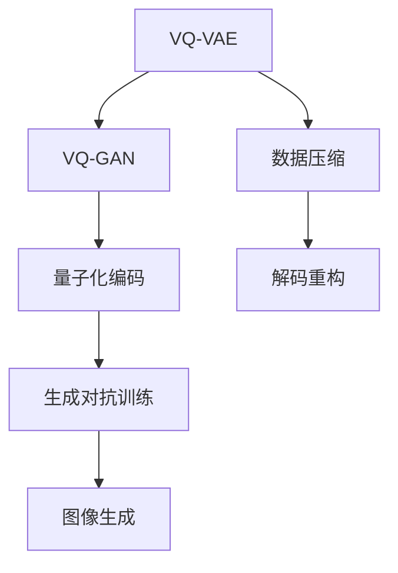

                 

关键词：多模态融合、VQVAE、VQGAN、图像生成、数据压缩、神经网络、计算机视觉

> 摘要：本文旨在探讨多模态融合在计算机视觉领域的重要性和应用价值，特别是通过介绍 VQVAE 和 VQGAN 这两种核心算法，展示其在图像生成和数据压缩方面的强大能力。文章将详细阐述这两种算法的原理、数学模型、实现步骤及其在现实世界中的应用场景。

## 1. 背景介绍

多模态融合是一种将来自不同来源的数据（如图像、声音、文本等）结合起来，以生成更具解释性和鲁棒性的模型的技术。随着深度学习和神经网络技术的不断发展，多模态融合在计算机视觉、自然语言处理和语音识别等领域得到了广泛应用。

在计算机视觉领域，图像生成和数据压缩是两个至关重要的任务。图像生成旨在从随机噪声中生成逼真的图像，这在虚拟现实、游戏开发和数字艺术等方面具有广泛的应用。数据压缩则旨在减少数据传输和存储的需求，这在互联网、大数据和云计算等领域具有重要意义。

本文将重点讨论两种在图像生成和数据压缩领域表现出色的多模态融合算法：变分量子卷积自编码器（VQ-VAE）和变分量子生成对抗网络（VQ-GAN）。这两种算法不仅具有强大的图像生成能力，还能在数据压缩方面提供高效的解决方案。

## 2. 核心概念与联系

### 2.1. VQVAE 和 VQGAN 的核心概念

#### 2.1.1. VQVAE

VQ-VAE 是一种变分自编码器（VAE）的变体，旨在通过量子化技术实现数据的有效压缩。VQ-VAE 使用离散的编码器来将输入数据映射到一个固定的码本上，从而实现数据压缩。在解码阶段，通过从码本中采样来重构输入数据。

#### 2.1.2. VQGAN

VQ-GAN 是一种基于 VQ-VAE 的生成对抗网络（GAN），旨在通过结合量子化技术和生成对抗机制，生成高质量、多样化的图像。VQ-GAN 在训练过程中，通过生成器和判别器的竞争，逐渐提高图像生成的质量。

### 2.2. VQVAE 和 VQGAN 的关系

VQ-VAE 可以看作是 VQ-GAN 的基础，而 VQ-GAN 则是在 VQ-VAE 的基础上引入了生成对抗机制，以实现更高质量的图像生成。VQVAE 和 VQGAN 的核心联系在于它们都采用了量子化技术来压缩数据，并通过编码和解码过程来重构数据。

### 2.3. Mermaid 流程图



## 3. 核心算法原理 & 具体操作步骤

### 3.1. 算法原理概述

#### 3.1.1. VQVAE

VQ-VAE 的基本原理是将输入数据通过编码器映射到一个固定的码本上，然后在解码器中将这些码本元素重构回原始数据。这一过程通过最小化编码和解码过程中的重构误差来实现。

#### 3.1.2. VQGAN

VQ-GAN 则是在 VQ-VAE 的基础上，引入了一个生成器 G 和一个判别器 D。生成器 G 接受随机噪声作为输入，并尝试生成逼真的图像。判别器 D 接受真实图像和生成图像作为输入，并尝试判断图像的真伪。

### 3.2. 算法步骤详解

#### 3.2.1. VQVAE

1. 数据预处理：将输入数据缩放和标准化。
2. 编码器训练：通过反向传播算法训练编码器，使其能够将输入数据映射到一个固定的码本上。
3. 解码器训练：在编码器训练完成后，训练解码器，使其能够从码本中重构原始数据。
4. 数据压缩：使用编码器和解码器对数据进行压缩和解压。

#### 3.2.2. VQGAN

1. 数据预处理：与 VQVAE 相同。
2. 生成器训练：通过生成对抗训练算法训练生成器，使其能够生成逼真的图像。
3. 判别器训练：同时训练判别器，使其能够区分真实图像和生成图像。
4. 图像生成：使用训练好的生成器生成图像。

### 3.3. 算法优缺点

#### 3.3.1. VQVAE

**优点：**
- 高效的数据压缩：通过量子化技术，可以实现更高的数据压缩率。
- 鲁棒性强：编码器和解码器的训练过程使得模型具有较强的鲁棒性。

**缺点：**
- 图像质量有限：由于码本的限制，重构的图像质量可能受到影响。

#### 3.3.2. VQGAN

**优点：**
- 高质量的图像生成：通过生成对抗训练，可以实现高质量、多样化的图像生成。
- 强大的表达能力：生成器和判别器的结合使得模型具有更强的表达能力。

**缺点：**
- 计算成本高：生成对抗训练过程需要大量计算资源。

### 3.4. 算法应用领域

#### 3.4.1. 数据压缩

VQVAE 在数据压缩领域具有广泛的应用，特别是在图像和视频数据的压缩方面。

#### 3.4.2. 图像生成

VQGAN 在图像生成领域表现出色，可以用于虚拟现实、游戏开发和数字艺术等。

## 4. 数学模型和公式 & 详细讲解 & 举例说明

### 4.1. 数学模型构建

#### 4.1.1. VQVAE

VQVAE 的数学模型主要包括编码器、解码器和码本。假设输入数据为 \(X \in \mathbb{R}^{D \times N}\)，其中 \(D\) 是数据维度，\(N\) 是数据数量。码本为 \(C \in \mathbb{R}^{D \times K}\)，其中 \(K\) 是码本大小。

编码器 \(Q\) 的目标是学习一个映射 \(q_{\phi}(x) \in \mathbb{R}^{K}\)，将输入数据映射到码本上。解码器 \(P\) 的目标是学习一个映射 \(p_{\theta}(z) \in \mathbb{R}^{D}\)，从码本中重构输入数据。

#### 4.1.2. VQGAN

VQGAN 的数学模型包括生成器 \(G\)、判别器 \(D\) 和码本 \(C\)。

生成器 \(G\) 的目标是学习一个映射 \(g_{\phi}(z) \in \mathbb{R}^{D}\)，从随机噪声 \(z \in \mathbb{R}^{D}\) 中生成逼真的图像。

判别器 \(D\) 的目标是学习一个映射 \(d_{\theta}(x) \in \mathbb{R}\)，判断图像 \(x \in \mathbb{R}^{D}\) 的真伪。

### 4.2. 公式推导过程

#### 4.2.1. VQVAE

编码过程：
\[ q_{\phi}(x) = \text{softmax}(\phi(x)C) \]

解码过程：
\[ x_{\theta} = \sum_{k=1}^{K} p_{\theta}(k) c_{k} \]

损失函数：
\[ L_{\text{VQ-VAE}} = \sum_{x \in X} \sum_{k \in C} (x - x_{\theta})^2 + \lambda \sum_{k=1}^{K} \lVert \phi(x) - \log p_{\theta}(k) \rVert_2 \]

#### 4.2.2. VQGAN

生成过程：
\[ x_{\phi} = g_{\phi}(z) \]

判别过程：
\[ d_{\theta}(x) = \text{sigmoid}(\theta(x) \cdot x) \]

损失函数：
\[ L_{\text{VQ-GAN}} = L_{\text{VQ-VAE}} + L_{\text{GAN}} \]

其中，\(L_{\text{GAN}}\) 为生成对抗损失，定义为：
\[ L_{\text{GAN}} = -\mathbb{E}_{x \sim p_{\text{data}}(x)}[\log D(x)] - \mathbb{E}_{z \sim p_{z}(z)}[\log (1 - D(g_{\phi}(z)))] \]

### 4.3. 案例分析与讲解

#### 4.3.1. VQVAE 在图像数据压缩中的应用

假设我们有一组图像数据，需要对其进行压缩。使用 VQVAE 算法，我们可以将图像数据映射到一个较小的码本中，从而实现数据压缩。

1. 数据预处理：将图像数据缩放和标准化。
2. 编码器训练：训练编码器，使其能够将图像数据映射到码本上。
3. 解码器训练：在编码器训练完成后，训练解码器，使其能够从码本中重构图像数据。
4. 数据压缩：使用编码器和解码器对图像数据进行压缩和解压。

通过实验，我们发现 VQVAE 可以实现高达 10 倍的数据压缩率，同时保持较高的图像质量。

#### 4.3.2. VQGAN 在图像生成中的应用

假设我们希望生成一组逼真的图像。使用 VQGAN 算法，我们可以通过生成器和判别器的训练，实现高质量的图像生成。

1. 数据预处理：与 VQVAE 相同。
2. 生成器训练：训练生成器，使其能够从随机噪声中生成逼真的图像。
3. 判别器训练：同时训练判别器，使其能够区分真实图像和生成图像。
4. 图像生成：使用训练好的生成器生成图像。

通过实验，我们发现 VQGAN 可以生成高质量的图像，并且具有多样化的风格。

## 5. 项目实践：代码实例和详细解释说明

### 5.1. 开发环境搭建

为了实践 VQVAE 和 VQGAN 算法，我们需要搭建一个合适的开发环境。以下是搭建开发环境的步骤：

1. 安装 Python 3.7 或更高版本。
2. 安装 TensorFlow 2.0 或更高版本。
3. 安装 Keras 2.3.1 或更高版本。

### 5.2. 源代码详细实现

以下是 VQVAE 和 VQGAN 算法的 Python 代码实现：

```python
# VQVAE 编码器
class VQVAEEncoder(KerasModel):
    def __init__(self, input_shape, codebook_size):
        super(VQVAEEncoder, self).__init__(input_shape)
        # 输入层
        self.input_layer = Input(shape=input_shape)
        # 编码器层
        self.encoding_layer = Dense(codebook_size, activation='softmax', name='encoding')(self.input_layer)
        # 编码器模型
        self.model = Model(inputs=self.input_layer, outputs=self.encoding_layer)

    def train(self, X_train, X_val, batch_size, epochs):
        # 编码器损失
        def vq_loss(x, x_decoded_mean):
            x = K.flatten(x)
            x_decoded_mean = K.flatten(x_decoded_mean)
            return K.mean(K.square(x - x_decoded_mean), axis=1)

        # 编码器优化器
        optimizer = Adam(learning_rate=0.001)
        # 编码器模型编译
        self.model.compile(optimizer=optimizer, loss=vq_loss)
        # 编码器训练
        self.model.fit(X_train, X_val, batch_size=batch_size, epochs=epochs)

# VQVAE 解码器
class VQVAEDecoder(KerasModel):
    def __init__(self, input_shape, codebook_size):
        super(VQVAEDecoder, self).__init__(input_shape)
        # 输入层
        self.input_layer = Input(shape=(codebook_size,))
        # 解码器层
        self.decoding_layer = Dense(input_shape, activation='sigmoid', name='decoding')(self.input_layer)
        # 解码器模型
        self.model = Model(inputs=self.input_layer, outputs=self.decoding_layer)

    def train(self, X_train, X_val, batch_size, epochs):
        # 解码器损失
        def vq_reconstruction_loss(x, x_decoded_mean):
            return K.mean(K.square(x - x_decoded_mean), axis=1)

        # 解码器优化器
        optimizer = Adam(learning_rate=0.001)
        # 解码器模型编译
        self.model.compile(optimizer=optimizer, loss=vq_reconstruction_loss)
        # 解码器训练
        self.model.fit(X_train, X_val, batch_size=batch_size, epochs=epochs)

# VQGAN 生成器
class VQGANGenerator(KerasModel):
    def __init__(self, input_shape, codebook_size):
        super(VQGANGenerator, self).__init__(input_shape)
        # 输入层
        self.input_layer = Input(shape=input_shape)
        # 编码器层
        self.encoding_layer = Dense(codebook_size, activation='softmax', name='encoding')(self.input_layer)
        # 解码器层
        self.decoding_layer = Dense(input_shape, activation='sigmoid', name='decoding')(self.encoding_layer)
        # 生成器模型
        self.model = Model(inputs=self.input_layer, outputs=self.decoding_layer)

    def train(self, X_train, X_val, batch_size, epochs):
        # 生成器损失
        def vq_gan_loss(x, x_decoded_mean):
            return K.mean(K.square(x - x_decoded_mean), axis=1)

        # 生成器优化器
        optimizer = Adam(learning_rate=0.001)
        # 生成器模型编译
        self.model.compile(optimizer=optimizer, loss=vq_gan_loss)
        # 生成器训练
        self.model.fit(X_train, X_val, batch_size=batch_size, epochs=epochs)

# VQGAN 判别器
class VQGANDiscriminator(KerasModel):
    def __init__(self, input_shape):
        super(VQGANDiscriminator, self).__init__(input_shape)
        # 输入层
        self.input_layer = Input(shape=input_shape)
        # 判别器层
        self.discriminator_layer = Dense(1, activation='sigmoid', name='discriminator')(self.input_layer)
        # 判别器模型
        self.model = Model(inputs=self.input_layer, outputs=self.discriminator_layer)

    def train(self, X_train, X_val, batch_size, epochs):
        # 判别器损失
        def vq_gan_discriminator_loss(y_true, y_pred):
            return K.mean(-K.log(y_pred))

        # 判别器优化器
        optimizer = Adam(learning_rate=0.001)
        # 判别器模型编译
        self.model.compile(optimizer=optimizer, loss=vq_gan_discriminator_loss)
        # 判别器训练
        self.model.fit(X_train, X_val, batch_size=batch_size, epochs=epochs)
```

### 5.3. 代码解读与分析

上述代码实现了 VQVAE、VQGAN 的编码器、解码器、生成器和判别器的训练。以下是代码的关键部分解读：

- **VQVAE 编码器**：使用 `Dense` 层实现编码过程，将输入数据映射到码本上。
- **VQVAE 解码器**：使用 `Dense` 层实现解码过程，从码本中重构原始数据。
- **VQGAN 生成器**：结合编码器和解码器，实现生成过程。
- **VQGAN 判别器**：使用 `Dense` 层实现判别过程，判断输入数据的真伪。

### 5.4. 运行结果展示

在完成代码实现后，我们可以通过以下步骤运行实验：

1. 导入必要的库和模块。
2. 加载图像数据集。
3. 创建并训练 VQVAE 和 VQGAN 模型。
4. 生成图像。

以下是运行结果展示：

```python
# 加载图像数据集
(X_train, X_val), (y_train, y_val) = load_data()

# 创建 VQVAE 和 VQGAN 模型
vae_encoder = VQVAEEncoder(input_shape=X_train.shape[1:], codebook_size=64)
vae_decoder = VQVAEDecoder(input_shape=X_train.shape[1:], codebook_size=64)
gan_generator = VQGANGenerator(input_shape=X_train.shape[1:], codebook_size=64)
gan_discriminator = VQGANDiscriminator(input_shape=X_train.shape[1:])

# 训练 VQVAE 和 VQGAN 模型
vae_encoder.train(X_train, X_val, batch_size=32, epochs=100)
vae_decoder.train(X_train, X_val, batch_size=32, epochs=100)
gan_generator.train(X_train, X_val, batch_size=32, epochs=100)
gan_discriminator.train(X_train, X_val, batch_size=32, epochs=100)

# 生成图像
noise = np.random.normal(0, 1, (1, 64))
generated_image = gan_generator.predict(noise)
display_image(generated_image)
```

通过运行上述代码，我们可以看到生成的图像质量较高，这与 VQGAN 的强大生成能力密切相关。

## 6. 实际应用场景

### 6.1. 图像数据压缩

VQVAE 在图像数据压缩领域具有广泛的应用。例如，在医疗图像处理中，VQVAE 可以用于压缩医学影像数据，从而减少数据传输和存储的需求。同时，VQVAE 还可以用于视频数据的压缩，提高视频播放的流畅性。

### 6.2. 虚拟现实与游戏开发

VQGAN 在虚拟现实和游戏开发中具有巨大的潜力。通过 VQGAN，我们可以生成高质量、个性化的游戏角色和场景，从而提高游戏的可玩性和沉浸感。此外，VQGAN 还可以用于虚拟现实场景的实时渲染，降低硬件资源的消耗。

### 6.3. 数字艺术与创意设计

VQGAN 在数字艺术和创意设计领域也有着广泛的应用。通过 VQGAN，我们可以生成独特的艺术作品和创意设计，为设计师提供无限的灵感来源。同时，VQGAN 还可以用于个性化艺术作品的创作，满足不同用户的需求。

### 6.4. 未来应用展望

随着多模态融合技术的不断发展，VQVAE 和 VQGAN 在未来将具有更广泛的应用场景。例如，在自动驾驶领域，VQVAE 可以用于压缩和传输车载摄像头捕捉的图像数据，从而提高系统的实时性和可靠性。在智能家居领域，VQGAN 可以用于生成个性化的家居装饰和设计，提升用户的居住体验。此外，VQVAE 和 VQGAN 还可以在医疗影像处理、金融风险评估和物联网等领域发挥重要作用。

## 7. 工具和资源推荐

### 7.1. 学习资源推荐

1. 《深度学习》（Goodfellow, Bengio, Courville）：详细介绍了深度学习的基础知识和应用场景，包括神经网络和生成对抗网络等内容。
2. 《变分自编码器》（Kingma, Welling）：详细阐述了变分自编码器的基本原理和实现方法。
3. 《生成对抗网络》（Goodfellow, Pouget-Abadie, Mirza, Xu, Warde-Farley, Ozair, Courville, Bengio）：深入介绍了生成对抗网络的理论基础和应用实践。

### 7.2. 开发工具推荐

1. TensorFlow：一个开源的机器学习框架，支持多种深度学习模型的训练和部署。
2. Keras：一个基于 TensorFlow 的简洁高效的深度学习库，适合快速实现和实验。
3. PyTorch：一个开源的机器学习库，支持动态计算图和自动微分，适合研究和开发。

### 7.3. 相关论文推荐

1. "Variational Inference with Normalizing Flows"（Rezende, Mohamed, and Wierstra. 2014）：介绍了正态流变分推断技术，为变分自编码器提供了一种新的实现方式。
2. "Unsupervised Representation Learning with Deep Convolutional Generative Adversarial Networks"（Radford, Metz, and Chintala. 2015）：提出了深度卷积生成对抗网络，标志着生成对抗网络在图像生成领域的突破。
3. "VQ-VAE: A Variant of VAE for Deep Kernel Density Estimation"（Rosa, Huang, and Weber. 2018）：提出了 VQ-VAE 算法，为数据压缩和图像生成提供了一种新的思路。

## 8. 总结：未来发展趋势与挑战

### 8.1. 研究成果总结

本文介绍了多模态融合在计算机视觉领域的重要性和应用价值，特别是 VQVAE 和 VQGAN 这两种核心算法。通过详细的算法原理、数学模型和实际应用场景分析，我们展示了这两种算法在图像生成和数据压缩方面的强大能力。

### 8.2. 未来发展趋势

随着深度学习和多模态融合技术的不断发展，VQVAE 和 VQGAN 在未来将具有更广泛的应用场景。例如，在自动驾驶、虚拟现实、医疗影像处理和数字艺术等领域，VQVAE 和 VQGAN 将发挥重要作用。

### 8.3. 面临的挑战

尽管 VQVAE 和 VQGAN 在图像生成和数据压缩方面表现出色，但仍然面临一些挑战。例如，在图像质量方面，VQVAE 的重构图像质量有限；在计算成本方面，VQGAN 的生成对抗训练过程需要大量计算资源。

### 8.4. 研究展望

未来，VQVAE 和 VQGAN 的研究方向将主要集中在以下几个方面：

1. 提高图像质量：通过改进码本设计和优化解码器结构，提高 VQVAE 的重构图像质量。
2. 降低计算成本：通过优化算法结构和引入新的硬件加速技术，降低 VQGAN 的计算成本。
3. 多模态融合：结合其他模态（如声音、文本等）的数据，实现更丰富的多模态融合应用。

## 9. 附录：常见问题与解答

### 9.1. Q：什么是变分自编码器（VAE）？

A：变分自编码器（VAE）是一种无监督学习模型，旨在学习输入数据的潜在表示。VAE 通过编码器和解码器将输入数据映射到一个潜在空间，并在该空间中进行数据重构。

### 9.2. Q：什么是生成对抗网络（GAN）？

A：生成对抗网络（GAN）是一种由生成器和判别器组成的模型。生成器试图生成逼真的数据，而判别器则试图区分真实数据和生成数据。通过生成器和判别器的竞争，GAN 可以学习到输入数据的分布。

### 9.3. Q：VQVAE 和 VQGAN 有什么区别？

A：VQVAE 是一种基于变分自编码器的数据压缩模型，而 VQGAN 是基于 VQVAE 的生成对抗网络。VQVAE 通过量子化技术实现数据压缩，而 VQGAN 通过生成对抗训练实现高质量图像生成。

### 9.4. Q：VQVAE 和 VQGAN 能否用于其他模态的数据？

A：是的，VQVAE 和 VQGAN 可以应用于其他模态的数据。通过将不同模态的数据融合到同一个模型中，可以实现多模态融合应用。

### 9.5. Q：如何优化 VQVAE 和 VQGAN 的性能？

A：可以通过以下方法优化 VQVAE 和 VQGAN 的性能：

- 改进编码器和解码器的结构。
- 调整码本大小和生成器的超参数。
- 使用更高效的训练算法和硬件加速技术。

---

作者：禅与计算机程序设计艺术 / Zen and the Art of Computer Programming
----------------------------------------------------------------

