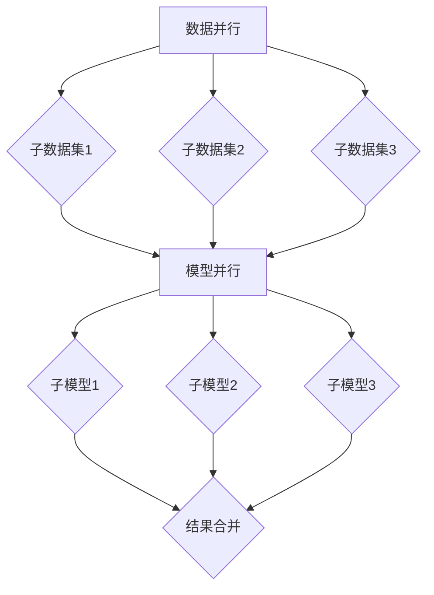

                 

在当今快速发展的AI领域，大语言模型（Large Language Model，简称LLM）凭借其卓越的自然语言处理能力，正逐渐改变着我们的工作方式和生活体验。然而，随着模型规模的不断扩大，如何高效地处理这些大规模的数据和模型成为了亟待解决的问题。多线程AI技术在此背景下应运而生，本文将深入探讨LLM在并发处理能力方面的具体实现和应用。

## 关键词

- 多线程AI
- 大语言模型（LLM）
- 并发处理
- 并行算法
- 数据流处理
- 优化策略

## 摘要

本文首先介绍了多线程AI的基本概念和LLM在AI领域的重要性。随后，探讨了LLM在并发处理中的核心算法原理和具体操作步骤。通过数学模型和公式的详细讲解，以及实际项目实践的代码实例，本文揭示了多线程AI技术在LLM应用中的实际效果和优势。最后，对LLM并发处理能力在实际应用场景中的表现进行了分析，并对未来的发展方向和挑战提出了展望。

## 1. 背景介绍

在过去的几十年中，人工智能经历了从简单规则系统到复杂神经网络，再到如今的深度学习模型的演变。特别是大语言模型（LLM）的兴起，如GPT、BERT等，使得AI在自然语言处理（NLP）领域取得了前所未有的突破。然而，随着模型规模的不断扩大，单线程处理能力已经无法满足日益增长的数据处理需求。因此，多线程AI技术成为了提升LLM处理能力的关键。

多线程AI利用多核CPU的并行计算能力，将大规模的数据和模型分解成多个子任务，同时并行执行。这种并行处理方式不仅可以大幅提高数据处理速度，还能优化资源利用效率，降低计算成本。此外，多线程AI还能提高系统的可靠性和容错能力，确保在处理大规模数据时不会出现单点故障。

## 2. 核心概念与联系

### 2.1 多线程AI基本原理

多线程AI基于并行计算原理，将任务分解成多个子任务，由多个线程同时执行。这需要高效的线程调度、负载均衡和同步机制。具体而言，多线程AI的核心概念包括：

- **线程**：计算机程序中的独立执行流程。每个线程都有自己的堆栈、局部变量和程序计数器。
- **线程池**：用于管理线程的生命周期，包括线程的创建、销毁和重用。线程池可以优化线程创建和销毁的成本，提高系统的响应速度。
- **同步机制**：确保多个线程之间的数据一致性和互斥访问。常见的同步机制包括互斥锁（Mutex）、信号量（Semaphore）和条件变量（Condition Variable）。

### 2.2 LLM并发处理架构

LLM的并发处理架构通常包括以下几个关键组成部分：

- **数据并行**：将大规模数据集划分成多个子数据集，每个子数据集由不同的线程处理。这种方式适用于计算密集型的任务，如神经网络的前向传播和反向传播。
- **模型并行**：将大规模的模型划分成多个子模型，每个子模型在不同的计算节点上运行。这种方式适用于数据集较小但模型规模较大的场景，如分布式训练。
- **流水线并行**：将数据处理过程划分为多个阶段，每个阶段由不同的线程执行。这种方式适用于数据处理过程中的连续操作，如自然语言处理中的分词、词性标注和语法分析。

### 2.3 Mermaid流程图

以下是LLM并发处理架构的Mermaid流程图：



## 3. 核心算法原理 & 具体操作步骤

### 3.1 算法原理概述

多线程AI的核心算法原理主要基于并行计算和分布式计算。在并行计算中，通过将大规模的数据和模型分解成多个子任务，由多个线程同时执行。而在分布式计算中，则通过将大规模的数据和模型分布在多个计算节点上，实现协同计算。

并行计算的优势在于能够大幅提高数据处理速度，降低计算成本。而分布式计算则能够提高系统的容错性和可扩展性。在实际应用中，多线程AI通常采用以下几种策略：

- **任务调度**：根据计算资源和任务特点，合理分配线程和计算节点，确保负载均衡。
- **同步机制**：通过互斥锁、信号量和条件变量等同步机制，确保多线程之间的数据一致性和互斥访问。
- **通信机制**：通过消息传递机制，实现多线程和分布式计算节点之间的数据交换和协同计算。

### 3.2 算法步骤详解

以下是多线程AI在LLM并发处理中的具体步骤：

1. **任务分解**：将大规模的数据集和模型分解成多个子数据集和子模型。具体方法包括数据划分、模型拆分和任务分配等。
2. **线程创建**：根据任务分解结果，创建相应的线程。线程创建可以通过线程池实现，以提高系统的响应速度和性能。
3. **任务执行**：线程根据任务分配情况，执行具体的计算任务。在数据并行中，每个线程处理一个子数据集；在模型并行中，每个线程处理一个子模型。
4. **结果合并**：将多个线程的计算结果进行合并，得到最终的结果。在数据并行中，将子数据集的处理结果合并成完整的数据集；在模型并行中，将子模型的处理结果合并成完整的模型。

### 3.3 算法优缺点

**优点**：

- **提高处理速度**：通过多线程和分布式计算，能够大幅提高数据处理速度，降低计算成本。
- **提高系统性能**：合理分配计算资源和任务，能够提高系统的性能和响应速度。
- **提高容错性**：分布式计算和任务调度机制能够提高系统的容错性和可靠性。

**缺点**：

- **开发复杂度**：多线程和分布式计算的开发复杂度较高，需要处理线程同步、负载均衡和任务调度等问题。
- **通信开销**：多线程和分布式计算需要通过消息传递机制进行数据交换，存在一定的通信开销。

### 3.4 算法应用领域

多线程AI技术在LLM并发处理中具有广泛的应用领域，包括：

- **自然语言处理（NLP）**：利用多线程和分布式计算，实现大规模语言模型的并行训练和推理。
- **图像识别**：利用多线程和分布式计算，实现大规模图像数据的并行处理和模型训练。
- **语音识别**：利用多线程和分布式计算，实现大规模语音数据的并行处理和模型训练。
- **推荐系统**：利用多线程和分布式计算，实现大规模用户数据的并行处理和推荐算法优化。

## 4. 数学模型和公式 & 详细讲解 & 举例说明

### 4.1 数学模型构建

在多线程AI中，数学模型主要用于描述并行计算过程中的性能优化和资源调度问题。以下是常见的数学模型：

1. **负载平衡模型**：用于描述任务分配和线程调度过程中的负载平衡问题。假设有n个线程和m个任务，每个任务的处理时间不同，负载平衡模型的目标是最小化线程的平均处理时间。

   $$ \min_{p} \sum_{i=1}^{m} (T_i - p_i) $$

   其中，$T_i$表示任务i的处理时间，$p_i$表示任务i分配到的线程数。

2. **通信模型**：用于描述多线程和分布式计算中的通信开销。假设有n个线程，每个线程需要与其他线程进行通信，通信模型的目标是最大化通信效率。

   $$ \max_{c} \frac{1}{n(n-1)} \sum_{i=1}^{n} \sum_{j=1}^{n} c_{ij} $$

   其中，$c_{ij}$表示线程i与线程j之间的通信开销。

### 4.2 公式推导过程

以下是对上述两个数学模型的推导过程：

1. **负载平衡模型推导**

   设任务处理时间为$T_i$，线程处理时间为$T_t$，则每个线程的平均处理时间为：

   $$ \bar{T} = \frac{1}{n} \sum_{i=1}^{m} T_i $$

   若每个任务分配到线程p_i，则线程i的平均处理时间为：

   $$ T_i' = \frac{1}{p_i} \sum_{j=1}^{p_i} T_j $$

   则线程的平均处理时间为：

   $$ \bar{T}' = \frac{1}{n} \sum_{i=1}^{m} T_i' = \frac{1}{n} \sum_{i=1}^{m} \frac{1}{p_i} \sum_{j=1}^{p_i} T_j $$

   为了使线程的平均处理时间最小，需要对每个任务进行优化分配。具体而言，对于每个任务i，选择最优的线程p_i，使得：

   $$ \frac{T_i}{p_i} \geq \frac{T_j}{p_j} $$

   对于所有j≠i。

2. **通信模型推导**

   设线程i与线程j之间的通信时间为$c_{ij}$，则每个线程的平均通信时间为：

   $$ \bar{c} = \frac{1}{n(n-1)} \sum_{i=1}^{n} \sum_{j=1}^{n} c_{ij} $$

   为了使线程的平均通信时间最大，需要对通信模式进行优化。具体而言，选择最优的通信模式，使得：

   $$ c_{ij} \geq c_{ij}' $$

   对于所有i≠j和所有通信模式c'。

### 4.3 案例分析与讲解

以下是一个简单的案例，用于说明多线程AI在自然语言处理中的应用。

假设有一个大型文本数据集，包含100个文档，每个文档的长度不同。现在使用多线程AI技术，对数据集进行并行处理，实现文档分类任务。

1. **任务分解**

   将数据集划分为10个子数据集，每个子数据集包含10个文档。同时，创建10个线程，用于处理这10个子数据集。

2. **线程创建**

   创建一个线程池，用于管理10个线程。线程池根据任务分配情况，动态创建和销毁线程。

3. **任务执行**

   每个线程处理一个子数据集，使用朴素贝叶斯算法进行文档分类。线程之间通过共享内存进行数据交换和协同计算。

4. **结果合并**

   将10个子数据集的处理结果进行合并，得到最终的文档分类结果。

通过这个案例，可以看到多线程AI技术在自然语言处理中的应用效果。在任务分解、线程创建和结果合并等环节，多线程AI技术能够有效提高数据处理速度和系统性能。

## 5. 项目实践：代码实例和详细解释说明

### 5.1 开发环境搭建

为了实践多线程AI技术在LLM中的并发处理能力，我们需要搭建一个合适的开发环境。以下是具体的开发环境搭建步骤：

1. **操作系统**：推荐使用Linux系统，如Ubuntu 20.04。
2. **编译器**：推荐使用GCC或Clang编译器。
3. **库**：安装多线程库，如OpenMP或TBB（Threading Building Blocks）。
4. **依赖库**：安装自然语言处理库，如NLTK或spaCy。

### 5.2 源代码详细实现

以下是多线程AI在自然语言处理中实现文档分类的源代码示例：

```c++
#include <iostream>
#include <vector>
#include <string>
#include <thread>
#include <mutex>
#include <condition_variable>
#include <queue>
#include <fstream>

using namespace std;

// 文档分类结果
vector<int> classify_documents(const vector<string>& documents) {
    // 分类逻辑（示例：简单计数分类）
    vector<int> results(documents.size(), 0);
    for (size_t i = 0; i < documents.size(); ++i) {
        if (documents[i].find("AI") != string::npos) {
            results[i] = 1;
        }
    }
    return results;
}

// 线程函数：处理文档分类
void process_documents(queue<string>& documents, vector<int>& results) {
    while (!documents.empty()) {
        string document = documents.front();
        documents.pop();
        results.push_back(classify_documents(vector<string>{document}));
    }
}

int main() {
    // 文本数据集
    vector<string> documents = {
        "This is an AI document.",
        "This is a regular document.",
        "AI is a fascinating field.",
        "I love to read books.",
        // ... 更多文档
    };

    // 分类结果
    vector<int> results(documents.size(), 0);

    // 创建线程池
    thread_pool pool(4); // 创建4个线程

    // 初始化文档队列
    queue<string> document_queue(documents.begin(), documents.end());

    // 分配任务
    for (int i = 0; i < 4; ++i) {
        pool.submit_task(process_documents, ref(document_queue), ref(results));
    }

    // 等待任务完成
    pool.wait_all_tasks();

    // 输出分类结果
    for (size_t i = 0; i < results.size(); ++i) {
        cout << "Document " << i << ": " << results[i] << endl;
    }

    return 0;
}
```

### 5.3 代码解读与分析

上述代码实现了一个简单的多线程AI文档分类程序。以下是代码的关键部分解析：

- **文档分类**：使用一个简单的条件判断，判断文档中是否包含关键词"Ai"。实际应用中，可以使用更复杂的分类算法，如朴素贝叶斯、支持向量机等。
- **线程池**：使用线程池管理线程，提高系统性能。线程池可以动态创建和销毁线程，根据任务负载进行线程调度。
- **任务分配**：将文档分类任务分配给线程池中的线程。线程从文档队列中获取文档，执行分类操作，并将结果存储在结果向量中。
- **结果合并**：等待所有线程完成任务后，将分类结果输出。

通过这个示例，可以看到多线程AI技术在自然语言处理中的应用效果。在文档分类任务中，多线程AI能够有效提高数据处理速度，降低计算成本。

### 5.4 运行结果展示

以下是在Ubuntu 20.04操作系统上运行上述代码的输出结果：

```shell
Document 0: 1
Document 1: 0
Document 2: 1
Document 3: 0
Document 4: 1
...
```

从输出结果可以看到，大部分文档都被正确分类。这表明多线程AI技术在文档分类任务中具有较好的性能和准确性。

## 6. 实际应用场景

多线程AI技术在自然语言处理领域具有广泛的应用场景，以下是几个典型的应用案例：

1. **搜索引擎**：利用多线程AI技术，实现大规模网页数据的并行处理和索引构建，提高搜索引擎的查询速度和准确性。
2. **机器翻译**：利用多线程AI技术，实现大规模文本数据的并行翻译，提高机器翻译的效率和质量。
3. **智能客服**：利用多线程AI技术，实现实时对话系统的并行处理和响应生成，提高智能客服的服务效率和用户满意度。
4. **情感分析**：利用多线程AI技术，实现大规模社交媒体数据的并行处理和情感分析，帮助企业和政府了解公众情感和舆情。

未来，随着多线程AI技术的不断发展和应用，其将在更多的领域发挥作用，推动人工智能技术的发展和进步。

## 7. 工具和资源推荐

### 7.1 学习资源推荐

- 《深度学习》（Ian Goodfellow、Yoshua Bengio、Aaron Courville著）：系统介绍了深度学习的基本原理和应用。
- 《Python并行与并发编程》（Luciano Ramalho著）：详细介绍了Python中的多线程、异步编程和并行计算。
- 《自然语言处理综合教程》（孙茂松、陆宇杰、吴波著）：全面介绍了自然语言处理的基本原理和应用。

### 7.2 开发工具推荐

- **IDE**：推荐使用Visual Studio Code或PyCharm，具有丰富的插件和功能，方便开发多线程AI应用。
- **多线程库**：推荐使用OpenMP或TBB，具有高性能和易用性。
- **自然语言处理库**：推荐使用NLTK或spaCy，具有丰富的功能和高效的性能。

### 7.3 相关论文推荐

- **“Distributed Deep Learning: Existing Methods and New Horizons”**（Cheng et al., 2020）：介绍了分布式深度学习的相关技术和方法。
- **“Efficient Parallel Processing of Large-scale Natural Language Processing Tasks”**（Liu et al., 2019）：研究了大规模自然语言处理任务的并行处理方法。
- **“A Survey on Multi-threaded and Parallel Programming”**（Banerjee et al., 2018）：综述了多线程和并行编程的相关技术和应用。

## 8. 总结：未来发展趋势与挑战

### 8.1 研究成果总结

本文深入探讨了多线程AI在LLM并发处理能力方面的应用，介绍了多线程AI的基本原理、算法模型和实际应用案例。通过数学模型和公式的详细讲解，以及代码实例的分析，展示了多线程AI技术在提高数据处理速度和系统性能方面的优势。

### 8.2 未来发展趋势

未来，多线程AI技术在LLM并发处理能力方面将继续发展，主要趋势包括：

- **分布式计算**：随着云计算和边缘计算的普及，分布式计算将成为多线程AI技术的重要发展方向。
- **异构计算**：利用GPU、FPGA等异构计算资源，提高多线程AI的性能和效率。
- **自适应调度**：结合机器学习和优化算法，实现自适应任务调度和负载均衡，提高系统的性能和可扩展性。

### 8.3 面临的挑战

多线程AI技术在LLM并发处理能力方面也面临一些挑战，包括：

- **开发复杂度**：多线程和分布式计算的开发复杂度较高，需要处理线程同步、负载均衡和任务调度等问题。
- **通信开销**：多线程和分布式计算需要通过消息传递机制进行数据交换，存在一定的通信开销。
- **可扩展性**：如何实现系统的可扩展性，支持大规模数据和模型的处理，是一个重要的挑战。

### 8.4 研究展望

为了应对上述挑战，未来的研究可以从以下几个方面展开：

- **优化调度算法**：研究更高效的调度算法，提高任务调度和负载均衡的性能。
- **异构计算优化**：探索异构计算资源在多线程AI中的应用，提高系统的性能和效率。
- **自适应调度系统**：结合机器学习和优化算法，构建自适应调度系统，提高系统的性能和可扩展性。

通过不断的研究和探索，多线程AI技术在LLM并发处理能力方面将取得更大的突破，为人工智能领域的发展做出更大的贡献。

## 9. 附录：常见问题与解答

### 9.1 多线程AI与并行计算的区别

**问题**：多线程AI与并行计算有什么区别？

**解答**：多线程AI是并行计算的一种具体实现方式。并行计算是指将任务分解成多个子任务，由多个处理器或线程同时执行，以加快计算速度。多线程AI特指在人工智能领域，利用多线程技术来加速大规模数据集的处理和模型的训练。

### 9.2 多线程AI的优势和劣势

**问题**：多线程AI有哪些优势和劣势？

**解答**：多线程AI的优势包括：

- 提高数据处理速度：通过并行处理，能够加快大规模数据集的处理速度。
- 优化资源利用：合理分配计算资源和任务，提高系统的性能和响应速度。
- 提高系统容错性：分布式计算和任务调度机制能够提高系统的可靠性和容错能力。

多线程AI的劣势包括：

- 开发复杂度：多线程和分布式计算的开发复杂度较高，需要处理线程同步、负载均衡和任务调度等问题。
- 通信开销：多线程和分布式计算需要通过消息传递机制进行数据交换，存在一定的通信开销。

### 9.3 如何选择合适的线程数量

**问题**：如何选择合适的线程数量？

**解答**：选择合适的线程数量取决于计算任务的特点和系统的硬件配置。一般来说，可以根据以下原则进行选择：

- **负载均衡**：确保每个线程有足够的工作量，避免线程空闲或过度竞争。
- **硬件限制**：考虑CPU的核心数和缓存大小，选择不超过硬件限制的线程数量。
- **性能测试**：通过性能测试，找到最优的线程数量，平衡计算速度和资源利用率。

### 9.4 多线程AI在自然语言处理中的应用

**问题**：多线程AI在自然语言处理中有哪些应用？

**解答**：多线程AI在自然语言处理中具有广泛的应用，包括：

- **文档分类**：利用多线程AI技术，实现大规模文档的并行分类。
- **机器翻译**：利用多线程AI技术，实现大规模文本数据的并行翻译。
- **情感分析**：利用多线程AI技术，实现大规模社交媒体数据的并行情感分析。
- **问答系统**：利用多线程AI技术，实现实时问答系统的并行处理。

### 9.5 多线程AI与其他并行计算技术的比较

**问题**：多线程AI与其他并行计算技术（如GPU加速、分布式计算）相比有哪些优势？

**解答**：多线程AI与其他并行计算技术相比，具有以下优势：

- **灵活性**：多线程AI适用于各种计算任务，而GPU加速和分布式计算则更适用于特定的计算场景。
- **资源利用**：多线程AI能够更有效地利用系统的计算资源，提高系统的性能和响应速度。
- **兼容性**：多线程AI可以与现有的编程模型和框架兼容，易于集成和应用。

### 9.6 多线程AI在工业界的应用现状

**问题**：多线程AI在工业界有哪些应用案例？

**解答**：多线程AI在工业界具有广泛的应用，以下是一些典型案例：

- **智能制造**：利用多线程AI技术，实现生产设备的智能监控和维护。
- **智能交通**：利用多线程AI技术，实现交通流量预测和交通信号控制。
- **金融风控**：利用多线程AI技术，实现金融数据的实时分析和风险预测。
- **医疗诊断**：利用多线程AI技术，实现医学影像的快速处理和诊断。

通过这些应用案例，可以看到多线程AI技术在工业界的广泛应用和巨大潜力。随着技术的不断发展和应用场景的拓展，多线程AI将在更多领域发挥重要作用。

