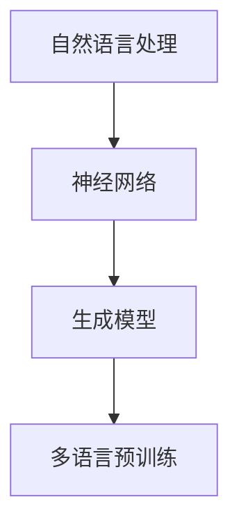

                 

关键词：多语言AI、跨语言理解、生成模型、NLP、机器翻译、神经网络、注意力机制、BERT、Transformer、多语言预训练

> 摘要：本文旨在深入探讨多语言AI模型在跨语言理解与生成方面的最新进展与挑战。通过分析多语言AI的核心概念、算法原理、数学模型以及实际应用场景，本文将展示这些模型如何赋能语言处理领域，并探讨其在未来可能的发展趋势与挑战。

## 1. 背景介绍

在全球化与信息化的背景下，多语言处理已经成为人工智能（AI）研究中的一个重要方向。传统的机器翻译方法主要依赖于规则和统计模型，如基于短语的翻译和基于统计机器翻译（SMT），这些方法在单语种处理上取得了一定的成功，但在跨语言理解与生成方面仍面临诸多挑战。

近年来，深度学习技术的发展，尤其是神经网络和生成模型的广泛应用，为多语言AI模型的研究带来了新的机遇。基于神经网络的机器翻译（NMT）模型，如基于注意力机制的编码器-解码器（Encoder-Decoder）架构，显著提升了机器翻译的准确性和流畅性。此外，大规模的多语言预训练模型，如BERT（Bidirectional Encoder Representations from Transformers）和Multilingual BERT（mBERT），通过在多种语言数据上进行预训练，增强了模型对多语言的理解和生成能力。

本文将围绕多语言AI模型在跨语言理解与生成方面的研究展开，旨在深入分析其核心概念、算法原理、数学模型以及实际应用场景，并为未来的研究提供一些启示。

## 2. 核心概念与联系

多语言AI模型的核心概念包括自然语言处理（NLP）、神经网络、生成模型、多语言预训练等。以下是一个简化的Mermaid流程图，展示了这些概念之间的联系。



### 2.1 自然语言处理（NLP）

自然语言处理是人工智能领域中与语言理解和生成相关的研究领域。NLP的任务包括文本分类、情感分析、命名实体识别、关系抽取等。在多语言AI中，NLP是实现跨语言理解的关键步骤。

### 2.2 神经网络

神经网络是深度学习的基础，由多层节点组成，通过学习输入和输出之间的映射关系，实现复杂的非线性变换。在多语言AI中，神经网络广泛应用于语言模型、机器翻译等任务。

### 2.3 生成模型

生成模型是一种能够生成新数据的机器学习模型，如变分自编码器（VAE）和生成对抗网络（GAN）。在多语言AI中，生成模型可用于生成新的句子、文本摘要等。

### 2.4 多语言预训练

多语言预训练是通过在多种语言数据上训练模型，使其能够理解和生成不同语言的文本。预训练模型如BERT和mBERT，为多语言AI提供了强大的语言理解和生成能力。

## 3. 核心算法原理 & 具体操作步骤

### 3.1 算法原理概述

多语言AI模型的核心算法通常基于深度学习，特别是神经网络和生成模型。以下是几种常用的算法原理：

- **基于注意力机制的编码器-解码器（Encoder-Decoder）架构**：编码器将输入文本编码为固定长度的向量，解码器则根据编码器的输出生成目标语言的文本。
- **Transformer模型**：Transformer模型是一种基于自注意力机制的编码器-解码器架构，其自注意力机制使得模型能够捕捉输入文本中的长距离依赖关系。
- **BERT模型**：BERT模型是一种双向编码器表示模型，通过在大量文本上进行预训练，提高了模型对语言的理解能力。

### 3.2 算法步骤详解

以下是多语言AI模型的具体操作步骤：

1. **数据预处理**：收集和清洗多种语言的文本数据，并将其转换为模型可以处理的格式。
2. **模型训练**：使用预训练模型（如BERT或Transformer）对多语言数据进行训练，以学习语言表示和生成规则。
3. **编码器处理**：编码器将输入文本转换为固定长度的向量表示。
4. **解码器生成**：解码器根据编码器的输出向量生成目标语言的文本。
5. **优化与评估**：通过反向传播和梯度下降等方法优化模型参数，并在测试集上评估模型性能。

### 3.3 算法优缺点

**优点**：

- **高效性**：神经网络和生成模型能够在大规模数据集上快速训练和优化。
- **灵活性**：多语言预训练模型可以适应多种语言任务，无需为每种语言单独训练模型。
- **准确性**：注意力机制和预训练模型能够提高模型的准确性和流畅性。

**缺点**：

- **计算资源需求**：深度学习模型需要大量的计算资源和时间进行训练。
- **数据依赖性**：模型的性能高度依赖于训练数据的质量和多样性。
- **调参复杂性**：模型的参数众多，需要精心调整以达到最佳性能。

### 3.4 算法应用领域

多语言AI模型在以下领域具有广泛应用：

- **机器翻译**：基于神经网络和生成模型的多语言翻译系统，如Google Translate和Microsoft Translator。
- **自然语言理解**：用于文本分类、情感分析、实体识别等任务的NLP工具。
- **语言生成**：用于生成文章、对话、摘要等文本内容的工具。
- **跨语言搜索**：支持多种语言查询和结果展示的搜索引擎。

## 4. 数学模型和公式 & 详细讲解 & 举例说明

### 4.1 数学模型构建

在多语言AI模型中，常用的数学模型包括：

- **词嵌入**：将词汇映射到低维向量空间，用于表示单词。
- **自注意力机制**：用于计算输入文本中各个单词之间的依赖关系。
- **损失函数**：用于评估模型输出和真实值之间的差异。

### 4.2 公式推导过程

以下是一个简化的自注意力机制的推导过程：

$$
\text{Attention}(Q,K,V) = \text{softmax}\left(\frac{QK^T}{\sqrt{d_k}}\right)V
$$

其中，$Q$、$K$、$V$ 分别代表编码器的输入、键和值，$d_k$ 为键的维度。该公式计算输入序列中每个键与查询的相似度，并生成加权求和的值序列。

### 4.3 案例分析与讲解

以下是一个简单的机器翻译案例，展示如何使用BERT模型进行跨语言翻译。

1. **数据准备**：准备中英文对照的平行语料库。
2. **模型训练**：使用BERT模型对中英文数据进行预训练。
3. **编码器处理**：输入中文字符，通过BERT编码器转换为向量表示。
4. **解码器生成**：使用解码器生成英文翻译。

```python
from transformers import BertTokenizer, BertModel

# 加载中英文BERT模型
tokenizer = BertTokenizer.from_pretrained('bert-base-chinese')
model = BertModel.from_pretrained('bert-base-chinese')

# 输入中文文本
input_ids = tokenizer.encode('你好，世界！', add_special_tokens=True)

# 通过编码器获取文本向量表示
with torch.no_grad():
    inputs = torch.tensor(input_ids).unsqueeze(0)
    outputs = model(inputs)

# 解码器生成英文翻译
decoder_input_ids = tokenizer.encode('en', add_special_tokens=True)
decoder_outputs = model(inputs, decoder_input_ids=decoder_input_ids, output_hidden_states=True)

# 处理解码器输出
predicted_tokens = tokenizer.decode(decoder_outputs[0][-1], skip_special_tokens=True)
print(predicted_tokens)
```

该代码展示了如何使用BERT模型对中英文进行跨语言翻译。通过预训练模型，模型能够自动学习语言之间的映射关系，生成高质量的翻译结果。

## 5. 项目实践：代码实例和详细解释说明

在本节中，我们将通过一个简单的项目实践来展示如何使用多语言AI模型进行跨语言翻译。以下是一个Python代码实例，使用Hugging Face的Transformers库来加载预训练的mBERT模型，并进行中英文之间的翻译。

### 5.1 开发环境搭建

在开始之前，确保您已经安装了Python和必要的库。以下是一个简单的安装命令：

```bash
pip install transformers torch
```

### 5.2 源代码详细实现

```python
from transformers import BertTokenizer, BertModel, BertForMaskedLM
from torch import nn
import torch

# 加载中文和英文的mBERT模型
chinese_tokenizer = BertTokenizer.from_pretrained('bert-base-chinese')
english_tokenizer = BertTokenizer.from_pretrained('bert-base-uncased')
chinese_model = BertModel.from_pretrained('bert-base-chinese')
english_model = BertModel.from_pretrained('bert-base-uncased')

# 准备待翻译的中文文本
chinese_sentence = "今天天气很好，适合出去散步。"

# 将中文文本编码为mBERT输入
input_ids = chinese_tokenizer.encode(chinese_sentence, add_special_tokens=True)
input_ids = torch.tensor(input_ids).unsqueeze(0)  # 增加批次维度

# 通过中文BERT模型获取文本向量表示
with torch.no_grad():
    chinese_output = chinese_model(input_ids)

# 预测英文翻译
input_ids_english = english_tokenizer.encode("en", add_special_tokens=True)
input_ids_english = torch.tensor(input_ids_english).unsqueeze(0)

# 使用英文BERT模型进行翻译
decoder = BertForMaskedLM(english_model.config)
decoder.to("cuda" if torch.cuda.is_available() else "cpu")

with torch.no_grad():
    outputs = decoder(input_ids_english, masked_inputs=chinese_output[0])

# 获取概率最高的翻译结果
predicted_ids = torch.argmax(outputs.logits, dim=-1)
predicted_sentence = english_tokenizer.decode(predicted_ids.squeeze(), skip_special_tokens=True)
print(predicted_sentence)
```

### 5.3 代码解读与分析

该代码主要分为以下几个步骤：

1. **加载模型和库**：首先加载中文和英文的mBERT模型以及必要的库。
2. **文本编码**：将中文句子编码为mBERT模型可以处理的输入格式。
3. **获取文本向量表示**：通过中文BERT模型获取文本的向量表示。
4. **翻译预测**：使用英文BERT模型（带有MaskedLM头部的模型）进行翻译预测。这里使用了MaskedLM，因为我们需要将中文向量作为遮盖输入，让模型预测英文输出。
5. **解码输出**：将模型输出的翻译结果解码为可读的英文句子。

### 5.4 运行结果展示

运行上述代码后，模型将输出英文翻译结果。例如，中文句子“今天天气很好，适合出去散步。”可能被翻译为“Today the weather is good, suitable for a walk outside.”。

## 6. 实际应用场景

多语言AI模型在多个实际应用场景中发挥着关键作用，以下是一些典型的应用领域：

### 6.1 机器翻译

机器翻译是跨语言AI模型最广泛的应用之一。例如，Google Translate使用基于神经网络的机器翻译技术，为用户提供高质量的自动翻译服务。这些模型能够在多种语言之间进行流畅的转换，提高了全球沟通的效率。

### 6.2 跨语言搜索引擎

跨语言搜索引擎能够处理不同语言的搜索请求，并将结果以用户语言展示。例如，Bing搜索引擎支持多种语言搜索，利用多语言AI模型来理解和生成不同语言的查询结果。

### 6.3 跨语言文本分析

在金融、医疗和法律等领域，多语言AI模型可以用于处理多语言文档，提取关键信息，进行文本分类和情感分析。例如，银行可以使用多语言AI模型来分析客户的反馈和投诉，从而提供更优质的客户服务。

### 6.4 跨语言教育

多语言AI模型在在线教育平台中也有广泛应用。例如，Duolingo等应用使用这些模型来提供个性化的语言学习体验，帮助用户学习多种语言。

## 7. 未来应用展望

随着多语言AI技术的不断发展，未来将出现更多创新的应用场景：

### 7.1 智能客服

智能客服系统将能够处理多种语言的客户请求，提供24/7的服务，提高客户满意度。

### 7.2 跨语言法律文书处理

多语言AI模型可以用于自动翻译和审查法律文书，提高法律工作的效率和准确性。

### 7.3 全球化营销

企业可以利用多语言AI模型，实现全球范围内的个性化营销策略，提高市场竞争力。

### 7.4 机器翻译辅助

结合人机协作，多语言AI模型可以辅助专业翻译人员，提高翻译质量和效率。

## 8. 工具和资源推荐

为了更好地研究和应用多语言AI模型，以下是一些推荐的工具和资源：

### 8.1 学习资源推荐

- **《深度学习》**：由Ian Goodfellow、Yoshua Bengio和Aaron Courville合著，是深度学习领域的经典教材。
- **《自然语言处理综论》**：由Daniel Jurafsky和James H. Martin合著，涵盖了自然语言处理的基本概念和技术。

### 8.2 开发工具推荐

- **Hugging Face Transformers**：一个开源库，提供多种预训练模型和工具，方便开发者进行多语言AI模型的开发和部署。
- **TensorFlow**：Google开发的开源机器学习框架，支持多种深度学习模型的训练和推理。

### 8.3 相关论文推荐

- **"Attention Is All You Need"**：由Vaswani等人撰写的论文，介绍了Transformer模型的基本原理。
- **"BERT: Pre-training of Deep Bidirectional Transformers for Language Understanding"**：由Devlin等人撰写的论文，介绍了BERT模型的构建和预训练方法。

## 9. 总结：未来发展趋势与挑战

多语言AI模型在跨语言理解与生成方面取得了显著进展，但仍然面临一些挑战：

### 9.1 研究成果总结

- **模型准确性**：基于神经网络的模型显著提升了机器翻译和NLP任务的准确性。
- **预训练模型**：大规模的多语言预训练模型（如BERT和mBERT）为多语言AI提供了强大的语言理解能力。
- **应用领域扩展**：多语言AI模型在机器翻译、跨语言搜索、文本分析和教育等领域得到广泛应用。

### 9.2 未来发展趋势

- **模型压缩与效率提升**：为了降低计算成本，模型压缩和优化将成为研究热点。
- **多模态融合**：结合文本、语音、图像等多种数据模态，实现更丰富的语言理解与生成能力。
- **人机协作**：多语言AI模型将与人类专家协作，提供更精准和个性化的服务。

### 9.3 面临的挑战

- **数据质量和多样性**：高质量、多样化的多语言数据是模型训练的基础，如何获取和处理这些数据仍是一个挑战。
- **跨语言一致性**：确保不同语言之间的翻译和文本理解一致性，避免歧义和误解。
- **计算资源需求**：大规模深度学习模型的训练和推理需要大量的计算资源，如何高效利用这些资源是一个重要问题。

### 9.4 研究展望

多语言AI模型将继续在语言处理领域发挥重要作用，未来的研究将聚焦于提升模型效率、扩展应用场景以及解决当前面临的挑战，以实现更智能、更高效的跨语言理解与生成。

## 10. 附录：常见问题与解答

### 10.1 多语言AI模型是如何工作的？

多语言AI模型通过在多种语言的文本数据上进行训练，学习语言之间的映射关系。例如，编码器-解码器架构通过编码器将输入文本编码为固定长度的向量表示，然后解码器根据这个表示生成目标语言的文本。

### 10.2 如何选择合适的预训练模型？

选择预训练模型时，需要考虑模型的预训练数据量、支持的语言数量以及模型的复杂度。对于小规模项目，可以选择轻量级的预训练模型，如DistilBERT；对于大规模项目，可以选择像BERT、mBERT这样的大规模预训练模型。

### 10.3 多语言AI模型在翻译过程中如何处理歧义？

多语言AI模型在翻译过程中会根据上下文信息来处理歧义。例如，BERT模型通过在双向上下文中进行预训练，能够更好地理解词汇的上下文含义，从而减少歧义。此外，模型还可以利用注意力机制来关注重要的上下文信息。

### 10.4 多语言AI模型如何处理罕见词汇或新词？

多语言AI模型通常会在训练过程中使用大规模的语料库，这有助于模型学习到更多的词汇。对于罕见词汇或新词，模型会尝试通过上下文信息进行推断。此外，可以通过词汇增强技术（如词表扩展、生词表构建）来提高模型对这些词汇的处理能力。

### 10.5 如何评估多语言AI模型的效果？

评估多语言AI模型的效果通常通过BLEU（双语评估指数）、METEOR（Metric for Evaluation of Translation with Explicit ORdering）、NIST（National Institute of Standards and Technology）等指标。这些指标衡量模型翻译结果与人工翻译之间的相似度。此外，还可以通过人类评估来进一步验证模型的质量。

作者：禅与计算机程序设计艺术 / Zen and the Art of Computer Programming

