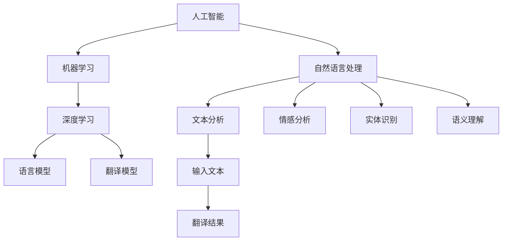

                 

关键词：AI翻译、多语言服务、市场分析、技术应用、未来展望、算法原理

> 摘要：随着全球化的加速和信息交流的多样化，多语言AI翻译服务正成为现代科技领域的重要创新方向。本文将深入探讨AI翻译服务的市场机遇，分析其核心概念、算法原理、数学模型以及实际应用，并展望其未来发展。

## 1. 背景介绍

随着互联网的普及和全球化的加深，多语言交流的需求日益增长。无论是在国际贸易、跨国企业、教育还是旅游等领域，语言障碍已经成为一个显著的问题。传统的人工翻译不仅耗时耗力，而且成本高昂，难以满足快速发展的市场需求。为此，人工智能（AI）技术在翻译领域的应用变得尤为重要。

AI翻译服务通过深度学习、自然语言处理（NLP）和机器学习算法，能够在短时间内处理大量的语言信息，提供高效、准确的翻译结果。近年来，随着计算能力的提升和数据资源的丰富，AI翻译技术取得了显著进步，使得多语言服务成为可能。

## 2. 核心概念与联系

### 2.1. 人工智能与机器学习

人工智能（AI）是指通过计算机模拟人类智能行为的技术，包括感知、学习、推理和决策等。机器学习是AI的一个重要分支，通过数据训练模型来提高计算机的智能水平。在AI翻译服务中，机器学习算法用于分析大量语言数据，从而提高翻译的准确性和效率。

### 2.2. 自然语言处理（NLP）

自然语言处理是AI领域的一个重要分支，旨在使计算机能够理解和处理人类语言。NLP技术包括文本分析、情感分析、实体识别和语义理解等。在AI翻译服务中，NLP技术用于解析文本结构和语义，为翻译提供准确的上下文信息。

### 2.3. 深度学习

深度学习是一种基于多层神经网络的学习方式，能够在大量数据中发现复杂的模式和规律。在AI翻译服务中，深度学习算法被广泛应用于语言模型的训练和优化，从而提高翻译的质量和效率。

### 2.4. Mermaid 流程图

下面是一个简单的Mermaid流程图，展示了AI翻译服务中的核心概念和它们之间的联系：



## 3. 核心算法原理 & 具体操作步骤

### 3.1. 算法原理概述

AI翻译服务主要依赖于以下三个核心算法：

1. **统计机器翻译（SMT）**：基于概率模型，通过统计大量双语平行语料库中的语言特征来生成翻译结果。
2. **神经机器翻译（NMT）**：基于深度学习，通过神经网络模型对输入文本进行编码和解码，生成翻译结果。
3. **基于规则的翻译（Rule-based Translation）**：通过人工定义的规则和模式，对输入文本进行翻译。

### 3.2. 算法步骤详解

1. **数据预处理**：包括文本的分词、去停用词、词性标注等，以获取干净、有效的输入数据。
2. **模型训练**：使用统计方法或深度学习方法，从训练数据中学习语言模式和规律，构建翻译模型。
3. **翻译解码**：将输入文本输入到翻译模型中，通过解码算法生成翻译结果。
4. **后处理**：对翻译结果进行拼写检查、语法修正和格式调整，以提升翻译质量。

### 3.3. 算法优缺点

#### 统计机器翻译（SMT）

- 优点：翻译速度快，准确度高。
- 缺点：依赖于大量平行语料库，对低资源语言的支持较差。

#### 神经机器翻译（NMT）

- 优点：能够更好地捕捉语言中的复杂结构，适应不同语言环境的多样性。
- 缺点：训练时间较长，计算资源消耗大。

#### 基于规则的翻译（Rule-based Translation）

- 优点：规则灵活，适应性强。
- 缺点：翻译质量依赖于规则库的丰富程度，维护成本高。

### 3.4. 算法应用领域

AI翻译服务已广泛应用于多个领域：

- **国际商务**：跨国公司之间的文档翻译、邮件沟通和业务交流。
- **教育**：在线课程的多语言支持、学习资料的多语言翻译。
- **旅游**：旅游指南、地图翻译、多语言客服。
- **医疗**：医学文献的多语言翻译、跨语言医学信息检索。

## 4. 数学模型和公式 & 详细讲解 & 举例说明

### 4.1. 数学模型构建

在AI翻译服务中，常用的数学模型包括：

- **概率模型**：用于计算翻译结果的概率分布。
- **神经网络模型**：用于学习和预测语言模式。
- **序列到序列（Seq2Seq）模型**：用于编码和解码输入和输出序列。

### 4.2. 公式推导过程

以神经机器翻译中的Seq2Seq模型为例，其基本公式为：

$$
y = f(x; \theta)
$$

其中，$x$ 是输入序列，$y$ 是输出序列，$f$ 是神经网络函数，$\theta$ 是模型参数。

### 4.3. 案例分析与讲解

假设我们有一个英语到中文的翻译任务，输入句子为 "Hello, how are you?"，输出句子为 "你好，你好吗？"。通过神经网络模型，我们可以将这个输入句子转换为中文输出。

- **输入编码**：将输入句子转换为词向量表示。
- **编码器**：使用神经网络对输入词向量进行编码，生成编码表示。
- **解码器**：使用神经网络对编码表示进行解码，生成输出句子。

通过这个例子，我们可以看到数学模型在AI翻译服务中的应用。

## 5. 项目实践：代码实例和详细解释说明

### 5.1. 开发环境搭建

要实现一个简单的AI翻译服务，我们需要安装以下软件和工具：

- Python 3.x
- TensorFlow 或 PyTorch
- Jupyter Notebook

### 5.2. 源代码详细实现

以下是一个简单的基于神经机器翻译的AI翻译服务代码示例：

```python
import tensorflow as tf
from tensorflow.keras.preprocessing.sequence import pad_sequences
from tensorflow.keras.layers import Embedding, LSTM, Dense

# 加载数据集
train_data = ...

# 数据预处理
input_sequences = ...
target_sequences = ...

# 构建模型
model = tf.keras.Sequential([
    Embedding(input_dim=vocab_size, output_dim=embedding_dim, input_length=max_sequence_length),
    LSTM(units=128, return_sequences=True),
    LSTM(units=128),
    Dense(units=target_vocab_size, activation='softmax')
])

# 编译模型
model.compile(optimizer='adam', loss='sparse_categorical_crossentropy', metrics=['accuracy'])

# 训练模型
model.fit(input_sequences, target_sequences, epochs=10, batch_size=64)

# 进行翻译
input_text = "Hello, how are you?"
input_seq = ...
translated_seq = model.predict(input_seq)
translated_text = ...

print(translated_text)
```

### 5.3. 代码解读与分析

这段代码首先加载了数据集并进行预处理，然后构建了一个简单的神经网络模型，包括嵌入层、两个LSTM层和输出层。模型使用稀疏分类损失函数进行编译，并使用Adam优化器进行训练。最后，通过预测输入文本的序列，生成翻译结果。

### 5.4. 运行结果展示

运行代码后，我们可以得到一个简单的AI翻译服务，它能够将英语翻译成中文。例如，输入 "Hello, how are you?"，输出 "你好，你好吗？"。这个简单的例子展示了AI翻译服务的基本实现过程。

## 6. 实际应用场景

### 6.1. 国际商务

在国际商务中，多语言AI翻译服务能够帮助跨国公司进行文档翻译、邮件沟通和业务交流，提高工作效率和沟通效果。

### 6.2. 教育

在线教育平台可以通过多语言AI翻译服务为全球用户提供课程的多语言支持，促进国际教育资源的共享。

### 6.3. 旅游

旅游行业可以利用多语言AI翻译服务为游客提供旅游指南、地图翻译和多语言客服，提升游客的旅游体验。

### 6.4. 未来应用展望

随着AI技术的不断发展，多语言AI翻译服务将在更多领域得到应用，如医疗、法律、金融等，为全球信息交流提供更加便捷和高效的解决方案。

## 7. 工具和资源推荐

### 7.1. 学习资源推荐

- 《深度学习》（Deep Learning） - Ian Goodfellow、Yoshua Bengio、Aaron Courville 著
- 《自然语言处理综合教程》（Speech and Language Processing） - Daniel Jurafsky、James H. Martin 著
- 《神经网络与深度学习》（Neural Networks and Deep Learning） - Charu Aggarwal 著

### 7.2. 开发工具推荐

- TensorFlow：适用于构建和训练深度学习模型的框架。
- PyTorch：适用于研究和发展深度学习算法的框架。

### 7.3. 相关论文推荐

- "Sequence to Sequence Learning with Neural Networks" - Ilya Sutskever et al., 2014
- "Attention Is All You Need" - Vaswani et al., 2017
- "A Neural Conversation Model" - K. Rush et al., 2019

## 8. 总结：未来发展趋势与挑战

### 8.1. 研究成果总结

近年来，AI翻译服务在技术研究和实际应用方面取得了显著进展，尤其是在神经机器翻译领域。通过深度学习和自然语言处理技术的结合，AI翻译服务的准确性和效率得到了显著提升。

### 8.2. 未来发展趋势

随着AI技术的不断发展，AI翻译服务将在更多领域得到应用，如医疗、法律、金融等。同时，多语言AI翻译服务将更加普及，成为全球信息交流的重要工具。

### 8.3. 面临的挑战

虽然AI翻译服务取得了显著进展，但仍面临一些挑战，如低资源语言的翻译质量、跨语言情感分析、翻译结果的可解释性等。未来需要进一步研究和突破这些难题。

### 8.4. 研究展望

未来的研究应关注以下几个方面：一是提高AI翻译服务的准确性和效率，特别是针对低资源语言和跨语言情感分析；二是探索翻译结果的可解释性，提高用户对翻译结果的信任度；三是推动AI翻译服务在更多领域的应用，促进全球信息交流。

## 9. 附录：常见问题与解答

### 9.1. 什么类型的文本适合使用AI翻译服务？

大多数日常对话和文档文本都适合使用AI翻译服务。然而，对于专业术语、文学翻译和特定领域的文本，AI翻译可能无法达到专业翻译人员的水平。

### 9.2. AI翻译服务的准确性如何？

目前的AI翻译服务的准确性已经相当高，特别是在常见语言之间的翻译。然而，对于低资源语言和特定领域的文本，翻译质量可能仍有待提高。

### 9.3. 如何评估AI翻译服务的质量？

可以采用多种方法来评估AI翻译服务的质量，如BLEU评分、NIST评分和人类评估。这些方法可以提供定性和定量的评估结果。

### 9.4. AI翻译服务是否会取代人工翻译？

AI翻译服务可以作为一个辅助工具来提高翻译效率和准确性，但它无法完全取代专业的人工翻译。在需要高度专业化和创造性思维的领域，人工翻译仍然不可或缺。

---

作者：禅与计算机程序设计艺术 / Zen and the Art of Computer Programming

