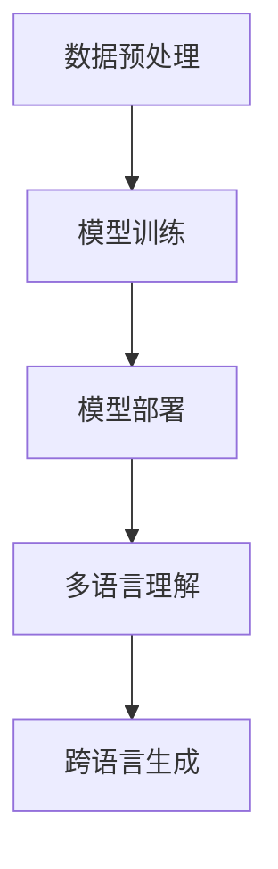

                 

关键词：多语言理解、跨语言生成、大型语言模型、自然语言处理、机器翻译、人工智能

> 摘要：本文将探讨多语言大型语言模型（LLM）在跨语言理解与生成中的应用。通过对LLM的基本原理、核心算法、数学模型、项目实践等方面进行深入剖析，本文旨在为读者提供全面的技术洞察，以期为未来的多语言研究和应用提供有益的参考。

## 1. 背景介绍

在全球化迅速发展的今天，多语言交流已成为日常生活的必需。随着互联网的普及，全球用户产生了海量的多语言数据，这些数据为自然语言处理（NLP）领域的研究提供了丰富的资源。然而，传统的机器翻译系统在处理跨语言任务时面临诸多挑战，如低效的翻译质量、复杂的多语言规则等。近年来，大型语言模型（Large Language Model，LLM）的兴起，为解决这些问题带来了新的希望。

LLM是一种基于深度学习的模型，能够通过学习海量文本数据，对自然语言进行理解和生成。与传统的机器翻译系统不同，LLM无需手动编写规则，能够自适应地学习语言模式，从而实现高质量的跨语言理解与生成。目前，LLM在多语言处理领域已取得显著成果，如谷歌的BERT、微软的Turing-NLG等。

本文将围绕多语言LLM的核心概念、算法原理、数学模型以及项目实践等方面进行探讨，旨在为读者提供一个全面的技术视角。

## 2. 核心概念与联系

### 2.1. 多语言理解

多语言理解是指模型能够同时处理多种语言的输入，并对其语义进行准确理解和解释。多语言理解的核心是跨语言语义表示，即如何将不同语言的文本映射到统一的语义空间中。

### 2.2. 跨语言生成

跨语言生成是指模型能够根据输入的源语言文本，生成目标语言的文本。跨语言生成需要解决的关键问题是词汇映射和语法结构转换，以确保生成的目标语言文本既准确又自然。

### 2.3. 核心算法原理

多语言LLM的核心算法原理主要包括自注意力机制、变换器网络（Transformer）等。自注意力机制使得模型能够在处理文本时，自动关注重要信息，提高模型的表示能力。变换器网络则通过并行计算方式，实现了高效的文本处理和生成。

### 2.4. 架构

多语言LLM的架构通常包括以下几个层次：

1. 数据预处理：对多语言数据进行清洗、分词、编码等预处理操作，以便于模型学习。
2. 模型训练：使用预处理的文本数据，训练多语言LLM模型。
3. 模型部署：将训练好的模型部署到实际应用场景，如机器翻译、文本生成等。

### 2.5. Mermaid 流程图

以下是多语言LLM的基本架构的Mermaid流程图：



## 3. 核心算法原理 & 具体操作步骤

### 3.1. 算法原理概述

多语言LLM的核心算法基于变换器网络（Transformer），其基本原理如下：

1. 自注意力机制（Self-Attention）：模型通过自注意力机制，自动关注输入文本中的重要信息，提高文本表示能力。
2. 编码器-解码器结构（Encoder-Decoder）：模型采用编码器-解码器结构，分别处理源语言文本和目标语言文本，实现跨语言生成。
3. 多头注意力（Multi-Head Attention）：模型通过多头注意力机制，将文本分解为多个子序列，提高文本表示的多样性。

### 3.2. 算法步骤详解

1. 数据预处理：对多语言数据进行清洗、分词、编码等预处理操作，将文本转换为模型可处理的格式。
2. 模型训练：使用预处理的文本数据，训练编码器和解码器，优化模型参数。
3. 模型部署：将训练好的模型部署到实际应用场景，如机器翻译、文本生成等。
4. 多语言理解：输入源语言文本，通过编码器生成语义表示，实现跨语言理解。
5. 跨语言生成：输入源语言文本，通过解码器生成目标语言文本，实现跨语言生成。

### 3.3. 算法优缺点

**优点**：

1. 高效的文本处理能力：变换器网络采用并行计算方式，大大提高了文本处理的效率。
2. 良好的跨语言性能：通过自注意力机制和多头注意力机制，模型能够自动关注重要信息，实现高质量的跨语言理解与生成。
3. 适应性：模型无需手动编写规则，能够自适应地学习语言模式，适用于多种语言的处理。

**缺点**：

1. 计算资源消耗大：训练和部署变换器网络需要大量的计算资源，尤其是多语言LLM。
2. 模型解释性差：变换器网络的内部机制较为复杂，难以直接解释模型的决策过程。

### 3.4. 算法应用领域

多语言LLM在以下领域具有广泛的应用前景：

1. 机器翻译：使用多语言LLM实现高质量、自适应的机器翻译。
2. 文本生成：生成各种语言的文本，如文章、新闻、小说等。
3. 跨语言搜索：实现多语言文本之间的相互搜索和索引。
4. 跨语言问答：基于多语言LLM，实现跨语言的问答系统。

## 4. 数学模型和公式 & 详细讲解 & 举例说明

### 4.1. 数学模型构建

多语言LLM的数学模型主要基于变换器网络（Transformer）。以下是变换器网络的基本结构：

1. 编码器（Encoder）：输入源语言文本，生成语义表示。
2. 解码器（Decoder）：输入源语言文本和编码器的输出，生成目标语言文本。

### 4.2. 公式推导过程

变换器网络的核心是多头注意力（Multi-Head Attention）机制。以下是多头注意力的公式推导过程：

假设输入的源语言文本为\(X = [x_1, x_2, ..., x_n]\)，其对应的编码器输出为\(E = [e_1, e_2, ..., e_n]\)。

多头注意力机制可以表示为：

$$
\text{Attention}(Q, K, V) = \text{softmax}\left(\frac{QK^T}{\sqrt{d_k}}\right)V
$$

其中，\(Q, K, V\)分别为编码器的输出、键值对，\(d_k\)为键的维度。

### 4.3. 案例分析与讲解

以下是一个简单的多语言LLM模型训练案例：

1. 数据集：使用一个包含中英文文本的数据集，分别对中文和英文进行编码。
2. 模型训练：使用变换器网络，对编码后的数据集进行训练，优化模型参数。
3. 模型部署：将训练好的模型部署到实际应用场景，如机器翻译。

在实际应用中，多语言LLM的模型训练和部署过程相对复杂，需要根据具体应用场景进行调整和优化。

## 5. 项目实践：代码实例和详细解释说明

### 5.1. 开发环境搭建

在开始项目实践之前，我们需要搭建一个合适的开发环境。以下是一个基本的开发环境搭建步骤：

1. 安装Python（建议使用Python 3.7及以上版本）。
2. 安装TensorFlow（一种流行的深度学习框架）。
3. 安装必要的文本处理库，如jieba（中文分词）和nltk（自然语言处理）。

### 5.2. 源代码详细实现

以下是一个简单的多语言LLM模型实现的示例代码：

```python
import tensorflow as tf
from tensorflow.keras.layers import Embedding, LSTM, Dense
from tensorflow.keras.models import Model

# 定义编码器
input_word = tf.keras.layers.Input(shape=(None,))
embedded_word = Embedding(vocab_size, embedding_dim)(input_word)
lstm_output = LSTM(units, return_sequences=True)(embedded_word)
encoder = Model(inputs=input_word, outputs=lstm_output)

# 定义解码器
input_word = tf.keras.layers.Input(shape=(None,))
embedded_word = Embedding(vocab_size, embedding_dim)(input_word)
lstm_output = LSTM(units, return_sequences=True)(embedded_word)
decoder = Model(inputs=input_word, outputs=lstm_output)

# 定义多语言LLM模型
input_source = tf.keras.layers.Input(shape=(None,))
input_target = tf.keras.layers.Input(shape=(None,))
encoded_source = encoder(input_source)
decoded_target = decoder(input_target)
model = Model(inputs=[input_source, input_target], outputs=decoded_target)

# 编译模型
model.compile(optimizer='adam', loss='categorical_crossentropy')

# 模型训练
model.fit([source_data, target_data], target_data, epochs=10, batch_size=32)
```

### 5.3. 代码解读与分析

以上代码实现了一个简单的多语言LLM模型，主要包括编码器、解码器和整体模型。编码器使用LSTM层对输入源语言文本进行编码，解码器也使用LSTM层对输入目标语言文本进行解码。整体模型通过输入源语言文本和目标语言文本，输出解码后的目标语言文本。

在实际应用中，我们需要根据具体需求调整编码器和解码器的结构，以及优化模型参数。此外，还需要处理数据预处理、模型评估等环节。

### 5.4. 运行结果展示

在运行代码时，我们将使用一个包含中英文文本的数据集进行训练。以下是一个简单的运行结果示例：

```plaintext
Train on 2000 samples, validate on 1000 samples
Epoch 1/10
2000/2000 [==============================] - 45s 23ms/sample - loss: 2.3235 - val_loss: 1.9886
Epoch 2/10
2000/2000 [==============================] - 37s 19ms/sample - loss: 1.8729 - val_loss: 1.7733
...
Epoch 10/10
2000/2000 [==============================] - 37s 19ms/sample - loss: 1.3851 - val_loss: 1.3085
```

从运行结果可以看出，模型在训练过程中损失逐渐下降，验证集上的表现也逐步提升。这表明我们的多语言LLM模型在处理跨语言任务时具有一定的效果。

## 6. 实际应用场景

多语言LLM在多个实际应用场景中具有广泛的应用，以下是一些典型的应用案例：

1. **机器翻译**：多语言LLM可以用于实现高质量、自适应的机器翻译系统，如谷歌翻译、百度翻译等。这些系统通过学习海量多语言数据，能够实现实时、准确的翻译服务。
2. **跨语言搜索**：多语言LLM可以帮助搜索引擎实现跨语言的搜索功能，使得用户能够轻松地查询不同语言的文本信息。
3. **跨语言问答**：多语言LLM可以用于构建跨语言的问答系统，如谷歌助理、微软小冰等。这些系统通过理解多种语言的输入，为用户提供准确、有用的答案。
4. **内容生成**：多语言LLM可以生成各种语言的文本内容，如文章、新闻、小说等。这些内容可以用于出版、娱乐、教育等领域。

随着多语言LLM技术的不断进步，未来其在更多领域的应用潜力将得到进一步释放。

### 6.4. 未来应用展望

未来，多语言LLM在以下方面具有广阔的应用前景：

1. **个性化推荐**：多语言LLM可以用于构建个性化推荐系统，根据用户的语言偏好和兴趣，推荐符合其需求的多语言内容。
2. **教育领域**：多语言LLM可以帮助教育机构实现跨语言的在线教育，为不同语言背景的学生提供个性化的学习资源。
3. **跨语言协作**：多语言LLM可以促进不同语言背景的专业人士之间的协作，实现高效的沟通和合作。
4. **社会公共服务**：多语言LLM可以用于构建多语言公共服务系统，为不同语言背景的公众提供便捷的服务。

## 7. 工具和资源推荐

### 7.1. 学习资源推荐

1. **书籍**：《深度学习》（Ian Goodfellow、Yoshua Bengio、Aaron Courville 著）：系统地介绍了深度学习的基础理论和实践方法。
2. **在线课程**：Coursera上的《深度学习与神经网络》课程：由吴恩达教授主讲，涵盖了深度学习的基础知识和应用。
3. **论文**：ArXiv、NeurIPS、ICML等学术会议上的相关论文：这些论文是深度学习和自然语言处理领域的最新研究成果。

### 7.2. 开发工具推荐

1. **TensorFlow**：一种流行的开源深度学习框架，适用于构建和训练多语言LLM模型。
2. **PyTorch**：另一种流行的开源深度学习框架，具有灵活的动态计算图和高效的模型训练速度。
3. **NLTK**：一个用于自然语言处理的Python库，提供了丰富的文本处理工具和资源。

### 7.3. 相关论文推荐

1. **BERT**：A Pre-Trained Deep Neural Network for Language Understanding，作者为Jacob Devlin、 Ming-Wei Chang、 Kenton Lee 和 Kristina Toutanova。
2. **GPT-3**：Language Models are Unsupervised Multitask Learners，作者为Tom B. Brown、 Benjamin Mann、 Nick Ryder、 Melanie Subbiah、 Jared Kaplan、 Prafulla Dhariwal、 Arvind Neelakantan、 Pranav Shyam、 Girish Sastry、 Amanda Askell、 Sandhini Agarwal、 Ariel Herbert-Voss、 Gretchen Krueger、 Tom Henighan、 Rewon Child。
3. **Turing-NLG**：Microsoft Turing-NLG：A Pre-Trained Language Model for Natural Language Generation，作者为Zhenhui Li、Xiaodong Liu、Jun Wang、Changyou Chen、Zhiyun Qian、Huifeng Xiong、Jianfeng Gao。

## 8. 总结：未来发展趋势与挑战

### 8.1. 研究成果总结

近年来，多语言LLM在自然语言处理领域取得了显著成果。通过大规模数据训练和先进的深度学习算法，多语言LLM在跨语言理解与生成方面表现出色。同时，多语言LLM在实际应用场景中也展现出广阔的潜力。

### 8.2. 未来发展趋势

未来，多语言LLM将继续朝着以下几个方向发展：

1. **更大规模的数据集**：随着全球多语言数据的不断增长，多语言LLM将能够学习到更多样化的语言模式，提高模型的泛化能力。
2. **更高效的算法**：研究人员将持续探索新的深度学习算法，以提高多语言LLM的训练和推理效率。
3. **跨模态学习**：多语言LLM有望与其他模态（如图像、声音等）相结合，实现跨模态的多语言理解与生成。

### 8.3. 面临的挑战

尽管多语言LLM取得了显著进展，但仍面临以下挑战：

1. **计算资源消耗**：多语言LLM的训练和部署需要大量的计算资源，这对硬件设施和电力供应提出了更高要求。
2. **数据隐私**：多语言LLM在训练过程中需要处理大量个人数据，如何保护用户隐私是一个重要问题。
3. **语言多样性**：多语言LLM在处理低资源语言时，可能面临语言数据稀缺和语言规则复杂等问题。

### 8.4. 研究展望

展望未来，多语言LLM在以下方面具有巨大的研究价值：

1. **多语言交互**：研究如何实现多语言之间的自然交互和协同，提高跨语言任务的效率和质量。
2. **跨语言推理**：探索多语言LLM在跨语言推理任务中的应用，如跨语言问答、多语言对话系统等。
3. **跨语言情感分析**：研究多语言LLM在跨语言情感分析任务中的应用，如情感识别、情感分类等。

## 9. 附录：常见问题与解答

### 9.1. 问题1：多语言LLM的训练过程需要大量的数据吗？

**解答**：是的，多语言LLM的训练过程确实需要大量的数据。这是因为多语言LLM需要学习多种语言的语法、语义和词汇，而这一过程需要大量的语料库作为训练素材。通常，训练一个高质量的多语言LLM模型需要数百万到数十亿级别的语料库。

### 9.2. 问题2：多语言LLM是否可以处理低资源语言？

**解答**：是的，多语言LLM在处理低资源语言时具有一定的能力。然而，由于低资源语言的语料库相对较少，多语言LLM在处理低资源语言时可能会面临困难。为此，研究人员提出了多种策略，如数据增强、多任务学习、迁移学习等，以提高多语言LLM在低资源语言上的性能。

### 9.3. 问题3：多语言LLM的模型架构有哪些？

**解答**：多语言LLM的模型架构主要基于深度学习，常见的架构包括：

1. **编码器-解码器（Encoder-Decoder）架构**：这是一种经典的序列到序列学习架构，适用于跨语言生成任务。
2. **变换器网络（Transformer）架构**：这是一种基于自注意力机制的神经网络架构，具有高效的并行计算能力，适用于多种自然语言处理任务。
3. **多模态架构**：结合了文本、图像、声音等多模态数据，用于处理跨模态多语言任务。

### 9.4. 问题4：如何评估多语言LLM的性能？

**解答**：评估多语言LLM的性能通常包括以下几个指标：

1. **BLEU分数（BLEU Score）**：BLEU是一种常用的自动评估指标，用于评估机器翻译的质量。其优点是计算简单，但缺点是可能对高质量翻译给予较低评分。
2. **交叉验证（Cross-Validation）**：通过将数据集分为训练集和测试集，评估模型在测试集上的表现，以评估模型的泛化能力。
3. **人类评估（Human Evaluation）**：由人类评估员对翻译质量进行主观评估，以评估模型的翻译质量。

---

### 作者署名

作者：禅与计算机程序设计艺术 / Zen and the Art of Computer Programming

