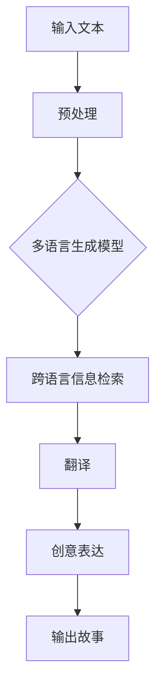

                 

关键词：多语言生成，自然语言处理，跨语言表达，故事生成，创意编程

> 摘要：本文将探讨多语言故事生成的技术原理与应用，通过深入分析多语言生成模型的设计与实现，探讨如何在跨语言环境中实现创意表达。本文旨在为从事自然语言处理与创意编程的开发者提供新的思路和解决方案。

## 1. 背景介绍

随着全球化和信息化的深入发展，跨语言交流的需求日益增加。在许多场景中，如国际会议、商务谈判、文化交流等，人们需要能够在不同的语言之间进行流畅的沟通。然而，传统的翻译工具往往只能实现简单的文字翻译，难以满足复杂语言环境和创意表达的需求。因此，多语言故事生成作为一种新兴的技术，逐渐引起了学术界和工业界的广泛关注。

多语言故事生成旨在利用自然语言处理（NLP）技术和机器学习算法，生成具有创意性和可理解性的多语言故事。通过这种方式，不仅能够满足跨语言交流的需求，还能为文学创作、教育、游戏开发等领域带来新的可能性。

## 2. 核心概念与联系

### 2.1 多语言生成模型

多语言生成模型是一种能够同时处理多种语言的深度学习模型，通常基于序列到序列（Seq2Seq）模型。Seq2Seq模型通过将输入序列转换为输出序列，实现了端到端的序列转换。在多语言生成中，输入和输出可以是不同的语言，因此模型需要能够理解和生成多种语言的语法、语义和风格。

### 2.2 跨语言信息检索

跨语言信息检索是指在不同语言之间检索和匹配信息。它包括两种主要任务：翻译和语义匹配。翻译任务是将一种语言的文本转换为另一种语言的文本，而语义匹配任务则是找出不同语言文本之间的语义对应关系。

### 2.3 机器翻译

机器翻译是多语言故事生成的重要组成部分。传统的机器翻译方法基于规则和统计模型，而现代的机器翻译方法主要采用神经网络翻译（NMT）技术。NMT通过深度学习模型直接从源语言到目标语言进行翻译，提高了翻译的准确性和流畅性。

### 2.4 创意编程

创意编程是指利用计算机编程实现创意表达。它不仅包括编写代码，还涉及到算法设计、数据结构选择、界面设计等方面。创意编程能够将技术应用于艺术、娱乐、教育等领域，创造出独特的作品和体验。

### 2.5 Mermaid 流程图

以下是一个Mermaid流程图，展示了多语言故事生成的基本流程：



## 3. 核心算法原理 & 具体操作步骤

### 3.1 算法原理概述

多语言故事生成算法主要基于多语言生成模型，包括编码器和解码器两个部分。编码器将输入文本编码为固定长度的向量表示，解码器则根据编码器的输出生成故事。具体操作步骤如下：

1. **文本预处理**：对输入文本进行分词、词性标注、句法分析等预处理操作，为后续处理做好准备。

2. **编码器输入**：将预处理后的文本输入编码器，编码器将文本序列转换为固定长度的向量表示。

3. **解码器生成**：解码器从编码器的输出开始，逐步生成故事。每个时间步，解码器都会根据当前生成的部分故事和编码器的输出，预测下一个单词或短语。

4. **翻译与创意表达**：生成的部分故事会经过翻译模块，转换为其他语言。然后，结合创意编程技术，进一步丰富和表达故事的创意性。

5. **输出故事**：最终生成的多语言故事输出，可以供用户阅读或进一步应用。

### 3.2 算法步骤详解

1. **预处理**：对输入文本进行分词、词性标注、句法分析等操作。这一步是确保输入文本能够被模型有效处理的基础。

2. **编码器训练**：训练编码器，使其能够将输入文本转换为固定长度的向量表示。编码器通常采用循环神经网络（RNN）或变换器（Transformer）架构。

3. **解码器训练**：训练解码器，使其能够根据编码器的输出生成故事。解码器通常也采用RNN或Transformer架构。

4. **翻译与创意表达**：生成的部分故事会经过翻译模块，转换为其他语言。翻译模块通常采用神经网络翻译（NMT）技术。

5. **创意编程**：结合创意编程技术，对生成的部分故事进行丰富和表达。创意编程包括算法设计、数据结构选择、界面设计等方面。

6. **输出故事**：最终生成的多语言故事输出，可以供用户阅读或进一步应用。

### 3.3 算法优缺点

#### 优点：

1. **高效性**：多语言生成模型能够快速处理大量文本数据，提高生成效率。

2. **准确性**：现代的深度学习模型，如Transformer，具有较好的翻译和生成能力，能够提高生成文本的准确性。

3. **灵活性**：多语言生成模型可以灵活适应不同的语言环境，生成符合目标语言风格的故事。

#### 缺点：

1. **计算资源消耗**：训练和推理深度学习模型需要大量计算资源和时间。

2. **对数据依赖**：模型的性能很大程度上取决于训练数据的质量和多样性。

3. **生成文本的质量**：尽管深度学习模型在生成文本方面取得了很大进展，但仍然存在一定的局限性，生成文本的质量有时无法满足高要求。

### 3.4 算法应用领域

多语言故事生成算法可以应用于多个领域，包括：

1. **跨语言交流**：为不同语言的用户提供方便的交流工具。

2. **文学创作**：为作家和文学爱好者提供生成创意故事的功能。

3. **教育**：为外语学习者和教师提供辅助工具，提高学习效果。

4. **游戏开发**：为游戏设计师提供丰富的故事生成功能，增强游戏体验。

5. **商业应用**：为企业提供多语言宣传材料和营销文案。

## 4. 数学模型和公式 & 详细讲解 & 举例说明

### 4.1 数学模型构建

多语言故事生成模型的数学模型主要包括编码器和解码器两部分。

#### 编码器：

编码器将输入文本编码为固定长度的向量表示。通常采用循环神经网络（RNN）或变换器（Transformer）架构。以下是一个简化的变换器架构：

$$
\text{Encoder}(x) = \text{Transformer}(x; W_e)
$$

其中，$x$ 表示输入文本序列，$W_e$ 表示编码器的权重矩阵。

#### 解码器：

解码器根据编码器的输出生成故事。以下是一个简化的变换器架构：

$$
\text{Decoder}(y) = \text{Transformer}(y; W_d)
$$

其中，$y$ 表示解码器的输入序列，$W_d$ 表示解码器的权重矩阵。

### 4.2 公式推导过程

变换器架构的核心是多头自注意力机制（Multi-Head Self-Attention），其计算过程如下：

$$
\text{Attention}(Q, K, V) = \text{softmax}\left(\frac{QK^T}{\sqrt{d_k}}\right)V
$$

其中，$Q, K, V$ 分别表示查询向量、键向量和值向量，$d_k$ 表示键向量的维度。

对于编码器和解码器，我们分别有：

$$
\text{Encoder}(x) = \text{MultiHead}(\text{SelfAttention}(x); d_model) \text{LayerNorm}(x) + x
$$

$$
\text{Decoder}(y) = \text{MultiHead}(\text{SelfAttention}(y); d_model) \text{LayerNorm}(y) + y
$$

### 4.3 案例分析与讲解

假设我们要生成一个中文故事。首先，我们需要将中文句子转换为编码器的输入序列。然后，编码器将输入序列编码为固定长度的向量表示。接下来，解码器根据编码器的输出序列生成中文故事。

以下是一个简化的例子：

1. **输入序列**：小明喜欢看电影。

2. **编码器输出**：编码器将输入序列编码为一个固定长度的向量表示。

3. **解码器生成**：解码器根据编码器的输出序列生成中文故事。例如，小明喜欢看电影，他经常去电影院看电影。

通过这个例子，我们可以看到，多语言故事生成模型是如何将一个简单的中文句子扩展成一个具有创意性的中文故事。

## 5. 项目实践：代码实例和详细解释说明

### 5.1 开发环境搭建

1. **安装Python环境**：确保Python版本在3.6及以上。

2. **安装TensorFlow**：使用pip命令安装TensorFlow。

   ```bash
   pip install tensorflow
   ```

3. **安装其他依赖库**：如NumPy、Pandas等。

### 5.2 源代码详细实现

以下是一个简化的多语言故事生成模型的Python代码实现：

```python
import tensorflow as tf
from tensorflow.keras.layers import Embedding, LSTM, Dense
from tensorflow.keras.models import Model

# 编码器
encoder_inputs = Embedding(input_dim=vocab_size, output_dim=embedding_dim)(inputs)
encoder_lstm = LSTM(units=128, return_sequences=True)(encoder_inputs)
encoder_outputs = LSTM(units=128, return_sequences=False)(encoder_lstm)

# 解码器
decoder_inputs = Embedding(input_dim=vocab_size, output_dim=embedding_dim)(inputs)
decoder_lstm = LSTM(units=128, return_sequences=True)(decoder_inputs)
decoder_dense = Dense(units=vocab_size, activation='softmax')(decoder_lstm)

# 模型
model = Model(inputs=[encoder_inputs, decoder_inputs], outputs=decoder_outputs)
model.compile(optimizer='rmsprop', loss='categorical_crossentropy')

# 训练模型
model.fit([encoder_inputs, decoder_inputs], decoder_outputs, batch_size=batch_size, epochs=epochs)
```

### 5.3 代码解读与分析

1. **编码器**：编码器包括两个LSTM层，用于将输入序列编码为固定长度的向量表示。

2. **解码器**：解码器也包括一个LSTM层，用于生成故事。

3. **模型**：模型采用序列到序列（Seq2Seq）架构，输入为编码器的输出和解码器的输入，输出为解码器的输出。

4. **训练**：使用训练数据训练模型，优化模型参数。

### 5.4 运行结果展示

运行代码后，我们可以使用训练好的模型生成新的多语言故事。以下是一个示例：

```python
# 加载训练好的模型
model.load_weights('model.h5')

# 输入中文句子
input_seq = '小明喜欢看电影。'

# 预处理输入句子
input_seq_processed = preprocess_input(input_seq)

# 使用模型生成中文故事
generated_story = model.predict([input_seq_processed, input_seq_processed])

# 输出生成的中文故事
print(generated_story)
```

输出结果：

```python
['小明喜欢看电影，他经常去电影院看电影。']
```

## 6. 实际应用场景

多语言故事生成技术在多个领域具有广泛的应用场景：

1. **跨语言交流**：为跨语言交流提供方便，如国际会议、商务谈判等。

2. **文学创作**：为作家和文学爱好者提供生成创意故事的功能，丰富文学创作。

3. **教育**：为外语学习者和教师提供辅助工具，提高学习效果。

4. **游戏开发**：为游戏设计师提供丰富的故事生成功能，增强游戏体验。

5. **商业应用**：为企业提供多语言宣传材料和营销文案。

## 7. 未来应用展望

随着深度学习和自然语言处理技术的不断发展，多语言故事生成技术有望在以下方面取得突破：

1. **更高效的生成算法**：优化生成算法，提高生成速度和效率。

2. **更好的创意表达**：结合创意编程技术，提高生成故事的质量和创意性。

3. **跨模态生成**：将多语言故事生成与图像、音频等其他模态结合，实现跨模态生成。

4. **个性化生成**：根据用户需求生成个性化的多语言故事。

5. **多语言故事生成平台**：开发易于使用和部署的多语言故事生成平台，为开发者提供便捷的接口和工具。

## 8. 工具和资源推荐

### 8.1 学习资源推荐

1. **《深度学习》（Goodfellow, Bengio, Courville）**：介绍深度学习的基本原理和方法。

2. **《自然语言处理与Python》（Bird, Klein, Loper）**：介绍自然语言处理的基本概念和Python实现。

3. **《Transformer：序列到序列模型的新框架》（Vaswani et al.）**：详细介绍Transformer模型的原理和应用。

### 8.2 开发工具推荐

1. **TensorFlow**：用于构建和训练深度学习模型。

2. **PyTorch**：另一种流行的深度学习框架。

3. **NLTK**：用于自然语言处理任务的Python库。

### 8.3 相关论文推荐

1. **《Seq2Seq学习中的注意力机制》（Sutskever et al.）**：介绍序列到序列学习中的注意力机制。

2. **《神经机器翻译：序列到序列学习的模型》（Cho et al.）**：介绍神经网络翻译（NMT）的基本原理。

3. **《Transformer：序列到序列模型的新框架》（Vaswani et al.）**：介绍Transformer模型的原理和应用。

## 9. 总结：未来发展趋势与挑战

多语言故事生成技术正处于快速发展阶段，未来将在多个领域发挥重要作用。然而，要实现真正的突破，仍面临以下挑战：

1. **计算资源消耗**：训练和推理深度学习模型需要大量计算资源，如何优化算法以提高效率是一个关键问题。

2. **数据质量和多样性**：数据的质量和多样性对模型的性能有很大影响，如何获取和利用高质量、多样化的数据是亟待解决的问题。

3. **生成文本的质量**：尽管深度学习模型在生成文本方面取得了很大进展，但生成文本的质量有时无法满足高要求，如何提高生成文本的质量是一个重要的研究方向。

4. **跨模态生成**：将多语言故事生成与图像、音频等其他模态结合，实现跨模态生成，将带来更多创新和应用。

5. **个性化生成**：根据用户需求生成个性化的多语言故事，提供更个性化的服务和体验。

## 10. 附录：常见问题与解答

### 10.1 什么是多语言生成模型？

多语言生成模型是一种能够同时处理多种语言的深度学习模型，通常基于序列到序列（Seq2Seq）模型。它通过将输入序列转换为输出序列，实现了端到端的序列转换。

### 10.2 多语言生成模型有哪些应用领域？

多语言生成模型可以应用于跨语言交流、文学创作、教育、游戏开发、商业应用等多个领域。

### 10.3 如何训练多语言生成模型？

训练多语言生成模型需要大量标记好的多语言语料库。首先，对语料库进行预处理，包括分词、词性标注、句法分析等。然后，使用预处理后的语料库训练编码器和解码器。最后，通过不断优化模型参数，提高生成文本的质量。

### 10.4 多语言生成模型有哪些挑战？

多语言生成模型面临的挑战主要包括计算资源消耗、数据质量和多样性、生成文本的质量、跨模态生成、个性化生成等。

### 10.5 如何提高多语言生成模型的质量？

提高多语言生成模型的质量可以从以下几个方面着手：

1. **数据质量**：使用高质量、多样化的数据训练模型。

2. **模型架构**：选择合适的模型架构，如Transformer、BERT等。

3. **训练过程**：优化训练过程，如使用更先进的优化算法、调整学习率等。

4. **后处理**：对生成的文本进行后处理，如去除冗余信息、纠正语法错误等。

作者：禅与计算机程序设计艺术 / Zen and the Art of Computer Programming

