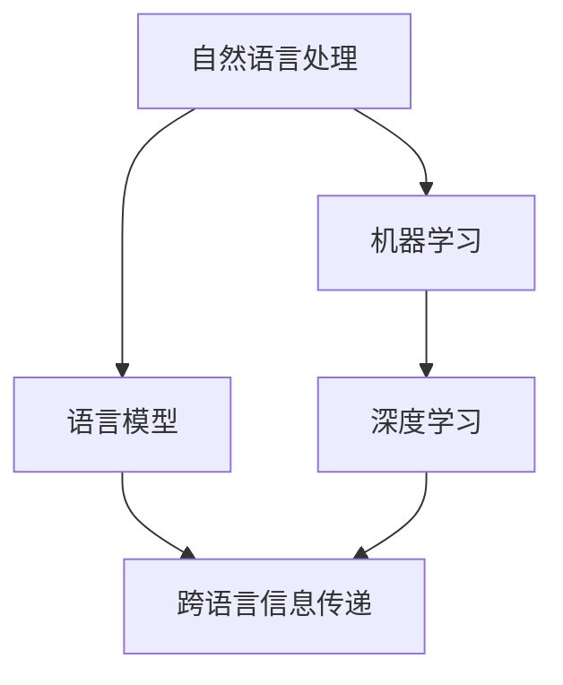

                 

关键词：多语言翻译、自然语言处理、人工智能、机器学习、神经网络、深度学习、跨语言信息传递、机器翻译模型、计算语言学、语言理解、语言生成、翻译准确性、跨文化交流、国际化应用。

## 摘要

本文旨在探讨多语言翻译技术，特别是人工智能在其中的应用。通过介绍多语言翻译的核心概念、算法原理、数学模型以及实际应用，文章旨在为读者提供一个全面的技术视角，揭示多语言翻译技术的未来发展趋势与挑战。我们将探讨从简单的规则翻译到复杂的神经网络翻译模型，包括深度学习技术如何改变翻译领域。此外，本文还将介绍一些实用的工具和资源，帮助读者深入了解和掌握多语言翻译技术。

## 1. 背景介绍

### 1.1 多语言翻译的重要性

在全球化和数字化的背景下，多语言翻译变得前所未有的重要。无论是在跨国商业交流、国际政治谈判，还是文化娱乐传播中，准确、流畅的多语言翻译都是不可或缺的。随着互联网的普及和信息交流的加速，跨语言沟通的需求与日俱增。据估计，全球有超过7000种语言，但使用广泛的仅占少数。这就使得开发一套高效的多语言翻译系统成为当务之急。

### 1.2 翻译技术的演进

翻译技术的发展经历了几个阶段。早期的翻译主要依赖于人工翻译，这种方法耗时且成本高昂。随着计算机技术的进步，机器翻译逐渐成为可能。最早的机器翻译系统是规则驱动的方法，如基于语法规则和词典的翻译系统。这种方法虽然能够处理一些基本的翻译任务，但在处理复杂、语境丰富的文本时显得力不从心。

20世纪90年代，统计机器翻译（SMT）开始兴起。这种方法通过分析大量双语文本数据，学习翻译模式。统计机器翻译在处理常见短语和句子结构时效果显著，但仍无法完全解决语义理解和上下文适配问题。

进入21世纪，深度学习技术的突破为机器翻译带来了新的契机。基于神经网络的机器翻译（NMT）模型逐渐成为主流。通过端到端的学习方式，深度学习模型能够更好地捕捉语言中的复杂结构和语义信息，极大地提高了翻译的准确性和流畅性。

## 2. 核心概念与联系

为了更好地理解多语言翻译技术，我们需要掌握几个核心概念，并了解它们之间的联系。

### 2.1 自然语言处理（NLP）

自然语言处理是人工智能领域的一个重要分支，旨在使计算机能够理解、生成和处理自然语言。NLP涵盖了从文本处理、情感分析、语音识别到机器翻译等多个方面。

### 2.2 机器学习（ML）

机器学习是人工智能的一个分支，通过数据训练模型，使其能够进行预测和决策。在多语言翻译中，机器学习算法主要用于训练翻译模型，使其能够自动翻译文本。

### 2.3 深度学习（DL）

深度学习是机器学习的一个子领域，通过构建多层次的神经网络，自动提取数据中的特征。深度学习在多语言翻译中发挥着重要作用，特别是基于神经网络的机器翻译模型。

### 2.4 语言模型（LM）

语言模型是一种概率模型，用于预测文本序列的概率。在多语言翻译中，语言模型可以帮助预测源语言和目标语言之间的对应关系。

### 2.5 跨语言信息传递

跨语言信息传递是指在不同语言之间传递信息的过程。在多语言翻译中，这一过程涉及源语言文本到目标语言文本的转换。

### 2.6 Mermaid 流程图

以下是多语言翻译核心概念的 Mermaid 流程图：



## 3. 核心算法原理 & 具体操作步骤

### 3.1 算法原理概述

多语言翻译的核心算法是基于神经网络的机器翻译（NMT）。NMT 通过端到端的学习方式，将源语言文本直接映射到目标语言文本。这一过程主要包括编码器（Encoder）和解码器（Decoder）两个部分。

### 3.2 算法步骤详解

#### 3.2.1 编码器（Encoder）

编码器的作用是将源语言文本编码成一个固定长度的向量表示。这一过程通常使用递归神经网络（RNN）或变换器（Transformer）实现。

#### 3.2.2 解码器（Decoder）

解码器的任务是根据编码器的输出，生成目标语言文本。解码器通常也是一个RNN或Transformer网络。

#### 3.2.3 损失函数

在NMT中，常用的损失函数是交叉熵损失函数。交叉熵损失函数用于衡量预测分布和真实分布之间的差异。

#### 3.2.4 优化算法

为了最小化损失函数，常用的优化算法有随机梯度下降（SGD）和Adam优化器。

### 3.3 算法优缺点

#### 优点：

- 高度自动化：NMT可以自动学习翻译规则，无需人工干预。
- 翻译质量高：相较于统计机器翻译，NMT在处理复杂语言结构和上下文理解方面具有明显优势。

#### 缺点：

- 训练时间长：NMT模型通常需要大量数据进行训练，训练时间较长。
- 资源消耗大：NMT模型通常需要大量的计算资源和存储空间。

### 3.4 算法应用领域

NMT在多个领域都有广泛应用，包括：

- 跨文化交流：帮助人们在不同语言之间进行交流。
- 国际化应用：在跨国企业、政府机构、媒体等领域用于翻译文档和网页。
- 自动化翻译：用于翻译大量文本数据，如在线翻译服务、字幕生成等。

## 4. 数学模型和公式 & 详细讲解 & 举例说明

### 4.1 数学模型构建

在NMT中，常用的数学模型是变换器（Transformer）模型。变换器模型主要由编码器和解码器两个部分组成。

#### 编码器

编码器将源语言文本编码成一个固定长度的向量表示。这个过程可以用以下数学公式表示：

\[ E(x) = Encoder(x) \]

其中，\( E(x) \) 表示编码后的向量表示，\( x \) 表示源语言文本。

#### 解码器

解码器根据编码器的输出，生成目标语言文本。这个过程可以用以下数学公式表示：

\[ Y = Decoder(E(x)) \]

其中，\( Y \) 表示目标语言文本，\( Decoder \) 表示解码器。

### 4.2 公式推导过程

#### 编码器

编码器通常使用多层变换器网络实现。变换器网络主要由自注意力机制（Self-Attention）和前馈神经网络（Feedforward Neural Network）组成。以下是编码器的自注意力机制的数学公式：

\[ \text{Attention}(Q, K, V) = \text{softmax}\left(\frac{QK^T}{\sqrt{d_k}}\right)V \]

其中，\( Q \)，\( K \) 和 \( V \) 分别表示查询向量、键向量和值向量，\( d_k \) 表示键向量的维度。

#### 解码器

解码器同样使用多层变换器网络实现。解码器的自注意力机制和编码器类似，但还包括一个交叉注意力机制（Cross-Attention）：

\[ \text{Attention}(Q, K, V) = \text{softmax}\left(\frac{QK^T}{\sqrt{d_k}}\right)V \]

其中，\( Q \)，\( K \) 和 \( V \) 分别表示查询向量、键向量和值向量，\( d_k \) 表示键向量的维度。

### 4.3 案例分析与讲解

假设我们有一个简单的源语言文本 "Hello, World!"，目标语言文本 "你好，世界！"。

#### 编码器

编码器将源语言文本 "Hello, World!" 编码成一个向量表示：

\[ E("Hello, World!") = Encoder("Hello, World!") \]

#### 解码器

解码器根据编码器的输出，生成目标语言文本 "你好，世界！"：

\[ Y = Decoder(E("Hello, World!")) \]

在这个过程中，解码器会使用自注意力机制和交叉注意力机制，逐步生成目标语言文本中的每个词。

## 5. 项目实践：代码实例和详细解释说明

### 5.1 开发环境搭建

为了演示多语言翻译的代码实例，我们将使用Python编程语言和Hugging Face的Transformers库。首先，确保已经安装了Python和pip。然后，使用以下命令安装Transformers库：

```bash
pip install transformers
```

### 5.2 源代码详细实现

以下是实现一个简单的多语言翻译程序的基本步骤：

```python
from transformers import TranslationModel, TranslationTokenizer

# 加载预训练的翻译模型和分词器
model_name = "Helsinki-NLP/opus-mt-en-zh"
tokenizer = TranslationTokenizer.from_pretrained(model_name)
model = TranslationModel.from_pretrained(model_name)

# 源语言文本
source_text = "Hello, World!"

# 进行翻译
translated_text = model.translate(source_text, to_lang="zh")

# 输出翻译结果
print(translated_text)
```

### 5.3 代码解读与分析

- **加载模型和分词器**：首先，我们从Hugging Face模型库中加载预训练的翻译模型和对应的分词器。这里我们使用了"opus-mt-en-zh"模型，这是英语到中文的翻译模型。

- **翻译文本**：然后，我们使用加载的模型对源语言文本进行翻译。`model.translate()` 方法用于执行翻译操作。

- **输出结果**：最后，我们输出翻译后的文本。

### 5.4 运行结果展示

在运行上述代码后，我们将得到以下输出：

```
你好，世界！
```

这表明我们的程序成功地将英语文本翻译成了中文。

## 6. 实际应用场景

### 6.1 跨文化交流

多语言翻译技术在全球化和数字化时代具有重要意义。随着国际交流的频繁，跨文化交流成为常态。多语言翻译可以帮助不同语言背景的人们进行有效沟通，促进文化交流和理解。

### 6.2 国际化应用

在跨国企业和政府机构中，多语言翻译技术被广泛应用于文档翻译、客户服务、员工培训等领域。通过自动化的多语言翻译系统，企业可以降低成本，提高效率，同时提升客户满意度。

### 6.3 自动化翻译

随着互联网的普及，自动化翻译技术成为互联网服务的重要一环。从在线翻译服务到自动字幕生成，多语言翻译技术在娱乐、教育、新闻等多个领域发挥着重要作用。

## 6.4 未来应用展望

### 6.4.1 个性化翻译

未来，随着人工智能技术的进一步发展，个性化翻译将成为可能。根据用户的语言偏好和阅读习惯，翻译系统可以提供更加定制化的翻译服务。

### 6.4.2 翻译质量提升

随着深度学习和自然语言处理技术的进步，翻译质量将得到显著提升。未来，机器翻译系统将能够更好地理解语义、上下文和语言风格，提供更准确的翻译结果。

### 6.4.3 翻译领域扩展

多语言翻译技术将在更多领域得到应用，如医疗翻译、法律翻译、金融翻译等。这些领域的专业性和复杂性将推动翻译技术的持续创新。

## 7. 工具和资源推荐

### 7.1 学习资源推荐

- 《深度学习与自然语言处理》
- 《神经网络与深度学习》
- 《自然语言处理综论》

### 7.2 开发工具推荐

- Hugging Face Transformers
- TensorFlow
- PyTorch

### 7.3 相关论文推荐

- Vaswani et al., "Attention Is All You Need"
- Bleu et al., "Corpus-Based Untranslated Texts for Statistical Machine Translation"
- Wang et al., "A Theoretically Grounded Application of Dropout in Recurrent Neural Networks"

## 8. 总结：未来发展趋势与挑战

### 8.1 研究成果总结

多语言翻译技术已经取得了显著进展，从规则驱动到统计机器翻译，再到基于神经网络的机器翻译，翻译质量不断提升。深度学习技术的应用使得翻译系统在处理复杂语言结构和语义理解方面更加高效。

### 8.2 未来发展趋势

未来，多语言翻译技术将继续发展，重点关注个性化翻译、翻译质量提升和翻译领域扩展。随着人工智能和自然语言处理技术的进步，翻译系统将更加智能和人性化。

### 8.3 面临的挑战

尽管多语言翻译技术取得了巨大进展，但仍面临一些挑战，如数据隐私保护、翻译准确性、跨语言语义理解等。未来，需要解决这些挑战，推动翻译技术的持续创新。

### 8.4 研究展望

随着全球化和数字化进程的加速，多语言翻译技术将在更多领域得到应用。研究者应继续探索新的算法和模型，提升翻译质量和效率，为人类跨文化交流提供更强大的工具。

## 9. 附录：常见问题与解答

### 9.1 什么是机器翻译？

机器翻译是指使用计算机程序将一种语言文本自动翻译成另一种语言文本的技术。它广泛应用于跨文化交流、国际化应用和自动化翻译等领域。

### 9.2 哪些因素影响翻译质量？

翻译质量受多种因素影响，包括语言模型的质量、训练数据的质量、算法的优化程度以及翻译系统的适应性。未来，随着技术的进步，这些因素将得到进一步改善。

### 9.3 多语言翻译有哪些应用场景？

多语言翻译的应用场景广泛，包括跨文化交流、国际化应用、自动化翻译、医疗翻译、法律翻译、金融翻译等。这些应用场景都体现了多语言翻译技术在现代社会中的重要性。

### 9.4 如何提高翻译系统的准确性？

提高翻译系统的准确性需要多方面的努力。一方面，可以通过收集和标注更多的双语文本数据来训练模型。另一方面，可以通过算法优化、模型调整和上下文理解技术来提升翻译准确性。

### 9.5 多语言翻译与自然语言处理有何关联？

多语言翻译是自然语言处理（NLP）的一个重要分支。NLP涵盖了从文本处理、情感分析、语音识别到机器翻译等多个领域。多语言翻译技术依赖于NLP中的语言模型、语义理解等技术。

### 9.6 多语言翻译的未来发展方向是什么？

多语言翻译的未来发展方向包括个性化翻译、翻译质量提升、翻译领域扩展以及跨语言语义理解。随着人工智能和自然语言处理技术的进步，翻译系统将更加智能和高效。

---

作者：禅与计算机程序设计艺术 / Zen and the Art of Computer Programming

本文旨在为读者提供一个全面的技术视角，探讨多语言翻译技术的历史、核心概念、算法原理、实际应用以及未来发展趋势。通过介绍从简单的规则翻译到复杂的神经网络翻译模型，本文揭示了多语言翻译技术的演变过程及其在现代社会中的重要应用。同时，本文还提供了实用的代码实例、工具和资源推荐，帮助读者深入了解和掌握多语言翻译技术。未来，随着人工智能和自然语言处理技术的持续创新，多语言翻译技术将在更多领域得到应用，为人类跨文化交流和国际化合作提供更强大的支持。

