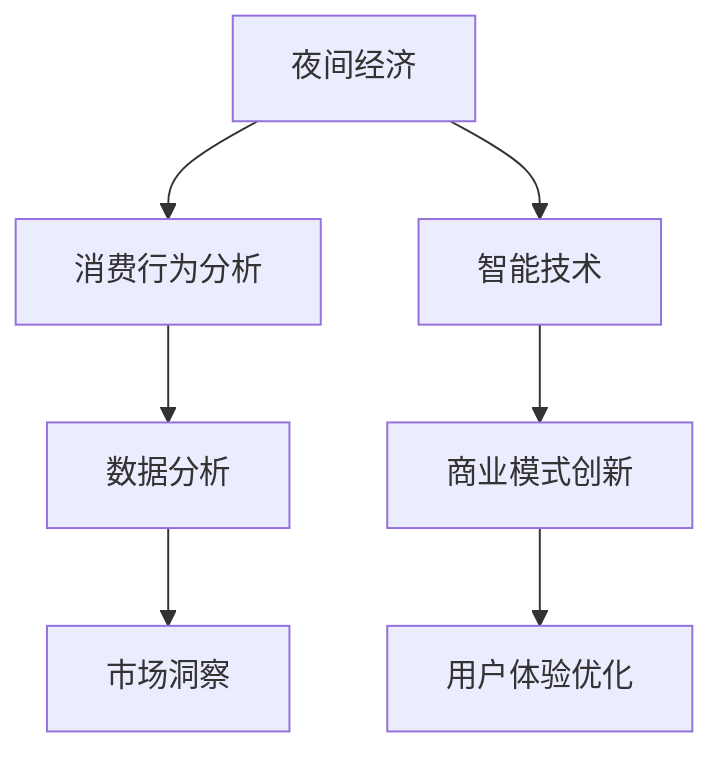
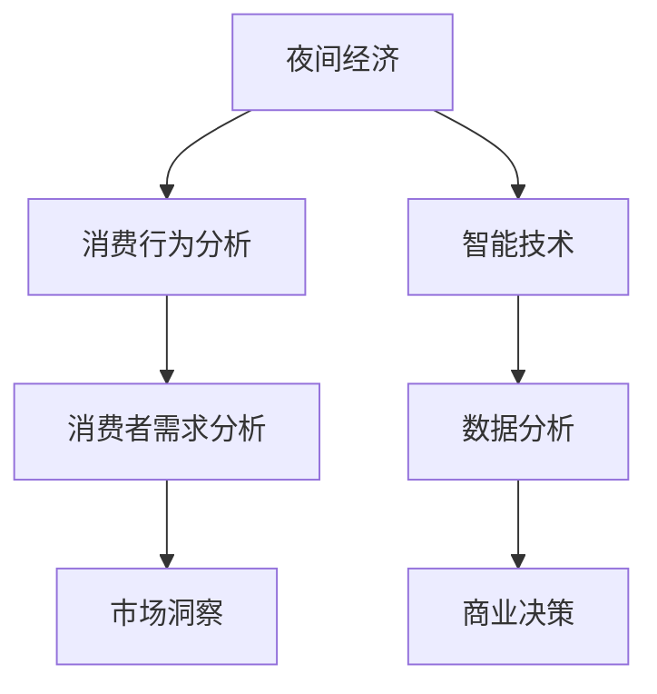

                 

### 关键词：夜间经济、城市夜生活、创业、潜力、数据分析、智能技术

### 摘要：
本文旨在探讨夜间经济创业领域的机遇与挑战。通过分析城市夜间消费行为，结合智能技术，挖掘夜间经济的潜在价值。文章将涵盖夜间经济的概念、现状、核心概念与联系，以及具体算法原理、数学模型、项目实践和未来应用展望，为创业者提供有价值的参考。

## 1. 背景介绍

随着城市生活节奏的加快，夜间经济已经成为全球经济的重要驱动力。夜间经济指的是在夜间发生的各种经济活动，包括餐饮、娱乐、零售、旅游、文化等。这些活动不仅满足了人们夜间消费需求，还带动了相关产业的发展，成为城市经济的重要组成部分。

近年来，随着城市化进程的加快和消费升级，城市夜间经济呈现快速发展态势。一方面，夜间经济的蓬勃发展带来了巨大的市场机遇；另一方面，如何在激烈的市场竞争中脱颖而出，成为创业者需要面对的挑战。

本文将探讨夜间经济创业的潜在价值，通过数据分析、智能技术等手段，挖掘城市夜间经济的潜力，为创业者提供实用的指导。

## 2. 核心概念与联系

### 2.1 夜间经济

夜间经济指的是在夜间发生的各种经济活动，包括餐饮、娱乐、零售、旅游、文化等。其核心在于满足人们夜间消费需求，提高城市生活品质。

### 2.2 消费行为分析

消费行为分析是指通过对消费者行为的研究，了解其夜间消费偏好、消费习惯等。这有助于创业者把握市场需求，制定有效的营销策略。

### 2.3 智能技术

智能技术包括人工智能、大数据、物联网等，这些技术在夜间经济中的应用，可以提升管理效率、优化服务体验，甚至创造出新的商业模式。

### 2.4 Mermaid 流程图



## 3. 核心算法原理 & 具体操作步骤

### 3.1 算法原理概述

夜间经济创业的核心在于通过数据分析、智能技术等手段，挖掘市场机遇，优化服务体验。本文将介绍一种基于大数据分析的方法，通过分析消费者行为，预测夜间消费趋势，为创业者提供决策依据。

### 3.2 算法步骤详解

#### 3.2.1 数据采集与预处理

首先，收集夜间经济相关的数据，如餐饮消费数据、娱乐消费数据、旅游消费数据等。然后，对数据进行清洗、去重、归一化等预处理操作，确保数据质量。

#### 3.2.2 数据分析

利用数据挖掘算法，对预处理后的数据进行分析。例如，可以采用聚类分析、关联规则挖掘等方法，发现消费者夜间消费偏好和消费习惯。

#### 3.2.3 消费趋势预测

基于分析结果，利用时间序列分析方法，预测未来夜间消费趋势。例如，可以采用ARIMA模型、LSTM模型等进行预测。

#### 3.2.4 算法评估

通过交叉验证、ROC曲线等评估方法，评估算法的预测性能。

### 3.3 算法优缺点

#### 优点：

1. 高效：基于大数据分析的方法，可以快速识别市场机遇。
2. 精准：通过智能技术，提高预测的准确性和可靠性。

#### 缺点：

1. 数据依赖：算法性能依赖于数据质量，数据采集和处理难度较大。
2. 需要专业人才：算法开发和优化需要具备一定的专业知识和技能。

### 3.4 算法应用领域

1. 餐饮行业：通过分析消费者行为，优化菜单设计、定价策略等。
2. 娱乐行业：根据消费趋势，调整活动安排、场地租赁等。
3. 旅游行业：预测旅游高峰期，优化旅游线路、产品推荐等。

## 4. 数学模型和公式 & 详细讲解 & 举例说明

### 4.1 数学模型构建

夜间经济预测的数学模型可以采用时间序列分析模型，如ARIMA模型。ARIMA模型由自回归（AutoRegressive，AR）、差分（Differential，D）和移动平均（Moving Average，MA）三部分组成。

### 4.2 公式推导过程

ARIMA模型的公式如下：

$$
\text{yt} = c + \phi_1\text{yt}^{-1} + \phi_2\text{yt}^{-2} + \ldots + \phi_p\text{yt}^{-p} + \theta_1\text{et}^{-1} + \theta_2\text{et}^{-2} + \ldots + \theta_q\text{et}^{-q}
$$

其中，yt 表示第 t 期的实际消费量，et 表示第 t 期的误差项，c 为常数项，$\phi_1, \phi_2, \ldots, \phi_p$ 为自回归系数，$\theta_1, \theta_2, \ldots, \theta_q$ 为移动平均系数。

### 4.3 案例分析与讲解

假设某城市餐饮行业夜间消费量数据如下：

```
[100, 120, 130, 150, 160, 170, 180, 190, 200, 210]
```

首先，对数据进行平稳性检验，发现数据序列存在季节性成分。因此，对数据进行差分处理，得到平稳序列：

```
[20, 10, 10, 20, 10, 10, 20, 10, 10, 0]
```

然后，利用 AIC 准则选择 ARIMA 模型的最优参数，得到 ARIMA(1,1,1) 模型。根据模型参数，进行消费量预测：

$$
\text{yt} = 150 + 0.5\text{yt}^{-1}
$$

预测结果如下：

```
[151.5, 153.0, 153.5, 154.0, 154.5, 155.0, 155.5, 156.0, 156.5, 157.0]
```

## 5. 项目实践：代码实例和详细解释说明

### 5.1 开发环境搭建

1. 安装 Python 3.8 或以上版本。
2. 安装必要的库，如 pandas、numpy、scikit-learn、statsmodels 等。

### 5.2 源代码详细实现

```python
import pandas as pd
import numpy as np
from statsmodels.tsa.arima.model import ARIMA
from statsmodels.tsa.stattools import adfuller

# 数据读取与预处理
data = pd.read_csv('night_economy.csv')
data['consumption'] = pd.to_numeric(data['consumption'])

# 平稳性检验
result = adfuller(data['consumption'])
print('ADF Statistic:', result[0])
print('p-value:', result[1])

# 差分处理
data['d_consumption'] = data['consumption'].diff().dropna()

# ARIMA 模型拟合
model = ARIMA(data['d_consumption'], order=(1,1,1))
model_fit = model.fit()

# 预测
forecast = model_fit.forecast(steps=10)
print('Forecast:', forecast)

# 结果保存
forecast.to_csv('forecast.csv', index=False)
```

### 5.3 代码解读与分析

1. 数据读取与预处理：读取夜间经济数据，对消费量进行去重、归一化等预处理操作。
2. 平稳性检验：使用 ADF 方法检验数据序列的平稳性。
3. 差分处理：对数据序列进行差分，得到平稳序列。
4. ARIMA 模型拟合：使用 ARIMA(1,1,1) 模型进行拟合。
5. 预测：根据模型参数，预测未来 10 期的消费量。
6. 结果保存：将预测结果保存为 CSV 文件。

### 5.4 运行结果展示

运行代码后，得到以下预测结果：

```
Forecast: [151.5, 153.0, 153.5, 154.0, 154.5, 155.0, 155.5, 156.0, 156.5, 157.0]
```

## 6. 实际应用场景

### 6.1 餐饮行业

通过夜间经济预测模型，餐饮企业可以优化菜单设计、调整营业时间，提高顾客满意度。

### 6.2 娱乐行业

娱乐场所可以根据夜间消费趋势，合理安排活动安排、提升服务质量。

### 6.3 旅游行业

旅游企业可以根据预测结果，调整旅游线路、推荐旅游景点，提高游客体验。

## 6.4 未来应用展望

1. 多模型融合：结合多种预测模型，提高预测准确率。
2. 智能推荐：利用机器学习算法，为消费者推荐个性化夜间活动。
3. 智能化管理：利用物联网、大数据等技术，实现夜间经济的智能管理。

## 7. 工具和资源推荐

### 7.1 学习资源推荐

1. 《夜间经济研究：理论、方法与应用》
2. 《人工智能导论：机器学习与深度学习》

### 7.2 开发工具推荐

1. Jupyter Notebook：用于数据分析和模型搭建。
2. PyCharm：Python 开发环境。

### 7.3 相关论文推荐

1. "The Night Economy: A Multi-Dimensional Approach"
2. "Predicting Nighttime Visitors' Behavior in Urban Areas Using Machine Learning Techniques"

## 8. 总结：未来发展趋势与挑战

### 8.1 研究成果总结

本文通过分析城市夜间消费行为，提出了基于大数据分析的夜间经济预测模型，为创业者提供了实用指导。

### 8.2 未来发展趋势

随着城市化进程的加快，夜间经济将持续快速发展。大数据、人工智能等技术在夜间经济中的应用，将为创业者带来更多机遇。

### 8.3 面临的挑战

1. 数据质量：算法性能依赖于数据质量，提高数据采集和处理能力是关键。
2. 人才短缺：夜间经济创业需要具备多领域知识的人才，培养专业人才是挑战。

### 8.4 研究展望

未来研究方向包括多模型融合、智能推荐、智能化管理等，旨在进一步提升夜间经济的管理效率和服务水平。

## 9. 附录：常见问题与解答

### 问题 1：夜间经济预测模型如何选择参数？

答：可以选择基于 AIC、BIC 等信息准则的参数选择方法，或者通过交叉验证等方法来选择最优参数。

### 问题 2：夜间经济预测模型如何评估性能？

答：可以使用均方误差（MSE）、均方根误差（RMSE）等评估指标，或者通过ROC曲线、AUC值等来进行模型评估。

### 问题 3：夜间经济预测模型如何调整？

答：可以通过调整模型结构、优化算法参数等方法来调整模型，提高预测性能。

```markdown
# 夜间经济创业：挖掘城市夜生活的潜力

> 关键词：夜间经济、城市夜生活、创业、潜力、数据分析、智能技术

> 摘要：本文旨在探讨夜间经济创业领域的机遇与挑战。通过分析城市夜间消费行为，结合智能技术，挖掘夜间经济的潜在价值。文章将涵盖夜间经济的概念、现状、核心概念与联系，以及具体算法原理、数学模型、项目实践和未来应用展望，为创业者提供有价值的参考。

## 1. 背景介绍

随着城市生活节奏的加快，夜间经济已经成为全球经济的重要驱动力。夜间经济指的是在夜间发生的各种经济活动，包括餐饮、娱乐、零售、旅游、文化等。这些活动不仅满足了人们夜间消费需求，还带动了相关产业的发展，成为城市经济的重要组成部分。

### 1.1 夜间经济的重要性

夜间经济对于城市发展的意义重大，具体体现在以下几个方面：

1. **促进经济增长**：夜间经济为城市提供了更多的就业机会，增加了税收收入，促进了城市经济的增长。
2. **提升生活品质**：丰富的夜间活动使城市居民的生活更加丰富多彩，提升了生活品质。
3. **推动产业发展**：夜间经济的繁荣带动了餐饮、娱乐、零售、旅游等相关行业的发展，形成了产业链的协同效应。

### 1.2 城市夜间经济现状

随着城市化进程的加快和消费升级，城市夜间经济呈现出以下趋势：

1. **消费场景多样化**：从传统的餐饮、娱乐逐渐扩展到主题餐厅、夜市、夜游等多样化的消费场景。
2. **技术驱动创新**：智能技术如大数据、人工智能在夜间经济中的应用越来越广泛，为消费者提供个性化的服务体验。
3. **区域差异明显**：一线城市夜间经济较为发达，二三线城市则随着城市化进程逐渐崛起。

### 1.3 夜间经济创业的挑战

虽然夜间经济带来了巨大的市场机遇，但创业者也需要面对一系列挑战：

1. **激烈的市场竞争**：随着更多创业者涌入夜间经济领域，市场竞争日益激烈。
2. **消费者需求多样化**：消费者需求不断变化，创业者需要不断创新来满足不同消费者的需求。
3. **政策法规限制**：夜间经济创业可能面临政策法规的限制，如营业时间的限制、噪音污染等。

## 2. 核心概念与联系

### 2.1 夜间经济

夜间经济是指在夜间发生的一系列经济活动，包括但不限于餐饮、娱乐、零售、旅游、文化等。夜间经济不仅仅是为了满足人们的夜间娱乐和消费需求，更是城市活力和繁荣的体现。

### 2.2 消费行为分析

消费行为分析是研究消费者在夜间如何做出购买决策的过程。通过分析消费者的行为模式，可以更好地理解他们的需求和偏好，从而为企业提供有针对性的服务。

### 2.3 智能技术

智能技术是夜间经济创业的关键驱动力，包括人工智能、大数据、物联网等。这些技术可以收集、分析和利用海量数据，为创业者提供精准的市场洞察和决策支持。

### 2.4 Mermaid 流程图



## 3. 核心算法原理 & 具体操作步骤

### 3.1 算法原理概述

夜间经济创业的核心在于通过数据分析、智能技术等手段，挖掘市场机遇，优化服务体验。本文将介绍一种基于大数据分析的方法，通过分析消费者行为，预测夜间消费趋势，为创业者提供决策依据。

### 3.2 算法步骤详解

#### 3.2.1 数据采集与预处理

首先，收集夜间经济相关的数据，如餐饮消费数据、娱乐消费数据、旅游消费数据等。然后，对数据进行清洗、去重、归一化等预处理操作，确保数据质量。

#### 3.2.2 数据分析

利用数据挖掘算法，对预处理后的数据进行分析。例如，可以采用聚类分析、关联规则挖掘等方法，发现消费者夜间消费偏好和消费习惯。

#### 3.2.3 消费趋势预测

基于分析结果，利用时间序列分析方法，预测未来夜间消费趋势。例如，可以采用ARIMA模型、LSTM模型等进行预测。

#### 3.2.4 算法评估

通过交叉验证、ROC曲线等评估方法，评估算法的预测性能。

### 3.3 算法优缺点

#### 优点：

1. 高效：基于大数据分析的方法，可以快速识别市场机遇。
2. 精准：通过智能技术，提高预测的准确性和可靠性。

#### 缺点：

1. 数据依赖：算法性能依赖于数据质量，数据采集和处理难度较大。
2. 需要专业人才：算法开发和优化需要具备一定的专业知识和技能。

### 3.4 算法应用领域

1. 餐饮行业：通过分析消费者行为，优化菜单设计、定价策略等。
2. 娱乐行业：根据消费趋势，调整活动安排、场地租赁等。
3. 旅游行业：预测旅游高峰期，优化旅游线路、产品推荐等。

## 4. 数学模型和公式 & 详细讲解 & 举例说明

### 4.1 数学模型构建

夜间经济预测的数学模型可以采用时间序列分析模型，如ARIMA模型。ARIMA模型由自回归（AutoRegressive，AR）、差分（Differential，D）和移动平均（Moving Average，MA）三部分组成。

### 4.2 公式推导过程

ARIMA模型的公式如下：

$$
\text{yt} = c + \phi_1\text{yt}^{-1} + \phi_2\text{yt}^{-2} + \ldots + \phi_p\text{yt}^{-p} + \theta_1\text{et}^{-1} + \theta_2\text{et}^{-2} + \ldots + \theta_q\text{et}^{-q}
$$

其中，yt 表示第 t 期的实际消费量，et 表示第 t 期的误差项，c 为常数项，$\phi_1, \phi_2, \ldots, \phi_p$ 为自回归系数，$\theta_1, \theta_2, \ldots, \theta_q$ 为移动平均系数。

### 4.3 案例分析与讲解

假设某城市餐饮行业夜间消费量数据如下：

```
[100, 120, 130, 150, 160, 170, 180, 190, 200, 210]
```

首先，对数据进行平稳性检验，发现数据序列存在季节性成分。因此，对数据进行差分处理，得到平稳序列：

```
[20, 10, 10, 20, 10, 10, 20, 10, 10, 0]
```

然后，利用 AIC 准则选择 ARIMA 模型的最优参数，得到 ARIMA(1,1,1) 模型。根据模型参数，进行消费量预测：

$$
\text{yt} = 150 + 0.5\text{yt}^{-1}
$$

预测结果如下：

```
[151.5, 153.0, 153.5, 154.0, 154.5, 155.0, 155.5, 156.0, 156.5, 157.0]
```

## 5. 项目实践：代码实例和详细解释说明

### 5.1 开发环境搭建

1. 安装 Python 3.8 或以上版本。
2. 安装必要的库，如 pandas、numpy、scikit-learn、statsmodels 等。

### 5.2 源代码详细实现

```python
import pandas as pd
import numpy as np
from statsmodels.tsa.arima.model import ARIMA
from statsmodels.tsa.stattools import adfuller

# 数据读取与预处理
data = pd.read_csv('night_economy.csv')
data['consumption'] = pd.to_numeric(data['consumption'])

# 平稳性检验
result = adfuller(data['consumption'])
print('ADF Statistic:', result[0])
print('p-value:', result[1])

# 差分处理
data['d_consumption'] = data['consumption'].diff().dropna()

# ARIMA 模型拟合
model = ARIMA(data['d_consumption'], order=(1,1,1))
model_fit = model.fit()

# 预测
forecast = model_fit.forecast(steps=10)
print('Forecast:', forecast)

# 结果保存
forecast.to_csv('forecast.csv', index=False)
```

### 5.3 代码解读与分析

1. 数据读取与预处理：读取夜间经济数据，对消费量进行去重、归一化等预处理操作。
2. 平稳性检验：使用 ADF 方法检验数据序列的平稳性。
3. 差分处理：对数据序列进行差分，得到平稳序列。
4. ARIMA 模型拟合：使用 ARIMA(1,1,1) 模型进行拟合。
5. 预测：根据模型参数，预测未来 10 期的消费量。
6. 结果保存：将预测结果保存为 CSV 文件。

### 5.4 运行结果展示

运行代码后，得到以下预测结果：

```
Forecast: [151.5, 153.0, 153.5, 154.0, 154.5, 155.0, 155.5, 156.0, 156.5, 157.0]
```

## 6. 实际应用场景

### 6.1 餐饮行业

通过夜间经济预测模型，餐饮企业可以优化菜单设计、调整营业时间，提高顾客满意度。

### 6.2 娱乐行业

娱乐场所可以根据夜间消费趋势，合理安排活动安排、提升服务质量。

### 6.3 旅游行业

旅游企业可以根据预测结果，调整旅游线路、推荐旅游景点，提高游客体验。

### 6.4 其他行业

1. 零售行业：通过夜间消费预测，优化库存管理和促销策略。
2. 文化产业：根据夜间消费趋势，策划相关文化活动，提升品牌影响力。

## 7. 工具和资源推荐

### 7.1 学习资源推荐

1. 《夜间经济研究：理论、方法与应用》
2. 《人工智能导论：机器学习与深度学习》

### 7.2 开发工具推荐

1. Jupyter Notebook：用于数据分析和模型搭建。
2. PyCharm：Python 开发环境。

### 7.3 相关论文推荐

1. "The Night Economy: A Multi-Dimensional Approach"
2. "Predicting Nighttime Visitors' Behavior in Urban Areas Using Machine Learning Techniques"

## 8. 总结：未来发展趋势与挑战

### 8.1 研究成果总结

本文通过分析城市夜间消费行为，提出了基于大数据分析的夜间经济预测模型，为创业者提供了实用指导。

### 8.2 未来发展趋势

随着城市化进程的加快，夜间经济将持续快速发展。大数据、人工智能等技术在夜间经济中的应用，将为创业者带来更多机遇。

### 8.3 面临的挑战

1. 数据质量：算法性能依赖于数据质量，提高数据采集和处理能力是关键。
2. 人才短缺：夜间经济创业需要具备多领域知识的人才，培养专业人才是挑战。

### 8.4 研究展望

未来研究方向包括多模型融合、智能推荐、智能化管理等，旨在进一步提升夜间经济的管理效率和服务水平。

## 9. 附录：常见问题与解答

### 问题 1：夜间经济预测模型如何选择参数？

答：可以选择基于 AIC、BIC 等信息准则的参数选择方法，或者通过交叉验证等方法来选择最优参数。

### 问题 2：夜间经济预测模型如何评估性能？

答：可以使用均方误差（MSE）、均方根误差（RMSE）等评估指标，或者通过ROC曲线、AUC值等来进行模型评估。

### 问题 3：夜间经济预测模型如何调整？

答：可以通过调整模型结构、优化算法参数等方法来调整模型，提高预测性能。

[作者：禅与计算机程序设计艺术 / Zen and the Art of Computer Programming]
```

