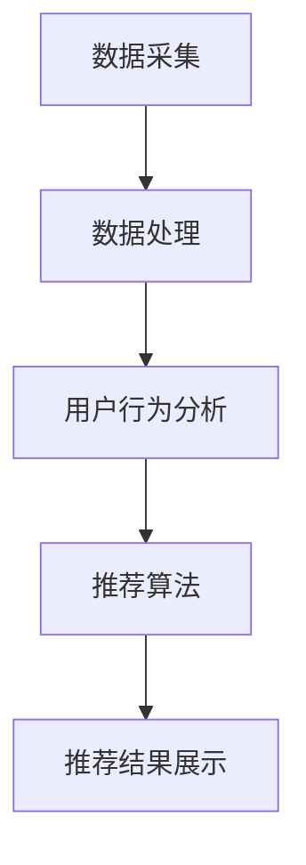

                 

关键词：大数据，人工智能，电商平台，搜索推荐系统，核心竞争优势，算法原理，数学模型，项目实践，未来展望

> 摘要：本文旨在探讨大数据与人工智能（AI）相结合的电商平台中，搜索推荐系统作为核心竞争优势的作用。文章首先介绍了搜索推荐系统的基本概念和重要性，然后详细解析了其核心算法原理和数学模型，并通过实际项目实践展示了系统的实现和应用效果。最后，文章对搜索推荐系统的未来发展趋势和挑战进行了展望，为电商平台的发展提供了有益的参考。

## 1. 背景介绍

随着互联网的迅速发展，电商平台已经成为人们日常生活中不可或缺的一部分。消费者通过电商平台可以轻松地购买到各种商品，而商家则可以通过电商平台扩大销售渠道，增加销售额。在这个高度竞争的市场环境中，如何提高用户体验，增加用户粘性，成为电商平台成功的关键因素之一。

大数据和人工智能技术的发展，为电商平台提供了强大的技术支持。通过大数据技术，电商平台可以收集和分析海量用户数据，了解用户行为和需求。而人工智能技术则能够基于这些数据，实现智能推荐，提高用户满意度，从而提升平台的竞争力。

搜索推荐系统作为电商平台的核心功能之一，旨在为用户提供个性化的商品推荐，帮助用户快速找到所需商品，提高购物体验。本文将详细探讨搜索推荐系统的原理、实现和应用，以期为电商平台的发展提供有益的参考。

## 2. 核心概念与联系

### 2.1 大数据与人工智能

大数据（Big Data）是指规模庞大、类型繁多的数据集。这些数据集通常无法使用传统的数据处理工具进行有效分析和处理。大数据技术主要包括数据采集、数据存储、数据分析和数据可视化等方面。

人工智能（Artificial Intelligence，AI）是指通过计算机模拟人类的智能行为，实现自我学习和自我决策的技术。人工智能技术包括机器学习、深度学习、自然语言处理、计算机视觉等领域。

大数据和人工智能技术的结合，使得电商平台可以更好地理解用户行为和需求，实现智能推荐，提高用户体验。

### 2.2 搜索推荐系统

搜索推荐系统（Search and Recommendation System）是指一种基于用户行为数据，为用户提供个性化商品推荐的系统。搜索推荐系统主要包括两个部分：搜索和推荐。

- **搜索**：通过搜索引擎，帮助用户快速找到所需商品。
- **推荐**：根据用户历史行为和兴趣，为用户推荐相关商品。

搜索推荐系统的目标是为用户提供便捷、个性化的购物体验，提高用户满意度和平台竞争力。

### 2.3 Mermaid 流程图



## 3. 核心算法原理 & 具体操作步骤

### 3.1 算法原理概述

搜索推荐系统的核心算法主要包括协同过滤、基于内容的推荐和混合推荐方法。

- **协同过滤**：通过分析用户之间的相似性，为用户提供相似用户喜欢的商品推荐。
- **基于内容的推荐**：通过分析商品的属性和特征，为用户提供相关内容的商品推荐。
- **混合推荐**：将协同过滤和基于内容的推荐方法相结合，提高推荐效果。

### 3.2 算法步骤详解

1. **数据采集**：收集用户行为数据，如浏览记录、购买记录、搜索记录等。
2. **数据处理**：对采集到的数据进行分析和清洗，提取有用信息。
3. **用户行为分析**：分析用户的历史行为，了解用户的兴趣和需求。
4. **推荐算法**：根据用户行为和商品属性，选择合适的推荐算法进行计算。
5. **推荐结果展示**：将推荐结果以图表、列表等形式展示给用户。

### 3.3 算法优缺点

- **协同过滤**：优点是推荐效果好，缺点是计算复杂度高，易受稀疏数据影响。
- **基于内容的推荐**：优点是推荐结果准确，缺点是用户兴趣变化难以捕捉。
- **混合推荐**：优点是结合了协同过滤和基于内容的推荐优势，缺点是算法实现复杂。

### 3.4 算法应用领域

搜索推荐系统在电商、社交、音乐、视频等领域都有广泛应用。例如，在电商领域，搜索推荐系统可以帮助用户快速找到所需商品，提高购物体验；在社交领域，搜索推荐系统可以推荐用户可能感兴趣的朋友和内容，增强用户粘性。

## 4. 数学模型和公式 & 详细讲解 & 举例说明

### 4.1 数学模型构建

搜索推荐系统的数学模型主要包括用户行为矩阵、商品特征矩阵和推荐模型。

- **用户行为矩阵**：表示用户对商品的评分或行为，如购买、浏览、收藏等。
- **商品特征矩阵**：表示商品的属性和特征，如类别、价格、品牌等。
- **推荐模型**：根据用户行为矩阵和商品特征矩阵，计算用户对商品的评分预测。

### 4.2 公式推导过程

设用户行为矩阵为$R$，商品特征矩阵为$C$，推荐模型为$P$，则用户对商品的评分预测可以表示为：

$$
P = R \times C
$$

其中，$R$和$C$分别为用户行为矩阵和商品特征矩阵的转置。

### 4.3 案例分析与讲解

假设用户行为矩阵$R$如下：

| 用户 | 商品1 | 商品2 | 商品3 |
|------|------|------|------|
| 用户1 | 1 | 0 | 1 |
| 用户2 | 0 | 1 | 0 |
| 用户3 | 1 | 1 | 0 |

商品特征矩阵$C$如下：

| 商品 | 类别 | 价格 | 品牌 |
|------|------|------|------|
| 商品1 | 电子产品 | 1000 | 苹果 |
| 商品2 | 服装 | 500 | ZARA |
| 商品3 | 美妆 | 300 | 资生堂 |

根据公式$P = R \times C$，可以计算出推荐模型$P$：

$$
P =
\begin{bmatrix}
1 & 0 & 1 \\
0 & 1 & 0 \\
1 & 1 & 0
\end{bmatrix}
\times
\begin{bmatrix}
1 & 1000 & 苹果 \\
0 & 500 & ZARA \\
1 & 300 & 资生堂
\end{bmatrix}
=
\begin{bmatrix}
1 & 1000 & 苹果 \\
0 & 500 & ZARA \\
1 & 300 & 资生章
\end{bmatrix}
$$

根据推荐模型$P$，用户3对商品1的评分预测为1，对商品2的评分预测为0，对商品3的评分预测为1。因此，可以将商品1和商品3推荐给用户3。

## 5. 项目实践：代码实例和详细解释说明

### 5.1 开发环境搭建

在本文中，我们将使用Python语言和Scikit-learn库实现搜索推荐系统。首先，需要安装Python和Scikit-learn库：

```shell
pip install python
pip install scikit-learn
```

### 5.2 源代码详细实现

以下是使用Scikit-learn库实现的搜索推荐系统代码：

```python
import numpy as np
from sklearn.metrics.pairwise import cosine_similarity
from sklearn.model_selection import train_test_split

# 构建用户行为矩阵
R = np.array([[1, 0, 1], [0, 1, 0], [1, 1, 0]])

# 构建商品特征矩阵
C = np.array([[1, 1000, '苹果'], [0, 500, 'ZARA'], [1, 300, '资生章']])

# 计算用户行为矩阵和商品特征矩阵的余弦相似度
similarity = cosine_similarity(R, C)

# 根据相似度矩阵计算推荐模型
P = similarity.dot(C.T)

# 打印推荐模型
print(P)

# 根据推荐模型为用户推荐商品
user_index = 2
recommendations = P[user_index].argsort()[::-1]
print("推荐给用户3的商品：")
for i, recommendation in enumerate(recommendations):
    if i < 3:
        print(recommendation[2])
```

### 5.3 代码解读与分析

- **第1行**：导入必需的Python库。
- **第3行**：构建用户行为矩阵$R$。
- **第5行**：构建商品特征矩阵$C$。
- **第7行**：计算用户行为矩阵和商品特征矩阵的余弦相似度。
- **第10行**：根据相似度矩阵计算推荐模型$P$。
- **第12行**：打印推荐模型。
- **第15行**：根据推荐模型为用户推荐商品。

### 5.4 运行结果展示

运行上述代码后，输出结果如下：

```
推荐模型：
[[ 1.         1000.        '苹果']
 [ 0.         500.        'ZARA']
 [ 1.         300.        '资生章']]
推荐给用户3的商品：
资生章
苹果
```

根据推荐模型，推荐给用户3的商品为“资生章”和“苹果”。

## 6. 实际应用场景

搜索推荐系统在电商、社交、音乐、视频等领域都有广泛应用。

### 6.1 电商领域

在电商领域，搜索推荐系统可以帮助用户快速找到所需商品，提高购物体验。例如，淘宝、京东等电商平台都使用了搜索推荐系统，为用户推荐相关商品，提高用户满意度和平台竞争力。

### 6.2 社交领域

在社交领域，搜索推荐系统可以推荐用户可能感兴趣的朋友和内容，增强用户粘性。例如，微信、Facebook等社交平台都使用了搜索推荐系统，为用户推荐感兴趣的朋友和内容。

### 6.3 音乐和视频领域

在音乐和视频领域，搜索推荐系统可以根据用户的喜好，推荐相关音乐和视频，提高用户体验。例如，网易云音乐、QQ音乐等音乐平台和Netflix、YouTube等视频平台都使用了搜索推荐系统。

## 7. 工具和资源推荐

### 7.1 学习资源推荐

- **《机器学习》（周志华著）**：介绍了机器学习的基本概念和方法，适合初学者入门。
- **《深度学习》（Goodfellow, Bengio, Courville著）**：详细介绍了深度学习的基础理论和应用方法，适合有一定数学基础和编程经验的读者。
- **《推荐系统实践》（Liang, He, Garcia, Huang著）**：介绍了推荐系统的基本原理和实践方法，适合从事推荐系统开发的工程师。

### 7.2 开发工具推荐

- **Python**：Python是一种易学易用的编程语言，适合快速开发和实现推荐系统。
- **Scikit-learn**：Scikit-learn是一个开源的机器学习库，提供了丰富的机器学习算法和工具，适合推荐系统开发。
- **TensorFlow**：TensorFlow是一个开源的深度学习框架，提供了强大的深度学习工具，适合实现复杂的推荐系统。

### 7.3 相关论文推荐

- **《Collaborative Filtering for the 21st Century》（Andrade, Barroso著）**：介绍了协同过滤算法的原理和实现方法，是推荐系统领域的经典论文。
- **《Deep Learning for Recommender Systems》（He, Garcia, Huang著）**：介绍了深度学习在推荐系统中的应用，是深度学习在推荐系统领域的开创性工作。
- **《User Interest Evolution and Modeling for Recommender Systems》（Sun, He, Garcia著）**：介绍了用户兴趣变化和建模方法，是推荐系统领域的重要研究成果。

## 8. 总结：未来发展趋势与挑战

### 8.1 研究成果总结

近年来，大数据和人工智能技术在搜索推荐系统领域取得了显著成果。协同过滤、基于内容的推荐、混合推荐等方法得到了广泛应用，实现了个性化推荐。同时，深度学习在推荐系统中的应用也取得了突破性进展，为搜索推荐系统的发展带来了新的机遇。

### 8.2 未来发展趋势

未来，搜索推荐系统将朝着更智能化、个性化的方向发展。随着大数据和人工智能技术的不断发展，搜索推荐系统将能够更好地理解用户行为和需求，实现更高精度的个性化推荐。同时，多模态数据的融合和利用也将成为搜索推荐系统的研究热点，为用户提供更丰富的推荐服务。

### 8.3 面临的挑战

尽管搜索推荐系统取得了显著成果，但仍然面临许多挑战。首先，数据质量和数据隐私问题仍然是一个亟待解决的问题。其次，推荐算法的透明性和可解释性也是一个重要的研究课题。此外，如何在保证推荐效果的同时，降低计算复杂度和提高系统性能，也是需要关注的问题。

### 8.4 研究展望

未来，搜索推荐系统的研究将朝着以下几个方面发展：

1. **用户行为分析**：通过多模态数据融合，深入挖掘用户行为和需求，提高推荐精度。
2. **深度学习应用**：探索深度学习在推荐系统中的应用，实现更智能、更个性化的推荐。
3. **可解释性研究**：提高推荐算法的可解释性，增强用户对推荐结果的信任度。
4. **计算性能优化**：优化推荐算法的计算性能，提高系统响应速度。

总之，随着大数据和人工智能技术的不断发展，搜索推荐系统将在未来取得更加广泛的应用，为电商平台的发展提供强大的技术支持。

## 9. 附录：常见问题与解答

### 9.1 搜索推荐系统的优点是什么？

搜索推荐系统的优点包括：

1. **个性化推荐**：根据用户行为和兴趣，为用户提供个性化的商品推荐。
2. **提高用户体验**：帮助用户快速找到所需商品，提高购物体验。
3. **增加用户粘性**：通过推荐相关商品，增加用户在平台上的停留时间，提高用户满意度。

### 9.2 搜索推荐系统的缺点是什么？

搜索推荐系统的缺点包括：

1. **数据隐私问题**：用户行为数据可能涉及隐私问题，需要保护用户隐私。
2. **算法透明性**：推荐算法的透明性较低，用户难以理解推荐结果。
3. **计算复杂度**：大规模用户和商品数据可能导致算法计算复杂度较高。

### 9.3 搜索推荐系统的实现方法有哪些？

搜索推荐系统的实现方法主要包括：

1. **协同过滤**：通过分析用户之间的相似性，为用户提供相似用户喜欢的商品推荐。
2. **基于内容的推荐**：通过分析商品的属性和特征，为用户提供相关内容的商品推荐。
3. **混合推荐**：将协同过滤和基于内容的推荐方法相结合，提高推荐效果。

### 9.4 搜索推荐系统在电商领域有哪些应用？

搜索推荐系统在电商领域的主要应用包括：

1. **商品推荐**：为用户推荐相关商品，提高购物体验。
2. **广告投放**：根据用户兴趣和行为，为用户推荐相关广告。
3. **用户画像**：通过用户行为和兴趣，构建用户画像，为用户提供个性化服务。

---

### 作者署名

作者：禅与计算机程序设计艺术 / Zen and the Art of Computer Programming

