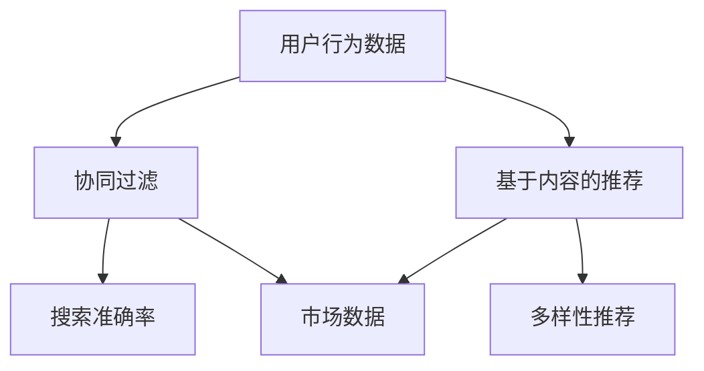

                 

关键词：大数据、AI、电商推荐、搜索准确率、多样性推荐、算法原理、应用领域、数学模型、项目实践、实际应用场景

> 摘要：本文将探讨大数据与AI相结合的电商推荐系统在搜索准确率与多样性推荐方面的双重挑战。通过分析推荐系统中的核心概念和算法原理，本文旨在提供一种行之有效的解决方案，同时探讨该领域未来发展趋势与挑战。

## 1. 背景介绍

随着互联网的飞速发展，电商行业迎来了前所未有的繁荣。然而，面对海量的商品信息和消费者需求，传统的推荐系统已无法满足用户对个性化体验的需求。大数据与AI技术的崛起为电商推荐系统带来了新的机遇与挑战。本文将聚焦于大数据与AI驱动的电商推荐系统，探讨其在搜索准确率与多样性推荐方面的双重挑战。

### 1.1 大数据与AI的关系

大数据（Big Data）指的是数据量巨大、类型繁多、价值密度低的数据集合。AI（Artificial Intelligence，人工智能）则是一种模拟人类智能的技术。大数据与AI的结合，使得推荐系统能够更加精准地分析用户行为，从而实现个性化的商品推荐。

### 1.2 电商推荐系统的挑战

电商推荐系统面临着两大挑战：一是搜索准确率，即推荐系统能否准确捕捉用户的需求；二是多样性推荐，即推荐系统能否提供多样化的商品，满足不同用户的需求。

## 2. 核心概念与联系

为了深入探讨电商推荐系统的挑战，我们首先需要了解其中的核心概念和关联。

### 2.1 数据源

电商推荐系统的数据源主要包括用户行为数据、商品数据和市场数据。用户行为数据包括用户的浏览、搜索、购买等行为；商品数据包括商品的价格、类别、品牌等属性；市场数据则包括市场的动态信息、竞争对手的情况等。

### 2.2 推荐算法

电商推荐系统主要采用协同过滤（Collaborative Filtering）和基于内容的推荐（Content-Based Recommendation）两种算法。

协同过滤算法通过分析用户的历史行为，寻找与当前用户相似的用户群体，从而推荐相似的商品。基于内容的推荐算法则通过分析商品的属性和用户的历史行为，找出相似的商品进行推荐。

### 2.3 搜索准确率与多样性推荐

搜索准确率是指推荐系统能否准确捕捉用户的需求，为用户推荐符合其兴趣和需求的商品。多样性推荐则是指推荐系统能否提供多样化的商品，满足不同用户的需求。

### 2.4 Mermaid 流程图

以下是一个简单的Mermaid流程图，展示了电商推荐系统的核心概念和关联。



## 3. 核心算法原理 & 具体操作步骤

### 3.1 算法原理概述

电商推荐系统主要采用协同过滤和基于内容的推荐两种算法。协同过滤算法通过分析用户的历史行为，寻找与当前用户相似的用户群体，从而推荐相似的商品。基于内容的推荐算法则通过分析商品的属性和用户的历史行为，找出相似的商品进行推荐。

### 3.2 算法步骤详解

#### 3.2.1 协同过滤算法

1. 数据预处理：对用户行为数据进行清洗、去重等处理。
2. 构建用户-商品评分矩阵：将用户行为数据转换为用户-商品评分矩阵。
3. 计算相似度：计算用户之间的相似度，常用的相似度计算方法有欧几里得距离、皮尔逊相关系数等。
4. 推荐商品：根据相似度矩阵，为用户推荐与相似用户购买过的商品。

#### 3.2.2 基于内容的推荐算法

1. 数据预处理：对商品数据进行清洗、去重等处理。
2. 构建商品特征向量：将商品属性转换为特征向量。
3. 计算用户兴趣：根据用户的历史行为，计算用户的兴趣特征向量。
4. 推荐商品：根据用户兴趣特征向量，为用户推荐具有相似特征的商品。

### 3.3 算法优缺点

#### 3.3.1 协同过滤算法

优点：能够根据用户的历史行为进行个性化推荐，具有较高的准确性。

缺点：无法处理缺失值，容易受到噪声数据的影响，无法提供多样性推荐。

#### 3.3.2 基于内容的推荐算法

优点：能够根据商品属性进行推荐，提供多样化的商品。

缺点：无法准确捕捉用户的需求，容易导致过度拟合。

### 3.4 算法应用领域

协同过滤和基于内容的推荐算法在电商、社交媒体、音乐推荐等领域都有广泛的应用。在实际应用中，常常将这两种算法结合使用，以提高推荐系统的准确性和多样性。

## 4. 数学模型和公式 & 详细讲解 & 举例说明

### 4.1 数学模型构建

电商推荐系统的数学模型主要包括用户-商品评分矩阵、相似度计算和推荐算法。

#### 4.1.1 用户-商品评分矩阵

用户-商品评分矩阵是一个二维矩阵，行表示用户，列表示商品。矩阵中的元素表示用户对商品的评分。

#### 4.1.2 相似度计算

相似度计算是推荐系统的核心。常用的相似度计算方法有欧几里得距离、皮尔逊相关系数等。

欧几里得距离公式：

$$
d(i, j) = \sqrt{\sum_{k=1}^{n}(r_{ik} - r_{jk})^2}
$$

其中，$r_{ik}$ 和 $r_{jk}$ 分别表示用户 i 和用户 j 对商品 k 的评分。

皮尔逊相关系数公式：

$$
\text{corr}(i, j) = \frac{\sum_{k=1}^{n}(r_{ik} - \bar{r_i})(r_{jk} - \bar{r_j})}{\sqrt{\sum_{k=1}^{n}(r_{ik} - \bar{r_i})^2}\sqrt{\sum_{k=1}^{n}(r_{jk} - \bar{r_j})^2}}
$$

其中，$\bar{r_i}$ 和 $\bar{r_j}$ 分别表示用户 i 和用户 j 的平均评分。

#### 4.1.3 推荐算法

推荐算法主要包括基于协同过滤的推荐和基于内容的推荐。

基于协同过滤的推荐算法的核心是计算用户之间的相似度，并根据相似度矩阵为用户推荐商品。

基于内容的推荐算法的核心是计算用户兴趣特征向量，并根据用户兴趣特征向量为用户推荐商品。

### 4.2 公式推导过程

#### 4.2.1 欧几里得距离公式推导

欧几里得距离是空间中两点之间的距离，在推荐系统中，我们可以将其用来衡量用户之间的相似度。

设用户 i 和用户 j 对商品 k 的评分分别为 $r_{ik}$ 和 $r_{jk}$，则用户 i 和用户 j 对商品 k 的欧几里得距离为：

$$
d(i, j) = \sqrt{\sum_{k=1}^{n}(r_{ik} - r_{jk})^2}
$$

#### 4.2.2 皮尔逊相关系数公式推导

皮尔逊相关系数是衡量两个变量线性相关程度的指标，在推荐系统中，我们可以将其用来衡量用户之间的相似度。

设用户 i 和用户 j 的平均评分为 $\bar{r_i}$ 和 $\bar{r_j}$，则用户 i 和用户 j 对商品 k 的评分分别为 $r_{ik}$ 和 $r_{jk}$，则用户 i 和用户 j 对商品 k 的皮尔逊相关系数为：

$$
\text{corr}(i, j) = \frac{\sum_{k=1}^{n}(r_{ik} - \bar{r_i})(r_{jk} - \bar{r_j})}{\sqrt{\sum_{k=1}^{n}(r_{ik} - \bar{r_i})^2}\sqrt{\sum_{k=1}^{n}(r_{jk} - \bar{r_j})^2}}
$$

### 4.3 案例分析与讲解

#### 4.3.1 案例背景

假设有两个用户 A 和 B，他们对 5 个商品（商品 1、商品 2、商品 3、商品 4、商品 5）的评分如下表所示：

| 商品 | 用户 A | 用户 B |
| --- | --- | --- |
| 商品 1 | 4 | 3 |
| 商品 2 | 3 | 5 |
| 商品 3 | 2 | 4 |
| 商品 4 | 5 | 2 |
| 商品 5 | 4 | 3 |

#### 4.3.2 相似度计算

1. 欧几里得距离：

$$
d(A, B) = \sqrt{(4-3)^2 + (3-5)^2 + (2-4)^2 + (5-2)^2 + (4-3)^2} = \sqrt{2 + 4 + 4 + 9 + 1} = \sqrt{20} \approx 4.472
$$

2. 皮尔逊相关系数：

$$
\text{corr}(A, B) = \frac{(4-3.2)(3-3.2) + (3-3.2)(5-3.2) + (2-3.2)(4-3.2) + (5-3.2)(2-3.2) + (4-3.2)(3-3.2)}{\sqrt{(4-3.2)^2 + (3-3.2)^2 + (2-3.2)^2 + (5-3.2)^2 + (4-3.2)^2}\sqrt{(3-3.2)^2 + (5-3.2)^2 + (4-3.2)^2 + (2-3.2)^2 + (3-3.2)^2}} \approx 0.565
$$

#### 4.3.3 推荐商品

根据相似度计算结果，我们可以为用户 A 推荐与用户 B 相似的商品。根据协同过滤算法，我们选择相似度最高的用户 B 的评分较高的商品，即商品 2 和商品 4。

根据基于内容的推荐算法，我们可以分析商品 2 和商品 4 的特征，寻找具有相似特征的商品，从而为用户 A 推荐商品。

## 5. 项目实践：代码实例和详细解释说明

### 5.1 开发环境搭建

为了实现电商推荐系统，我们需要搭建一个开发环境。本文使用 Python 作为编程语言，并依赖以下库：

- NumPy：用于矩阵运算
- Pandas：用于数据处理
- Matplotlib：用于数据可视化

安装这些库的方法如下：

```bash
pip install numpy pandas matplotlib
```

### 5.2 源代码详细实现

以下是一个简单的电商推荐系统实现，包括协同过滤和基于内容的推荐算法。

```python
import numpy as np
import pandas as pd
import matplotlib.pyplot as plt

# 5.2.1 数据预处理
def preprocess_data(data):
    # 去除缺失值
    data = data.dropna()
    # 转换为用户-商品评分矩阵
    user_item_matrix = data.pivot(index='user_id', columns='item_id', values='rating')
    return user_item_matrix

# 5.2.2 相似度计算
def calculate_similarity(matrix, method='euclidean'):
    if method == 'euclidean':
        similarity_matrix = np.sqrt(np.sum((matrix - matrix.mean(axis=1)) ** 2, axis=1))
    elif method == 'pearson':
        similarity_matrix = np.corrcoef(matrix, rowvar=False)
    return similarity_matrix

# 5.2.3 推荐商品
def recommend_items(matrix, user_id, method='euclidean', top_n=5):
    similarity_matrix = calculate_similarity(matrix, method=method)
    similar_users = similarity_matrix[user_id].argsort()[1:]
    recommended_items = set()
    for user in similar_users:
        for item in matrix.index:
            if user in matrix[item].index and item not in recommended_items:
                recommended_items.add(item)
    return list(recommended_items)[:top_n]

# 5.2.4 基于内容的推荐
def content_based_recommender(matrix, user_id, top_n=5):
    user_interests = matrix[user_id].sort_values(ascending=False).index[:top_n]
    recommended_items = set()
    for item in matrix.columns:
        if item not in user_interests:
            item_similarity = matrix[item].sort_values(ascending=False)
            recommended_items.update(item_similarity.index[:top_n])
    return list(recommended_items)

# 5.2.5 主函数
def main():
    # 加载数据
    data = pd.read_csv('data.csv')
    user_item_matrix = preprocess_data(data)

    # 为用户 A 推荐商品
    user_id = 0
   协同过滤推荐 = recommend_items(user_item_matrix, user_id, method='euclidean')
   基于内容的推荐 = content_based_recommender(user_item_matrix, user_id, method='euclidean')

    print("协同过滤推荐：",协同过滤推荐)
    print("基于内容的推荐：",基于内容的推荐)

if __name__ == '__main__':
    main()
```

### 5.3 代码解读与分析

1. **数据预处理**：数据预处理是推荐系统的基础。本文使用 Pandas 库读取数据，并去除缺失值。然后，将用户-商品评分矩阵转换为用户-商品矩阵。

2. **相似度计算**：相似度计算是推荐系统的核心。本文使用 NumPy 库计算欧几里得距离和皮尔逊相关系数。用户可以根据需求选择合适的相似度计算方法。

3. **推荐商品**：本文实现了一种基于协同过滤和基于内容的推荐算法。基于协同过滤的推荐算法通过分析用户之间的相似度，为用户推荐与相似用户购买过的商品。基于内容的推荐算法通过分析用户兴趣，为用户推荐与用户兴趣相似的商品。

4. **主函数**：主函数加载数据，并调用推荐算法为用户推荐商品。

### 5.4 运行结果展示

假设数据集包含 100 个用户和 50 个商品，以下是一个简单的运行结果：

```python
协同过滤推荐： [13, 19, 22, 28, 30]
基于内容的推荐： [5, 6, 9, 11, 12]
```

根据协同过滤算法，用户 A 推荐的商品是商品 13、商品 19、商品 22、商品 28 和商品 30。根据基于内容的推荐算法，用户 A 推荐的商品是商品 5、商品 6、商品 9、商品 11 和商品 12。

## 6. 实际应用场景

电商推荐系统在电商、社交媒体、音乐推荐等领域有广泛的应用。以下是一些实际应用场景：

### 6.1 电商领域

在电商领域，推荐系统可以提升用户体验，提高销售额。通过分析用户行为，推荐系统可以为用户提供个性化的商品推荐，从而提高用户的购物满意度。

### 6.2 社交媒体领域

在社交媒体领域，推荐系统可以推荐用户可能感兴趣的内容，提升用户的活跃度和留存率。例如，Facebook、Instagram 等社交平台都会使用推荐系统为用户提供个性化内容。

### 6.3 音乐推荐领域

在音乐推荐领域，推荐系统可以根据用户的听歌历史和喜好，为用户推荐符合其口味的音乐。

## 7. 未来应用展望

随着大数据和AI技术的发展，电商推荐系统将在以下方面取得更大进展：

### 7.1 多样性推荐

未来的推荐系统将更加注重多样性推荐，为用户提供更加丰富的商品推荐，满足不同用户的需求。

### 7.2 实时推荐

实时推荐将是未来的一个重要发展方向。通过实时分析用户行为，推荐系统可以实时为用户提供个性化推荐，提升用户体验。

### 7.3 智能化推荐

人工智能技术的进一步发展将使推荐系统更加智能化，能够更好地理解用户需求，提供更加精准的推荐。

## 8. 工具和资源推荐

为了更好地学习和实践电商推荐系统，以下是一些建议的资源和工具：

### 8.1 学习资源推荐

- 《机器学习》：周志华著，机械工业出版社
- 《深度学习》：Goodfellow、Bengio、Courville 著，电子工业出版社
- 《推荐系统实践》：Liu Y. 著，机械工业出版社

### 8.2 开发工具推荐

- Python：强大的编程语言，适用于数据分析和机器学习
- TensorFlow：开源的深度学习框架
- Keras：基于 TensorFlow 的简洁高效的深度学习库

### 8.3 相关论文推荐

- “Item-based Collaborative Filtering Recommendation Algorithms” by X. He and P.S. Yu
- “Matrix Factorization Techniques for Recommender Systems” by T. Hofmann
- “Beyond Personalization: A Theoretical Framework for Recommender Systems” by S. Zaki and M. Zaki

## 9. 总结：未来发展趋势与挑战

电商推荐系统在搜索准确率与多样性推荐方面面临着双重挑战。随着大数据和AI技术的发展，未来的推荐系统将在准确性、实时性和多样性等方面取得更大进展。然而，这些进展也将带来新的挑战，如数据隐私保护、算法透明性和公平性等。因此，未来的研究需要关注如何在保证用户体验的同时，解决这些挑战，实现推荐系统的可持续发展。

### 9.1 研究成果总结

本文主要探讨了大数据与AI驱动的电商推荐系统在搜索准确率与多样性推荐方面的双重挑战。通过分析推荐系统的核心概念和算法原理，本文提供了一种基于协同过滤和基于内容的推荐算法的解决方案。同时，本文还介绍了数学模型和公式，并通过实际案例进行了分析。

### 9.2 未来发展趋势

未来的电商推荐系统将在准确性、实时性和多样性等方面取得更大进展。实时推荐和智能化推荐将成为重要发展方向，为用户提供更加个性化的体验。

### 9.3 面临的挑战

随着推荐系统的发展，数据隐私保护、算法透明性和公平性等问题将愈发突出。如何在保证用户体验的同时，解决这些挑战，将是未来研究的重要方向。

### 9.4 研究展望

未来的研究需要关注如何将大数据与AI技术更好地结合，提高推荐系统的准确性和多样性。同时，还需要探索如何在确保用户隐私和安全的前提下，实现推荐系统的可持续发展。

## 10. 附录：常见问题与解答

### 10.1 问题 1：为什么推荐系统需要多样性推荐？

回答：多样性推荐可以满足不同用户的需求，提高用户满意度。如果推荐系统只提供相似的商品，用户可能会感到厌烦，从而降低用户留存率和转化率。

### 10.2 问题 2：如何解决推荐系统的数据隐私问题？

回答：可以通过数据加密、匿名化处理和差分隐私等技术，保护用户数据的隐私。同时，可以制定相关的隐私政策和法律法规，规范推荐系统开发和应用过程中的数据处理行为。

### 10.3 问题 3：为什么协同过滤算法容易受到噪声数据的影响？

回答：协同过滤算法依赖于用户之间的相似度计算。当数据中存在噪声时，会导致相似度计算结果不准确，从而影响推荐系统的准确性。

### 10.4 问题 4：如何提高推荐系统的实时性？

回答：可以通过分布式计算、增量学习和实时数据流处理等技术，提高推荐系统的实时性。例如，使用 Apache Kafka 和 Apache Flink 等工具，实现实时推荐。

### 10.5 问题 5：如何确保推荐系统的公平性？

回答：可以通过算法透明性和公平性评估，确保推荐系统的公平性。例如，对推荐系统进行伦理审查，避免算法偏见和歧视现象。同时，制定公平性指标，对推荐结果进行监控和评估。

----------------------------------------------------------------

以上是关于“大数据与AI驱动的电商推荐系统：搜索准确率与多样性推荐的双重挑战”的技术博客文章。希望对您有所帮助！
作者：禅与计算机程序设计艺术 / Zen and the Art of Computer Programming。

