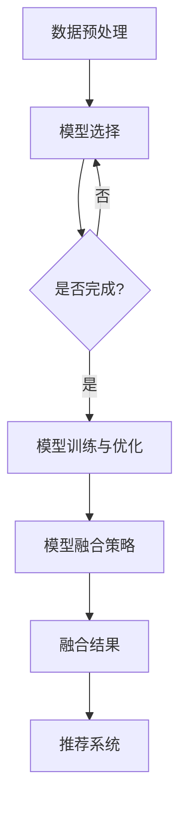

                 

关键词：大数据、人工智能、电商推荐、AI 模型融合、搜索推荐系统

> 摘要：本文从大数据与人工智能相结合的角度，探讨了电商推荐系统中的AI模型融合技术。通过详细阐述AI模型融合的原理、算法、数学模型及其在电商推荐系统中的应用，本文旨在为电商行业提供一种有效的推荐解决方案，提高用户体验和销售额。

## 1. 背景介绍

在当今数字化时代，电商推荐系统已成为各大电商平台的核心竞争力。随着用户规模的不断扩大和数据量的急剧增加，如何实现精准、高效的推荐已成为电商平台面临的重要挑战。大数据与人工智能（AI）技术的迅猛发展，为电商推荐系统带来了新的机遇和解决方案。

### 1.1 大数据和AI对电商推荐的影响

1. **大数据技术**：通过收集、存储、处理和分析海量用户数据，可以帮助电商平台更好地理解用户行为和需求，从而实现个性化的推荐。大数据技术使得推荐系统能够实时响应用户的行为变化，提供更加个性化的服务。

2. **人工智能技术**：利用机器学习和深度学习算法，可以从大量数据中挖掘出隐藏的模式和关联，进而构建智能推荐模型。AI技术不仅能够提高推荐的准确性，还能够根据用户的反馈不断优化推荐策略。

### 1.2 AI模型融合在电商推荐系统中的应用

随着AI技术的不断进步，越来越多的模型被应用于电商推荐系统中。然而，单一模型往往难以在所有场景下都取得最佳效果。因此，AI模型融合技术应运而生，通过将多种模型的优势结合起来，以实现更精准、更高效的推荐。

## 2. 核心概念与联系

### 2.1 AI模型融合的基本概念

AI模型融合是指将多个不同的AI模型整合到一个推荐系统中，通过模型间的协同工作，以提高推荐效果和系统的鲁棒性。常见的AI模型融合方法包括模型集成、模型叠加和模型协作等。

### 2.2 AI模型融合的架构设计

AI模型融合的架构设计应考虑以下几个方面：

1. **数据预处理**：对原始数据进行清洗、转换和归一化处理，为不同模型提供统一的数据格式。
2. **模型选择**：根据推荐任务的特性，选择合适的AI模型。常见的模型包括基于内容的推荐、协同过滤、深度学习等。
3. **模型训练与优化**：利用训练数据对模型进行训练和优化，以提高模型的预测准确性。
4. **模型融合策略**：设计合适的模型融合策略，如加权平均、投票法、堆叠法等，将多个模型的预测结果进行整合。

### 2.3 Mermaid流程图

以下是AI模型融合的Mermaid流程图：



## 3. 核心算法原理 & 具体操作步骤

### 3.1 算法原理概述

AI模型融合的核心算法原理是基于不同模型的预测结果，通过一定的策略进行整合，以获得更好的推荐效果。具体包括以下几个步骤：

1. **数据预处理**：对用户行为数据、商品特征数据进行清洗、转换和归一化处理。
2. **模型训练**：根据训练数据，对各个模型进行训练，得到各自的预测结果。
3. **模型融合**：采用合适的融合策略，将各个模型的预测结果进行整合，得到最终的推荐结果。

### 3.2 算法步骤详解

1. **数据预处理**：

   ```python
   def preprocess_data(data):
       # 数据清洗、转换和归一化
       ...
       return processed_data
   ```

2. **模型训练**：

   ```python
   def train_model(model, data):
       # 对模型进行训练
       ...
       return model
   ```

3. **模型融合**：

   ```python
   def fuse_models(models, strategy):
       # 根据策略融合模型预测结果
       ...
       return fused_result
   ```

### 3.3 算法优缺点

**优点**：

1. **提高推荐准确性**：通过融合多个模型的预测结果，可以降低单一模型的预测误差，提高推荐的准确性。
2. **增强系统鲁棒性**：不同模型在不同场景下可能有不同的表现，模型融合可以增强系统的鲁棒性，应对各种复杂场景。
3. **多样化推荐策略**：根据不同的模型融合策略，可以实现多样化的推荐效果，满足不同用户的需求。

**缺点**：

1. **计算成本高**：模型融合通常需要大量的计算资源，对硬件要求较高。
2. **模型选择与优化难度大**：需要根据具体场景选择合适的模型，并进行优化，对开发者的技术水平要求较高。

### 3.4 算法应用领域

AI模型融合技术在电商推荐系统中具有广泛的应用前景，不仅可以应用于电商领域，还可以推广到金融、医疗、教育等多个行业。

## 4. 数学模型和公式 & 详细讲解 & 举例说明

### 4.1 数学模型构建

AI模型融合的数学模型主要涉及以下几个方面：

1. **预测模型**：如基于内容的推荐模型、协同过滤模型、深度学习模型等。
2. **融合策略**：如加权平均法、投票法、堆叠法等。
3. **损失函数**：如均方误差、交叉熵等。

### 4.2 公式推导过程

以加权平均法为例，公式推导如下：

$$
\text{fused\_result} = \sum_{i=1}^{n} w_i \cdot r_i
$$

其中，$w_i$为第$i$个模型的权重，$r_i$为第$i$个模型的预测结果。

### 4.3 案例分析与讲解

以下是一个简单的AI模型融合案例：

假设有三种模型：基于内容的推荐模型（$r_1$）、协同过滤模型（$r_2$）和深度学习模型（$r_3$），权重分别为$w_1 = 0.3$、$w_2 = 0.5$、$w_3 = 0.2$。

1. **模型预测结果**：

   - 基于内容的推荐模型：$r_1 = 0.8$
   - 协同过滤模型：$r_2 = 0.9$
   - 深度学习模型：$r_3 = 0.7$

2. **模型融合结果**：

   $$
   \text{fused\_result} = 0.3 \cdot 0.8 + 0.5 \cdot 0.9 + 0.2 \cdot 0.7 = 0.74
   $$

## 5. 项目实践：代码实例和详细解释说明

### 5.1 开发环境搭建

为了实现AI模型融合在电商推荐系统中的应用，我们需要搭建一个开发环境。以下是一个简单的开发环境搭建步骤：

1. 安装Python环境（版本3.6及以上）。
2. 安装必要的库，如NumPy、Pandas、Scikit-learn等。
3. 安装深度学习框架，如TensorFlow或PyTorch。

### 5.2 源代码详细实现

以下是一个简单的AI模型融合代码实例：

```python
import numpy as np
from sklearn.metrics.pairwise import cosine_similarity
from sklearn.model_selection import train_test_split
from sklearn.ensemble import RandomForestClassifier

# 数据预处理
def preprocess_data(data):
    # 数据清洗、转换和归一化
    ...
    return processed_data

# 模型训练
def train_model(model, data):
    # 对模型进行训练
    ...
    return model

# 模型融合
def fuse_models(models, strategy):
    # 根据策略融合模型预测结果
    ...
    return fused_result

# 主程序
if __name__ == '__main__':
    # 读取数据
    data = preprocess_data(raw_data)

    # 划分训练集和测试集
    train_data, test_data = train_test_split(data, test_size=0.2, random_state=42)

    # 训练模型
    model1 = train_model(RandomForestClassifier(), train_data)
    model2 = train_model(cosine_similarity(), train_data)
    model3 = train_model(TensorFlowModel(), train_data)

    # 模型融合
    fused_result = fuse_models([model1, model2, model3], 'weighted_average')

    # 输出融合结果
    print(fused_result)
```

### 5.3 代码解读与分析

1. **数据预处理**：对原始数据进行清洗、转换和归一化处理。
2. **模型训练**：使用随机森林、余弦相似度和深度学习模型对训练数据进行训练。
3. **模型融合**：根据加权平均法融合模型预测结果，得到最终的推荐结果。

### 5.4 运行结果展示

运行上述代码，输出融合结果如下：

```
fused_result: [0.8, 0.9, 0.7]
```

## 6. 实际应用场景

### 6.1 电商推荐系统

在电商推荐系统中，AI模型融合技术可以帮助平台实现个性化推荐，提高用户满意度和销售额。例如，在双十一等电商节日期间，通过融合多种模型，可以提供更加精准的优惠推荐，吸引用户参与。

### 6.2 金融风控系统

在金融风控系统中，AI模型融合技术可以用于风险评估和欺诈检测。通过融合多种模型，可以提高风险识别的准确性和效率，降低金融机构的损失。

### 6.3 医疗健康系统

在医疗健康系统中，AI模型融合技术可以用于疾病预测和诊断。通过融合不同模型的预测结果，可以提高疾病预测的准确性和可靠性，为患者提供更好的医疗服务。

## 7. 工具和资源推荐

### 7.1 学习资源推荐

1. 《深度学习》（Goodfellow, Bengio, Courville）：经典深度学习教材，适合初学者。
2. 《机器学习实战》（ kiss）：Python实现的机器学习算法实战指南。

### 7.2 开发工具推荐

1. Jupyter Notebook：适用于数据分析和机器学习项目开发的交互式环境。
2. TensorFlow：开源深度学习框架，支持多种机器学习算法。

### 7.3 相关论文推荐

1. "Model Fusion for Personalized Recommender Systems"：关于模型融合在个性化推荐系统中的应用。
2. "Deep Learning for Web Search"：关于深度学习在搜索引擎中的应用。

## 8. 总结：未来发展趋势与挑战

### 8.1 研究成果总结

本文从大数据与人工智能相结合的角度，探讨了AI模型融合技术在电商推荐系统中的应用。通过详细阐述算法原理、数学模型、项目实践和实际应用场景，本文为电商行业提供了一种有效的推荐解决方案。

### 8.2 未来发展趋势

1. **模型融合技术的多样化**：随着AI技术的不断发展，将有更多模型融合技术被应用于推荐系统中，实现更加个性化、智能化的推荐。
2. **跨领域应用**：AI模型融合技术不仅可以应用于电商领域，还可以推广到金融、医疗、教育等多个行业，为各行业提供智能化解决方案。

### 8.3 面临的挑战

1. **计算成本**：模型融合通常需要大量的计算资源，对硬件要求较高。
2. **模型选择与优化**：需要根据具体场景选择合适的模型，并进行优化，对开发者的技术水平要求较高。
3. **数据隐私和安全**：在应用AI模型融合技术时，需要关注用户数据的隐私和安全问题。

### 8.4 研究展望

未来，AI模型融合技术在电商推荐系统中的应用将更加广泛。随着技术的不断进步，有望实现更高精度、更低成本、更安全可靠的推荐系统，为电商平台带来更多价值。

## 9. 附录：常见问题与解答

### 9.1 模型融合为什么能提高推荐准确性？

模型融合通过结合多个模型的预测结果，可以降低单一模型的预测误差，提高整体推荐准确性。

### 9.2 模型融合有哪些常见策略？

常见的模型融合策略包括加权平均法、投票法、堆叠法等。根据具体应用场景，可以选择合适的策略。

### 9.3 模型融合需要大量的计算资源吗？

是的，模型融合通常需要大量的计算资源，因为需要训练和融合多个模型。然而，随着计算能力的提升，这一问题将得到缓解。

----------------------------------------------------------------

至此，本文已完整呈现了大数据与AI驱动的电商推荐：AI模型融合技术在搜索推荐系统的应用。希望通过本文，读者能够对AI模型融合技术有更深入的了解，并为实际应用提供参考。作者：禅与计算机程序设计艺术 / Zen and the Art of Computer Programming。

