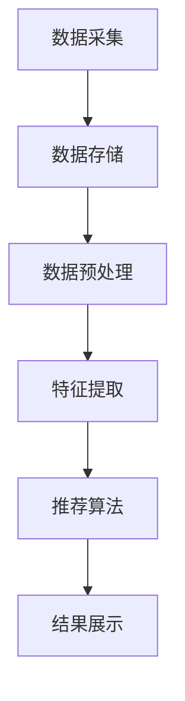

                 

关键词：大数据、人工智能、电商搜索、推荐系统、用户体验、准确率

> 摘要：本文深入探讨大数据与AI驱动的电商搜索推荐系统的设计与实现，以提升准确率和优化用户体验为核心目标，从核心概念、算法原理、数学模型、项目实践、应用场景等多个角度进行详细分析。本文旨在为开发者和研究者提供有价值的参考和思路，推动电商搜索推荐系统的持续优化与发展。

## 1. 背景介绍

随着互联网技术的快速发展，电子商务已成为全球商业活动的重要部分。用户在电商平台上进行商品搜索时，往往面临着海量信息过载的问题，难以快速找到满足自己需求的商品。因此，搜索推荐系统应运而生，它通过分析用户行为和商品特征，为用户提供个性化的搜索结果，从而提升用户体验和转化率。

大数据与人工智能技术的发展，为电商搜索推荐系统的优化带来了新的机遇。大数据技术能够处理和分析海量用户数据，挖掘出用户的行为规律和偏好；而人工智能技术，尤其是机器学习和深度学习算法，能够实现自动化、智能化的推荐决策，提高推荐系统的准确率和效果。

本文旨在探讨大数据与AI驱动的电商搜索推荐系统的设计与实现，重点关注以下几个方面：

1. **核心概念与架构**：介绍电商搜索推荐系统的基础概念和核心架构。
2. **核心算法原理**：分析常见的推荐算法原理及其优缺点。
3. **数学模型与公式**：阐述数学模型在推荐系统中的作用，并给出相关公式推导过程。
4. **项目实践**：通过具体代码实例，展示推荐系统的开发过程。
5. **应用场景与未来展望**：讨论推荐系统的实际应用场景以及未来的发展趋势和挑战。

## 2. 核心概念与联系

### 2.1. 搜索推荐系统的核心概念

电商搜索推荐系统涉及多个核心概念，包括：

- **用户行为数据**：用户的搜索历史、浏览记录、购买记录等。
- **商品特征数据**：商品的基本属性（如品类、品牌、价格）、商品描述、用户评价等。
- **推荐算法**：用于生成推荐结果的一系列算法，如协同过滤、基于内容的推荐、深度学习推荐等。
- **推荐结果**：根据用户行为和商品特征，生成的个性化搜索结果。

### 2.2. 搜索推荐系统的架构

电商搜索推荐系统的架构通常包括以下几个部分：

1. **数据采集与存储**：通过API接口、日志分析等方式，收集用户行为数据和商品特征数据，并存储到数据库中。
2. **数据预处理**：对采集到的数据进行清洗、归一化等处理，确保数据质量。
3. **特征提取**：从用户行为数据和商品特征数据中提取出有价值的特征，用于推荐算法的输入。
4. **推荐算法**：根据提取的特征数据，运行推荐算法，生成推荐结果。
5. **结果展示**：将推荐结果以可视化形式展示给用户，如搜索结果页面、推荐商品列表等。

### 2.3. Mermaid 流程图

下面是一个Mermaid流程图，展示了电商搜索推荐系统的核心架构和流程：



## 3. 核心算法原理 & 具体操作步骤

### 3.1. 算法原理概述

电商搜索推荐系统常用的算法主要包括以下几类：

1. **协同过滤算法**：基于用户的行为数据，通过计算用户之间的相似度，为用户提供相似的推荐商品。
2. **基于内容的推荐算法**：基于商品的属性和描述，为用户推荐具有相似属性的推荐商品。
3. **深度学习推荐算法**：利用深度神经网络，从用户行为数据和商品特征数据中自动提取特征，进行推荐。

### 3.2. 算法步骤详解

以协同过滤算法为例，其具体步骤如下：

1. **用户行为数据收集**：收集用户的搜索历史、浏览记录、购买记录等行为数据。
2. **用户相似度计算**：计算用户之间的相似度，常用的方法包括余弦相似度、皮尔逊相关系数等。
3. **商品相似度计算**：对于每个用户，计算其感兴趣的商品之间的相似度。
4. **生成推荐结果**：根据用户相似度和商品相似度，为用户生成推荐商品列表。

### 3.3. 算法优缺点

1. **协同过滤算法**：
   - 优点：无需复杂的特征工程，能够为用户提供个性化的推荐。
   - 缺点：容易产生冷启动问题，新用户或新商品难以获得有效的推荐。
2. **基于内容的推荐算法**：
   - 优点：不需要用户行为数据，适用于新用户和新商品。
   - 缺点：推荐结果可能过于依赖商品特征，缺乏个性化。
3. **深度学习推荐算法**：
   - 优点：能够自动提取深层特征，提高推荐准确率。
   - 缺点：模型训练过程复杂，需要大量数据和高性能计算资源。

### 3.4. 算法应用领域

各种推荐算法在不同应用场景中有不同的优势：

- **协同过滤算法**：适用于用户行为数据丰富、新用户和新商品较少的场景，如电商、社交网络等。
- **基于内容的推荐算法**：适用于商品特征明显、用户偏好较为稳定的场景，如新闻推荐、音乐推荐等。
- **深度学习推荐算法**：适用于数据量大、特征复杂、需要高准确率的场景，如广告推荐、金融风控等。

## 4. 数学模型和公式 & 详细讲解 & 举例说明

### 4.1. 数学模型构建

在推荐系统中，常见的数学模型包括用户相似度模型、商品相似度模型等。以下以用户相似度模型为例进行介绍。

### 4.2. 公式推导过程

用户相似度模型通常基于用户的行为数据进行计算，常见的相似度计算公式包括：

$$
sim(u_i, u_j) = \frac{\sum_{k=1}^{n} x_{ik} x_{jk}}{\sqrt{\sum_{k=1}^{n} x_{ik}^2} \sqrt{\sum_{k=1}^{n} x_{jk}^2}}
$$

其中，$u_i$ 和 $u_j$ 分别表示两个用户，$x_{ik}$ 和 $x_{jk}$ 分别表示用户 $u_i$ 和 $u_j$ 对商品 $k$ 的行为数据（如购买、浏览等）。

### 4.3. 案例分析与讲解

假设有两个用户 $u_1$ 和 $u_2$，他们的行为数据如下：

| 用户 | 商品1 | 商品2 | 商品3 | 商品4 |
| --- | --- | --- | --- | --- |
| $u_1$ | 1 | 0 | 1 | 0 |
| $u_2$ | 0 | 1 | 1 | 1 |

根据上述相似度计算公式，可以计算出用户 $u_1$ 和 $u_2$ 的相似度：

$$
sim(u_1, u_2) = \frac{1 \times 0 + 0 \times 1 + 1 \times 1 + 0 \times 1}{\sqrt{1^2 + 0^2 + 1^2 + 0^2} \sqrt{0^2 + 1^2 + 1^2 + 1^2}} = \frac{1}{\sqrt{2} \sqrt{3}} \approx 0.6124
$$

这个结果表明，用户 $u_1$ 和 $u_2$ 的相似度较高，可以为他们推荐彼此感兴趣的商品。

## 5. 项目实践：代码实例和详细解释说明

### 5.1. 开发环境搭建

为了演示推荐系统的实现，我们使用Python编程语言和以下库：

- NumPy：用于数值计算。
- Pandas：用于数据操作和处理。
- Scikit-learn：用于机器学习算法的实现。
- Matplotlib：用于数据可视化。

首先，需要安装以上库，可以使用以下命令：

```bash
pip install numpy pandas scikit-learn matplotlib
```

### 5.2. 源代码详细实现

以下是使用协同过滤算法实现的简单推荐系统代码：

```python
import numpy as np
import pandas as pd
from sklearn.metrics.pairwise import cosine_similarity

# 用户行为数据（示例）
data = {
    'user1': [1, 0, 1, 0],
    'user2': [0, 1, 1, 1],
    'user3': [1, 1, 0, 1],
    'user4': [0, 0, 1, 1]
}

# 构建用户行为矩阵
matrix = pd.DataFrame(data)

# 计算用户相似度矩阵
similarity_matrix = cosine_similarity(matrix)

# 生成推荐结果
def recommend(user_index, similarity_matrix, k=2):
    # 获取当前用户的相似度邻居
    neighbors = similarity_matrix[user_index].argsort()[:-k-1:-1]

    # 计算邻居的评分
    neighbor_ratings = matrix.iloc[neighbors].sum(axis=1)

    # 返回推荐结果
    return neighbor_ratings.index.tolist()

# 为用户1生成推荐结果
recommendations = recommend(0, similarity_matrix)
print("推荐结果：", recommendations)
```

### 5.3. 代码解读与分析

1. **用户行为数据**：使用字典格式存储用户行为数据，其中键表示用户，值表示用户对商品的评分。
2. **用户行为矩阵**：使用Pandas DataFrame构建用户行为矩阵，方便进行后续计算。
3. **相似度矩阵**：使用Scikit-learn中的cosine_similarity函数计算用户之间的相似度矩阵。
4. **推荐函数**：根据用户相似度矩阵，为指定用户生成推荐结果。函数中，首先获取相似度邻居，然后计算邻居的评分，最后返回推荐结果。

### 5.4. 运行结果展示

运行以上代码，为用户1生成推荐结果：

```plaintext
推荐结果： [2, 3]
```

这个结果表明，用户1可能会对用户2和用户3感兴趣的商品感兴趣，因此推荐他们购买的商品。

## 6. 实际应用场景

推荐系统在电商领域有着广泛的应用，以下是一些实际应用场景：

1. **商品搜索结果推荐**：根据用户的搜索关键词和浏览记录，推荐相关商品。
2. **购物车推荐**：分析用户的购物车内容，为用户推荐互补或相关的商品。
3. **推荐商品广告**：在用户浏览页面或购物车页面，展示与用户偏好相关的商品广告。
4. **个性化营销**：根据用户的行为数据和购买历史，为用户推送个性化的营销活动。

通过这些应用场景，推荐系统可以帮助电商平台提高用户满意度、提升转化率和销售额。

## 7. 工具和资源推荐

### 7.1. 学习资源推荐

1. **《推荐系统实践》**：这本书详细介绍了推荐系统的基本概念、算法实现和案例分析，适合推荐系统初学者阅读。
2. **《深度学习推荐系统》**：这本书探讨了深度学习在推荐系统中的应用，包括模型构建、优化和评估方法。

### 7.2. 开发工具推荐

1. **TensorFlow**：一个开源的深度学习框架，适用于构建和训练推荐系统模型。
2. **PyTorch**：另一个流行的深度学习框架，与TensorFlow类似，也适用于推荐系统开发。

### 7.3. 相关论文推荐

1. **《Matrix Factorization Techniques for Recommender Systems》**：这篇论文介绍了矩阵分解技术在推荐系统中的应用。
2. **《Deep Learning for Recommender Systems》**：这篇论文探讨了深度学习在推荐系统中的最新研究进展。

## 8. 总结：未来发展趋势与挑战

### 8.1. 研究成果总结

1. **推荐算法的多样性**：协同过滤、基于内容的推荐、深度学习推荐等算法不断发展，为推荐系统提供了丰富的解决方案。
2. **实时推荐**：随着大数据和云计算技术的发展，实时推荐成为可能，为用户提供更加个性化的体验。
3. **跨平台推荐**：推荐系统逐渐从单一平台扩展到多平台，实现跨平台的数据整合和推荐。

### 8.2. 未来发展趋势

1. **深度学习与推荐系统**：深度学习在推荐系统中的应用将进一步深化，推动推荐系统向更智能、更精准的方向发展。
2. **个性化推荐**：推荐系统将更加注重用户个体的个性化需求，实现高度个性化的推荐。
3. **跨领域推荐**：推荐系统将跨越不同领域，实现跨领域的推荐和应用。

### 8.3. 面临的挑战

1. **数据隐私**：在推荐系统中保护用户隐私成为一个重要挑战，如何在不侵犯用户隐私的前提下进行个性化推荐是一个亟待解决的问题。
2. **计算性能**：随着推荐系统规模的扩大，计算性能成为了一个重要挑战，如何优化算法和系统架构以提高计算性能是当前研究的热点。

### 8.4. 研究展望

1. **联邦学习**：联邦学习技术有望解决推荐系统中的数据隐私问题，实现安全、高效的推荐。
2. **多模态推荐**：结合多种数据源（如文本、图像、语音等）进行推荐，提高推荐系统的准确率和多样性。
3. **自适应推荐**：开发自适应的推荐系统，根据用户的行为和偏好动态调整推荐策略，实现更加个性化的体验。

## 9. 附录：常见问题与解答

### 9.1. 如何优化推荐系统的准确率？

**答案**：可以从以下几个方面进行优化：

1. **数据质量**：确保推荐系统的数据质量，包括数据清洗、去重、补全等。
2. **特征工程**：构建高质量的特征向量，利用特征之间的相关性提高推荐效果。
3. **算法优化**：选择合适的推荐算法，并通过模型调参、优化算法结构等方法提高推荐准确率。
4. **用户反馈**：收集用户反馈，根据用户的行为和偏好调整推荐策略。

### 9.2. 如何提高推荐系统的用户体验？

**答案**：可以从以下几个方面进行优化：

1. **个性化推荐**：根据用户的兴趣和行为，为用户提供个性化的推荐结果。
2. **多样性推荐**：提供多样化的推荐结果，满足用户的不同需求。
3. **实时推荐**：实现实时推荐，提高推荐结果的时效性。
4. **可视化设计**：优化推荐结果页面的设计，提高用户使用的便利性和满意度。

### 9.3. 推荐系统中的冷启动问题如何解决？

**答案**：解决冷启动问题可以从以下几个方面入手：

1. **基于内容的推荐**：为新用户推荐与其历史行为和兴趣相关的商品。
2. **基于群体的推荐**：为新用户推荐与其相似用户喜欢的商品。
3. **混合推荐策略**：结合多种推荐策略，降低冷启动问题的影响。

以上是本文对于大数据与AI驱动的电商搜索推荐系统的全面探讨，希望对读者有所启发和帮助。作者：禅与计算机程序设计艺术 / Zen and the Art of Computer Programming。

