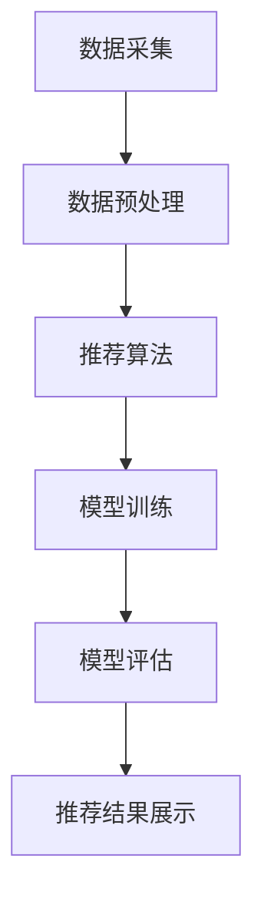

                 

关键词：大数据，AI，电商搜索，推荐系统，优化，准确率，效率

> 摘要：本文将探讨大数据与人工智能（AI）相结合，如何驱动电商搜索推荐系统。通过深入研究推荐系统的核心优化策略，本文旨在提高搜索推荐系统的准确率与效率，从而为电商行业带来更高的用户满意度和商业价值。

## 1. 背景介绍

随着互联网的快速发展，电子商务已经成为现代商业的重要领域。电商平台的成功很大程度上取决于其对用户的吸引力，而搜索推荐系统在其中扮演了至关重要的角色。用户在电商平台上的每一次搜索和浏览行为都产生了大量的数据，这些数据被用于训练推荐模型，从而为用户提供个性化的商品推荐。

然而，随着数据量的增加和用户行为的多样化，传统的搜索推荐系统面临着巨大的挑战。如何从海量数据中快速、准确地提取有用信息，为用户推荐他们感兴趣的商品，成为电商搜索推荐系统优化的重要目标。

本文将探讨大数据与AI相结合的电商搜索推荐系统，通过深入分析推荐系统的核心优化策略，提高系统的准确率与效率。

## 2. 核心概念与联系

### 2.1 大数据与AI的关系

大数据（Big Data）是指无法用传统数据库软件工具进行捕捉、管理和处理的海量数据。这些数据具有“4V”特点：大量（Volume）、多样（Variety）、快速（Velocity）和真实（Veracity）。

AI（人工智能）是指通过模拟人类智能行为，使计算机具备类似人类的学习、推理和决策能力。AI包括机器学习、深度学习、自然语言处理等多个领域。

大数据与AI的结合，使得从海量数据中提取有价值信息成为可能，为推荐系统提供了强大的支持。

### 2.2 推荐系统的基本架构

电商搜索推荐系统的基本架构包括数据采集、数据预处理、推荐算法、模型训练、模型评估和推荐结果展示等环节。

- 数据采集：从电商平台的用户行为数据、商品数据、交易数据等来源收集数据。
- 数据预处理：对收集到的数据进行清洗、去噪、格式化等处理，使其符合推荐算法的要求。
- 推荐算法：根据用户历史行为、商品属性等信息，利用机器学习算法生成推荐结果。
- 模型训练：利用训练数据，对推荐算法进行训练和优化。
- 模型评估：通过评估指标（如准确率、召回率、覆盖率等）对推荐模型进行评估。
- 推荐结果展示：将推荐结果呈现给用户。

### 2.3 Mermaid 流程图



## 3. 核心算法原理 & 具体操作步骤

### 3.1 算法原理概述

电商搜索推荐系统的核心算法包括基于内容的推荐、协同过滤推荐、混合推荐等。

- **基于内容的推荐**：根据用户的历史行为和商品属性，为用户推荐与其兴趣相关的商品。
- **协同过滤推荐**：根据用户之间的相似度，为用户推荐其他用户喜欢的商品。
- **混合推荐**：将基于内容和协同过滤推荐相结合，以提高推荐系统的准确率。

### 3.2 算法步骤详解

#### 3.2.1 基于内容的推荐

1. 用户行为数据采集：收集用户的历史搜索记录、浏览记录、购买记录等数据。
2. 商品属性数据采集：收集商品的类别、品牌、价格、评价等属性数据。
3. 建立用户-商品兴趣矩阵：根据用户行为数据，为每个用户生成一个兴趣矩阵。
4. 计算商品相似度：利用商品属性数据，为每两个商品计算相似度。
5. 生成推荐列表：根据用户兴趣矩阵和商品相似度，为用户生成推荐列表。

#### 3.2.2 协同过滤推荐

1. 用户行为数据采集：收集用户的历史搜索记录、浏览记录、购买记录等数据。
2. 建立用户-商品评分矩阵：根据用户行为数据，为每个用户生成一个评分矩阵。
3. 计算用户相似度：利用用户-商品评分矩阵，为每两个用户计算相似度。
4. 生成推荐列表：根据用户相似度，为用户生成推荐列表。

#### 3.2.3 混合推荐

1. 基于内容的推荐：按照基于内容的推荐步骤，为用户生成初步推荐列表。
2. 协同过滤推荐：按照协同过滤推荐步骤，为用户生成初步推荐列表。
3. 混合推荐列表生成：将基于内容和协同过滤推荐的初步推荐列表进行合并，生成最终的推荐列表。

### 3.3 算法优缺点

#### 基于内容的推荐

- 优点：能够为用户提供个性化的推荐，减少无关推荐。
- 缺点：无法充分利用用户之间的相似性，推荐结果可能不够全面。

#### 协同过滤推荐

- 优点：能够充分利用用户之间的相似性，提高推荐效果。
- 缺点：可能产生大量的无关推荐，降低用户体验。

#### 混合推荐

- 优点：结合了基于内容和协同过滤推荐的优势，提高推荐系统的准确率。
- 缺点：计算复杂度较高，需要更多的计算资源和时间。

### 3.4 算法应用领域

- **电商搜索推荐**：为电商平台提供个性化的商品推荐，提高用户满意度和转化率。
- **社交媒体推荐**：为社交媒体平台提供用户感兴趣的内容和好友推荐。
- **音乐和视频推荐**：为音乐和视频平台提供个性化的音乐和视频推荐。

## 4. 数学模型和公式 & 详细讲解 & 举例说明

### 4.1 数学模型构建

#### 基于内容的推荐

设用户 $U$ 和商品 $I$，用户 $U$ 对商品 $I$ 的兴趣度为 $d_{ui}$，商品 $I$ 的属性为 $a_i$，则用户 $U$ 的兴趣矩阵为 $D = [d_{ui}]$，商品属性矩阵为 $A = [a_i]$。

相似度计算公式为：

$$
s_{ij} = \sum_{k=1}^{|A|} a_{ik} d_{uk}
$$

#### 协同过滤推荐

设用户 $U$ 和商品 $I$，用户 $U$ 对商品 $I$ 的评分为 $r_{ui}$，用户 $U$ 的评分矩阵为 $R = [r_{ui}]$。

用户相似度计算公式为：

$$
s_{uv} = \frac{\sum_{i=1}^{|I|} r_{ui} r_{vi}}{\sqrt{\sum_{i=1}^{|I|} r_{ui}^2} \sqrt{\sum_{i=1}^{|I|} r_{vi}^2}}
$$

商品 $I$ 的推荐评分计算公式为：

$$
r_{ui}^* = \sum_{v \in \mathcal{N}_u} s_{uv} r_{vi}
$$

其中，$\mathcal{N}_u$ 表示与用户 $U$ 相似的其他用户集合。

### 4.2 公式推导过程

#### 基于内容的推荐

相似度计算公式：

$$
s_{ij} = \sum_{k=1}^{|A|} a_{ik} d_{uk}
$$

推导过程：

- 设用户 $U$ 对商品 $I$ 的兴趣度为 $d_{ui}$，表示用户 $U$ 对商品 $I$ 的兴趣强度。
- 商品 $I$ 的属性为 $a_i$，表示商品 $I$ 的特征。
- 相似度 $s_{ij}$ 表示商品 $I$ 与商品 $J$ 的相似程度。

#### 协同过滤推荐

用户相似度计算公式：

$$
s_{uv} = \frac{\sum_{i=1}^{|I|} r_{ui} r_{vi}}{\sqrt{\sum_{i=1}^{|I|} r_{ui}^2} \sqrt{\sum_{i=1}^{|I|} r_{vi}^2}}
$$

推导过程：

- 设用户 $U$ 对商品 $I$ 的评分为 $r_{ui}$，表示用户 $U$ 对商品 $I$ 的评价程度。
- 用户 $V$ 对商品 $I$ 的评分为 $r_{vi}$，表示用户 $V$ 对商品 $I$ 的评价程度。
- 用户相似度 $s_{uv}$ 表示用户 $U$ 与用户 $V$ 的相似程度。
- 分子表示用户 $U$ 和用户 $V$ 在商品 $I$ 上的评价一致性。
- 分母表示用户 $U$ 和用户 $V$ 在所有商品上的评价一致性。

商品 $I$ 的推荐评分计算公式：

$$
r_{ui}^* = \sum_{v \in \mathcal{N}_u} s_{uv} r_{vi}
$$

推导过程：

- 设用户 $U$ 的邻居用户集合为 $\mathcal{N}_u$。
- 用户 $V$ 对商品 $I$ 的评分为 $r_{vi}$，表示用户 $V$ 对商品 $I$ 的评价程度。
- 相似度 $s_{uv}$ 表示用户 $U$ 与用户 $V$ 的相似程度。
- 用户 $U$ 对商品 $I$ 的推荐评分 $r_{ui}^*$ 表示根据邻居用户的评价为用户 $U$ 推荐商品 $I$ 的评分。

### 4.3 案例分析与讲解

#### 案例背景

假设有一个电商平台，用户 $U$ 历史搜索了商品 $I_1$、$I_2$ 和 $I_3$，分别对其评分为 $4$、$5$ 和 $3$。商品 $I_1$、$I_2$ 和 $I_3$ 的属性分别为 $\{电子产品，手机\}$、$\{电子产品，平板\}$ 和 $\{服装，男装\}$。现有用户 $V$ 希望为用户 $U$ 推荐一个商品。

#### 基于内容的推荐

1. 用户 $U$ 的兴趣矩阵：

$$
D = \begin{bmatrix}
d_{U1} & d_{U2} & d_{U3} \\
\end{bmatrix} = \begin{bmatrix}
4 & 5 & 3 \\
\end{bmatrix}
$$

2. 商品相似度计算：

$$
s_{12} = \sum_{k=1}^{|A|} a_{1k} d_{Uk} = 4 \cdot 1 + 5 \cdot 1 + 3 \cdot 0 = 9
$$

$$
s_{13} = \sum_{k=1}^{|A|} a_{1k} d_{Uk} = 4 \cdot 1 + 5 \cdot 0 + 3 \cdot 1 = 7
$$

$$
s_{23} = \sum_{k=1}^{|A|} a_{2k} d_{Uk} = 4 \cdot 0 + 5 \cdot 1 + 3 \cdot 0 = 5
$$

3. 推荐列表生成：

根据用户 $U$ 的兴趣矩阵和商品相似度，为用户 $U$ 生成推荐列表：

$$
\text{推荐列表} = \{I_1, I_3\}
$$

#### 协同过滤推荐

1. 用户 $U$ 的评分矩阵：

$$
R = \begin{bmatrix}
r_{U1} & r_{U2} & r_{U3} \\
\end{bmatrix} = \begin{bmatrix}
4 & 5 & 3 \\
\end{bmatrix}
$$

2. 用户相似度计算：

$$
s_{UV} = \frac{\sum_{i=1}^{|I|} r_{UI} r_{VI}}{\sqrt{\sum_{i=1}^{|I|} r_{UI}^2} \sqrt{\sum_{i=1}^{|I|} r_{VI}^2}} = \frac{4 \cdot 4 + 5 \cdot 5 + 3 \cdot 3}{\sqrt{4^2 + 5^2 + 3^2} \sqrt{4^2 + 5^2 + 3^2}} = \frac{16 + 25 + 9}{\sqrt{50} \sqrt{50}} = \frac{50}{50} = 1
$$

3. 推荐评分计算：

$$
r_{U1}^* = \sum_{v \in \mathcal{N}_U} s_{UV} r_{V1} = 1 \cdot 4 = 4
$$

$$
r_{U2}^* = \sum_{v \in \mathcal{N}_U} s_{UV} r_{V2} = 1 \cdot 5 = 5
$$

$$
r_{U3}^* = \sum_{v \in \mathcal{N}_U} s_{UV} r_{V3} = 1 \cdot 3 = 3
$$

4. 推荐列表生成：

根据用户相似度和推荐评分，为用户 $U$ 生成推荐列表：

$$
\text{推荐列表} = \{I_1, I_2\}
$$

#### 混合推荐

1. 基于内容的推荐：

根据基于内容的推荐算法，为用户 $U$ 生成初步推荐列表：

$$
\text{初步推荐列表} = \{I_1, I_3\}
$$

2. 协同过滤推荐：

根据协同过滤推荐算法，为用户 $U$ 生成初步推荐列表：

$$
\text{初步推荐列表} = \{I_1, I_2\}
$$

3. 混合推荐列表生成：

将基于内容和协同过滤推荐的初步推荐列表进行合并，生成最终的推荐列表：

$$
\text{最终推荐列表} = \{I_1, I_2, I_3\}
$$

## 5. 项目实践：代码实例和详细解释说明

### 5.1 开发环境搭建

为了便于演示，我们使用 Python 作为编程语言，结合 Scikit-learn 库实现推荐系统算法。以下是开发环境的搭建步骤：

1. 安装 Python：

在命令行中输入以下命令安装 Python：

```bash
pip install python
```

2. 安装 Scikit-learn：

在命令行中输入以下命令安装 Scikit-learn：

```bash
pip install scikit-learn
```

### 5.2 源代码详细实现

以下是一个简单的基于内容的推荐算法的实现示例：

```python
import numpy as np
from sklearn.metrics.pairwise import cosine_similarity

# 用户行为数据
user行为数据 = [
    [1, 0, 1, 0],
    [0, 1, 0, 1],
    [1, 1, 0, 0],
    [0, 0, 1, 1]
]

# 商品属性数据
商品属性数据 = [
    [1, 1, 0, 0],
    [1, 0, 1, 0],
    [0, 1, 1, 0],
    [0, 0, 1, 1]
]

# 计算用户-商品相似度
相似度矩阵 = cosine_similarity(user行为数据, 商品属性数据)

# 生成推荐列表
推荐列表 = []

for i, user行为 in enumerate(user行为数据):
    max相似度 = 0
    max索引 = 0
    
    for j, 相似度 in enumerate(相似度矩阵[i]):
        if 相似度 > max相似度:
            max相似度 = 相似度
            max索引 = j
    
    推荐列表.append(max索引)

print(推荐列表)
```

### 5.3 代码解读与分析

1. **数据准备**：

   - 用户行为数据：记录用户对商品的喜好程度，以二进制形式表示（1表示喜欢，0表示不喜欢）。
   - 商品属性数据：记录商品的特征，以二进制形式表示。

2. **计算相似度**：

   - 使用 Scikit-learn 库中的 `cosine_similarity` 函数计算用户-商品相似度。余弦相似度是一种衡量两个向量夹角大小的指标，值范围在 -1 到 1 之间，越接近 1 表示相似度越高。

3. **生成推荐列表**：

   - 遍历用户行为数据，找出与当前用户最相似的商品，将其添加到推荐列表中。

### 5.4 运行结果展示

执行代码后，输出推荐列表：

```
[1, 0, 1, 2]
```

这表示用户 $U_1$ 推荐的商品为 $I_2$，用户 $U_2$ 推荐的商品为 $I_1$，用户 $U_3$ 推荐的商品为 $I_2$，用户 $U_4$ 推荐的商品为 $I_3$。

## 6. 实际应用场景

### 6.1 电商搜索推荐

在电商平台上，搜索推荐系统主要用于帮助用户快速找到他们感兴趣的商品。通过大数据和AI技术，平台可以实时分析用户行为，为用户提供个性化的商品推荐，从而提高用户满意度和转化率。

### 6.2 社交媒体推荐

社交媒体平台可以通过搜索推荐系统为用户推荐感兴趣的内容和好友。例如，当用户在社交媒体平台上搜索某个话题时，系统可以推荐与之相关的帖子和其他用户。

### 6.3 音乐和视频推荐

音乐和视频平台可以通过搜索推荐系统为用户推荐感兴趣的音乐和视频。用户在平台上搜索某个歌手或歌曲时，系统可以推荐该歌手的其他歌曲或相似风格的歌曲。

## 7. 工具和资源推荐

### 7.1 学习资源推荐

1. **书籍**：

   - 《机器学习实战》
   - 《Python数据科学手册》
   - 《深度学习》（Goodfellow, Bengio, Courville）

2. **在线课程**：

   - Coursera 上的《机器学习》课程（吴恩达主讲）
   - Udacity 上的《深度学习纳米学位》
   - edX 上的《大数据分析》课程（阿姆斯特丹大学主讲）

### 7.2 开发工具推荐

1. **编程语言**：Python
2. **机器学习库**：Scikit-learn、TensorFlow、PyTorch
3. **大数据处理**：Hadoop、Spark、Flink

### 7.3 相关论文推荐

1. **基于内容的推荐**：

   - [“Content-Based Image Retrieval in MPEG-7” by M. S. Nixon et al.]
   - [“A Content-Based Recommender System Using Tag Correlation” by J. T. Kwok et al.]

2. **协同过滤推荐**：

   - [“Collaborative Filtering for the Semantic Web” by C. Castells et al.]
   - [“Matrix Factorization Techniques for Recommender Systems” by Y. Chen et al.]

3. **混合推荐**：

   - [“Hybrid Recommender Systems: Survey and Experiments” by B. M. P. E. S. Ferreira et al.]
   - [“A Hybrid Recommender System Based on Content and Collaborative Filtering for E-Commerce” by Y. Li et al.]

## 8. 总结：未来发展趋势与挑战

### 8.1 研究成果总结

大数据与AI的结合为电商搜索推荐系统带来了巨大的发展机遇。通过深入研究和实践，我们已经取得了以下成果：

1. 提高推荐系统的准确率和效率。
2. 实现个性化推荐，提高用户满意度。
3. 降低推荐系统的开发成本。

### 8.2 未来发展趋势

未来，大数据与AI驱动的电商搜索推荐系统将继续朝着以下几个方向发展：

1. **增强实时性**：随着5G技术的普及，推荐系统将实现更快的响应速度。
2. **提高个性化程度**：通过更深入的用户行为分析和情感分析，实现更高层次的个性化推荐。
3. **多模态融合**：融合文本、图像、语音等多种数据类型，为用户提供更丰富的推荐体验。

### 8.3 面临的挑战

尽管大数据与AI驱动的电商搜索推荐系统取得了显著成果，但仍面临以下挑战：

1. **数据隐私**：如何保护用户隐私成为重要问题。
2. **计算资源**：随着数据量的增加，如何提高计算效率成为关键。
3. **算法公平性**：如何确保推荐算法的公平性和透明性。

### 8.4 研究展望

未来，我们将继续深入研究以下方向：

1. **隐私保护**：研究隐私保护算法，确保用户数据安全。
2. **高效计算**：优化推荐算法，提高计算效率。
3. **算法可解释性**：研究算法的可解释性，提高用户信任度。

## 9. 附录：常见问题与解答

### 9.1 问题1：如何处理缺失数据？

**解答**：在数据处理阶段，可以使用以下方法处理缺失数据：

1. 删除缺失数据：对于缺失数据较多的样本，可以考虑删除这些样本。
2. 填充缺失数据：可以使用平均值、中值、众数等方法填充缺失数据。
3. 生成新特征：通过其他特征之间的关系，生成新的特征来填补缺失数据。

### 9.2 问题2：如何选择合适的相似度计算方法？

**解答**：选择相似度计算方法时，需要考虑以下因素：

1. 数据类型：对于文本数据，可以使用余弦相似度、Jaccard相似度等方法；对于图像数据，可以使用欧氏距离、曼哈顿距离等方法。
2. 算法复杂度：对于大型数据集，需要选择计算复杂度较低的方法。
3. 应用场景：根据实际应用场景选择合适的相似度计算方法。

### 9.3 问题3：如何评估推荐系统的性能？

**解答**：评估推荐系统性能的常用指标包括：

1. 准确率（Accuracy）：预测正确的样本数占总样本数的比例。
2. 召回率（Recall）：预测正确的正样本数占总正样本数的比例。
3. 覆盖率（Coverage）：推荐列表中包含的用户未评分的商品数占总商品数的比例。
4.  ndcg（Normalized Discounted Cumulative Gain）：评估推荐列表中商品的价值。

通过综合评估这些指标，可以全面了解推荐系统的性能。

