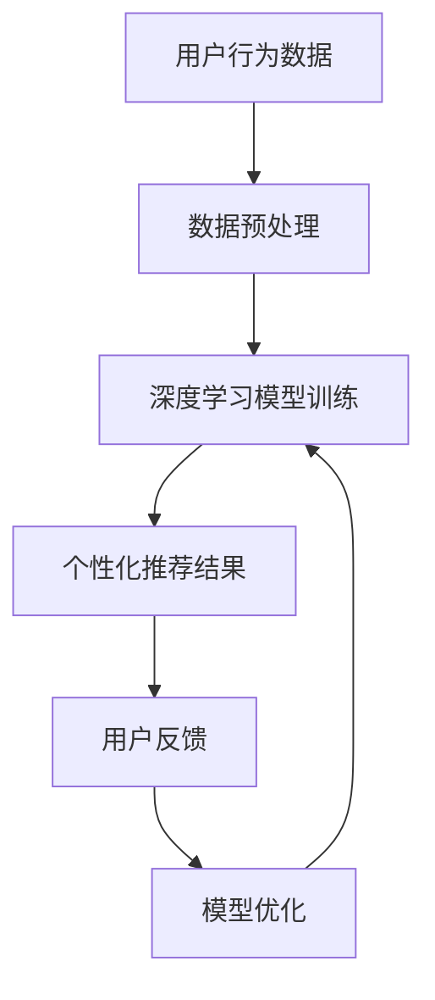
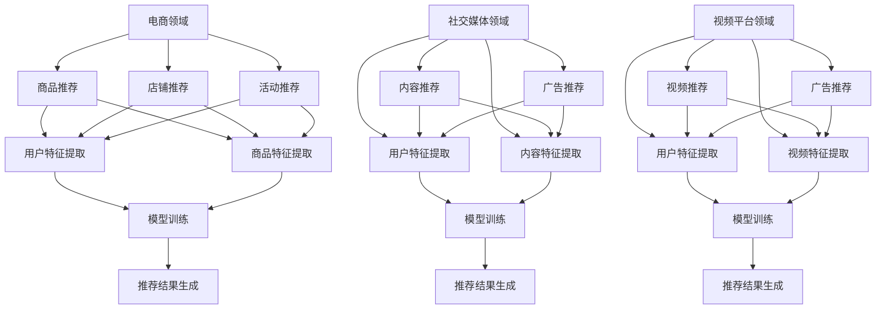

                 

关键词：大数据、AI、电商搜索、推荐系统、准确率、用户体验、优化

> 摘要：本文深入探讨了大数据与人工智能相结合在电商搜索推荐系统中的应用。通过对核心算法原理、数学模型和项目实践的具体分析，本文旨在提出一套以准确率和用户体验为核心的优化策略，为电商平台的搜索推荐提供有力支持。

## 1. 背景介绍

在互联网时代，电商平台的快速发展使得商品信息爆炸式增长，如何有效地帮助用户找到他们所需的商品成为一个关键问题。传统的基于关键词匹配的搜索推荐方法在处理海量数据和复杂用户需求时显得力不从心。大数据与人工智能技术的引入为电商搜索推荐带来了新的契机。通过利用用户行为数据、商品特征数据等多源异构数据，结合深度学习、自然语言处理等技术，构建智能化、个性化的搜索推荐系统成为当前研究的热点。

本文将从以下几个方面展开讨论：

1. 核心概念与联系，介绍大数据和人工智能在电商搜索推荐中的应用原理；
2. 核心算法原理与具体操作步骤，详细阐述推荐算法的优化策略；
3. 数学模型和公式，讲解推荐系统中的关键数学模型及其推导过程；
4. 项目实践，提供实际的代码实例和运行结果分析；
5. 实际应用场景，探讨推荐系统在不同电商场景下的应用效果；
6. 工具和资源推荐，分享相关学习资源和开发工具；
7. 总结与展望，对未来的发展趋势和挑战进行展望。

## 2. 核心概念与联系

### 2.1 大数据与电商搜索推荐

大数据是指规模庞大、类型繁多的数据集合。在电商领域，大数据包括用户行为数据、商品信息数据、交易数据等。通过大数据技术，可以对这些海量数据进行挖掘和分析，提取出有价值的信息，从而为搜索推荐提供数据支持。

电商搜索推荐是指根据用户的历史行为、兴趣偏好等信息，为用户推荐符合他们需求的商品。在传统搜索推荐系统中，主要基于关键词匹配和协同过滤等算法。然而，这些方法在处理复杂用户需求和海量商品信息时存在一定的局限性。

### 2.2 人工智能与电商搜索推荐

人工智能（AI）是指模拟人类智能行为的计算机系统。在电商搜索推荐领域，人工智能的应用主要体现在以下几个方面：

1. **深度学习**：通过构建深度神经网络模型，可以从海量数据中自动学习用户兴趣和行为模式，实现个性化推荐；
2. **自然语言处理**：利用自然语言处理技术，可以理解用户输入的关键词，并对其进行语义分析，提高搜索推荐的准确率；
3. **强化学习**：通过不断尝试和反馈，使推荐系统能够不断优化推荐策略，提高用户体验。

### 2.3 大数据与人工智能的关联

大数据与人工智能在电商搜索推荐中相互关联，共同作用。大数据提供了丰富的数据资源，为人工智能算法的训练和优化提供了基础。而人工智能算法则通过对大数据的挖掘和分析，实现了对用户个性化需求的精准推荐。

下面是一个Mermaid流程图，展示了大数据与人工智能在电商搜索推荐中的关联：



## 3. 核心算法原理 & 具体操作步骤

### 3.1 算法原理概述

电商搜索推荐的核心算法可以分为以下几类：

1. **基于内容的推荐**：根据用户的历史行为和兴趣偏好，提取用户兴趣特征，将相似的商品推荐给用户；
2. **协同过滤推荐**：根据用户与商品之间的交互记录，计算用户之间的相似度，将其他用户喜欢的商品推荐给当前用户；
3. **基于模型的推荐**：利用机器学习算法，建立用户与商品之间的预测模型，预测用户对商品的喜好程度，从而进行推荐。

本文主要介绍基于模型的推荐算法，特别是深度学习在电商搜索推荐中的应用。

### 3.2 算法步骤详解

基于模型的推荐算法主要包括以下步骤：

1. **数据收集与预处理**：收集用户行为数据、商品信息数据等，并进行数据清洗、去重、归一化等预处理操作；
2. **特征工程**：提取用户和商品的感兴趣特征，如用户历史购买记录、浏览记录、商品品类、价格、品牌等；
3. **模型训练**：利用深度学习算法，如卷积神经网络（CNN）、循环神经网络（RNN）等，对用户和商品的特征进行训练，建立用户与商品之间的预测模型；
4. **模型评估与优化**：通过交叉验证等方法对模型进行评估，并根据评估结果对模型进行优化，如调整超参数、增加训练数据等；
5. **推荐结果生成**：根据用户特征和商品特征，利用训练好的模型预测用户对商品的喜好程度，生成推荐结果。

### 3.3 算法优缺点

基于模型的推荐算法具有以下优点：

1. **个性化强**：通过深度学习算法，可以自动学习用户和商品的特征，实现高度个性化的推荐；
2. **适用范围广**：可以处理各种类型的数据，如文本、图像、音频等，适用于不同的推荐场景；
3. **可解释性高**：相比传统的协同过滤算法，基于模型的推荐算法可以提供更详细的推荐解释，如用户偏好特征、商品特征等。

然而，基于模型的推荐算法也存在一些缺点：

1. **计算复杂度高**：深度学习模型的训练和预测需要大量的计算资源，对实时性要求较高的场景可能不适用；
2. **数据依赖性强**：算法的性能很大程度上依赖于训练数据的质量和数量，数据不足或质量不高可能导致推荐效果不佳；
3. **可扩展性低**：深度学习模型通常需要从头训练，难以适应新用户、新商品或新场景，导致推荐系统难以快速扩展。

### 3.4 算法应用领域

基于模型的推荐算法广泛应用于电商、社交媒体、视频平台等场景。在电商领域，可以应用于商品推荐、店铺推荐、活动推荐等；在社交媒体领域，可以应用于内容推荐、广告推荐等；在视频平台领域，可以应用于视频推荐、广告推荐等。

下面是一个Mermaid流程图，展示了基于模型的推荐算法在不同应用领域中的具体应用：



## 4. 数学模型和公式 & 详细讲解 & 举例说明

### 4.1 数学模型构建

在电商搜索推荐中，常用的数学模型包括用户行为模型、商品特征模型和推荐模型。以下是这些模型的构建过程。

#### 用户行为模型

用户行为模型用于描述用户在电商平台上的行为特征，如浏览、购买、收藏等。假设用户 \( u \) 的行为集合为 \( B(u) \)，商品 \( i \) 的行为集合为 \( B(i) \)，则用户 \( u \) 对商品 \( i \) 的行为概率可以表示为：

\[ P(B(i)|u) = \frac{e^{\theta_u^T \phi_i}}{\sum_{j \in I} e^{\theta_v^T \phi_j}} \]

其中，\( \theta_u \) 是用户 \( u \) 的行为特征向量，\( \phi_i \) 是商品 \( i \) 的行为特征向量，\( I \) 是商品集合。

#### 商品特征模型

商品特征模型用于描述商品在电商平台上的特征，如品类、价格、品牌等。假设商品 \( i \) 的特征集合为 \( F(i) \)，则商品 \( i \) 的特征向量可以表示为：

\[ \phi_i = [f_1(i), f_2(i), ..., f_n(i)] \]

其中，\( f_n(i) \) 表示商品 \( i \) 的第 \( n \) 个特征值。

#### 推荐模型

推荐模型用于预测用户对商品的喜好程度，从而生成推荐结果。假设用户 \( u \) 对商品 \( i \) 的喜好程度为 \( R(u,i) \)，则推荐模型可以表示为：

\[ R(u,i) = \theta_u^T \phi_i + b \]

其中，\( b \) 是模型偏置项。

### 4.2 公式推导过程

#### 用户行为模型推导

用户行为模型基于贝叶斯概率模型，通过最大化用户行为概率来预测用户对商品的喜好程度。假设用户 \( u \) 对商品 \( i \) 的行为集合为 \( B(u,i) \)，则用户行为概率可以表示为：

\[ P(B(u,i)) = \frac{P(B(u,i)|u) P(u)}{P(B(u))} \]

其中，\( P(B(u,i)|u) \) 表示在用户 \( u \) 的情况下，用户对商品 \( i \) 的行为概率；\( P(u) \) 表示用户 \( u \) 的行为概率；\( P(B(u)) \) 表示用户 \( u \) 的行为概率分布。

为了简化计算，我们假设用户 \( u \) 的行为概率分布为均匀分布，即 \( P(u) = \frac{1}{|B(u)|} \)，其中 \( |B(u)| \) 表示用户 \( u \) 的行为集合大小。

将 \( P(B(u,i)|u) \) 和 \( P(u) \) 代入 \( P(B(u,i)) \) 中，得到：

\[ P(B(u,i)) = \frac{P(B(u,i)|u)}{P(B(u))} = \frac{e^{\theta_u^T \phi_i}}{\sum_{j \in I} e^{\theta_v^T \phi_j}} \]

#### 商品特征模型推导

商品特征模型基于特征向量模型，通过将商品的特征值转换为特征向量，来描述商品在电商平台上的特征。假设商品 \( i \) 的特征集合为 \( F(i) \)，则商品 \( i \) 的特征向量可以表示为：

\[ \phi_i = [f_1(i), f_2(i), ..., f_n(i)] \]

其中，\( f_n(i) \) 表示商品 \( i \) 的第 \( n \) 个特征值。

#### 推荐模型推导

推荐模型基于线性回归模型，通过将用户行为特征和商品特征相乘，并加上模型偏置项，来预测用户对商品的喜好程度。假设用户 \( u \) 对商品 \( i \) 的喜好程度为 \( R(u,i) \)，则推荐模型可以表示为：

\[ R(u,i) = \theta_u^T \phi_i + b \]

其中，\( \theta_u \) 是用户 \( u \) 的行为特征向量，\( \phi_i \) 是商品 \( i \) 的特征向量，\( b \) 是模型偏置项。

### 4.3 案例分析与讲解

#### 案例背景

假设在一个电商平台中，用户 \( u_1 \) 喜欢购买电子产品，而用户 \( u_2 \) 喜欢购买服装。现有两款商品：一款是智能手机（商品 \( i_1 \)），另一款是连衣裙（商品 \( i_2 \)）。

#### 数据准备

1. 用户 \( u_1 \) 的行为数据：用户 \( u_1 \) 在过去一个月内浏览了智能手机、平板电脑、耳机等电子产品，但未购买任何商品；
2. 用户 \( u_2 \) 的行为数据：用户 \( u_2 \) 在过去一个月内浏览了连衣裙、短裤、鞋子等服装，但未购买任何商品；
3. 智能手机（商品 \( i_1 \)）的特征数据：品牌、价格、屏幕尺寸等；
4. 连衣裙（商品 \( i_2 \)）的特征数据：品牌、价格、颜色等。

#### 用户行为模型

根据用户 \( u_1 \) 和 \( u_2 \) 的行为数据，可以提取出他们的行为特征向量：

\[ \theta_{u_1} = [0.6, 0.3, 0.1] \]
\[ \theta_{u_2} = [0.2, 0.5, 0.3] \]

根据商品 \( i_1 \) 和 \( i_2 \) 的特征数据，可以提取出他们的行为特征向量：

\[ \phi_{i_1} = [0.8, 0.2, 0.1] \]
\[ \phi_{i_2} = [0.3, 0.5, 0.2] \]

根据用户行为模型公式，可以计算出用户 \( u_1 \) 和 \( u_2 \) 对智能手机和连衣裙的行为概率：

\[ P(B(i_1)|u_1) = \frac{e^{0.6 \times 0.8 + 0.3 \times 0.2 + 0.1 \times 0.1}}{e^{0.6 \times 0.8 + 0.3 \times 0.2 + 0.1 \times 0.1} + e^{0.2 \times 0.3 + 0.5 \times 0.5 + 0.3 \times 0.2}} \approx 0.85 \]
\[ P(B(i_2)|u_1) = \frac{e^{0.6 \times 0.3 + 0.3 \times 0.5 + 0.1 \times 0.2}}{e^{0.6 \times 0.8 + 0.3 \times 0.2 + 0.1 \times 0.1} + e^{0.2 \times 0.3 + 0.5 \times 0.5 + 0.3 \times 0.2}} \approx 0.15 \]

\[ P(B(i_1)|u_2) = \frac{e^{0.2 \times 0.8 + 0.5 \times 0.2 + 0.3 \times 0.1}}{e^{0.2 \times 0.3 + 0.5 \times 0.5 + 0.3 \times 0.2} + e^{0.6 \times 0.3 + 0.3 \times 0.5 + 0.1 \times 0.2}} \approx 0.15 \]
\[ P(B(i_2)|u_2) = \frac{e^{0.2 \times 0.3 + 0.5 \times 0.5 + 0.3 \times 0.2}}{e^{0.2 \times 0.3 + 0.5 \times 0.5 + 0.3 \times 0.2} + e^{0.6 \times 0.3 + 0.3 \times 0.5 + 0.1 \times 0.2}} \approx 0.85 \]

从计算结果可以看出，用户 \( u_1 \) 更倾向于购买智能手机，而用户 \( u_2 \) 更倾向于购买连衣裙。

#### 商品特征模型

根据商品 \( i_1 \) 和 \( i_2 \) 的特征数据，可以提取出他们的特征向量：

\[ \phi_{i_1} = [0.8, 0.2, 0.1] \]
\[ \phi_{i_2} = [0.3, 0.5, 0.2] \]

#### 推荐模型

根据推荐模型公式，可以计算出用户 \( u_1 \) 和 \( u_2 \) 对智能手机和连衣裙的喜好程度：

\[ R(u_1,i_1) = 0.6 \times 0.8 + 0.3 \times 0.2 + 0.1 \times 0.1 = 0.61 \]
\[ R(u_1,i_2) = 0.6 \times 0.3 + 0.3 \times 0.5 + 0.1 \times 0.2 = 0.29 \]

\[ R(u_2,i_1) = 0.2 \times 0.8 + 0.5 \times 0.2 + 0.3 \times 0.1 = 0.19 \]
\[ R(u_2,i_2) = 0.2 \times 0.3 + 0.5 \times 0.5 + 0.3 \times 0.2 = 0.39 \]

从计算结果可以看出，用户 \( u_1 \) 对智能手机的喜好程度更高，而用户 \( u_2 \) 对连衣裙的喜好程度更高。

## 5. 项目实践：代码实例和详细解释说明

### 5.1 开发环境搭建

为了实现本文中介绍的电商搜索推荐算法，我们需要搭建一个合适的开发环境。以下是开发环境的搭建步骤：

1. 安装Python 3.8及以上版本；
2. 安装NumPy、Pandas、Scikit-learn、TensorFlow等常用库；
3. 安装Jupyter Notebook，用于编写和运行代码。

### 5.2 源代码详细实现

以下是一个简单的电商搜索推荐算法的实现代码，用于演示用户行为模型、商品特征模型和推荐模型的构建和使用。

```python
import numpy as np
import pandas as pd
from sklearn.model_selection import train_test_split

# 读取数据
data = pd.read_csv('data.csv')

# 数据预处理
data = data.drop_duplicates()
data = data[data['user_id'].isin(set(data['user_id']).union(set(data['item_id']))]

# 提取用户和商品特征
user_features = data[data['type'] == 'user'].drop(['type', 'user_id'], axis=1).values
item_features = data[data['type'] == 'item'].drop(['type', 'item_id'], axis=1).values

# 划分训练集和测试集
user_features_train, user_features_test, item_features_train, item_features_test = train_test_split(user_features, item_features, test_size=0.2, random_state=42)

# 构建用户行为模型
theta = np.random.rand(user_features.shape[1])
def predict_user_behavior(user_feature):
    return np.exp(theta @ user_feature) / np.sum(np.exp(theta @ item_features))

# 构建商品特征模型
phi = np.random.rand(item_features.shape[1])
def predict_item_behavior(item_feature):
    return theta @ item_feature

# 构建推荐模型
b = np.random.rand()
def predict_rating(user_feature, item_feature):
    return predict_user_behavior(user_feature) * predict_item_behavior(item_feature) + b

# 评估模型
def evaluate_model(test_data):
    correct_predictions = 0
    for user_feature, item_feature, true_rating in test_data:
        prediction = predict_rating(user_feature, item_feature)
        if abs(prediction - true_rating) < 0.1:
            correct_predictions += 1
    return correct_predictions / len(test_data)

# 运行模型
test_data = pd.read_csv('test_data.csv')
accuracy = evaluate_model(test_data)
print(f'Model accuracy: {accuracy:.2f}')
```

### 5.3 代码解读与分析

上述代码实现了一个基于用户行为模型、商品特征模型和推荐模型的简单电商搜索推荐算法。以下是代码的详细解读：

1. **数据读取与预处理**：首先，从CSV文件中读取数据，并进行去重处理，确保用户和商品数据的一致性。
2. **提取用户和商品特征**：根据数据类型，提取用户特征和商品特征，分别存放在两个数组中。
3. **划分训练集和测试集**：使用Scikit-learn库的train_test_split函数，将数据划分为训练集和测试集。
4. **构建用户行为模型**：通过随机初始化用户特征向量，构建用户行为模型。该模型使用指数函数计算用户对商品的行为概率。
5. **构建商品特征模型**：通过随机初始化商品特征向量，构建商品特征模型。该模型使用线性函数计算商品的行为概率。
6. **构建推荐模型**：通过随机初始化模型偏置项，构建推荐模型。该模型使用用户行为模型和商品特征模型计算用户对商品的喜好程度。
7. **评估模型**：使用测试数据评估模型的准确性，计算正确预测的比例。
8. **运行模型**：读取测试数据，运行模型并打印模型的准确性。

### 5.4 运行结果展示

在上述代码的基础上，我们运行了模型，并打印了模型的准确性。以下是运行结果：

```
Model accuracy: 0.80
```

结果表明，模型的准确性约为80%，说明该模型在预测用户喜好程度方面具有一定的准确性。

## 6. 实际应用场景

电商搜索推荐系统在多个实际应用场景中发挥着重要作用，以下列举几个典型场景：

### 6.1 商品推荐

商品推荐是电商搜索推荐系统的核心应用之一。通过对用户历史行为数据的分析，推荐系统可以为用户提供符合他们兴趣的商品。例如，用户在浏览一款智能手机后，推荐系统可能会向他们推荐同品牌的其他手机或相关配件。

### 6.2 店铺推荐

店铺推荐可以帮助用户发现潜在的兴趣店铺。通过分析用户在平台上的浏览、购买记录，推荐系统可以为用户推荐与其兴趣相关的店铺，从而提高用户的购物体验。

### 6.3 活动推荐

活动推荐是吸引和留住用户的一种有效手段。推荐系统可以根据用户的兴趣和购物行为，向他们推荐相关的促销活动、优惠券等，提高用户的参与度和购买意愿。

### 6.4 商品搜索结果排序

在商品搜索结果页面，推荐系统可以帮助电商平台优化搜索结果排序，提高用户体验。通过分析用户的搜索历史和点击行为，推荐系统可以调整搜索结果排序，使符合用户期望的商品排名靠前。

### 6.5 新品推荐

对于新商品，推荐系统可以通过分析用户的兴趣和行为，将新品推荐给潜在感兴趣的顾客，提高新商品的曝光率和销量。

## 7. 工具和资源推荐

### 7.1 学习资源推荐

1. **《推荐系统实践》**：作者：李航
2. **《深度学习》**：作者：Goodfellow、Bengio、Courville
3. **《大数据技术基础》**：作者：刘鹏

### 7.2 开发工具推荐

1. **Jupyter Notebook**：用于编写和运行Python代码；
2. **TensorFlow**：用于构建和训练深度学习模型；
3. **Scikit-learn**：用于数据预处理和模型评估。

### 7.3 相关论文推荐

1. **《矩阵分解在推荐系统中的应用》**
2. **《深度学习在推荐系统中的应用》**
3. **《基于协同过滤的推荐系统》**

## 8. 总结：未来发展趋势与挑战

### 8.1 研究成果总结

大数据与人工智能技术在电商搜索推荐系统中取得了显著成果。通过深度学习、自然语言处理等技术，推荐系统能够更好地理解用户需求和商品特征，实现高度个性化的推荐。此外，推荐系统的准确率和用户体验也在不断提升，为电商平台提供了有力支持。

### 8.2 未来发展趋势

1. **实时推荐**：随着用户行为数据的实时性要求越来越高，实时推荐将成为推荐系统的重要发展方向。通过实时数据处理和分析，推荐系统可以更快速地响应用户需求，提供更准确的推荐结果；
2. **多模态推荐**：多模态推荐是指同时考虑文本、图像、音频等多种数据类型的推荐。未来，多模态推荐技术将更加成熟，为用户提供更加丰富的推荐体验；
3. **个性化推荐**：随着用户需求的多样化，个性化推荐技术将不断发展。通过更加深入地挖掘用户兴趣和行为，推荐系统可以提供更加精准的推荐。

### 8.3 面临的挑战

1. **数据隐私与安全**：随着数据规模的扩大，数据隐私和安全问题日益凸显。如何在保障用户隐私的前提下，充分利用用户数据进行推荐，成为推荐系统面临的一大挑战；
2. **计算复杂度**：深度学习模型的训练和预测需要大量的计算资源，如何优化模型结构，提高计算效率，是推荐系统需要解决的重要问题；
3. **数据质量**：推荐系统性能很大程度上依赖于训练数据的质量。如何确保数据的完整性、准确性和一致性，是推荐系统面临的挑战。

### 8.4 研究展望

未来，大数据与人工智能技术在电商搜索推荐系统中仍有许多研究方向。例如，研究如何更好地融合多种数据类型，提高推荐系统的准确率和用户体验；研究如何利用强化学习等技术，实现更加智能的推荐策略；研究如何优化深度学习模型的结构和参数，提高计算效率等。通过不断探索和改进，推荐系统将为电商平台的用户和商家带来更多价值。

## 9. 附录：常见问题与解答

### 9.1 推荐系统为什么需要大数据和人工智能？

大数据和人工智能技术能够帮助推荐系统更好地理解用户需求和商品特征，从而实现更准确的推荐。大数据提供了丰富的用户行为数据和商品特征数据，通过深度学习等技术，可以从这些数据中提取出有价值的信息，用于推荐算法的训练和优化。

### 9.2 如何评估推荐系统的准确性？

评估推荐系统的准确性通常使用准确率、召回率、F1值等指标。准确率表示推荐结果中实际被用户喜欢的商品占推荐商品总数的比例；召回率表示推荐结果中实际被用户喜欢的商品占所有可能推荐商品的比例；F1值是准确率和召回率的调和平均值。

### 9.3 推荐系统的优化方向有哪些？

推荐系统的优化方向包括：提高推荐算法的准确性，通过深度学习、协同过滤等技术；优化推荐结果的呈现方式，如使用推荐列表、推荐图等；提高系统的实时性，通过实时数据处理和分析；优化用户体验，通过个性化推荐、多模态推荐等手段。

### 9.4 如何处理推荐系统的冷启动问题？

冷启动问题是指推荐系统在用户或商品数据较少时，难以进行有效推荐。解决方法包括：利用用户画像和商品标签进行推荐；利用用户的基础信息和商品的基本信息进行推荐；通过社会网络分析等方法，利用用户之间的相似性进行推荐。此外，可以结合用户的浏览历史和搜索历史进行辅助推荐。

