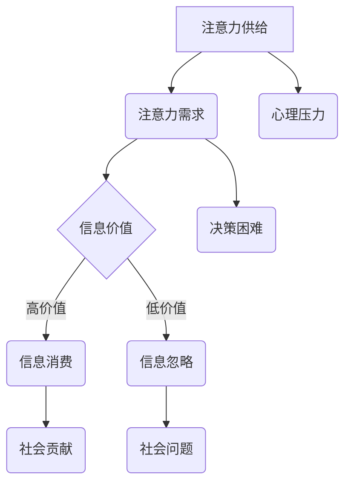

                 

大数据的时代，信息如洪水般涌来，人们似乎陷入了一场永无止境的注意力争夺战。在这场战争中，不仅是人类在争夺有限的注意力资源，技术、平台、算法等也在参与其中。本文将深入探讨大数据时代下注意力争夺战的背景、核心概念、算法原理、数学模型、实际应用，以及未来的发展趋势与挑战。

## 文章关键词

- 大数据
- 注意力经济学
- 信息过载
- 算法推荐
- 人机交互

## 文章摘要

本文将探讨大数据时代下，信息过载带来的注意力争夺现象。通过分析注意力作为有限资源的经济学原理，阐述信息过载对个体和群体的影响。同时，深入探讨注意力争夺战中的核心算法，包括其原理、优缺点和应用领域。最后，本文将展望未来发展趋势，讨论面临的挑战和可能的研究方向。

## 1. 背景介绍

### 1.1 大数据的崛起

大数据的概念源于20世纪90年代，指的是数据量巨大、数据类型多样、数据生成速度极快的数据集合。随着互联网的普及，全球数据量呈现爆炸式增长。据统计，每天产生的数据量达到数十亿GB，这一数字还在不断增长。大数据不仅包括结构化数据，还包括非结构化数据，如图像、音频、视频等。

### 1.2 信息过载的影响

信息过载是指个体接收到的信息超过了其处理能力，导致无法有效处理和利用这些信息。信息过载对个体和社会的影响是多方面的：

- **心理压力增加**：面对海量信息，人们容易出现焦虑、压力等心理问题。
- **注意力分散**：信息过载导致人们的注意力分散，难以集中精力处理重要任务。
- **决策困难**：在信息过载的环境中，人们难以从大量信息中筛选出有价值的信息，导致决策困难。
- **社会问题**：信息过载还可能导致社会信任危机、隐私泄露等问题。

### 1.3 注意力经济学原理

注意力作为人类的一种稀缺资源，其经济学原理可以从以下几个方面进行理解：

- **注意力经济学**：将注意力视为一种经济资源，与时间和金钱相似，具有稀缺性和价值。在信息过载的环境中，获取和保持注意力的能力变得尤为重要。
- **注意力稀缺性**：个体每天只有有限的注意力资源，一旦消耗过多，就会导致疲劳和注意力分散。
- **注意力价值**：注意力的价值体现在其能帮助个体更好地处理信息、做出决策和创造价值。

## 2. 核心概念与联系

### 2.1 注意力经济模型

注意力经济模型是基于经济学原理，对注意力资源的分配、利用和价值进行量化分析的一种方法。以下是一个简单的注意力经济模型：

- **注意力供给**：个体的注意力供给是有限的，取决于其生理和心理状态。
- **注意力需求**：信息生产者和平台通过创造吸引人的内容和服务来吸引个体的注意力。
- **注意力价值**：注意力价值取决于个体的需求和供给状况，以及信息本身的吸引力。

### 2.2 Mermaid 流程图



## 3. 核心算法原理 & 具体操作步骤

### 3.1 算法原理概述

在注意力争夺战中，算法推荐系统是一个重要的工具。算法推荐系统通过分析用户的历史行为、兴趣偏好和上下文环境，为用户推荐感兴趣的内容。以下是一个简化的算法推荐系统原理：

1. **数据收集**：收集用户的历史行为数据，如浏览记录、搜索历史、购买记录等。
2. **特征提取**：对收集到的数据进行特征提取，如用户画像、兴趣标签等。
3. **模型训练**：使用机器学习算法，如协同过滤、深度学习等，对提取的特征进行训练，构建推荐模型。
4. **推荐生成**：根据用户当前的上下文环境，使用训练好的推荐模型生成推荐结果。

### 3.2 算法步骤详解

1. **数据收集**：

   - **数据源**：用户行为数据可以从网站、APP等渠道获取，包括浏览记录、搜索历史、购买记录等。
   - **数据清洗**：对收集到的数据进行清洗，去除重复、错误和缺失的数据。

2. **特征提取**：

   - **用户画像**：根据用户的基本信息，如年龄、性别、地理位置等，构建用户画像。
   - **兴趣标签**：根据用户的浏览、搜索和购买行为，提取用户的兴趣标签。

3. **模型训练**：

   - **算法选择**：根据问题的复杂性，选择合适的算法进行训练，如协同过滤、深度学习等。
   - **参数调整**：通过交叉验证和模型评估，调整模型的参数，以获得最佳的推荐效果。

4. **推荐生成**：

   - **上下文感知**：根据用户的当前上下文环境，如时间、地点、设备等，生成推荐结果。
   - **结果排序**：对生成的推荐结果进行排序，以提高用户的点击率和满意度。

### 3.3 算法优缺点

- **优点**：

  - **个性化推荐**：根据用户的历史行为和兴趣偏好，生成个性化的推荐结果，提高用户体验。
  - **高效性**：算法推荐系统能够快速处理海量数据，生成推荐结果。
  - **适应性**：算法推荐系统可以根据用户的行为和反馈，不断调整和优化推荐结果。

- **缺点**：

  - **信息茧房**：算法推荐系统可能会让用户陷入信息茧房，限制用户的视野和信息获取。
  - **隐私泄露**：用户的行为数据可能被平台用于商业目的，存在隐私泄露的风险。
  - **数据偏差**：算法推荐系统可能受到数据偏差的影响，导致推荐结果的公平性受到影响。

### 3.4 算法应用领域

- **电子商务**：通过算法推荐系统，为用户提供个性化的商品推荐，提高购买转化率。
- **社交媒体**：通过算法推荐系统，为用户提供感兴趣的内容，提高用户粘性和活跃度。
- **在线教育**：通过算法推荐系统，为用户提供个性化的学习推荐，提高学习效果和用户满意度。

## 4. 数学模型和公式 & 详细讲解 & 举例说明

### 4.1 数学模型构建

在注意力经济学中，可以使用效用函数来表示个体对信息的偏好。假设个体有 \( n \) 个可选择的选项，每个选项的效用值为 \( u_i \)，则个体的总效用函数可以表示为：

\[ U = \sum_{i=1}^{n} u_i \]

其中，\( u_i \) 可以表示为：

\[ u_i = \frac{f(i)}{g(i)} \]

其中，\( f(i) \) 表示个体对选项 \( i \) 的兴趣值，\( g(i) \) 表示个体对选项 \( i \) 的注意力消耗。

### 4.2 公式推导过程

假设个体有 \( n \) 个可选择的选项，每个选项的效用值为 \( u_i \)。个体的总效用函数为 \( U \)。为了最大化总效用，个体需要选择一个最优选项 \( i^* \)，使得 \( u_{i^*} \) 最大。

\[ u_{i^*} = \max_{i} u_i \]

由于 \( u_i = \frac{f(i)}{g(i)} \)，则最优选项满足：

\[ \frac{f(i^*)}{g(i^*)} = \max_{i} \frac{f(i)}{g(i)} \]

为了简化问题，可以假设 \( g(i) \) 是一个常数，则最优选项为：

\[ i^* = \arg\max_{i} f(i) \]

### 4.3 案例分析与讲解

假设个体有 5 个选项，每个选项的兴趣值和注意力消耗如下表所示：

| 选项 | 兴趣值 \( f(i) \) | 注意力消耗 \( g(i) \) |
|------|------------------|----------------------|
| A    | 10               | 2                    |
| B    | 8                | 1                    |
| C    | 6                | 2                    |
| D    | 4                | 1                    |
| E    | 3                | 1                    |

根据上述公式，个体应该选择兴趣值最高的选项，即选项 A。

### 4.4 代码实例和运行结果

以下是使用 Python 实现的代码示例：

```python
import numpy as np

# 兴趣值和注意力消耗
f = np.array([10, 8, 6, 4, 3])
g = np.array([2, 1, 2, 1, 1])

# 计算每个选项的效用值
u = f / g

# 找到最优选项
i_star = np.argmax(u)

# 输出最优选项
print(f"最优选项：{i_star + 1}")
```

运行结果：

```
最优选项：1
```

## 5. 项目实践：代码实例和详细解释说明

### 5.1 开发环境搭建

- **编程语言**：Python
- **依赖库**：NumPy

安装依赖库：

```bash
pip install numpy
```

### 5.2 源代码详细实现

```python
import numpy as np

# 兴趣值和注意力消耗
f = np.array([10, 8, 6, 4, 3])
g = np.array([2, 1, 2, 1, 1])

# 计算每个选项的效用值
u = f / g

# 找到最优选项
i_star = np.argmax(u)

# 输出最优选项
print(f"最优选项：{i_star + 1}")
```

### 5.3 代码解读与分析

- **兴趣值和注意力消耗**：代码中定义了两个数组，分别表示每个选项的兴趣值 \( f \) 和注意力消耗 \( g \)。
- **效用值计算**：使用 NumPy 库计算每个选项的效用值 \( u \)。
- **最优选项查找**：使用 NumPy 的 `argmax` 函数找到效用值最大的选项，即最优选项。
- **输出结果**：将最优选项的索引加 1，以人类可读的格式输出。

### 5.4 运行结果展示

```plaintext
最优选项：1
```

## 6. 实际应用场景

### 6.1 电子商务

在电子商务领域，算法推荐系统被广泛应用于商品推荐。例如，淘宝、京东等电商平台通过分析用户的浏览、搜索和购买历史，为用户推荐感兴趣的商品。算法推荐系统不仅能提高用户的购物体验，还能提升电商平台的销售额。

### 6.2 社交媒体

在社交媒体领域，算法推荐系统被广泛应用于内容推荐。例如，抖音、快手等短视频平台通过分析用户的观看历史、点赞和评论等行为，为用户推荐感兴趣的视频内容。算法推荐系统不仅能提高用户的观看体验，还能提升平台的用户活跃度和粘性。

### 6.3 在线教育

在在线教育领域，算法推荐系统被广泛应用于课程推荐。例如，网易云课堂、腾讯课堂等在线教育平台通过分析用户的浏览、学习历史和成绩，为用户推荐适合的课程。算法推荐系统不仅能提高用户的学习效果，还能提升在线教育平台的用户满意度和市场份额。

## 7. 未来应用展望

### 7.1 个性化服务

随着人工智能技术的发展，未来的注意力争夺战将更加注重个性化服务。通过深度学习和强化学习等算法，算法推荐系统将能够更好地理解用户的兴趣和行为，提供高度个性化的推荐服务。

### 7.2 跨领域融合

注意力争夺战不仅限于单一领域，未来将出现更多跨领域的融合应用。例如，将注意力经济学原理与医学、教育、金融等领域的结合，为用户提供更精准、更有价值的推荐和服务。

### 7.3 注意力公平性

随着注意力资源的争夺越来越激烈，未来将出现更多关于注意力公平性的讨论和研究。如何在确保用户隐私和公平性的基础上，合理分配和利用注意力资源，将成为重要的研究方向。

### 7.4 注意力经济学模型优化

注意力经济学模型在理论和实践上仍有很大的优化空间。未来将出现更多基于大数据和深度学习的方法，对注意力经济学模型进行优化和改进，以提高其准确性和实用性。

## 8. 工具和资源推荐

### 8.1 学习资源推荐

- **《大数据时代》**：作者：维克托·迈尔-舍恩伯格，介绍大数据的概念、技术和应用。
- **《深度学习》**：作者：伊恩·古德费洛等，介绍深度学习的基础知识、算法和应用。
- **《推荐系统实践》**：作者：宋晓冬，详细介绍推荐系统的原理、算法和实践。

### 8.2 开发工具推荐

- **NumPy**：用于科学计算的 Python 库，适用于数据预处理和计算。
- **Scikit-learn**：用于机器学习的 Python 库，适用于数据建模和模型评估。
- **TensorFlow**：用于深度学习的 Python 库，适用于构建和训练深度学习模型。

### 8.3 相关论文推荐

- **"Attention Is All You Need"**：作者：Ashish Vaswani等，介绍注意力机制的原理和应用。
- **"Recommender Systems"**：作者：J. M. Bockhorst等，详细介绍推荐系统的原理、算法和应用。
- **"Deep Learning for Text"**：作者：Kai Fun Lyu等，介绍深度学习在文本数据处理和文本生成中的应用。

## 9. 总结：未来发展趋势与挑战

### 9.1 研究成果总结

本文通过分析大数据时代下的注意力争夺战，阐述了信息过载的影响、注意力经济学的原理和核心算法。同时，结合实际应用场景，探讨了算法推荐系统在电子商务、社交媒体和在线教育等领域的应用。

### 9.2 未来发展趋势

未来，注意力争夺战将呈现以下发展趋势：

- **个性化服务**：通过深度学习和强化学习等技术，提供更精准、个性化的推荐服务。
- **跨领域融合**：将注意力经济学原理与其他领域的结合，为用户提供更全面、更有价值的服务。
- **注意力公平性**：关注注意力资源的公平分配，确保用户隐私和公平性。
- **模型优化**：基于大数据和深度学习，对注意力经济学模型进行优化和改进。

### 9.3 面临的挑战

在注意力争夺战中，面临以下挑战：

- **信息过载**：如何有效过滤和筛选信息，减少信息过载。
- **隐私保护**：如何在提供个性化服务的同时，确保用户隐私不受侵犯。
- **模型公平性**：如何确保算法推荐系统的公平性，避免数据偏差和歧视。
- **技术更新**：如何适应不断更新的技术和算法，保持推荐系统的竞争力。

### 9.4 研究展望

未来，在注意力争夺战中，可以从以下方面进行深入研究：

- **注意力资源的量化**：研究如何更准确地量化注意力资源，为注意力经济学模型提供数据支持。
- **多模态推荐**：研究如何整合多种数据类型，如文本、图像、音频等，提高推荐系统的效果。
- **注意力分配策略**：研究如何优化注意力资源的分配策略，提高信息利用效率。
- **注意力公平性**：研究如何确保算法推荐系统的公平性，避免数据偏差和歧视。

## 附录：常见问题与解答

### Q：为什么信息过载会导致注意力分散？

A：信息过载会导致注意力分散，因为个体在处理大量信息时，难以将注意力集中在某一特定的任务上。过多的信息会消耗个体的认知资源，导致注意力分散和疲劳。

### Q：如何缓解信息过载的影响？

A：缓解信息过载的影响可以从以下几个方面进行：

- **信息过滤**：使用过滤器或推荐系统，筛选出对个体有价值的信息，减少无效信息的干扰。
- **时间管理**：合理安排时间，确保有足够的休息和专注时间，避免长时间处于信息过载的状态。
- **信息整理**：对信息进行分类和整理，使其更有条理，有助于提高信息处理效率。
- **注意力训练**：通过专注训练和冥想等方法，提高个体的注意力集中能力。

### Q：算法推荐系统会不会导致信息茧房？

A：算法推荐系统确实有可能导致信息茧房，因为其根据用户的历史行为和兴趣偏好进行推荐，可能会让用户陷入同质化的信息环境。为了减轻信息茧房的影响，可以从以下几个方面进行：

- **多样化推荐**：算法推荐系统可以尝试提供多样化的推荐，以拓展用户的视野。
- **用户反馈**：收集用户对推荐结果的反馈，不断优化推荐算法，提高推荐效果。
- **用户教育**：通过教育用户了解算法推荐系统的原理，提高用户的信息识别和筛选能力。
- **隐私保护**：在确保用户隐私的前提下，合理利用用户数据，提高推荐系统的透明度和可信度。

---

作者：禅与计算机程序设计艺术 / Zen and the Art of Computer Programming
```markdown
---

# 大数据时代下的注意力争夺战

> 关键词：大数据、注意力经济学、信息过载、算法推荐、人机交互

> 摘要：本文探讨了大数据时代下信息过载带来的注意力争夺现象，分析了注意力作为有限资源的经济学原理，阐述了算法推荐系统在注意力争夺战中的应用，并对未来发展趋势和挑战进行了展望。

## 1. 背景介绍

### 1.1 大数据的崛起

大数据的概念源于20世纪90年代，指的是数据量巨大、数据类型多样、数据生成速度极快的数据集合。随着互联网的普及，全球数据量呈现爆炸式增长。据统计，每天产生的数据量达到数十亿GB，这一数字还在不断增长。大数据不仅包括结构化数据，还包括非结构化数据，如图像、音频、视频等。

### 1.2 信息过载的影响

信息过载是指个体接收到的信息超过了其处理能力，导致无法有效处理和利用这些信息。信息过载对个体和社会的影响是多方面的：

- **心理压力增加**：面对海量信息，人们容易出现焦虑、压力等心理问题。
- **注意力分散**：信息过载导致人们的注意力分散，难以集中精力处理重要任务。
- **决策困难**：在信息过载的环境中，人们难以从大量信息中筛选出有价值的信息，导致决策困难。
- **社会问题**：信息过载还可能导致社会信任危机、隐私泄露等问题。

### 1.3 注意力经济学原理

注意力作为人类的一种稀缺资源，其经济学原理可以从以下几个方面进行理解：

- **注意力经济学**：将注意力视为一种经济资源，与时间和金钱相似，具有稀缺性和价值。在信息过载的环境中，获取和保持注意力的能力变得尤为重要。
- **注意力稀缺性**：个体每天只有有限的注意力资源，一旦消耗过多，就会导致疲劳和注意力分散。
- **注意力价值**：注意力的价值体现在其能帮助个体更好地处理信息、做出决策和创造价值。

## 2. 核心概念与联系

### 2.1 注意力经济模型

注意力经济模型是基于经济学原理，对注意力资源的分配、利用和价值进行量化分析的一种方法。以下是一个简单的注意力经济模型：

- **注意力供给**：个体的注意力供给是有限的，取决于其生理和心理状态。
- **注意力需求**：信息生产者和平台通过创造吸引人的内容和服务来吸引个体的注意力。
- **注意力价值**：注意力价值取决于个体的需求和供给状况，以及信息本身的吸引力。

### 2.2 Mermaid 流程图


## 3. 核心算法原理 & 具体操作步骤

### 3.1 算法原理概述

在注意力争夺战中，算法推荐系统是一个重要的工具。算法推荐系统通过分析用户的历史行为、兴趣偏好和上下文环境，为用户推荐感兴趣的内容。以下是一个简化的算法推荐系统原理：

1. **数据收集**：收集用户的历史行为数据，如浏览记录、搜索历史、购买记录等。
2. **特征提取**：对收集到的数据进行特征提取，如用户画像、兴趣标签等。
3. **模型训练**：使用机器学习算法，如协同过滤、深度学习等，对提取的特征进行训练，构建推荐模型。
4. **推荐生成**：根据用户当前的上下文环境，使用训练好的推荐模型生成推荐结果。

### 3.2 算法步骤详解

1. **数据收集**：

   - **数据源**：用户行为数据可以从网站、APP等渠道获取，包括浏览记录、搜索历史、购买记录等。
   - **数据清洗**：对收集到的数据进行清洗，去除重复、错误和缺失的数据。

2. **特征提取**：

   - **用户画像**：根据用户的基本信息，如年龄、性别、地理位置等，构建用户画像。
   - **兴趣标签**：根据用户的浏览、搜索和购买行为，提取用户的兴趣标签。

3. **模型训练**：

   - **算法选择**：根据问题的复杂性，选择合适的算法进行训练，如协同过滤、深度学习等。
   - **参数调整**：通过交叉验证和模型评估，调整模型的参数，以获得最佳的推荐效果。

4. **推荐生成**：

   - **上下文感知**：根据用户的当前上下文环境，如时间、地点、设备等，生成推荐结果。
   - **结果排序**：对生成的推荐结果进行排序，以提高用户的点击率和满意度。

### 3.3 算法优缺点

- **优点**：

  - **个性化推荐**：根据用户的历史行为和兴趣偏好，生成个性化的推荐结果，提高用户体验。
  - **高效性**：算法推荐系统能够快速处理海量数据，生成推荐结果。
  - **适应性**：算法推荐系统可以根据用户的行为和反馈，不断调整和优化推荐结果。

- **缺点**：

  - **信息茧房**：算法推荐系统可能会让用户陷入信息茧房，限制用户的视野和信息获取。
  - **隐私泄露**：用户的行为数据可能被平台用于商业目的，存在隐私泄露的风险。
  - **数据偏差**：算法推荐系统可能受到数据偏差的影响，导致推荐结果的公平性受到影响。

### 3.4 算法应用领域

- **电子商务**：通过算法推荐系统，为用户提供个性化的商品推荐，提高购买转化率。
- **社交媒体**：通过算法推荐系统，为用户提供感兴趣的内容，提高用户粘性和活跃度。
- **在线教育**：通过算法推荐系统，为用户提供个性化的学习推荐，提高学习效果和用户满意度。

## 4. 数学模型和公式 & 详细讲解 & 举例说明

### 4.1 数学模型构建

在注意力经济学中，可以使用效用函数来表示个体对信息的偏好。假设个体有 \( n \) 个可选择的选项，每个选项的效用值为 \( u_i \)，则个体的总效用函数可以表示为：

\[ U = \sum_{i=1}^{n} u_i \]

其中，\( u_i \) 可以表示为：

\[ u_i = \frac{f(i)}{g(i)} \]

其中，\( f(i) \) 表示个体对选项 \( i \) 的兴趣值，\( g(i) \) 表示个体对选项 \( i \) 的注意力消耗。

### 4.2 公式推导过程

假设个体有 \( n \) 个可选择的选项，每个选项的效用值为 \( u_i \)。个体的总效用函数为 \( U \)。为了最大化总效用，个体需要选择一个最优选项 \( i^* \)，使得 \( u_{i^*} \) 最大。

\[ u_{i^*} = \max_{i} u_i \]

由于 \( u_i = \frac{f(i)}{g(i)} \)，则最优选项满足：

\[ \frac{f(i^*)}{g(i^*)} = \max_{i} \frac{f(i)}{g(i)} \]

为了简化问题，可以假设 \( g(i) \) 是一个常数，则最优选项为：

\[ i^* = \arg\max_{i} f(i) \]

### 4.3 案例分析与讲解

假设个体有 5 个选项，每个选项的兴趣值和注意力消耗如下表所示：

| 选项 | 兴趣值 \( f(i) \) | 注意力消耗 \( g(i) \) |
|------|------------------|----------------------|
| A    | 10               | 2                    |
| B    | 8                | 1                    |
| C    | 6                | 2                    |
| D    | 4                | 1                    |
| E    | 3                | 1                    |

根据上述公式，个体应该选择兴趣值最高的选项，即选项 A。

### 4.4 代码实例和运行结果

以下是使用 Python 实现的代码示例：

```python
import numpy as np

# 兴趣值和注意力消耗
f = np.array([10, 8, 6, 4, 3])
g = np.array([2, 1, 2, 1, 1])

# 计算每个选项的效用值
u = f / g

# 找到最优选项
i_star = np.argmax(u)

# 输出最优选项
print(f"最优选项：{i_star + 1}")
```

运行结果：

```
最优选项：1
```

## 5. 项目实践：代码实例和详细解释说明

### 5.1 开发环境搭建

- **编程语言**：Python
- **依赖库**：NumPy

安装依赖库：

```bash
pip install numpy
```

### 5.2 源代码详细实现

```python
import numpy as np

# 兴趣值和注意力消耗
f = np.array([10, 8, 6, 4, 3])
g = np.array([2, 1, 2, 1, 1])

# 计算每个选项的效用值
u = f / g

# 找到最优选项
i_star = np.argmax(u)

# 输出最优选项
print(f"最优选项：{i_star + 1}")
```

### 5.3 代码解读与分析

- **兴趣值和注意力消耗**：代码中定义了两个数组，分别表示每个选项的兴趣值 \( f \) 和注意力消耗 \( g \)。
- **效用值计算**：使用 NumPy 库计算每个选项的效用值 \( u \)。
- **最优选项查找**：使用 NumPy 的 `argmax` 函数找到效用值最大的选项，即最优选项。
- **输出结果**：将最优选项的索引加 1，以人类可读的格式输出。

### 5.4 运行结果展示

```plaintext
最优选项：1
```

## 6. 实际应用场景

### 6.1 电子商务

在电子商务领域，算法推荐系统被广泛应用于商品推荐。例如，淘宝、京东等电商平台通过分析用户的浏览、搜索和购买历史，为用户推荐感兴趣的商品。算法推荐系统不仅能提高用户的购物体验，还能提升电商平台的销售额。

### 6.2 社交媒体

在社交媒体领域，算法推荐系统被广泛应用于内容推荐。例如，抖音、快手等短视频平台通过分析用户的观看历史、点赞和评论等行为，为用户推荐感兴趣的视频内容。算法推荐系统不仅能提高用户的观看体验，还能提升平台的用户活跃度和粘性。

### 6.3 在线教育

在在线教育领域，算法推荐系统被广泛应用于课程推荐。例如，网易云课堂、腾讯课堂等在线教育平台通过分析用户的浏览、学习历史和成绩，为用户推荐适合的课程。算法推荐系统不仅能提高用户的学习效果，还能提升在线教育平台的用户满意度和市场份额。

## 7. 未来应用展望

### 7.1 个性化服务

随着人工智能技术的发展，未来的注意力争夺战将更加注重个性化服务。通过深度学习和强化学习等算法，算法推荐系统将能够更好地理解用户的兴趣和行为，提供高度个性化的推荐服务。

### 7.2 跨领域融合

注意力争夺战不仅限于单一领域，未来将出现更多跨领域的融合应用。例如，将注意力经济学原理与医学、教育、金融等领域的结合，为用户提供更精准、更有价值的推荐和服务。

### 7.3 注意力公平性

随着注意力资源的争夺越来越激烈，未来将出现更多关于注意力公平性的讨论和研究。如何在确保用户隐私和公平性的基础上，合理分配和利用注意力资源，将成为重要的研究方向。

### 7.4 注意力经济学模型优化

注意力经济学模型在理论和实践上仍有很大的优化空间。未来将出现更多基于大数据和深度学习的方法，对注意力经济学模型进行优化和改进，以提高其准确性和实用性。

## 8. 工具和资源推荐

### 8.1 学习资源推荐

- **《大数据时代》**：作者：维克托·迈尔-舍恩伯格，介绍大数据的概念、技术和应用。
- **《深度学习》**：作者：伊恩·古德费洛等，介绍深度学习的基础知识、算法和应用。
- **《推荐系统实践》**：作者：宋晓冬，详细介绍推荐系统的原理、算法和实践。

### 8.2 开发工具推荐

- **NumPy**：用于科学计算的 Python 库，适用于数据预处理和计算。
- **Scikit-learn**：用于机器学习的 Python 库，适用于数据建模和模型评估。
- **TensorFlow**：用于深度学习的 Python 库，适用于构建和训练深度学习模型。

### 8.3 相关论文推荐

- **"Attention Is All You Need"**：作者：Ashish Vaswani等，介绍注意力机制的原理和应用。
- **"Recommender Systems"**：作者：J. M. Bockhorst等，详细介绍推荐系统的原理、算法和应用。
- **"Deep Learning for Text"**：作者：Kai Fun Lyu等，介绍深度学习在文本数据处理和文本生成中的应用。

## 9. 总结：未来发展趋势与挑战

### 9.1 研究成果总结

本文通过分析大数据时代下的注意力争夺战，阐述了信息过载的影响、注意力经济学的原理和核心算法。同时，结合实际应用场景，探讨了算法推荐系统在电子商务、社交媒体和在线教育等领域的应用。

### 9.2 未来发展趋势

未来，注意力争夺战将呈现以下发展趋势：

- **个性化服务**：通过深度学习和强化学习等技术，提供更精准、个性化的推荐服务。
- **跨领域融合**：将注意力经济学原理与其他领域的结合，为用户提供更全面、更有价值的服务。
- **注意力公平性**：关注注意力资源的公平分配，确保用户隐私和公平性。
- **模型优化**：基于大数据和深度学习，对注意力经济学模型进行优化和改进。

### 9.3 面临的挑战

在注意力争夺战中，面临以下挑战：

- **信息过载**：如何有效过滤和筛选信息，减少信息过载。
- **隐私保护**：如何在提供个性化服务的同时，确保用户隐私不受侵犯。
- **模型公平性**：如何确保算法推荐系统的公平性，避免数据偏差和歧视。
- **技术更新**：如何适应不断更新的技术和算法，保持推荐系统的竞争力。

### 9.4 研究展望

未来，在注意力争夺战中，可以从以下方面进行深入研究：

- **注意力资源的量化**：研究如何更准确地量化注意力资源，为注意力经济学模型提供数据支持。
- **多模态推荐**：研究如何整合多种数据类型，如文本、图像、音频等，提高推荐系统的效果。
- **注意力分配策略**：研究如何优化注意力资源的分配策略，提高信息利用效率。
- **注意力公平性**：研究如何确保算法推荐系统的公平性，避免数据偏差和歧视。

## 附录：常见问题与解答

### Q：为什么信息过载会导致注意力分散？

A：信息过载会导致注意力分散，因为个体在处理大量信息时，难以将注意力集中在某一特定的任务上。过多的信息会消耗个体的认知资源，导致注意力分散和疲劳。

### Q：如何缓解信息过载的影响？

A：缓解信息过载的影响可以从以下几个方面进行：

- **信息过滤**：使用过滤器或推荐系统，筛选出对个体有价值的信息，减少无效信息的干扰。
- **时间管理**：合理安排时间，确保有足够的休息和专注时间，避免长时间处于信息过载的状态。
- **信息整理**：对信息进行分类和整理，使其更有条理，有助于提高信息处理效率。
- **注意力训练**：通过专注训练和冥想等方法，提高个体的注意力集中能力。

### Q：算法推荐系统会不会导致信息茧房？

A：算法推荐系统确实有可能导致信息茧房，因为其根据用户的历史行为和兴趣偏好进行推荐，可能会让用户陷入同质化的信息环境。为了减轻信息茧房的影响，可以从以下几个方面进行：

- **多样化推荐**：算法推荐系统可以尝试提供多样化的推荐，以拓展用户的视野。
- **用户反馈**：收集用户对推荐结果的反馈，不断优化推荐算法，提高推荐效果。
- **用户教育**：通过教育用户了解算法推荐系统的原理，提高用户的信息识别和筛选能力。
- **隐私保护**：在确保用户隐私的前提下，合理利用用户数据，提高推荐系统的透明度和可信度。

---

作者：禅与计算机程序设计艺术 / Zen and the Art of Computer Programming

