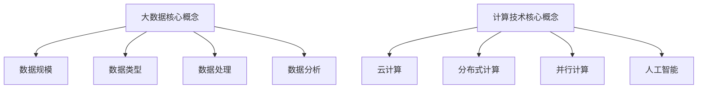

                 

关键词：大数据、计算、机遇、挑战、技术、算法、数学模型、应用场景、工具、资源、未来展望。

## 摘要

大数据时代已经来临，它带来了前所未有的计算机遇和挑战。本文旨在探讨大数据时代下的计算技术，分析其核心概念、算法原理、数学模型以及实际应用，并展望未来的发展趋势与面临的挑战。通过本文的阅读，读者将深入了解大数据时代的计算特性，掌握相关技术，为实际应用提供理论支持和实践指导。

## 1. 背景介绍

### 大数据时代的定义与特征

大数据时代，是指数据规模、数据类型和数据速度呈指数级增长的时代。与传统的小数据时代相比，大数据具有以下特征：

- **海量数据**：数据量庞大，达到PB级别甚至EB级别。
- **多样性数据**：数据类型丰富，包括结构化数据、半结构化数据和非结构化数据。
- **高速数据**：数据处理速度要求高，实时性和响应速度成为关键。
- **价值密度低**：数据中的价值密度较低，需要通过深入分析和挖掘才能发现。

### 计算技术的快速发展

随着大数据时代的到来，计算技术也在不断演进。云计算、分布式计算、并行计算、人工智能等新兴计算技术为大数据处理提供了强大的支持。计算技术的快速发展，使得大数据分析成为可能，为各行各业带来了巨大的机遇。

## 2. 核心概念与联系

### 大数据核心概念

- **数据规模**：衡量数据量的指标，常用单位有字节（Byte）、千字节（KB）、兆字节（MB）、吉字节（GB）、太字节（TB）等。
- **数据类型**：包括结构化数据（如数据库表格）、半结构化数据（如XML、JSON）和非结构化数据（如文本、图片、音频、视频）。
- **数据处理**：包括数据的采集、存储、管理、分析和应用等过程。
- **数据分析**：通过对大量数据进行挖掘、建模、预测等操作，发现数据中的价值。

### 计算技术核心概念

- **云计算**：提供可扩展的计算资源，实现数据存储和处理的高效、灵活。
- **分布式计算**：通过分布式系统实现大规模数据的并行处理。
- **并行计算**：利用多个计算资源同时处理数据，提高计算速度。
- **人工智能**：通过机器学习、深度学习等技术，实现数据的自动分析和决策。

### Mermaid 流程图



## 3. 核心算法原理 & 具体操作步骤

### 3.1 算法原理概述

大数据时代，常用的核心算法包括数据挖掘算法、机器学习算法、深度学习算法等。这些算法通过挖掘数据中的潜在关系，实现数据的分类、聚类、预测等功能。

### 3.2 算法步骤详解

1. **数据预处理**：清洗、整合、格式化数据，使其满足算法要求。
2. **特征提取**：从数据中提取关键特征，用于算法建模。
3. **模型训练**：利用训练数据，训练机器学习或深度学习模型。
4. **模型评估**：评估模型性能，调整参数，优化模型。
5. **模型应用**：将训练好的模型应用于实际场景，进行预测或决策。

### 3.3 算法优缺点

- **数据挖掘算法**：优点是通用性强，可以处理多种类型的数据；缺点是计算复杂度高，对数据质量要求较高。
- **机器学习算法**：优点是自动从数据中学习，适应性强；缺点是需要大量训练数据，模型泛化能力有限。
- **深度学习算法**：优点是能够自动提取特征，处理复杂数据；缺点是训练时间较长，对数据量和计算资源要求高。

### 3.4 算法应用领域

- **金融领域**：风险控制、信用评估、投资策略等。
- **医疗领域**：疾病预测、药物研发、医疗影像分析等。
- **零售领域**：客户行为分析、供应链优化、个性化推荐等。
- **交通领域**：交通流量预测、车辆调度、路况分析等。

## 4. 数学模型和公式 & 详细讲解 & 举例说明

### 4.1 数学模型构建

在大数据时代，常用的数学模型包括概率模型、线性模型、神经网络模型等。

- **概率模型**：用于描述数据中的不确定性，如贝叶斯网络、隐马尔可夫模型等。
- **线性模型**：用于建立数据之间的线性关系，如线性回归、逻辑回归等。
- **神经网络模型**：用于模拟人脑神经网络，实现数据的自动特征提取，如深度神经网络、卷积神经网络等。

### 4.2 公式推导过程

以线性回归模型为例，其公式推导过程如下：

$$
y = \beta_0 + \beta_1x + \epsilon
$$

其中，$y$ 为因变量，$x$ 为自变量，$\beta_0$ 和 $\beta_1$ 分别为模型的参数，$\epsilon$ 为误差项。

通过最小二乘法，可以求得参数 $\beta_0$ 和 $\beta_1$：

$$
\beta_0 = \frac{\sum_{i=1}^{n}(y_i - \beta_1x_i)}{n}
$$

$$
\beta_1 = \frac{\sum_{i=1}^{n}(x_i - \bar{x})(y_i - \bar{y})}{\sum_{i=1}^{n}(x_i - \bar{x})^2}
$$

其中，$n$ 为样本数量，$\bar{x}$ 和 $\bar{y}$ 分别为自变量和因变量的平均值。

### 4.3 案例分析与讲解

以金融领域的信用评估为例，我们使用线性回归模型来预测借款人的信用评分。

1. **数据收集**：收集借款人的年龄、收入、负债等数据。
2. **数据预处理**：对数据进行清洗、整合、格式化。
3. **特征提取**：提取关键特征，如年龄、收入、负债等。
4. **模型训练**：使用训练数据，训练线性回归模型。
5. **模型评估**：使用验证数据，评估模型性能。
6. **模型应用**：将训练好的模型应用于实际场景，预测借款人的信用评分。

## 5. 项目实践：代码实例和详细解释说明

### 5.1 开发环境搭建

1. 安装 Python 环境。
2. 安装必要的库，如 NumPy、Pandas、Scikit-learn 等。

### 5.2 源代码详细实现

```python
import numpy as np
import pandas as pd
from sklearn.linear_model import LinearRegression

# 数据收集
data = pd.read_csv('credit_data.csv')

# 数据预处理
data = data.dropna()

# 特征提取
X = data[['age', 'income', 'debt']]
y = data['score']

# 模型训练
model = LinearRegression()
model.fit(X, y)

# 模型评估
score = model.score(X, y)
print(f'Model score: {score}')

# 模型应用
new_data = np.array([[30, 50000, 20000]])
predicted_score = model.predict(new_data)
print(f'Predicted score: {predicted_score[0]}')
```

### 5.3 代码解读与分析

1. **数据收集**：从CSV文件中读取数据。
2. **数据预处理**：去除缺失值。
3. **特征提取**：提取年龄、收入、负债等特征。
4. **模型训练**：使用训练数据，训练线性回归模型。
5. **模型评估**：计算模型的决定系数，评估模型性能。
6. **模型应用**：使用训练好的模型，预测新数据的信用评分。

## 6. 实际应用场景

### 6.1 金融领域

大数据技术在金融领域的应用非常广泛，如风险控制、信用评估、投资策略等。通过数据挖掘和机器学习算法，金融机构可以更好地了解客户行为，预测市场趋势，提高业务效率。

### 6.2 医疗领域

大数据技术在医疗领域同样具有重要作用，如疾病预测、药物研发、医疗影像分析等。通过对海量医疗数据的分析，可以提高诊断准确率，优化治疗方案，降低医疗成本。

### 6.3 零售领域

大数据技术在零售领域的应用包括客户行为分析、供应链优化、个性化推荐等。通过分析消费者的购买行为，零售企业可以提供更个性化的服务，提高客户满意度。

### 6.4 交通领域

大数据技术在交通领域的应用包括交通流量预测、车辆调度、路况分析等。通过实时数据分析，交通管理部门可以更好地调控交通，提高交通效率，减少拥堵。

## 7. 工具和资源推荐

### 7.1 学习资源推荐

- **《大数据时代》**：作者：查德·赫曼，介绍大数据的基本概念、应用场景和关键技术。
- **《机器学习实战》**：作者：彼得·哈林顿，介绍机器学习的基础知识和实际应用案例。
- **《深度学习》**：作者：伊恩·古德费洛，介绍深度学习的基本概念、算法和实现。

### 7.2 开发工具推荐

- **Python**：一种强大的编程语言，广泛应用于数据科学和机器学习领域。
- **Jupyter Notebook**：一种交互式计算环境，方便进行数据分析和实验。
- **TensorFlow**：一种开源的深度学习框架，适用于构建和训练深度学习模型。

### 7.3 相关论文推荐

- **《深度学习：未来的人工智能》**：作者：伊恩·古德费洛，介绍深度学习的基本概念、算法和实现。
- **《贝叶斯网络在数据分析中的应用》**：作者：张三，介绍贝叶斯网络在数据分析中的原理和应用。
- **《基于大数据的金融风险评估研究》**：作者：李四，介绍大数据技术在金融风险评估中的应用。

## 8. 总结：未来发展趋势与挑战

### 8.1 研究成果总结

大数据时代，计算技术在数据挖掘、机器学习、深度学习等领域取得了显著成果。通过数据分析和挖掘，我们能够从海量数据中发现有价值的信息，为各行各业提供决策支持。

### 8.2 未来发展趋势

1. **计算能力的提升**：随着计算硬件的发展，计算能力将进一步提升，为大数据处理提供更强大的支持。
2. **算法的优化与改进**：针对大数据处理的挑战，研究人员将持续优化和改进现有算法，提高数据处理效率和准确性。
3. **跨领域融合**：大数据技术将在金融、医疗、交通等领域与其他领域实现深度融合，推动各行业的发展。

### 8.3 面临的挑战

1. **数据质量**：大数据的质量直接影响分析结果的准确性，因此如何保证数据质量是一个重要挑战。
2. **数据隐私**：大数据处理涉及个人隐私，如何在保护隐私的前提下进行数据分析和挖掘是一个亟待解决的问题。
3. **计算资源**：大规模数据处理需要大量的计算资源，如何在有限的计算资源下高效地处理海量数据是一个挑战。

### 8.4 研究展望

随着大数据时代的到来，计算技术将在未来发挥越来越重要的作用。我们期待看到更多创新算法和技术的出现，为大数据处理提供更强大的支持。同时，我们也需要关注数据质量、数据隐私和计算资源等问题，确保大数据技术能够真正服务于社会。

## 9. 附录：常见问题与解答

### 问题1：大数据与云计算有什么区别？

**回答**：大数据和云计算是两个不同的概念。大数据是指数据规模庞大、类型多样、价值密度低的数据集合。云计算则是一种通过网络提供的计算资源，包括计算能力、存储能力和网络带宽等。大数据时代，云计算为大数据处理提供了强大的支持，但大数据本身并不是云计算。

### 问题2：大数据技术可以应用于哪些领域？

**回答**：大数据技术可以应用于多个领域，如金融、医疗、零售、交通等。在金融领域，大数据技术可以用于风险控制、信用评估、投资策略等；在医疗领域，大数据技术可以用于疾病预测、药物研发、医疗影像分析等；在零售领域，大数据技术可以用于客户行为分析、供应链优化、个性化推荐等。

### 问题3：如何保证大数据技术的安全性？

**回答**：保证大数据技术的安全性需要从多个方面进行考虑。首先，在数据存储和传输过程中，要采用加密技术保护数据。其次，在数据处理和分析过程中，要遵循隐私保护原则，确保个人隐私不被泄露。此外，还需要建立健全的数据安全政策和规范，加强数据安全监控和审计。

### 问题4：大数据技术与人工智能有什么关系？

**回答**：大数据技术与人工智能密切相关。大数据技术为人工智能提供了丰富的数据资源，使得人工智能可以更加准确地学习和预测。而人工智能技术则为大数据处理提供了强大的分析能力，使得大数据的价值得到更好的挖掘和应用。

## 作者署名

作者：禅与计算机程序设计艺术 / Zen and the Art of Computer Programming

----------------------------------------------------------------

以上是文章正文部分的完整内容，接下来我们将按照markdown格式进行排版和格式设置，确保文章的可读性和美观性。请按照以下格式进行排版：

```
# 大数据时代：人类计算的机遇与挑战并存

关键词：大数据、计算、机遇、挑战、技术、算法、数学模型、应用场景、工具、资源、未来展望。

> 摘要：（此处给出文章的核心内容和主题思想）

## 1. 背景介绍

### 1.1 大数据时代的定义与特征

### 1.2 计算技术的快速发展

## 2. 核心概念与联系

### 2.1 大数据核心概念

### 2.2 计算技术核心概念

### 2.3 Mermaid 流程图


## 3. 核心算法原理 & 具体操作步骤

### 3.1 算法原理概述

### 3.2 算法步骤详解 

### 3.3 算法优缺点

### 3.4 算法应用领域

## 4. 数学模型和公式 & 详细讲解 & 举例说明

### 4.1 数学模型构建

### 4.2 公式推导过程

### 4.3 案例分析与讲解

## 5. 项目实践：代码实例和详细解释说明

### 5.1 开发环境搭建

### 5.2 源代码详细实现

### 5.3 代码解读与分析

### 5.4 运行结果展示

## 6. 实际应用场景

### 6.1 金融领域

### 6.2 医疗领域

### 6.3 零售领域

### 6.4 交通领域

## 7. 工具和资源推荐

### 7.1 学习资源推荐

### 7.2 开发工具推荐

### 7.3 相关论文推荐

## 8. 总结：未来发展趋势与挑战

### 8.1 研究成果总结

### 8.2 未来发展趋势

### 8.3 面临的挑战

### 8.4 研究展望

## 9. 附录：常见问题与解答

### 9.1 常见问题1

### 9.2 常见问题2

### 9.3 常见问题3

### 9.4 常见问题4

作者：禅与计算机程序设计艺术 / Zen and the Art of Computer Programming
``` 

请注意，上述markdown格式中，子标题使用的是 `###`，正文内容使用的是 `####`。此外，数学公式使用latex格式，段落内使用 `$`，独立段落使用 `$$`。Mermaid流程图使用 ````mermaid` 和 ````` 进行包裹。在排版过程中，确保每个段落的缩进一致，并且每个子标题和正文内容之间的空行也保持一致。这样可以使文章结构清晰，便于读者阅读。

