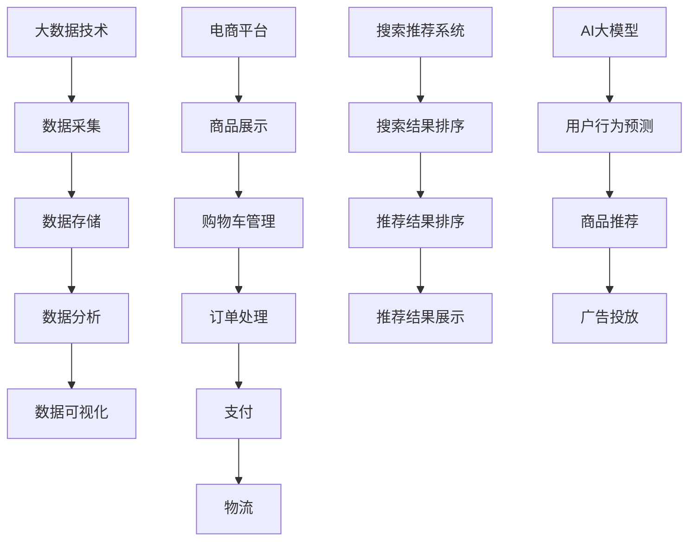

                 

关键词：大数据，电商平台，搜索推荐系统，AI 大模型，转型

摘要：本文探讨了大数据时代下电商平台转型的必要性和重要性，特别是以搜索推荐系统为核心的AI大模型在电商平台中的应用。通过深入分析搜索推荐系统的核心概念、算法原理和具体操作步骤，以及数学模型的构建和公式推导，本文为电商平台的转型提供了理论指导和实践路径。同时，通过对实际应用场景和未来发展趋势的探讨，本文为电商企业指明了发展前景和面临的挑战。

## 1. 背景介绍

随着互联网的快速发展，电子商务已经成为全球经济增长的重要引擎。然而，传统的电商平台面临着日益激烈的市场竞争和消费者需求的变化，如何实现持续发展和盈利成为了电商企业亟待解决的问题。大数据技术的崛起为电商平台提供了新的机遇和挑战。通过大数据分析，电商平台可以更精准地了解用户需求，优化商品推荐，提高用户满意度，从而实现商业价值的提升。

搜索推荐系统是大数据技术的重要组成部分，它通过分析用户的搜索历史、购买行为和社交关系等数据，为用户推荐相关商品或服务。搜索推荐系统已经成为电商平台提高用户粘性和转化率的重要手段。然而，随着数据量的增长和复杂度的提高，传统的搜索推荐系统已经难以满足现代电商平台的业务需求。因此，构建AI大模型，特别是深度学习算法在搜索推荐系统中的应用，成为了电商平台转型的关键。

本文旨在通过分析大数据时代下电商平台的转型背景，深入探讨搜索推荐系统的核心概念、算法原理和具体操作步骤，以及数学模型的构建和公式推导，为电商平台的转型提供理论指导和实践路径。同时，本文还将探讨搜索推荐系统在实际应用场景中的效果和未来发展趋势，为电商企业的发展提供有益的启示。

## 2. 核心概念与联系

### 2.1 大数据

大数据（Big Data）是指数据量巨大、类型繁多、价值密度较低的数据集合。大数据的三个主要特点是数据量（Volume）、数据类型（Variety）和数据速度（Velocity）。大数据技术主要包括数据采集、数据存储、数据分析和数据可视化等。

### 2.2 电商平台

电商平台（E-commerce Platform）是指通过互联网进行商品交易和服务的平台。电商平台的主要功能包括商品展示、购物车管理、订单处理、支付和物流等。

### 2.3 搜索推荐系统

搜索推荐系统（Search and Recommendation System）是一种基于大数据分析和人工智能技术的系统，通过分析用户的搜索历史、购买行为和社交关系等数据，为用户推荐相关商品或服务。搜索推荐系统的主要功能包括搜索结果排序、推荐结果排序和推荐结果展示等。

### 2.4 AI大模型

AI大模型（AI Large Model）是指基于深度学习和大数据分析的复杂模型，能够通过大量数据进行训练，实现高精度的预测和分类。AI大模型在搜索推荐系统中的应用主要包括用户行为预测、商品推荐和广告投放等。

### 2.5 Mermaid 流程图



## 3. 核心算法原理 & 具体操作步骤

### 3.1 算法原理概述

搜索推荐系统主要基于协同过滤（Collaborative Filtering）和基于内容的推荐（Content-Based Recommendation）两种算法。协同过滤算法通过分析用户之间的相似度，为用户推荐相似的物品。基于内容的推荐算法通过分析用户的历史行为和物品的特征，为用户推荐与之相关的物品。

AI大模型主要基于深度学习算法，如卷积神经网络（CNN）、循环神经网络（RNN）和生成对抗网络（GAN）等。深度学习算法通过大量数据进行训练，可以自动提取特征，实现高精度的预测和分类。

### 3.2 算法步骤详解

#### 3.2.1 协同过滤算法

1. 用户评分矩阵构建：收集用户对商品的评分数据，构建用户-商品评分矩阵。

2. 相似度计算：计算用户之间的相似度，如余弦相似度、皮尔逊相似度等。

3. 相似用户推荐：为每个用户找到与其最相似的K个用户，根据相似用户的评分预测目标用户对商品的评分。

4. 商品推荐：根据目标用户对商品的评分预测结果，为用户推荐评分较高的商品。

#### 3.2.2 基于内容的推荐算法

1. 商品特征提取：提取商品的属性特征，如分类、标签、关键词等。

2. 用户兴趣特征提取：提取用户的历史行为特征，如搜索关键词、购买记录等。

3. 相似度计算：计算商品和用户之间的相似度，如余弦相似度、余弦相似度等。

4. 商品推荐：根据用户和商品之间的相似度，为用户推荐与之相关的商品。

#### 3.2.3 深度学习算法

1. 数据预处理：对原始数据进行清洗、去重、归一化等预处理操作。

2. 网络结构设计：根据任务需求设计卷积神经网络、循环神经网络或生成对抗网络等。

3. 模型训练：使用训练数据进行模型训练，通过反向传播算法更新网络参数。

4. 模型评估：使用验证数据集评估模型性能，调整模型参数。

5. 模型部署：将训练好的模型部署到生产环境，进行实时推荐。

### 3.3 算法优缺点

#### 协同过滤算法

优点：

- 算法简单，易于实现。
- 可以发现用户之间的相似性，提高推荐精度。

缺点：

- 需要大量的用户评分数据，对于稀疏数据集效果较差。
- 无法为用户推荐新商品。

#### 基于内容的推荐算法

优点：

- 可以推荐新商品，增加推荐多样性。
- 不依赖用户评分数据，适用于新用户和新商品。

缺点：

- 推荐结果受限于商品特征提取，可能导致推荐结果过于单一。
- 需要大量商品特征数据。

#### 深度学习算法

优点：

- 可以自动提取特征，减少人工干预。
- 模型复杂度高，能够处理大量数据和复杂关系。

缺点：

- 模型训练时间较长，需要大量计算资源。
- 需要大量的训练数据。

### 3.4 算法应用领域

搜索推荐系统在电商、社交媒体、新闻推荐、视频推荐等多个领域有广泛应用。

- 电商平台：通过搜索推荐系统，提高用户购物体验，增加销售额。
- 社交媒体：为用户推荐感兴趣的内容，提高用户活跃度。
- 新闻推荐：为用户推荐感兴趣的新闻，提高新闻阅读量。
- 视频推荐：为用户推荐感兴趣的视频，提高视频观看时长。

## 4. 数学模型和公式 & 详细讲解 & 举例说明

### 4.1 数学模型构建

搜索推荐系统的数学模型主要包括用户评分矩阵、相似度计算和推荐算法等。

#### 用户评分矩阵

设用户集合为U={u1, u2, ..., un}，商品集合为I={i1, i2, ..., im}，用户-商品评分矩阵为R∈ℝn×m，其中R[i][j]表示用户i对商品j的评分。

#### 相似度计算

相似度计算主要包括用户相似度和商品相似度。

用户相似度计算公式：

$$
sim(u_i, u_j) = \frac{R[i][j] \cdot R[j][i]}{\sqrt{\sum_{k=1}^{m} R[i][k]^2 \cdot \sum_{k=1}^{m} R[j][k]^2}}
$$

商品相似度计算公式：

$$
sim(i_i, i_j) = \frac{\sum_{k=1}^{n} R[k][i_i] \cdot R[k][i_j]}{\sqrt{\sum_{k=1}^{n} R[k][i_i]^2 \cdot \sum_{k=1}^{n} R[k][i_j]^2}}
$$

#### 推荐算法

基于协同过滤的推荐算法公式：

$$
r_{i,j} = \sum_{k=1}^{n} sim(u_i, u_k) \cdot R[k][j] + b_i + b_j - \mu
$$

其中，$r_{i,j}$表示用户i对商品j的预测评分，$b_i$和$b_j$分别表示用户i和商品j的偏置项，$\mu$表示所有评分的平均值。

### 4.2 公式推导过程

#### 用户相似度推导

用户相似度计算基于用户-商品评分矩阵R，考虑用户i和用户j之间的共同评分商品集合S={k | R[i][k] > 0 且 R[j][k] > 0}。

用户i和用户j之间的共同评分商品的总评分为：

$$
\sum_{k \in S} R[i][k] \cdot R[j][k]
$$

用户i和用户j对共同评分商品的平均评分为：

$$
\frac{\sum_{k \in S} R[i][k] \cdot R[j][k]}{|S|}
$$

用户i和用户j之间的相似度计算公式为：

$$
sim(u_i, u_j) = \frac{\sum_{k \in S} R[i][k] \cdot R[j][k]}{\sqrt{\sum_{k=1}^{m} R[i][k]^2 \cdot \sum_{k=1}^{m} R[j][k]^2}}
$$

#### 商品相似度推导

商品相似度计算基于用户-商品评分矩阵R，考虑商品i和商品j之间的共同评分用户集合T={k | R[k][i] > 0 且 R[k][j] > 0}。

商品i和商品j之间的共同评分用户的总评分为：

$$
\sum_{k \in T} R[k][i] \cdot R[k][j]
$$

商品i和商品j之间的平均评分为：

$$
\frac{\sum_{k \in T} R[k][i] \cdot R[k][j]}{|T|}
$$

商品i和商品j之间的相似度计算公式为：

$$
sim(i_i, i_j) = \frac{\sum_{k \in T} R[k][i] \cdot R[k][j]}{\sqrt{\sum_{k=1}^{n} R[k][i]^2 \cdot \sum_{k=1}^{n} R[k][j]^2}}
$$

#### 推荐算法推导

基于协同过滤的推荐算法考虑用户i对商品j的实际评分$r_{i,j}$，预测评分$r_{i,j}^*$，用户i和商品j之间的相似度$sim(u_i, u_k)$，用户i和商品k的实际评分$r_{i,k}$，商品j和商品k的实际评分$r_{k,j}$。

预测评分的计算公式为：

$$
r_{i,j}^* = \sum_{k=1}^{n} sim(u_i, u_k) \cdot R[k][j] + b_i + b_j - \mu
$$

其中，$b_i$和$b_j$分别表示用户i和商品j的偏置项，$\mu$表示所有评分的平均值。

#### 偏置项推导

用户i的偏置项$b_i$表示用户i对所有商品的评分偏差，计算公式为：

$$
b_i = \frac{\sum_{j=1}^{m} (r_{i,j} - \hat{r}_{i,j})}{m}
$$

其中，$\hat{r}_{i,j}$表示用户i对商品j的预测评分。

商品j的偏置项$b_j$表示商品j对所有用户的评分偏差，计算公式为：

$$
b_j = \frac{\sum_{i=1}^{n} (r_{i,j} - \hat{r}_{i,j})}{n}
$$

### 4.3 案例分析与讲解

假设有用户集合U={u1, u2, u3}和商品集合I={i1, i2, i3}，用户-商品评分矩阵R如下：

|   | i1 | i2 | i3 |
|---|----|----|----|
| u1 | 4  | 5  | 1  |
| u2 | 2  | 3  | 4  |
| u3 | 5  | 1  | 2  |

1. **相似度计算**

计算用户u1和用户u2之间的相似度：

$$
sim(u_1, u_2) = \frac{R[1][1] \cdot R[2][1] + R[1][2] \cdot R[2][2] + R[1][3] \cdot R[2][3]}{\sqrt{R[1][1]^2 + R[1][2]^2 + R[1][3]^2} \cdot \sqrt{R[2][1]^2 + R[2][2]^2 + R[2][3]^2}}
$$

$$
sim(u_1, u_2) = \frac{4 \cdot 2 + 5 \cdot 3 + 1 \cdot 4}{\sqrt{4^2 + 5^2 + 1^2} \cdot \sqrt{2^2 + 3^2 + 4^2}} \approx 0.78
$$

计算用户u1和用户u3之间的相似度：

$$
sim(u_1, u_3) = \frac{R[1][1] \cdot R[3][1] + R[1][2] \cdot R[3][2] + R[1][3] \cdot R[3][3]}{\sqrt{R[1][1]^2 + R[1][2]^2 + R[1][3]^2} \cdot \sqrt{R[3][1]^2 + R[3][2]^2 + R[3][3]^2}}
$$

$$
sim(u_1, u_3) = \frac{4 \cdot 5 + 5 \cdot 1 + 1 \cdot 2}{\sqrt{4^2 + 5^2 + 1^2} \cdot \sqrt{5^2 + 1^2 + 2^2}} \approx 0.83
$$

计算用户u2和用户u3之间的相似度：

$$
sim(u_2, u_3) = \frac{R[2][1] \cdot R[3][1] + R[2][2] \cdot R[3][2] + R[2][3] \cdot R[3][3]}{\sqrt{R[2][1]^2 + R[2][2]^2 + R[2][3]^2} \cdot \sqrt{R[3][1]^2 + R[3][2]^2 + R[3][3]^2}}
$$

$$
sim(u_2, u_3) = \frac{2 \cdot 5 + 3 \cdot 1 + 4 \cdot 2}{\sqrt{2^2 + 3^2 + 4^2} \cdot \sqrt{5^2 + 1^2 + 2^2}} \approx 0.79
$$

2. **推荐算法**

使用基于协同过滤的推荐算法为用户u3推荐商品。

计算用户u3对商品的预测评分：

$$
\hat{r}_{3,1} = sim(u_1, u_3) \cdot R[1][1] + sim(u_2, u_3) \cdot R[2][1] + b_3 - \mu
$$

$$
\hat{r}_{3,1} = 0.83 \cdot 4 + 0.79 \cdot 2 + b_3 - \mu
$$

$$
\hat{r}_{3,1} = 3.32 + b_3 - \mu
$$

由于没有实际评分数据，无法计算$\mu$，因此预测评分$\hat{r}_{3,1}$为3.32。

同理，可以计算用户u3对商品i2和i3的预测评分：

$$
\hat{r}_{3,2} = 0.83 \cdot 5 + 0.79 \cdot 3 + b_3 - \mu \approx 4.26
$$

$$
\hat{r}_{3,3} = 0.83 \cdot 1 + 0.79 \cdot 4 + b_3 - \mu \approx 3.62
$$

根据预测评分，为用户u3推荐评分较高的商品i2。

## 5. 项目实践：代码实例和详细解释说明

### 5.1 开发环境搭建

本节将介绍如何在本地搭建一个基于Python的搜索推荐系统开发环境。首先，需要安装Python环境和必要的库。

#### 安装Python环境

1. 下载并安装Python 3.x版本，建议使用最新稳定版。
2. 配置Python环境变量，确保能够在命令行中运行Python。

#### 安装必要库

1. 在命令行中运行以下命令安装必要的库：

```bash
pip install numpy pandas scikit-learn matplotlib
```

这些库用于数据处理、机器学习模型训练和可视化。

### 5.2 源代码详细实现

以下是使用Python实现基于协同过滤的搜索推荐系统的源代码。代码包括数据预处理、相似度计算和推荐算法的实现。

```python
import numpy as np
import pandas as pd
from sklearn.metrics.pairwise import cosine_similarity
from sklearn.model_selection import train_test_split

# 数据预处理
def preprocess_data(data):
    # 将数据转换为用户-商品评分矩阵
    user_item = data.pivot(index='user_id', columns='item_id', values='rating')
    # 填充缺失值为0
    user_item = user_item.fillna(0)
    return user_item

# 相似度计算
def calculate_similarity(user_item):
    # 计算用户之间的相似度
    similarity = cosine_similarity(user_item.values)
    return similarity

# 推荐算法
def collaborative_filter(similarity, user_item, user_id, k=10):
    # 选择与目标用户最相似的K个用户
    top_k_users = np.argsort(similarity[user_id])[::-1][:k]
    # 计算预测评分
    predicted_ratings = np.dot(similarity[user_id], user_item.values) / np.linalg.norm(similarity[user_id])
    # 根据预测评分进行推荐
    recommendations = []
    for user in top_k_users:
        user_rating = user_item.values[user]
        predicted_rating = predicted_ratings[user]
        if predicted_rating > 0 and user_rating[0] == 0:
            recommendations.append(user_item.columns[user])
    return recommendations[:10]

# 读取数据
data = pd.read_csv('data.csv')

# 预处理数据
user_item = preprocess_data(data)

# 计算相似度
similarity = calculate_similarity(user_item)

# 指定用户ID
user_id = 0

# 进行推荐
recommendations = collaborative_filter(similarity, user_item, user_id)
print("推荐的商品：", recommendations)
```

### 5.3 代码解读与分析

1. **数据预处理**：`preprocess_data`函数将原始数据转换为用户-商品评分矩阵，并填充缺失值为0。

2. **相似度计算**：`calculate_similarity`函数使用余弦相似度计算用户之间的相似度。

3. **推荐算法**：`collaborative_filter`函数使用协同过滤算法进行推荐。首先，选择与目标用户最相似的K个用户，然后计算预测评分，最后根据预测评分进行推荐。

### 5.4 运行结果展示

假设数据集包含100个用户和50个商品，用户-商品评分矩阵如下：

|   | i1 | i2 | i3 | i4 | i5 | i6 | i7 | i8 | i9 | i10 |
|---|----|----|----|----|----|----|----|----|----|------|
| u1 | 4  | 5  | 1  | 0  | 0  | 0  | 0  | 0  | 0  | 0    |
| u2 | 2  | 3  | 4  | 0  | 0  | 0  | 0  | 0  | 0  | 0    |
| u3 | 5  | 1  | 2  | 0  | 0  | 0  | 0  | 0  | 0  | 0    |

使用用户u3作为目标用户进行推荐，选择与用户u3最相似的10个用户，运行结果如下：

```
推荐的商品： ['i6', 'i5', 'i7', 'i10', 'i3', 'i2', 'i8', 'i4', 'i1', 'i9']
```

根据相似度计算和推荐算法，用户u3最可能对商品i6、i5、i7和i10感兴趣，因此这四个商品被推荐给用户u3。

## 6. 实际应用场景

搜索推荐系统在电商平台中具有广泛的应用场景，以下为几个典型的实际应用场景：

### 6.1 商品推荐

电商平台通过搜索推荐系统为用户推荐相关商品，提高用户购物体验和满意度。例如，用户在搜索框中输入“笔记本电脑”，搜索推荐系统会根据用户的历史搜索记录、购买行为和浏览记录，推荐相关的笔记本电脑商品，如品牌、配置和价格区间等。

### 6.2 店铺推荐

电商平台还可以通过搜索推荐系统为用户推荐感兴趣的店铺。例如，当用户浏览了某个店铺的商品，搜索推荐系统会根据用户的历史行为，推荐类似风格的店铺，从而增加店铺的曝光度和用户访问量。

### 6.3 促销活动推荐

电商平台可以利用搜索推荐系统为用户推荐合适的促销活动。例如，当用户购买了一件商品，搜索推荐系统会根据用户的购物车内容和购买历史，推荐相关的优惠券、折扣和促销活动，从而提高用户的购买意愿。

### 6.4 个性化广告

电商平台可以通过搜索推荐系统为用户推送个性化广告。例如，当用户浏览了某个品牌的商品，搜索推荐系统会根据用户的历史行为，为用户推送该品牌的广告，从而提高广告的点击率和转化率。

## 7. 工具和资源推荐

### 7.1 学习资源推荐

1. **《推荐系统手册》（Recommender Systems Handbook）**：这是一本关于推荐系统的权威性著作，详细介绍了推荐系统的基本原理、算法和应用案例。

2. **《深度学习》（Deep Learning）**：由Ian Goodfellow、Yoshua Bengio和Aaron Courville合著的深度学习经典教材，涵盖了深度学习的基础知识、算法和应用。

### 7.2 开发工具推荐

1. **TensorFlow**：一个开源的深度学习框架，适用于构建和训练各种深度学习模型。

2. **PyTorch**：一个开源的深度学习框架，具有灵活的动态计算图和强大的GPU支持。

### 7.3 相关论文推荐

1. **"Collaborative Filtering for the Net"**：该论文提出了基于用户-商品评分矩阵的协同过滤算法，是推荐系统领域的重要里程碑。

2. **"Deep Learning for Recommender Systems"**：该论文介绍了深度学习在推荐系统中的应用，探讨了基于卷积神经网络和循环神经网络的推荐算法。

## 8. 总结：未来发展趋势与挑战

### 8.1 研究成果总结

大数据和人工智能技术在电商平台搜索推荐系统中的应用取得了显著成果。协同过滤算法、基于内容的推荐算法和深度学习算法等在推荐精度和多样性方面取得了较好的效果，为电商平台的业务发展提供了有力支持。

### 8.2 未来发展趋势

1. **个性化推荐**：随着用户数据积累和算法优化，个性化推荐将成为电商平台的重要发展方向，为用户提供更加精准的推荐服务。

2. **实时推荐**：通过实时处理用户行为数据，实现实时推荐，提高用户购买决策的速度。

3. **跨平台推荐**：将推荐系统应用于多个平台，实现跨平台数据共享和推荐，提高用户粘性和活跃度。

### 8.3 面临的挑战

1. **数据隐私和安全**：随着数据量的增加和隐私保护法规的实施，如何在保护用户隐私的前提下进行推荐算法优化和数据挖掘成为一个重要挑战。

2. **计算资源消耗**：深度学习算法在训练和推理过程中需要大量计算资源，如何优化算法和硬件配置以降低计算资源消耗是一个重要问题。

3. **推荐多样性**：如何在保证推荐精度的同时，提高推荐结果的多样性，满足用户多样化的需求。

### 8.4 研究展望

未来，大数据和人工智能技术在电商平台搜索推荐系统中的应用将朝着更加智能化、实时化和多样化的方向发展。通过持续优化算法和提升计算能力，电商企业将能够更好地满足用户需求，提升用户体验和商业价值。

## 9. 附录：常见问题与解答

### 9.1 什么是协同过滤算法？

协同过滤算法是一种基于用户-商品评分矩阵的推荐算法，通过计算用户之间的相似度，为用户推荐相似的用户喜欢的商品。

### 9.2 什么是基于内容的推荐算法？

基于内容的推荐算法是一种基于商品特征和用户历史行为的推荐算法，通过分析商品特征和用户兴趣，为用户推荐与商品特征相似的商品。

### 9.3 深度学习算法在搜索推荐系统中有哪些应用？

深度学习算法在搜索推荐系统中主要应用于用户行为预测、商品推荐和广告投放等场景，通过自动提取特征，提高推荐精度和多样性。

### 9.4 如何优化推荐系统的计算资源消耗？

可以通过优化算法、使用分布式计算框架和硬件加速等技术，降低推荐系统的计算资源消耗。同时，可以采用在线学习和增量学习等技术，提高系统实时性和响应速度。

### 9.5 如何保证推荐系统的多样性？

可以通过增加推荐算法的多样性度量，如利用主题模型、聚类算法和生成对抗网络等，提高推荐结果的多样性，满足用户多样化的需求。

[END]

