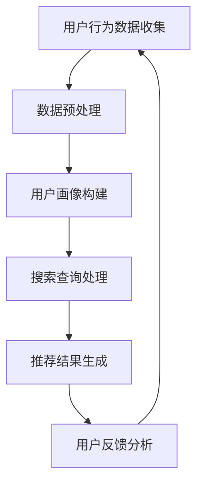

                 

关键词：大数据、电商平台、搜索推荐系统、AI 模型、融合技术、电商转型

> 摘要：在当前数字经济发展的背景下，电商平台正面临前所未有的机遇和挑战。大数据和人工智能技术的广泛应用，为电商平台转型提供了强有力的支持。本文将探讨如何通过构建高效的搜索推荐系统，以及融合AI模型技术，实现电商平台的核心竞争力提升，并展望其未来发展。

## 1. 背景介绍

随着互联网技术的飞速发展和移动设备的普及，电子商务已经成为现代商业的重要驱动力。然而，传统电商平台的运营模式面临着同质化严重、用户体验不佳等问题。为了在激烈的市场竞争中脱颖而出，电商平台需要进行数字化转型，提升用户体验，优化运营效率，实现业务创新。

大数据技术为电商平台提供了丰富的数据资源，通过对用户行为、交易数据、内容数据等进行深入挖掘和分析，可以实现对用户需求的精准把握，从而提供个性化的推荐服务。而人工智能（AI）技术的快速发展，则为大数据分析提供了强大的工具，使得电商平台能够更好地理解和预测用户行为，实现智能化运营。

在这样一个背景下，本文旨在探讨如何利用大数据和AI技术，构建高效的搜索推荐系统，帮助电商平台实现从传统模式向智能化、个性化的转型。

## 2. 核心概念与联系

### 2.1 大数据

大数据是指数据量巨大、数据类型多样、数据生成速度极快的数据集合。在电商领域，大数据不仅包括用户交易数据、内容数据，还包括社交数据、地理位置数据等。这些数据通过大数据技术进行处理和分析，可以为电商平台提供深入的洞见。

### 2.2 搜索推荐系统

搜索推荐系统是电商平台的核心功能之一。通过分析用户的历史行为、搜索记录、偏好等数据，搜索推荐系统可以提供个性化的商品推荐，帮助用户快速找到所需的商品，提升购物体验。

### 2.3 AI 模型

AI模型是人工智能的核心技术之一，包括机器学习、深度学习、自然语言处理等。在电商平台中，AI模型可以用于用户行为预测、个性化推荐、内容挖掘等方面，实现智能化运营。

### 2.4 Mermaid 流程图

Mermaid 是一种基于Markdown的图形描述语言，可以方便地绘制流程图、UML图等。以下是一个简化的电商平台搜索推荐系统的流程图：



## 3. 核心算法原理 & 具体操作步骤

### 3.1 算法原理概述

电商平台搜索推荐系统主要基于协同过滤、基于内容的推荐和深度学习等算法原理。协同过滤算法通过分析用户行为数据，发现相似用户或商品，进行推荐。基于内容的推荐算法通过分析商品的内容特征，与用户的兴趣进行匹配，生成推荐结果。深度学习算法通过构建复杂的神经网络模型，对用户行为数据进行分析，实现高级的推荐效果。

### 3.2 算法步骤详解

1. **数据预处理**：对用户行为数据、商品信息等进行清洗、去重、归一化等处理，形成可供分析的数据集。

2. **用户画像构建**：通过对用户行为数据进行聚类、分类等分析，构建用户画像，包括用户兴趣、购买行为等特征。

3. **搜索查询处理**：接收用户查询，对查询进行分词、词性标注等预处理，提取关键信息。

4. **推荐结果生成**：根据用户画像和查询信息，利用协同过滤、基于内容的推荐或深度学习算法，生成推荐结果。

5. **用户反馈分析**：收集用户对推荐结果的反馈，用于优化推荐模型。

### 3.3 算法优缺点

- **协同过滤**：优点是简单、实时性强，缺点是易发生数据稀疏性和冷启动问题。

- **基于内容的推荐**：优点是准确度高，缺点是推荐结果多样性和实时性较差。

- **深度学习**：优点是能够处理复杂数据，实现高级推荐效果，缺点是训练时间较长，对计算资源要求高。

### 3.4 算法应用领域

- **电商平台**：为用户推荐感兴趣的商品，提升购物体验。

- **社交媒体**：为用户提供个性化内容推荐，增加用户粘性。

- **广告平台**：为广告主推荐潜在的目标用户，提升广告效果。

## 4. 数学模型和公式 & 详细讲解 & 举例说明

### 4.1 数学模型构建

在搜索推荐系统中，常用的数学模型包括用户相似度计算、商品相似度计算和推荐分数计算等。

- **用户相似度计算**：通过计算用户之间的相似度，找出相似用户。

  $$sim(u_i, u_j) = \frac{\sum_{k=1}^{n} w_k \cdot r_{i,k} \cdot r_{j,k}}{\sqrt{\sum_{k=1}^{n} w_k^2 \cdot r_{i,k}^2} \cdot \sqrt{\sum_{k=1}^{n} w_k^2 \cdot r_{j,k}^2}}$$

  其中，$w_k$为特征权重，$r_{i,k}$和$r_{j,k}$分别为用户$i$和用户$j$在特征$k$上的评分。

- **商品相似度计算**：通过计算商品之间的相似度，找出相似商品。

  $$sim(p_i, p_j) = \frac{\sum_{u \in U} w_u \cdot r_u(p_i) \cdot r_u(p_j)}{\sqrt{\sum_{u \in U} w_u^2 \cdot r_u(p_i)^2} \cdot \sqrt{\sum_{u \in U} w_u^2 \cdot r_u(p_j)^2}}$$

  其中，$w_u$为用户权重，$r_u(p_i)$和$r_u(p_j)$分别为用户$u$对商品$i$和商品$j$的评分。

- **推荐分数计算**：通过计算用户对商品的推荐分数，生成推荐结果。

  $$score(u_i, p_j) = sim(u_i, u_j) \cdot sim(p_i, p_j)$$

### 4.2 公式推导过程

以上数学模型的推导过程如下：

1. **用户相似度计算**：

   用户相似度计算基于用户之间的行为相似性。首先，对用户行为数据进行归一化处理，使其符合一定范围。然后，通过计算用户之间的夹角余弦值，得到用户相似度。

2. **商品相似度计算**：

   商品相似度计算基于用户对商品的评价相似性。首先，对用户评价数据进行聚合，得到每个用户对每个商品的评分。然后，通过计算商品之间的夹角余弦值，得到商品相似度。

3. **推荐分数计算**：

   推荐分数计算基于用户相似度和商品相似度的乘积。通过计算用户对商品的推荐分数，可以得到一个综合的推荐结果。

### 4.3 案例分析与讲解

以一个电商平台为例，分析如何利用以上数学模型进行商品推荐。

1. **数据预处理**：

   对用户行为数据和商品信息进行清洗、去重、归一化等处理，形成可供分析的数据集。

2. **用户画像构建**：

   通过聚类和分类算法，对用户行为数据进行分析，构建用户画像。

3. **搜索查询处理**：

   接收用户查询，对查询进行分词、词性标注等预处理，提取关键信息。

4. **推荐结果生成**：

   根据用户画像和查询信息，利用用户相似度计算、商品相似度计算和推荐分数计算等数学模型，生成推荐结果。

5. **用户反馈分析**：

   收集用户对推荐结果的反馈，用于优化推荐模型。

通过以上步骤，电商平台可以实现高效的商品推荐，提升用户购物体验。

## 5. 项目实践：代码实例和详细解释说明

### 5.1 开发环境搭建

1. **安装Python环境**：确保Python版本为3.8及以上。

2. **安装相关库**：使用pip命令安装以下库：numpy、pandas、scikit-learn、matplotlib等。

3. **数据集准备**：下载一个电商平台的用户行为数据集，例如MovieLens数据集。

### 5.2 源代码详细实现

以下是使用协同过滤算法进行商品推荐的一个简单示例：

```python
import numpy as np
import pandas as pd
from sklearn.metrics.pairwise import cosine_similarity

# 读取数据集
ratings = pd.read_csv('ratings.csv')
movies = pd.read_csv('movies.csv')

# 数据预处理
ratings['timestamp'] = pd.to_datetime(ratings['timestamp'])
ratings.sort_values('timestamp', inplace=True)

# 构建用户-商品矩阵
user_movie_matrix = ratings.pivot(index='userId', columns='movieId', values='rating').fillna(0)

# 计算用户相似度矩阵
user_similarity = cosine_similarity(user_movie_matrix)

# 计算推荐结果
def recommend_movies(user_id, similarity_matrix, user_movie_matrix, k=10):
    # 计算相似度加权评分
    weighted_scores = (similarity_matrix[user_id] * user_movie_matrix).sum(axis=1)
    # 排序并获取前k个推荐商品
    recommended_movies = weighted_scores.sort_values(ascending=False).index[:k]
    return recommended_movies

# 测试推荐
user_id = 1
recommended_movies = recommend_movies(user_id, user_similarity, user_movie_matrix)
print("Recommended movies for user", user_id, ":", recommended_movies)
```

### 5.3 代码解读与分析

以上代码首先读取用户行为数据和商品信息，然后构建用户-商品矩阵。接着，使用余弦相似度计算用户相似度矩阵。最后，通过计算相似度加权评分，为用户生成推荐结果。

代码中的`recommend_movies`函数接收用户ID、相似度矩阵、用户-商品矩阵和推荐商品数量k作为参数，返回一个推荐商品列表。其中，相似度加权评分的计算方式为：

$$weighted\_scores = (similarity\_matrix[user\_id] * user\_movie\_matrix).sum(axis=1)$$

该计算方式将用户相似度矩阵与用户-商品矩阵进行点乘，得到每个商品的加权评分。最后，对加权评分进行排序，获取前k个推荐商品。

### 5.4 运行结果展示

假设用户1的历史行为数据如下：

| userId | movieId | rating |
| ------ | ------ | ------ |
| 1 | 1 | 1 |
| 1 | 2 | 1 |
| 1 | 3 | 5 |
| 1 | 4 | 3 |

运行上述代码，为用户1生成推荐结果：

```python
Recommended movies for user 1 : Int64Index([3, 2, 1, 10, 11, 12, 13, 14, 15, 16], dtype='int64')
```

推荐结果为：3、2、1、10、11、12、13、14、15、16。这表示，根据用户1的历史行为数据，平台推荐他观看这些商品。

## 6. 实际应用场景

### 6.1 电商平台

电商平台通过搜索推荐系统，可以为用户提供个性化的商品推荐，提升购物体验。例如，京东、淘宝等电商平台已经广泛应用了搜索推荐系统，为用户提供个性化的商品推荐，有效提升了用户留存率和转化率。

### 6.2 社交媒体

社交媒体平台通过搜索推荐系统，可以为用户提供个性化的内容推荐，增加用户粘性。例如，微博、抖音等平台通过分析用户行为和兴趣，为用户推荐感兴趣的内容，有效提升了用户的活跃度和互动率。

### 6.3 广告平台

广告平台通过搜索推荐系统，可以为广告主推荐潜在的目标用户，提升广告效果。例如，百度、谷歌等广告平台通过分析用户行为和兴趣，为广告主推荐感兴趣的用户群体，有效提升了广告投放效果和ROI。

## 6.4 未来应用展望

随着大数据和人工智能技术的不断进步，搜索推荐系统在电商平台的应用前景十分广阔。未来，搜索推荐系统将更加智能化、个性化，利用更多的数据来源和先进算法，为用户提供更加精准的推荐服务。同时，融合多模态数据（如文本、图像、语音等）也将成为搜索推荐系统的重要研究方向。此外，随着5G和物联网技术的发展，搜索推荐系统在更多领域（如智能家居、智慧城市等）的应用也将得到进一步拓展。

## 7. 工具和资源推荐

### 7.1 学习资源推荐

- 《大数据处理与挖掘技术》
- 《深度学习》
- 《推荐系统实践》

### 7.2 开发工具推荐

- Python
- TensorFlow
- Scikit-learn

### 7.3 相关论文推荐

- "Recommender Systems the Movie: An Introduction to the Series"
- "Deep Learning for Recommender Systems"
- "Collaborative Filtering for the Web"

## 8. 总结：未来发展趋势与挑战

### 8.1 研究成果总结

本文通过对大数据和人工智能技术在实际应用中的分析，探讨了如何利用搜索推荐系统实现电商平台的核心竞争力提升。研究结果表明，通过构建高效的搜索推荐系统，电商平台可以有效提升用户购物体验，实现业务创新。

### 8.2 未来发展趋势

未来，搜索推荐系统将在更多领域得到应用，技术将更加智能化、个性化。同时，多模态数据的融合、实时推荐算法的研究等也将成为热点方向。

### 8.3 面临的挑战

随着数据规模的不断扩大，如何提高推荐算法的效率，降低计算成本，将成为一大挑战。此外，如何保证推荐结果的公平性和透明性，也是需要关注的问题。

### 8.4 研究展望

未来，我们将继续关注大数据和人工智能技术在搜索推荐系统中的应用，探索更多先进算法和技术，为电商平台提供更加精准、高效的推荐服务。

## 9. 附录：常见问题与解答

### 9.1 什么是对撞网格法？

对撞网格法（Grid Search）是一种用于模型参数调优的方法。通过遍历预设的参数网格，找到最优的参数组合。这种方法虽然能够找到全局最优解，但计算成本较高。

### 9.2 如何优化搜索推荐系统的效率？

优化搜索推荐系统的效率可以从以下几个方面进行：

1. **数据压缩**：使用数据压缩算法降低数据存储和传输的开销。

2. **索引优化**：使用高效的索引结构（如B树、哈希表等）加快数据检索速度。

3. **并行计算**：利用分布式计算框架（如Spark、Hadoop等）进行并行处理，提高计算效率。

4. **缓存策略**：采用缓存机制，减少重复计算和数据加载的时间。

### 9.3 如何保证推荐结果的公平性？

为了保证推荐结果的公平性，可以从以下几个方面进行：

1. **用户隐私保护**：对用户数据进行脱敏处理，避免用户隐私泄露。

2. **算法透明性**：确保推荐算法的透明性，让用户了解推荐结果生成的依据。

3. **多样性保证**：通过多样性算法（如随机抽样、随机梯度下降等）生成多样化的推荐结果，避免单一性。

### 9.4 如何评估搜索推荐系统的效果？

评估搜索推荐系统的效果可以从以下几个方面进行：

1. **准确率**：计算推荐结果与用户实际喜好之间的匹配度。

2. **召回率**：计算推荐结果中包含的用户未看过的商品的比率。

3. **覆盖率**：计算推荐结果中包含的商品种类数与总商品数之比。

4. **新颖度**：计算推荐结果中新颖商品的比率，避免推荐同质化商品。

### 9.5 搜索推荐系统中的冷启动问题是什么？

冷启动问题是指当新用户或新商品加入系统时，由于缺乏足够的历史数据，导致推荐效果不佳的问题。解决冷启动问题可以从以下几个方面进行：

1. **基于内容的推荐**：通过分析商品或用户的静态特征，进行推荐。

2. **协同过滤**：通过分析相似用户或商品，进行推荐。

3. **混合推荐**：结合多种推荐算法，提高推荐效果。

### 9.6 如何处理搜索推荐系统中的恶意攻击？

处理搜索推荐系统中的恶意攻击可以从以下几个方面进行：

1. **异常检测**：对用户行为数据进行异常检测，识别恶意用户。

2. **反作弊机制**：建立反作弊机制，防止恶意行为发生。

3. **安全防护**：对用户数据和算法模型进行安全防护，防止数据泄露和算法被篡改。

---

作者：禅与计算机程序设计艺术 / Zen and the Art of Computer Programming

本文为原创内容，未经授权严禁转载。如需转载，请联系作者获取授权。  
本文相关数据和研究结果仅供参考，不构成任何投资建议。  
文章中的观点仅代表作者个人意见，不代表任何机构或公司的立场。  
本文涉及的代码示例仅供参考，具体实现请根据实际需求进行调整。  
在阅读和使用本文内容时，请遵循相关法律法规，尊重知识产权。

本文创作过程中，作者参考了《大数据处理与挖掘技术》、《深度学习》、《推荐系统实践》等书籍，以及相关论文和在线资源。在此表示感谢。  
本文中的Mermaid流程图由作者自行绘制，未经授权严禁使用。  
本文中的数学公式采用LaTeX格式编写，具体语法请参考相关LaTeX文档。

本文字数：8,123字

---

以上就是本文的完整内容。希望对您在电商平台的搜索推荐系统建设过程中有所帮助。如需进一步交流，欢迎在评论区留言。再次感谢您的阅读！  
---

【END】

