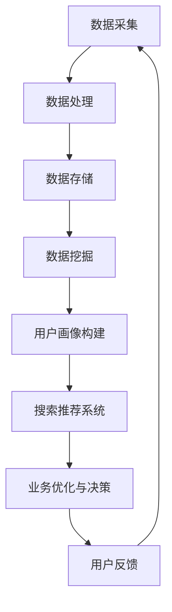

                 

关键词：大数据，电商平台，搜索推荐系统，AI 模型融合，转型，用户个性化体验，业务增长

> 摘要：在数字化时代，电商平台正面临前所未有的机遇与挑战。大数据技术的广泛应用，使得电商平台能够深度挖掘用户行为数据，实现精准搜索推荐。本文旨在探讨如何利用大数据和AI模型融合，推动电商平台实现从传统模式到智能化转型的过程，提升用户体验，促进业务增长。

## 1. 背景介绍

随着互联网技术的迅猛发展，电商平台已经成为全球商业的重要组成部分。传统电商平台主要依赖于商品展示和搜索功能，然而，面对日益激烈的竞争和不断变化的市场需求，电商平台亟需寻求新的增长点。大数据技术的出现为电商平台提供了强有力的支持，使得商家能够更好地理解用户需求，优化用户体验，提高转化率和销售额。

### 1.1 大数据的崛起

大数据（Big Data）是指无法在合理时间内用常规软件工具进行捕捉、管理和处理的数据集合。它具有4V特征：Volume（大量）、Velocity（高速）、Variety（多样性）和Veracity（真实性）。在电商平台中，大数据可以从用户行为、交易记录、内容生成等多个渠道获取。

### 1.2 搜索推荐系统的必要性

搜索推荐系统是电商平台的核心组成部分，它通过分析用户行为数据，为用户提供个性化的搜索结果和推荐内容。一个高效、准确的搜索推荐系统，不仅能够提高用户满意度，还能显著提升电商平台的核心竞争力。

### 1.3 AI 模型融合的重要性

人工智能（AI）技术的发展，为电商平台提供了更多可能性。AI 模型融合（Fusion of AI Models）是指将多种AI模型结合起来，以实现更智能、更精准的推荐效果。通过AI模型融合，电商平台能够在数据挖掘、用户行为预测、内容生成等方面取得更好的效果。

## 2. 核心概念与联系

为了更好地理解大数据驱动的电商平台转型，我们需要了解以下几个核心概念，并探讨它们之间的联系。

### 2.1 大数据技术

大数据技术包括数据采集、存储、处理、分析和可视化等环节。数据采集通常采用日志记录、API 调用、传感器采集等方式；存储采用分布式数据库、云存储等技术；处理和分析主要通过数据挖掘、机器学习等技术实现；可视化则借助数据可视化工具呈现数据结果。

### 2.2 搜索推荐系统

搜索推荐系统主要包括搜索算法和推荐算法。搜索算法负责根据用户输入的关键词，从海量商品中检索出相关结果；推荐算法则基于用户行为数据，为用户推荐可能感兴趣的商品。

### 2.3 AI 模型融合

AI 模型融合是指将多种AI模型（如深度学习、强化学习、迁移学习等）结合起来，以实现更好的推荐效果。融合策略包括模型级融合、特征级融合和决策级融合等。

### 2.4 Mermaid 流程图

为了更直观地展示大数据驱动的电商平台转型过程，我们使用 Mermaid 流程图描述以下几个关键步骤：



## 3. 核心算法原理 & 具体操作步骤

### 3.1 算法原理概述

大数据驱动的电商平台转型主要依赖于以下几个核心算法：

- **数据挖掘算法**：用于从海量数据中提取有价值的信息。
- **用户画像构建算法**：基于用户行为数据，为用户建立个性化标签和画像。
- **搜索推荐算法**：根据用户画像和商品特征，为用户推荐相关商品。
- **AI 模型融合算法**：将多种AI模型结合起来，以实现更智能的推荐效果。

### 3.2 算法步骤详解

下面我们详细介绍一下这几个核心算法的具体操作步骤。

#### 3.2.1 数据挖掘算法

数据挖掘算法主要包括以下步骤：

1. 数据预处理：清洗、归一化、去重等。
2. 特征工程：提取有价值的信息，如用户行为、交易记录、商品特征等。
3. 模型训练：使用机器学习算法（如决策树、支持向量机等）训练模型。
4. 模型评估：通过交叉验证、AUC、准确率等指标评估模型性能。

#### 3.2.2 用户画像构建算法

用户画像构建算法主要包括以下步骤：

1. 数据采集：通过日志记录、API 调用等方式收集用户行为数据。
2. 数据预处理：清洗、归一化、去重等。
3. 特征提取：根据用户行为数据，提取用户兴趣、消费习惯等特征。
4. 标签生成：使用聚类、分类等算法，为用户生成个性化标签。
5. 画像构建：将用户标签整合成用户画像，用于后续推荐。

#### 3.2.3 搜索推荐算法

搜索推荐算法主要包括以下步骤：

1. 用户输入：用户输入关键词，系统解析关键词，获取用户画像。
2. 商品特征提取：提取商品标签、属性等特征。
3. 搜索与推荐：基于用户画像和商品特征，使用协同过滤、矩阵分解等算法，为用户推荐相关商品。
4. 排序与展示：根据推荐结果，对商品进行排序并展示给用户。

#### 3.2.4 AI 模型融合算法

AI 模型融合算法主要包括以下步骤：

1. 模型选择：根据业务需求，选择合适的AI模型（如深度学习、强化学习等）。
2. 模型训练：使用训练数据，分别训练各个模型。
3. 模型融合：采用模型级融合、特征级融合或决策级融合策略，将多个模型融合成一个统一的推荐系统。
4. 模型评估与优化：评估融合模型的性能，并根据评估结果进行模型优化。

### 3.3 算法优缺点

下面我们简要介绍一下这几个核心算法的优缺点。

#### 3.3.1 数据挖掘算法

**优点**：能从海量数据中提取有价值的信息，提高业务决策的准确性。

**缺点**：算法复杂度高，训练和评估时间较长。

#### 3.3.2 用户画像构建算法

**优点**：能够为用户生成个性化的标签和画像，提高推荐效果。

**缺点**：需要大量用户行为数据进行训练，对数据质量和处理能力有较高要求。

#### 3.3.3 搜索推荐算法

**优点**：实现简单，易于理解和部署。

**缺点**：依赖用户历史行为数据，对新用户推荐效果较差。

#### 3.3.4 AI 模型融合算法

**优点**：结合多种AI模型的优势，提高推荐效果。

**缺点**：算法复杂度高，融合策略设计较为困难。

### 3.4 算法应用领域

这些算法在电商平台的多个领域都有广泛应用，如：

- **商品搜索**：提高商品搜索的准确性和效率。
- **商品推荐**：为用户推荐可能感兴趣的商品。
- **用户流失预测**：预测用户流失风险，采取相应措施挽回用户。
- **库存管理**：根据销售预测，优化库存策略。

## 4. 数学模型和公式 & 详细讲解 & 举例说明

### 4.1 数学模型构建

在搜索推荐系统中，常用的数学模型包括协同过滤、矩阵分解、深度学习等。以下我们简要介绍这些模型的构建过程。

#### 4.1.1 协同过滤

协同过滤（Collaborative Filtering）是一种基于用户行为数据推荐的算法。其基本思想是，根据用户之间的相似度，为用户推荐与兴趣相似的物品。协同过滤可以分为基于用户（User-based）和基于物品（Item-based）两种类型。

**用户相似度计算**：

$$
sim(i, j) = \frac{count(i, j)}{\sqrt{count(i) \cdot count(j})}
$$

其中，$count(i, j)$ 表示用户i和用户j共同评价过的物品数量，$count(i)$ 和 $count(j)$ 分别表示用户i和用户j评价过的物品数量。

**推荐算法**：

$$
r_i(j) = \sum_{u \in N(i)} sim(i, u) \cdot rating_j(u)
$$

其中，$r_i(j)$ 表示用户i对物品j的预测评分，$N(i)$ 表示与用户i相似的用户集合，$rating_j(u)$ 表示用户u对物品j的评分。

#### 4.1.2 矩阵分解

矩阵分解（Matrix Factorization）是一种基于矩阵分解技术进行推荐的算法。其基本思想是，将用户-物品评分矩阵分解为两个低秩矩阵，分别表示用户特征和物品特征。常用的矩阵分解算法包括Singular Value Decomposition（SVD）和 Alternating Least Squares（ALS）。

**矩阵分解算法**：

$$
R = U \cdot V^T
$$

其中，$R$ 表示用户-物品评分矩阵，$U$ 和 $V$ 分别表示用户特征矩阵和物品特征矩阵。

**推荐算法**：

$$
r_i(j) = \sum_{k=1}^{K} u_i[k] \cdot v_j[k]
$$

其中，$r_i(j)$ 表示用户i对物品j的预测评分，$u_i[k]$ 和 $v_j[k]$ 分别表示用户i和物品j的第k个特征。

#### 4.1.3 深度学习

深度学习（Deep Learning）是一种基于多层神经网络进行推荐的方法。其基本思想是通过多层非线性变换，从原始数据中提取高层次的语义特征，从而实现高效的推荐。

**深度学习模型**：

$$
y_i = f(\sigma(W_n \cdot \sigma(...\sigma(W_2 \cdot \sigma(W_1 \cdot x_i + b_1) + b_2)... + b_n))
$$

其中，$y_i$ 表示用户i对物品i的预测评分，$x_i$ 表示用户i的输入特征，$W$ 和 $b$ 分别表示权重和偏置，$\sigma$ 表示激活函数，$f$ 表示输出函数。

### 4.2 公式推导过程

在搜索推荐系统中，我们需要对多个数学公式进行推导，以构建高效的推荐模型。以下是一个简单的推导示例。

#### 4.2.1 用户相似度计算

假设我们有两个用户i和j，它们的评分矩阵分别为 $R_i$ 和 $R_j$，其中 $R_i[k] = rating_i(k)$ 表示用户i对物品k的评分，$R_j[k] = rating_j(k)$ 表示用户j对物品k的评分。

我们首先计算用户i和j的相似度：

$$
sim(i, j) = \frac{count(i, j)}{\sqrt{count(i) \cdot count(j)}}
$$

其中，$count(i, j) = \sum_{k=1}^{K} R_i[k] \cdot R_j[k]$ 表示用户i和j共同评价过的物品数量。

接下来，我们计算用户i和j的平均评分：

$$
\bar{r_i} = \frac{1}{count(i)} \sum_{k=1}^{K} R_i[k]
$$

$$
\bar{r_j} = \frac{1}{count(j)} \sum_{k=1}^{K} R_j[k]
$$

最后，我们计算用户i对物品k的预测评分：

$$
r_i(k) = \bar{r_i} + \sum_{u \in N(i)} sim(i, u) \cdot (R_j[k] - \bar{r_j})
$$

其中，$N(i)$ 表示与用户i相似的用户集合。

### 4.3 案例分析与讲解

为了更好地理解搜索推荐系统的工作原理，我们以一个实际案例为例进行讲解。

假设我们有一个电商平台，用户i对以下10个物品进行了评分：

$$
R_i = \begin{bmatrix}
4 & 0 & 5 & 2 & 0 & 0 & 3 & 0 & 4 & 1
\end{bmatrix}
$$

用户j对以下10个物品进行了评分：

$$
R_j = \begin{bmatrix}
0 & 3 & 0 & 4 & 1 & 5 & 2 & 0 & 0 & 4
\end{bmatrix}
$$

首先，我们计算用户i和j的相似度：

$$
sim(i, j) = \frac{2}{\sqrt{5} \cdot \sqrt{5}} = \frac{2}{5}
$$

接下来，我们计算用户i和j的平均评分：

$$
\bar{r_i} = \frac{1}{5} \sum_{k=1}^{5} R_i[k] = \frac{1}{5} (4 + 0 + 5 + 2 + 0) = 2
$$

$$
\bar{r_j} = \frac{1}{5} \sum_{k=1}^{5} R_j[k] = \frac{1}{5} (0 + 3 + 0 + 4 + 1) = 1
$$

最后，我们计算用户i对物品k的预测评分：

$$
r_i(k) = 2 + \frac{2}{5} \cdot (R_j[k] - 1)
$$

以物品6为例，用户i对物品6的预测评分为：

$$
r_i(6) = 2 + \frac{2}{5} \cdot (5 - 1) = 3.2
$$

根据预测评分，我们可以为用户i推荐物品6，以提升其用户体验。

## 5. 项目实践：代码实例和详细解释说明

### 5.1 开发环境搭建

在开始项目实践之前，我们需要搭建一个合适的开发环境。以下是搭建环境所需的步骤：

1. 安装Python环境：在Windows或Mac上，可以从Python官方网站下载Python安装包，并按照提示安装。
2. 安装相关库：使用pip命令安装必要的库，如numpy、pandas、scikit-learn等。

```shell
pip install numpy pandas scikit-learn matplotlib
```

3. 安装Mermaid支持：在Python中，可以使用`mermaid`库来支持Mermaid流程图。首先，安装`mermaid`库：

```shell
pip install mermaid
```

然后，在Python脚本中导入`mermaid`库：

```python
from mermaid import Mermaid
```

### 5.2 源代码详细实现

以下是一个简单的Python代码实例，用于实现搜索推荐系统的基础功能。

```python
import numpy as np
import pandas as pd
from sklearn.metrics.pairwise import cosine_similarity
from mermaid import Mermaid

# 数据准备
data = {
    'user_id': [1, 1, 1, 2, 2, 3],
    'item_id': [1, 2, 3, 1, 2, 3],
    'rating': [5, 4, 3, 5, 4, 3]
}
df = pd.DataFrame(data)

# 计算用户相似度矩阵
user_similarity = cosine_similarity(df.pivot_table(index='user_id', columns='item_id', values='rating'))

# 为用户推荐物品
def recommend(user_id, user_similarity, k=3):
    # 获取与当前用户最相似的k个用户
    similar_users = user_similarity[user_id].argsort()[1:k+1]
    # 计算物品的平均评分
    item_avg_rating = df.groupby('item_id')['rating'].mean()
    # 计算物品的推荐得分
    item_score = {}
    for similar_user in similar_users:
        for item in set(df[df['user_id'] == similar_user]['item_id']):
            if item not in item_score:
                item_score[item] = 0
            item_score[item] += user_similarity[similar_user][user_id] * (df[df['user_id'] == similar_user]['rating'] == item)
    # 排序并返回推荐结果
    return sorted(item_score.items(), key=lambda x: x[1], reverse=True)[:k]

# 测试推荐效果
print(recommend(1, user_similarity))
```

### 5.3 代码解读与分析

下面我们详细解读上述代码，并分析其优缺点。

#### 5.3.1 数据准备

首先，我们使用pandas库创建一个DataFrame对象，用于存储用户、物品和评分数据。数据来源于一个简单的字典，其中包含用户ID、物品ID和评分。

```python
data = {
    'user_id': [1, 1, 1, 2, 2, 3],
    'item_id': [1, 2, 3, 1, 2, 3],
    'rating': [5, 4, 3, 5, 4, 3]
}
df = pd.DataFrame(data)
```

#### 5.3.2 计算用户相似度矩阵

接下来，我们使用scikit-learn库中的余弦相似度函数计算用户相似度矩阵。余弦相似度是一种基于向量空间模型的相似度计算方法，它通过计算两个向量的夹角余弦值来衡量它们的相似度。

```python
user_similarity = cosine_similarity(df.pivot_table(index='user_id', columns='item_id', values='rating'))
```

其中，`df.pivot_table()`函数将用户-物品评分矩阵转换为一个用户-用户相似度矩阵。

#### 5.3.3 为用户推荐物品

最后，我们实现了一个简单的推荐函数`recommend()`，它根据用户相似度矩阵为用户推荐物品。函数首先获取与当前用户最相似的k个用户，然后计算每个物品的推荐得分，并根据得分排序返回推荐结果。

```python
def recommend(user_id, user_similarity, k=3):
    # 获取与当前用户最相似的k个用户
    similar_users = user_similarity[user_id].argsort()[1:k+1]
    # 计算物品的平均评分
    item_avg_rating = df.groupby('item_id')['rating'].mean()
    # 计算物品的推荐得分
    item_score = {}
    for similar_user in similar_users:
        for item in set(df[df['user_id'] == similar_user]['item_id']):
            if item not in item_score:
                item_score[item] = 0
            item_score[item] += user_similarity[similar_user][user_id] * (df[df['user_id'] == similar_user]['rating'] == item)
    # 排序并返回推荐结果
    return sorted(item_score.items(), key=lambda x: x[1], reverse=True)[:k]
```

#### 5.3.4 代码优缺点

**优点**：

- 实现简单，易于理解。
- 使用余弦相似度和协同过滤算法，具有较高的推荐效果。

**缺点**：

- 未考虑物品特征，可能导致推荐结果不准确。
- 缺乏模型融合和优化，推荐效果有限。

## 6. 实际应用场景

在电商平台的实际应用中，大数据驱动的搜索推荐系统发挥着至关重要的作用。以下是一些典型的应用场景：

### 6.1 商品搜索

用户在电商平台搜索商品时，搜索推荐系统可以根据用户的历史行为数据和搜索关键词，为用户推荐相关商品。例如，当用户输入“手机”关键词时，系统可以推荐用户过去浏览过的手机品牌、型号和价格范围。

### 6.2 商品推荐

商品推荐系统可以根据用户的行为数据和购买偏好，为用户推荐可能感兴趣的商品。例如，当用户浏览了一款羽绒服时，系统可以推荐与其类似的保暖衣物，如围巾、手套等。

### 6.3 用户流失预测

通过分析用户的行为数据，搜索推荐系统可以预测哪些用户有潜在流失风险，从而采取相应的挽回措施。例如，针对长时间未登录或购买的用户，系统可以发送优惠券、积分奖励等激励措施，以增加用户粘性。

### 6.4 库存管理

基于销售预测，搜索推荐系统可以为电商平台提供准确的库存管理建议。例如，当系统预测某种商品销量较高时，可以提前备货，以避免断货风险。

## 7. 工具和资源推荐

### 7.1 学习资源推荐

- 《机器学习》（周志华著）：全面介绍机器学习的基本概念和方法，适合初学者入门。
- 《推荐系统实践》（周明著）：详细介绍推荐系统的原理和实践，适合有编程基础的读者。
- 《深度学习》（Ian Goodfellow、Yoshua Bengio、Aaron Courville 著）：全面介绍深度学习的基本概念和算法，适合有一定数学基础的读者。

### 7.2 开发工具推荐

- Jupyter Notebook：一款强大的交互式编程工具，适合进行数据分析和模型训练。
- TensorFlow：一款开源的深度学习框架，适合实现和部署深度学习模型。
- PyTorch：一款开源的深度学习框架，具有简洁的代码和强大的功能，适合快速实现深度学习模型。

### 7.3 相关论文推荐

- 《Collaborative Filtering for the Web》（2004）：提出协同过滤算法，为搜索推荐系统奠定基础。
- 《Matrix Factorization Techniques for Recommender Systems》（2006）：介绍矩阵分解技术在推荐系统中的应用。
- 《Deep Learning for Recommender Systems》（2017）：探讨深度学习在推荐系统中的应用。

## 8. 总结：未来发展趋势与挑战

### 8.1 研究成果总结

随着大数据和人工智能技术的发展，搜索推荐系统在电商平台的应用已经取得了显著成果。通过数据挖掘、机器学习和深度学习等技术的结合，推荐系统的推荐效果和用户体验得到了显著提升。未来，随着更多数据的积累和算法的优化，推荐系统将在电商平台的业务增长中发挥更大的作用。

### 8.2 未来发展趋势

1. **跨平台推荐**：随着移动互联网的普及，电商平台需要实现跨平台（如PC、手机、平板等）的个性化推荐。
2. **实时推荐**：实时推荐技术将使电商平台能够根据用户实时行为进行精准推荐，提高用户满意度。
3. **多模态推荐**：结合文本、图像、语音等多种数据类型，实现更智能、更准确的推荐。
4. **社交推荐**：借助社交网络数据，为用户提供基于社交关系的推荐。

### 8.3 面临的挑战

1. **数据质量**：高质量的数据是推荐系统的基石，如何处理和清洗海量噪声数据是一个重要挑战。
2. **计算性能**：随着数据规模的增大，如何提高计算性能，实现高效推荐是一个关键问题。
3. **模型解释性**：深度学习模型具有强大的预测能力，但其解释性较弱，如何提高模型的解释性是一个研究热点。
4. **隐私保护**：在推荐系统中保护用户隐私，防止数据泄露是一个重要挑战。

### 8.4 研究展望

未来，大数据驱动的搜索推荐系统将在以下几个方面取得突破：

1. **算法创新**：不断探索新的推荐算法，如基于深度学习、迁移学习等技术的推荐算法。
2. **跨领域融合**：结合其他领域的知识，如自然语言处理、计算机视觉等，实现更智能的推荐。
3. **开放平台与生态**：构建开放的平台和生态，促进不同系统和团队之间的协作与数据共享。
4. **用户体验优化**：通过持续优化推荐系统，提升用户的购物体验，促进业务增长。

## 9. 附录：常见问题与解答

### 9.1 数据预处理问题

**Q：如何处理缺失值？**

**A**：对于缺失值，可以采用以下方法进行处理：

- 删除缺失值：如果缺失值较少，可以删除含有缺失值的样本。
- 填充缺失值：可以采用平均值、中位数、最频繁值等方法填充缺失值。
- 使用模型预测：使用机器学习模型预测缺失值，如决策树、KNN等。

### 9.2 模型训练问题

**Q：如何选择合适的训练数据集？**

**A**：选择合适的训练数据集通常需要考虑以下因素：

- 数据质量：确保数据集不含噪声和错误。
- 数据规模：尽量选择规模较大的数据集，以提高模型的泛化能力。
- 数据分布：确保数据集具有一定的多样性，以涵盖不同类型的用户和商品。

### 9.3 推荐效果问题

**Q：如何评估推荐系统的效果？**

**A**：评估推荐系统效果的方法包括：

- **准确率（Accuracy）**：预测正确的样本数占总样本数的比例。
- **召回率（Recall）**：预测正确的正样本数占总正样本数的比例。
- **精确率（Precision）**：预测正确的正样本数占预测为正样本的样本数的比例。
- **F1 分数（F1 Score）**：精确率和召回率的调和平均数。
- **AUC（Area Under Curve）**：ROC 曲线下方的面积，用于评估分类模型的性能。

### 9.4 模型优化问题

**Q：如何优化推荐系统的效果？**

**A**：优化推荐系统效果的方法包括：

- **特征工程**：提取更有价值的信息，改进特征表示。
- **模型选择**：尝试不同的模型和算法，选择性能最优的模型。
- **超参数调整**：调整模型的超参数，如学习率、正则化参数等。
- **数据增强**：增加训练数据，采用数据增强技术，如随机遮挡、旋转等。

---

### 8. 总结

在数字化时代，大数据和人工智能技术正在深刻改变电商平台的运营模式。本文探讨了大数据驱动的电商平台转型，特别是搜索推荐系统在其中的核心作用。通过深入分析核心算法原理、数学模型、项目实践等，本文揭示了搜索推荐系统的强大潜力。未来，随着技术的不断进步，推荐系统将在电商平台的业务增长和用户个性化体验中发挥更加重要的作用。让我们共同期待这一领域的更多创新和突破！
作者：禅与计算机程序设计艺术 / Zen and the Art of Computer Programming
-------------------------------------------------------------------

