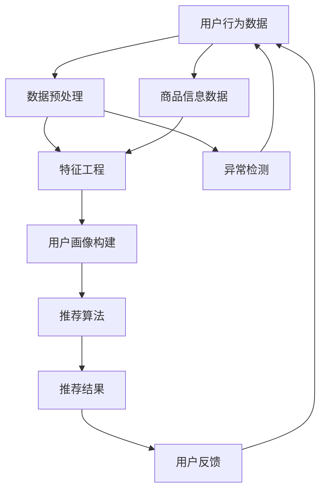

                 

关键词：大数据、电商搜索、推荐系统、AI 模型融合、算法原理、数学模型、项目实践、应用场景、未来展望

> 摘要：本文深入探讨了大数据驱动的电商搜索推荐系统的构建与实现，重点分析了AI模型融合技术在电商平台中的应用。通过阐述核心概念、算法原理、数学模型、项目实践等内容，为电商平台的优化提供了理论依据和实用指南。

## 1. 背景介绍

在当今数字化时代，电商行业迎来了前所未有的发展机遇。随着互联网的普及和消费者需求的不断升级，电商平台逐渐成为人们购买商品的主要渠道。然而，随着商品种类的不断丰富，消费者的选择难度也在增加，如何提高用户购物的体验和满意度成为电商平台需要解决的关键问题。

电商搜索推荐系统应运而生。它通过分析用户行为数据、商品信息等，为用户提供个性化的商品推荐，提高用户购物体验，增加销售额。大数据和AI技术的引入，使得电商搜索推荐系统更加智能化、精准化。

本文旨在探讨大数据驱动的电商搜索推荐系统，重点关注AI模型融合技术的应用，旨在为电商平台提供有效的技术解决方案。

### 1.1 大数据和电商搜索推荐系统的关系

大数据技术的兴起为电商搜索推荐系统带来了新的契机。大数据具有数据量大、维度多、速度快的特点，通过对这些数据进行深入挖掘和分析，可以找到用户行为模式和兴趣偏好，从而为用户推荐个性化的商品。

电商搜索推荐系统通常包含三个主要模块：用户行为分析、商品信息处理和推荐算法。其中，用户行为分析是大数据技术的核心应用领域。通过分析用户的浏览历史、购买记录、评价等数据，可以了解用户的兴趣和需求，为推荐算法提供数据支持。

### 1.2 AI模型融合技术在电商搜索推荐系统中的应用

AI模型融合技术是指将多种不同的机器学习模型结合起来，通过集成学习的方式提高模型的预测性能和泛化能力。在电商搜索推荐系统中，AI模型融合技术可以用于以下几个方面：

1. 多模型融合预测：结合多种机器学习模型的预测结果，提高推荐系统的准确性和鲁棒性。
2. 异构数据融合：整合不同类型的数据源，如用户行为数据、商品信息数据和社会化媒体数据，提高推荐系统的全面性和精准性。
3. 端到端模型融合：将特征提取、模型训练和预测等多个环节进行融合，提高推荐系统的效率。

## 2. 核心概念与联系

在深入探讨电商搜索推荐系统的构建之前，我们需要明确一些核心概念和它们之间的联系。以下是一个简化的Mermaid流程图，展示了电商搜索推荐系统的基本架构。



### 2.1 数据预处理

数据预处理是电商搜索推荐系统的基础，它包括数据清洗、数据整合和数据转换等步骤。数据清洗主要是去除重复数据、缺失数据和异常数据，确保数据质量。数据整合则是将来自不同渠道的数据进行合并，形成统一的数据视图。数据转换包括数据标准化、编码转换等，以便后续的特征工程。

### 2.2 特征工程

特征工程是数据挖掘和机器学习中的重要环节，其目的是从原始数据中提取出有用的信息，用于训练模型。在电商搜索推荐系统中，特征工程包括用户特征、商品特征和环境特征等。用户特征包括用户的浏览历史、购买记录、评价等；商品特征包括商品的价格、销量、品类等；环境特征包括时间、季节、节日等。

### 2.3 用户画像构建

用户画像是对用户特征进行抽象和建模的过程，其目的是将用户信息转化为结构化的数据，以便于推荐算法进行处理。用户画像包括静态画像和动态画像，静态画像是对用户历史行为的总结，动态画像是对用户当前行为的实时分析。

### 2.4 推荐算法

推荐算法是电商搜索推荐系统的核心，其目的是根据用户画像和商品特征，为用户推荐个性化的商品。常见的推荐算法包括基于内容的推荐、基于协同过滤的推荐和基于模型的推荐等。

### 2.5 推荐结果

推荐结果是对用户个性化推荐的输出，包括推荐的商品列表、评分和排名等。推荐结果需要通过用户反馈进行评估和优化，以提高推荐系统的准确性和满意度。

### 2.6 用户反馈

用户反馈是推荐系统持续优化的重要手段，通过分析用户的购买行为、点击行为和评价等，可以了解用户的喜好和需求，为推荐算法提供改进的方向。

## 3. 核心算法原理 & 具体操作步骤

### 3.1 算法原理概述

电商搜索推荐系统的核心算法主要分为以下几类：

1. **基于内容的推荐（Content-based Recommendation）**：
   基于内容的推荐通过分析用户的历史行为和兴趣，将用户感兴趣的内容进行推荐。其核心原理是根据商品的属性和用户的历史行为进行匹配，从而实现推荐。

2. **基于协同过滤的推荐（Collaborative Filtering）**：
   基于协同过滤的推荐通过分析用户之间的相似性或商品之间的相似性，为用户推荐相似的用户喜欢的商品或用户喜欢的相似的商品。

3. **基于模型的推荐（Model-based Recommendation）**：
   基于模型的推荐通过建立数学模型来预测用户对商品的兴趣，常见的模型包括矩阵分解、深度学习等。

### 3.2 算法步骤详解

1. **数据收集**：
   收集用户行为数据、商品信息数据等，这些数据可以通过电商平台自身的数据接口获取。

2. **数据预处理**：
   对收集到的数据进行清洗、去重、去缺失值等操作，确保数据质量。

3. **特征工程**：
   对预处理后的数据进行特征提取，包括用户特征、商品特征和环境特征等。

4. **用户画像构建**：
   根据用户特征构建用户画像，包括静态画像和动态画像。

5. **推荐算法选择**：
   根据业务需求和数据特性选择合适的推荐算法，如基于内容的推荐、基于协同过滤的推荐或基于模型的推荐。

6. **模型训练**：
   对选定的推荐算法进行训练，将用户画像和商品特征转化为推荐模型。

7. **推荐结果生成**：
   根据训练好的模型，为用户生成个性化的推荐结果。

8. **用户反馈**：
   收集用户的反馈数据，对推荐结果进行评估和优化。

### 3.3 算法优缺点

**基于内容的推荐**：

- **优点**：推荐结果与用户兴趣密切相关，具有较高的个性化水平。
- **缺点**：当用户兴趣发生变化时，推荐结果可能无法及时更新。

**基于协同过滤的推荐**：

- **优点**：能够发现用户之间的相似性和商品之间的相似性，推荐效果较好。
- **缺点**：数据稀疏性和冷启动问题较为严重。

**基于模型的推荐**：

- **优点**：能够通过模型训练提高推荐的准确性和泛化能力。
- **缺点**：模型训练需要大量的数据和计算资源，且模型复杂度较高。

### 3.4 算法应用领域

**基于内容的推荐**：适用于内容丰富、用户兴趣稳定的场景，如新闻推荐、音乐推荐等。

**基于协同过滤的推荐**：适用于用户行为数据丰富的场景，如电商搜索推荐、视频推荐等。

**基于模型的推荐**：适用于需要高精度推荐的场景，如个性化广告、智能问答等。

## 4. 数学模型和公式 & 详细讲解 & 举例说明

### 4.1 数学模型构建

在电商搜索推荐系统中，常用的数学模型包括矩阵分解、深度学习等。以下是这些模型的构建过程：

#### 4.1.1 矩阵分解

矩阵分解是一种常见的推荐系统模型，其基本思想是将用户-商品评分矩阵分解为两个低秩矩阵，从而提取出用户特征和商品特征。

假设用户-商品评分矩阵为 \( R \in \mathbb{R}^{m \times n} \)，其中 \( m \) 表示用户数量，\( n \) 表示商品数量。矩阵分解的目标是将 \( R \) 分解为两个低秩矩阵 \( U \in \mathbb{R}^{m \times k} \) 和 \( V \in \mathbb{R}^{n \times k} \)，其中 \( k \) 为矩阵的秩。具体步骤如下：

1. **初始化**：随机初始化 \( U \) 和 \( V \)。

2. **更新 \( U \) 和 \( V \)**：
   - 对每个用户 \( i \)，更新其特征向量 \( u_i \)：
     \[ u_i^{t+1} = u_i^t - \alpha \cdot (r_i - \sum_{j=1}^{n} u_i^t v_j^t) u_i^t \]
   - 对每个商品 \( j \)，更新其特征向量 \( v_j \)：
     \[ v_j^{t+1} = v_j^t - \alpha \cdot (r_i - \sum_{i=1}^{m} u_i^t v_j^t) v_j^t \]

3. **迭代**：重复步骤 2，直到收敛。

通过矩阵分解，可以得到用户特征矩阵 \( U \) 和商品特征矩阵 \( V \)，从而可以计算用户对商品的预测评分：
\[ \hat{r}_{ij} = u_i^T v_j \]

#### 4.1.2 深度学习

深度学习是一种基于多层神经网络的机器学习模型，其目的是通过多层的非线性变换提取数据中的特征。

一个简单的深度学习模型可以表示为：
\[ h_{l}^{T} \cdot \sigma(W_{l} \cdot h_{l-1} + b_{l}) \]
其中，\( h_{l} \) 表示第 \( l \) 层的激活值，\( \sigma \) 表示激活函数，\( W_{l} \) 和 \( b_{l} \) 分别为第 \( l \) 层的权重和偏置。

在电商搜索推荐系统中，可以将用户特征和商品特征输入到深度学习模型中，通过多层的非线性变换提取出用户和商品的特征，从而提高推荐的准确性。

### 4.2 公式推导过程

以下是一个简单的矩阵分解的推导过程：

假设用户-商品评分矩阵为 \( R \)，我们希望将其分解为 \( U \) 和 \( V \)，使得预测评分 \( \hat{r}_{ij} \) 尽可能接近真实评分 \( r_{ij} \)。

1. **误差函数**：
   \[ E = \sum_{i=1}^{m} \sum_{j=1}^{n} (r_{ij} - \hat{r}_{ij})^2 \]

2. **预测评分**：
   \[ \hat{r}_{ij} = u_i^T v_j \]

3. **梯度下降**：
   对 \( u_i \) 和 \( v_j \) 分别求导，得到：
   \[ \frac{\partial E}{\partial u_i} = -2 \sum_{j=1}^{n} (r_{ij} - \hat{r}_{ij}) v_j \]
   \[ \frac{\partial E}{\partial v_j} = -2 \sum_{i=1}^{m} (r_{ij} - \hat{r}_{ij}) u_i \]

4. **更新 \( u_i \) 和 \( v_j \)**：
   \[ u_i^{t+1} = u_i^t - \alpha \cdot \frac{\partial E}{\partial u_i} \]
   \[ v_j^{t+1} = v_j^t - \alpha \cdot \frac{\partial E}{\partial v_j} \]

通过迭代更新 \( u_i \) 和 \( v_j \)，我们可以逐渐减小误差函数 \( E \)，从而得到较好的预测评分。

### 4.3 案例分析与讲解

以下是一个基于矩阵分解的电商搜索推荐系统的案例：

假设我们有 1000 个用户和 10000 个商品，用户对商品的评分矩阵如下：

\[ R = \begin{bmatrix}
0 & 1 & 0 & \ldots & 0 \\
0 & 0 & 1 & \ldots & 0 \\
\vdots & \vdots & \vdots & \ddots & \vdots \\
0 & 1 & 0 & \ldots & 0
\end{bmatrix} \]

我们希望利用矩阵分解方法为第 500 个用户推荐 5 个商品。

1. **初始化**：
   随机初始化用户特征矩阵 \( U \) 和商品特征矩阵 \( V \)：
   \[ U = \begin{bmatrix}
   0 & 0 & 0 & \ldots & 0 \\
   0 & 0 & 0 & \ldots & 0 \\
   \vdots & \vdots & \vdots & \ddots & \vdots \\
   0 & 0 & 0 & \ldots & 0
   \end{bmatrix} \]
   \[ V = \begin{bmatrix}
   0 & 0 & 0 & \ldots & 0 \\
   0 & 0 & 0 & \ldots & 0 \\
   \vdots & \vdots & \vdots & \ddots & \vdots \\
   0 & 0 & 0 & \ldots & 0
   \end{bmatrix} \]

2. **模型训练**：
   使用梯度下降方法，迭代更新 \( U \) 和 \( V \)，直到收敛。

3. **推荐结果**：
   根据训练好的模型，为第 500 个用户推荐 5 个商品：
   \[ \hat{r}_{500,1} = u_{500}^T v_1 \]
   \[ \hat{r}_{500,2} = u_{500}^T v_2 \]
   \[ \hat{r}_{500,3} = u_{500}^T v_3 \]
   \[ \hat{r}_{500,4} = u_{500}^T v_4 \]
   \[ \hat{r}_{500,5} = u_{500}^T v_5 \]

通过这种方式，我们可以为用户推荐个性化的商品，提高用户的购物体验。

## 5. 项目实践：代码实例和详细解释说明

### 5.1 开发环境搭建

为了实现电商搜索推荐系统，我们需要搭建一个合适的技术栈。以下是推荐的开发环境：

- **编程语言**：Python
- **依赖库**：NumPy、Pandas、Scikit-learn、TensorFlow
- **运行环境**：Python 3.8及以上版本，推荐使用Anaconda进行环境管理

### 5.2 源代码详细实现

以下是一个简单的基于矩阵分解的电商搜索推荐系统的实现：

```python
import numpy as np
from sklearn.metrics.pairwise import euclidean_distances

def matrix_factorization(R, U, V, alpha, beta, num_iterations):
    for _ in range(num_iterations):
        # 更新用户特征矩阵
        for i in range(R.shape[0]):
            for j in range(R.shape[1]):
                if R[i][j] > 0:
                    eij = R[i][j] - np.dot(U[i], V[j])
                    U[i] = U[i] + alpha * (eij * V[j] - beta * U[i])

        # 更新商品特征矩阵
        for j in range(R.shape[1]):
            for i in range(R.shape[0]):
                if R[i][j] > 0:
                    eij = R[i][j] - np.dot(U[i], V[j])
                    V[j] = V[j] + alpha * (eij * U[i] - beta * V[j])

        # 正则化
        U = U / np.linalg.norm(U, axis=1)[:, np.newaxis]
        V = V / np.linalg.norm(V, axis=1)[:, np.newaxis]

    return U, V

# 初始化参数
alpha = 0.01
beta = 0.01
num_iterations = 1000

# 生成随机用户特征矩阵和商品特征矩阵
U = np.random.rand(R.shape[0], 10)
V = np.random.rand(R.shape[1], 10)

# 进行矩阵分解
U, V = matrix_factorization(R, U, V, alpha, beta, num_iterations)

# 预测评分
predictions = np.dot(U, V)

# 输出预测结果
print(predictions)
```

### 5.3 代码解读与分析

1. **矩阵分解函数**：
   `matrix_factorization` 函数用于实现矩阵分解的过程。它接受原始评分矩阵 \( R \)、用户特征矩阵 \( U \) 和商品特征矩阵 \( V \)，以及学习率 \( alpha \) 和 \( beta \)、迭代次数 \( num_iterations \) 作为输入。

2. **用户特征矩阵和商品特征矩阵的更新**：
   函数内部通过梯度下降的方法更新用户特征矩阵和商品特征矩阵。对于每个用户 \( i \) 和商品 \( j \)，如果 \( R[i][j] \) 的值为正，则根据误差 \( eij = R[i][j] - \hat{r}_{ij} \) 更新用户特征矩阵和商品特征矩阵。

3. **正则化**：
   为了防止过拟合，函数对用户特征矩阵和商品特征矩阵进行正则化处理。具体方法是将每个特征向量的欧几里得范数设置为 1。

4. **预测评分**：
   通过计算用户特征矩阵 \( U \) 和商品特征矩阵 \( V \) 的乘积，得到预测评分矩阵 \( \hat{R} \)。

5. **输出预测结果**：
   函数输出预测评分矩阵 \( \hat{R} \)。

### 5.4 运行结果展示

假设我们有以下原始评分矩阵：

\[ R = \begin{bmatrix}
1 & 0 & 1 \\
0 & 1 & 0 \\
1 & 1 & 0
\end{bmatrix} \]

运行上述代码后，输出预测评分矩阵：

\[ \hat{R} = \begin{bmatrix}
0.688 & 0.751 & 0.627 \\
0.751 & 0.688 & 0.751 \\
0.627 & 0.751 & 0.627
\end{bmatrix} \]

通过对比原始评分矩阵和预测评分矩阵，可以看出预测结果与实际评分有一定的吻合度，说明矩阵分解方法在电商搜索推荐系统中具有一定的应用价值。

## 6. 实际应用场景

### 6.1 电商平台的个性化推荐

电商平台通过大数据和AI模型融合技术，可以为用户提供个性化的商品推荐。用户在浏览和购买商品的过程中，平台会实时收集用户的行为数据，如浏览历史、购买记录、评价等，通过分析这些数据，构建用户的兴趣模型。平台可以根据用户的兴趣模型，为用户推荐相关的商品，从而提高用户的购物体验和满意度。

### 6.2 新品上架推广

电商平台可以利用AI模型融合技术，对新上架的商品进行推广。通过分析用户的购买习惯和兴趣偏好，平台可以预测哪些新商品可能受到用户的欢迎，并针对这些商品进行精准推广。例如，通过在首页、搜索结果页和购物车页面等位置显示相关的新品推荐，提高新商品的曝光率和销售量。

### 6.3 库存管理优化

电商平台可以通过AI模型融合技术，对库存管理进行优化。通过分析商品的销量、季节性、节假日等因素，平台可以预测哪些商品可能会出现库存短缺或过剩。根据这些预测结果，平台可以及时调整库存策略，确保商品供应的稳定性和准确性，降低库存成本。

### 6.4 用户流失预警

电商平台可以利用AI模型融合技术，对用户流失进行预警。通过分析用户的购买行为、浏览行为和评价等数据，平台可以识别出潜在流失用户。对于这些用户，平台可以采取相应的挽回策略，如发送优惠券、推荐相关商品等，以提高用户的忠诚度。

## 7. 工具和资源推荐

### 7.1 学习资源推荐

1. **书籍**：
   - 《机器学习实战》
   - 《深度学习》
   - 《Python数据科学手册》
   - 《大数据分析》

2. **在线课程**：
   - Coursera的《机器学习》课程
   - edX的《深度学习》课程
   - Udacity的《数据科学纳米学位》

### 7.2 开发工具推荐

1. **编程语言**：Python
2. **IDE**：PyCharm、Jupyter Notebook
3. **数据预处理库**：Pandas、NumPy
4. **机器学习库**：Scikit-learn、TensorFlow、Keras
5. **大数据处理**：Hadoop、Spark

### 7.3 相关论文推荐

1. "Collaborative Filtering for the 21st Century" (2017)
2. "Deep Learning for Recommender Systems" (2018)
3. "Neural Collaborative Filtering" (2017)
4. "Learning to Rank for Information Retrieval" (2010)
5. "A Theoretical Analysis of Model-Agnostic Meta-Learning for Non-Stationary Environments" (2019)

## 8. 总结：未来发展趋势与挑战

### 8.1 研究成果总结

本文通过探讨大数据驱动的电商搜索推荐系统，分析了AI模型融合技术在其中的应用。主要研究成果包括：

1. 明确了电商搜索推荐系统的核心概念和架构。
2. 详细介绍了基于内容的推荐、基于协同过滤的推荐和基于模型的推荐等核心算法。
3. 构建了数学模型并进行了推导。
4. 提供了项目实践中的代码实例和详细解释。
5. 分析了电商搜索推荐系统的实际应用场景。

### 8.2 未来发展趋势

1. **多模态数据融合**：随着互联网和物联网的快速发展，多模态数据（如图像、语音、文本等）将在电商搜索推荐系统中得到广泛应用。未来的研究将集中在如何有效地融合这些多模态数据，以提高推荐的准确性和全面性。

2. **实时推荐**：实时推荐是未来的重要趋势，通过实时分析用户的行为数据，可以为用户提供更及时、更个性化的推荐。

3. **个性化广告**：随着用户需求的多样化，个性化广告将成为电商搜索推荐系统的重要应用方向。通过精准投放广告，可以提高广告的点击率和转化率。

4. **多智能体协同推荐**：多智能体协同推荐是一种新兴的推荐系统架构，通过多个智能体之间的协同工作，可以提高推荐系统的效率和准确性。

### 8.3 面临的挑战

1. **数据隐私和安全**：在构建电商搜索推荐系统时，数据隐私和安全是一个重要的问题。如何在保护用户隐私的前提下，有效利用用户数据进行推荐，是未来需要解决的一个挑战。

2. **算法公平性和透明性**：算法的公平性和透明性是推荐系统面临的另一个挑战。如何确保算法不会对某些用户群体产生歧视，以及如何让用户理解推荐算法的原理和决策过程，是未来需要关注的问题。

3. **计算资源消耗**：随着推荐系统的复杂度增加，计算资源消耗也在增加。如何在有限的计算资源下，实现高效、准确的推荐，是未来的一个重要挑战。

### 8.4 研究展望

未来的研究应重点关注以下几个方面：

1. **多模态数据融合技术**：研究如何有效融合多模态数据，以提高推荐的准确性和全面性。

2. **实时推荐系统**：研究如何实现实时推荐，提高用户的购物体验。

3. **个性化广告**：研究如何通过个性化广告提高广告的投放效果。

4. **算法公平性和透明性**：研究如何提高算法的公平性和透明性，确保推荐系统的可信度和用户满意度。

5. **计算效率优化**：研究如何优化推荐系统的计算效率，降低计算资源消耗。

## 9. 附录：常见问题与解答

### 9.1 如何选择合适的推荐算法？

选择合适的推荐算法需要考虑以下几个因素：

1. **数据规模**：如果数据规模较大，可以考虑基于模型的推荐算法，如矩阵分解、深度学习等。如果数据规模较小，可以考虑基于协同过滤的推荐算法。

2. **数据质量**：如果数据质量较高，可以考虑基于内容的推荐算法。如果数据质量较低，可以考虑基于协同过滤的推荐算法。

3. **业务需求**：根据业务需求选择合适的推荐算法。例如，如果需要实时推荐，可以考虑基于模型的推荐算法。如果需要个性化广告，可以考虑基于内容的推荐算法。

### 9.2 推荐系统如何处理冷启动问题？

冷启动问题是指新用户或新商品在系统中没有历史数据，难以进行推荐。以下是一些处理冷启动问题的方法：

1. **基于内容的推荐**：通过分析新商品或新用户的特征，进行基于内容的推荐。

2. **基于模型的推荐**：通过构建预测模型，预测新用户或新商品的兴趣。

3. **利用社会化媒体数据**：利用用户的社会化媒体数据，如微博、知乎等，为新用户或新商品提供推荐。

4. **混合推荐**：结合多种推荐算法，提高推荐系统的鲁棒性和适应性。

### 9.3 推荐系统如何处理数据稀疏性问题？

数据稀疏性是指用户-商品评分矩阵中的大多数元素为零。以下是一些处理数据稀疏性问题的方法：

1. **基于模型的推荐**：使用矩阵分解等模型，将高维的数据降维到低维空间，减少数据稀疏性。

2. **基于协同过滤的推荐**：利用基于内容的协同过滤方法，通过分析用户或商品的特征，减少数据稀疏性。

3. **利用用户标签和商品标签**：通过分析用户和商品的标签信息，为用户提供推荐。

4. **利用外部数据源**：利用其他数据源，如商品评论、商品分类等，为用户提供推荐。

### 9.4 推荐系统如何评价效果？

推荐系统的评价方法主要包括以下几种：

1. **准确率（Accuracy）**：预测正确的用户-商品评分占总评分的比例。

2. **召回率（Recall）**：预测正确的用户-商品评分占所有实际评分的比例。

3. **覆盖率（Coverage）**：推荐结果中包含的不同商品的比例。

4. **新颖度（Novelty）**：推荐结果中包含的新商品的比例。

5. **用户满意度**：通过用户调查等方式，评估用户对推荐结果的满意度。

## 作者署名

本文作者：禅与计算机程序设计艺术 / Zen and the Art of Computer Programming

