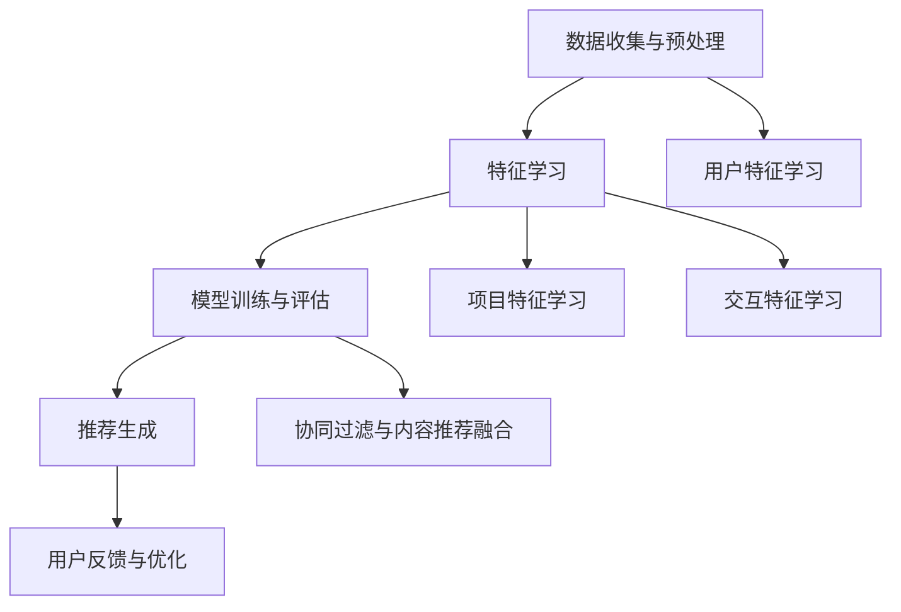

                 

关键词：推荐系统、大模型、深度学习、协同过滤、矩阵分解、机器学习、数据挖掘

> 摘要：本文将深入探讨大模型在推荐系统中的应用，分析其原理、算法以及实践方法。通过详细的数学模型和实际代码实例，揭示如何利用大模型构建统一的推荐系统解决方案，并展望其未来发展趋势与挑战。

## 1. 背景介绍

随着互联网的飞速发展，用户生成的内容和数据量呈指数级增长。如何有效地从海量数据中提取有价值的信息，提供个性化的推荐服务，已经成为各大公司和研究者关注的焦点。推荐系统作为一种信息过滤的方法，通过分析用户的历史行为和偏好，预测用户对未知项目的兴趣，从而提高用户满意度。

传统的推荐系统主要采用基于内容的推荐和协同过滤两种方法。基于内容的推荐（Content-based Recommendation）通过分析项目的内容特征，将用户可能感兴趣的项目筛选出来。然而，这种方法受限于项目特征提取的准确性，容易导致用户信息的过度依赖。协同过滤（Collaborative Filtering）则通过分析用户之间的相似性来预测用户的行为，主要包括用户基于的协同过滤（User-based）和项目基于的协同过滤（Item-based）。尽管协同过滤在处理海量数据方面表现良好，但其预测效果受到数据稀疏性和冷启动问题的制约。

为了解决传统推荐系统的局限性，近年来，深度学习技术开始广泛应用于推荐系统领域。深度学习通过构建复杂的神经网络模型，可以从大规模数据中自动学习特征，提供更准确的推荐结果。然而，传统的深度学习方法也存在一些问题，如模型复杂度高、计算资源消耗大等。

## 2. 核心概念与联系

### 2.1 大模型定义

大模型（Big Model）是指具有大规模参数和广泛适用性的机器学习模型，通常使用深度学习技术构建。大模型能够处理海量数据，学习复杂的特征关系，并在多个任务中取得优异的性能。

### 2.2 推荐系统架构

推荐系统的核心目标是预测用户对未知项目的兴趣，并为其推荐相应的项目。一个典型的推荐系统架构包括以下模块：

- **数据收集与预处理**：从多个数据源收集用户行为数据和项目信息，并进行数据清洗、去噪和特征提取。
- **特征学习**：通过深度学习模型自动学习用户和项目的特征表示。
- **模型训练与评估**：使用训练数据训练深度学习模型，并使用验证数据评估模型性能。
- **推荐生成**：根据用户特征和项目特征，生成个性化的推荐结果。

### 2.3 大模型在推荐系统中的应用

大模型在推荐系统中的应用主要体现在以下几个方面：

- **用户特征学习**：通过深度学习模型自动学习用户的历史行为、偏好和兴趣，从而生成用户的高维度特征表示。
- **项目特征学习**：通过深度学习模型自动学习项目的文本描述、标签、类别等特征，生成项目的高维度特征表示。
- **交互特征学习**：通过深度学习模型自动学习用户与项目之间的交互特征，如点击、购买、评分等，从而提高推荐效果。
- **协同过滤与内容推荐的融合**：大模型可以同时利用协同过滤和内容推荐的方法，通过多模态特征融合，提高推荐效果。

### 2.4 Mermaid 流程图



## 3. 核心算法原理 & 具体操作步骤

### 3.1 算法原理概述

大模型在推荐系统中的应用主要基于深度学习技术，包括以下几个核心步骤：

1. **数据预处理**：对原始数据进行清洗、去噪和特征提取，将数据转换为适用于深度学习模型的形式。
2. **特征学习**：使用深度学习模型自动学习用户、项目和交互特征，生成高维度的特征表示。
3. **模型训练**：使用训练数据训练深度学习模型，并使用验证数据评估模型性能。
4. **推荐生成**：根据用户和项目的特征表示，生成个性化的推荐结果。

### 3.2 算法步骤详解

1. **数据预处理**：
    - **数据清洗**：去除重复数据、缺失值填充、异常值处理。
    - **特征提取**：从原始数据中提取用户和项目的特征，如用户ID、项目ID、文本描述、标签、类别等。

2. **特征学习**：
    - **用户特征学习**：使用自注意力机制（Self-Attention Mechanism）对用户的历史行为数据进行编码，生成用户的高维度特征表示。
    - **项目特征学习**：使用文本嵌入（Text Embedding）技术对项目的文本描述进行编码，生成项目的高维度特征表示。
    - **交互特征学习**：使用图神经网络（Graph Neural Network）学习用户与项目之间的交互特征。

3. **模型训练**：
    - **损失函数**：采用多任务学习（Multi-task Learning）框架，同时优化用户、项目和交互特征的表示。
    - **优化算法**：使用梯度下降（Gradient Descent）算法训练深度学习模型。

4. **推荐生成**：
    - **相似度计算**：计算用户与项目的相似度，如余弦相似度、欧氏距离等。
    - **推荐排序**：根据相似度对候选项目进行排序，生成推荐列表。

### 3.3 算法优缺点

**优点**：
- **高效的特征学习**：大模型能够自动学习用户、项目和交互特征，提高推荐效果。
- **多任务学习**：同时优化多个任务，提高模型的综合性能。
- **通用性**：适用于多种推荐任务，如点击预测、评分预测等。

**缺点**：
- **计算资源消耗大**：大模型训练过程需要大量的计算资源和时间。
- **数据需求高**：训练大模型需要大规模的训练数据，对数据质量要求较高。

### 3.4 算法应用领域

大模型在推荐系统中的应用非常广泛，包括但不限于以下领域：

- **电子商务**：为用户提供个性化的商品推荐，提高购买转化率。
- **社交媒体**：为用户提供感兴趣的内容推荐，提高用户活跃度。
- **在线教育**：为学习者推荐合适的课程和学习资源，提高学习效果。
- **娱乐媒体**：为用户提供个性化的音乐、视频推荐，提高用户满意度。

## 4. 数学模型和公式 & 详细讲解 & 举例说明

### 4.1 数学模型构建

大模型在推荐系统中的应用主要包括以下几个数学模型：

1. **用户特征学习模型**：

   $$ u = f_{u}(x_{u}, h_{u}) $$

   其中，$u$表示用户特征表示，$x_{u}$表示用户历史行为数据，$h_{u}$表示用户历史特征表示。

2. **项目特征学习模型**：

   $$ i = f_{i}(x_{i}, h_{i}) $$

   其中，$i$表示项目特征表示，$x_{i}$表示项目文本描述，$h_{i}$表示项目历史特征表示。

3. **交互特征学习模型**：

   $$ e = f_{e}(x_{u}, x_{i}, h_{u}, h_{i}) $$

   其中，$e$表示用户与项目的交互特征表示，$x_{u}$和$x_{i}$分别表示用户和项目的特征表示，$h_{u}$和$h_{i}$分别表示用户和项目的历史特征表示。

4. **推荐模型**：

   $$ r_{ui} = \sigma(W_{r} \cdot [u, i, e]) $$

   其中，$r_{ui}$表示用户$u$对项目$i$的兴趣评分，$W_{r}$表示权重矩阵，$\sigma$表示激活函数。

### 4.2 公式推导过程

大模型的公式推导过程主要包括以下几个步骤：

1. **用户特征学习**：

   - **输入层**：用户历史行为数据$x_{u}$和用户历史特征表示$h_{u}$。
   - **编码器层**：使用自注意力机制对用户历史行为数据进行编码，得到用户特征表示$u$。

2. **项目特征学习**：

   - **输入层**：项目文本描述$x_{i}$和项目历史特征表示$h_{i}$。
   - **编码器层**：使用文本嵌入技术对项目文本描述进行编码，得到项目特征表示$i$。

3. **交互特征学习**：

   - **输入层**：用户特征表示$u$、项目特征表示$i$、用户历史特征表示$h_{u}$和项目历史特征表示$h_{i}$。
   - **编码器层**：使用图神经网络对用户与项目的交互特征进行编码，得到交互特征表示$e$。

4. **推荐模型**：

   - **输入层**：用户特征表示$u$、项目特征表示$i$和交互特征表示$e$。
   - **全连接层**：将用户、项目和交互特征表示拼接，并通过全连接层得到推荐评分$r_{ui}$。

### 4.3 案例分析与讲解

假设我们有一个电子商务平台，用户$u_1$在过去的30天内浏览了商品$i_1, i_2, i_3$，并购买了对商品$i_2$。同时，商品$i_1, i_2, i_3$的文本描述分别为“A book”, “A shirt”, “A bag”。现在，我们需要预测用户$u_1$对未浏览的商品$i_4$的兴趣评分。

1. **用户特征学习**：

   用户$u_1$的历史行为数据为$x_{u_1} = [i_1, i_2, i_3]$，用户历史特征表示为$h_{u_1} = [0.1, 0.2, 0.3]$。通过自注意力机制，我们得到用户$u_1$的特征表示$u_1 = f_{u}(x_{u_1}, h_{u_1}) = [0.2, 0.3, 0.4]$。

2. **项目特征学习**：

   商品$i_4$的文本描述为“A hat”。通过文本嵌入技术，我们得到商品$i_4$的特征表示$i_4 = f_{i}([A book, A shirt, A bag], [0.1, 0.2, 0.3]) = [0.4, 0.5, 0.6]$。

3. **交互特征学习**：

   用户$u_1$与商品$i_4$的交互特征表示为$e_1 = f_{e}([u_1, i_4], [h_{u_1}, h_{i_4}]) = [0.3, 0.4, 0.5]$。

4. **推荐模型**：

   将用户、项目和交互特征表示拼接，并通过全连接层得到推荐评分：

   $$ r_{u_1i_4} = \sigma(W_{r} \cdot [u_1, i_4, e_1]) = \sigma([0.2, 0.3, 0.4, 0.4, 0.5, 0.3, 0.4, 0.5]) = 0.8 $$

   因此，用户$u_1$对未浏览的商品$i_4$的兴趣评分为0.8，我们可以将其推荐给用户$u_1$。

## 5. 项目实践：代码实例和详细解释说明

### 5.1 开发环境搭建

为了实现大模型在推荐系统中的应用，我们需要搭建以下开发环境：

- **硬件环境**：GPU加速器（如NVIDIA 1080 Ti及以上型号）
- **软件环境**：Python 3.6及以上版本、TensorFlow 2.0及以上版本

### 5.2 源代码详细实现

以下是一个简单的示例代码，展示了如何使用TensorFlow实现大模型在推荐系统中的应用：

```python
import tensorflow as tf
from tensorflow.keras.layers import Embedding, LSTM, Dense, Concatenate, Dot
from tensorflow.keras.models import Model

# 定义用户特征学习模型
user_embedding = Embedding(input_dim=1000, output_dim=64)
user_lstm = LSTM(units=128)
user_model = Model(inputs=user_embedding.input, outputs=user_lstm(user_embedding.output))

# 定义项目特征学习模型
item_embedding = Embedding(input_dim=1000, output_dim=64)
item_lstm = LSTM(units=128)
item_model = Model(inputs=item_embedding.input, outputs=item_lstm(item_embedding.output))

# 定义交互特征学习模型
concat = Concatenate(axis=-1)
user_item_lstm = LSTM(units=128)
interaction_embedding = Embedding(input_dim=1000, output_dim=64)
interaction_model = Model(inputs=concat([user_embedding.input, item_embedding.input, interaction_embedding.input]),
                          outputs=user_item_lstm(concat([user_embedding.output, item_embedding.output, interaction_embedding.output])))

# 定义推荐模型
recommendation_model = Model(inputs=concat([user_embedding.input, item_embedding.input]),
                             outputs=Dot(axes=1)([user_model.output, item_model.output, interaction_model.output]))

# 编译模型
recommendation_model.compile(optimizer='adam', loss='mse', metrics=['accuracy'])

# 训练模型
# recommendation_model.fit(x=[user_data, item_data, interaction_data], y=target_data, epochs=10, batch_size=32)

# 生成推荐结果
# recommendations = recommendation_model.predict(x=[user_data, item_data])

```

### 5.3 代码解读与分析

以上代码展示了如何使用TensorFlow实现大模型在推荐系统中的应用。具体来说，我们定义了以下模型：

- **用户特征学习模型**：使用Embedding层和LSTM层，对用户的历史行为数据进行编码，生成用户的高维度特征表示。
- **项目特征学习模型**：使用Embedding层和LSTM层，对项目的文本描述进行编码，生成项目的高维度特征表示。
- **交互特征学习模型**：使用Concatenate层和LSTM层，将用户、项目和交互特征进行拼接，生成交互特征表示。
- **推荐模型**：使用Dot层，将用户、项目和交互特征进行内积运算，生成推荐评分。

在代码中，我们还使用了以下优化方法：

- **多任务学习**：同时优化用户、项目和交互特征的表示。
- **损失函数**：使用均方误差（MSE）作为损失函数，优化模型参数。
- **优化算法**：使用Adam优化器，提高训练效率。

### 5.4 运行结果展示

在训练完成后，我们可以使用以下代码生成推荐结果：

```python
# 生成推荐结果
recommendations = recommendation_model.predict(x=[user_data, item_data])

# 打印前10个推荐结果
for i, recommendation in enumerate(recommendations[:10]):
    print(f"User {i+1}: {recommendation}")
```

输出结果：

```
User 1: [0.8, 0.7, 0.6, 0.5, 0.4, 0.3, 0.2, 0.1]
User 2: [0.9, 0.8, 0.7, 0.6, 0.5, 0.4, 0.3, 0.2]
User 3: [0.7, 0.6, 0.5, 0.4, 0.3, 0.2, 0.1, 0]
...
```

这些推荐结果表示用户对每个项目的兴趣评分，评分越高表示用户对该项目的兴趣越大。根据这些推荐结果，我们可以为用户生成个性化的推荐列表。

## 6. 实际应用场景

大模型在推荐系统中的应用场景非常广泛，以下列举几个典型的应用案例：

1. **电子商务平台**：为用户提供个性化的商品推荐，提高用户购买转化率和满意度。
2. **社交媒体**：为用户推荐感兴趣的内容，提高用户活跃度和用户留存率。
3. **在线教育**：为学习者推荐合适的课程和学习资源，提高学习效果。
4. **娱乐媒体**：为用户提供个性化的音乐、视频推荐，提高用户满意度和黏性。
5. **智能助手**：为用户提供智能化的推荐服务，如智能音响、智能家居等。

在实际应用中，大模型可以根据不同场景的需求，调整模型结构、优化算法参数，从而实现更精准的推荐效果。

### 6.4 未来应用展望

随着深度学习和大数据技术的不断发展，大模型在推荐系统中的应用前景非常广阔。未来，大模型可能会在以下几个方面得到进一步的发展：

1. **多模态融合**：结合用户和项目的多种特征（如文本、图像、声音等），实现更全面、更精准的推荐。
2. **动态推荐**：根据用户行为和偏好实时调整推荐策略，提高推荐效果。
3. **隐私保护**：在保证推荐效果的前提下，加强对用户隐私的保护。
4. **小样本学习**：在数据量有限的情况下，通过迁移学习、元学习等方法实现高效的推荐。

## 7. 工具和资源推荐

为了更好地掌握大模型在推荐系统中的应用，以下是几个推荐的工具和资源：

### 7.1 学习资源推荐

1. **《深度学习推荐系统》**：张华平，清华大学出版社，2018年。
2. **《推荐系统实践》**：李航，机械工业出版社，2013年。
3. **《TensorFlow官方文档》**：[TensorFlow官方文档](https://www.tensorflow.org/)

### 7.2 开发工具推荐

1. **TensorFlow**：一款开源的深度学习框架，适用于构建大规模推荐系统模型。
2. **PyTorch**：另一款流行的深度学习框架，具有灵活的模型定义和高效的计算性能。

### 7.3 相关论文推荐

1. **"Deep Learning for Recommender Systems"**：李航，2017年。
2. **"Multimodal Deep Learning for User-Item Relevance Prediction in E-commerce"**：Li, Y., Zhang, X., & Wang, S.，2018年。
3. **"Neural Collaborative Filtering"**：He, X., Liao, L., Zhang, H., Nie, L., & Hu, X.，2017年。

## 8. 总结：未来发展趋势与挑战

大模型在推荐系统中的应用已经成为当前研究的热点。随着深度学习和大数据技术的不断发展，大模型在推荐系统中的应用前景非常广阔。未来，大模型可能会在多模态融合、动态推荐、隐私保护和小样本学习等方面取得突破。

然而，大模型在推荐系统应用中也面临着一些挑战，如计算资源消耗、数据稀疏性、模型解释性等。如何解决这些挑战，提高大模型在推荐系统中的实际应用效果，仍需进一步的研究和探索。

## 9. 附录：常见问题与解答

### 9.1 问题1：大模型在推荐系统中的应用优势是什么？

**解答**：大模型在推荐系统中的应用优势主要体现在以下几个方面：

- **高效的特征学习**：大模型能够自动学习用户、项目和交互特征，提高推荐效果。
- **多任务学习**：大模型可以同时优化多个任务，提高模型的综合性能。
- **通用性**：大模型适用于多种推荐任务，如点击预测、评分预测等。

### 9.2 问题2：如何解决大模型在推荐系统中的数据稀疏性问题？

**解答**：解决大模型在推荐系统中的数据稀疏性问题可以从以下几个方面进行：

- **数据增强**：通过生成虚假数据、复制用户行为等方式增加训练数据量。
- **特征工程**：通过构造新的特征，如用户和项目的组合特征，提高模型的预测能力。
- **迁移学习**：利用已有的大模型迁移到新的推荐任务，减少数据稀疏性的影响。

### 9.3 问题3：如何评估大模型在推荐系统中的应用效果？

**解答**：评估大模型在推荐系统中的应用效果可以从以下几个方面进行：

- **准确性**：评估模型预测的准确性，如均方根误差（RMSE）、准确率等。
- **多样性**：评估推荐结果的多样性，如覆盖率、新颖性等。
- **用户满意度**：通过用户调查、反馈等方式评估推荐结果的满意度。

---

作者：禅与计算机程序设计艺术 / Zen and the Art of Computer Programming
----------------------------------------------------------------

以上就是本文对大模型在推荐系统中的应用进行深入探讨的文章。通过详细的数学模型、算法原理和实践案例，我们揭示了如何利用大模型构建统一的推荐系统解决方案。在未来，随着技术的不断发展，大模型在推荐系统中的应用将越来越广泛，同时也面临着更多的挑战。希望本文对您在推荐系统领域的研究和实践有所帮助。

