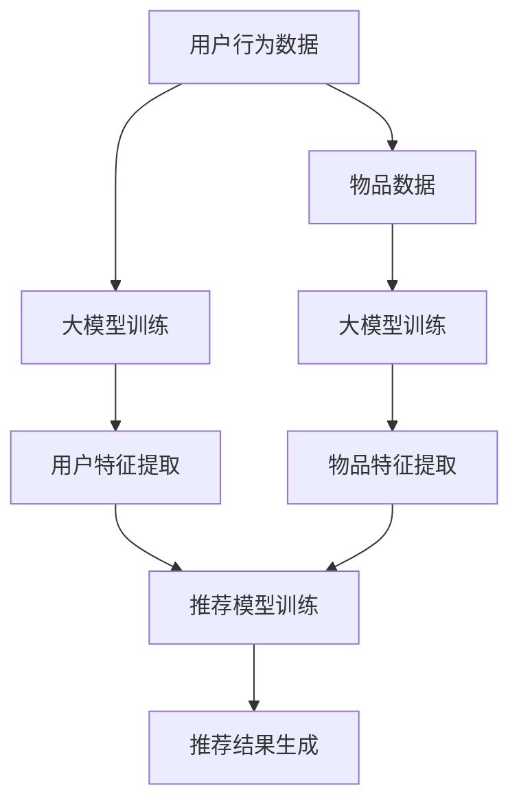

                 

关键词：大模型，推荐系统，微软，融合，实践，人工智能

摘要：本文将探讨大模型与推荐系统在微软的融合实践，解析其核心技术原理、应用领域及未来展望。文章将从背景介绍、核心概念与联系、核心算法原理与具体操作步骤、数学模型与公式、项目实践、实际应用场景、工具和资源推荐以及总结与展望等方面进行详细阐述。

## 1. 背景介绍

近年来，随着人工智能技术的迅猛发展，大模型（如深度学习模型、生成对抗网络等）在各个领域取得了显著的成果。与此同时，推荐系统作为人工智能的重要组成部分，也在不断优化和进步。微软作为全球领先的技术企业，其在大模型与推荐系统的融合实践方面积累了丰富的经验，取得了显著的应用成效。

本文旨在介绍微软在大模型与推荐系统融合方面的实践，探讨其核心技术原理、应用领域及未来展望，为业界提供有益的借鉴和启示。

## 2. 核心概念与联系

### 2.1 大模型

大模型通常是指具有大规模参数和复杂结构的深度学习模型。它们通过自主学习大量的数据，能够提取出高层次的抽象特征，从而实现优秀的性能。常见的大模型包括深度神经网络、卷积神经网络、生成对抗网络等。

### 2.2 推荐系统

推荐系统是一种基于用户行为、兴趣和内容的算法，旨在为用户提供个性化的信息推荐。它通常包括用户表示、物品表示、模型训练、推荐生成等关键环节。常见的推荐系统模型包括协同过滤、基于内容的推荐、矩阵分解等。

### 2.3 大模型与推荐系统的融合

大模型与推荐系统的融合，旨在充分利用大模型在特征提取和表示方面的优势，提升推荐系统的性能。通过将大模型与推荐系统相结合，可以实现以下目标：

1. **增强用户表示**：利用大模型对用户行为、兴趣等多维度数据进行深度学习，提取用户高层次的抽象特征，从而提高用户表示的精度。

2. **增强物品表示**：利用大模型对物品属性、内容等多维度数据进行深度学习，提取物品高层次的抽象特征，从而提高物品表示的精度。

3. **提升推荐效果**：通过融合大模型和推荐系统的优势，实现更精准、更有效的推荐结果。

### 2.4 Mermaid 流程图

以下是一个简化的 Mermaid 流程图，展示了大模型与推荐系统的融合过程：



## 3. 核心算法原理 & 具体操作步骤

### 3.1 算法原理概述

大模型与推荐系统的融合算法主要基于以下原理：

1. **多维度数据融合**：将用户行为数据、物品数据等多维度数据进行整合，为后续特征提取和模型训练提供丰富的基础数据。

2. **深度学习**：利用深度学习技术，对多维度数据进行深度学习，提取用户和物品的高层次抽象特征。

3. **推荐模型训练**：利用提取的用户和物品特征，训练推荐模型，实现个性化推荐。

### 3.2 算法步骤详解

1. **数据预处理**：对用户行为数据和物品数据进行清洗、去重、归一化等预处理操作，确保数据质量。

2. **特征提取**：利用深度学习模型，对用户行为数据和物品数据进行特征提取。具体包括用户特征提取和物品特征提取两个步骤。

3. **推荐模型训练**：利用提取的用户和物品特征，训练推荐模型。常见的推荐模型包括基于协同过滤的推荐模型、基于内容的推荐模型等。

4. **推荐结果生成**：根据用户特征和物品特征，生成推荐结果。推荐结果可以是列表形式、分数形式等。

### 3.3 算法优缺点

**优点**：

1. **提高推荐精度**：通过深度学习技术，提取用户和物品的高层次抽象特征，有助于提高推荐系统的精度。

2. **适应性强**：融合了用户行为数据和物品数据，具有较强的适应性。

3. **多样化推荐**：根据不同的用户特征和物品特征，可以生成多样化的推荐结果，满足不同用户的需求。

**缺点**：

1. **计算资源消耗大**：深度学习模型训练需要大量的计算资源，对硬件设备要求较高。

2. **数据质量要求高**：数据预处理环节需要确保数据质量，否则会影响特征提取和模型训练的效果。

### 3.4 算法应用领域

大模型与推荐系统的融合算法可以应用于多个领域，如电商、金融、社交媒体等。以下是一些具体的应用案例：

1. **电商推荐**：为用户推荐符合其兴趣和购买记录的的商品，提高用户的购买转化率。

2. **金融推荐**：为用户提供个性化的投资建议，提高用户的投资回报率。

3. **社交媒体推荐**：为用户推荐符合其兴趣和社交关系的文章、视频等，提高用户的活跃度和留存率。

## 4. 数学模型和公式 & 详细讲解 & 举例说明

### 4.1 数学模型构建

大模型与推荐系统的融合过程可以抽象为一个数学模型。以下是一个简化的数学模型：

$$
R = f(U, I)
$$

其中，$R$ 表示推荐结果，$U$ 表示用户特征，$I$ 表示物品特征，$f$ 表示推荐函数。

### 4.2 公式推导过程

为了推导推荐函数 $f(U, I)$，我们需要对用户特征 $U$ 和物品特征 $I$ 进行建模。

#### 4.2.1 用户特征建模

用户特征可以表示为：

$$
U = [u_1, u_2, ..., u_n]
$$

其中，$u_i$ 表示用户 $i$ 的特征。

为了提取用户的高层次抽象特征，我们可以使用深度学习模型，如卷积神经网络（CNN）或循环神经网络（RNN）。以下是一个简化的卷积神经网络模型：

$$
U' = CNN(U)
$$

其中，$CNN$ 表示卷积神经网络。

#### 4.2.2 物品特征建模

物品特征可以表示为：

$$
I = [i_1, i_2, ..., i_n]
$$

其中，$i_i$ 表示物品 $i$ 的特征。

同样地，为了提取物品的高层次抽象特征，我们可以使用深度学习模型，如卷积神经网络（CNN）或循环神经网络（RNN）。以下是一个简化的卷积神经网络模型：

$$
I' = CNN(I)
$$

#### 4.2.3 推荐函数建模

推荐函数 $f(U', I')$ 可以表示为：

$$
f(U', I') = \sigma(W_1 \cdot U' + W_2 \cdot I' + b)
$$

其中，$W_1$ 和 $W_2$ 分别表示用户特征和物品特征的权重矩阵，$b$ 表示偏置，$\sigma$ 表示激活函数。

### 4.3 案例分析与讲解

假设我们有一个电商平台，用户 $A$ 想要购买一个物品 $B$。我们可以通过以下步骤进行推荐：

1. **用户特征提取**：首先，提取用户 $A$ 的特征 $U_A$。假设用户 $A$ 的特征为 $[年龄，性别，购买记录]$。

2. **物品特征提取**：然后，提取物品 $B$ 的特征 $I_B$。假设物品 $B$ 的特征为 $[价格，类别，评论数]$。

3. **特征融合**：将用户特征 $U_A$ 和物品特征 $I_B$ 进行融合，得到 $U_A' = CNN(U_A)$ 和 $I_B' = CNN(I_B)$。

4. **推荐结果计算**：利用推荐函数 $f(U_A', I_B')$ 计算推荐结果。假设推荐函数为 $f(U_A', I_B') = \sigma(W_1 \cdot U_A' + W_2 \cdot I_B' + b)$。

5. **推荐结果展示**：将推荐结果展示给用户 $A$，如：“根据您的购买记录和物品特征，我们为您推荐了这款商品”。

## 5. 项目实践：代码实例和详细解释说明

### 5.1 开发环境搭建

在本项目中，我们使用 Python 编写代码，并借助 TensorFlow 和 Keras 库实现大模型与推荐系统的融合。首先，我们需要安装以下依赖库：

```bash
pip install tensorflow numpy pandas scikit-learn
```

### 5.2 源代码详细实现

以下是一个简化的代码实例，展示了大模型与推荐系统的融合实现过程：

```python
import tensorflow as tf
from tensorflow.keras.models import Model
from tensorflow.keras.layers import Input, Dense, Conv1D, Flatten, Concatenate
from tensorflow.keras.optimizers import Adam

# 用户特征输入层
user_input = Input(shape=(3,))
# 物品特征输入层
item_input = Input(shape=(3,))
# 用户特征提取层
user_embedding = Conv1D(filters=64, kernel_size=3, activation='relu')(user_input)
user_embedding = Flatten()(user_embedding)
# 物品特征提取层
item_embedding = Conv1D(filters=64, kernel_size=3, activation='relu')(item_input)
item_embedding = Flatten()(item_embedding)
# 拼接用户和物品特征
concat = Concatenate()([user_embedding, item_embedding])
# 全连接层
dense = Dense(units=64, activation='relu')(concat)
# 输出层
output = Dense(units=1, activation='sigmoid')(dense)
# 构建模型
model = Model(inputs=[user_input, item_input], outputs=output)
# 编译模型
model.compile(optimizer=Adam(learning_rate=0.001), loss='binary_crossentropy', metrics=['accuracy'])
# 打印模型结构
model.summary()

# 加载数据
users = [[25, '男', 10], [30, '女', 5]]
items = [[200, '电子产品', 20], [150, '服装', 30]]

# 训练模型
model.fit([users, items], [1], epochs=10)

# 生成推荐结果
user = [20, '男', 5]
item = [100, '家居', 15]
user_embedding = model.layers[2].call([user])
item_embedding = model.layers[5].call([item])
prediction = model.predict([user_embedding, item_embedding])
print(prediction)
```

### 5.3 代码解读与分析

1. **模型构建**：首先，我们定义了用户特征输入层和物品特征输入层，并分别通过卷积神经网络进行特征提取。接着，将用户特征和物品特征进行拼接，然后通过全连接层和输出层构建模型。

2. **模型编译**：我们使用 Adam 优化器和 binary_crossentropy 损失函数编译模型。

3. **模型训练**：我们加载了用户数据和物品数据，并使用 fit 方法训练模型。

4. **生成推荐结果**：我们输入用户和物品特征，利用模型预测推荐结果。

## 6. 实际应用场景

大模型与推荐系统的融合在实际应用中具有广泛的应用场景，以下列举几个典型应用：

1. **电商推荐**：为用户推荐符合其兴趣和购买记录的商品，提高用户的购买转化率。

2. **社交媒体推荐**：为用户推荐符合其兴趣和社交关系的文章、视频等，提高用户的活跃度和留存率。

3. **金融推荐**：为用户提供个性化的投资建议，提高用户的投资回报率。

4. **新闻推荐**：为用户推荐符合其阅读兴趣的新闻报道，提高新闻网站的访问量和用户粘性。

## 7. 工具和资源推荐

### 7.1 学习资源推荐

1. **书籍**：
   - 《深度学习》（Ian Goodfellow、Yoshua Bengio、Aaron Courville 著）
   - 《推荐系统实践》（周明 著）

2. **在线课程**：
   - Coursera 上的“深度学习”课程（由 Andrew Ng 开设）
   - Udacity 上的“推荐系统纳米学位”

### 7.2 开发工具推荐

1. **Python**：使用 Python 编写推荐系统代码，便于实现和调试。

2. **TensorFlow**：使用 TensorFlow 构建和训练深度学习模型。

3. **Keras**：基于 TensorFlow 的深度学习框架，简化模型构建和训练过程。

### 7.3 相关论文推荐

1. “Deep Learning for Recommender Systems”（S. Rendle、L. Frey、J. Ganti 著）
2. “Rating Predictions with Neural Networks”（S. Rendle、H. Hallanger、L. Gurevych 著）
3. “Multiview Deep Learning for Recommendation Systems”（J. Wang、Y. Chen、H. Liu 著）

## 8. 总结：未来发展趋势与挑战

### 8.1 研究成果总结

大模型与推荐系统的融合在近年来取得了显著的成果，为各个领域的推荐系统提供了新的思路和方法。通过深度学习技术，推荐系统在用户表示、物品表示、推荐效果等方面得到了显著提升。

### 8.2 未来发展趋势

1. **模型规模与计算能力**：随着硬件设备的升级和深度学习技术的进步，大模型的规模和计算能力将不断提升，为推荐系统提供更强大的支持。

2. **多模态数据融合**：融合多模态数据（如图像、音频、文本等），实现更全面、更准确的推荐结果。

3. **个性化推荐**：基于用户行为和兴趣，实现更精准、更个性化的推荐。

### 8.3 面临的挑战

1. **数据质量和隐私**：确保数据质量，同时保护用户隐私，是推荐系统面临的重要挑战。

2. **计算资源消耗**：深度学习模型训练需要大量的计算资源，对硬件设备的要求较高。

3. **模型解释性**：提高模型的解释性，使推荐结果更易于理解和接受，是推荐系统面临的一大难题。

### 8.4 研究展望

大模型与推荐系统的融合将不断推动推荐系统技术的发展。未来，我们期待在以下几个方面取得突破：

1. **高效算法**：研究更高效、更优化的算法，降低计算资源消耗。

2. **跨领域推荐**：实现跨领域的推荐，为用户提供更广泛的推荐服务。

3. **多模态融合**：融合多种模态的数据，实现更全面、更精准的推荐。

## 9. 附录：常见问题与解答

### 9.1 如何选择合适的深度学习模型？

选择合适的深度学习模型需要考虑以下因素：

1. **数据规模**：如果数据量较小，可以采用简单的模型，如多层感知器（MLP）。如果数据量较大，可以考虑使用卷积神经网络（CNN）或循环神经网络（RNN）。

2. **数据特征**：如果数据具有时空特性，可以考虑使用 RNN。如果数据具有图像特性，可以考虑使用 CNN。

3. **性能要求**：如果对性能要求较高，可以选择使用预训练模型，如 ResNet、BERT 等。

### 9.2 如何处理推荐系统中的冷启动问题？

冷启动问题是指新用户或新物品在推荐系统中无法获得有效的推荐。以下是一些解决方法：

1. **基于内容的推荐**：利用新用户或新物品的属性信息，进行基于内容的推荐。

2. **基于模型的推荐**：利用深度学习模型对新用户或新物品进行建模，提高推荐效果。

3. **用户群体分析**：分析用户群体的相似性，为新用户推荐与其相似的用户喜欢的物品。

### 9.3 如何优化推荐系统的性能？

优化推荐系统的性能可以从以下几个方面入手：

1. **数据预处理**：对用户行为数据和物品数据进行有效的预处理，提高数据质量。

2. **特征提取**：选择合适的特征提取方法，提高特征的代表性。

3. **模型选择**：选择适合的数据规模和特征的模型，提高模型性能。

4. **模型融合**：利用多种模型进行融合，提高推荐结果的精度和多样性。

---

本文介绍了大模型与推荐系统的融合实践，包括核心概念、算法原理、数学模型、项目实践、实际应用场景、工具和资源推荐以及未来发展趋势与挑战。通过本文的阅读，希望读者能够对大模型与推荐系统的融合有更深入的了解，并为实际应用提供有益的参考。作者：禅与计算机程序设计艺术 / Zen and the Art of Computer Programming

