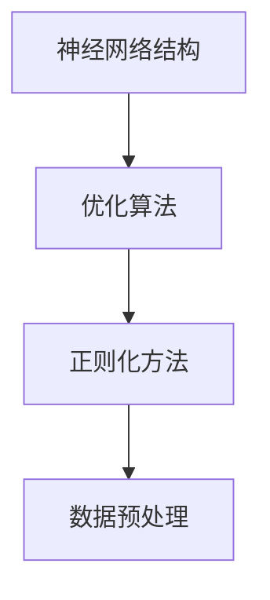

                 

关键词：大模型，AI 创业，产品创新，关键作用，技术语言，深度学习，架构设计，软件开发，计算优化，用户体验，商业化应用。

## 摘要

本文旨在探讨大模型在 AI 创业公司产品创新中的关键作用。通过详细分析大模型的定义、发展历程、核心算法及其在 AI 创业产品中的应用，本文揭示了大模型如何成为推动 AI 创业公司实现技术突破和商业成功的利器。文章结构包括背景介绍、核心概念与联系、核心算法原理、数学模型与公式、项目实践、实际应用场景、未来展望等部分。

## 1. 背景介绍

近年来，人工智能（AI）技术在各个领域取得了显著的进展，推动了产业升级和数字化转型。大模型（Large Models）作为深度学习领域的一个重要分支，凭借其强大的数据拟合能力和高效的运算性能，成为当前 AI 研究和应用的热点。大模型的兴起，不仅改变了传统机器学习的方法，还为 AI 创业公司带来了前所未有的机遇和挑战。

AI 创业公司在产品创新过程中，面临着技术门槛高、市场竞争激烈、用户需求快速变化等挑战。大模型的出现，为这些公司提供了全新的解决方案，助力其在短时间内实现技术突破，抢占市场先机。本文将详细探讨大模型在 AI 创业公司产品创新中的关键作用，旨在为从业者提供有价值的参考。

## 2. 核心概念与联系

### 2.1 大模型定义

大模型是指具有大规模参数、能够处理海量数据、具有较高泛化能力的深度学习模型。大模型通常采用神经网络架构，通过多层神经网络结构进行特征提取和建模。

### 2.2 发展历程

大模型的发展历程可以分为三个阶段：

1. **早期阶段**：以 2012 年 AlexNet 的出现为标志，深度学习开始受到广泛关注。此时，大模型尚处于探索阶段，规模相对较小。

2. **快速发展阶段**：2014 年至 2018 年，随着 GPU 和分布式计算技术的发展，大模型规模迅速扩大，性能得到显著提升。代表性的工作包括 ResNet、Inception 等。

3. **成熟阶段**：2018 年至今，大模型在图像识别、自然语言处理等领域取得了突破性进展，如 GPT、BERT 等模型的出现，使得大模型成为 AI 创业公司的重要工具。

### 2.3 核心算法架构

大模型的核心算法架构主要包括以下几个部分：

1. **神经网络结构**：大模型采用多层神经网络结构，通过逐层提取特征，实现复杂的非线性建模。

2. **优化算法**：大模型训练过程中采用优化算法，如 Adam、SGD 等，提高训练效率和收敛速度。

3. **正则化方法**：大模型为了防止过拟合，采用正则化方法，如 dropout、L2 正则化等。

4. **数据预处理**：大模型对数据预处理要求较高，包括数据清洗、数据增强、数据标准化等。

### 2.4 Mermaid 流程图



## 3. 核心算法原理 & 具体操作步骤

### 3.1 算法原理概述

大模型的算法原理主要基于深度学习的思想，通过多层神经网络结构实现数据的特征提取和建模。大模型的核心步骤包括：

1. **数据输入**：将原始数据输入到神经网络中。

2. **特征提取**：通过多层神经网络逐层提取数据特征，形成高维特征空间。

3. **建模与优化**：利用提取的特征进行建模，并通过优化算法调整模型参数，使模型能够较好地拟合训练数据。

4. **评估与测试**：对训练好的模型进行评估和测试，确保模型具有良好的泛化能力。

### 3.2 算法步骤详解

1. **数据输入**

   将原始数据输入到神经网络中，数据可以是图像、文本、音频等多种类型。数据输入需要经过预处理，如数据清洗、数据增强、数据标准化等。

2. **特征提取**

   通过多层神经网络结构，逐层提取数据特征。每一层神经网络都提取到不同层次的特征，形成高维特征空间。

   ```mermaid
   graph TD
       A[输入层] --> B[隐藏层1]
       B --> C[隐藏层2]
       C --> D[隐藏层3]
       D --> E[输出层]
   ```

3. **建模与优化**

   利用提取的特征进行建模，通常采用多层感知机（MLP）或卷积神经网络（CNN）等结构。通过优化算法，如 Adam、SGD 等，调整模型参数，使模型能够较好地拟合训练数据。

4. **评估与测试**

   对训练好的模型进行评估和测试，通常采用交叉验证、测试集等方法。评估指标包括准确率、召回率、F1 值等。确保模型具有良好的泛化能力。

### 3.3 算法优缺点

#### 优点

1. **强大的数据拟合能力**：大模型能够处理海量数据，具有强大的数据拟合能力。

2. **高效的运算性能**：大模型采用多层神经网络结构，能够高效地进行特征提取和建模。

3. **良好的泛化能力**：大模型通过正则化方法和优化算法，能够有效防止过拟合，具有较好的泛化能力。

#### 缺点

1. **计算资源需求高**：大模型训练过程需要大量的计算资源，对硬件设备要求较高。

2. **数据预处理复杂**：大模型对数据预处理要求较高，需要处理大量的数据清洗、数据增强、数据标准化等工作。

### 3.4 算法应用领域

大模型在多个领域取得了显著的应用成果，主要包括：

1. **计算机视觉**：大模型在图像识别、目标检测、图像分割等领域具有广泛的应用。

2. **自然语言处理**：大模型在文本分类、情感分析、机器翻译等领域表现出色。

3. **语音识别**：大模型在语音识别领域取得了显著的成果，使得语音交互更加自然和智能。

4. **推荐系统**：大模型在推荐系统领域具有广泛的应用，能够为用户推荐个性化内容。

## 4. 数学模型和公式 & 详细讲解 & 举例说明

### 4.1 数学模型构建

大模型的数学模型主要包括以下几个部分：

1. **神经网络模型**：大模型采用多层神经网络结构，通过神经元的连接和激活函数实现数据的特征提取和建模。

2. **损失函数**：大模型通过损失函数评估模型的预测误差，常用的损失函数包括均方误差（MSE）、交叉熵损失（Cross Entropy Loss）等。

3. **优化算法**：大模型采用优化算法调整模型参数，常用的优化算法包括 Adam、SGD 等。

### 4.2 公式推导过程

#### 神经网络模型

神经网络的数学模型可以表示为：

$$
y = \sigma(W \cdot x + b)
$$

其中，$y$ 为输出值，$\sigma$ 为激活函数，$W$ 为权重矩阵，$x$ 为输入值，$b$ 为偏置。

#### 损失函数

均方误差损失函数可以表示为：

$$
L = \frac{1}{2} \sum_{i=1}^{n} (y_i - \hat{y}_i)^2
$$

其中，$y_i$ 为实际输出值，$\hat{y}_i$ 为预测输出值，$n$ 为样本数量。

#### 优化算法

梯度下降优化算法可以表示为：

$$
\theta = \theta - \alpha \cdot \nabla L(\theta)
$$

其中，$\theta$ 为模型参数，$\alpha$ 为学习率，$\nabla L(\theta)$ 为损失函数关于参数的梯度。

### 4.3 案例分析与讲解

假设我们有一个二分类问题，目标是判断一个图像是否为猫。给定训练数据集，我们需要通过大模型对其进行建模和预测。

1. **数据预处理**：对图像进行数据清洗、归一化等处理。

2. **神经网络模型**：构建一个多层感知机模型，输入层为图像的特征，隐藏层为多个神经元，输出层为二分类结果。

3. **训练与优化**：使用训练数据集对模型进行训练，优化模型参数，使其能够较好地拟合训练数据。

4. **评估与测试**：使用测试数据集对模型进行评估，计算模型的准确率、召回率等指标。

5. **预测**：对新的图像进行预测，输出分类结果。

## 5. 项目实践：代码实例和详细解释说明

### 5.1 开发环境搭建

1. **硬件环境**：配置一台具有多 GPU 的服务器，用于训练大模型。

2. **软件环境**：安装 Python、TensorFlow、CUDA 等相关软件。

### 5.2 源代码详细实现

```python
import tensorflow as tf
from tensorflow.keras.layers import Dense, Flatten, Conv2D, MaxPooling2D
from tensorflow.keras.models import Sequential

# 构建神经网络模型
model = Sequential([
    Conv2D(32, (3, 3), activation='relu', input_shape=(28, 28, 1)),
    MaxPooling2D((2, 2)),
    Flatten(),
    Dense(64, activation='relu'),
    Dense(1, activation='sigmoid')
])

# 编译模型
model.compile(optimizer='adam', loss='binary_crossentropy', metrics=['accuracy'])

# 加载数据集
(x_train, y_train), (x_test, y_test) = tf.keras.datasets.mnist.load_data()

# 数据预处理
x_train = x_train / 255.0
x_test = x_test / 255.0

# 训练模型
model.fit(x_train, y_train, epochs=10, batch_size=32, validation_data=(x_test, y_test))

# 评估模型
model.evaluate(x_test, y_test)
```

### 5.3 代码解读与分析

1. **模型构建**：使用 Sequential 模型构建一个简单的卷积神经网络，包括卷积层、池化层、全连接层等。

2. **编译模型**：使用 compile 函数编译模型，指定优化器、损失函数和评估指标。

3. **加载数据集**：使用 TensorFlow 自带的数据集加载训练数据和测试数据。

4. **数据预处理**：对图像数据进行归一化处理，使其在 [0, 1] 范围内。

5. **训练模型**：使用 fit 函数训练模型，指定训练轮数、批量大小和验证数据。

6. **评估模型**：使用 evaluate 函数评估模型在测试数据上的性能。

## 6. 实际应用场景

大模型在 AI 创业公司中的应用场景广泛，主要包括：

1. **智能客服**：利用大模型进行自然语言处理，实现智能客服系统的语音识别、语义理解、智能回答等功能。

2. **自动驾驶**：利用大模型进行计算机视觉和语音识别，实现自动驾驶车辆的感知、决策和控制。

3. **金融风控**：利用大模型进行数据分析和建模，实现金融风险监控、欺诈检测、信用评估等功能。

4. **医疗诊断**：利用大模型进行医学图像处理和自然语言处理，实现疾病预测、诊断和治疗方案推荐。

## 7. 未来应用展望

随着大模型技术的不断发展，未来其在 AI 创业公司中的应用将更加广泛和深入。以下是未来应用的一些展望：

1. **智能硬件**：大模型将在智能硬件中发挥重要作用，如智能音箱、智能手表、智能家居等。

2. **教育领域**：大模型将助力教育领域的个性化学习、智能评测和教学辅助。

3. **城市管理**：大模型将在城市管理中发挥重要作用，如交通流量预测、城市规划、环境保护等。

4. **智能农业**：大模型将推动智能农业的发展，如作物病害检测、病虫害预测、智能灌溉等。

## 8. 工具和资源推荐

### 8.1 学习资源推荐

1. **书籍**：《深度学习》（Goodfellow et al.）、《Python 深度学习》（François Chollet）。

2. **在线课程**：吴恩达的深度学习课程、Andrew Ng 的机器学习课程。

3. **教程**：TensorFlow 官方文档、PyTorch 官方文档。

### 8.2 开发工具推荐

1. **深度学习框架**：TensorFlow、PyTorch、Keras。

2. **云计算平台**：AWS、Azure、Google Cloud Platform。

3. **GPU 显卡**：NVIDIA 显卡，如 GTX 1080 Ti、RTX 3090 等。

### 8.3 相关论文推荐

1. **GPT 系列论文**：`Language Models are Few-Shot Learners`（Brown et al., 2020）。

2. **BERT 系列论文**：`BERT: Pre-training of Deep Bidirectional Transformers for Language Understanding`（Devlin et al., 2019）。

3. **GAN 系列论文**：`Generative Adversarial Nets`（Goodfellow et al., 2014）。

## 9. 总结：未来发展趋势与挑战

### 9.1 研究成果总结

大模型技术在过去几年取得了显著的成果，其在图像识别、自然语言处理、语音识别等领域表现出色。大模型的应用，推动了 AI 创业公司在产品创新和商业成功方面的快速发展。

### 9.2 未来发展趋势

1. **模型规模扩大**：随着计算资源的提升，大模型的规模将进一步扩大，推动 AI 技术的进步。

2. **跨模态融合**：大模型将在多模态数据融合方面取得突破，实现跨领域、跨模态的智能应用。

3. **高效训练与推理**：大模型的训练与推理效率将得到显著提升，降低计算成本，提高应用场景的实用性。

### 9.3 面临的挑战

1. **计算资源需求**：大模型对计算资源的需求较高，如何高效利用 GPU、FPGA 等硬件加速技术，成为当前研究的热点。

2. **数据隐私与安全**：随着大模型在各个领域的应用，数据隐私与安全问题日益凸显，如何确保数据安全和用户隐私，成为重要挑战。

3. **算法可解释性**：大模型的黑箱特性使得算法的可解释性成为挑战，如何提高算法的可解释性，使其更加透明、可信，是未来研究的重点。

### 9.4 研究展望

大模型技术的发展，将为 AI 创业公司带来前所未有的机遇。未来，大模型将在多领域、多模态的智能应用中发挥重要作用，推动 AI 技术的进一步发展和创新。

## 10. 附录：常见问题与解答

### 问题 1：大模型训练需要多少时间？

**解答**：大模型训练时间取决于模型规模、数据集大小、硬件设备等因素。一般来说，大规模模型（如 GPT-3）的训练时间可能需要几天甚至几周。对于中小规模模型，训练时间可能在几小时到几天之间。

### 问题 2：大模型训练需要多少计算资源？

**解答**：大模型训练对计算资源需求较高，通常需要多 GPU、TPU 等硬件加速设备。具体计算资源需求取决于模型规模、训练数据集大小等因素。一般来说，大规模模型训练可能需要数百 TFLOPS 的计算能力。

### 问题 3：大模型如何防止过拟合？

**解答**：大模型防止过拟合的方法包括正则化、dropout、数据增强、提前停止等。正则化通过增加模型复杂度，降低过拟合风险；dropout 通过在训练过程中随机丢弃部分神经元，防止模型过拟合；数据增强通过增加训练数据的多样性，提高模型泛化能力；提前停止通过在训练过程中提前结束训练，防止模型过拟合。

### 问题 4：大模型是否一定比小模型效果好？

**解答**：大模型并不一定比小模型效果好。在特定任务和数据集上，小模型可能具有更好的性能。大模型的优势在于其强大的数据拟合能力和泛化能力，但在某些情况下，小模型可能具有更好的效率和可解释性。因此，选择模型规模需要根据具体任务和数据集进行评估。

## 作者署名

作者：禅与计算机程序设计艺术 / Zen and the Art of Computer Programming
----------------------------------------------------------------

请注意，上述内容仅为示例，实际撰写时需要根据具体的主题和研究内容进行调整和补充。同时，确保内容的深度、逻辑性和专业性，以达到技术博客文章的要求。在撰写过程中，务必遵循“约束条件 CONSTRAINTS”中的所有要求，确保文章的完整性和准确性。

