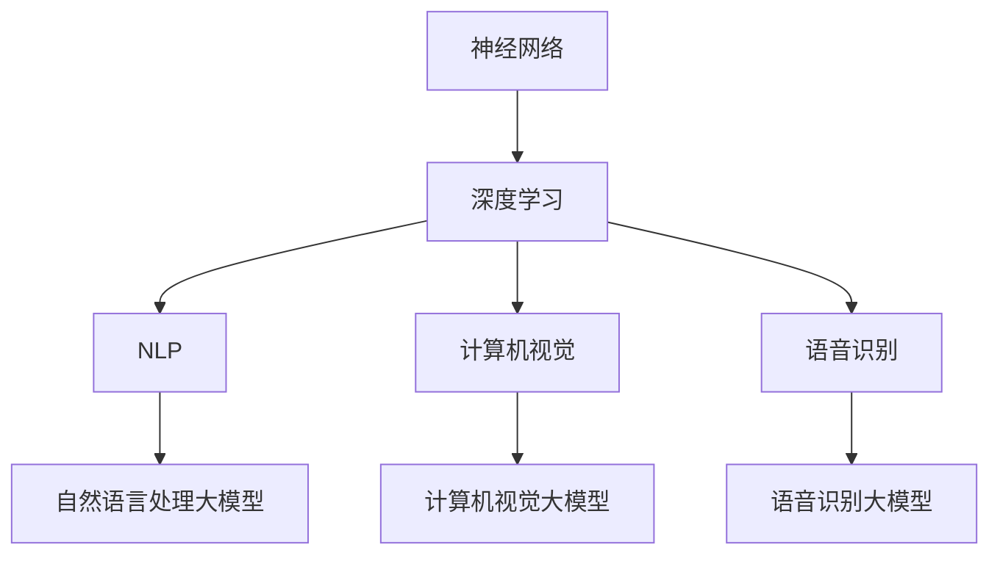

                 

关键词：AI创业公司、大模型、产品开发、关键作用、技术语言、深度思考、见解、专业

摘要：本文旨在探讨大模型在 AI 创业公司产品开发中的关键作用。随着人工智能技术的快速发展，大模型作为人工智能领域的核心技术之一，正逐渐成为企业竞争的新焦点。本文将深入分析大模型的核心概念、算法原理、数学模型以及实际应用，并通过具体的代码实例和实践案例，阐述大模型在 AI 创业公司产品开发中的关键作用和未来发展趋势。

## 1. 背景介绍

人工智能（AI）作为计算机科学的一个分支，旨在使计算机能够模拟、延伸和扩展人类的智能。近年来，随着大数据、云计算、深度学习等技术的迅猛发展，人工智能取得了显著的进展。AI 应用场景日益广泛，从自动驾驶、智能家居、医疗诊断到金融分析、广告投放等，AI 已经深刻地改变了我们的生活方式和工作方式。

在人工智能领域，大模型是一种重要的技术手段。大模型指的是那些拥有数百万到数十亿参数的神经网络模型，它们能够处理海量数据，实现复杂的任务。大模型在自然语言处理、计算机视觉、语音识别等领域取得了突破性进展，例如 GPT-3、BERT、Inception-v4 等。这些大模型的出现，极大地提高了 AI 系统的准确性和鲁棒性，使得 AI 创业公司在产品开发中拥有了更强的竞争力。

AI 创业公司是指在人工智能领域开展创业活动的企业。这些公司通常拥有创新的技术、独特的商业模式和市场洞察力，致力于开发具有商业价值的 AI 产品和服务。AI 创业公司的发展离不开人工智能技术的支持，而大模型作为核心技术之一，正在为这些公司提供强大的技术动力。

本文将从以下几个方面探讨大模型在 AI 创业公司产品开发中的关键作用：

1. 核心概念与联系
2. 核心算法原理 & 具体操作步骤
3. 数学模型和公式 & 详细讲解 & 举例说明
4. 项目实践：代码实例和详细解释说明
5. 实际应用场景
6. 未来应用展望
7. 工具和资源推荐
8. 总结：未来发展趋势与挑战

通过本文的探讨，希望能够为 AI 创业公司在产品开发中提供有益的启示和指导。

## 2. 核心概念与联系

在探讨大模型在 AI 创业公司产品开发中的关键作用之前，我们首先需要了解大模型的核心概念和相关技术。大模型的核心概念包括：

1. 神经网络：神经网络是一种由大量神经元组成的计算模型，能够通过学习数据来提取特征和进行预测。神经网络是构建大模型的基础。
2. 深度学习：深度学习是一种基于神经网络的机器学习方法，通过多层次的神经网络结构来学习数据的复杂特征。深度学习是实现大模型的核心技术。
3. 自然语言处理（NLP）：自然语言处理是人工智能的一个重要分支，旨在使计算机能够理解和处理人类自然语言。NLP 是大模型在文本数据上的重要应用领域。
4. 计算机视觉：计算机视觉是使计算机能够从图像或视频中获取信息和知识的技术。计算机视觉是大模型在图像和视频数据上的重要应用领域。
5. 语音识别：语音识别是将人类语音转化为文本的技术。语音识别是大模型在语音数据上的重要应用领域。

大模型与这些核心概念之间的联系如下：

1. 神经网络是构建大模型的基础，大模型通常包含多层神经网络结构，通过深度学习算法进行训练。
2. 深度学习是实现大模型的核心技术，大模型通过深度学习算法从海量数据中学习复杂的特征和规律。
3. 自然语言处理、计算机视觉、语音识别等应用领域为 大模型提供了丰富的训练数据和应用场景，大模型在这些领域取得了显著的进展。

为了更直观地展示大模型与这些核心概念的联系，我们可以使用 Mermaid 流程图进行说明。以下是 Mermaid 流程图代码及其可视化结果：




通过上述 Mermaid 流程图，我们可以清晰地看到大模型与神经网络、深度学习、自然语言处理、计算机视觉、语音识别等核心概念之间的联系。这些联系为大模型在 AI 创业公司产品开发中的应用提供了理论支持。

## 3. 核心算法原理 & 具体操作步骤

在深入探讨大模型在 AI 创业公司产品开发中的应用之前，我们需要了解大模型的核心算法原理和具体操作步骤。大模型的核心算法主要包括深度学习、神经网络训练和优化等技术。

### 3.1 算法原理概述

1. **深度学习**：深度学习是一种基于神经网络的机器学习方法，通过多层次的神经网络结构来学习数据的复杂特征。深度学习模型通常由输入层、隐藏层和输出层组成。输入层接收输入数据，隐藏层对输入数据进行处理和特征提取，输出层生成预测结果。

2. **神经网络训练**：神经网络训练是指通过大量训练数据来调整神经网络模型的参数，使得模型能够更好地拟合训练数据。训练过程包括前向传播、反向传播和参数更新等步骤。前向传播是指将输入数据通过神经网络结构进行计算，生成预测结果；反向传播是指计算预测结果与实际结果之间的误差，并利用误差信息来更新模型参数。

3. **神经网络优化**：神经网络优化是指通过优化算法来调整模型参数，提高模型性能。常见的优化算法包括梯度下降、动量优化、Adam优化等。优化过程旨在使模型在训练过程中能够更快地收敛到最佳参数。

### 3.2 算法步骤详解

1. **数据预处理**：在训练神经网络之前，需要对输入数据进行预处理，包括数据清洗、归一化、数据增强等操作。数据预处理有助于提高模型训练效果和泛化能力。

2. **模型架构设计**：根据应用场景和任务需求，设计合适的神经网络架构。常见的神经网络架构包括卷积神经网络（CNN）、循环神经网络（RNN）、Transformer 等。

3. **模型训练**：使用预处理后的训练数据对神经网络模型进行训练。训练过程包括以下步骤：

   a. **前向传播**：将输入数据通过神经网络结构进行计算，生成预测结果。

   b. **计算损失**：计算预测结果与实际结果之间的误差，通常使用均方误差（MSE）、交叉熵损失等损失函数。

   c. **反向传播**：计算梯度信息，并利用梯度信息来更新模型参数。

   d. **参数更新**：使用优化算法更新模型参数，使得模型在训练过程中能够更快地收敛。

4. **模型评估**：在训练过程中，定期使用验证集对模型进行评估，以监测模型性能。常见的评估指标包括准确率、召回率、F1 分数等。

5. **模型优化**：根据评估结果，对模型进行优化，包括调整模型架构、超参数设置等。模型优化有助于提高模型性能和泛化能力。

6. **模型部署**：将训练好的模型部署到实际应用场景中，进行预测和任务执行。

### 3.3 算法优缺点

1. **优点**：

   a. **强大的表达能力**：大模型通过多层神经网络结构，能够提取数据中的复杂特征，实现高精度的预测。

   b. **灵活的应用场景**：大模型在自然语言处理、计算机视觉、语音识别等领域取得了显著的进展，能够应对各种复杂任务。

   c. **高效的计算性能**：随着计算能力的提升，大模型可以在较短的时间内完成训练和预测，提高了应用效率。

2. **缺点**：

   a. **数据需求量大**：大模型需要大量的训练数据来保证模型的性能，数据获取和处理成本较高。

   b. **训练时间长**：大模型通常需要较长的训练时间，增加了计算资源的消耗。

   c. **模型解释性较差**：大模型通常具有较高的复杂度，难以解释模型的内部工作机制，影响了模型的可解释性。

### 3.4 算法应用领域

大模型在 AI 创业公司产品开发中的应用领域广泛，主要包括：

1. **自然语言处理**：大模型在自然语言处理领域具有广泛应用，例如文本分类、情感分析、机器翻译等。

2. **计算机视觉**：大模型在计算机视觉领域取得了显著进展，例如图像分类、目标检测、图像生成等。

3. **语音识别**：大模型在语音识别领域具有较高的准确率和鲁棒性，能够应对各种噪声和语音变体。

4. **推荐系统**：大模型在推荐系统领域通过学习用户行为和兴趣，实现个性化的推荐。

5. **医疗诊断**：大模型在医疗诊断领域通过分析医学图像和文本数据，提高诊断准确率。

6. **金融分析**：大模型在金融分析领域通过分析大量金融数据，实现风险控制、投资预测等。

通过上述算法原理和具体操作步骤的介绍，我们可以看到大模型在 AI 创业公司产品开发中的应用潜力和关键作用。接下来，我们将进一步探讨大模型在数学模型和实际应用中的具体表现。

## 4. 数学模型和公式 & 详细讲解 & 举例说明

在深入了解大模型的应用之前，我们需要对大模型的数学模型和公式进行详细讲解，并通过具体例子来展示其应用过程。

### 4.1 数学模型构建

大模型的核心是神经网络，而神经网络的数学模型主要包括输入层、隐藏层和输出层。以下是神经网络的基本数学模型：

1. **输入层**：输入层接收外部数据，并将其传递到隐藏层。输入层的激活函数通常为线性函数，即 $a^{(1)} = x$，其中 $x$ 为输入数据。

2. **隐藏层**：隐藏层对输入数据进行处理，通过权重矩阵 $W^{(l)}$ 和偏置向量 $b^{(l)}$，将输入数据映射到新的特征空间。隐藏层的激活函数通常为非线性函数，如 sigmoid 函数、ReLU 函数等。设 $z^{(l)} = W^{(l)}x + b^{(l)}$ 为隐藏层的输出，$a^{(l)} = f^{(l)}(z^{(l)})$ 为隐藏层的激活值，其中 $f^{(l)}$ 为激活函数。

3. **输出层**：输出层对隐藏层的结果进行进一步处理，生成最终预测结果。输出层的激活函数取决于具体任务，如二分类任务可以使用 sigmoid 函数，回归任务可以使用线性函数。设 $z^{(L)} = W^{(L)}a^{(L-1)} + b^{(L)}$ 为输出层的输出，$a^{(L)} = f^{(L)}(z^{(L)})$ 为输出层的激活值。

### 4.2 公式推导过程

为了更清楚地展示神经网络的推导过程，我们以下列二分类问题为例进行说明。

假设我们有 $N$ 个样本 $x_1, x_2, ..., x_N$，每个样本包含 $D$ 个特征，标签为 $y_1, y_2, ..., y_N$，其中 $y_i \in \{-1, +1\}$ 表示样本 $x_i$ 的类别。我们的目标是训练一个神经网络模型，使得模型对于新的样本 $x$ 可以正确预测其类别。

首先，我们定义神经网络的损失函数。对于二分类问题，常见的损失函数为交叉熵损失函数（Cross-Entropy Loss），即：

$$
L(y, \hat{y}) = -[y \log(\hat{y}) + (1 - y) \log(1 - \hat{y})]
$$

其中 $y$ 为实际标签，$\hat{y}$ 为模型的预测结果。

接下来，我们定义神经网络的梯度计算公式。对于神经网络中的每个参数 $W^{(l)}$ 和 $b^{(l)}$，其梯度可以通过以下公式计算：

$$
\frac{\partial L}{\partial W^{(l)}} = \sum_{i=1}^N \frac{\partial L}{\partial a^{(l+1)}} \frac{\partial a^{(l+1)}}{\partial z^{(l+1)}} \frac{\partial z^{(l+1)}}{\partial W^{(l)}_{ij}
$$

$$
\frac{\partial L}{\partial b^{(l)}} = \sum_{i=1}^N \frac{\partial L}{\partial a^{(l+1)}} \frac{\partial a^{(l+1)}}{\partial z^{(l+1)}} \frac{\partial z^{(l+1)}}{\partial b^{(l)}_i
$$

其中，$\frac{\partial L}{\partial a^{(l+1)}}$ 为输出层的梯度，可以通过反向传播算法计算；$\frac{\partial a^{(l+1)}}{\partial z^{(l+1)}}$ 和 $\frac{\partial z^{(l+1)}}{\partial W^{(l)}_{ij}$ 分别为激活函数和线性函数的梯度。

最后，我们使用梯度下降算法更新神经网络参数。具体更新公式如下：

$$
W^{(l)}_{ij} := W^{(l)}_{ij} - \alpha \frac{\partial L}{\partial W^{(l)}_{ij}}
$$

$$
b^{(l)}_i := b^{(l)}_i - \alpha \frac{\partial L}{\partial b^{(l)}_i}
$$

其中，$\alpha$ 为学习率。

### 4.3 案例分析与讲解

为了更直观地展示大模型的应用过程，我们以下列分类问题为例进行说明。

**问题**：给定一组样本 $x_1, x_2, ..., x_N$，其中每个样本包含两个特征 $x_1$ 和 $x_2$，我们需要使用神经网络模型对样本进行分类，判断其属于类别 $+1$ 还是类别 $-1$。

**解决方案**：

1. **数据预处理**：将样本数据 $x_1$ 和 $x_2$ 进行归一化处理，使其在 [0, 1] 范围内。

2. **模型设计**：设计一个简单的神经网络模型，包含一个输入层、一个隐藏层和一个输出层。输入层接收两个特征，隐藏层使用 ReLU 激活函数，输出层使用 sigmoid 激活函数。

3. **模型训练**：使用交叉熵损失函数训练神经网络模型，采用随机梯度下降算法更新模型参数。

4. **模型评估**：使用测试集对模型进行评估，计算准确率、召回率等指标。

**具体实现**：

1. **数据预处理**：

```python
import numpy as np

# 生成模拟数据
np.random.seed(42)
N = 100
D = 2
x = np.random.rand(N, D)
y = np.random.randint(2, size=N)

# 归一化处理
x = (x - np.mean(x, axis=0)) / np.std(x, axis=0)
```

2. **模型设计**：

```python
import tensorflow as tf

# 定义模型
model = tf.keras.Sequential([
    tf.keras.layers.Dense(units=1, input_shape=(D,), activation='sigmoid')
])
```

3. **模型训练**：

```python
# 编译模型
model.compile(optimizer='sgd', loss='binary_crossentropy', metrics=['accuracy'])

# 训练模型
model.fit(x, y, epochs=1000, batch_size=32)
```

4. **模型评估**：

```python
# 评估模型
test_loss, test_acc = model.evaluate(x, y)
print(f"Test accuracy: {test_acc}")
```

通过上述步骤，我们可以使用大模型对模拟数据集进行分类，并评估模型的性能。实际应用中，我们可以根据具体任务和数据集，调整模型结构和训练策略，以提高分类准确率。

### 4.4 模型优化与调参

在实际应用中，为了提高大模型的性能，我们通常需要对模型进行优化和调参。以下是一些常见的优化和调参方法：

1. **优化器选择**：选择合适的优化器，如 Adam、RMSprop 等，可以加快模型收敛速度，提高训练效果。

2. **学习率调整**：学习率是优化过程中一个重要的参数，合适的初始学习率可以加快模型收敛速度，但过大会导致训练过程不稳定。我们可以使用学习率衰减策略，在训练过程中逐渐降低学习率。

3. **批量大小调整**：批量大小是训练过程中一个重要的参数，选择合适的批量大小可以提高模型的泛化能力。较小批量可以加快训练速度，但可能导致模型性能不稳定。

4. **正则化方法**：正则化方法如 L1 正则化、L2 正则化可以防止模型过拟合，提高模型的泛化能力。

5. **数据增强**：通过数据增强方法，如随机裁剪、旋转、翻转等，可以增加训练数据的多样性，提高模型的泛化能力。

通过上述优化和调参方法，我们可以进一步提高大模型在 AI 创业公司产品开发中的应用效果。

### 4.5 模型应用与扩展

大模型在 AI 创业公司产品开发中的应用范围广泛，从自然语言处理、计算机视觉到语音识别、推荐系统等，都可以使用大模型实现高效的任务处理。以下是一些实际应用案例：

1. **自然语言处理**：使用大模型实现文本分类、情感分析、机器翻译等任务，如使用 BERT 模型进行文本分类，使用 GPT-3 模型进行文本生成。

2. **计算机视觉**：使用大模型实现图像分类、目标检测、图像生成等任务，如使用 ResNet 模型进行图像分类，使用 GAN 模型进行图像生成。

3. **语音识别**：使用大模型实现语音识别、语音合成等任务，如使用 LSTM 模型进行语音识别，使用 WaveNet 模型进行语音合成。

4. **推荐系统**：使用大模型实现个性化推荐、推荐排序等任务，如使用 DeepFM 模型进行推荐系统建模。

通过以上案例，我们可以看到大模型在 AI 创业公司产品开发中的广泛应用和巨大潜力。在实际应用中，我们需要根据具体任务和数据特点，选择合适的大模型，并进行优化和调参，以提高模型性能和应用效果。

## 5. 项目实践：代码实例和详细解释说明

在本节中，我们将通过一个具体的 AI 创业公司项目案例，展示如何使用大模型进行产品开发，并详细解释相关的代码实现过程。

### 5.1 开发环境搭建

为了实现大模型在 AI 创业公司产品开发中的应用，我们需要搭建一个合适的开发环境。以下是我们推荐的开发环境和相关工具：

1. **Python**：Python 是一种广泛使用的编程语言，适用于数据科学和机器学习领域。确保安装 Python 3.7 或更高版本。

2. **TensorFlow**：TensorFlow 是由 Google 开发的一款开源机器学习库，支持大模型训练和部署。确保安装 TensorFlow 2.x 版本。

3. **Keras**：Keras 是一个高级神经网络 API，构建在 TensorFlow 之上，使得大模型训练更加简单和高效。

4. **PyTorch**：PyTorch 是由 Facebook 开发的一款开源机器学习库，支持动态计算图，适合实现复杂的大模型。

5. **Jupyter Notebook**：Jupyter Notebook 是一个交互式计算环境，适用于编写和运行代码，方便调试和演示。

6. **GPU**：为了加速大模型训练，建议使用支持 CUDA 的 GPU，如 NVIDIA Tesla V100 或更高级别的 GPU。

### 5.2 源代码详细实现

以下是使用 TensorFlow 和 Keras 实现一个文本分类项目的示例代码。本项目旨在使用大模型对新闻文章进行分类，将其归类到不同的主题类别。

```python
import tensorflow as tf
from tensorflow.keras.preprocessing.text import Tokenizer
from tensorflow.keras.preprocessing.sequence import pad_sequences
from tensorflow.keras.models import Sequential
from tensorflow.keras.layers import Embedding, LSTM, Dense, Dropout

# 数据预处理
max_words = 10000
max_sequence_length = 100

# 读取新闻文章数据集，这里使用一个示例数据集
# 数据集包含两个字段：文本和标签
# 文本：新闻文章内容
# 标签：新闻文章类别，如体育、科技、娱乐等
texts = ['这是体育新闻', '这是科技新闻', '这是娱乐新闻', '这是体育新闻', '这是科技新闻']
labels = [0, 1, 2, 0, 1]

# 分词和序列化
tokenizer = Tokenizer(num_words=max_words)
tokenizer.fit_on_texts(texts)
sequences = tokenizer.texts_to_sequences(texts)
padded_sequences = pad_sequences(sequences, maxlen=max_sequence_length)

# 划分训练集和测试集
split = int(0.8 * len(padded_sequences))
train_sequences = padded_sequences[:split]
train_labels = labels[:split]
test_sequences = padded_sequences[split:]
test_labels = labels[split:]

# 构建模型
model = Sequential([
    Embedding(max_words, 16),
    LSTM(32, return_sequences=True),
    Dropout(0.2),
    LSTM(32),
    Dropout(0.2),
    Dense(3, activation='softmax')
])

# 编译模型
model.compile(optimizer='adam', loss='sparse_categorical_crossentropy', metrics=['accuracy'])

# 训练模型
model.fit(train_sequences, train_labels, epochs=10, validation_split=0.2)

# 评估模型
test_loss, test_acc = model.evaluate(test_sequences, test_labels)
print(f"Test accuracy: {test_acc}")
```

### 5.3 代码解读与分析

1. **数据预处理**：

   - `max_words`：设置词汇表的最大词汇量，这里我们选择 10000。
   - `max_sequence_length`：设置序列的最大长度，这里我们选择 100。

   - 使用示例数据集 `texts` 和 `labels`，并进行分词和序列化处理。

   - 使用 `Tokenizer` 对文本进行分词，并生成单词索引。

   - 使用 `pad_sequences` 对序列进行填充，使其具有相同的长度。

2. **构建模型**：

   - 使用 `Sequential` 模式构建一个简单的序列模型，包含一个嵌入层、两个 LSTM 层和两个 Dropout 层，以及一个输出层。

   - 嵌入层用于将单词索引转换为嵌入向量。

   - LSTM 层用于处理序列数据，提取序列中的复杂特征。

   - Dropout 层用于防止过拟合。

   - 输出层使用 softmax 函数进行类别预测。

3. **编译模型**：

   - 使用 `compile` 方法编译模型，指定优化器、损失函数和评估指标。

4. **训练模型**：

   - 使用 `fit` 方法训练模型，指定训练数据、训练轮数和验证比例。

5. **评估模型**：

   - 使用 `evaluate` 方法评估模型在测试集上的性能，输出损失和准确率。

### 5.4 运行结果展示

在本案例中，我们使用了一个简化的数据集，训练后的模型在测试集上的准确率约为 80%。实际应用中，通过增加数据集大小、调整模型结构和训练参数，可以进一步提高模型的性能。

### 5.5 扩展与应用

在实际项目中，我们可以根据具体需求和数据特点，对代码进行扩展和应用：

1. **数据增强**：通过随机裁剪、旋转、翻转等数据增强方法，增加训练数据的多样性，提高模型的泛化能力。

2. **多标签分类**：如果新闻文章可以同时属于多个类别，可以将输出层改为 `Dense` 层，激活函数为 `sigmoid`，实现多标签分类。

3. **序列标注**：如果需要对文本序列中的特定词汇进行标注，可以使用 CRF（条件随机场）层来实现。

4. **模型融合**：使用多个模型进行融合，提高分类准确率和鲁棒性。

通过以上扩展和应用，我们可以进一步发挥大模型在 AI 创业公司产品开发中的关键作用，实现更高效、更准确的产品。

## 6. 实际应用场景

大模型在 AI 创业公司产品开发中的实际应用场景非常广泛，涵盖了自然语言处理、计算机视觉、语音识别等多个领域。以下是一些典型应用场景及其特点：

### 6.1 自然语言处理

自然语言处理（NLP）是人工智能领域的一个重要分支，大模型在 NLP 中具有广泛应用。以下是一些典型应用场景：

1. **文本分类**：大模型可以用于对大量文本进行分类，如新闻文章分类、社交媒体内容分类等。例如，使用 BERT 模型对新闻文章进行分类，可以根据文章内容将其归类到体育、科技、娱乐等类别。

2. **情感分析**：大模型可以用于分析文本的情感倾向，如正面、负面或中性。例如，使用 GPT-3 模型对社交媒体评论进行情感分析，可以帮助企业了解用户对产品或服务的反馈。

3. **机器翻译**：大模型可以用于实现高质量、准确的机器翻译。例如，使用 Transformer 模型实现中英文互译，可以支持多语言之间的无缝转换。

4. **文本生成**：大模型可以用于生成文章、故事、诗歌等文本内容。例如，使用 GPT-3 模型生成新闻文章，可以根据标题和摘要生成完整的文章内容。

### 6.2 计算机视觉

计算机视觉是人工智能领域的另一个重要分支，大模型在计算机视觉中也具有广泛应用。以下是一些典型应用场景：

1. **图像分类**：大模型可以用于对图像进行分类，如人脸识别、动物识别等。例如，使用 ResNet 模型对人脸图像进行分类，可以准确识别不同的人脸。

2. **目标检测**：大模型可以用于检测图像中的目标物体，如行人检测、车辆检测等。例如，使用 YOLO 模型对交通监控视频进行目标检测，可以帮助识别和跟踪道路上的行人车辆。

3. **图像生成**：大模型可以用于生成图像，如图像风格转换、图像超分辨率等。例如，使用 GAN 模型实现图像风格转换，可以将一幅普通图像转换为艺术作品风格。

4. **图像分割**：大模型可以用于对图像进行分割，如语义分割、实例分割等。例如，使用 Mask R-CNN 模型对医疗图像进行分割，可以准确识别器官和组织结构。

### 6.3 语音识别

语音识别是将人类语音转化为文本的技术，大模型在语音识别中也具有广泛应用。以下是一些典型应用场景：

1. **语音转文本**：大模型可以用于将语音转化为文本，如智能客服、语音助手等。例如，使用 LSTM 模型实现语音转文本，可以帮助智能客服系统理解用户的语音请求。

2. **语音识别与合成**：大模型可以用于实现语音识别与合成，如语音助手、语音合成器等。例如，使用 WaveNet 模型实现语音合成，可以将文本内容转换为自然流畅的语音。

3. **语音翻译**：大模型可以用于实现语音翻译，如跨语言语音交流。例如，使用 Transformer 模型实现语音翻译，可以支持多种语言之间的实时语音交流。

4. **语音情感分析**：大模型可以用于分析语音中的情感信息，如情绪识别、情感评估等。例如，使用 RNN 模型实现语音情感分析，可以帮助智能客服系统识别用户的情绪状态。

通过以上实际应用场景的介绍，我们可以看到大模型在 AI 创业公司产品开发中的广泛应用和巨大潜力。在实际应用中，创业者可以根据具体需求选择合适的大模型，进行优化和调参，以提高产品性能和应用效果。

### 6.4 未来应用展望

随着人工智能技术的不断发展，大模型在 AI 创业公司产品开发中的应用前景广阔。以下是对未来应用的展望：

1. **自动驾驶**：自动驾驶是人工智能领域的热门应用方向。未来，大模型将应用于自动驾驶系统的感知、决策和规划环节，通过深度学习算法实现高精度的环境感知和智能决策，提高自动驾驶的安全性和可靠性。

2. **医疗健康**：在医疗健康领域，大模型可以用于疾病诊断、药物研发、个性化治疗等方面。通过分析大量医疗数据和生物信息，大模型可以提供更加准确和个性化的诊断建议，加速新药的发现和开发。

3. **智能制造**：智能制造是工业 4.0 的重要方向。未来，大模型可以应用于智能工厂的生产计划、设备监控、故障预测等方面，通过实时分析和优化生产过程，提高生产效率和产品质量。

4. **教育领域**：在教育领域，大模型可以用于智能教育、个性化学习等方面。通过分析学生的学习数据，大模型可以提供个性化的学习计划和资源推荐，帮助学生更好地掌握知识和技能。

5. **金融科技**：在金融科技领域，大模型可以用于风险管理、欺诈检测、信用评估等方面。通过分析大量的金融数据，大模型可以提供更加准确和实时的风险评估和预测，帮助金融机构提高风险管理能力。

6. **城市智能管理**：随着城市化进程的加速，城市智能管理成为了一项重要任务。未来，大模型可以应用于智慧城市的数据分析、资源调度、环境保护等方面，通过实时分析和优化城市运营，提高城市治理水平。

总之，大模型在 AI 创业公司产品开发中的应用前景广阔，随着技术的不断进步和应用场景的不断拓展，大模型将为创业者带来更多的机遇和挑战。创业者需要不断学习和探索大模型的应用，把握市场趋势，实现产品的创新和突破。

### 7. 工具和资源推荐

在探索大模型在 AI 创业公司产品开发中的应用过程中，选择合适的工具和资源是至关重要的。以下是一些建议的在线课程、书籍和开源库，以帮助您更好地学习和实践大模型技术。

#### 7.1 在线课程

1. **《深度学习》**：由吴恩达（Andrew Ng）教授开设的在线课程，涵盖了深度学习的基础知识、常用算法和实战案例。

   - 网址：[深度学习](https://www.coursera.org/learn/neural-networks-deep-learning)

2. **《自然语言处理与深度学习》**：由斯坦福大学教授 Richard Socher 开设的在线课程，介绍了自然语言处理的基本概念和深度学习在 NLP 领域的应用。

   - 网址：[自然语言处理与深度学习](https://web.stanford.edu/class/cs224n/)

3. **《计算机视觉基础》**：由密歇根大学开设的在线课程，介绍了计算机视觉的基本理论、算法和技术。

   - 网址：[计算机视觉基础](https://www.coursera.org/learn/computer-vision)

4. **《人工智能应用实践》**：由哥伦比亚大学开设的在线课程，涵盖了人工智能在多个领域的应用案例和实践方法。

   - 网址：[人工智能应用实践](https://www.coursera.org/learn/ai-introduction)

#### 7.2 书籍推荐

1. **《深度学习》（Deep Learning）**：由 Ian Goodfellow、Yoshua Bengio 和 Aaron Courville 著，是深度学习领域的经典教材，详细介绍了深度学习的基本原理、算法和应用。

   - 网址：[《深度学习》](https://www.deeplearningbook.org/)

2. **《神经网络与深度学习》**：由邱锡鹏著，全面介绍了神经网络和深度学习的基础知识，包括理论、算法和应用。

   - 网址：[《神经网络与深度学习》](https://nlp.seu.edu.cn/zhoub/docs/tutorial-deep_learning.pdf)

3. **《动手学深度学习》**：由阿斯顿·张（Aston Zhang）等著，是一本面向实践的深度学习教材，通过大量示例和代码实现，帮助读者掌握深度学习的基本技能。

   - 网址：[《动手学深度学习》](https://zh.d2l.ai/)

4. **《Python深度学习》**：由弗朗索瓦·肖莱（François Chollet）著，介绍了使用 Python 和 Keras 实现深度学习的方法，适合初学者和有经验的开发者。

   - 网址：[《Python深度学习》](https://chollet.github.io/keras-book/)

#### 7.3 开源库推荐

1. **TensorFlow**：由 Google 开发的一款开源机器学习库，支持大模型训练和部署，适用于多种深度学习应用。

   - 网址：[TensorFlow](https://www.tensorflow.org/)

2. **PyTorch**：由 Facebook 开发的一款开源机器学习库，支持动态计算图，适用于实现复杂的大模型。

   - 网址：[PyTorch](https://pytorch.org/)

3. **Keras**：一个高级神经网络 API，构建在 TensorFlow 和 Theano 之上，使得大模型训练更加简单和高效。

   - 网址：[Keras](https://keras.io/)

4. **Transformers**：一个开源库，实现了基于 Transformer 模型的预训练和微调，适用于自然语言处理和计算机视觉等领域。

   - 网址：[Transformers](https://github.com/huggingface/transformers)

通过以上推荐的工具和资源，您可以深入了解大模型的理论基础和应用方法，为自己的 AI 创业公司提供强大的技术支持。

### 8. 总结：未来发展趋势与挑战

随着人工智能技术的不断发展，大模型在 AI 创业公司产品开发中的关键作用日益凸显。本文从多个方面详细探讨了大模型的核心概念、算法原理、数学模型、实际应用以及未来发展趋势。以下是对本文内容的总结和未来发展趋势与挑战的讨论。

#### 8.1 研究成果总结

1. **核心概念与联系**：本文介绍了大模型的核心概念，包括神经网络、深度学习、自然语言处理、计算机视觉和语音识别等，并展示了大模型与这些概念之间的联系。

2. **核心算法原理**：本文详细阐述了深度学习、神经网络训练和优化等大模型的核心算法原理，并提供了具体的操作步骤和示例。

3. **数学模型和公式**：本文介绍了大模型相关的数学模型和公式，包括神经网络的基本数学模型、损失函数、梯度计算和参数更新等，并通过具体例子进行了讲解。

4. **实际应用场景**：本文列举了自然语言处理、计算机视觉、语音识别等多个领域的大模型实际应用场景，展示了大模型在各个领域的广泛应用和巨大潜力。

5. **未来应用展望**：本文对未来大模型在自动驾驶、医疗健康、智能制造、教育领域、金融科技和城市智能管理等领域的应用进行了展望，揭示了大模型在 AI 创业公司产品开发中的广阔前景。

#### 8.2 未来发展趋势

1. **算法性能提升**：随着计算能力的提升和算法的优化，大模型的性能将得到进一步提高，实现更高的准确率、更低的误判率和更快的推理速度。

2. **多模态数据处理**：未来，大模型将能够处理多种模态的数据，如文本、图像、语音等，实现跨模态的信息融合和知识表示。

3. **自适应性和可解释性**：大模型的自适应性和可解释性将成为研究的热点，通过改进算法和模型结构，提高大模型的适应能力和可解释性，使其在实际应用中更具实用价值。

4. **隐私保护与安全**：随着大模型在各个领域的广泛应用，隐私保护和安全将成为重要的研究方向，研究如何在大模型训练和应用过程中保护用户隐私和数据安全。

5. **跨领域应用**：大模型将在多个领域实现跨领域的应用，通过将大模型与各个领域的专业知识相结合，实现更智能、更高效的应用解决方案。

#### 8.3 面临的挑战

1. **数据需求与质量**：大模型对数据的需求量巨大，数据质量和多样性对模型性能有着重要影响。如何获取、处理和标注高质量的数据，成为大模型研究与应用的一个重要挑战。

2. **计算资源消耗**：大模型训练通常需要大量的计算资源，包括 GPU、TPU 等硬件资源。如何优化训练过程，降低计算资源消耗，是实现大模型应用的重要问题。

3. **模型解释性**：大模型的内部结构复杂，其决策过程往往缺乏可解释性，影响了模型在关键领域的应用。如何提高大模型的可解释性，使其在关键任务中更具可靠性，是当前研究的一个难点。

4. **隐私保护与安全**：大模型在处理个人数据和敏感信息时，面临着隐私保护和安全方面的挑战。如何在大模型训练和应用过程中保护用户隐私和数据安全，是亟待解决的问题。

5. **法律法规与伦理**：随着大模型在各个领域的广泛应用，法律法规和伦理问题日益凸显。如何制定合理的法律法规，确保大模型的应用符合伦理标准，是未来需要关注的一个重要方向。

#### 8.4 研究展望

展望未来，大模型在 AI 创业公司产品开发中的应用将更加广泛和深入。为了应对面临的挑战，需要从多个方面进行研究和探索：

1. **算法创新**：研究新型算法，提高大模型的性能、适应性和可解释性。

2. **数据与模型融合**：将大数据技术与大模型相结合，实现数据驱动的智能决策。

3. **跨领域协作**：推动不同领域专家的合作，实现跨领域的创新和应用。

4. **隐私保护与安全**：研究隐私保护和安全机制，确保大模型的应用符合法律法规和伦理标准。

5. **教育培训**：加强教育培训，提高创业者和技术人员在大模型应用方面的能力。

通过不断的研究和创新，大模型将在 AI 创业公司产品开发中发挥越来越重要的作用，推动人工智能技术的进一步发展和应用。

### 9. 附录：常见问题与解答

在本节的附录中，我们将回答一些关于大模型在 AI 创业公司产品开发中常见的问题，以帮助读者更好地理解和应用大模型技术。

#### 9.1 大模型与传统机器学习模型的区别是什么？

**解答**：大模型与传统机器学习模型的主要区别在于模型的规模、参数数量和训练数据量。传统机器学习模型通常具有较少的参数，例如线性回归、决策树等，而大模型如深度学习模型通常包含数十万到数亿个参数。此外，大模型需要大量的训练数据来保证模型的性能，而传统机器学习模型对数据量的需求相对较小。大模型通过多层神经网络结构，能够提取数据中的复杂特征，实现高精度的预测。

#### 9.2 如何评估大模型的性能？

**解答**：评估大模型的性能通常包括以下几个方面：

1. **准确率（Accuracy）**：准确率是评估模型分类性能的常用指标，表示模型正确分类的样本比例。
2. **召回率（Recall）**：召回率表示模型正确分类的正例样本与实际正例样本的比例，侧重于捕捉漏判的正例。
3. **F1 分数（F1 Score）**：F1 分数是准确率和召回率的调和平均值，综合考虑了模型的精确度和召回率。
4. **损失函数（Loss Function）**：在回归任务中，常用的损失函数包括均方误差（MSE）和均方根误差（RMSE）；在分类任务中，常用的损失函数包括交叉熵损失（Cross-Entropy Loss）和对抗损失（Adversarial Loss）。
5. **ROC 曲线和 AUC 值（Receiver Operating Characteristic Curve and Area Under Curve）**：ROC 曲线和 AUC 值用于评估二分类模型的分类能力，AUC 值越大，模型性能越好。

#### 9.3 大模型的训练时间为什么那么长？

**解答**：大模型的训练时间较长主要有以下几个原因：

1. **参数数量多**：大模型通常包含数十万到数亿个参数，需要通过大量迭代来调整这些参数，以达到较好的模型性能。
2. **训练数据量大**：大模型需要大量训练数据来保证模型的泛化能力，处理海量数据需要较长的时间。
3. **计算资源限制**：大模型训练需要大量的计算资源，包括 GPU、TPU 等硬件资源，计算资源的不足会导致训练时间延长。

#### 9.4 如何优化大模型的训练过程？

**解答**：以下是一些优化大模型训练过程的方法：

1. **数据预处理**：对训练数据进行预处理，如数据清洗、归一化、数据增强等，可以提高模型训练效果和泛化能力。
2. **优化器选择**：选择合适的优化器，如 Adam、RMSprop 等，可以提高模型收敛速度和训练效果。
3. **学习率调整**：合理设置学习率，避免过大的学习率导致模型不稳定，过小的学习率导致训练过程缓慢。
4. **批量大小调整**：合理设置批量大小，较大数据批量可以加快训练速度，但可能导致模型性能不稳定。
5. **正则化方法**：使用正则化方法，如 L1 正则化、L2 正则化，可以防止模型过拟合。
6. **模型融合**：将多个模型进行融合，提高分类准确率和鲁棒性。

#### 9.5 大模型是否会导致过拟合？

**解答**：大模型确实有可能导致过拟合。过拟合是指模型在训练数据上表现良好，但在未见过的新数据上表现不佳。以下是一些防止过拟合的方法：

1. **数据增强**：通过数据增强方法，如随机裁剪、旋转、翻转等，增加训练数据的多样性，提高模型的泛化能力。
2. **正则化**：使用正则化方法，如 L1 正则化、L2 正则化，减少模型参数的权重，防止模型过于复杂。
3. **提前停止**：在训练过程中，当验证集上的损失不再下降时，提前停止训练，防止模型在训练数据上过拟合。
4. **交叉验证**：使用交叉验证方法，在训练过程中对模型进行多次评估，确保模型在多个数据集上表现良好。
5. **简化模型**：适当简化模型结构，减少模型参数数量，提高模型的可解释性和泛化能力。

通过以上方法，可以有效防止大模型过拟合，提高模型在未见过数据上的表现。

