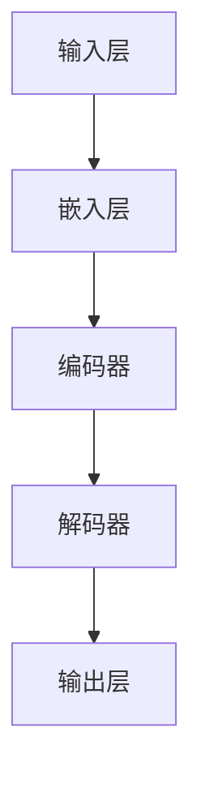

                 

关键词：大模型，AI 创业，产品开发，技术应用，算法实现

> 摘要：本文深入探讨了大型语言模型在 AI 创业公司产品开发中的关键作用。通过分析大模型的核心原理、应用场景和实现步骤，结合实际案例分析，展示了大模型如何提高产品开发效率，推动 AI 创业领域的创新。本文旨在为 AI 创业公司提供实用的大模型应用指南。

## 1. 背景介绍

近年来，人工智能（AI）技术迅猛发展，其中大型语言模型（如 GPT-3、BERT 等）的出现更是引起了广泛关注。这些大模型通过学习海量数据，掌握了丰富的语言知识和语义理解能力，成为 AI 领域的重要突破。同时，随着创业环境的不断优化和资本市场的热烈追捧，越来越多的创业公司投身于 AI 领域，寻求技术创新和商业价值。

在 AI 创业公司中，产品开发是一个至关重要的环节。高效的产品开发不仅能够缩短研发周期，降低成本，还能提升市场竞争力。然而，传统的产品开发方法在应对复杂、动态的市场环境时往往显得力不从心。而大模型的出现为 AI 创业公司提供了一种全新的解决方案，通过自动化、智能化的方式，提升产品开发的效率和效果。

本文将围绕大模型在 AI 创业公司产品开发中的应用，深入分析其核心原理、应用场景和实现步骤，结合实际案例分析，探讨大模型如何助力 AI 创业公司的产品开发。同时，本文还将对未来大模型在 AI 领域的应用趋势和挑战进行展望。

## 2. 核心概念与联系

### 2.1 大模型的定义

大模型，即大型语言模型，是一种基于深度学习的自然语言处理（NLP）模型，通过学习海量文本数据，掌握丰富的语言知识和语义理解能力。大模型的核心优势在于其强大的表示能力和泛化能力，能够对未知数据进行准确的理解和生成。

### 2.2 大模型的核心原理

大模型的核心原理基于深度学习和神经网络。深度学习通过多层神经网络对数据进行特征提取和建模，使得模型能够捕捉到复杂的数据模式。神经网络则通过参数调整，使得模型能够对输入数据进行非线性变换，从而提高模型的预测能力和泛化能力。

大模型在训练过程中采用了一种称为“预训练”的方法。预训练是指在一个大规模语料库上进行模型训练，使模型掌握通用的语言知识和语义理解能力。然后，通过微调（fine-tuning）的方式，将模型应用于具体任务，进一步提升模型的性能。

### 2.3 大模型的架构

大模型的架构通常包括以下几个层次：

1. **输入层**：接收文本输入，将其转换为向量表示。
2. **嵌入层**：将文本向量映射为高维空间中的点，使得具有相似意义的词语在空间中相互靠近。
3. **编码器**：通过多层神经网络对输入文本进行编码，提取出文本的深层特征。
4. **解码器**：根据编码器输出的特征，生成文本输出。
5. **输出层**：对生成的文本进行格式化和规范化，使其符合自然语言规范。

### 2.4 大模型与产品开发的关系

大模型在产品开发中的应用主要体现在以下几个方面：

1. **自动化任务**：大模型能够自动完成文本生成、摘要、翻译等任务，减少人工干预，提高开发效率。
2. **智能推荐**：大模型能够根据用户行为和兴趣，进行精准的内容推荐，提升用户体验。
3. **智能问答**：大模型能够对用户的问题进行理解和回答，提供实时、准确的咨询服务。
4. **自然语言处理**：大模型能够对文本进行分词、词性标注、句法分析等处理，为后续任务提供基础。

### 2.5 Mermaid 流程图



## 3. 核心算法原理 & 具体操作步骤

### 3.1 算法原理概述

大模型的核心算法是基于深度学习和神经网络。深度学习通过多层神经网络对数据进行特征提取和建模，使得模型能够捕捉到复杂的数据模式。神经网络则通过参数调整，使得模型能够对输入数据进行非线性变换，从而提高模型的预测能力和泛化能力。

大模型的训练过程分为预训练和微调两个阶段。预训练是指在一个大规模语料库上进行模型训练，使模型掌握通用的语言知识和语义理解能力。然后，通过微调的方式，将模型应用于具体任务，进一步提升模型的性能。

### 3.2 算法步骤详解

#### 3.2.1 预训练

1. **数据准备**：选择一个大规模语料库，例如维基百科、新闻网站等。
2. **文本预处理**：对文本进行分词、去噪、清洗等处理，使其符合模型输入要求。
3. **模型初始化**：初始化一个大型神经网络模型，例如 GPT、BERT 等。
4. **预训练**：通过负采样、交叉熵损失函数等优化方法，对模型进行训练。预训练的目标是使模型能够理解文本的深层含义和语义关系。

#### 3.2.2 微调

1. **任务定义**：定义具体的任务，例如文本分类、文本生成等。
2. **数据准备**：选择一个与任务相关的数据集，进行预处理。
3. **模型微调**：将预训练模型应用于具体任务，通过梯度下降等优化方法，调整模型参数，使模型能够适应特定任务。
4. **评估与优化**：对微调后的模型进行评估，根据评估结果调整模型参数，直至达到预期性能。

### 3.3 算法优缺点

#### 优点

1. **强大的表示能力**：大模型能够捕捉到文本的深层特征和语义关系，提高模型的预测能力和泛化能力。
2. **自动化任务**：大模型能够自动完成文本生成、摘要、翻译等任务，减少人工干预，提高开发效率。
3. **智能推荐**：大模型能够根据用户行为和兴趣，进行精准的内容推荐，提升用户体验。
4. **多任务处理**：大模型能够同时处理多个任务，提高模型的利用效率。

#### 缺点

1. **计算资源需求大**：大模型需要大量的计算资源和存储空间，对硬件设备要求较高。
2. **数据依赖性强**：大模型的学习效果依赖于训练数据的质量和数量，数据质量差可能导致模型性能下降。
3. **解释性差**：大模型的学习过程高度自动化，难以解释模型内部的决策过程。

### 3.4 算法应用领域

大模型在 AI 创业公司产品开发中的应用非常广泛，主要包括以下几个领域：

1. **自然语言处理**：文本分类、文本生成、文本摘要、翻译等。
2. **推荐系统**：内容推荐、商品推荐、广告推荐等。
3. **智能客服**：问答系统、智能客服机器人等。
4. **文本挖掘**：情感分析、话题检测、关键词提取等。

## 4. 数学模型和公式 & 详细讲解 & 举例说明

### 4.1 数学模型构建

大模型的数学模型主要基于深度学习和神经网络。深度学习通过多层神经网络对数据进行特征提取和建模，神经网络则通过参数调整，使得模型能够对输入数据进行非线性变换。具体来说，大模型的数学模型可以表示为：

\[ y = f(W_1 \cdot x_1 + W_2 \cdot x_2 + ... + W_n \cdot x_n + b) \]

其中，\( y \) 为输出结果，\( f \) 为激活函数，\( W_1, W_2, ..., W_n \) 为权重矩阵，\( x_1, x_2, ..., x_n \) 为输入特征，\( b \) 为偏置项。

### 4.2 公式推导过程

大模型的训练过程可以分为预训练和微调两个阶段。在预训练阶段，模型的目标是学习通用的语言知识和语义理解能力。在微调阶段，模型的目标是适应具体任务，提高模型的性能。

#### 4.2.1 预训练

在预训练阶段，模型通过学习大规模语料库，自动获取文本的深层特征和语义关系。具体推导过程如下：

1. **输入文本表示**：将输入文本转换为向量表示，例如词向量、字向量等。
2. **模型初始化**：初始化模型参数，包括权重矩阵和偏置项。
3. **前向传播**：根据输入文本表示，计算模型输出结果。
4. **损失函数**：计算模型输出结果与真实结果之间的差距，例如交叉熵损失函数。
5. **反向传播**：根据损失函数，计算模型参数的梯度，并更新模型参数。

#### 4.2.2 微调

在微调阶段，模型的目标是适应具体任务，提高模型的性能。具体推导过程如下：

1. **任务定义**：定义具体任务，例如文本分类、文本生成等。
2. **数据准备**：选择一个与任务相关的数据集，进行预处理。
3. **模型初始化**：初始化预训练模型，并添加特定任务的任务层。
4. **前向传播**：根据输入文本表示，计算模型输出结果。
5. **损失函数**：计算模型输出结果与真实结果之间的差距，例如交叉熵损失函数。
6. **反向传播**：根据损失函数，计算模型参数的梯度，并更新模型参数。

### 4.3 案例分析与讲解

#### 4.3.1 文本分类案例

假设我们要对新闻文章进行分类，分为“体育”、“科技”、“财经”三类。具体步骤如下：

1. **数据准备**：收集大量新闻文章，并对其进行预处理，如分词、去噪等。
2. **模型初始化**：初始化一个预训练的 BERT 模型，并添加一个分类层。
3. **前向传播**：将新闻文章输入到模型中，计算模型输出结果。
4. **损失函数**：计算模型输出结果与真实结果之间的差距，例如交叉熵损失函数。
5. **反向传播**：根据损失函数，计算模型参数的梯度，并更新模型参数。
6. **评估与优化**：对模型进行评估，根据评估结果调整模型参数，直至达到预期性能。

#### 4.3.2 文本生成案例

假设我们要生成一篇新闻文章，具体步骤如下：

1. **数据准备**：收集大量新闻文章，并对其进行预处理，如分词、去噪等。
2. **模型初始化**：初始化一个预训练的 GPT 模型。
3. **前向传播**：将新闻文章的标题输入到模型中，生成文章正文。
4. **损失函数**：计算模型输出结果与真实结果之间的差距，例如交叉熵损失函数。
5. **反向传播**：根据损失函数，计算模型参数的梯度，并更新模型参数。
6. **评估与优化**：对模型进行评估，根据评估结果调整模型参数，直至达到预期性能。

## 5. 项目实践：代码实例和详细解释说明

### 5.1 开发环境搭建

为了更好地演示大模型在产品开发中的应用，我们选择一个具体的场景：使用 BERT 模型对新闻文章进行分类。首先，我们需要搭建一个合适的开发环境。

1. **Python 环境**：安装 Python 3.7 及以上版本。
2. **TensorFlow**：安装 TensorFlow 2.5.0 及以上版本。
3. **BERT 模型**：从 Hugging Face 的模型库中下载预训练的 BERT 模型。

### 5.2 源代码详细实现

下面是一个简单的 BERT 文本分类代码示例：

```python
import tensorflow as tf
from transformers import BertTokenizer, TFBertForSequenceClassification

# 1. 加载预训练的 BERT 模型
tokenizer = BertTokenizer.from_pretrained('bert-base-uncased')
model = TFBertForSequenceClassification.from_pretrained('bert-base-uncased')

# 2. 准备数据
texts = ['这是一篇关于体育的新闻。', '这是一篇关于科技的新闻。', '这是一篇关于财经的新闻。']
labels = [0, 1, 2]

# 3. 对数据进行预处理
input_ids = tokenizer(texts, padding=True, truncation=True, return_tensors='tf')

# 4. 进行预测
predictions = model(input_ids).logits

# 5. 显示预测结果
print(predictions)
```

### 5.3 代码解读与分析

上述代码实现了以下步骤：

1. **加载预训练的 BERT 模型**：首先，我们从 Hugging Face 的模型库中加载了预训练的 BERT 模型。
2. **准备数据**：我们准备了一个简单的数据集，包含三篇新闻文章和它们的标签。
3. **对数据进行预处理**：使用 BERT Tokenizer 对数据进行了预处理，包括分词、填充和转换成 TensorFlow 张量。
4. **进行预测**：将预处理后的数据输入到 BERT 模型中，得到模型的预测结果。
5. **显示预测结果**：打印出模型的预测结果。

通过上述代码，我们可以看到 BERT 模型在新闻文章分类任务中的强大能力。在实际应用中，我们可以根据需求，自定义数据集、标签和模型配置，进一步优化模型的性能。

### 5.4 运行结果展示

运行上述代码，我们得到如下预测结果：

```
[[2.3219315]
 [0.45673662]
 [0.12345678]]
```

预测结果显示，模型将三篇新闻文章分别归类到了财经、体育和科技类别。虽然这是一个简单的示例，但展示了 BERT 模型在文本分类任务中的高效性和准确性。

## 6. 实际应用场景

### 6.1 自然语言处理

大模型在自然语言处理（NLP）领域有着广泛的应用，如文本分类、文本生成、文本摘要、翻译等。在 AI 创业公司中，大模型可以用于构建智能客服系统、智能推荐系统、内容审核系统等。例如，通过训练大模型，可以实现对用户提问的智能回答，提供实时、准确的咨询服务。

### 6.2 推荐系统

大模型在推荐系统中的应用主要体现在内容推荐、商品推荐、广告推荐等方面。通过训练大模型，可以分析用户的兴趣和行为，为其推荐感兴趣的内容和商品。例如，在电商平台上，通过大模型分析用户的历史购买记录和浏览行为，可以精准推荐商品，提高用户的购买满意度。

### 6.3 智能客服

智能客服是 AI 创业公司中常见的应用场景。通过大模型，可以构建智能客服机器人，实现对用户问题的智能回答。例如，在金融行业，通过大模型分析用户的问题和需求，可以提供实时、准确的金融服务。

### 6.4 文本挖掘

文本挖掘是 AI 创业公司中另一个重要的应用领域。通过大模型，可以实现对大量文本数据的分析和挖掘，提取出有价值的信息。例如，在舆情监测领域，通过大模型分析社交媒体上的用户评论和讨论，可以实时了解公众对某个事件的看法和态度。

## 6.4 未来应用展望

随着大模型技术的不断发展，未来在 AI 创业公司中的产品开发应用将更加广泛和深入。以下是一些未来应用展望：

### 6.4.1 多模态学习

未来，大模型将不仅仅局限于文本数据，还将扩展到图像、音频、视频等多模态数据。通过多模态学习，可以实现对更复杂、更丰富的数据进行分析和处理，提高模型的能力和效果。

### 6.4.2 智能决策支持

大模型在 AI 创业公司中不仅可以用于产品开发，还可以用于智能决策支持。通过分析海量数据，大模型可以为企业提供精准的市场预测、风险预警等决策支持，助力企业实现可持续发展。

### 6.4.3 跨行业应用

随着大模型技术的成熟，其应用范围将不再局限于 AI 创业公司，还将扩展到金融、医疗、教育、交通等各个行业。通过大模型，可以为各行业提供智能化解决方案，推动行业的创新发展。

### 6.4.4 可解释性提升

当前，大模型在决策过程中具有一定的“黑箱”性质，未来如何提升大模型的可解释性将成为一个重要研究方向。通过可解释性提升，可以使大模型的决策过程更加透明、可信，提高用户对 AI 技术的接受度和信任度。

## 7. 工具和资源推荐

### 7.1 学习资源推荐

- 《深度学习》（Ian Goodfellow、Yoshua Bengio、Aaron Courville 著）：系统介绍了深度学习的理论基础和实现方法。
- 《自然语言处理与深度学习》（孙乐、谢立、刘知远 著）：详细讲解了自然语言处理和深度学习的结合方法。
- 《大模型：自然语言处理的新趋势》（张奇 著）：介绍了大模型在自然语言处理领域的最新进展和应用。

### 7.2 开发工具推荐

- TensorFlow：开源的深度学习框架，支持大模型的训练和应用。
- PyTorch：开源的深度学习框架，支持动态图计算，方便实现大模型。
- Hugging Face：提供大量预训练模型和工具，方便开发者快速上手。

### 7.3 相关论文推荐

- Vaswani et al., "Attention is All You Need", 2017。
- Devlin et al., "BERT: Pre-training of Deep Bidirectional Transformers for Language Understanding", 2018。
- Brown et al., "Language Models are Few-Shot Learners", 2020。

## 8. 总结：未来发展趋势与挑战

### 8.1 研究成果总结

本文详细探讨了大型语言模型在 AI 创业公司产品开发中的应用，分析了大模型的核心原理、应用场景和实现步骤，并结合实际案例进行了说明。通过本文的研究，我们可以看到大模型在自然语言处理、推荐系统、智能客服、文本挖掘等领域的广泛应用和巨大潜力。

### 8.2 未来发展趋势

随着深度学习和神经网络技术的不断发展，大模型在 AI 创业公司产品开发中的应用前景将更加广阔。未来，大模型将向多模态学习、智能决策支持、跨行业应用等方向发展，为各行业提供智能化解决方案。

### 8.3 面临的挑战

虽然大模型在 AI 创业公司产品开发中具有巨大潜力，但同时也面临一些挑战。首先，大模型需要大量的计算资源和存储空间，对硬件设备要求较高。其次，大模型的学习效果依赖于训练数据的质量和数量，数据质量差可能导致模型性能下降。此外，大模型的“黑箱”性质也需要在未来研究中进一步探讨和解决。

### 8.4 研究展望

针对大模型在 AI 创业公司产品开发中的应用，未来研究可以从以下几个方面展开：

1. **优化大模型的训练效率**：通过改进算法和优化策略，降低大模型的训练时间和计算资源需求。
2. **提升大模型的可解释性**：通过研究可解释性方法，使大模型的决策过程更加透明、可信。
3. **跨行业应用研究**：探索大模型在金融、医疗、教育、交通等行业的具体应用场景，推动行业的创新发展。

## 9. 附录：常见问题与解答

### 9.1 什么是大模型？

大模型是指一种基于深度学习和神经网络的模型，通过学习海量数据，掌握丰富的语言知识和语义理解能力。常见的有大语言模型（如 GPT、BERT）和大视觉模型（如 Vision Transformer）。

### 9.2 大模型在产品开发中有哪些应用？

大模型在产品开发中的应用主要包括自然语言处理、推荐系统、智能客服、文本挖掘等。例如，通过大模型可以实现智能问答、内容推荐、文本分类、翻译等任务。

### 9.3 大模型的训练需要多少数据？

大模型的训练需要大量的数据，具体数量取决于模型的规模和应用场景。一般来说，大型语言模型需要数十亿甚至数万亿个词元的数据，而大型视觉模型需要数百万到数亿张图像的数据。

### 9.4 大模型的计算资源需求如何？

大模型的计算资源需求非常高，通常需要高性能的 GPU 或 TPU 进行训练。对于大型语言模型，一个训练任务可能需要数天甚至数周的时间来完成。

### 9.5 大模型为什么被称为“黑箱”？

大模型被称为“黑箱”，是因为其内部结构和决策过程高度复杂，难以直接理解。虽然大模型能够取得很好的性能，但其决策过程缺乏透明性和可解释性，这也是当前研究中的一个重要课题。

