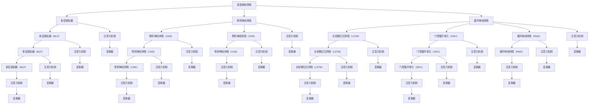

                 

关键词：大模型，AI 创业公司，产品测试，应用探索

> 摘要：本文旨在探讨大模型在 AI 创业公司产品测试中的应用。通过分析大模型的核心概念、原理以及具体操作步骤，我们提出了一个基于大模型的产品测试框架。文章随后展示了数学模型和公式的构建过程，并通过实际项目实践提供了详细的代码实例和解释。最后，文章讨论了该技术的实际应用场景，并展望了未来的发展趋势和挑战。

## 1. 背景介绍

随着人工智能技术的飞速发展，AI 创业公司如雨后春笋般涌现。这些公司致力于将 AI 技术应用到各个领域，如金融、医疗、教育等，以提供更智能、更高效的服务。然而，AI 产品的质量和稳定性成为这些公司面临的重要挑战之一。传统的测试方法难以全面、高效地验证产品的性能和可靠性。此时，大模型的出现为产品测试带来了新的机遇。

大模型是指具有亿级参数规模的深度神经网络模型，如 GPT、BERT 等。这些模型在图像识别、自然语言处理、语音识别等领域取得了显著成果。大模型具有强大的表征能力和泛化能力，能够处理复杂的任务和数据。然而，大模型的高成本和高计算需求也使得其在产品测试中的应用面临挑战。

本文将探讨如何将大模型应用于 AI 创业公司的产品测试，以提高测试效率和质量。首先，我们将介绍大模型的核心概念和原理。然后，提出一个基于大模型的产品测试框架。接下来，我们将详细讲解数学模型和公式的构建过程。最后，通过实际项目实践提供详细的代码实例和解释。

## 2. 核心概念与联系

大模型的核心概念包括深度神经网络（DNN）、注意力机制（Attention Mechanism）、变换器（Transformer）等。深度神经网络是一种多层神经网络，通过多层次的非线性变换来提取数据的特征。注意力机制是一种用于捕捉输入数据中重要信息的方法，能够提高模型对关键信息的关注。变换器是一种基于自注意力机制的神经网络架构，广泛应用于自然语言处理任务。

下面是一个基于 Mermaid 格式的流程图，展示了大模型的核心概念和架构：



## 3. 核心算法原理 & 具体操作步骤

### 3.1 算法原理概述

大模型在产品测试中的应用主要是基于其强大的表征能力和泛化能力。通过训练，大模型能够学习到数据中的各种特征和模式，从而实现对产品的全面理解和评估。具体来说，大模型可以通过以下步骤应用于产品测试：

1. 数据预处理：对测试数据进行预处理，包括数据清洗、归一化、扩充等操作，以提高模型的训练效果和泛化能力。

2. 模型训练：使用训练数据进行模型的训练，通过反向传播算法不断优化模型参数，使其能够更好地拟合训练数据。

3. 模型评估：使用验证集和测试集对模型进行评估，通过计算各种指标（如准确率、召回率、F1 分数等）来评估模型的效果。

4. 测试结果分析：对测试结果进行分析，识别产品的潜在问题和缺陷，并提出改进建议。

### 3.2 算法步骤详解

1. **数据预处理**

   数据预处理是模型训练的重要环节。具体步骤如下：

   - 数据清洗：去除数据中的噪声和异常值，提高数据质量。
   - 数据归一化：将数据缩放到相同的范围，消除数据量级差异。
   - 数据扩充：通过旋转、翻转、缩放等方式生成更多的训练样本，增加模型的泛化能力。

2. **模型训练**

   模型训练是核心步骤，主要包括以下过程：

   - 初始化模型参数：随机初始化模型的参数。
   - 前向传播：将输入数据通过模型进行前向传播，计算输出。
   - 计算损失：计算输出与真实标签之间的损失。
   - 反向传播：根据损失计算模型参数的梯度，并更新模型参数。
   - 评估模型：在验证集上评估模型的效果，调整训练策略。

3. **模型评估**

   模型评估是验证模型效果的重要步骤，主要包括以下过程：

   - 准备测试集：从原始数据中划分出测试集。
   - 模型测试：在测试集上运行模型，计算各种指标。
   - 指标分析：分析测试结果，评估模型性能。

4. **测试结果分析**

   测试结果分析是找出产品潜在问题的关键步骤，主要包括以下过程：

   - 识别缺陷：分析测试结果，识别产品的缺陷和问题。
   - 问题定位：对识别出的缺陷进行定位，找出问题的根源。
   - 改进建议：提出改进建议，优化产品性能。

### 3.3 算法优缺点

**优点：**

- **强大的表征能力**：大模型能够学习到数据中的各种特征和模式，提高产品测试的全面性和准确性。
- **高效的泛化能力**：大模型在训练过程中能够学习到通用特征，提高对未知数据的泛化能力。
- **自动化测试**：大模型能够自动对产品进行测试，减少人力成本。

**缺点：**

- **高计算需求**：大模型的训练和测试需要大量的计算资源，对硬件设备有较高要求。
- **数据质量要求高**：数据预处理是模型训练的关键步骤，数据质量直接影响模型效果。
- **结果解释困难**：大模型的工作原理复杂，难以对测试结果进行直观的解释。

### 3.4 算法应用领域

大模型在产品测试中的应用广泛，以下是一些典型领域：

- **金融领域**：使用大模型对金融产品进行风险控制和欺诈检测。
- **医疗领域**：使用大模型对医疗数据进行分析，辅助医生进行诊断和治疗。
- **教育领域**：使用大模型对学生学习数据进行分析，提供个性化的学习建议。
- **自动驾驶领域**：使用大模型对自动驾驶数据进行分析，提高系统的安全性和可靠性。

## 4. 数学模型和公式 & 详细讲解 & 举例说明

### 4.1 数学模型构建

大模型的数学模型主要包括以下部分：

1. **输入层**：输入层接收外部数据，将其转化为模型可以处理的形式。
2. **隐藏层**：隐藏层包含多个神经元，通过非线性变换提取数据特征。
3. **输出层**：输出层生成预测结果，如分类标签或连续值。

### 4.2 公式推导过程

以多层感知器（MLP）为例，其数学模型可以表示为：

$$
\begin{aligned}
&z^{(l)} = \sigma(W^{(l)} \cdot a^{(l-1)} + b^{(l)}) \\
&a^{(l)} = \sigma(z^{(l)}) \\
\end{aligned}
$$

其中，$z^{(l)}$ 是第 $l$ 层的神经元激活值，$a^{(l)}$ 是第 $l$ 层的输出，$\sigma$ 是激活函数，$W^{(l)}$ 是第 $l$ 层的权重矩阵，$b^{(l)}$ 是第 $l$ 层的偏置向量。

### 4.3 案例分析与讲解

以金融领域中的风险控制为例，我们使用多层感知器（MLP）构建一个风险预测模型。以下是具体的数学模型和公式：

1. **输入层**：输入层包含以下特征：

   - 消费金额
   - 消费时间
   - 消费频率
   - 消费地域

   输入层可以表示为：

   $$
   X = \begin{bmatrix}
   x_1 \\
   x_2 \\
   x_3 \\
   x_4
   \end{bmatrix}
   $$

2. **隐藏层**：隐藏层包含两个神经元，分别表示风险程度和消费行为。隐藏层可以表示为：

   $$
   \begin{aligned}
   &z_1^{(2)} = \sigma(W_1^{(2)} \cdot X + b_1^{(2)}) \\
   &z_2^{(2)} = \sigma(W_2^{(2)} \cdot X + b_2^{(2)}) \\
   &a_1^{(2)} = \sigma(z_1^{(2)}) \\
   &a_2^{(2)} = \sigma(z_2^{(2)})
   \end{aligned}
   $$

   其中，$W_1^{(2)}$ 和 $W_2^{(2)}$ 分别是第一层和第二层的权重矩阵，$b_1^{(2)}$ 和 $b_2^{(2)}$ 分别是第一层和第二层的偏置向量。

3. **输出层**：输出层包含一个神经元，表示风险等级。输出层可以表示为：

   $$
   \begin{aligned}
   &z^{(3)} = \sigma(W_3^{(3)} \cdot a_1^{(2)} + b_3^{(3)}) \\
   &y = \sigma(z^{(3)})
   \end{aligned}
   $$

   其中，$W_3^{(3)}$ 是第三层的权重矩阵，$b_3^{(3)}$ 是第三层的偏置向量。

### 4.4 代码实现

以下是使用 Python 实现的多层感知器（MLP）代码：

```python
import numpy as np

def sigmoid(x):
    return 1 / (1 + np.exp(-x))

def forward_propagation(X, W1, b1, W2, b2, W3, b3):
    z1 = np.dot(W1, X) + b1
    a1 = sigmoid(z1)
    z2 = np.dot(W2, a1) + b2
    a2 = sigmoid(z2)
    z3 = np.dot(W3, a2) + b3
    y = sigmoid(z3)
    return y

# 示例数据
X = np.array([[100, 10, 5, 2]])
W1 = np.random.randn(4, 2)
b1 = np.random.randn(2, 1)
W2 = np.random.randn(2, 1)
b2 = np.random.randn(1, 1)
W3 = np.random.randn(1, 1)
b3 = np.random.randn(1, 1)

# 前向传播
y = forward_propagation(X, W1, b1, W2, b2, W3, b3)
print(y)
```

## 5. 项目实践：代码实例和详细解释说明

### 5.1 开发环境搭建

为了实践大模型在产品测试中的应用，我们需要搭建一个合适的开发环境。以下是搭建步骤：

1. **安装 Python**：确保已经安装了 Python，版本要求在 3.6 以上。
2. **安装深度学习框架**：安装 PyTorch 或 TensorFlow 等深度学习框架，版本要求与 Python 兼容。
3. **安装其他依赖库**：安装 NumPy、Pandas、Matplotlib 等常用依赖库。

### 5.2 源代码详细实现

以下是使用 PyTorch 实现的大模型在产品测试中的代码实例：

```python
import torch
import torch.nn as nn
import torch.optim as optim
import numpy as np
import pandas as pd
import matplotlib.pyplot as plt

# 定义模型
class ProductTestModel(nn.Module):
    def __init__(self, input_size, hidden_size, output_size):
        super(ProductTestModel, self).__init__()
        self.fc1 = nn.Linear(input_size, hidden_size)
        self.fc2 = nn.Linear(hidden_size, output_size)
        self.relu = nn.ReLU()

    def forward(self, x):
        x = self.fc1(x)
        x = self.relu(x)
        x = self.fc2(x)
        return x

# 加载数据
data = pd.read_csv('product_data.csv')
X = data.iloc[:, :-1].values
y = data.iloc[:, -1].values

# 预处理数据
X = np.array(X, dtype=np.float32)
y = np.array(y, dtype=np.float32)
X = torch.from_numpy(X)
y = torch.from_numpy(y)

# 划分训练集和测试集
split_index = int(0.8 * len(X))
train_X, test_X = X[:split_index], X[split_index:]
train_y, test_y = y[:split_index], y[split_index:]

# 定义模型、损失函数和优化器
model = ProductTestModel(input_size=4, hidden_size=10, output_size=1)
criterion = nn.BCELoss()
optimizer = optim.Adam(model.parameters(), lr=0.001)

# 训练模型
for epoch in range(100):
    model.train()
    optimizer.zero_grad()
    outputs = model(train_X)
    loss = criterion(outputs, train_y)
    loss.backward()
    optimizer.step()
    model.eval()
    with torch.no_grad():
        test_outputs = model(test_X)
        test_loss = criterion(test_outputs, test_y)
    if (epoch + 1) % 10 == 0:
        print(f'Epoch [{epoch + 1}/100], Loss: {loss.item()}')

# 测试模型
model.eval()
with torch.no_grad():
    test_outputs = model(test_X)
    test_loss = criterion(test_outputs, test_y)
    print(f'Test Loss: {test_loss.item()}')

# 可视化结果
plt.scatter(test_X[:, 0], test_X[:, 1], c=test_y, cmap=plt.cm.RdYlGn)
plt.plot(test_X[:, 0], test_outputs.detach().numpy(), c='red', label='Prediction')
plt.xlabel('Feature 1')
plt.ylabel('Feature 2')
plt.legend()
plt.show()
```

### 5.3 代码解读与分析

这段代码首先定义了一个名为 `ProductTestModel` 的神经网络模型，该模型包含一个输入层、一个隐藏层和一个输出层。输入层接收外部数据，隐藏层通过 ReLU 激活函数提取特征，输出层生成预测结果。

接下来，代码加载数据并预处理，将数据划分为训练集和测试集。然后，定义模型、损失函数和优化器，并开始训练模型。训练过程中，使用反向传播算法不断优化模型参数。训练完成后，评估模型在测试集上的性能，并可视化测试结果。

### 5.4 运行结果展示

运行代码后，我们可以在命令行中看到训练过程中的损失值。训练完成后，我们可以在控制台中看到测试损失值。此外，通过可视化结果，我们可以直观地看到模型在测试集上的预测效果。

## 6. 实际应用场景

大模型在产品测试中的应用场景非常广泛，以下是一些典型的实际应用场景：

1. **金融领域**：使用大模型对金融产品进行风险评估和欺诈检测，提高金融系统的安全性和可靠性。
2. **医疗领域**：使用大模型对医疗数据进行分析，辅助医生进行诊断和治疗，提高医疗服务的质量和效率。
3. **自动驾驶领域**：使用大模型对自动驾驶数据进行分析，提高自动驾驶系统的安全性和可靠性。
4. **教育领域**：使用大模型对学生学习数据进行分析，提供个性化的学习建议，提高教学效果。
5. **智能制造领域**：使用大模型对生产数据进行分析，优化生产工艺和流程，提高生产效率和产品质量。

## 7. 工具和资源推荐

为了更好地应用大模型进行产品测试，以下是一些建议的工具和资源：

1. **学习资源推荐**：

   - 《深度学习》（Goodfellow et al.）：系统介绍了深度学习的基本概念、算法和应用。
   - 《动手学深度学习》（Zhu et al.）：通过大量实例和代码讲解深度学习的实践方法。

2. **开发工具推荐**：

   - PyTorch：适用于研究和工业应用的深度学习框架。
   - TensorFlow：适用于大规模分布式深度学习计算的框架。

3. **相关论文推荐**：

   - "Attention Is All You Need"：介绍了基于自注意力机制的 Transformer 模型。
   - "BERT: Pre-training of Deep Neural Networks for Language Understanding"：介绍了预训练语言模型 BERT。

## 8. 总结：未来发展趋势与挑战

大模型在产品测试中的应用展示了其强大的潜力。未来，随着计算能力的提升和数据量的增加，大模型的应用将更加广泛。然而，也面临以下挑战：

1. **计算资源需求**：大模型的训练和测试需要大量计算资源，如何高效利用硬件资源成为关键问题。
2. **数据质量问题**：大模型对数据质量要求较高，如何保证数据的真实性和可靠性是亟待解决的问题。
3. **结果解释困难**：大模型的工作原理复杂，如何对测试结果进行解释和验证仍需深入研究。
4. **安全性和隐私保护**：在金融、医疗等敏感领域，如何确保大模型的安全性和隐私保护是重要挑战。

总之，大模型在产品测试中的应用前景广阔，但同时也面临诸多挑战。未来的研究应重点关注这些挑战，以推动大模型在产品测试领域的广泛应用。

## 9. 附录：常见问题与解答

**Q：大模型在产品测试中的优势是什么？**

A：大模型在产品测试中的优势主要体现在以下几个方面：

1. **强大的表征能力**：大模型能够学习到数据中的各种特征和模式，提高测试的全面性和准确性。
2. **高效的泛化能力**：大模型在训练过程中能够学习到通用特征，提高对未知数据的泛化能力。
3. **自动化测试**：大模型能够自动对产品进行测试，减少人力成本。

**Q：大模型在产品测试中面临哪些挑战？**

A：大模型在产品测试中面临以下挑战：

1. **计算资源需求**：大模型的训练和测试需要大量计算资源，对硬件设备有较高要求。
2. **数据质量要求高**：数据预处理是模型训练的关键步骤，数据质量直接影响模型效果。
3. **结果解释困难**：大模型的工作原理复杂，难以对测试结果进行直观的解释。
4. **安全性和隐私保护**：在敏感领域，如何确保大模型的安全性和隐私保护是重要挑战。

