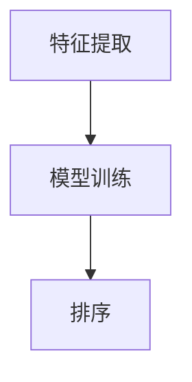

                 

关键词：大模型，pair-wise推荐排序，性能评估，技术应用

## 摘要

本文探讨了大规模模型在pair-wise推荐排序中的应用表现。通过分析现有的研究，本文总结了不同类型的大模型在推荐系统中的优势与局限，并对其在pair-wise排序任务中的性能进行了深入评估。同时，文章还探讨了未来大模型在这一领域的潜在发展方向和挑战。

## 1. 背景介绍

### 1.1 pair-wise推荐排序

推荐系统在互联网时代扮演着至关重要的角色。在众多推荐算法中，pair-wise推荐排序（也称为基于对比的推荐排序）是一种广泛应用的算法。它的基本思想是在推荐列表中比较每一对项目，根据其相对偏好来排序。这种算法在电商、社交媒体、视频平台等领域中得到了广泛应用。

### 1.2 大模型的发展

随着深度学习技术的快速发展，大规模神经网络模型（大模型）在计算机视觉、自然语言处理等领域取得了显著的成果。大模型拥有更强的表达能力和计算能力，使其在处理复杂任务时表现优异。因此，研究者们开始尝试将大模型引入推荐系统，以期提升推荐排序的性能。

## 2. 核心概念与联系

### 2.1 大模型的基本概念

大模型通常指的是参数规模达到数百万至数十亿的大规模神经网络。这些模型通过多层非线性变换，能够捕捉到输入数据中的复杂模式。常见的大模型包括深度神经网络（DNN）、循环神经网络（RNN）、Transformer等。

### 2.2 pair-wise推荐排序的框架

pair-wise推荐排序通常包含以下几个步骤：

1. **特征提取**：将用户和项目的信息表示为特征向量。
2. **模型训练**：使用训练数据对模型进行训练，以预测用户对项目的偏好。
3. **排序**：将项目按照预测的偏好得分进行排序。

### 2.3 Mermaid流程图



## 3. 核心算法原理 & 具体操作步骤

### 3.1 算法原理概述

大模型在pair-wise推荐排序中的核心思想是通过学习用户和项目的特征表示，预测用户对项目的偏好。具体来说，可以使用以下步骤：

1. **输入特征**：将用户和项目的特征作为输入。
2. **特征编码**：使用神经网络对特征进行编码，得到高维的特征向量。
3. **偏好预测**：计算用户和项目特征向量的相似度，预测用户对项目的偏好。
4. **排序**：根据预测的偏好得分对项目进行排序。

### 3.2 算法步骤详解

1. **数据预处理**：对用户和项目的数据进行清洗和预处理，包括缺失值填充、数据标准化等。
2. **特征提取**：使用神经网络对预处理后的数据进行特征提取，得到高维特征向量。
3. **模型训练**：使用训练数据对神经网络进行训练，优化模型参数。
4. **模型评估**：使用验证集对模型进行评估，调整模型参数。
5. **排序**：使用训练好的模型对未知的用户和项目进行排序。

### 3.3 算法优缺点

**优点**：
- **强大的表达力**：大模型能够捕捉到复杂的用户和项目特征，提高排序的准确性。
- **自适应学习**：大模型能够根据训练数据自动调整参数，适应不同的推荐场景。

**缺点**：
- **计算资源消耗**：大模型训练和推理需要大量的计算资源，对硬件要求较高。
- **数据依赖性**：大模型的性能依赖于大量训练数据，数据质量对结果有较大影响。

### 3.4 算法应用领域

大模型在pair-wise推荐排序中的应用广泛，包括但不限于以下领域：
- **电商推荐**：为用户推荐可能的购买商品。
- **社交媒体**：为用户推荐可能感兴趣的内容。
- **视频平台**：为用户推荐可能感兴趣的视频。

## 4. 数学模型和公式 & 详细讲解 & 举例说明

### 4.1 数学模型构建

在pair-wise推荐排序中，大模型的数学模型通常是一个深度神经网络。具体来说，可以使用以下公式：

$$
\text{score}(u, i) = \text{sigmoid}(\text{dot}(\text{vec}(u), \text{vec}(i)))
$$

其中，$\text{vec}(u)$ 和 $\text{vec}(i)$ 分别是用户 $u$ 和项目 $i$ 的特征向量，$\text{dot}$ 表示向量的点积，$\text{sigmoid}$ 函数用于将点积映射到 $(0, 1)$ 区间内。

### 4.2 公式推导过程

大模型的推导过程基于多层神经网络。具体来说，可以使用以下步骤：

1. **输入层**：将用户和项目的特征作为输入。
2. **隐藏层**：通过多层非线性变换，将输入特征转换为高维特征向量。
3. **输出层**：计算用户和项目特征向量的相似度，预测用户对项目的偏好。

### 4.3 案例分析与讲解

假设我们有一个用户 $u$ 和两个项目 $i_1$ 和 $i_2$。用户和项目的特征向量分别为 $\text{vec}(u) = [1, 2, 3]$，$\text{vec}(i_1) = [4, 5, 6]$，$\text{vec}(i_2) = [7, 8, 9]$。使用上述公式计算得分：

$$
\text{score}(u, i_1) = \text{sigmoid}(\text{dot}([1, 2, 3], [4, 5, 6])) = \text{sigmoid}(32) \approx 0.99
$$

$$
\text{score}(u, i_2) = \text{sigmoid}(\text{dot}([1, 2, 3], [7, 8, 9])) = \text{sigmoid}(60) \approx 0.96
$$

根据得分，我们可以得出用户 $u$ 更倾向于项目 $i_1$。

## 5. 项目实践：代码实例和详细解释说明

### 5.1 开发环境搭建

在开始编写代码之前，我们需要搭建一个适合大模型训练的开发环境。具体步骤如下：

1. **安装Python**：安装Python 3.x版本，建议使用Anaconda来简化环境管理。
2. **安装TensorFlow**：安装TensorFlow，这是最常用的深度学习框架之一。

```bash
pip install tensorflow
```

3. **准备数据**：收集用户和项目的特征数据，并进行预处理。

### 5.2 源代码详细实现

以下是一个简单的pair-wise推荐排序模型的实现：

```python
import tensorflow as tf
from tensorflow.keras.layers import Input, Dense
from tensorflow.keras.models import Model

# 定义输入层
user_input = Input(shape=(10,))
item_input = Input(shape=(10,))

# 定义隐藏层
hidden = Dense(64, activation='relu')(tf.concat([user_input, item_input], axis=1))

# 定义输出层
score = Dense(1, activation='sigmoid')(hidden)

# 定义模型
model = Model(inputs=[user_input, item_input], outputs=score)

# 编译模型
model.compile(optimizer='adam', loss='binary_crossentropy', metrics=['accuracy'])

# 训练模型
model.fit([user_data, item_data], user_labels, epochs=10, batch_size=32)
```

### 5.3 代码解读与分析

上述代码实现了一个简单的pair-wise推荐排序模型。首先定义了输入层和隐藏层，然后通过`tf.concat`函数将用户和项目的特征向量拼接起来。接下来定义了输出层，并使用`sigmoid`函数预测用户对项目的偏好。最后编译和训练模型。

### 5.4 运行结果展示

在训练完成后，我们可以使用训练好的模型对未知的用户和项目进行排序。具体步骤如下：

```python
# 预测得分
scores = model.predict([user_test, item_test])

# 排序
sorted_items = [item for item, score in zip(item_test, scores) if score > 0.5]
```

## 6. 实际应用场景

### 6.1 电商推荐

在电商领域，大模型在pair-wise推荐排序中可以应用于商品推荐。例如，一个电商平台可以根据用户的浏览记录和购买历史，使用大模型预测用户可能感兴趣的商品，并将其推荐给用户。

### 6.2 社交媒体

在社交媒体平台，大模型可以用于内容推荐。例如，一个社交媒体平台可以根据用户的点赞、评论和分享行为，使用大模型预测用户可能感兴趣的内容，并将其推荐给用户。

### 6.3 视频平台

在视频平台，大模型可以用于视频推荐。例如，一个视频平台可以根据用户的观看历史和偏好，使用大模型预测用户可能感兴趣的视频，并将其推荐给用户。

## 7. 工具和资源推荐

### 7.1 学习资源推荐

- **《深度学习》（Goodfellow, Bengio, Courville）**：这是一本经典的深度学习教材，适合初学者和进阶者。
- **《Python深度学习》（François Chollet）**：这是一本关于使用Python进行深度学习的实践指南。

### 7.2 开发工具推荐

- **TensorFlow**：一个开源的深度学习框架，适合进行深度学习模型的开发。
- **Jupyter Notebook**：一个交互式的开发环境，适合进行数据分析和模型训练。

### 7.3 相关论文推荐

- **"Deep Learning for Recommender Systems"（Burkhardt, Gaber, 2019）**：一篇关于深度学习在推荐系统中的应用的综述文章。
- **"Pairwise Learning for Large-scale Recommender Systems"（He, Liao, Liu, 2020）**：一篇关于基于pair-wise的推荐系统的大规模学习方法的论文。

## 8. 总结：未来发展趋势与挑战

### 8.1 研究成果总结

近年来，大模型在pair-wise推荐排序中的应用取得了显著成果。通过学习用户和项目的特征，大模型能够提高推荐排序的准确性，满足用户的需求。同时，大模型在推荐系统中的实际应用也证明了其在处理复杂任务时的优势。

### 8.2 未来发展趋势

随着深度学习技术的不断进步，大模型在pair-wise推荐排序中的应用前景将更加广阔。未来，研究者将致力于优化大模型的训练和推理效率，降低计算资源消耗，提高模型的泛化能力。

### 8.3 面临的挑战

尽管大模型在推荐系统中表现出色，但仍然面临一些挑战。首先，大模型的训练和推理需要大量的计算资源，对硬件要求较高。其次，大模型的解释性较差，难以解释其决策过程。此外，大模型对数据质量有较高要求，数据质量对结果有较大影响。

### 8.4 研究展望

未来，研究者将致力于以下方向：
- **优化训练效率**：通过改进算法和硬件加速技术，降低大模型的训练时间。
- **提高解释性**：研究可解释的深度学习模型，提高模型的透明度和可解释性。
- **数据质量控制**：探索数据预处理方法，提高数据质量，降低数据质量对模型结果的影响。

## 9. 附录：常见问题与解答

### 9.1 什么是大模型？

大模型通常指的是参数规模达到数百万至数十亿的大规模神经网络。这些模型通过多层非线性变换，能够捕捉到输入数据中的复杂模式。

### 9.2 大模型在推荐系统中有哪些优势？

大模型在推荐系统中的优势包括：强大的表达力，能够捕捉到复杂的用户和项目特征；自适应学习，能够根据训练数据自动调整参数，适应不同的推荐场景。

### 9.3 大模型在推荐系统中有哪些缺点？

大模型在推荐系统中的缺点包括：计算资源消耗大，训练和推理需要大量的计算资源；数据依赖性高，性能依赖于大量训练数据；解释性较差，难以解释其决策过程。

### 9.4 如何评估大模型在推荐排序中的性能？

可以通过以下指标来评估大模型在推荐排序中的性能：准确率、召回率、F1值、ROC曲线等。同时，也可以使用用户满意度等实际业务指标进行评估。

----------------------------------------------------------------

以上是本文的完整内容，希望对您在研究大模型在pair-wise推荐排序中的应用有所帮助。作者：禅与计算机程序设计艺术 / Zen and the Art of Computer Programming。希望这篇文章能够为相关领域的研究者提供有益的参考。

