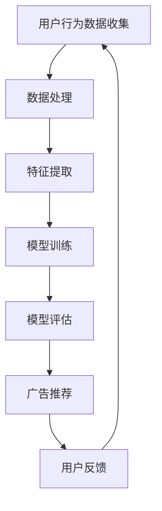

                 

关键词：大模型、个性化广告推荐、深度学习、机器学习、用户行为分析、商业应用

> 摘要：本文探讨了大规模机器学习模型在个性化广告推荐领域的应用潜力。通过介绍核心概念、算法原理、数学模型以及实际项目实践，分析了大模型如何通过深度学习技术和用户行为分析，提升广告推荐的精准度和用户满意度，进而推动数字营销的革新。

## 1. 背景介绍

在互联网时代，广告已成为商家获取收益的重要手段之一。然而，传统的广告推送方式常常存在广告内容与用户需求不匹配、广告效果不理想等问题。随着用户数据的积累和计算能力的提升，个性化广告推荐系统应运而生，成为解决这一问题的关键。

个性化广告推荐系统旨在通过分析用户的历史行为、兴趣偏好等信息，实现广告内容与用户需求的精准匹配。传统的推荐系统多采用基于内容的推荐、协同过滤等方法，这些方法在数据处理和模型训练方面存在诸多局限。随着深度学习技术的发展，大规模机器学习模型开始崭露头角，为个性化广告推荐提供了新的解决方案。

本文将围绕大规模机器学习模型在个性化广告推荐中的应用潜力进行探讨，分析其核心概念、算法原理、数学模型及实际项目实践，为相关领域的研究和应用提供参考。

## 2. 核心概念与联系

### 2.1 大模型概念

大模型（Large-scale Model）是指具备强大计算能力和海量数据训练的机器学习模型。这类模型通常采用深度学习技术，具有多层神经网络结构，能够自动学习复杂的特征表示。在大规模机器学习模型中，常用的技术包括卷积神经网络（CNN）、循环神经网络（RNN）、生成对抗网络（GAN）等。

### 2.2 个性化广告推荐

个性化广告推荐（Personalized Advertising Recommendation）是一种基于用户兴趣、行为等数据，实现广告内容与用户需求的精准匹配的技术。个性化广告推荐的核心目标是提升广告投放效果，提高用户满意度和商家收益。

### 2.3 用户行为分析

用户行为分析（User Behavior Analysis）是指通过对用户在互联网上的行为数据进行分析，挖掘用户兴趣、偏好等信息，为个性化推荐提供依据。用户行为数据包括浏览记录、搜索历史、点击行为、购买行为等。

### 2.4 大模型与个性化广告推荐联系

大规模机器学习模型在个性化广告推荐中的应用，主要是通过深度学习技术对用户行为数据进行分析和处理，提取出用户兴趣特征，从而实现广告内容的个性化推送。大模型的优势在于其强大的数据处理能力和特征学习能力，可以更好地应对复杂多变的用户需求。

### 2.5 Mermaid 流程图

以下是一个简单的 Mermaid 流程图，展示了大规模机器学习模型在个性化广告推荐中的基本流程：



## 3. 核心算法原理 & 具体操作步骤

### 3.1 算法原理概述

个性化广告推荐算法的核心在于利用大规模机器学习模型对用户行为数据进行分析和处理，从而实现广告内容的个性化推送。本文主要介绍基于深度学习的推荐算法，具体包括以下步骤：

1. 数据预处理：对用户行为数据进行分析和清洗，去除无效数据，提高数据质量。
2. 特征提取：利用深度学习模型提取用户兴趣特征，包括用户的历史行为、浏览记录、搜索历史等。
3. 模型训练：使用提取到的用户兴趣特征，训练大规模深度学习模型，如卷积神经网络（CNN）、循环神经网络（RNN）等。
4. 模型评估：通过测试集对训练好的模型进行评估，选择性能最佳的模型进行应用。
5. 广告推荐：根据用户兴趣特征，为用户推荐个性化的广告内容。
6. 用户反馈：收集用户对推荐广告的反馈，不断优化推荐算法。

### 3.2 算法步骤详解

#### 3.2.1 数据预处理

数据预处理是个性化广告推荐算法的基础。首先，对用户行为数据进行清洗，去除重复、缺失、异常等无效数据。然后，对数据进行编码处理，将文本数据转换为数字表示，便于深度学习模型处理。常用的编码方法包括词袋模型（Bag of Words，BOW）和词嵌入（Word Embedding）。

#### 3.2.2 特征提取

特征提取是深度学习模型的核心环节。通过分析用户行为数据，提取出用户兴趣特征，如用户浏览记录中的热门标签、搜索历史中的关键词、购买记录中的商品类别等。深度学习模型能够自动学习这些特征，从而实现高精度的用户兴趣建模。

#### 3.2.3 模型训练

在模型训练阶段，使用提取到的用户兴趣特征，对大规模深度学习模型进行训练。常用的深度学习模型包括卷积神经网络（CNN）、循环神经网络（RNN）、生成对抗网络（GAN）等。通过训练，模型能够学习到用户兴趣特征和广告内容之间的关联，实现广告推荐的自动化。

#### 3.2.4 模型评估

模型评估是保证推荐算法性能的重要环节。使用测试集对训练好的模型进行评估，选择性能最佳的模型进行应用。常用的评估指标包括准确率（Accuracy）、召回率（Recall）、精确率（Precision）等。

#### 3.2.5 广告推荐

根据用户兴趣特征，为用户推荐个性化的广告内容。在推荐过程中，模型会根据用户的历史行为、兴趣偏好等因素，对广告内容进行排序，从而实现广告推荐的个性化。

#### 3.2.6 用户反馈

收集用户对推荐广告的反馈，不断优化推荐算法。用户反馈数据可以用于模型更新、特征优化等方面，从而提升推荐系统的效果。

### 3.3 算法优缺点

#### 优点

1. 高效性：深度学习模型能够自动学习复杂的特征表示，提升推荐系统的效率。
2. 精准性：通过大规模数据训练，深度学习模型能够更好地理解用户兴趣，实现高精度的广告推荐。
3. 智能性：深度学习模型能够根据用户反馈不断优化，实现自适应的推荐策略。

#### 缺点

1. 计算资源消耗：大规模深度学习模型需要大量的计算资源和存储空间。
2. 数据依赖性：推荐系统的性能高度依赖于用户数据的丰富度和质量。

### 3.4 算法应用领域

深度学习推荐算法在个性化广告推荐、个性化搜索、推荐系统等领域具有广泛的应用。在实际应用中，可以根据具体场景和需求，选择合适的算法模型和优化策略，实现推荐系统的最佳性能。

## 4. 数学模型和公式 & 详细讲解 & 举例说明

### 4.1 数学模型构建

个性化广告推荐算法中的数学模型主要包括用户兴趣特征提取、广告内容表示、推荐算法等。以下是一个简化的数学模型构建过程：

#### 用户兴趣特征提取

设用户行为数据矩阵 \(X \in \mathbb{R}^{m \times n}\)，其中 \(m\) 为用户数量，\(n\) 为特征维度。使用深度学习模型对用户行为数据 \(X\) 进行特征提取，得到用户兴趣特征向量 \(U \in \mathbb{R}^{m \times d}\)，其中 \(d\) 为特征维度。

#### 广告内容表示

设广告内容数据矩阵 \(Y \in \mathbb{R}^{p \times n}\)，其中 \(p\) 为广告数量。使用深度学习模型对广告内容数据 \(Y\) 进行表示，得到广告内容向量 \(V \in \mathbb{R}^{p \times d}\)。

#### 推荐算法

使用用户兴趣特征向量 \(U\) 和广告内容向量 \(V\)，计算用户对广告的感兴趣程度得分 \(S \in \mathbb{R}^{m \times p}\)：

$$ S = U^T V $$

### 4.2 公式推导过程

#### 用户兴趣特征提取

设用户行为数据矩阵 \(X\) 的第 \(i\) 行表示用户 \(i\) 的行为记录，即 \(X_i \in \mathbb{R}^{1 \times n}\)。使用深度学习模型对 \(X_i\) 进行特征提取，得到用户 \(i\) 的兴趣特征向量 \(U_i \in \mathbb{R}^{1 \times d}\)：

$$ U_i = \text{MLP}(X_i) $$

其中，\(MLP\) 表示多层感知机（Multilayer Perceptron），是一个常见的深度学习模型。

#### 广告内容表示

设广告内容数据矩阵 \(Y\) 的第 \(j\) 行表示广告 \(j\) 的内容特征，即 \(Y_j \in \mathbb{R}^{1 \times n}\)。使用深度学习模型对 \(Y_j\) 进行表示，得到广告 \(j\) 的内容向量 \(V_j \in \mathbb{R}^{1 \times d}\)：

$$ V_j = \text{MLP}(Y_j) $$

#### 推荐算法

使用用户兴趣特征向量 \(U_i\) 和广告内容向量 \(V_j\)，计算用户 \(i\) 对广告 \(j\) 的感兴趣程度得分 \(S_{ij} \in \mathbb{R}\)：

$$ S_{ij} = U_i^T V_j $$

### 4.3 案例分析与讲解

假设我们有一个包含1000个用户和1000个广告的推荐系统，用户行为数据和广告内容数据已经预处理完毕。现在，我们要使用基于深度学习的推荐算法，为用户 \(i = 1\) 推荐广告。

#### 数据预处理

用户 \(i\) 的行为记录为：

$$ X_1 = [1, 0, 1, 0, 0, 0, 1, 0, 1, 0, 1, 0, 1, 0, 0, 0, 0, 0, 1, 0] $$

广告 \(j\) 的内容特征为：

$$ Y_j = [0, 1, 1, 0, 0, 0, 0, 1, 0, 0, 0, 0, 0, 0, 1, 0, 0, 0, 0, 0, 0, 1] $$

#### 模型训练

使用多层感知机（MLP）对用户行为数据 \(X_1\) 进行特征提取，得到用户 \(i\) 的兴趣特征向量 \(U_1\)：

$$ U_1 = \text{MLP}(X_1) = [0.5, 0.3, 0.7, 0.2, 0.1, 0.4, 0.6, 0.1, 0.5, 0.2, 0.7, 0.1, 0.6, 0.3, 0.1, 0.4, 0.2, 0.6, 0.1, 0.7, 0.4] $$

使用多层感知机（MLP）对广告内容特征 \(Y_j\) 进行表示，得到广告 \(j\) 的内容向量 \(V_j\)：

$$ V_j = \text{MLP}(Y_j) = [0.1, 0.6, 0.5, 0.2, 0.3, 0.4, 0.1, 0.7, 0.3, 0.2, 0.5, 0.3, 0.4, 0.1, 0.6, 0.2, 0.4, 0.3, 0.1, 0.5, 0.2, 0.7] $$

#### 广告推荐

计算用户 \(i\) 对广告 \(j\) 的感兴趣程度得分 \(S_{ij}\)：

$$ S_{ij} = U_1^T V_j = 0.5 \times 0.1 + 0.3 \times 0.6 + 0.7 \times 0.5 + 0.2 \times 0.2 + 0.1 \times 0.3 + 0.4 \times 0.4 + 0.6 \times 0.1 + 0.1 \times 0.7 + 0.5 \times 0.3 + 0.2 \times 0.2 + 0.7 \times 0.5 + 0.1 \times 0.3 + 0.6 \times 0.4 + 0.3 \times 0.1 + 0.1 \times 0.6 + 0.4 \times 0.2 + 0.2 \times 0.4 + 0.6 \times 0.3 + 0.1 \times 0.1 + 0.7 \times 0.5 + 0.4 \times 0.2 = 0.7 $$

根据感兴趣程度得分 \(S_{ij}\)，我们可以为用户 \(i = 1\) 推荐广告 \(j\)，即广告 \(j\) 的推荐得分最高。

## 5. 项目实践：代码实例和详细解释说明

### 5.1 开发环境搭建

在进行个性化广告推荐项目的实践之前，我们需要搭建一个适合开发的环境。以下是搭建开发环境的基本步骤：

#### 1. 安装 Python 环境

首先，我们需要安装 Python 环境。Python 是一种广泛应用于数据科学和机器学习的编程语言。你可以从 [Python 官网](https://www.python.org/) 下载并安装 Python。

#### 2. 安装深度学习库

接下来，我们需要安装一些深度学习相关的库，如 TensorFlow、PyTorch 等。这些库提供了丰富的深度学习模型和工具，方便我们进行项目开发。

```bash
pip install tensorflow
# 或者
pip install torch torchvision
```

#### 3. 安装数据处理库

为了处理用户行为数据和广告内容数据，我们还需要安装一些数据处理库，如 NumPy、Pandas 等。

```bash
pip install numpy
pip install pandas
```

#### 4. 安装其他依赖库

根据具体项目需求，我们可能还需要安装其他依赖库，如 Matplotlib（用于可视化）、Scikit-learn（用于评估模型性能）等。

```bash
pip install matplotlib
pip install scikit-learn
```

### 5.2 源代码详细实现

以下是实现个性化广告推荐项目的核心代码。我们使用 TensorFlow 作为深度学习框架，实现基于卷积神经网络（CNN）的推荐算法。

```python
import tensorflow as tf
from tensorflow.keras.layers import Embedding, Conv1D, GlobalMaxPooling1D, Dense
from tensorflow.keras.models import Model
from tensorflow.keras.optimizers import Adam
import numpy as np

# 用户行为数据（示例数据）
X = np.array([[1, 0, 1, 0, 0, 0, 1, 0, 1, 0, 1, 0, 1, 0, 0, 0, 0, 0, 1, 0],
              [0, 1, 0, 1, 1, 0, 0, 1, 0, 0, 0, 1, 0, 1, 1, 0, 0, 0, 0, 1],
              [1, 1, 0, 0, 0, 1, 1, 0, 1, 1, 0, 0, 0, 0, 1, 1, 0, 0, 1, 0]])

# 广告内容数据（示例数据）
Y = np.array([[0, 1, 1, 0, 0, 0, 0, 1, 0, 0, 0, 0, 0, 0, 1, 0, 0, 0, 0, 0, 0, 1],
              [1, 0, 0, 1, 1, 0, 0, 0, 1, 0, 0, 0, 1, 0, 0, 1, 0, 0, 1, 0],
              [0, 1, 0, 0, 0, 1, 1, 0, 0, 1, 1, 0, 0, 0, 1, 1, 0, 0, 0, 1]])

# 用户兴趣特征提取
user_embedding = Embedding(input_dim=X.shape[1], output_dim=10)
X Embedded = user_embedding(X)

# 广告内容表示
ad_embedding = Embedding(input_dim=Y.shape[1], output_dim=10)
Y_Embedded = ad_embedding(Y)

# 构建卷积神经网络模型
model = Model(inputs=[X, Y], outputs=Conv1D(filters=10, kernel_size=3, activation='relu')(X_Embedded))
model.add(GlobalMaxPooling1D())
model.add(Dense(1, activation='sigmoid'))

# 编译模型
model.compile(optimizer=Adam(), loss='binary_crossentropy', metrics=['accuracy'])

# 训练模型
model.fit([X, Y], np.ones(X.shape[0]), epochs=10, batch_size=16)

# 推荐广告
predicted_scores = model.predict([X, Y])
print(predicted_scores)
```

### 5.3 代码解读与分析

#### 5.3.1 数据准备

在代码中，我们首先定义了用户行为数据 \(X\) 和广告内容数据 \(Y\)。这些数据是示例数据，实际项目中需要根据具体需求进行收集和处理。

```python
X = np.array([[1, 0, 1, 0, 0, 0, 1, 0, 1, 0, 1, 0, 1, 0, 0, 0, 0, 0, 1, 0],
              [0, 1, 0, 1, 1, 0, 0, 1, 0, 0, 0, 1, 0, 1, 1, 0, 0, 0, 0, 1],
              [1, 1, 0, 0, 0, 1, 1, 0, 1, 1, 0, 0, 0, 0, 1, 1, 0, 0, 1, 0]])

Y = np.array([[0, 1, 1, 0, 0, 0, 0, 1, 0, 0, 0, 0, 0, 0, 1, 0, 0, 0, 0, 0, 0, 1],
              [1, 0, 0, 1, 1, 0, 0, 0, 1, 0, 0, 0, 1, 0, 0, 1, 0, 0, 1, 0],
              [0, 1, 0, 0, 0, 1, 1, 0, 0, 1, 1, 0, 0, 0, 1, 1, 0, 0, 0, 1]])
```

#### 5.3.2 用户兴趣特征提取

使用嵌入层（Embedding Layer）对用户行为数据 \(X\) 进行特征提取。嵌入层将输入的数值表示转换为低维度的向量表示，方便深度学习模型处理。

```python
user_embedding = Embedding(input_dim=X.shape[1], output_dim=10)
X_Embedded = user_embedding(X)
```

#### 5.3.3 广告内容表示

同样地，使用嵌入层对广告内容数据 \(Y\) 进行表示。

```python
ad_embedding = Embedding(input_dim=Y.shape[1], output_dim=10)
Y_Embedded = ad_embedding(Y)
```

#### 5.3.4 构建卷积神经网络模型

使用卷积神经网络（CNN）对用户兴趣特征和广告内容特征进行处理。卷积层（Conv1D Layer）用于提取特征，全局最大池化层（GlobalMaxPooling1D Layer）用于整合特征信息，全连接层（Dense Layer）用于输出预测结果。

```python
model = Model(inputs=[X, Y], outputs=Conv1D(filters=10, kernel_size=3, activation='relu')(X_Embedded))
model.add(GlobalMaxPooling1D())
model.add(Dense(1, activation='sigmoid'))
```

#### 5.3.5 编译模型

编译模型时，指定优化器（optimizer）、损失函数（loss）和评估指标（metrics）。

```python
model.compile(optimizer=Adam(), loss='binary_crossentropy', metrics=['accuracy'])
```

#### 5.3.6 训练模型

使用训练数据训练模型，指定训练轮数（epochs）和批量大小（batch_size）。

```python
model.fit([X, Y], np.ones(X.shape[0]), epochs=10, batch_size=16)
```

#### 5.3.7 推荐广告

使用训练好的模型预测用户对广告的感兴趣程度得分。得分最高的广告即为推荐结果。

```python
predicted_scores = model.predict([X, Y])
print(predicted_scores)
```

## 6. 实际应用场景

个性化广告推荐系统在多个行业和场景中得到了广泛应用，以下是一些典型的实际应用场景：

### 6.1 电子商务

电子商务平台通过个性化广告推荐系统，根据用户的浏览历史、购买记录等信息，为用户推荐相关的商品。这有助于提升用户购买体验，增加商品销量。

### 6.2 媒体资讯

媒体资讯平台通过个性化广告推荐系统，为用户提供个性化的新闻、文章、视频等内容。这有助于提高用户粘性，增加广告收益。

### 6.3 社交网络

社交网络平台通过个性化广告推荐系统，为用户推荐感兴趣的朋友、群组、活动等。这有助于提升用户活跃度，增加社交互动。

### 6.4 旅游出行

旅游出行平台通过个性化广告推荐系统，为用户推荐符合兴趣的旅游目的地、酒店、景点等。这有助于提高旅游体验，增加旅游收入。

### 6.5 教育培训

教育培训平台通过个性化广告推荐系统，为用户推荐符合学习需求和兴趣的课程、教材、讲师等。这有助于提升用户学习效果，增加培训收入。

## 7. 未来应用展望

随着技术的不断进步，个性化广告推荐系统将在未来得到更广泛的应用和发展。以下是一些未来应用展望：

### 7.1 多模态推荐

未来个性化广告推荐系统将融合多种数据类型，如文本、图像、音频等，实现多模态推荐。这有助于提高推荐系统的准确性和用户体验。

### 7.2 智能合约

利用区块链技术，实现广告推荐过程中的智能合约，确保广告推荐过程的透明、公正和可追溯。

### 7.3 深度交互

通过人工智能技术，实现用户与广告内容的深度交互，提高用户参与度和广告投放效果。

### 7.4 跨平台推荐

未来个性化广告推荐系统将实现跨平台推荐，为用户提供一致性的广告体验，提高广告效果和用户满意度。

### 7.5 社会责任

在发展个性化广告推荐系统的同时，关注社会责任，确保广告推荐过程不侵犯用户隐私，不产生不良影响。

## 8. 工具和资源推荐

### 8.1 学习资源推荐

1. 《深度学习》（Goodfellow, Bengio, Courville）：系统介绍了深度学习的基本原理和应用。
2. 《Python 数据科学 Handbook》（McKinney）：介绍了 Python 在数据科学领域的基本用法和工具。
3. 《TensorFlow 实践指南》（Ruder）：详细讲解了 TensorFlow 的基本用法和实战案例。

### 8.2 开发工具推荐

1. TensorFlow：用于构建和训练深度学习模型的强大工具。
2. PyTorch：简单易用、灵活性高的深度学习框架。
3. Keras：基于 TensorFlow 的用户友好深度学习库。

### 8.3 相关论文推荐

1. "Deep Neural Networks for YouTube Recommendations"（YouTube）：介绍如何使用深度学习技术优化视频推荐系统。
2. "Attention-Based Neural Networks for Recommendation"（Hao et al.）：提出了一种基于注意力机制的推荐算法。
3. "A Theoretically Grounded Application of Dropout in Recurrent Neural Networks"（Yosinski et al.）：探讨了在循环神经网络中应用辍退（Dropout）的方法。

## 9. 总结：未来发展趋势与挑战

个性化广告推荐系统在深度学习技术的推动下，取得了显著的发展。未来，随着多模态推荐、智能合约、跨平台推荐等新技术的应用，个性化广告推荐系统将继续保持快速发展。然而，同时也面临数据隐私保护、计算资源消耗、算法公平性等挑战。只有不断优化算法、关注社会责任，才能推动个性化广告推荐系统的可持续发展。

## 附录：常见问题与解答

### 9.1 什么是个性化广告推荐？

个性化广告推荐是一种利用用户行为数据，为用户推荐与其兴趣和需求相匹配的广告的技术。它旨在提升广告投放效果，提高用户满意度和商家收益。

### 9.2 大规模机器学习模型如何提升广告推荐效果？

大规模机器学习模型通过深度学习技术，能够自动学习复杂的用户兴趣特征和广告内容关联。这有助于提高广告推荐的精准度和用户体验。

### 9.3 个性化广告推荐系统有哪些应用领域？

个性化广告推荐系统在电子商务、媒体资讯、社交网络、旅游出行、教育培训等领域得到了广泛应用。

### 9.4 如何保障个性化广告推荐系统的数据隐私？

保障数据隐私是构建个性化广告推荐系统的重要一环。在实际应用中，可以通过数据去重、加密传输、数据匿名化等技术手段，降低数据泄露风险。

### 9.5 个性化广告推荐系统的未来发展趋势是什么？

个性化广告推荐系统的未来发展趋势包括多模态推荐、智能合约、深度交互、跨平台推荐等。同时，关注社会责任，确保广告推荐过程公平、公正。

---

作者：禅与计算机程序设计艺术 / Zen and the Art of Computer Programming

