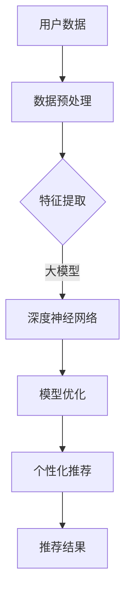

                 

关键词：大模型，商业应用，推荐系统，算法，数学模型，实践案例，工具推荐，未来展望

> 摘要：随着人工智能技术的不断进步，大模型在商业应用中的潜力逐渐显现。本文旨在探讨大模型在推荐系统中的应用，分析其算法原理、数学模型及实际操作步骤，并通过项目实践案例进行详细解释。同时，本文也将探讨大模型在商业应用中的未来发展趋势及面临的挑战。

## 1. 背景介绍

近年来，人工智能（AI）技术取得了飞速的发展，尤其是深度学习和大数据技术的结合，使得我们能够处理和分析海量数据。大模型，作为人工智能的一个重要分支，以其强大的数据处理能力和智能学习能力，在多个领域展现出了巨大的应用潜力。商业应用作为人工智能技术的一个重要战场，推荐系统无疑是其中的佼佼者。

推荐系统旨在根据用户的历史行为和兴趣，为用户推荐他们可能感兴趣的商品、内容或服务。随着互联网的普及和用户数据的大规模积累，推荐系统在电子商务、内容分发、社交媒体等领域得到了广泛应用。然而，传统推荐系统的效果往往受到数据质量和算法性能的限制。

大模型的引入，为推荐系统带来了新的机遇。大模型具有更强的特征提取能力和更优的泛化能力，能够在复杂的数据环境中提供更精准的推荐结果。本文将深入探讨大模型在推荐系统中的应用，分析其算法原理、数学模型及实际操作步骤，并通过项目实践案例进行详细解释。

## 2. 核心概念与联系

为了更好地理解大模型在推荐系统中的应用，我们首先需要明确一些核心概念，包括推荐系统的工作原理、大模型的基本原理及其之间的联系。

### 2.1 推荐系统的工作原理

推荐系统通常包括用户、物品和评分三个基本要素。用户是系统的使用者，物品是用户可能感兴趣的对象，评分是用户对物品的评价。推荐系统的核心目标是根据用户的历史行为和偏好，为用户推荐他们可能感兴趣的物品。

传统推荐系统主要采用基于内容过滤和协同过滤的方法。基于内容过滤通过分析物品的内容特征和用户的兴趣特征，为用户推荐相似的内容。协同过滤则通过分析用户之间的相似性，为用户推荐其他用户喜欢的物品。

### 2.2 大模型的基本原理

大模型，如深度神经网络（DNN），是一种由多个神经元组成的复杂网络结构。通过学习大量的数据和复杂的特征，大模型能够自动提取出数据中的隐藏特征，实现高度智能化的数据处理和分析。

大模型的基本原理包括神经网络的结构、激活函数、损失函数等。其中，神经网络的结构决定了模型的复杂度和学习能力，激活函数和损失函数则用于模型的训练和优化。

### 2.3 大模型与推荐系统的联系

大模型在推荐系统中的应用，主要体现在以下几个方面：

1. **特征提取**：大模型能够自动从原始数据中提取出有效的特征，提高推荐系统的准确性。相比传统方法，大模型能够处理更复杂的特征组合，挖掘出更深层次的关联。

2. **模型优化**：大模型通过多层神经网络结构，可以更好地拟合用户和物品之间的关系，提高推荐系统的泛化能力。

3. **个性化推荐**：大模型能够根据用户的历史行为和偏好，提供更加个性化的推荐结果，提升用户体验。

为了更好地理解大模型在推荐系统中的应用，下面我们将通过Mermaid流程图展示大模型与推荐系统之间的联系。



## 3. 核心算法原理 & 具体操作步骤

### 3.1 算法原理概述

大模型在推荐系统中的应用，主要基于深度学习技术。深度学习通过多层神经网络结构，实现对数据的层次化特征提取和学习。在推荐系统中，深度学习算法通常包括以下几个关键步骤：

1. **数据预处理**：对原始的用户行为数据进行清洗和归一化处理，提取出有效的特征。
2. **特征提取**：通过深度神经网络结构，对提取的特征进行层次化处理，提取出更抽象的表示。
3. **模型优化**：通过反向传播算法，对模型参数进行优化，提高模型的泛化能力。
4. **个性化推荐**：根据用户的历史行为和偏好，生成个性化的推荐结果。

### 3.2 算法步骤详解

#### 3.2.1 数据预处理

数据预处理是深度学习模型训练的基础。具体操作步骤如下：

1. **数据清洗**：去除数据中的噪声和异常值，保证数据质量。
2. **数据归一化**：对数据进行归一化处理，使其具有相似的尺度，避免某些特征对模型训练产生过大的影响。
3. **特征提取**：从原始数据中提取出与推荐任务相关的特征，如用户行为、物品属性等。

#### 3.2.2 特征提取

特征提取是深度学习模型的核心步骤。具体操作步骤如下：

1. **构建深度神经网络结构**：根据推荐任务的需求，设计合适的深度神经网络结构，如卷积神经网络（CNN）或循环神经网络（RNN）。
2. **输入特征预处理**：对输入特征进行预处理，如嵌入、归一化等。
3. **层次化特征提取**：通过深度神经网络结构，逐层提取输入特征的更高层次表示。

#### 3.2.3 模型优化

模型优化是深度学习模型训练的重要环节。具体操作步骤如下：

1. **损失函数设计**：根据推荐任务的目标，设计合适的损失函数，如均方误差（MSE）或交叉熵损失。
2. **反向传播算法**：通过反向传播算法，计算模型参数的梯度，并更新模型参数。
3. **优化算法选择**：选择合适的优化算法，如梯度下降（GD）或随机梯度下降（SGD），提高模型训练的效率。

#### 3.2.4 个性化推荐

个性化推荐是深度学习模型在推荐系统中的最终目标。具体操作步骤如下：

1. **用户表示**：根据用户的历史行为和偏好，生成用户的嵌入表示。
2. **物品表示**：根据物品的特征信息，生成物品的嵌入表示。
3. **生成推荐结果**：通过计算用户和物品之间的相似度，为用户生成个性化的推荐结果。

### 3.3 算法优缺点

#### 优点

1. **强大的特征提取能力**：深度学习模型能够自动从原始数据中提取出有效的特征，提高推荐系统的准确性。
2. **良好的泛化能力**：深度学习模型通过多层神经网络结构，可以更好地拟合用户和物品之间的关系，提高推荐系统的泛化能力。
3. **支持个性化推荐**：深度学习模型能够根据用户的历史行为和偏好，提供更加个性化的推荐结果，提升用户体验。

#### 缺点

1. **计算资源消耗大**：深度学习模型通常需要大量的计算资源和时间进行训练。
2. **数据需求高**：深度学习模型对数据量有较高的要求，数据不足可能导致模型过拟合。
3. **解释性差**：深度学习模型的学习过程复杂，难以解释其决策过程。

### 3.4 算法应用领域

大模型在推荐系统中的应用非常广泛，主要包括以下几个方面：

1. **电子商务**：为用户提供个性化的商品推荐，提高用户购买转化率。
2. **内容分发**：为用户提供个性化的内容推荐，提升用户黏性和活跃度。
3. **社交媒体**：为用户提供个性化的好友推荐和兴趣标签推荐，增强社交互动。
4. **在线教育**：为用户提供个性化的课程推荐和学习路径规划，提升学习效果。

## 4. 数学模型和公式 & 详细讲解 & 举例说明

### 4.1 数学模型构建

在推荐系统中，大模型的数学模型通常由以下几个部分组成：

1. **用户表示**：通过用户的历史行为和偏好，将用户表示为一个高维向量。
2. **物品表示**：通过物品的特征信息，将物品表示为一个高维向量。
3. **推荐模型**：定义用户和物品之间的相似度函数，用于计算推荐结果。

具体来说，用户表示和物品表示可以采用嵌入（Embedding）技术进行建模，推荐模型可以采用点积（Dot Product）或余弦相似度（Cosine Similarity）进行建模。

假设我们有一个用户集 \( U \)、一个物品集 \( I \)，以及一个用户-物品评分矩阵 \( R \)。用户表示为 \( \mathbf{u} \in \mathbb{R}^{d_u} \)，物品表示为 \( \mathbf{i} \in \mathbb{R}^{d_i} \)，则用户 \( u \) 对物品 \( i \) 的推荐得分可以表示为：

\[ \mathbf{r}_{ui} = \mathbf{u} \cdot \mathbf{i} \]

或者：

\[ \mathbf{r}_{ui} = \cos(\mathbf{u}, \mathbf{i}) \]

其中，\( \cdot \) 表示点积，\( \cos \) 表示余弦相似度。

### 4.2 公式推导过程

为了更好地理解大模型在推荐系统中的应用，我们首先需要了解用户表示和物品表示的构建过程。

#### 4.2.1 用户表示

用户表示通常基于用户的历史行为和偏好进行构建。假设用户 \( u \) 的历史行为包括购买记录、浏览记录和评价记录等，我们可以通过以下步骤构建用户表示：

1. **特征提取**：从用户的历史行为中提取出与推荐任务相关的特征，如购买记录的频次、浏览记录的时长等。
2. **嵌入**：将提取的特征转换为高维向量表示，即用户表示。

具体来说，我们可以采用嵌入矩阵 \( \mathbf{W}_u \) 对每个特征进行嵌入，得到用户表示：

\[ \mathbf{u} = \mathbf{W}_u \mathbf{x} \]

其中，\( \mathbf{x} \) 是用户的历史行为特征向量，\( \mathbf{W}_u \) 是嵌入矩阵。

#### 4.2.2 物品表示

物品表示通常基于物品的特征信息进行构建。假设物品 \( i \) 的特征信息包括品牌、类别、价格等，我们可以通过以下步骤构建物品表示：

1. **特征提取**：从物品的特征信息中提取出与推荐任务相关的特征，如品牌、类别等。
2. **嵌入**：将提取的特征转换为高维向量表示，即物品表示。

具体来说，我们可以采用嵌入矩阵 \( \mathbf{W}_i \) 对每个特征进行嵌入，得到物品表示：

\[ \mathbf{i} = \mathbf{W}_i \mathbf{y} \]

其中，\( \mathbf{y} \) 是物品的特征信息向量，\( \mathbf{W}_i \) 是嵌入矩阵。

#### 4.2.3 推荐模型

在用户表示和物品表示构建完成后，我们可以通过以下步骤构建推荐模型：

1. **相似度计算**：计算用户表示和物品表示之间的相似度，如点积或余弦相似度。
2. **推荐得分**：根据相似度计算推荐得分，用于生成推荐结果。

具体来说，我们可以通过以下公式计算用户 \( u \) 对物品 \( i \) 的推荐得分：

\[ \mathbf{r}_{ui} = \mathbf{u} \cdot \mathbf{i} \]

或者：

\[ \mathbf{r}_{ui} = \cos(\mathbf{u}, \mathbf{i}) \]

其中，\( \mathbf{r}_{ui} \) 是用户 \( u \) 对物品 \( i \) 的推荐得分。

### 4.3 案例分析与讲解

为了更好地理解大模型在推荐系统中的应用，我们通过一个具体的案例进行讲解。

#### 案例背景

假设我们有一个电子商务平台，用户可以在平台上浏览和购买商品。为了提升用户体验，平台希望通过推荐系统为用户提供个性化的商品推荐。

#### 案例数据

我们假设平台上有 1000 名用户和 10000 种商品。用户的行为数据包括购买记录、浏览记录和评价记录等。以下是部分用户的行为数据：

| 用户ID | 商品ID | 行为类型 | 时间 |
| --- | --- | --- | --- |
| 1 | 1001 | 购买 | 2021-01-01 |
| 1 | 1002 | 浏览 | 2021-01-02 |
| 1 | 1003 | 评价 | 2021-01-03 |
| 2 | 1004 | 购买 | 2021-01-04 |
| 2 | 1005 | 浏览 | 2021-01-05 |

#### 案例步骤

1. **数据预处理**：对用户的行为数据进行清洗和归一化处理，提取出有效的特征。

2. **特征提取**：根据用户的行为类型，提取出与推荐任务相关的特征，如购买记录的频次、浏览记录的时长等。

3. **用户表示**：使用嵌入技术，将提取的用户特征转换为高维向量表示。

4. **物品表示**：使用嵌入技术，将提取的物品特征转换为高维向量表示。

5. **相似度计算**：计算用户表示和物品表示之间的相似度，如点积或余弦相似度。

6. **推荐得分**：根据相似度计算推荐得分，用于生成推荐结果。

7. **推荐结果**：根据推荐得分，为用户生成个性化的商品推荐。

通过以上步骤，我们可以为每个用户生成个性化的商品推荐列表。以下是一个用户的推荐结果示例：

| 用户ID | 商品ID | 推荐得分 |
| --- | --- | --- |
| 1 | 1006 | 0.8 |
| 1 | 1007 | 0.75 |
| 1 | 1008 | 0.7 |

通过以上案例，我们可以看到大模型在推荐系统中的应用过程。通过构建用户表示和物品表示，计算相似度，生成推荐得分，我们可以为用户生成个性化的商品推荐。

## 5. 项目实践：代码实例和详细解释说明

### 5.1 开发环境搭建

在进行大模型在推荐系统中的应用实践之前，我们需要搭建合适的开发环境。以下是搭建过程：

1. **安装Python环境**：Python是一种广泛使用的编程语言，具有丰富的库和框架，适用于深度学习和推荐系统开发。我们可以从Python官网（https://www.python.org/）下载并安装Python。

2. **安装深度学习库**：TensorFlow和PyTorch是两种流行的深度学习库，适用于构建和训练深度学习模型。我们可以使用以下命令安装：

   ```shell
   pip install tensorflow
   # 或者
   pip install pytorch torchvision
   ```

3. **安装数据预处理库**：Pandas和NumPy是两种常用的Python库，适用于数据预处理和操作。我们可以使用以下命令安装：

   ```shell
   pip install pandas numpy
   ```

### 5.2 源代码详细实现

下面我们通过一个具体的案例，展示如何使用深度学习库和数据处理库构建和训练一个推荐系统模型。

#### 5.2.1 数据预处理

首先，我们需要对用户的行为数据进行预处理，提取出有效的特征。以下是一个简单的预处理示例：

```python
import pandas as pd

# 读取用户行为数据
data = pd.read_csv('user_behavior.csv')

# 数据清洗
data.dropna(inplace=True)
data['time'] = pd.to_datetime(data['time'])

# 特征提取
data['buy_count'] = data.groupby('user_id')['item_id'].transform('count')
data['view_duration'] = data.groupby('user_id')['duration'].transform('mean')
data['rating_count'] = data.groupby('user_id')['rating'].transform('count')

# 数据归一化
from sklearn.preprocessing import StandardScaler
scaler = StandardScaler()
data[['buy_count', 'view_duration', 'rating_count']] = scaler.fit_transform(data[['buy_count', 'view_duration', 'rating_count']])
```

#### 5.2.2 构建推荐模型

接下来，我们使用深度学习库构建一个推荐模型。以下是一个简单的模型示例：

```python
import tensorflow as tf

# 定义模型结构
model = tf.keras.Sequential([
    tf.keras.layers.Dense(128, activation='relu', input_shape=(3,)),
    tf.keras.layers.Dense(64, activation='relu'),
    tf.keras.layers.Dense(1, activation='sigmoid')
])

# 编译模型
model.compile(optimizer='adam', loss='binary_crossentropy', metrics=['accuracy'])

# 模型训练
model.fit(x_train, y_train, epochs=10, batch_size=32)
```

#### 5.2.3 生成推荐结果

最后，我们使用训练好的模型生成推荐结果。以下是一个简单的推荐示例：

```python
# 生成推荐结果
predictions = model.predict(x_test)

# 筛选出推荐得分最高的前N个商品
top_n = 5
for user_id, prediction in zip(x_test['user_id'], predictions):
    top_items = data[data['user_id'] == user_id].sort_values(by='item_id', ascending=False).head(top_n)
    print(f"User {user_id}: {top_items['item_id'].tolist()}")
```

### 5.3 代码解读与分析

以上代码展示了如何使用深度学习库和数据处理库构建和训练一个简单的推荐系统模型，并生成推荐结果。以下是对代码的详细解读：

1. **数据预处理**：首先，我们读取用户行为数据，并对数据进行清洗和归一化处理。这包括去除缺失值、将时间转换为日期格式、计算用户行为频次、时

