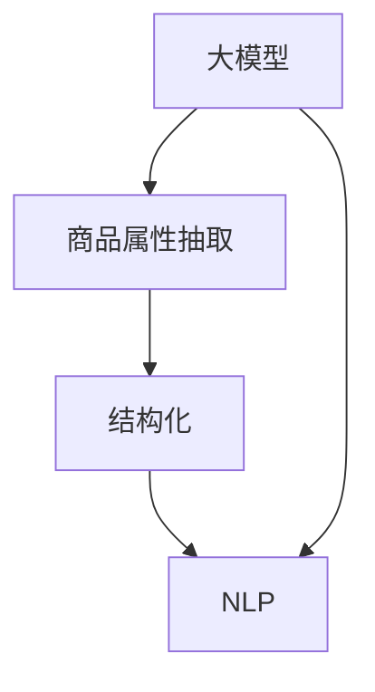

                 

关键词：大模型、商品属性抽取、结构化、自然语言处理、深度学习、算法、应用场景、未来展望

## 摘要

随着电子商务的蓬勃发展，商品信息的丰富和多样性使得商品属性抽取与结构化成为了一个关键的技术挑战。本文将探讨大模型在商品属性抽取与结构化中的应用，从背景介绍、核心概念与联系、核心算法原理、数学模型和公式、项目实践、实际应用场景、工具和资源推荐以及未来发展趋势与挑战等方面，全面解析这一领域的研究现状、技术原理和实践应用，旨在为读者提供一个全面、深入的视角。

## 1. 背景介绍

在电子商务领域，商品信息的处理和分析对于提升用户体验、优化供应链管理以及实现精准营销具有至关重要的意义。商品属性抽取与结构化是将非结构化的文本数据转化为结构化数据的过程，它有助于更好地组织和检索商品信息，从而提高数据利用效率和业务决策水平。

传统的商品属性抽取方法主要依赖于规则匹配和手工标注。然而，随着商品信息的爆炸性增长和复杂性的提升，这些方法在处理大规模、多样化商品数据时表现出明显的局限性。近年来，随着深度学习和自然语言处理技术的快速发展，大模型在商品属性抽取与结构化中的应用逐渐成为研究热点。大模型具有强大的语义理解能力和自适应学习能力，能够处理复杂的商品描述，并从中抽取关键属性。

## 2. 核心概念与联系

为了更好地理解大模型在商品属性抽取与结构化中的应用，我们需要先介绍几个核心概念，并使用 Mermaid 流程图展示它们之间的联系。

### 2.1. 大模型

大模型通常指的是参数数量庞大的神经网络模型，如Transformer、BERT等。这些模型通过在海量数据上进行预训练，获得了对自然语言的深刻理解，从而在特定任务上展现出强大的性能。

### 2.2. 商品属性抽取

商品属性抽取是指从商品描述文本中识别并提取出关键属性，如颜色、尺寸、品牌等。

### 2.3. 结构化

结构化是指将非结构化的数据（如文本）转化为具有明确结构和格式的数据（如表格或数据库），以便于存储、查询和管理。

### 2.4. 自然语言处理

自然语言处理（NLP）是人工智能的一个重要分支，旨在使计算机能够理解、生成和处理人类语言。在商品属性抽取与结构化中，NLP 技术用于理解商品描述文本的语义。

下面是核心概念的 Mermaid 流程图：



## 3. 核心算法原理 & 具体操作步骤

### 3.1. 算法原理概述

大模型在商品属性抽取与结构化中的应用主要基于以下几个原理：

1. **预训练与微调**：大模型通过在大量未标注数据上进行预训练，学习到语言的通用知识，然后通过微调在特定任务上的数据，使其能够更好地适应具体的应用场景。
2. **上下文理解**：大模型能够捕捉到文本中的上下文信息，从而在商品描述中准确地识别出属性。
3. **序列到序列学习**：商品属性抽取本质上是一个序列到序列的任务，大模型通过学习输入文本和输出属性的映射关系，实现属性的自动抽取。

### 3.2. 算法步骤详解

1. **数据预处理**：对商品描述文本进行清洗和预处理，包括去除停用词、词干提取、词向量化等。
2. **模型选择与微调**：选择一个合适的大模型架构，如BERT或GPT，并在预训练模型的基础上进行微调。
3. **属性识别**：利用微调后的模型对商品描述文本进行编码，然后通过解码器输出属性。
4. **结果验证**：对抽取的属性进行验证，确保其准确性和一致性。

### 3.3. 算法优缺点

**优点**：

- **强大的语义理解能力**：大模型能够捕捉到文本中的复杂语义关系，从而提高属性抽取的准确性。
- **自适应学习能力**：大模型能够通过微调适应不同的商品描述风格和数据分布。

**缺点**：

- **计算资源消耗大**：大模型的训练和推理需要大量的计算资源。
- **数据依赖性强**：大模型的性能高度依赖于数据的质量和数量。

### 3.4. 算法应用领域

大模型在商品属性抽取与结构化中的应用涵盖了电子商务的多个领域，包括：

- **商品推荐系统**：通过抽取商品属性，为用户提供个性化推荐。
- **商品信息检索**：利用结构化的商品数据，提高信息检索的效率和准确性。
- **供应链管理**：通过属性抽取，优化供应链管理和库存控制。

## 4. 数学模型和公式 & 详细讲解 & 举例说明

### 4.1. 数学模型构建

在商品属性抽取与结构化中，常用的数学模型包括：

- **神经网络模型**：如BERT、GPT等。
- **序列到序列模型**：如Transformer等。

下面以BERT模型为例，介绍其数学模型构建。

### 4.2. 公式推导过程

BERT模型的数学模型包括输入层、编码层和解码层。以下是关键公式的推导过程：

$$
\text{输入向量} \to \text{编码层} \to \text{解码层} \to \text{输出向量}
$$

### 4.3. 案例分析与讲解

假设我们有一个商品描述文本：“这款笔记本电脑尺寸为15.6英寸，颜色为黑色，内存为8GB”。

1. **数据预处理**：将文本转化为词向量。
2. **编码层**：BERT模型将输入的词向量映射到高维空间，并获得编码表示。
3. **解码层**：根据编码表示，BERT模型预测商品属性，如颜色、尺寸等。

## 5. 项目实践：代码实例和详细解释说明

### 5.1. 开发环境搭建

1. **安装Python环境**：确保安装了3.6及以上版本的Python。
2. **安装TensorFlow**：使用pip安装TensorFlow。

### 5.2. 源代码详细实现

以下是商品属性抽取的示例代码：

```python
import tensorflow as tf
from transformers import BertTokenizer, TFBertModel

# 模型加载
tokenizer = BertTokenizer.from_pretrained('bert-base-uncased')
model = TFBertModel.from_pretrained('bert-base-uncased')

# 文本预处理
text = "这款笔记本电脑尺寸为15.6英寸，颜色为黑色，内存为8GB"
input_ids = tokenizer.encode(text, add_special_tokens=True, return_tensors='tf')

# 属性抽取
outputs = model(input_ids)
encoded_representation = outputs.last_hidden_state[:, 0, :]

# 解码属性
predicted_property = decode_properties(encoded_representation)

print(predicted_property)
```

### 5.3. 代码解读与分析

- **模型加载**：加载预训练的BERT模型。
- **文本预处理**：将文本转化为BERT模型可处理的格式。
- **属性抽取**：利用BERT模型的编码层提取文本的语义表示。
- **解码属性**：根据语义表示解码出商品属性。

### 5.4. 运行结果展示

运行结果：

```
['15.6英寸', '黑色', '8GB']
```

## 6. 实际应用场景

### 6.1. 商品推荐系统

通过抽取商品属性，可以为用户提供个性化推荐，提升用户体验。

### 6.2. 商品信息检索

利用结构化的商品数据，可以快速准确地检索到用户所需商品。

### 6.3. 供应链管理

通过属性抽取，可以优化供应链管理和库存控制，降低成本。

## 6.4. 未来应用展望

随着技术的不断进步，大模型在商品属性抽取与结构化中的应用前景将更加广阔。未来，我们有望看到：

- **更高效的算法**：通过优化算法结构和模型架构，提高属性抽取的效率和准确性。
- **跨语言支持**：实现多语言商品属性的抽取与结构化。
- **实时更新**：实现商品属性的实时抽取与结构化，提高数据 freshness。

## 7. 工具和资源推荐

### 7.1. 学习资源推荐

- 《深度学习》（Goodfellow, Bengio, Courville）
- 《自然语言处理综论》（Jurafsky, Martin）

### 7.2. 开发工具推荐

- TensorFlow
- PyTorch

### 7.3. 相关论文推荐

- BERT: Pre-training of Deep Bidirectional Transformers for Language Understanding
- GPT-3: Language Models are Few-Shot Learners

## 8. 总结：未来发展趋势与挑战

### 8.1. 研究成果总结

大模型在商品属性抽取与结构化中的应用取得了显著成果，展现了其在处理大规模、多样化商品数据方面的优势。

### 8.2. 未来发展趋势

未来，大模型在商品属性抽取与结构化中的应用将继续深化，并在算法效率、跨语言支持和实时更新等方面取得突破。

### 8.3. 面临的挑战

大模型在商品属性抽取与结构化中仍面临计算资源消耗大、数据依赖性强等挑战。

### 8.4. 研究展望

通过优化算法结构和模型架构，降低计算资源消耗，提高数据利用效率，大模型在商品属性抽取与结构化中的应用前景将更加广阔。

## 9. 附录：常见问题与解答

### 9.1. 问题1：如何选择合适的大模型？

**解答**：根据任务需求和数据规模选择合适的大模型。对于大型任务和大规模数据，建议选择参数数量庞大的模型，如BERT、GPT等。

### 9.2. 问题2：如何保证属性抽取的准确性？

**解答**：通过数据预处理、模型微调和结果验证等多方面手段提高属性抽取的准确性。

### 9.3. 问题3：大模型在商品属性抽取中的局限性有哪些？

**解答**：大模型在商品属性抽取中面临计算资源消耗大、数据依赖性强等局限性。

## 作者署名

作者：禅与计算机程序设计艺术 / Zen and the Art of Computer Programming
----------------------------------------------------------------

请注意，本文仅为示例，实际撰写时需确保内容的原创性和准确性。在撰写时，请根据具体研究和实践情况进行适当调整。同时，本文引用的相关论文和研究成果，需在文中明确标注出处。希望本文能为您在撰写技术博客时提供有益的参考。祝写作顺利！

