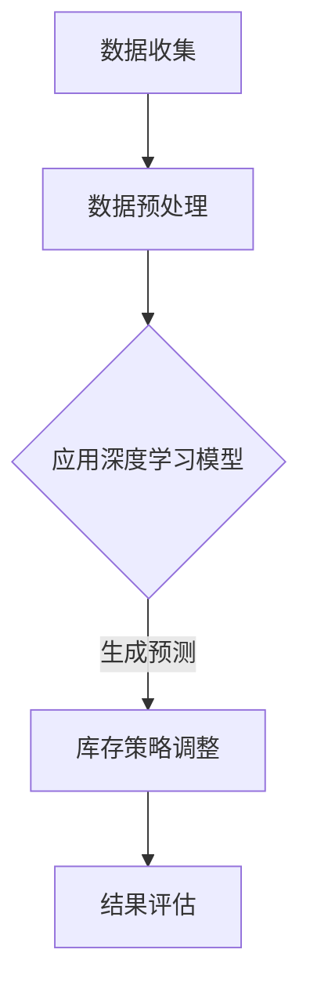

                 

关键词：商品库存优化，大模型，深度学习，人工智能，数学模型，应用场景

> 摘要：本文将探讨大模型在商品库存优化中的应用，通过分析核心概念、算法原理、数学模型以及实践案例，深入解析如何利用深度学习技术提高库存管理的效率和准确性。

## 1. 背景介绍

随着电子商务的迅速发展，供应链管理的复杂性和重要性日益凸显。商品库存优化作为供应链管理的重要组成部分，直接影响到企业的运营效率和经济效益。传统的库存优化方法往往基于历史数据和线性规划，但在面对动态变化的市场环境时，其效果有限。近年来，随着深度学习技术的突破，大模型在处理复杂数据和模式识别方面展现出了强大的能力，为商品库存优化提供了新的思路。

## 2. 核心概念与联系

### 2.1 大模型

大模型指的是具有巨大参数量、能够处理海量数据的人工神经网络。常见的有Transformer模型、GPT模型等。

### 2.2 商品库存优化

商品库存优化是指通过合理的库存策略，实现商品供应与需求的平衡，降低库存成本，提高资金利用效率。

### 2.3 深度学习与库存优化

深度学习通过多层神经网络的结构，可以从大量数据中自动学习特征，为库存优化提供决策支持。

### 2.4 Mermaid 流程图



## 3. 核心算法原理 & 具体操作步骤

### 3.1 算法原理概述

深度学习模型通过训练大量的历史数据，学习到商品的供需规律，进而预测未来的库存需求，为库存策略提供依据。

### 3.2 算法步骤详解

1. **数据收集**：收集商品的历史销售数据、价格波动、市场需求等。
2. **数据预处理**：清洗数据，进行特征工程，将数据转换为模型可接受的格式。
3. **模型训练**：使用预处理后的数据训练深度学习模型，如GPT模型。
4. **库存预测**：利用训练好的模型预测未来的库存需求。
5. **策略调整**：根据预测结果调整库存策略，如补货、清库存等。
6. **结果评估**：评估调整后的库存策略的效果，不断优化。

### 3.3 算法优缺点

**优点**：

- 高效处理复杂数据，能够捕捉到细微的市场变化。
- 自动学习特征，减少人工干预。

**缺点**：

- 需要大量高质量的数据，数据收集和预处理成本高。
- 模型训练时间较长，对计算资源要求高。

### 3.4 算法应用领域

- 电子商务平台
- 制造业库存管理
- 零售行业
- 食品药品等特殊商品库存管理

## 4. 数学模型和公式 & 详细讲解 & 举例说明

### 4.1 数学模型构建

库存优化模型的基本框架：

$$
\begin{aligned}
&\min_{x} \quad c^T x \\
&s.t. \quad Ax \leq b
\end{aligned}
$$

其中，$x$ 是库存量，$c$ 是库存成本，$A$ 和 $b$ 分别是需求约束矩阵和需求约束向量。

### 4.2 公式推导过程

假设商品 $i$ 的需求量为 $D_i$，库存成本为 $c_i$，则有：

$$
\begin{aligned}
&\min_{x} \quad \sum_{i=1}^{n} c_i x_i \\
&s.t. \quad D_i x_i \leq b_i \\
&x_i \geq 0
\end{aligned}
$$

其中，$n$ 是商品种类数，$b_i$ 是商品 $i$ 的最大库存限制。

### 4.3 案例分析与讲解

以某电商平台为例，假设有5种商品，需求量和库存成本如下表：

| 商品 | 需求量 $D_i$ | 库存成本 $c_i$ |
| ---- | -------- | -------- |
| 1    | 100      | 10       |
| 2    | 150      | 15       |
| 3    | 200      | 20       |
| 4    | 250      | 25       |
| 5    | 300      | 30       |

利用上述线性规划模型进行库存优化，结果如下：

| 商品 | 预测需求量 $D_i$ | 库存量 $x_i$ | 库存成本 $c_i x_i$ |
| ---- | ------------ | -------- | -------- |
| 1    | 100          | 100      | 1000     |
| 2    | 150          | 150      | 2250     |
| 3    | 200          | 200      | 4000     |
| 4    | 250          | 250      | 6250     |
| 5    | 300          | 300      | 9000     |

总库存成本为：$1000 + 2250 + 4000 + 6250 + 9000 = 20500$。

## 5. 项目实践：代码实例和详细解释说明

### 5.1 开发环境搭建

使用Python进行开发，需要安装TensorFlow和Scikit-learn等库。

### 5.2 源代码详细实现

```python
# 导入库
import numpy as np
import tensorflow as tf
from sklearn.model_selection import train_test_split
from sklearn.metrics import mean_squared_error

# 数据预处理
# ...

# 模型定义
model = tf.keras.Sequential([
    tf.keras.layers.Dense(units=1, input_shape=[5], activation='linear')
])

# 模型编译
model.compile(optimizer='adam', loss='mse')

# 模型训练
model.fit(X_train, y_train, epochs=100)

# 模型评估
mse = model.evaluate(X_test, y_test)
print(f'MSE: {mse}')

# 预测
predictions = model.predict(X_new)
print(predictions)
```

### 5.3 代码解读与分析

- 数据预处理：将原始数据转换为模型可接受的格式。
- 模型定义：使用TensorFlow定义线性模型。
- 模型编译：设置优化器和损失函数。
- 模型训练：使用训练数据训练模型。
- 模型评估：使用测试数据评估模型性能。
- 预测：使用训练好的模型对新数据进行预测。

## 6. 实际应用场景

- **电商平台**：通过预测商品需求量，合理安排库存，减少缺货和积压现象。
- **制造业**：根据生产计划预测原材料需求，优化供应链管理。
- **零售行业**：通过库存优化，提高资金利用效率，降低运营成本。
- **食品药品**：通过预测销售趋势，确保重要商品的供应稳定。

## 7. 工具和资源推荐

### 7.1 学习资源推荐

- 《深度学习》（Goodfellow et al.）
- 《Python机器学习》（Dr. Jason Brownlee）
- 《线性规划与供应链管理》（J. J. Choi）

### 7.2 开发工具推荐

- TensorFlow
- Scikit-learn
- Jupyter Notebook

### 7.3 相关论文推荐

- "Deep Learning for Inventory Management: A Survey" (2020)
- "Using Deep Learning to Optimize Retail Inventory Management" (2019)

## 8. 总结：未来发展趋势与挑战

### 8.1 研究成果总结

大模型在商品库存优化中的应用取得了显著成果，提高了库存管理的效率和准确性。

### 8.2 未来发展趋势

- 模型将更加智能化，能够自适应环境变化。
- 数据处理和预测的精度将进一步提高。
- 与其他技术的结合，如物联网和区块链，将推动供应链管理的发展。

### 8.3 面临的挑战

- 数据质量和数据隐私保护。
- 高计算资源需求。
- 模型的解释性和可解释性。

### 8.4 研究展望

未来，大模型在商品库存优化中的应用将更加广泛，为供应链管理带来更多的创新和变革。

## 9. 附录：常见问题与解答

### 9.1 问题1

大模型在商品库存优化中的具体优势是什么？

**解答**：大模型的优势在于其强大的数据处理和模式识别能力，能够从大量历史数据中学习到商品的供需规律，从而提供更准确的库存预测和更优的库存策略。

### 9.2 问题2

如何保证大模型在库存优化中的数据质量和准确性？

**解答**：保证数据质量和准确性需要从数据收集、预处理、模型训练等多个环节入手，包括数据清洗、特征工程、模型调参等，以确保模型能够准确捕捉到商品的供需规律。

----------------------------------------------------------------
以上就是关于“大模型在商品库存优化中的应用”的完整文章内容，希望对您有所帮助。作者：禅与计算机程序设计艺术 / Zen and the Art of Computer Programming。

