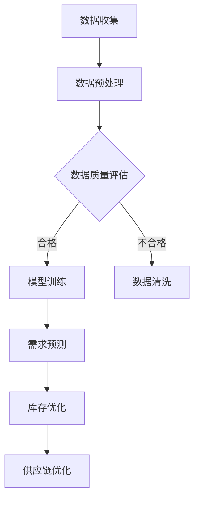

                 

 关键词：大模型，商品库存，智能管理，AI，数据挖掘，机器学习，供应链优化

> 摘要：本文探讨了如何利用大模型技术，特别是人工智能和机器学习算法，来优化商品库存管理。通过介绍大模型的基本概念、工作原理和应用案例，文章深入分析了大模型在商品库存管理中的实际应用，并提出了未来发展的趋势和挑战。

## 1. 背景介绍

商品库存管理是零售和供应链管理中的一个关键环节。高效的库存管理不仅可以减少库存成本，还能提高客户满意度，增加企业的利润。然而，传统的库存管理方法往往依赖于历史数据和规则，难以应对复杂多变的市场环境。随着人工智能技术的快速发展，尤其是大模型的兴起，为商品库存管理提供了一种全新的解决方案。

大模型，也称为大型预训练模型，是指经过大规模数据训练的深度学习模型。这些模型拥有强大的特征提取能力和泛化能力，能够处理海量数据，并在多种任务上实现高性能。在商品库存管理中，大模型可以通过数据挖掘和机器学习算法，对库存数据进行深度分析，从而实现更加精准和智能的库存管理。

## 2. 核心概念与联系

### 2.1 大模型的基本概念

大模型是指规模庞大的深度学习模型，通常具有数亿甚至数十亿的参数。这些模型通过在大规模数据集上进行预训练，能够学习到数据的复杂模式，从而在多种任务上表现出色。

### 2.2 大模型的工作原理

大模型的工作原理主要基于深度学习和神经网络。通过多层神经网络的堆叠，模型可以自动提取数据中的高维特征，从而实现复杂的数据分析任务。大模型的训练通常涉及大量计算资源和时间，但一旦训练完成，其性能稳定，且能够处理大规模数据。

### 2.3 大模型与商品库存管理的关系

大模型在商品库存管理中的应用，主要体现在以下几个方面：

- **需求预测**：通过分析历史销售数据和外部因素，大模型可以预测未来的商品需求，帮助企业制定更加精准的库存计划。

- **库存优化**：大模型可以根据实时数据，动态调整库存水平，避免库存过剩或短缺。

- **供应链优化**：大模型可以分析供应链中的各种数据，优化物流和库存流程，提高供应链的整体效率。

### 2.4 Mermaid 流程图

下面是一个简化的 Mermaid 流程图，展示了大模型在商品库存管理中的基本工作流程：



## 3. 核心算法原理 & 具体操作步骤

### 3.1 算法原理概述

在商品库存管理中，大模型的核心算法主要包括：

- **需求预测算法**：如时间序列分析、回归分析等。
- **库存优化算法**：如基于线性规划的方法、基于神经网络的优化算法等。
- **供应链优化算法**：如多目标优化、遗传算法等。

### 3.2 算法步骤详解

1. **数据收集**：收集历史销售数据、供应商数据、客户数据等。
2. **数据预处理**：清洗数据，处理缺失值和异常值。
3. **数据质量评估**：评估数据的质量，决定是否需要进一步处理。
4. **模型训练**：使用大量数据训练需求预测、库存优化和供应链优化模型。
5. **需求预测**：利用训练好的模型，预测未来的商品需求。
6. **库存优化**：根据需求预测结果，调整库存水平，确保库存平衡。
7. **供应链优化**：优化供应链中的物流和库存流程，提高整体效率。

### 3.3 算法优缺点

**优点**：

- **高效性**：大模型能够快速处理海量数据，提高库存管理的效率。
- **准确性**：通过深度学习和机器学习，大模型可以更准确地预测需求，优化库存。
- **灵活性**：大模型可以根据不同的业务场景，灵活调整算法参数。

**缺点**：

- **计算资源消耗**：大模型的训练和推理需要大量计算资源。
- **数据依赖性**：大模型的效果很大程度上依赖于数据的质量和数量。
- **隐私风险**：大模型可能会涉及敏感数据的处理，存在隐私风险。

### 3.4 算法应用领域

大模型在商品库存管理中的应用非常广泛，包括：

- **零售行业**：优化库存，提高销售额。
- **制造业**：优化生产计划，减少库存成本。
- **物流行业**：优化物流路线，提高运输效率。
- **农业**：预测农作物需求，优化库存和供应。

## 4. 数学模型和公式 & 详细讲解 & 举例说明

### 4.1 数学模型构建

在商品库存管理中，常用的数学模型包括：

- **需求预测模型**：如 ARIMA、LSTM 等。
- **库存优化模型**：如线性规划、遗传算法等。
- **供应链优化模型**：如多目标优化、贝叶斯优化等。

### 4.2 公式推导过程

以 ARIMA 模型为例，其公式推导如下：

$$
y_t = \phi_1 y_{t-1} + \phi_2 y_{t-2} + \cdots + \phi_p y_{t-p} + \theta_1 e_{t-1} + \theta_2 e_{t-2} + \cdots + \theta_q e_{t-q} + u_t
$$

其中，$y_t$ 为时间序列数据，$e_t$ 为白噪声序列，$u_t$ 为残差。

### 4.3 案例分析与讲解

假设某零售企业需要预测下周某商品的需求量。首先，收集该商品过去一年的销售数据，然后使用 ARIMA 模型进行训练。经过训练，得到以下模型：

$$
y_t = 0.8 y_{t-1} + 0.2 y_{t-2} + 0.1 e_{t-1}
$$

根据该模型，可以预测下周该商品的需求量为：

$$
y_{t+1} = 0.8 \times 0.8 y_{t-1} + 0.2 \times 0.2 y_{t-2} + 0.1 \times 0.1 e_{t-1}
$$

通过这样的预测，企业可以提前准备库存，确保供应需求。

## 5. 项目实践：代码实例和详细解释说明

### 5.1 开发环境搭建

在 Python 中，可以使用以下命令搭建开发环境：

```python
pip install numpy pandas matplotlib scikit-learn tensorflow
```

### 5.2 源代码详细实现

以下是一个简单的 ARIMA 模型实现示例：

```python
import numpy as np
import pandas as pd
from statsmodels.tsa.arima.model import ARIMA
from sklearn.metrics import mean_squared_error

# 加载数据
data = pd.read_csv('sales_data.csv')
sales = data['sales'].values

# 分离训练集和测试集
train_size = int(len(sales) * 0.8)
train, test = sales[:train_size], sales[train_size:]

# 训练 ARIMA 模型
model = ARIMA(train, order=(1, 1, 1))
model_fit = model.fit()

# 预测
predictions = model_fit.forecast(steps=len(test))

# 评估
mse = mean_squared_error(test, predictions)
print(f'MSE: {mse}')

# 可视化
import matplotlib.pyplot as plt

plt.plot(test, label='Actual')
plt.plot(predictions, label='Predicted')
plt.legend()
plt.show()
```

### 5.3 代码解读与分析

- **数据加载**：使用 pandas 加载销售数据。
- **数据分离**：分离出训练集和测试集。
- **模型训练**：使用 ARIMA 模型进行训练。
- **预测**：根据模型预测测试集的数据。
- **评估**：计算预测的均方误差。
- **可视化**：绘制实际值与预测值的对比图。

## 6. 实际应用场景

大模型在商品库存管理中有着广泛的应用，以下是一些典型的应用场景：

- **零售行业**：通过需求预测，优化库存水平，减少库存成本。
- **制造业**：通过库存优化，提高生产效率，降低库存成本。
- **物流行业**：通过供应链优化，提高运输效率，降低物流成本。
- **农业**：通过需求预测，优化农作物种植计划，提高产量。

## 7. 工具和资源推荐

### 7.1 学习资源推荐

- **书籍**：《Python for Data Analysis》、《Deep Learning》
- **在线课程**：Coursera 上的《Machine Learning》、edX 上的《Introduction to Machine Learning》

### 7.2 开发工具推荐

- **Python**：用于数据处理和模型训练。
- **TensorFlow**：用于深度学习模型训练。
- **scikit-learn**：用于机器学习模型训练。

### 7.3 相关论文推荐

- **《Deep Learning for Time Series Classification》**
- **《ARIMA Model for Time Series Forecasting》**
- **《Inventory Management Using Machine Learning Techniques》**

## 8. 总结：未来发展趋势与挑战

### 8.1 研究成果总结

大模型在商品库存管理中已经取得了显著的成果，包括需求预测、库存优化和供应链优化等方面。通过深度学习和机器学习，大模型能够处理海量数据，实现精准的库存管理。

### 8.2 未来发展趋势

随着大模型技术的不断发展，未来商品库存管理将更加智能化和自动化。同时，大模型的应用将更加普及，覆盖更多的行业和领域。

### 8.3 面临的挑战

尽管大模型在商品库存管理中取得了显著成果，但仍面临一些挑战，包括：

- **计算资源消耗**：大模型的训练和推理需要大量计算资源。
- **数据隐私**：大模型可能会涉及敏感数据的处理，存在隐私风险。
- **模型解释性**：大模型的决策过程往往缺乏解释性，难以理解。

### 8.4 研究展望

未来，大模型在商品库存管理中的应用将更加深入和广泛。通过结合其他技术，如区块链和边缘计算，可以进一步提高库存管理的效率和安全性。

## 9. 附录：常见问题与解答

### 9.1 什么是大模型？

大模型是指经过大规模数据训练的深度学习模型，通常具有数亿甚至数十亿的参数。这些模型能够处理海量数据，并在多种任务上实现高性能。

### 9.2 大模型在商品库存管理中的优势是什么？

大模型在商品库存管理中的优势包括高效性、准确性和灵活性。它能够快速处理海量数据，实现精准的需求预测和库存优化，同时可以根据不同的业务场景，灵活调整算法参数。

### 9.3 大模型在商品库存管理中可能面临哪些挑战？

大模型在商品库存管理中可能面临以下挑战：

- **计算资源消耗**：大模型的训练和推理需要大量计算资源。
- **数据隐私**：大模型可能会涉及敏感数据的处理，存在隐私风险。
- **模型解释性**：大模型的决策过程往往缺乏解释性，难以理解。

### 9.4 大模型在哪些领域有应用？

大模型在多个领域有应用，包括零售行业、制造业、物流行业和农业等。通过需求预测、库存优化和供应链优化，大模型能够提高各行业的运营效率。

