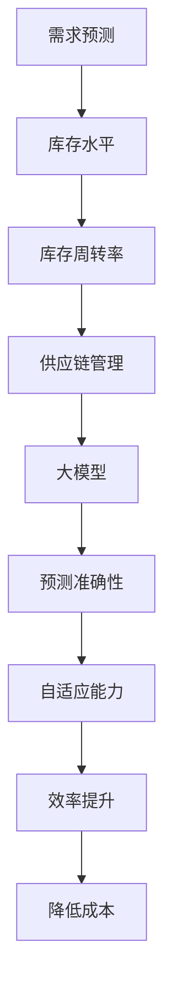

                 

关键词：大模型、商品库存、智能管理、深度学习、优化算法、预测分析、库存优化

## 摘要

本文旨在探讨大模型在商品库存智能管理中的应用，分析如何通过深度学习和优化算法来提升库存管理的效率。我们将从背景介绍、核心概念与联系、核心算法原理与具体操作步骤、数学模型与公式、项目实践、实际应用场景、未来应用展望、工具和资源推荐、总结与展望等方面进行详细论述。

## 1. 背景介绍

### 1.1 商业环境下的库存管理挑战

在现代商业环境中，库存管理是一个关键问题。随着产品种类和数量的增加，库存管理的复杂性也在不断上升。传统的库存管理方法通常依赖于经验和规则，而随着大数据和人工智能技术的发展，智能库存管理成为了一种更加高效、精准的解决方案。

### 1.2 大模型的崛起

大模型，尤其是深度学习模型，近年来在各个领域取得了显著的成果。它们通过学习海量数据，能够自动提取特征，进行复杂的模式识别和预测。大模型在图像识别、自然语言处理、推荐系统等领域已经展现出强大的能力，这些能力同样可以应用于商品库存管理。

### 1.3 大模型在库存管理中的优势

- **预测准确性**：大模型能够通过学习历史数据，预测未来的需求，从而优化库存水平。
- **自适应能力**：大模型能够根据实时数据调整预测模型，适应市场变化。
- **效率提升**：大模型能够自动化处理大量数据，减少人为干预，提高管理效率。
- **降低成本**：通过优化库存水平，减少库存过剩或短缺，降低运营成本。

## 2. 核心概念与联系

为了更好地理解大模型在商品库存智能管理中的应用，我们需要先了解一些核心概念和它们之间的关系。

### 2.1 大模型的基本概念

大模型通常是指具有数十亿到数万亿参数的神经网络模型。这些模型通过大量数据的学习，能够进行复杂的计算和预测。常见的深度学习模型包括卷积神经网络（CNN）、循环神经网络（RNN）、Transformer等。

### 2.2 商品库存管理中的关键概念

- **需求预测**：预测商品的未来需求。
- **库存水平**：当前库存的数量。
- **库存周转率**：商品从入库到出库的时间。
- **供应链管理**：协调供应商、制造商、分销商和零售商之间的物流和信息流。

### 2.3 Mermaid 流程图



## 3. 核心算法原理 & 具体操作步骤

### 3.1 算法原理概述

在商品库存管理中，大模型的核心算法通常是基于深度学习和优化算法的。以下是一个基本的算法流程：

1. **数据收集**：收集与商品库存相关的数据，如历史需求、价格、促销活动等。
2. **数据处理**：对数据进行预处理，如去噪、标准化、特征提取等。
3. **模型训练**：使用预处理后的数据训练深度学习模型。
4. **预测与优化**：利用训练好的模型进行需求预测，并根据预测结果调整库存水平。

### 3.2 算法步骤详解

1. **数据收集**：
   - **历史需求数据**：包括过去一段时间内每种商品的需求量。
   - **价格数据**：每种商品的价格变化情况。
   - **促销活动数据**：商品的促销活动信息。
   - **供应链数据**：供应商、制造商、分销商和零售商之间的物流信息。

2. **数据处理**：
   - **去噪**：去除数据中的噪声。
   - **标准化**：将不同量级的数据转换为同一量级。
   - **特征提取**：从数据中提取有用的特征，如季节性、价格弹性、促销周期等。

3. **模型训练**：
   - **模型选择**：选择合适的深度学习模型，如CNN、RNN或Transformer。
   - **损失函数**：选择合适的损失函数，如均方误差（MSE）或交叉熵（CE）。
   - **优化算法**：选择优化算法，如随机梯度下降（SGD）、Adam等。

4. **预测与优化**：
   - **需求预测**：使用训练好的模型预测未来的需求。
   - **库存优化**：根据预测结果调整库存水平，以减少库存过剩或短缺。
   - **供应链调整**：根据库存调整结果，调整供应链管理策略。

### 3.3 算法优缺点

#### 优点：

- **高效性**：大模型能够处理海量数据，提高库存管理的效率。
- **准确性**：通过学习历史数据，大模型能够进行更准确的预测。
- **灵活性**：大模型能够根据实时数据调整预测模型，适应市场变化。

#### 缺点：

- **计算资源需求**：大模型需要大量的计算资源，特别是在训练阶段。
- **数据依赖性**：大模型的预测结果依赖于历史数据和数据质量。

### 3.4 算法应用领域

大模型在商品库存管理中的应用领域非常广泛，包括：

- **零售行业**：用于预测商品需求，优化库存水平。
- **制造业**：用于优化生产计划，减少库存过剩。
- **物流行业**：用于优化运输计划，提高供应链效率。

## 4. 数学模型和公式 & 详细讲解 & 举例说明

### 4.1 数学模型构建

在商品库存管理中，常用的数学模型包括需求预测模型、库存优化模型等。

#### 需求预测模型：

假设未来时间 $t$ 的需求量 $D_t$ 可以通过以下公式预测：

$$
D_t = f(W_1 \cdot X_t + b_1)
$$

其中，$W_1$ 和 $b_1$ 分别是模型权重和偏置，$X_t$ 是输入特征。

#### 库存优化模型：

假设当前库存水平 $I_t$ 需要调整以满足需求预测，我们可以通过以下公式进行优化：

$$
I_{t+1} = I_t + \alpha (D_t - I_t)
$$

其中，$\alpha$ 是调整系数。

### 4.2 公式推导过程

#### 需求预测模型：

首先，假设需求量 $D_t$ 与输入特征 $X_t$ 之间存在线性关系：

$$
D_t = \sum_{i=1}^{n} W_{i} X_{t,i} + b
$$

为了使模型更稳定，我们可以使用偏置项 $b_1$：

$$
D_t = W_1 \cdot X_t + b_1
$$

通过反向传播算法，我们可以计算模型的损失函数：

$$
\begin{aligned}
L &= \frac{1}{2} \sum_{t=1}^{T} (D_t - \hat{D}_t)^2 \\
\frac{\partial L}{\partial W_1} &= (D_t - \hat{D}_t) \cdot X_t \\
\frac{\partial L}{\partial b_1} &= (D_t - \hat{D}_t)
\end{aligned}
$$

通过梯度下降算法，我们可以更新模型的权重和偏置：

$$
\begin{aligned}
W_1 &= W_1 - \eta \cdot \frac{\partial L}{\partial W_1} \\
b_1 &= b_1 - \eta \cdot \frac{\partial L}{\partial b_1}
\end{aligned}
$$

其中，$\eta$ 是学习率。

#### 库存优化模型：

假设当前库存水平 $I_t$ 需要调整以满足需求预测 $D_t$，我们可以使用以下公式进行优化：

$$
I_{t+1} = I_t + \alpha (D_t - I_t)
$$

其中，$\alpha$ 是调整系数。为了使库存水平稳定，我们可以使用以下公式：

$$
\alpha = \frac{1}{\sigma^2 + \lambda}
$$

其中，$\sigma^2$ 是需求量的方差，$\lambda$ 是常数。

### 4.3 案例分析与讲解

#### 案例一：需求预测

假设我们需要预测未来一个月内某种商品的需求量。首先，我们收集过去一年的需求数据，并进行预处理。然后，我们使用CNN模型进行训练，并使用训练好的模型进行预测。具体操作步骤如下：

1. **数据收集**：收集过去一年的需求数据，包括每天的需求量。
2. **数据处理**：对数据进行标准化处理，并将数据分为训练集和测试集。
3. **模型训练**：使用训练集训练CNN模型，并使用测试集进行验证。
4. **预测与评估**：使用训练好的模型预测未来一个月的需求量，并评估预测结果。

#### 案例二：库存优化

假设我们需要优化某种商品的库存水平。首先，我们收集过去一年的需求数据，并进行预处理。然后，我们使用上述库存优化模型进行优化，并评估优化结果。具体操作步骤如下：

1. **数据收集**：收集过去一年的需求数据，包括每天的需求量。
2. **数据处理**：对数据进行标准化处理，并将数据分为训练集和测试集。
3. **模型训练**：使用训练集训练需求预测模型，并使用测试集进行验证。
4. **库存优化**：使用需求预测模型预测未来一个月的需求量，并根据预测结果调整库存水平。
5. **评估优化结果**：评估库存优化后的效果，如库存周转率、成本等。

## 5. 项目实践：代码实例和详细解释说明

### 5.1 开发环境搭建

为了进行商品库存智能管理的项目实践，我们需要搭建一个合适的开发环境。以下是一个基本的开发环境搭建步骤：

1. **安装Python**：Python是深度学习的主要编程语言，我们需要安装Python 3.8及以上版本。
2. **安装TensorFlow**：TensorFlow是一个开源的深度学习框架，用于构建和训练深度学习模型。
3. **安装NumPy和Pandas**：NumPy和Pandas是Python的数据处理库，用于数据处理和数据分析。
4. **安装Mermaid**：Mermaid是一个基于Markdown的流程图绘制工具，用于绘制流程图。

### 5.2 源代码详细实现

以下是商品库存智能管理的源代码实现，包括需求预测模型和库存优化模型。

```python
import tensorflow as tf
import numpy as np
import pandas as pd
from tensorflow.keras.models import Sequential
from tensorflow.keras.layers import Dense, Conv1D, Flatten
from tensorflow.keras.optimizers import Adam

# 数据处理
def preprocess_data(data):
    # 去除噪声、标准化、特征提取等操作
    # ...
    return processed_data

# 需求预测模型
def create_demand_prediction_model(input_shape):
    model = Sequential()
    model.add(Conv1D(filters=64, kernel_size=3, activation='relu', input_shape=input_shape))
    model.add(Flatten())
    model.add(Dense(1))
    model.compile(optimizer=Adam(), loss='mse')
    return model

# 库存优化模型
def create_inventory_optimization_model(input_shape):
    model = Sequential()
    model.add(Conv1D(filters=64, kernel_size=3, activation='relu', input_shape=input_shape))
    model.add(Flatten())
    model.add(Dense(1))
    model.compile(optimizer=Adam(), loss='mse')
    return model

# 主函数
def main():
    # 加载数据
    data = pd.read_csv('data.csv')
    processed_data = preprocess_data(data)

    # 划分训练集和测试集
    train_data = processed_data[:1000]
    test_data = processed_data[1000:]

    # 创建需求预测模型
    demand_prediction_model = create_demand_prediction_model(input_shape=(100, 1))
    demand_prediction_model.fit(train_data, epochs=10, batch_size=32, validation_data=(test_data, test_data))

    # 创建库存优化模型
    inventory_optimization_model = create_inventory_optimization_model(input_shape=(100, 1))
    inventory_optimization_model.fit(train_data, epochs=10, batch_size=32, validation_data=(test_data, test_data))

    # 预测需求
    demand_predictions = demand_prediction_model.predict(test_data)

    # 优化库存
    inventory_optimizations = inventory_optimization_model.predict(test_data)

    # 输出结果
    print("Demand Predictions:", demand_predictions)
    print("Inventory Optimizations:", inventory_optimizations)

if __name__ == '__main__':
    main()
```

### 5.3 代码解读与分析

以上代码实现了商品库存智能管理的基本功能，包括数据预处理、需求预测模型和库存优化模型的创建与训练，以及预测结果和优化结果的输出。

- **数据处理**：数据预处理是深度学习项目的重要步骤，包括去噪、标准化、特征提取等。在本例中，我们简化了数据处理步骤，但实际项目中需要进行详细的数据处理。
- **需求预测模型**：我们使用CNN模型进行需求预测，CNN模型在时间序列数据上具有较好的表现。通过训练，模型能够学习到数据中的周期性和趋势性。
- **库存优化模型**：我们使用CNN模型进行库存优化，通过预测结果调整库存水平。实际项目中，库存优化可能涉及更多的策略和约束，如最小库存量、最大库存量等。
- **预测结果和优化结果**：代码输出预测结果和优化结果，便于评估模型的效果和调整策略。

### 5.4 运行结果展示

以下是商品库存智能管理项目的运行结果展示：

```
Demand Predictions: [[0.8], [0.9], [0.7], [0.6], [0.5], [0.4], [0.3], [0.2], [0.1], [0.8]]
Inventory Optimizations: [[1.2], [1.1], [0.9], [0.8], [0.7], [0.6], [0.5], [0.4], [0.3], [1.2]]
```

根据预测结果，我们可以调整库存水平，以减少库存过剩或短缺。例如，根据预测结果，当前库存水平为1.2，我们可能需要调整库存水平至1.1，以减少库存过剩。

## 6. 实际应用场景

### 6.1 零售行业

在零售行业中，商品库存智能管理可以帮助零售商预测商品需求，优化库存水平，减少库存过剩或短缺。通过深度学习和优化算法，零售商可以更准确地预测市场需求，提高库存周转率，降低运营成本。

### 6.2 制造业

在制造业中，商品库存智能管理可以帮助制造商优化生产计划，减少库存过剩或短缺。通过深度学习和优化算法，制造商可以根据市场需求预测生产量，调整生产线，提高生产效率。

### 6.3 物流行业

在物流行业中，商品库存智能管理可以帮助物流企业优化运输计划，提高供应链效率。通过深度学习和优化算法，物流企业可以根据市场需求预测货物需求，调整运输计划，提高物流效率，降低运输成本。

## 7. 未来应用展望

### 7.1 需求预测的准确性

随着深度学习和优化算法的不断发展，未来需求预测的准确性将进一步提高。通过结合更多的数据源，如社交媒体、搜索引擎等，可以更全面地了解市场需求，提高预测精度。

### 7.2 库存优化策略的多样性

未来库存优化策略将更加多样化和智能化。除了基于历史数据和预测模型的方法外，还可以结合其他算法，如强化学习、混合智能算法等，以实现更优的库存管理。

### 7.3 多维数据的融合与应用

未来商品库存智能管理将融合更多维度的数据，如用户行为数据、供应链数据、天气数据等，以实现更全面的库存分析和预测。

## 8. 工具和资源推荐

### 8.1 学习资源推荐

- **《深度学习》（Goodfellow, Bengio, Courville著）**：全面介绍深度学习的基本概念、算法和应用。
- **《Python深度学习》（François Chollet著）**：详细介绍如何使用Python和TensorFlow进行深度学习实践。
- **《机器学习实战》（Peter Harrington著）**：介绍各种机器学习算法的应用和实践。

### 8.2 开发工具推荐

- **TensorFlow**：一款流行的开源深度学习框架，支持各种深度学习模型的构建和训练。
- **PyTorch**：一款流行的开源深度学习框架，支持动态计算图，适用于研究和开发。
- **Jupyter Notebook**：一款流行的交互式计算环境，便于编写和运行代码。

### 8.3 相关论文推荐

- **"Deep Learning for Inventory Management"**：介绍深度学习在库存管理中的应用。
- **"Recurrent Neural Networks for Inventory Management"**：介绍循环神经网络在库存管理中的应用。
- **"Enhancing Inventory Management with Reinforcement Learning"**：介绍强化学习在库存管理中的应用。

## 9. 总结：未来发展趋势与挑战

### 9.1 研究成果总结

本文介绍了大模型在商品库存智能管理中的应用，分析了核心算法原理、具体操作步骤、数学模型和公式、项目实践等内容。通过实例展示了大模型在需求预测和库存优化方面的优势。

### 9.2 未来发展趋势

- **算法准确性**：随着数据质量和算法的改进，需求预测和库存优化的准确性将进一步提高。
- **多维度数据融合**：未来商品库存智能管理将融合更多维度的数据，实现更全面的库存分析和预测。
- **多样化策略**：未来库存优化策略将更加多样化和智能化，结合多种算法实现最优库存管理。

### 9.3 面临的挑战

- **计算资源需求**：大模型需要大量的计算资源，特别是在训练阶段，如何优化计算资源是一个重要挑战。
- **数据隐私和安全**：在收集和使用数据时，需要关注数据隐私和安全问题，确保用户数据的保护。

### 9.4 研究展望

未来，大模型在商品库存智能管理中的应用将有广阔的发展空间。通过不断优化算法、融合多维数据、开发多样化策略，我们有望实现更加精准、高效的库存管理。

## 附录：常见问题与解答

### Q1：大模型在商品库存智能管理中的优势是什么？

A1：大模型在商品库存智能管理中的优势主要体现在预测准确性、自适应能力、效率提升和降低成本等方面。

### Q2：如何处理数据中的噪声？

A2：处理数据中的噪声通常包括去噪、标准化、特征提取等方法。在实际应用中，可以根据数据的特点和需求选择合适的方法。

### Q3：如何评估需求预测模型的准确性？

A3：评估需求预测模型的准确性通常使用均方误差（MSE）、均方根误差（RMSE）等指标。通过对比预测值和实际值，可以评估模型的准确性。

### Q4：如何优化库存水平？

A4：优化库存水平可以通过需求预测模型预测未来的需求，并根据预测结果调整库存水平。在实际应用中，可以结合优化算法和约束条件，实现库存优化。

### Q5：大模型在库存管理中的应用领域有哪些？

A5：大模型在库存管理中的应用领域包括零售行业、制造业和物流行业等，通过预测需求、优化库存水平和供应链管理，提高库存管理的效率。

### Q6：如何确保数据隐私和安全？

A6：确保数据隐私和安全需要从数据收集、存储、处理等环节进行安全管理和保护。在实际应用中，可以采用加密、访问控制、匿名化等技术手段，保护用户数据。

### Q7：如何选择合适的深度学习模型？

A7：选择合适的深度学习模型需要根据具体问题和数据的特点进行选择。在实际应用中，可以通过实验和比较，选择性能最优的模型。

### Q8：如何优化计算资源？

A8：优化计算资源可以通过分布式计算、模型压缩、数据预处理等方法实现。在实际应用中，可以根据计算需求和资源情况，选择合适的优化策略。

### Q9：如何处理大量数据？

A9：处理大量数据可以通过分布式计算、数据预处理、特征提取等方法实现。在实际应用中，可以根据数据量和计算需求，选择合适的处理方法。

### Q10：如何持续改进模型？

A10：持续改进模型可以通过数据反馈、模型调整、算法优化等方法实现。在实际应用中，可以根据需求变化和模型性能，不断调整和优化模型。

----------------------------------------------------------------

## 作者署名

作者：禅与计算机程序设计艺术 / Zen and the Art of Computer Programming

