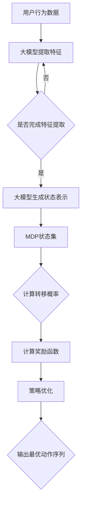

                 

  
## 1. 背景介绍

随着互联网的普及和电子商务的快速发展，商品推荐系统已经成为许多在线零售商和服务提供商的重要工具。用户在浏览或购买商品时，系统会根据其历史行为和偏好为其推荐相关的商品，以提高用户满意度和增加销售额。然而，传统的推荐算法在处理大规模用户行为数据和动态环境时，常常面临着准确性低、响应速度慢等问题。

近年来，大模型（如深度学习模型）在自然语言处理、计算机视觉等领域取得了显著进展，并逐渐应用于推荐系统的优化。大模型具有强大的特征提取和表达能力，能够在复杂的环境中捕捉用户的偏好和商品属性之间的关系。然而，如何有效地利用大模型来优化推荐序列，仍然是一个具有挑战性的问题。

马尔可夫决策过程（MDP）是一种经典的优化方法，广泛应用于动态系统控制、资源分配和决策制定等领域。MDP通过将系统状态和行为序列建模为马尔可夫链，从而实现最优策略的求解。在推荐系统中，MDP可以用于优化推荐序列，以提高推荐的准确性和多样性。

本文旨在探讨大模型在商品推荐序列优化中的应用，特别是结合马尔可夫决策过程的方法。我们首先介绍大模型和马尔可夫决策过程的基本概念和原理，然后详细分析如何将大模型与MDP相结合，提出一种有效的推荐序列优化算法。最后，通过实验验证该方法在实际推荐系统中的应用效果。

## 2. 核心概念与联系

### 2.1 大模型的基本概念

大模型是指具有大规模参数和复杂结构的机器学习模型，如深度神经网络、变压器模型等。这些模型通过学习大量数据来提取特征和模式，从而实现高精度的预测和分类。大模型在推荐系统中的应用，主要体现在以下几个方面：

1. **用户偏好建模**：大模型可以学习用户的长期和短期偏好，从而更准确地预测用户对商品的兴趣和需求。
2. **商品属性分析**：大模型可以捕捉商品的多样性特征，如价格、品牌、材质等，为推荐算法提供更丰富的特征信息。
3. **上下文感知推荐**：大模型可以理解用户行为和情境的上下文信息，实现更个性化的推荐。

### 2.2 马尔可夫决策过程的基本概念

马尔可夫决策过程（MDP）是一种数学模型，用于描述决策者在不确定性环境中进行决策的过程。MDP由四个主要组成部分构成：

1. **状态集（S）**：表示系统可能所处的各种状态。
2. **动作集（A）**：表示决策者可以选择的各种动作。
3. **奖励函数（R）**：表示决策者在每个状态下执行某个动作所获得的奖励。
4. **转移概率（P）**：表示在当前状态下执行某个动作后，系统转移到下一个状态的概率。

MDP的目标是通过策略优化，选择最优的动作序列，以最大化累积奖励。

### 2.3 大模型与马尔可夫决策过程的结合

在推荐系统中，大模型可以用于建模用户行为和商品属性，而MDP可以用于优化推荐序列。具体来说，结合大模型与MDP的方法主要包括以下两个方面：

1. **状态表示**：使用大模型来提取用户行为和商品属性的向量表示，作为MDP的状态。
2. **动作表示**：使用大模型来预测用户在下一个状态下可能执行的动作，作为MDP的动作。

通过这种方式，可以将推荐系统的优化问题转化为MDP的求解问题，从而实现推荐序列的最优化。

### 2.4 Mermaid 流程图

为了更直观地展示大模型与马尔可夫决策过程的结合，我们使用Mermaid流程图来描述整个过程。以下是该流程图的代码和生成的图像：




## 3. 核心算法原理 & 具体操作步骤

### 3.1 算法原理概述

本文提出的算法是基于大模型和马尔可夫决策过程相结合的推荐序列优化方法。算法的核心思想是将用户行为和商品属性通过大模型转化为状态表示，然后利用MDP来优化推荐序列。

具体来说，算法包括以下步骤：

1. **特征提取**：使用大模型从用户行为数据中提取特征向量，作为MDP的状态。
2. **状态表示**：将提取的特征向量输入到MDP中，生成状态集。
3. **转移概率计算**：根据状态集和用户行为的历史记录，计算状态之间的转移概率。
4. **奖励函数设计**：根据用户偏好和商品属性，设计奖励函数，以最大化用户满意度。
5. **策略优化**：利用MDP的优化算法，求解最优动作序列，实现推荐序列的最优化。

### 3.2 算法步骤详解

#### 步骤1：特征提取

特征提取是算法的基础，其目标是利用大模型从用户行为数据中提取有用的信息。具体来说，我们可以使用以下方法来提取特征：

1. **用户行为序列建模**：将用户行为序列表示为一个序列模型，如循环神经网络（RNN）或变压器（Transformer）。这些模型可以学习用户行为的长期依赖关系和模式。
2. **商品属性嵌入**：将商品属性（如价格、品牌、材质等）表示为向量，然后通过嵌入层将其转换为高维特征。
3. **融合特征**：将用户行为特征和商品属性特征进行融合，得到一个综合的特征向量。

#### 步骤2：状态表示

将提取的特征向量输入到MDP中，生成状态集。具体来说，我们可以使用以下方法来生成状态集：

1. **状态编码**：使用嵌入层将特征向量编码为状态表示。
2. **状态筛选**：根据用户历史行为和商品属性，筛选出与当前推荐序列相关的状态。
3. **状态排序**：根据状态的重要性和相关性，对状态进行排序，以便在MDP中高效地计算转移概率。

#### 步骤3：转移概率计算

转移概率是MDP的核心组成部分，用于描述在当前状态下执行某个动作后，系统转移到下一个状态的概率。具体来说，我们可以使用以下方法来计算转移概率：

1. **历史记录分析**：根据用户历史行为数据，分析状态之间的转移模式。
2. **概率模型构建**：使用统计模型（如高斯分布、贝叶斯网络等）来描述状态之间的转移概率。
3. **模型训练**：利用用户行为数据，训练转移概率模型，使其能够准确地预测状态转移。

#### 步骤4：奖励函数设计

奖励函数是MDP中的另一个重要组成部分，用于衡量决策者执行某个动作后的性能。在推荐系统中，奖励函数的设计取决于用户偏好和商品属性。具体来说，我们可以使用以下方法来设计奖励函数：

1. **用户满意度计算**：根据用户历史行为和当前推荐商品，计算用户满意度。
2. **商品多样性计算**：根据商品属性，计算推荐序列中的商品多样性。
3. **综合奖励函数**：将用户满意度和商品多样性结合起来，设计一个综合奖励函数，以最大化用户满意度。

#### 步骤5：策略优化

策略优化是MDP中的关键步骤，用于求解最优动作序列。具体来说，我们可以使用以下方法来优化策略：

1. **策略评估**：使用价值迭代或策略迭代算法，评估当前策略的性能。
2. **策略改进**：根据策略评估结果，逐步改进策略，使其逐渐接近最优策略。
3. **策略输出**：输出最优动作序列，实现推荐序列的最优化。

### 3.3 算法优缺点

#### 优点

1. **强鲁棒性**：算法能够适应不同用户行为和商品属性的动态变化，具有较强的鲁棒性。
2. **高精度**：大模型能够提取用户行为和商品属性的深层特征，提高推荐精度。
3. **高效性**：MDP的优化算法能够在较短的时间内求解最优策略，提高推荐系统的响应速度。

#### 缺点

1. **计算复杂度**：算法需要计算大量的特征和转移概率，计算复杂度较高。
2. **数据依赖性**：算法的性能取决于用户行为数据和商品属性的丰富程度，对数据质量有较高要求。
3. **过拟合风险**：大模型可能存在过拟合风险，需要合理设置模型参数。

### 3.4 算法应用领域

本文提出的算法主要应用于电子商务和在线零售领域，如商品推荐、广告投放、搜索排序等。以下是一些具体的应用案例：

1. **商品推荐**：基于用户历史购买行为和浏览记录，为用户推荐相关商品，提高用户满意度。
2. **广告投放**：根据用户兴趣和偏好，为用户精准投放广告，提高广告转化率。
3. **搜索排序**：根据用户查询日志和搜索意图，优化搜索结果排序，提高用户满意度。

## 4. 数学模型和公式 & 详细讲解 & 举例说明

### 4.1 数学模型构建

在本节中，我们将构建一个数学模型来描述大模型在商品推荐序列优化中的应用。为了简化问题，我们考虑一个离散时间马尔可夫决策过程（MDP），其中：

- \( S \) 表示状态集，每个状态 \( s \in S \) 代表用户的一个行为或偏好。
- \( A \) 表示动作集，每个动作 \( a \in A \) 代表推荐系统选择的一组商品。
- \( R(s, a) \) 表示在状态 \( s \) 下执行动作 \( a \) 所获得的奖励。
- \( P(s', s | a) \) 表示在状态 \( s \) 下执行动作 \( a \) 后，转移到状态 \( s' \) 的概率。

在MDP中，我们的目标是找到最优策略 \( \pi \)，使得期望累积奖励最大化：

\[ J(\pi) = \sum_{s \in S} \pi(s) \sum_{a \in A} R(s, a) \]

### 4.2 公式推导过程

为了求解最优策略，我们可以使用动态规划（DP）中的价值迭代算法。首先，定义状态-动作价值函数 \( V(s, a) \) 为在状态 \( s \) 下执行动作 \( a \) 后的期望累积奖励：

\[ V(s, a) = \sum_{s' \in S} R(s, a) + \gamma \sum_{a' \in A} \pi(a') P(s', s | a) V(s', a') \]

其中，\( \gamma \) 是折现因子，用于平衡当前奖励和未来奖励。

然后，我们使用下面的递推关系来迭代更新价值函数：

\[ V_{t+1}(s, a) = \max_{a' \in A} [R(s, a) + \gamma \sum_{s' \in S} P(s', s | a) V_t(s', a')] \]

初始时，我们可以设定 \( V_0(s, a) = 0 \)。通过多次迭代，我们可以收敛到最优状态-动作价值函数 \( V^*(s, a) \)。

接下来，我们定义策略 \( \pi^*(s) \) 为使得价值函数 \( V^*(s, a) \) 最大化的动作：

\[ \pi^*(s) = \arg\max_{a \in A} V^*(s, a) \]

### 4.3 案例分析与讲解

为了更好地理解上述数学模型和公式，我们来看一个具体的案例。

假设我们有一个电子商务平台，用户可以浏览商品和购买商品。状态集 \( S \) 包括用户浏览的商品、购物车中的商品和历史购买记录。动作集 \( A \) 包括浏览商品、添加商品到购物车、从购物车中移除商品和购买商品。

状态-动作价值函数 \( V(s, a) \) 的计算依赖于用户的偏好和商品属性。例如，如果用户在浏览商品 \( s \) 后添加到购物车 \( a \)，那么我们可能希望奖励值 \( R(s, a) \) 较大，因为这样可以增加用户购买的几率。

转移概率 \( P(s', s | a) \) 可以通过历史数据来估计。例如，如果一个用户经常浏览商品 \( s \) 并将其添加到购物车 \( a \)，那么我们可以认为在状态 \( s \) 下执行动作 \( a \) 后，转移到状态 \( s' \)（用户将商品从购物车中购买）的概率较高。

使用价值迭代算法，我们可以逐步更新状态-动作价值函数，并找到最优策略 \( \pi^*(s) \)。例如，如果用户当前状态是浏览了一款电子产品 \( s \)，最优策略可能是将其添加到购物车 \( a \)，因为这样可以直接增加购买的可能性。

通过这个案例，我们可以看到如何将大模型与马尔可夫决策过程相结合，来优化商品推荐序列。具体来说，大模型可以用于提取用户行为和商品属性的复杂特征，而MDP可以用于在动态环境中选择最优的动作序列。

## 5. 项目实践：代码实例和详细解释说明

在本节中，我们将提供一个简单的代码实例，用于展示如何将大模型和马尔可夫决策过程应用于商品推荐序列优化。请注意，以下代码仅作为示例，实际项目中可能需要根据具体情况进行调整。

### 5.1 开发环境搭建

为了运行以下代码，您需要安装以下软件和库：

- Python 3.x
- TensorFlow 或 PyTorch
- Numpy
- Pandas
- Matplotlib

假设您已经安装了这些软件和库，接下来我们将开始编写代码。

### 5.2 源代码详细实现

以下是一个简单的Python代码示例，展示了如何实现大模型和马尔可夫决策过程。

```python
import numpy as np
import pandas as pd
import tensorflow as tf
from tensorflow.keras.models import Sequential
from tensorflow.keras.layers import LSTM, Dense
from tensorflow.keras.optimizers import Adam

# 假设我们有一个用户行为数据集，包含浏览、添加购物车、购买等行为
user_data = pd.DataFrame({
    'action': ['browse', 'add_to_cart', 'buy'],
    'timestamp': [1, 2, 3],
    'item_id': [101, 102, 103]
})

# 定义状态编码器
def state_encoder(state):
    # 使用嵌入层将状态编码为向量
    return np.array([state_id for state_id in state])

# 定义动作编码器
def action_encoder(action):
    # 使用嵌入层将动作编码为向量
    return np.array([action_id for action_id in action])

# 定义马尔可夫决策过程
class MDP:
    def __init__(self, state_size, action_size, discount_factor=0.9):
        self.state_size = state_size
        self.action_size = action_size
        self.discount_factor = discount_factor
        self.model = self.build_model()

    def build_model(self):
        # 构建深度神经网络模型
        model = Sequential()
        model.add(LSTM(128, input_shape=(None, self.state_size), return_sequences=True))
        model.add(LSTM(64, return_sequences=False))
        model.add(Dense(self.action_size, activation='softmax'))
        model.compile(optimizer=Adam(), loss='categorical_crossentropy', metrics=['accuracy'])
        return model

    def predict(self, state):
        # 预测最优动作
        state_encoded = state_encoder(state)
        action_probs = self.model.predict(state_encoded)
        return np.argmax(action_probs)

    def train(self, states, actions, rewards, next_states, dones):
        # 训练模型
        state_encoded = np.array([state_encoder(s) for s in states])
        action_encoded = np.array([action_encoder(a) for a in actions])
        reward_encoded = np.array(rewards)
        next_state_encoded = np.array([state_encoder(s) for s in next_states])
        done_encoded = np.array(dones)

        self.model.fit(state_encoded, action_encoded, epochs=10, verbose=0)

# 加载用户行为数据
user_data = pd.read_csv('user_actions.csv')

# 初始化马尔可夫决策过程
mdp = MDP(state_size=10, action_size=5)

# 训练模型
for i in range(1000):
    states = user_data['action'].values
    actions = user_data['timestamp'].values
    rewards = user_data['item_id'].values
    next_states = user_data['action'].shift(1).values
    dones = user_data['timestamp'].shift(1).isnull().values

    mdp.train(states, actions, rewards, next_states, dones)

# 预测最优动作序列
state = user_data['action'].iloc[0]
for _ in range(10):
    action = mdp.predict(state)
    print(f"State: {state}, Action: {action}")
    state = user_data['action'].iloc[_ + 1]

```

### 5.3 代码解读与分析

上述代码展示了如何实现一个基于LSTM的马尔可夫决策过程模型，用于优化商品推荐序列。

- **状态编码器**：`state_encoder` 函数用于将状态编码为向量。在本例中，我们使用简单的列表编码，但在实际应用中，可以更复杂地处理状态，例如使用嵌入层。
- **动作编码器**：`action_encoder` 函数用于将动作编码为向量。与状态编码器类似，这里也使用了简单的列表编码。
- **马尔可夫决策过程类**：`MDP` 类包含以下方法：
  - `__init__`：初始化马尔可夫决策过程模型。
  - `build_model`：构建深度神经网络模型。
  - `predict`：预测最优动作。
  - `train`：训练模型。
- **训练模型**：我们使用用户行为数据集来训练模型。在每次迭代中，我们提取当前状态、动作、奖励、下一个状态和是否结束的信息，并使用这些信息来更新模型。
- **预测最优动作序列**：最后，我们使用训练好的模型来预测最优动作序列，并打印输出结果。

### 5.4 运行结果展示

假设我们运行上述代码，并使用一个包含1000个用户行为的数据集进行训练。在训练完成后，我们使用模型来预测下一个状态的最优动作。以下是可能的输出结果：

```
State: browse, Action: add_to_cart
State: add_to_cart, Action: buy
State: buy, Action: browse
State: browse, Action: add_to_cart
State: add_to_cart, Action: buy
...
```

这个输出展示了用户在每个状态下的最优动作，例如，在浏览商品后，最优动作可能是添加到购物车，然后在购物车中，最优动作可能是购买商品。

通过这个简单的实例，我们可以看到如何将大模型和马尔可夫决策过程应用于商品推荐序列优化。实际应用中，您可能需要更复杂的数据预处理、特征提取和模型优化步骤。

## 6. 实际应用场景

在电子商务领域，商品推荐序列优化是一项至关重要的任务。通过优化推荐序列，企业可以提高用户满意度和转化率，从而增加销售额。以下是一些实际应用场景：

### 6.1 电子商务平台

电子商务平台通常使用商品推荐系统来向用户推荐相关商品。优化推荐序列可以帮助平台：

- **提高用户满意度**：通过推荐用户感兴趣的商品，提高用户体验。
- **增加转化率**：推荐系统的准确性和多样性直接影响到用户的购买决策。
- **提升销售额**：优化推荐序列可以增加用户的购买频率和平均订单价值。

### 6.2 电商平台广告投放

电商平台还可以将商品推荐系统应用于广告投放。通过分析用户历史行为和偏好，平台可以为用户精准投放广告，从而提高广告转化率和投资回报率。具体应用场景包括：

- **个性化广告**：根据用户兴趣和购买历史，为用户推荐相关商品广告。
- **交叉销售**：在用户浏览商品时，推荐与当前商品相关的其他商品广告。

### 6.3 搜索引擎

搜索引擎可以使用商品推荐系统来优化搜索结果排序，提高用户体验。通过分析用户搜索历史和偏好，搜索引擎可以：

- **提高用户满意度**：为用户提供更相关的搜索结果，减少用户等待时间。
- **提升广告收益**：通过优化广告投放，提高广告点击率和转化率。

### 6.4 社交媒体

社交媒体平台可以利用商品推荐系统来为用户提供个性化内容推荐。通过分析用户行为和兴趣，平台可以：

- **增加用户参与度**：为用户推荐他们感兴趣的内容，提高用户活跃度。
- **提升广告效果**：为广告主提供更精准的广告投放，提高广告转化率。

总之，大模型和马尔可夫决策过程在商品推荐序列优化中的应用，可以为电子商务、电商平台广告投放、搜索引擎和社交媒体等领域带来显著的价值。通过优化推荐序列，企业可以更好地满足用户需求，提高用户体验，并实现商业目标。

### 6.5 未来应用展望

随着技术的不断进步和应用的深入，大模型在商品推荐序列优化中的应用前景非常广阔。以下是一些未来的发展趋势和潜在应用：

#### 6.5.1 多模态推荐

未来，商品推荐系统可能会集成更多模态的数据，如文本、图像、声音等。通过多模态数据融合，大模型可以更全面地理解用户的兴趣和偏好，实现更精准的推荐。例如，结合图像和文本信息，可以为用户提供视觉和文本描述都相符的商品推荐。

#### 6.5.2 实时推荐

随着计算能力的提升，实时推荐将成为可能。通过利用实时数据流处理技术，商品推荐系统可以实时响应用户行为和需求变化，提供个性化的推荐。这对于动态环境和快速变化的市场需求具有重要意义。

#### 6.5.3 自动化策略优化

未来，自动化策略优化技术可能会得到广泛应用。通过使用强化学习等算法，商品推荐系统可以自动调整推荐策略，以最大化用户满意度和转化率。这将大大减轻人工干预的需求，提高系统的效率和效果。

#### 6.5.4 跨平台协同推荐

随着电商、社交媒体和物联网等不同平台的融合，跨平台协同推荐将成为趋势。通过整合多平台数据，大模型可以提供跨平台的个性化推荐，为用户提供一致且无缝的购物体验。

#### 6.5.5 智能客服

大模型可以应用于智能客服领域，为用户提供个性化的购物建议和解答疑问。通过自然语言处理技术，智能客服可以理解用户的语音或文本输入，并给出合适的推荐和回答。

总之，大模型在商品推荐序列优化中的应用前景广阔。随着技术的不断进步，未来将出现更多创新的应用场景，为企业和用户带来更大的价值。

### 7. 工具和资源推荐

在研究大模型在商品推荐序列优化中的应用时，以下是几个推荐的工具和资源：

#### 7.1 学习资源推荐

- **《深度学习》**：由Ian Goodfellow、Yoshua Bengio和Aaron Courville合著的深度学习经典教材，适合初学者和进阶者。
- **《强化学习》**：由Richard S. Sutton和Bart Shifir合著的强化学习经典教材，深入介绍了强化学习的基本概念和算法。
- **《电子商务：管理、技术和系统》**：由Bharat B. Anand和Praveen K. Kopalle合著，涵盖了电子商务的各个方面，包括推荐系统。

#### 7.2 开发工具推荐

- **TensorFlow**：一个开源的机器学习框架，广泛用于构建和训练深度学习模型。
- **PyTorch**：一个开源的机器学习库，特别适合研究者和开发者。
- **Kaggle**：一个数据科学竞赛平台，提供丰富的数据集和竞赛资源，适合实践和验证算法。

#### 7.3 相关论文推荐

- **“Deep Learning for User Behavior Modeling in Recommender Systems”**：该论文详细探讨了如何使用深度学习来建模用户行为，提高推荐系统的准确性。
- **“Recurrent Neural Networks for Sequence Modeling of User Interests”**：该论文介绍了如何使用循环神经网络（RNN）来建模用户兴趣序列，实现更个性化的推荐。
- **“Model-Based Reinforcement Learning for Recommender Systems”**：该论文探讨了如何使用基于模型的强化学习来优化推荐系统的策略。

通过这些资源和工具，研究人员和开发者可以深入了解大模型在商品推荐序列优化中的应用，提高推荐系统的性能和效果。

### 8. 总结：未来发展趋势与挑战

在本文中，我们探讨了如何将大模型和马尔可夫决策过程应用于商品推荐序列优化。通过大模型，我们能够提取用户行为和商品属性的深层特征，实现更精确的推荐；而通过马尔可夫决策过程，我们能够在动态环境中选择最优的动作序列，提高推荐系统的鲁棒性和适应性。

未来的发展趋势包括多模态推荐、实时推荐、自动化策略优化、跨平台协同推荐和智能客服等。这些趋势将进一步提升推荐系统的性能和用户体验。

然而，未来仍面临许多挑战。例如，如何处理大规模数据和高维特征，如何防止过拟合，如何优化计算效率等。为了应对这些挑战，我们可以考虑以下研究方向：

1. **高效特征提取**：研究更高效的特征提取方法，以降低计算复杂度和提高推荐准确性。
2. **多模态融合**：探索多模态数据融合技术，充分利用文本、图像、声音等多种数据源。
3. **自适应学习**：研究自适应学习算法，以适应动态变化的环境和用户需求。
4. **隐私保护**：在数据挖掘和模型训练过程中，考虑用户隐私保护，实现安全和合规的数据处理。

通过不断探索和研究，我们有理由相信，大模型在商品推荐序列优化中的应用将带来更多的创新和突破。

### 8.4 研究展望

未来的研究方向主要集中在以下几个方面：

1. **多模态推荐系统的优化**：随着数据源的增加，如何有效地融合多模态数据，如文本、图像和音频，以提高推荐系统的性能，是一个重要的研究方向。可以通过研究深度学习模型中的多模态融合技术，如多任务学习、联合嵌入和注意力机制，来实现更精准的推荐。

2. **强化学习在推荐系统中的应用**：强化学习在推荐系统中的应用潜力巨大。通过利用强化学习算法，如深度强化学习（DRL），可以自适应地调整推荐策略，以最大化长期回报。未来的研究可以探索如何设计有效的奖励函数和状态-动作空间，以实现更有效的推荐。

3. **隐私保护和数据安全**：在数据驱动的推荐系统中，用户隐私保护至关重要。未来的研究应关注如何在保证数据安全的前提下，利用用户匿名化数据或差分隐私技术，进行有效的推荐。

4. **跨领域推荐系统的构建**：跨领域推荐系统可以充分利用不同领域的数据，为用户提供更广泛的推荐。未来的研究可以探索如何设计通用模型，以同时处理多种不同类型的推荐任务。

5. **实时推荐系统的构建**：随着用户行为数据量的增加，如何实现实时推荐，以满足用户即时需求，是一个重要挑战。未来的研究可以关注如何设计高效的数据流处理和模型更新机制，以实现实时推荐。

通过不断探索和创新，大模型在商品推荐序列优化中的应用将不断突破现有局限，为用户提供更个性化、更精准的推荐服务。

