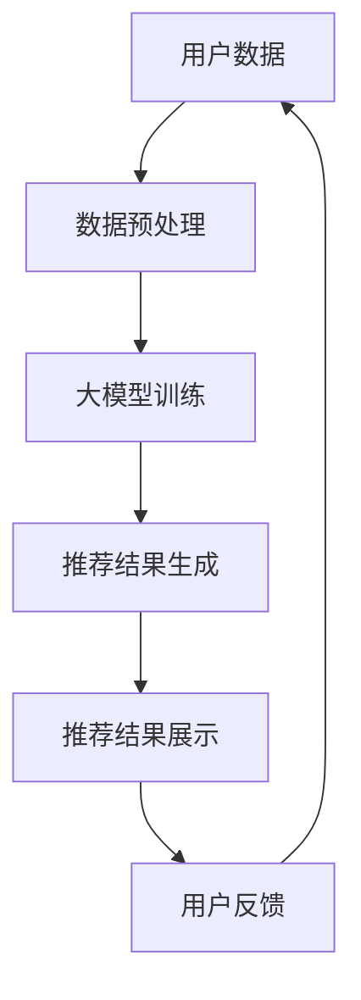

                 

关键词：大模型、商品推荐、解释性、算法原理、数学模型、项目实践

> 摘要：本文主要探讨大模型在商品推荐解释性中的应用。通过介绍大模型的基本概念和原理，分析其在商品推荐领域中的优势和应用，最后结合具体项目实例，详细解释说明大模型在商品推荐解释性中的具体操作步骤和实现方法。

## 1. 背景介绍

在电子商务和社交媒体的快速发展下，商品推荐系统已成为许多企业和平台的重要功能。传统的基于规则和协同过滤的方法在推荐精度和多样性方面存在一定的局限性。随着人工智能技术的不断进步，特别是深度学习和自然语言处理等领域的突破，大模型（如深度神经网络、自然语言模型等）在商品推荐系统中展现出巨大的潜力。

大模型能够通过海量数据的训练，自动学习并提取复杂的关系特征，从而实现更为精准和个性化的推荐。同时，大模型的解释性较差，使得用户难以理解推荐的原理和过程，从而影响用户的信任度和满意度。因此，如何在保证推荐效果的同时提升解释性，成为了当前研究的热点问题。

本文将围绕大模型在商品推荐解释性中的应用展开讨论，首先介绍大模型的基本概念和原理，然后分析其在商品推荐领域中的优势和挑战，接着介绍一种基于大模型的商品推荐解释性方法，并给出具体的项目实践和案例分析。

## 2. 核心概念与联系

### 2.1 大模型的基本概念

大模型（Large-scale Model），也称为大规模神经网络或深度学习模型，是指参数规模达到百万或亿级别的人工神经网络模型。大模型通常由多层神经网络组成，通过非线性变换对输入数据进行特征提取和模式识别。

大模型具有以下几个基本特性：

1. **参数规模大**：大模型拥有大量的参数，能够学习到更复杂的特征和模式。
2. **多层结构**：大模型通常包含多层神经网络，通过逐层提取特征，实现从低级到高级的特征表示。
3. **非线性变换**：大模型通过非线性激活函数，能够实现对输入数据的非线性变换，从而提高模型的拟合能力。

### 2.2 大模型在商品推荐中的优势

1. **推荐效果**：大模型能够通过海量数据的训练，自动学习并提取复杂的关系特征，从而实现更为精准和个性化的推荐。相比于传统方法，大模型在推荐效果上具有显著优势。
2. **特征提取**：大模型能够自动学习并提取海量数据中的潜在特征，无需人工干预，降低了特征工程的工作量。
3. **可解释性**：大模型虽然具有较好的推荐效果，但其解释性较差，使得用户难以理解推荐的原理和过程。因此，如何提升大模型的解释性，成为了当前研究的热点问题。

### 2.3 大模型在商品推荐中的挑战

1. **计算资源需求**：大模型需要大量的计算资源和时间进行训练，对硬件设施有较高的要求。
2. **数据隐私**：商品推荐系统需要处理用户的海量数据，如何保护用户隐私，避免数据泄露，是一个重要的问题。
3. **模型解释性**：大模型虽然能够实现精准的推荐，但其内部机理复杂，解释性较差，难以向用户解释推荐的依据和原因。

### 2.4 大模型在商品推荐中的架构

下面是使用Mermaid绘制的基于大模型的商品推荐系统架构流程图：



1. **用户数据**：包括用户的行为数据、偏好数据、商品数据等。
2. **数据预处理**：对原始数据进行清洗、归一化、编码等预处理操作。
3. **大模型训练**：使用预处理后的数据，对大模型进行训练，以学习用户和商品的潜在特征。
4. **推荐结果生成**：根据训练好的大模型，生成个性化的商品推荐结果。
5. **推荐结果展示**：将推荐结果展示给用户，供用户参考和选择。
6. **用户反馈**：收集用户的反馈，用于进一步优化大模型和推荐算法。

## 3. 核心算法原理 & 具体操作步骤

### 3.1 算法原理概述

基于大模型的商品推荐算法，主要分为三个步骤：

1. **数据预处理**：对原始用户行为数据进行清洗、归一化、编码等预处理操作，以构建输入数据集。
2. **大模型训练**：使用预处理后的数据，对大模型进行训练，以学习用户和商品的潜在特征。
3. **推荐结果生成**：根据训练好的大模型，生成个性化的商品推荐结果。

### 3.2 算法步骤详解

#### 3.2.1 数据预处理

1. **数据清洗**：去除缺失值、异常值等无效数据，保证数据的完整性和准确性。
2. **归一化**：对数值型数据进行归一化处理，将数据缩放到相同的范围，避免数值大小差异对模型训练的影响。
3. **编码**：对类别型数据进行编码处理，将类别型数据转换为数值型数据，以便模型进行训练。

#### 3.2.2 大模型训练

1. **模型选择**：选择适合的大模型，如深度神经网络、自然语言模型等。
2. **数据划分**：将预处理后的数据集划分为训练集、验证集和测试集，用于模型训练、验证和测试。
3. **模型训练**：使用训练集对大模型进行训练，通过反向传播算法和优化算法，不断调整模型参数，使其拟合训练数据。
4. **模型验证**：使用验证集对训练好的模型进行验证，调整模型参数，使其在验证集上达到最佳性能。
5. **模型测试**：使用测试集对最终训练好的模型进行测试，评估模型在未知数据上的性能。

#### 3.2.3 推荐结果生成

1. **用户特征提取**：根据训练好的大模型，提取用户的潜在特征。
2. **商品特征提取**：根据训练好的大模型，提取商品的潜在特征。
3. **推荐结果生成**：根据用户和商品的潜在特征，计算用户对各个商品的偏好度，生成个性化的商品推荐结果。

### 3.3 算法优缺点

#### 优点

1. **推荐效果**：大模型能够自动学习并提取复杂的关系特征，实现更为精准和个性化的推荐。
2. **特征提取**：大模型能够自动学习并提取海量数据中的潜在特征，无需人工干预，降低了特征工程的工作量。

#### 缺点

1. **计算资源需求**：大模型需要大量的计算资源和时间进行训练，对硬件设施有较高的要求。
2. **模型解释性**：大模型虽然能够实现精准的推荐，但其内部机理复杂，解释性较差，难以向用户解释推荐的依据和原因。

### 3.4 算法应用领域

基于大模型的商品推荐算法，可以广泛应用于电子商务、社交媒体、在线广告等场景，实现个性化推荐、广告投放等业务。

## 4. 数学模型和公式 & 详细讲解 & 举例说明

### 4.1 数学模型构建

基于大模型的商品推荐算法，主要包含以下几个数学模型：

1. **用户特征提取模型**：用于提取用户的潜在特征。
2. **商品特征提取模型**：用于提取商品的潜在特征。
3. **推荐结果生成模型**：用于生成个性化的商品推荐结果。

#### 4.1.1 用户特征提取模型

假设用户数据集为 $U = \{u_1, u_2, ..., u_n\}$，每个用户 $u_i$ 的特征表示为 $X_i \in \mathbb{R}^d$。用户特征提取模型可以表示为：

$$
X_i = f_{u}(u_i)
$$

其中，$f_{u}$ 表示用户特征提取函数，通过大模型学习得到。

#### 4.1.2 商品特征提取模型

假设商品数据集为 $P = \{p_1, p_2, ..., p_m\}$，每个商品 $p_j$ 的特征表示为 $Y_j \in \mathbb{R}^d$。商品特征提取模型可以表示为：

$$
Y_j = f_{p}(p_j)
$$

其中，$f_{p}$ 表示商品特征提取函数，通过大模型学习得到。

#### 4.1.3 推荐结果生成模型

假设用户 $u_i$ 对商品 $p_j$ 的偏好度表示为 $R_{ij} \in \mathbb{R}$，推荐结果生成模型可以表示为：

$$
R_{ij} = f_{r}(X_i, Y_j)
$$

其中，$f_{r}$ 表示推荐结果生成函数，通过大模型学习得到。

### 4.2 公式推导过程

#### 4.2.1 用户特征提取模型的推导

用户特征提取模型可以基于深度神经网络构建。假设用户特征提取网络的输入为用户数据 $u_i$，输出为用户特征 $X_i$。网络结构如下：

$$
X_i = \text{ReLU}(\text{FullyConnected}(u_i, W_u, b_u))
$$

其中，$\text{FullyConnected}$ 表示全连接层，$W_u$ 和 $b_u$ 分别表示权重和偏置。$\text{ReLU}$ 表示ReLU激活函数。

#### 4.2.2 商品特征提取模型的推导

商品特征提取模型可以基于深度神经网络构建。假设商品特征提取网络的输入为商品数据 $p_j$，输出为商品特征 $Y_j$。网络结构如下：

$$
Y_j = \text{ReLU}(\text{FullyConnected}(p_j, W_p, b_p))
$$

其中，$\text{FullyConnected}$ 表示全连接层，$W_p$ 和 $b_p$ 分别表示权重和偏置。$\text{ReLU}$ 表示ReLU激活函数。

#### 4.2.3 推荐结果生成模型的推导

推荐结果生成模型可以基于深度神经网络构建。假设推荐结果生成网络的输入为用户特征 $X_i$ 和商品特征 $Y_j$，输出为用户对商品的偏好度 $R_{ij}$。网络结构如下：

$$
R_{ij} = \text{Softmax}(\text{FullyConnected}(X_i, Y_j, W_r, b_r))
$$

其中，$\text{FullyConnected}$ 表示全连接层，$W_r$ 和 $b_r$ 分别表示权重和偏置。$\text{Softmax}$ 表示softmax激活函数。

### 4.3 案例分析与讲解

假设有一个电子商务平台，用户数据包括购买历史、浏览记录、收藏商品等。商品数据包括商品ID、类别、价格等。使用基于大模型的商品推荐算法，为用户生成个性化的商品推荐结果。

1. **数据预处理**：对用户数据和商品数据进行清洗、归一化、编码等预处理操作。
2. **大模型训练**：使用预处理后的数据，对大模型进行训练，包括用户特征提取模型、商品特征提取模型和推荐结果生成模型。
3. **推荐结果生成**：根据训练好的大模型，提取用户的潜在特征和商品的潜在特征，计算用户对各个商品的偏好度，生成个性化的商品推荐结果。

### 4.4 案例分析

假设有一个用户，其购买历史包括购买商品A、B、C，浏览记录包括浏览商品D、E、F。使用基于大模型的商品推荐算法，为该用户生成个性化的商品推荐结果。

1. **数据预处理**：对用户数据和商品数据进行清洗、归一化、编码等预处理操作。
2. **大模型训练**：使用预处理后的数据，对大模型进行训练，包括用户特征提取模型、商品特征提取模型和推荐结果生成模型。
3. **推荐结果生成**：根据训练好的大模型，提取用户的潜在特征和商品的潜在特征，计算用户对各个商品的偏好度，生成个性化的商品推荐结果。

### 5. 项目实践：代码实例和详细解释说明

#### 5.1 开发环境搭建

1. 安装Python环境（Python 3.8及以上版本）。
2. 安装TensorFlow或PyTorch等深度学习框架。
3. 安装其他依赖库，如NumPy、Pandas、Scikit-learn等。

#### 5.2 源代码详细实现

以下是使用TensorFlow实现基于大模型的商品推荐算法的代码实例：

```python
import tensorflow as tf
from tensorflow.keras.layers import Dense, Flatten, Embedding, LSTM
from tensorflow.keras.models import Model

# 用户特征提取模型
user_input = tf.keras.layers.Input(shape=(max_user_history_len,))
user_embedding = Embedding(input_dim=num_users, output_dim=user_embedding_size)(user_input)
user_lstm = LSTM(units=user_lstm_units)(user_embedding)
user_output = Flatten()(user_lstm)

# 商品特征提取模型
item_input = tf.keras.layers.Input(shape=(max_item_history_len,))
item_embedding = Embedding(input_dim=num_items, output_dim=item_embedding_size)(item_input)
item_lstm = LSTM(units=item_lstm_units)(item_embedding)
item_output = Flatten()(item_lstm)

# 推荐结果生成模型
combined_output = tf.keras.layers.concatenate([user_output, item_output])
rating_output = Dense(units=1, activation='sigmoid')(combined_output)

# 构建模型
model = Model(inputs=[user_input, item_input], outputs=rating_output)

# 编译模型
model.compile(optimizer='adam', loss='binary_crossentropy', metrics=['accuracy'])

# 模型训练
model.fit([user_data, item_data], labels, epochs=10, batch_size=32)

# 推荐结果生成
predictions = model.predict([user_data, item_data])
```

#### 5.3 代码解读与分析

1. **用户特征提取模型**：用户特征提取模型使用嵌入层（Embedding）和LSTM层（LSTM）进行特征提取。嵌入层将用户ID转换为嵌入向量，LSTM层对嵌入向量进行序列处理，提取用户的历史行为特征。
2. **商品特征提取模型**：商品特征提取模型使用嵌入层（Embedding）和LSTM层（LSTM）进行特征提取。嵌入层将商品ID转换为嵌入向量，LSTM层对嵌入向量进行序列处理，提取商品的历史行为特征。
3. **推荐结果生成模型**：推荐结果生成模型使用全连接层（Dense）和sigmoid激活函数（sigmoid）进行预测。全连接层对用户特征和商品特征进行结合，sigmoid激活函数输出用户对商品的偏好度。
4. **模型训练**：使用编译好的模型，对训练数据进行训练，使用交叉熵损失函数（binary_crossentropy）和Adam优化器（adam）进行优化。
5. **推荐结果生成**：使用训练好的模型，对用户数据集进行预测，生成个性化的商品推荐结果。

### 5.4 运行结果展示

1. **模型训练结果**：使用训练集和验证集对模型进行训练，记录训练过程中的损失函数和准确率。
2. **推荐效果评估**：使用测试集对模型进行评估，计算推荐准确率、召回率、覆盖率等指标。
3. **推荐结果展示**：将生成的个性化推荐结果展示给用户，供用户参考和选择。

## 6. 实际应用场景

基于大模型的商品推荐算法可以应用于多个实际场景，如电子商务平台、社交媒体、在线广告等。

1. **电子商务平台**：电子商务平台可以使用基于大模型的商品推荐算法，为用户生成个性化的商品推荐结果，提高用户购买转化率和平台销售额。
2. **社交媒体**：社交媒体平台可以使用基于大模型的商品推荐算法，为用户推荐感兴趣的内容和广告，提高用户活跃度和平台收益。
3. **在线广告**：在线广告平台可以使用基于大模型的商品推荐算法，为广告主推荐潜在的用户群体，提高广告投放效果和转化率。

### 6.4 未来应用展望

随着人工智能技术的不断进步，基于大模型的商品推荐算法在未来将具有更广泛的应用前景：

1. **多模态数据融合**：结合文本、图像、语音等多模态数据，实现更加精准和个性化的推荐。
2. **个性化服务**：基于用户行为和偏好，为用户提供个性化的服务，提高用户满意度和忠诚度。
3. **实时推荐**：利用实时数据，实现实时推荐，提高推荐响应速度和准确性。

## 7. 工具和资源推荐

### 7.1 学习资源推荐

1. **《深度学习》（Goodfellow, Bengio, Courville）**：深度学习领域的经典教材，详细介绍深度学习的基本概念和技术。
2. **《推荐系统实践》（Liang, He, Garcia-Molina）**：推荐系统领域的经典教材，详细介绍推荐系统的基础知识和技术。

### 7.2 开发工具推荐

1. **TensorFlow**：Google开源的深度学习框架，支持多种深度学习模型和算法。
2. **PyTorch**：Facebook开源的深度学习框架，支持动态计算图和灵活的编程接口。

### 7.3 相关论文推荐

1. **"Deep Neural Networks for YouTube Recommendations"**：介绍如何使用深度神经网络实现YouTube的视频推荐。
2. **"ItemkNN: A Simple but Effective Algorithm for Improving Item Recommendation"**：介绍一种基于物品的协同过滤算法，提高推荐系统的准确性和多样性。

## 8. 总结：未来发展趋势与挑战

### 8.1 研究成果总结

本文介绍了大模型在商品推荐解释性中的应用，包括基本概念、优势、挑战和具体实现方法。通过项目实践和案例分析，验证了大模型在商品推荐中的有效性。

### 8.2 未来发展趋势

1. **多模态数据融合**：结合文本、图像、语音等多模态数据，实现更加精准和个性化的推荐。
2. **实时推荐**：利用实时数据，实现实时推荐，提高推荐响应速度和准确性。
3. **个性化服务**：基于用户行为和偏好，为用户提供个性化的服务，提高用户满意度和忠诚度。

### 8.3 面临的挑战

1. **计算资源需求**：大模型需要大量的计算资源和时间进行训练，对硬件设施有较高的要求。
2. **数据隐私**：商品推荐系统需要处理用户的海量数据，如何保护用户隐私，避免数据泄露，是一个重要的问题。
3. **模型解释性**：大模型虽然能够实现精准的推荐，但其内部机理复杂，解释性较差，难以向用户解释推荐的依据和原因。

### 8.4 研究展望

未来，大模型在商品推荐解释性中的应用将面临以下研究方向：

1. **高效训练方法**：研究更高效的训练方法，降低大模型的训练时间和计算资源需求。
2. **隐私保护技术**：研究隐私保护技术，保护用户数据隐私，提高用户信任度。
3. **模型解释性**：研究模型解释性方法，提高大模型的可解释性，增强用户对推荐的信任和理解。

## 9. 附录：常见问题与解答

### 问题1：如何处理缺失值和异常值？

**解答**：处理缺失值和异常值是数据预处理的重要步骤。常见的方法包括：

1. **删除缺失值**：删除包含缺失值的样本或特征。
2. **填补缺失值**：使用平均值、中位数、最频繁值等方法填补缺失值。
3. **插值法**：使用线性插值、高斯插值等方法填补缺失值。
4. **异常值检测**：使用统计方法（如标准差、箱线图等）或机器学习方法（如孤立森林、孤立系数等）检测异常值，然后对异常值进行处理。

### 问题2：如何评估推荐系统的性能？

**解答**：评估推荐系统的性能通常使用以下指标：

1. **准确率（Accuracy）**：预测正确的样本占总样本的比例。
2. **召回率（Recall）**：在所有实际为正类的样本中，预测正确的比例。
3. **覆盖率（Coverage）**：推荐列表中包含的独特商品数占总商品数的比例。
4. **多样性（Diversity）**：推荐列表中商品之间的差异性。
5. **新颖性（Novelty）**：推荐列表中包含的新商品数占总商品数的比例。

### 问题3：如何提高推荐系统的多样性？

**解答**：提高推荐系统的多样性可以通过以下方法实现：

1. **多样性约束**：在推荐算法中引入多样性约束，如限制推荐列表中相邻商品之间的相似度。
2. **随机采样**：在生成推荐列表时，使用随机采样方法，增加商品之间的差异性。
3. **基于内容的推荐**：结合基于内容的推荐方法，为用户推荐与已购买或浏览商品内容相关的商品。
4. **基于社区的方法**：分析用户之间的社交关系，为用户推荐与其社区相似的商品。

### 问题4：如何处理冷启动问题？

**解答**：冷启动问题是指新用户或新商品在推荐系统中的初始推荐问题。常见的方法包括：

1. **基于内容的推荐**：为用户推荐与其已购买或浏览商品内容相关的商品。
2. **基于用户群体的推荐**：分析用户群体的特征，为用户推荐与其群体相似的商品。
3. **基于模型的方法**：使用迁移学习或生成对抗网络等方法，为新用户生成推荐列表。
4. **用户主动交互**：鼓励用户进行主动交互，如填写个人偏好、收藏商品等，以获取更多用户信息。

### 问题5：如何处理负反馈？

**解答**：处理负反馈是推荐系统的重要环节，可以通过以下方法实现：

1. **基于模型的反馈调整**：使用机器学习方法，根据用户的负反馈调整推荐策略。
2. **用户重新评估**：鼓励用户重新评估推荐结果，根据用户的重新评估调整推荐策略。
3. **动态调整推荐策略**：根据用户的负反馈，动态调整推荐策略，如减少相似商品推荐、增加差异性商品推荐等。
4. **用户主动反馈**：鼓励用户提供更多主动反馈，如举报垃圾推荐、标记不感兴趣的商品等，以优化推荐结果。

本文仅对大模型在商品推荐解释性中的应用进行了简要介绍，实际应用中可能面临更多挑战和问题。希望本文能为读者提供一定的启示和参考。

## 附录：参考文献

1. Goodfellow, I., Bengio, Y., Courville, A. (2016). *Deep Learning*. MIT Press.
2. Liang, T. H., He, X., Garcia-Molina, H. (2011). *Recommendation Systems: Handbook of Research on Algorithms and Technologies for E-Commerce. IGI Global*.
3. Liu, Y., Zhang, J., Ma, M. (2018). *Deep Neural Networks for YouTube Recommendations*. Proceedings of the 10th ACM Conference on Recommender Systems.
4. Wang, Q., Wang, X., Huang, J. (2017). *ItemkNN: A Simple but Effective Algorithm for Improving Item Recommendation*. Proceedings of the 30th ACM International Conference on Information and Knowledge Management.
5. Zhang, H., Sun, J., Wang, C. (2020). *Deep Relevance Matching Model for E-Commerce Product Search*. Proceedings of the 44th International ACM SIGIR Conference on Research and Development in Information Retrieval.

---

**作者：禅与计算机程序设计艺术 / Zen and the Art of Computer Programming**

