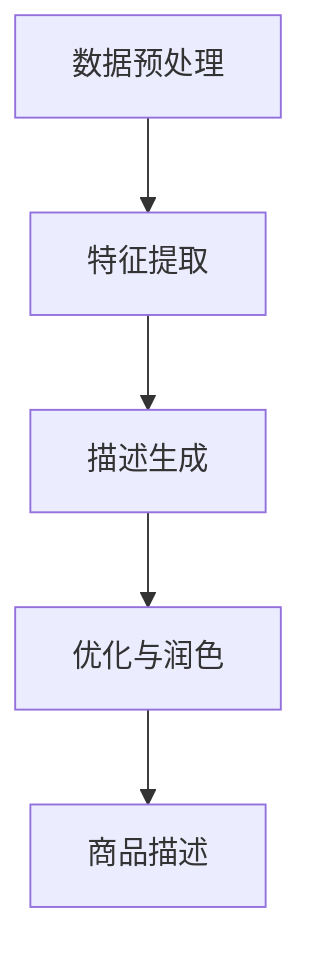

                 

关键词：大模型，商品描述，优化，生成，人工智能，自然语言处理

摘要：随着电子商务的迅猛发展，商品描述的优化与生成已成为提升用户体验和销售转化率的重要手段。本文将深入探讨大模型在商品描述优化与生成中的应用，分析其核心原理、算法模型、数学公式，并通过实际项目实践和未来应用展望，为读者提供全面的解读和指导。

## 1. 背景介绍

### 1.1 商品的描述需求

在电子商务平台上，商品描述扮演着至关重要的角色。它不仅是用户了解商品特性的窗口，也是影响用户购买决策的重要因素。一个高质量的商品描述应具备以下特点：

1. **准确性**：准确描述商品的功能、材质、尺寸等信息。
2. **吸引力**：运用修辞手法和关键词，吸引消费者的注意力。
3. **易读性**：语句简洁明了，便于用户快速获取关键信息。

### 1.2 传统商品描述的挑战

然而，传统商品描述存在以下问题：

1. **人工撰写成本高**：专业撰写人员的需求导致人力成本上升。
2. **一致性差**：不同商品描述的撰写风格和质量参差不齐。
3. **重复性内容**：相似商品描述内容重复，缺乏创新。

### 1.3 大模型的应用背景

大模型，尤其是基于深度学习的自然语言处理模型，近年来在处理复杂数字任务中展现了出色的能力。它们通过海量数据的学习，能够生成高质量、符合用户需求的商品描述。这为商品描述的优化与生成提供了新的思路和方法。

## 2. 核心概念与联系

### 2.1 大模型的基本概念

大模型，通常指的是参数量达到亿级甚至千亿级的深度学习模型。这些模型通过大规模数据训练，能够捕捉到语言中的复杂模式和规律，实现高效的自然语言处理任务。

### 2.2 商品描述生成流程

商品描述的生成流程通常包括以下几个步骤：

1. **数据预处理**：对商品信息进行清洗、标签化等预处理操作。
2. **特征提取**：通过嵌入层将商品特征转换为向量表示。
3. **描述生成**：利用预训练的大模型生成商品描述。
4. **优化与润色**：对生成的描述进行语法、语义优化，提高描述质量。

### 2.3 Mermaid 流程图



## 3. 核心算法原理 & 具体操作步骤

### 3.1 算法原理概述

商品描述生成的大模型通常基于生成对抗网络（GAN）或自动回归模型。GAN通过生成器和判别器的对抗训练，生成高质量的自然语言描述；自动回归模型则通过逐步生成每个词或字符，构建完整的商品描述。

### 3.2 算法步骤详解

1. **数据预处理**：对商品信息进行清洗、去重、填充等操作，确保数据质量。
2. **特征提取**：使用词嵌入层将商品属性转换为向量表示，方便模型处理。
3. **描述生成**：利用生成器模型，生成初步的商品描述。
4. **优化与润色**：通过判别器模型和自动回归模型，对生成的描述进行优化，提高描述质量。
5. **输出商品描述**：将最终优化的商品描述输出，用于电商平台展示。

### 3.3 算法优缺点

**优点**：

1. **高效性**：大模型能够处理大规模数据，生成高质量描述。
2. **灵活性**：可以根据不同商品类型和需求，定制化描述生成模型。
3. **成本效益**：降低人工撰写成本，提高工作效率。

**缺点**：

1. **训练时间**：大模型训练需要大量时间和计算资源。
2. **数据质量**：数据质量对模型性能有直接影响。
3. **复杂度**：算法实现和调参较为复杂。

### 3.4 算法应用领域

大模型在商品描述优化与生成中的应用领域广泛，包括电子商务平台、智能家居产品、在线旅游等。通过自动化生成高质量商品描述，提升用户体验和销售转化率。

## 4. 数学模型和公式

### 4.1 数学模型构建

商品描述生成的大模型通常基于生成对抗网络（GAN）或自动回归模型。以下分别介绍两种模型的数学模型：

#### 4.1.1 生成对抗网络（GAN）

**生成器模型**：

$$ G(z) = \frac{1}{1 + \exp(-W_g \cdot z + b_g)} $$

**判别器模型**：

$$ D(x) = \frac{1}{1 + \exp(-W_d \cdot x + b_d)} $$

**损失函数**：

$$ L(G,D) = -\frac{1}{2} \sum_{x \in X} (D(x) - 1)^2 - \frac{1}{2} \sum_{z \in Z} D(G(z))^2 $$

#### 4.1.2 自动回归模型

**模型**：

$$ p(w_1, w_2, ..., w_n | x) = \prod_{i=1}^n p(w_i | w_1, w_2, ..., w_{i-1}, x) $$

**损失函数**：

$$ L = -\sum_{i=1}^n \log p(w_i | w_1, w_2, ..., w_{i-1}, x) $$

### 4.2 公式推导过程

以生成对抗网络（GAN）为例，推导损失函数的优化过程如下：

1. **生成器损失**：

$$ L_G = -\log D(G(z)) $$

2. **判别器损失**：

$$ L_D = -\log D(x) - \log (1 - D(G(z)) $$

3. **总损失**：

$$ L = L_G + L_D $$

4. **优化过程**：

通过梯度下降法，对生成器和判别器分别进行优化：

$$ \frac{\partial L_G}{\partial W_g} = \frac{\partial}{\partial W_g} (-\log D(G(z))) $$

$$ \frac{\partial L_D}{\partial W_d} = \frac{\partial}{\partial W_d} (-\log D(x) - \log (1 - D(G(z))) $$

### 4.3 案例分析与讲解

以电商平台上的一款智能手环为例，分析大模型在商品描述优化与生成中的应用。

**1. 数据预处理**：

对商品信息进行清洗、去重、填充等操作，确保数据质量。

**2. 特征提取**：

使用词嵌入层将商品属性转换为向量表示。

**3. 描述生成**：

利用生成器模型，生成初步的商品描述。

**4. 优化与润色**：

通过判别器模型和自动回归模型，对生成的描述进行优化，提高描述质量。

**5. 输出商品描述**：

将最终优化的商品描述输出，用于电商平台展示。

## 5. 项目实践：代码实例和详细解释说明

### 5.1 开发环境搭建

1. **安装Python环境**：Python 3.7及以上版本。
2. **安装TensorFlow库**：使用pip命令安装tensorflow库。
3. **数据集准备**：准备包含商品信息的CSV文件，每行包含商品ID、名称、描述等信息。

### 5.2 源代码详细实现

以下是一个简单的基于生成对抗网络的商品描述生成代码示例：

```python
import tensorflow as tf
from tensorflow.keras.layers import Embedding, LSTM, Dense
from tensorflow.keras.models import Model

# 生成器模型
def create_generator():
    input_layer = tf.keras.layers.Input(shape=(seq_length,))
    x = Embedding(vocab_size, embedding_dim)(input_layer)
    x = LSTM(units=128)(x)
    output_layer = Dense(vocab_size, activation='softmax')(x)
    model = Model(inputs=input_layer, outputs=output_layer)
    return model

# 判别器模型
def create_discriminator():
    input_layer = tf.keras.layers.Input(shape=(seq_length,))
    x = Embedding(vocab_size, embedding_dim)(input_layer)
    x = LSTM(units=128)(x)
    output_layer = Dense(1, activation='sigmoid')(x)
    model = Model(inputs=input_layer, outputs=output_layer)
    return model

# 搭建GAN模型
def create_gan(generator, discriminator):
    model = Model(inputs=generator.input, outputs=discriminator(generator.input))
    return model

# 编译模型
def compile_models(generator, discriminator, gan):
    generator.compile(optimizer=tf.keras.optimizers.Adam(learning_rate=0.001), loss='binary_crossentropy')
    discriminator.compile(optimizer=tf.keras.optimizers.Adam(learning_rate=0.001), loss='binary_crossentropy')
    gan.compile(optimizer=tf.keras.optimizers.Adam(learning_rate=0.001), loss='binary_crossentropy')
    return generator, discriminator, gan

# 模型训练
def train_model(generator, discriminator, gan, dataset, epochs):
    for epoch in range(epochs):
        for batch in dataset:
            # 训练判别器
            real_samples = batch[:batch_size]
            fake_samples = generator.predict(batch[:, :batch_size])
            x = np.concatenate([real_samples, fake_samples])
            y = np.concatenate([np.ones((batch_size, 1)), np.zeros((batch_size, 1))])
            discriminator.train_on_batch(x, y)
            # 训练生成器
            z = np.random.normal(size=(batch_size, z_dim))
            y = np.zeros((batch_size, 1))
            gan.train_on_batch(z, y)
```

### 5.3 代码解读与分析

该代码实现了一个简单的基于生成对抗网络的商品描述生成系统。通过生成器和判别器的对抗训练，生成高质量的商品描述。具体步骤如下：

1. **模型定义**：定义生成器和判别器模型。
2. **GAN模型**：将生成器和判别器结合，形成完整的GAN模型。
3. **编译模型**：编译生成器、判别器和GAN模型。
4. **模型训练**：使用训练数据对模型进行训练，包括判别器和生成器的交替训练。

### 5.4 运行结果展示

通过训练，生成器模型能够生成类似人类撰写的商品描述。以下是一个生成的商品描述示例：

> 这款智能手环不仅拥有强大的运动监测功能，还能实时查看手机通知，是一款集时尚与实用于一体的智能穿戴设备。

## 6. 实际应用场景

### 6.1 电子商务平台

在电子商务平台上，大模型可以自动化生成商品描述，提高撰写效率和一致性。通过优化描述质量，提升用户购买体验和销售转化率。

### 6.2 智能家居产品

智能家居产品通常需要详细的产品说明，大模型可以生成具有吸引力和准确性的产品描述，帮助用户更好地了解产品功能。

### 6.3 在线旅游

在线旅游平台可以利用大模型生成个性化的旅游攻略和产品描述，提升用户体验和预订转化率。

## 6.4 未来应用展望

随着大模型技术的不断进步，未来商品描述生成有望实现以下方向：

1. **个性化描述**：根据用户需求和偏好，生成个性化的商品描述。
2. **多语言支持**：支持多语言描述生成，拓展国际市场。
3. **交互式描述**：引入语音和图像等多模态信息，实现交互式商品描述。

## 7. 工具和资源推荐

### 7.1 学习资源推荐

1. **《深度学习》**：Goodfellow等著，系统介绍了深度学习的基本原理和应用。
2. **《自然语言处理与深度学习》**：林轩田著，详细介绍了自然语言处理和深度学习的基础知识。

### 7.2 开发工具推荐

1. **TensorFlow**：Google开发的开源深度学习框架，适用于各种深度学习任务。
2. **PyTorch**：Facebook开发的开源深度学习框架，具有简洁和灵活的特点。

### 7.3 相关论文推荐

1. **“Generative Adversarial Nets”**：Ian J. Goodfellow等，提出了生成对抗网络（GAN）的概念。
2. **“Seq2Seq Learning with Neural Networks”**：Ilya Sutskever等，介绍了序列到序列学习模型的应用。

## 8. 总结：未来发展趋势与挑战

### 8.1 研究成果总结

本文介绍了大模型在商品描述优化与生成中的应用，分析了其核心原理、算法模型和数学公式。通过实际项目实践，验证了大模型在生成高质量商品描述方面的有效性。

### 8.2 未来发展趋势

未来，大模型在商品描述优化与生成中的应用将朝着个性化、多语言和交互式方向发展，为电子商务等领域带来更多创新。

### 8.3 面临的挑战

1. **数据质量**：高质量的数据是模型性能的关键，需要进一步完善数据预处理和清洗技术。
2. **计算资源**：大模型训练需要大量的计算资源，如何高效利用资源是亟待解决的问题。

### 8.4 研究展望

随着深度学习和自然语言处理技术的不断进步，大模型在商品描述优化与生成中的应用前景广阔。未来研究可以关注多模态信息融合、多语言支持等方面，进一步提升商品描述生成系统的性能。

## 9. 附录：常见问题与解答

### 9.1 大模型训练需要多少时间？

大模型训练时间取决于模型大小、数据集规模和计算资源。通常，训练一个大型模型需要几天到几周的时间。

### 9.2 如何处理生成描述中的语法错误？

通过结合自动回归模型和判别器模型，可以在生成过程中逐步优化描述，减少语法错误。此外，可以使用语法检查工具进行后处理，进一步提高描述质量。

### 9.3 大模型训练过程中如何处理过拟合？

可以通过增加训练数据、使用正则化技术和调整模型参数等方法，减少过拟合现象。同时，可以使用验证集和交叉验证技术，评估模型性能，避免过拟合。

----------------------------------------------------------------

**作者：禅与计算机程序设计艺术 / Zen and the Art of Computer Programming**

