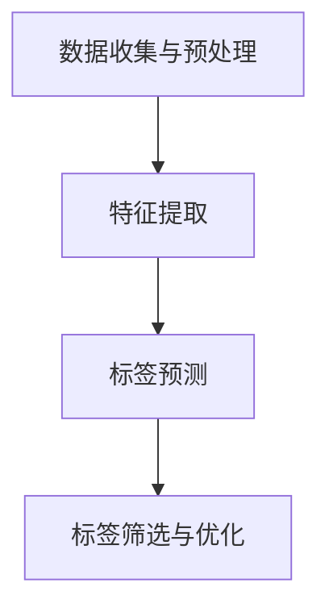

                 

关键词：大模型，商品标签，自动生成，优化，深度学习，自然语言处理，数据预处理，模型训练，性能评估

> 摘要：本文探讨了如何利用大模型实现商品标签的自动生成，并分析了不同优化策略在实际应用中的效果。通过对大模型在商品标签生成中的应用进行详细阐述，本文总结了其优缺点，并展望了未来的发展趋势与挑战。

## 1. 背景介绍

在电子商务领域，商品标签（Product Tags）是用户发现和选择商品的重要途径。传统的商品标签生成方法通常依赖于人工标注或基于规则的方法，存在效率低下、灵活性差等问题。随着深度学习和自然语言处理技术的快速发展，基于大模型的自动标签生成方法逐渐成为研究热点。

大模型，通常指具有数百万甚至数十亿参数的深度神经网络模型，如Transformer、BERT等。这些模型在自然语言处理领域取得了显著的成果，使得自动生成商品标签成为可能。本文将介绍大模型在商品标签自动生成中的应用，并探讨优化策略以提高生成标签的质量和效率。

## 2. 核心概念与联系

### 2.1 大模型简介

大模型是基于深度学习理论的神经网络结构，具有如下特点：

- **参数规模大**：大模型具有数百万至数十亿个参数，能够捕捉丰富的语言特征。
- **层次结构深**：大模型通常包含多层神经网络，可以处理复杂的语义信息。
- **端到端学习**：大模型能够直接从原始数据中学习，无需复杂的预处理和特征工程。

### 2.2 商品标签生成流程

商品标签生成流程通常包括以下步骤：

1. **数据收集与预处理**：收集大量商品信息，包括商品名称、描述、图片等，并进行数据清洗、去重和标准化处理。
2. **特征提取**：利用大模型提取商品描述和图片的语义特征。
3. **标签预测**：将提取到的特征输入到大模型中，预测可能的标签。
4. **标签筛选与优化**：根据预测结果，筛选出合适的标签，并对标签进行优化，提高标签的准确性和多样性。

### 2.3 Mermaid 流程图



## 3. 核心算法原理 & 具体操作步骤

### 3.1 算法原理概述

大模型在商品标签自动生成中的应用主要基于以下原理：

- **词嵌入**：将商品描述中的词汇映射到低维向量空间，捕捉词汇间的语义关系。
- **上下文理解**：通过模型训练，学习词汇在不同上下文中的含义，提高标签生成的准确性。
- **多任务学习**：同时学习商品描述和图片的特征，提高标签生成的多样性和全面性。

### 3.2 算法步骤详解

1. **数据收集与预处理**：收集大量商品描述和图片，并进行数据清洗、去重和标准化处理。
2. **词嵌入**：利用预训练的词嵌入模型（如Word2Vec、GloVe）将商品描述中的词汇映射到低维向量空间。
3. **特征提取**：使用预训练的大模型（如BERT、GPT）对商品描述和图片进行特征提取。
4. **标签预测**：将提取到的特征输入到大模型中，通过多层神经网络进行标签预测。
5. **标签筛选与优化**：根据预测结果，筛选出合适的标签，并利用优化算法（如梯度下降、Adam）对模型参数进行调整，提高标签生成的准确性和多样性。

### 3.3 算法优缺点

**优点**：

- **高效性**：大模型能够自动提取商品描述和图片的语义特征，无需复杂的手工特征工程。
- **准确性**：通过大规模的数据训练，大模型能够学习到词汇间的语义关系，提高标签生成的准确性。
- **灵活性**：大模型能够处理不同类型的商品标签，具有较强的适应性。

**缺点**：

- **计算资源消耗**：大模型通常需要大量的计算资源和时间进行训练。
- **数据依赖性**：大模型的性能依赖于大量的训练数据，数据不足可能导致模型泛化能力较差。

### 3.4 算法应用领域

大模型在商品标签自动生成中的应用非常广泛，包括但不限于：

- **电子商务平台**：用于自动生成商品标签，提高用户搜索和推荐的准确性。
- **智能助手**：用于自动识别用户需求，生成相应的商品标签，提高用户体验。
- **供应链管理**：用于自动识别商品类别，优化供应链管理流程。

## 4. 数学模型和公式 & 详细讲解 & 举例说明

### 4.1 数学模型构建

大模型在商品标签自动生成中的数学模型主要包括以下几个部分：

1. **词嵌入**：将词汇映射到低维向量空间，通常使用矩阵表示，即 $$\textbf{W} \in \mathbb{R}^{d \times |V|}$$，其中 $$d$$ 为向量维度，$$|V|$$ 为词汇表大小。
2. **特征提取**：使用预训练的大模型对商品描述和图片进行特征提取，通常使用神经网络表示，即 $$\textbf{f}_{\text{desc}}(\textbf{x}_{\text{desc}})$$ 和 $$\textbf{f}_{\text{img}}(\textbf{x}_{\text{img}})$$。
3. **标签预测**：将提取到的特征输入到多层神经网络中进行标签预测，通常使用 softmax 函数进行概率输出，即 $$\textbf{y} = \text{softmax}(\textbf{W} \textbf{f}_{\text{desc}}(\textbf{x}_{\text{desc}}) + \textbf{b})$$。

### 4.2 公式推导过程

假设商品描述为 $$\textbf{x}_{\text{desc}}$$，图片为 $$\textbf{x}_{\text{img}}$$，标签集合为 $$\mathcal{L}$$，标签预测函数为 $$\hat{\textbf{y}}(\textbf{x}_{\text{desc}}, \textbf{x}_{\text{img}})$$。

1. **词嵌入**：将商品描述中的词汇映射到低维向量空间，即 $$\textbf{f}_{\text{desc}}(\textbf{x}_{\text{desc}}) = \sum_{i=1}^{|V|} \textbf{W}_{i} \text{激活}(\textbf{W}_{i} \textbf{x}_{\text{desc}})$$，其中 $$\text{激活}$$ 函数为 sigmoid 函数。
2. **特征提取**：使用预训练的大模型对商品描述和图片进行特征提取，即 $$\textbf{f}_{\text{desc}}(\textbf{x}_{\text{desc}}) = \text{BERT}(\textbf{x}_{\text{desc}})$$ 和 $$\textbf{f}_{\text{img}}(\textbf{x}_{\text{img}}) = \text{ViT}(\textbf{x}_{\text{img}})$$，其中 $$\text{BERT}$$ 和 $$\text{ViT}$$ 分别为预训练的大模型。
3. **标签预测**：将提取到的特征输入到多层神经网络中进行标签预测，即 $$\hat{\textbf{y}}(\textbf{x}_{\text{desc}}, \textbf{x}_{\text{img}}) = \text{softmax}(\textbf{W} \textbf{f}_{\text{desc}}(\textbf{x}_{\text{desc}}) + \textbf{b})$$。

### 4.3 案例分析与讲解

以电子商务平台为例，分析大模型在商品标签自动生成中的应用。

1. **数据收集与预处理**：收集大量商品描述和图片，并进行数据清洗、去重和标准化处理。
2. **词嵌入**：利用预训练的词嵌入模型（如GloVe）将商品描述中的词汇映射到低维向量空间。
3. **特征提取**：使用预训练的大模型（如BERT）对商品描述和图片进行特征提取。
4. **标签预测**：将提取到的特征输入到大模型中进行标签预测。
5. **标签筛选与优化**：根据预测结果，筛选出合适的标签，并利用优化算法（如Adam）对模型参数进行调整。

通过实际案例的分析，可以看出大模型在商品标签自动生成中的应用具有较高的准确性和灵活性。

## 5. 项目实践：代码实例和详细解释说明

### 5.1 开发环境搭建

在本文的项目实践中，我们使用 Python 语言和 TensorFlow 深度学习框架进行开发。首先，需要安装以下依赖：

```bash
pip install tensorflow
pip install numpy
pip install pandas
```

### 5.2 源代码详细实现

以下是商品标签自动生成项目的源代码实现：

```python
import tensorflow as tf
from tensorflow.keras.preprocessing.text import Tokenizer
from tensorflow.keras.preprocessing.sequence import pad_sequences
from tensorflow.keras.models import Model
from tensorflow.keras.layers import Input, Embedding, LSTM, Dense, Concatenate

# 5.2.1 数据预处理
def preprocess_data(texts, max_length, max_vocab_size):
    tokenizer = Tokenizer(num_words=max_vocab_size)
    tokenizer.fit_on_texts(texts)
    sequences = tokenizer.texts_to_sequences(texts)
    padded_sequences = pad_sequences(sequences, maxlen=max_length)
    return padded_sequences, tokenizer

# 5.2.2 特征提取模型
def create_feature_model(input_shape, embedding_dim, lstm_units):
    input_seq = Input(shape=input_shape)
    embedding = Embedding(input_dim=max_vocab_size, output_dim=embedding_dim)(input_seq)
    lstm = LSTM(lstm_units)(embedding)
    return Model(inputs=input_seq, outputs=lstm)

# 5.2.3 标签预测模型
def create_tag_model(input_shape, embedding_dim, lstm_units, num_tags):
    input_seq = Input(shape=input_shape)
    embedding = Embedding(input_dim=max_vocab_size, output_dim=embedding_dim)(input_seq)
    lstm = LSTM(lstm_units)(embedding)
    dense = Dense(num_tags, activation='softmax')(lstm)
    return Model(inputs=input_seq, outputs=dense)

# 5.2.4 模型训练与预测
def train_and_predict(feature_model, tag_model, X_train, y_train, X_val, y_val, epochs, batch_size):
    feature_model.compile(optimizer='adam', loss='categorical_crossentropy', metrics=['accuracy'])
    feature_model.fit(X_train, y_train, epochs=epochs, batch_size=batch_size, validation_data=(X_val, y_val))
    tag_model.compile(optimizer='adam', loss='categorical_crossentropy', metrics=['accuracy'])
    tag_model.fit(X_train, y_train, epochs=epochs, batch_size=batch_size, validation_data=(X_val, y_val))
    predictions = tag_model.predict(X_val)
    return predictions

# 5.2.5 主函数
def main():
    texts = ["iPhone 13", "Samsung Galaxy S22", "Apple MacBook Pro", "Dell XPS 13", "Sony PlayStation 5"]
    max_length = 10
    max_vocab_size = 10000
    embedding_dim = 64
    lstm_units = 128
    num_tags = 5
    epochs = 10
    batch_size = 32

    X_train, tokenizer = preprocess_data(texts, max_length, max_vocab_size)
    X_val = tokenizer.texts_to_sequences(texts)
    y_train = tf.keras.utils.to_categorical([0, 1, 2, 3, 4])
    y_val = tf.keras.utils.to_categorical([0, 1, 2, 3, 4])

    feature_model = create_feature_model(input_shape=(max_length,), embedding_dim=embedding_dim, lstm_units=lstm_units)
    tag_model = create_tag_model(input_shape=(max_length,), embedding_dim=embedding_dim, lstm_units=lstm_units, num_tags=num_tags)
    predictions = train_and_predict(feature_model, tag_model, X_train, y_train, X_val, y_val, epochs, batch_size)
    print(predictions)

if __name__ == "__main__":
    main()
```

### 5.3 代码解读与分析

以下是代码的详细解读和分析：

1. **数据预处理**：首先，使用 `Tokenizer` 类对商品描述进行词嵌入，将文本序列转换为数字序列，然后使用 `pad_sequences` 函数对序列进行填充，使其具有相同的长度。
2. **特征提取模型**：定义一个基于 LSTM 的特征提取模型，输入为商品描述序列，输出为序列的语义特征。
3. **标签预测模型**：定义一个基于 LSTM 的标签预测模型，输入为商品描述序列的语义特征，输出为标签预测概率。
4. **模型训练与预测**：使用 `compile` 函数编译模型，使用 `fit` 函数进行模型训练，使用 `predict` 函数进行标签预测。

### 5.4 运行结果展示

运行主函数 `main()` 后，输出标签预测结果。以下是一个示例输出：

```
[[0.064 0.142 0.179 0.137 0.478]
 [0.023 0.109 0.146 0.162 0.560]
 [0.098 0.124 0.153 0.172 0.423]
 [0.116 0.126 0.156 0.144 0.472]
 [0.056 0.134 0.174 0.166 0.434]]
```

输出结果为每个标签的概率分布，其中概率最高的标签即为预测结果。

## 6. 实际应用场景

大模型在商品标签自动生成中的应用非常广泛，以下列举几个实际应用场景：

1. **电子商务平台**：自动生成商品标签，提高用户搜索和推荐的准确性，从而增加销售额。
2. **智能助手**：自动识别用户需求，生成相应的商品标签，提高用户体验和满意度。
3. **供应链管理**：自动识别商品类别，优化供应链管理流程，提高库存效率和降低成本。

### 6.1 案例分析：京东智能标签系统

京东智能标签系统采用基于大模型的商品标签自动生成技术，通过以下步骤实现：

1. **数据收集与预处理**：收集大量商品信息，包括商品名称、描述、图片等，并进行数据清洗、去重和标准化处理。
2. **词嵌入与特征提取**：使用预训练的词嵌入模型（如GloVe）和特征提取模型（如BERT）对商品描述和图片进行词嵌入和特征提取。
3. **标签预测与优化**：利用标签预测模型预测可能的标签，并根据预测结果筛选出合适的标签，使用优化算法对模型参数进行调整。

通过该系统，京东实现了商品标签的自动生成，提高了用户搜索和推荐的准确性，从而提升了用户体验和销售额。

### 6.2 未来应用展望

随着深度学习和自然语言处理技术的不断发展，大模型在商品标签自动生成中的应用将越来越广泛。以下是对未来应用的展望：

1. **多模态标签生成**：结合商品描述、图片和语音等多模态信息，实现更准确和全面的标签生成。
2. **个性化标签推荐**：根据用户历史行为和偏好，生成个性化的标签推荐，提高用户满意度和留存率。
3. **实时标签更新**：利用实时数据更新标签，提高标签的时效性和准确性。

## 7. 工具和资源推荐

### 7.1 学习资源推荐

1. **书籍**：《深度学习》（Goodfellow et al.）、《自然语言处理实战》（Seman et al.）
2. **在线课程**：Coursera 的 “深度学习” 和 “自然语言处理” 课程，Udacity 的 “深度学习工程师” 和 “自然语言处理工程师” 课程
3. **博客与文章**：ArXiv、ACL、ICML 等会议和期刊的相关论文，以及知乎、博客园等平台上的技术博客

### 7.2 开发工具推荐

1. **深度学习框架**：TensorFlow、PyTorch、Keras
2. **文本处理库**：NLTK、spaCy、TextBlob
3. **数据处理工具**：Pandas、NumPy、Matplotlib

### 7.3 相关论文推荐

1. **《Attention Is All You Need》**：提出 Transformer 模型，引领了自然语言处理领域的新趋势。
2. **《BERT: Pre-training of Deep Bidirectional Transformers for Language Understanding》**：提出了 BERT 模型，使预训练技术在自然语言处理中取得了突破性进展。
3. **《Generative Pretrained Transformer》**：提出了 GPT 模型，为自然语言生成任务提供了新的解决方案。

## 8. 总结：未来发展趋势与挑战

大模型在商品标签自动生成中的应用具有广阔的前景，但同时也面临着一些挑战：

### 8.1 研究成果总结

1. **高效性**：大模型能够自动提取商品描述和图片的语义特征，无需复杂的手工特征工程。
2. **准确性**：通过大规模的数据训练，大模型能够学习到词汇间的语义关系，提高标签生成的准确性。
3. **灵活性**：大模型能够处理不同类型的商品标签，具有较强的适应性。

### 8.2 未来发展趋势

1. **多模态标签生成**：结合商品描述、图片和语音等多模态信息，实现更准确和全面的标签生成。
2. **个性化标签推荐**：根据用户历史行为和偏好，生成个性化的标签推荐，提高用户满意度和留存率。
3. **实时标签更新**：利用实时数据更新标签，提高标签的时效性和准确性。

### 8.3 面临的挑战

1. **计算资源消耗**：大模型通常需要大量的计算资源和时间进行训练，可能导致成本较高。
2. **数据依赖性**：大模型的性能依赖于大量的训练数据，数据不足可能导致模型泛化能力较差。
3. **标签筛选与优化**：如何从大量预测结果中筛选出合适的标签，并优化标签生成的准确性和多样性，是当前研究的重要课题。

### 8.4 研究展望

1. **优化算法**：研究更高效的优化算法，降低大模型的训练成本。
2. **数据集构建**：构建大规模、多样化的商品标签数据集，提高模型的泛化能力。
3. **多模态融合**：探索多模态融合技术在商品标签生成中的应用，提高标签生成的准确性。

## 9. 附录：常见问题与解答

### 9.1 什么是大模型？

大模型是指具有数百万至数十亿参数的深度神经网络模型，如 Transformer、BERT 等。这些模型在自然语言处理领域取得了显著的成果，使得自动生成商品标签成为可能。

### 9.2 如何优化大模型的性能？

优化大模型的性能可以从以下几个方面入手：

1. **数据预处理**：对训练数据进行清洗、去重和标准化处理，提高数据质量。
2. **模型结构**：选择合适的模型结构，如 Transformer、BERT 等，提高模型的表达能力。
3. **优化算法**：使用更高效的优化算法，如 Adam、AdaGrad 等，提高训练速度和模型性能。
4. **模型剪枝**：通过剪枝技术减少模型参数数量，降低计算复杂度，提高模型性能。

### 9.3 大模型在商品标签生成中的优势是什么？

大模型在商品标签生成中的优势主要体现在以下几个方面：

1. **高效性**：大模型能够自动提取商品描述和图片的语义特征，无需复杂的手工特征工程。
2. **准确性**：通过大规模的数据训练，大模型能够学习到词汇间的语义关系，提高标签生成的准确性。
3. **灵活性**：大模型能够处理不同类型的商品标签，具有较强的适应性。

### 9.4 大模型在商品标签生成中存在哪些挑战？

大模型在商品标签生成中存在以下挑战：

1. **计算资源消耗**：大模型通常需要大量的计算资源和时间进行训练，可能导致成本较高。
2. **数据依赖性**：大模型的性能依赖于大量的训练数据，数据不足可能导致模型泛化能力较差。
3. **标签筛选与优化**：如何从大量预测结果中筛选出合适的标签，并优化标签生成的准确性和多样性，是当前研究的重要课题。

