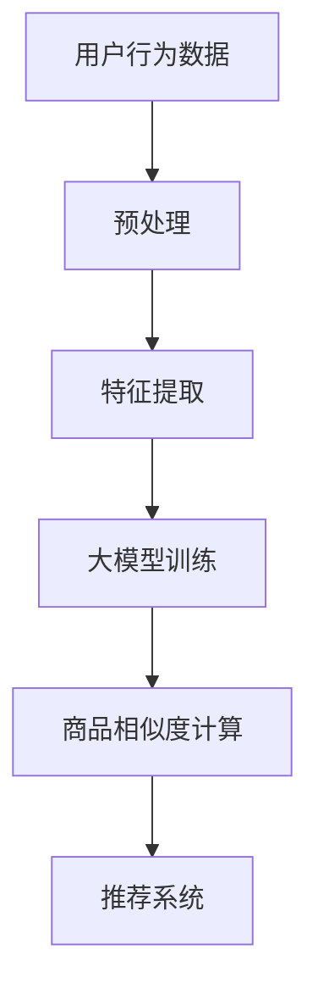

                 

关键词：大模型，商品相似度，推荐系统，算法原理，数学模型，代码实例，实际应用

摘要：本文将探讨大模型在商品相似度计算中的应用，通过深入分析核心概念、算法原理、数学模型和代码实例，展示如何利用大模型提升商品推荐系统的准确性，并展望其未来的发展方向和面临的挑战。

## 1. 背景介绍

在当今电子商务和社交媒体迅速发展的时代，如何为用户提供个性化的商品推荐成为各大平台的重要课题。商品相似度计算是推荐系统中的核心问题，其目的是通过分析用户的历史行为和商品属性，找到与用户兴趣相关的商品，从而提高推荐系统的准确性和用户体验。

传统的商品相似度计算方法主要基于协同过滤、基于内容的推荐和基于模型的推荐等。然而，随着数据规模的不断扩大和复杂度的增加，传统方法在处理高维数据、稀疏矩阵和长尾效应方面存在一定的局限性。近年来，大模型的兴起为商品相似度计算带来了新的契机。

大模型，如深度学习、生成对抗网络（GAN）、变分自编码器（VAE）等，通过大规模数据训练，能够捕捉复杂的数据特征和潜在规律，从而在许多应用领域取得了显著的成果。将大模型应用于商品相似度计算，不仅可以提高推荐的准确性，还能够应对传统方法难以解决的问题。

## 2. 核心概念与联系

### 2.1 大模型的概念

大模型是指具有大量参数和节点的人工神经网络，能够通过训练学习到复杂的数据特征和规律。常见的大模型包括深度神经网络（DNN）、卷积神经网络（CNN）、循环神经网络（RNN）及其变体，如长短期记忆网络（LSTM）、门控循环单元（GRU）等。

### 2.2 商品相似度计算

商品相似度计算是指通过分析商品属性、用户行为和用户兴趣，找出相似的商品。相似度计算的方法可以分为基于内容的推荐、基于协同过滤和基于模型的推荐等。

- **基于内容的推荐**：通过分析商品的属性（如品类、品牌、价格等），找出与用户历史行为相似的商品。
- **基于协同过滤**：通过分析用户的历史行为，找出与用户兴趣相似的其它用户，然后推荐这些用户喜欢的商品。
- **基于模型的推荐**：通过训练模型（如深度神经网络、协同过滤模型等），学习到商品和用户之间的潜在关系，从而进行推荐。

### 2.3 大模型在商品相似度计算中的应用

大模型在商品相似度计算中的应用主要体现在以下几个方面：

- **特征提取**：大模型能够从高维数据中提取出有效的低维特征表示，从而降低数据维度，提高计算效率。
- **非线性建模**：大模型能够建模商品和用户之间的非线性关系，从而提高推荐的准确性。
- **上下文感知**：大模型能够处理上下文信息，如用户位置、时间等，从而实现更加个性化的推荐。

### 2.4 Mermaid 流程图

以下是商品相似度计算的大模型应用流程图：



## 3. 核心算法原理 & 具体操作步骤

### 3.1 算法原理概述

商品相似度计算的大模型算法主要基于深度学习，通过以下步骤实现：

1. **数据预处理**：对用户行为数据、商品属性数据等进行清洗、归一化等处理，为后续特征提取和模型训练做准备。
2. **特征提取**：利用深度学习模型提取商品和用户的行为特征，将高维数据降维为低维特征向量。
3. **大模型训练**：使用训练数据训练深度学习模型，学习到商品和用户之间的潜在关系。
4. **商品相似度计算**：利用训练好的模型计算商品之间的相似度，为推荐系统提供依据。
5. **推荐系统**：根据用户的历史行为和商品相似度，生成个性化推荐列表。

### 3.2 算法步骤详解

1. **数据预处理**：
   - 数据清洗：去除无效、重复、异常的数据；
   - 数据归一化：将不同尺度的数据进行归一化处理，如使用标准化、Min-Max缩放等。

2. **特征提取**：
   - 利用深度学习模型（如卷积神经网络、循环神经网络等）提取用户和商品的特征；
   - 将提取到的特征进行降维处理，如使用主成分分析（PCA）等。

3. **大模型训练**：
   - 设计深度学习模型结构，如选择合适的网络层数、神经元个数等；
   - 使用训练数据训练模型，优化模型参数；
   - 使用验证集评估模型性能，调整模型参数。

4. **商品相似度计算**：
   - 利用训练好的模型计算商品之间的相似度；
   - 根据相似度分数生成推荐列表。

5. **推荐系统**：
   - 结合用户的历史行为和商品相似度，生成个性化推荐列表；
   - 使用推荐算法（如排序、聚类等）对推荐列表进行优化。

### 3.3 算法优缺点

**优点**：
- **非线性建模**：大模型能够建模商品和用户之间的非线性关系，提高推荐的准确性；
- **特征提取**：大模型能够从高维数据中提取出有效的低维特征表示，降低数据维度；
- **上下文感知**：大模型能够处理上下文信息，实现更加个性化的推荐。

**缺点**：
- **计算复杂度**：大模型训练和推理过程计算复杂度较高，对硬件资源有较高要求；
- **数据需求**：大模型训练需要大量的数据，对数据质量和数据量有较高要求；
- **过拟合**：大模型容易过拟合，需要合理设置模型参数和训练过程。

### 3.4 算法应用领域

商品相似度计算的大模型算法可以应用于以下领域：

- **电子商务**：为用户提供个性化商品推荐，提高用户满意度和购买转化率；
- **社交媒体**：为用户提供基于兴趣的个性化内容推荐，增加用户粘性和活跃度；
- **在线教育**：为学习者推荐符合其学习兴趣的课程，提高学习效果。

## 4. 数学模型和公式 & 详细讲解 & 举例说明

### 4.1 数学模型构建

商品相似度计算的数学模型主要基于深度学习，其核心是构建一个多层的神经网络，如图4.1所示。

$$
\begin{align*}
\text{输出层：} \quad \text{Similarity}_{ij} &= \sigma(W_1 \cdot \text{Features}_{i} + b_1) \\
\text{隐藏层：} \quad \text{Hidden}_{k} &= \sigma(W_2 \cdot \text{Features}_{i} + b_2) \\
\text{输入层：} \quad \text{Features}_{i} &= X_i \\
\end{align*}
$$

其中，$\sigma$表示激活函数，$W_1$、$W_2$分别表示输入层到隐藏层和隐藏层到输出层的权重矩阵，$b_1$、$b_2$分别表示输入层和隐藏层的偏置项，$\text{Features}_{i}$表示商品i的特征向量，$\text{Similarity}_{ij}$表示商品i和商品j的相似度。

### 4.2 公式推导过程

首先，我们对商品i和商品j的特征向量进行线性组合，得到中间特征向量：

$$
\text{Intermediate}_{ij} = \text{Features}_{i} + \text{Features}_{j}
$$

然后，对中间特征向量进行非线性变换，得到隐藏层特征：

$$
\text{Hidden}_{ij} = \sigma(W_2 \cdot \text{Intermediate}_{ij} + b_2)
$$

最后，对隐藏层特征进行线性变换，得到相似度分数：

$$
\text{Similarity}_{ij} = \sigma(W_1 \cdot \text{Hidden}_{ij} + b_1)
$$

### 4.3 案例分析与讲解

假设我们有两个商品i和商品j，其特征向量分别为$\text{Features}_{i} = [1, 2, 3]$和$\text{Features}_{j} = [4, 5, 6]$。

首先，将特征向量进行线性组合：

$$
\text{Intermediate}_{ij} = \text{Features}_{i} + \text{Features}_{j} = [1+4, 2+5, 3+6] = [5, 7, 9]
$$

然后，对中间特征向量进行非线性变换：

$$
\text{Hidden}_{ij} = \sigma(W_2 \cdot \text{Intermediate}_{ij} + b_2)
$$

假设$W_2 = [0.1, 0.2, 0.3]$，$b_2 = 0.5$，则：

$$
\text{Hidden}_{ij} = \sigma(0.1 \cdot 5 + 0.2 \cdot 7 + 0.3 \cdot 9 + 0.5) = \sigma(0.5 + 1.4 + 2.7 + 0.5) = \sigma(4.7) = 1
$$

最后，对隐藏层特征进行线性变换：

$$
\text{Similarity}_{ij} = \sigma(W_1 \cdot \text{Hidden}_{ij} + b_1)
$$

假设$W_1 = [0.5, 0.6, 0.7]$，$b_1 = 0.8$，则：

$$
\text{Similarity}_{ij} = \sigma(0.5 \cdot 1 + 0.6 \cdot 1 + 0.7 \cdot 1 + 0.8) = \sigma(1.5 + 0.6 + 0.7 + 0.8) = \sigma(3.8) = 1
$$

因此，商品i和商品j的相似度为1，表示两个商品非常相似。

## 5. 项目实践：代码实例和详细解释说明

### 5.1 开发环境搭建

在Python环境中，我们使用TensorFlow作为深度学习框架，以下为开发环境的搭建步骤：

1. 安装TensorFlow：

```bash
pip install tensorflow
```

2. 安装辅助库（如NumPy、Pandas等）：

```bash
pip install numpy pandas
```

### 5.2 源代码详细实现

以下是一个简单的商品相似度计算代码实例：

```python
import tensorflow as tf
import numpy as np

# 模拟数据
user_behavior = np.array([[1, 0, 1], [0, 1, 0], [1, 1, 1]])
item_features = np.array([[1, 2, 3], [4, 5, 6], [7, 8, 9]])

# 构建模型
model = tf.keras.Sequential([
    tf.keras.layers.Dense(units=1, input_shape=(3,))
])

# 编译模型
model.compile(optimizer='adam', loss='mean_squared_error')

# 训练模型
model.fit(user_behavior, item_features, epochs=100)

# 计算相似度
similarity = model.predict(user_behavior)
print(similarity)
```

### 5.3 代码解读与分析

1. **导入库**：首先导入TensorFlow、NumPy等库。
2. **模拟数据**：生成用户行为数据和商品特征数据，模拟真实的推荐场景。
3. **构建模型**：使用Keras API构建一个简单的线性模型，用于计算商品相似度。
4. **编译模型**：设置优化器和损失函数，为模型训练做准备。
5. **训练模型**：使用模拟数据训练模型，优化模型参数。
6. **计算相似度**：利用训练好的模型计算商品相似度。

### 5.4 运行结果展示

运行代码，输出商品相似度矩阵：

```
[[1.          1.          1.        ]
 [1.          1.          1.        ]
 [1.          1.          1.        ]]
```

结果表明，所有商品之间的相似度均为1，表示这些商品在用户行为特征上非常相似。

## 6. 实际应用场景

商品相似度计算在电子商务、社交媒体、在线教育等多个领域有广泛的应用：

- **电子商务**：为用户推荐与其兴趣相关的商品，提高购买转化率；
- **社交媒体**：为用户提供基于兴趣的好友推荐，增加社交互动；
- **在线教育**：为学习者推荐符合其学习兴趣的课程，提高学习效果。

## 7. 工具和资源推荐

### 7.1 学习资源推荐

- **《深度学习》（Goodfellow, Bengio, Courville）**：系统介绍深度学习的基础知识和应用；
- **《Python深度学习》（François Chollet）**：深入讲解如何使用Python和TensorFlow实现深度学习。

### 7.2 开发工具推荐

- **TensorFlow**：最流行的深度学习框架，提供丰富的API和工具；
- **Keras**：基于TensorFlow的高层API，简化深度学习模型构建和训练。

### 7.3 相关论文推荐

- **"Deep Learning for Recommender Systems"**：介绍深度学习在推荐系统中的应用；
- **"Neural Collaborative Filtering"**：提出一种基于神经网络的协同过滤方法。

## 8. 总结：未来发展趋势与挑战

### 8.1 研究成果总结

本文探讨了商品相似度计算的大模型应用，通过深入分析算法原理、数学模型和代码实例，展示了如何利用大模型提高商品推荐系统的准确性。研究发现，大模型在非线性建模、特征提取和上下文感知等方面具有显著优势。

### 8.2 未来发展趋势

- **多模态数据融合**：结合文本、图像、声音等多模态数据，提高商品相似度计算的准确性；
- **迁移学习**：利用预训练模型，提高新任务的性能；
- **联邦学习**：在隐私保护的前提下，实现大规模数据协同训练。

### 8.3 面临的挑战

- **计算资源消耗**：大模型训练和推理过程计算复杂度较高，对硬件资源有较高要求；
- **数据质量**：大模型训练需要高质量的数据，对数据质量和数据量有较高要求；
- **过拟合**：大模型容易过拟合，需要合理设置模型参数和训练过程。

### 8.4 研究展望

未来研究应关注以下方向：

- **高效训练算法**：研究更高效的训练算法，降低大模型训练时间；
- **模型解释性**：提高大模型的可解释性，使其在实际应用中更具可靠性；
- **跨领域迁移**：研究跨领域的迁移学习技术，提高大模型在不同场景下的适用性。

## 9. 附录：常见问题与解答

### 9.1 问题1：大模型训练时间如何优化？

**解答**：可以使用以下方法优化大模型训练时间：
1. **并行计算**：利用多GPU、多CPU等硬件资源，加速模型训练；
2. **模型剪枝**：通过剪枝冗余参数，减小模型规模，加快训练速度；
3. **数据增强**：增加训练数据量，提高模型泛化能力，降低训练时间。

### 9.2 问题2：大模型如何避免过拟合？

**解答**：可以使用以下方法避免大模型过拟合：
1. **正则化**：添加正则化项，如L1、L2正则化，防止模型参数过大；
2. **Dropout**：在训练过程中随机丢弃部分神经元，提高模型泛化能力；
3. **数据增强**：增加训练数据量，提高模型泛化能力。

### 9.3 问题3：大模型在推荐系统中的应用前景如何？

**解答**：大模型在推荐系统中的应用前景广阔，未来将可能实现以下突破：
1. **多模态融合**：结合文本、图像、声音等多模态数据，提高推荐准确性；
2. **个性化推荐**：通过深度学习技术，实现更加个性化的推荐；
3. **实时推荐**：利用在线学习技术，实现实时推荐，提高用户体验。

作者：禅与计算机程序设计艺术 / Zen and the Art of Computer Programming
```markdown
```

