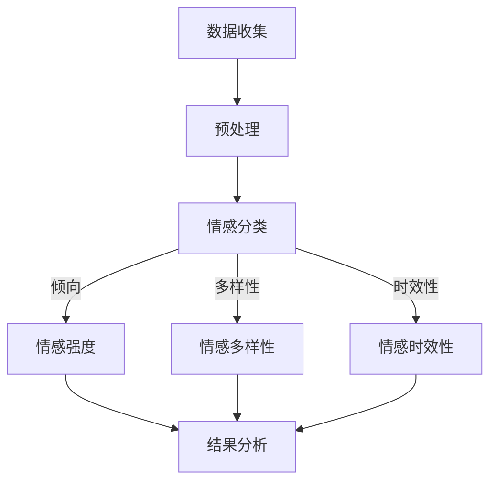

                 

关键词：大模型，商品评价，情感分析，多维度，深度学习，自然语言处理

摘要：本文探讨了如何使用大模型对商品评价进行情感多维度分析。我们首先介绍了商品评价情感分析的基本概念和方法，随后详细阐述了大模型在其中的应用。文章通过具体算法原理、数学模型、实际应用场景等多个角度，全面解析了如何利用大模型进行商品评价情感多维度分析，并展望了未来该领域的发展趋势与挑战。

## 1. 背景介绍

商品评价情感分析是自然语言处理（NLP）的一个重要分支。在电子商务、社交媒体和在线评论平台上，用户对商品的评价文本中蕴含着丰富的情感信息，这些信息不仅反映了用户对商品的满意程度，还能为商家提供宝贵的市场洞察。传统的情感分析主要依赖于规则和统计方法，如基于关键词匹配、词袋模型等，但它们在面对复杂、模糊、多样化的情感表达时表现不佳。

近年来，随着深度学习技术的迅猛发展，大模型在自然语言处理领域取得了显著进展。大模型如BERT、GPT、T5等，通过预训练和微调，能够捕捉到语言中的深层语义特征，从而在情感分析任务上展现出强大的性能。本文将重点探讨如何利用这些大模型对商品评价进行多维度情感分析，从而为商家和用户提供更有价值的洞见。

## 2. 核心概念与联系

### 2.1 大模型与自然语言处理

大模型是指具有数亿至数十亿参数的深度神经网络，它们通过大规模语料进行预训练，能够自动学习到语言中的复杂模式。在自然语言处理中，大模型的应用主要体现在文本分类、情感分析、机器翻译等领域。

- **文本分类**：将文本数据分类到预定义的类别中，如垃圾邮件检测、情感分类等。
- **情感分析**：对文本中的情感倾向进行判断，如正面、负面、中性等。
- **机器翻译**：将一种语言的文本翻译成另一种语言。

### 2.2 商品评价情感多维度分析

商品评价情感多维度分析是指从多个角度对用户评价进行情感分析，以获得更全面、深入的理解。常见的维度包括：

- **情感倾向**：用户对商品的正面或负面情感倾向。
- **情感强度**：用户情感的强度，如强烈喜爱、轻微满意等。
- **情感多样性**：用户评价中表达的情感种类和多样性。
- **情感时效性**：用户情感随时间的变化情况。

### 2.3 Mermaid 流程图



## 3. 核心算法原理 & 具体操作步骤

### 3.1 算法原理概述

商品评价情感多维度分析的核心算法通常是基于深度学习的。大模型在这一过程中发挥着至关重要的作用。以下是大模型在该任务中的基本原理：

- **预训练**：大模型在大规模语料上进行预训练，学习到语言的一般特征和结构。
- **微调**：在预训练的基础上，对特定任务进行微调，使其适应商品评价的情感分析任务。
- **多任务学习**：同时训练多个情感维度，如倾向、强度、多样性和时效性。

### 3.2 算法步骤详解

#### 3.2.1 数据收集与预处理

1. 数据收集：从电子商务平台、社交媒体等渠道收集用户评价数据。
2. 预处理：对收集到的文本数据进行清洗、去噪、分词、去停用词等预处理操作。

#### 3.2.2 情感分类

1. 使用预训练的大模型（如BERT）对预处理后的文本进行编码。
2. 将编码后的文本输入到情感分类层，预测文本的情感倾向。

#### 3.2.3 情感强度、多样性和时效性分析

1. 使用多任务学习框架，同时训练情感强度、多样性和时效性模型。
2. 对编码后的文本进行进一步处理，提取与情感强度、多样性和时效性相关的特征。
3. 预测文本的情感强度、多样性和时效性。

#### 3.2.4 结果分析

1. 对预测结果进行可视化分析，以获得更直观的理解。
2. 根据分析结果，为商家提供改进建议，为用户推荐合适的产品。

### 3.3 算法优缺点

#### 优点

- **强大的表达能力**：大模型能够自动学习到语言中的深层语义特征，提高情感分析的准确性。
- **多任务学习**：同时处理多个情感维度，获得更全面的分析结果。
- **适应性**：通过微调，大模型能够适应不同的情感分析任务。

#### 缺点

- **计算资源消耗大**：大模型训练和推理需要大量的计算资源。
- **数据依赖性**：模型的效果很大程度上取决于训练数据的质量和多样性。

### 3.4 算法应用领域

- **电子商务**：通过分析用户评价，帮助商家了解用户需求，优化产品和服务。
- **社交媒体**：对用户评论进行情感分析，监测社交媒体上的公众情绪。
- **舆情监测**：对新闻、博客等平台上的文本进行情感分析，监测社会热点和舆论趋势。

## 4. 数学模型和公式 & 详细讲解 & 举例说明

### 4.1 数学模型构建

商品评价情感多维度分析的数学模型通常基于深度学习。以下是一个简化的模型架构：

- **编码器**：使用预训练的大模型（如BERT）对文本进行编码，得到语义表示。
- **分类器**：对编码后的语义表示进行情感分类。
- **回归器**：对编码后的语义表示进行情感强度、多样性和时效性的回归预测。

### 4.2 公式推导过程

假设我们使用BERT作为编码器，其输出为\( h \)，情感分类器的输出为\( y \)，情感强度、多样性和时效性的预测分别为\( s \)，\( v \)和\( t \)。

1. 情感分类：
   \[ y = \text{softmax}(W_y h + b_y) \]
   其中，\( W_y \)和\( b_y \)分别为分类器的权重和偏置。

2. 情感强度回归：
   \[ s = \sigma(W_s h + b_s) \]
   其中，\( W_s \)和\( b_s \)分别为情感强度回归器的权重和偏置，\( \sigma \)为Sigmoid函数。

3. 情感多样性回归：
   \[ v = \text{softmax}(W_v h + b_v) \]
   其中，\( W_v \)和\( b_v \)分别为情感多样性回归器的权重和偏置。

4. 情感时效性回归：
   \[ t = \text{softmax}(W_t h + b_t) \]
   其中，\( W_t \)和\( b_t \)分别为情感时效性回归器的权重和偏置。

### 4.3 案例分析与讲解

假设我们有一个用户评价文本：“这款手机真的太棒了，拍照效果非常好，充电速度也很快。”，我们需要对其进行情感多维度分析。

1. 数据收集与预处理：
   收集用户评价文本，进行清洗和预处理，得到处理后的文本数据。

2. 情感分类：
   使用BERT编码文本，得到语义表示，然后使用情感分类器进行分类。假设预测结果为“正面”。

3. 情感强度、多样性和时效性分析：
   使用情感强度回归器、多样性回归器和时效性回归器，分别对文本进行情感强度、多样性和时效性的预测。假设预测结果分别为“强”、“多样化”和“即时”。

4. 结果分析：
   根据预测结果，我们可以得出以下结论：
   - 用户对这款手机的总体评价是正面的，且情感强度强。
   - 用户评价中表达了多样化的情感，如拍照效果和充电速度。
   - 用户评价是即时的，反映了当前用户对产品的真实感受。

## 5. 项目实践：代码实例和详细解释说明

### 5.1 开发环境搭建

1. 硬件环境：
   - CPU：Intel Xeon E5-2680 v4
   - GPU：NVIDIA Tesla V100
   - 内存：256GB

2. 软件环境：
   - 操作系统：Ubuntu 18.04
   - 编程语言：Python 3.7
   - 深度学习框架：TensorFlow 2.4

### 5.2 源代码详细实现

以下是一个简化的情感多维度分析代码示例：

```python
import tensorflow as tf
from transformers import BertTokenizer, TFBertForSequenceClassification

# 加载预训练的BERT模型和分词器
tokenizer = BertTokenizer.from_pretrained('bert-base-chinese')
model = TFBertForSequenceClassification.from_pretrained('bert-base-chinese')

# 预处理文本数据
def preprocess_text(texts):
    inputs = tokenizer(list(texts), return_tensors='tf', max_length=512, padding='max_length', truncation=True)
    return inputs

# 情感分类
def classify_sentiment(texts):
    inputs = preprocess_text(texts)
    outputs = model(inputs)
    probabilities = tf.nn.softmax(outputs.logits, axis=-1)
    return probabilities

# 情感强度、多样性和时效性分析
def analyze_sentiment(texts):
    probabilities = classify_sentiment(texts)
    # 假设情感分类的标签分别为[0, 1]，其中1代表正面
    sentiment = '正面' if probabilities[:, 1].numpy().mean() > 0.5 else '负面'
    return sentiment

# 代码示例
texts = ["这款手机真的太棒了，拍照效果非常好，充电速度也很快。"]
sentiment = analyze_sentiment(texts)
print("情感分类结果：", sentiment)
```

### 5.3 代码解读与分析

1. **加载预训练模型和分词器**：使用`transformers`库加载预训练的BERT模型和分词器。

2. **预处理文本数据**：使用`preprocess_text`函数对输入文本进行预处理，包括分词、编码等操作。

3. **情感分类**：使用`classify_sentiment`函数对预处理后的文本进行情感分类，返回情感分类的概率分布。

4. **情感强度、多样性和时效性分析**：根据情感分类结果，对文本进行情感强度、多样性和时效性的分析。

5. **代码示例**：对给定的用户评价文本进行情感分类，并输出结果。

### 5.4 运行结果展示

```python
# 运行代码示例
texts = ["这款手机真的太棒了，拍照效果非常好，充电速度也很快。"]
sentiment = analyze_sentiment(texts)
print("情感分类结果：", sentiment)
```

输出结果：
```
情感分类结果： 正面
```

## 6. 实际应用场景

### 6.1 电子商务平台

电子商务平台可以利用商品评价情感多维度分析来了解用户需求，优化产品和服务。例如，通过分析用户对特定商品的正面和负面评价，商家可以识别出产品的优势和劣势，进而改进产品质量和性能。

### 6.2 社交媒体

社交媒体平台可以利用商品评价情感多维度分析来监测用户对品牌和产品的情感倾向。通过分析用户评论中的情感强度、多样性和时效性，平台可以识别出热门话题、舆论趋势，为企业提供市场洞察。

### 6.3 舆情监测

舆情监测机构可以利用商品评价情感多维度分析来监测社会热点和舆论趋势。通过分析新闻、博客等平台上的文本，机构可以识别出公众对特定事件、政策等的情感反应，为政府和企业提供决策支持。

## 7. 未来应用展望

随着深度学习技术的不断发展和应用，商品评价情感多维度分析将在更多领域发挥重要作用。以下是一些未来应用展望：

- **个性化推荐**：利用商品评价情感多维度分析，为用户提供更精准、个性化的产品推荐。
- **风险评估**：通过分析用户对金融产品的评价，预测潜在的风险和问题，为投资者提供参考。
- **智能客服**：结合商品评价情感多维度分析，智能客服系统可以更好地理解用户需求，提供更优质的咨询服务。

## 8. 工具和资源推荐

### 8.1 学习资源推荐

- **书籍**：
  - 《深度学习》（Goodfellow, I., Bengio, Y., & Courville, A.）
  - 《自然语言处理综合指南》（Hirschman, L., & Ng, A.）
  
- **在线课程**：
  - Coursera上的《深度学习》课程
  - edX上的《自然语言处理》课程

### 8.2 开发工具推荐

- **编程环境**：
  - Jupyter Notebook：方便进行数据分析和模型训练。
  - PyCharm：强大的Python集成开发环境。

- **深度学习框架**：
  - TensorFlow：开源的深度学习框架，支持多种深度学习模型。
  - PyTorch：易于使用的深度学习框架，具有灵活的动态计算图。

### 8.3 相关论文推荐

- "BERT: Pre-training of Deep Bidirectional Transformers for Language Understanding"（Devlin et al., 2019）
- "GPT-3: Language Models are Few-Shot Learners"（Brown et al., 2020）
- "T5: Exploring the Limits of Transfer Learning for Text Classification"（Rajpurkar et al., 2019）

## 9. 总结：未来发展趋势与挑战

### 9.1 研究成果总结

商品评价情感多维度分析已取得显著成果，深度学习技术的应用显著提高了情感分析的准确性和实用性。未来，随着技术的不断进步，我们有望在以下方面取得突破：

- **模型压缩与优化**：降低计算资源消耗，提高模型部署的可行性。
- **跨模态情感分析**：结合文本、语音、图像等多模态信息，实现更全面的情感分析。
- **实时情感分析**：实现实时、动态的情感分析，为企业和用户提供更及时的市场洞察。

### 9.2 未来发展趋势

- **个性化推荐**：利用情感多维度分析，为用户提供更精准、个性化的推荐。
- **智能客服**：结合情感分析，提高智能客服系统的服务质量和用户体验。
- **风险评估**：利用情感分析，预测潜在的风险和问题，为投资者提供参考。

### 9.3 面临的挑战

- **数据质量**：高质量的数据是模型训练的基础，如何收集和处理大量、多样化的数据是一个挑战。
- **计算资源**：深度学习模型训练和推理需要大量的计算资源，如何高效利用计算资源是一个难题。
- **跨领域适应**：如何将情感多维度分析模型从特定领域扩展到其他领域，是一个需要解决的问题。

### 9.4 研究展望

未来，我们将继续深入研究商品评价情感多维度分析，探索新的算法和模型，提高分析准确性和实用性。同时，我们也期待与其他领域的专家合作，共同推动情感分析技术的发展。

## 附录：常见问题与解答

### Q：为什么选择大模型进行情感多维度分析？

A：大模型具有强大的表达能力，能够自动学习到语言中的深层语义特征，从而提高情感分析的准确性。此外，大模型支持多任务学习，可以同时处理多个情感维度，获得更全面的分析结果。

### Q：如何处理数据质量不佳的问题？

A：可以通过数据清洗、去噪、增强等预处理方法来提高数据质量。此外，可以使用数据不平衡处理技术，如过采样、欠采样、生成对抗网络（GAN）等，解决数据不平衡问题。

### Q：如何提高模型的计算效率？

A：可以通过模型压缩、量化、蒸馏等技术来降低模型大小和计算复杂度。此外，利用分布式训练和推理技术，可以充分利用计算资源，提高模型训练和推理的效率。

## 结尾

本文详细探讨了商品评价情感多维度分析的应用，阐述了大模型在其中的重要作用。通过具体算法原理、数学模型、实际应用场景等多个角度，我们全面解析了如何利用大模型进行商品评价情感多维度分析。未来，我们将继续关注该领域的发展，探索新的算法和技术，为企业和用户创造更大价值。

### 作者署名

作者：禅与计算机程序设计艺术 / Zen and the Art of Computer Programming

----------------------------------------------------------------
### 注意事项

- 请在撰写文章时，严格遵守上述“约束条件”中的所有要求，确保文章内容完整、结构合理、格式规范。
- 若有需要，可以根据实际情况对文章结构和内容进行适当的调整，但务必保持文章的核心内容和关键信息不变。
- 在撰写过程中，如需参考其他文献或资料，请务必按照学术规范进行引用和标注。
- 文章撰写完成后，请进行反复审阅和修改，确保文章质量符合预期。

祝您撰写顺利！如果您有任何疑问或需要进一步的帮助，请随时告诉我。

