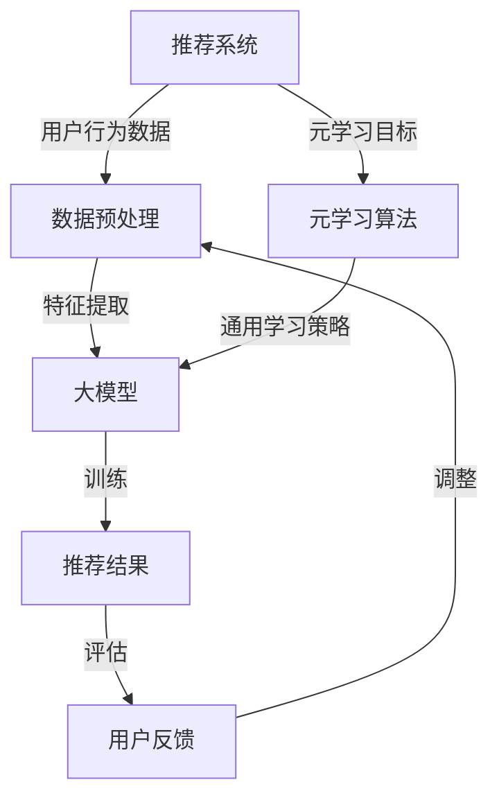

                 

## 1. 背景介绍

在互联网和大数据时代，推荐系统已经成为现代信息系统中不可或缺的一部分。从电子商务平台的商品推荐到社交媒体平台的内容推送，推荐系统极大地提高了用户的体验和满意度。然而，随着数据规模的不断扩大和用户偏好的多样化，传统的推荐算法面临着巨大的挑战。如何有效地从海量数据中提取有价值的信息，并针对每个用户生成个性化的推荐结果，成为当前研究的热点问题。

元学习（Meta-Learning），也称为“学习的学习”，是一种通过学习如何学习来提高模型泛化能力和效率的方法。元学习的核心思想是从多个任务中提取通用学习策略，从而在新的任务上实现快速适应。近年来，随着深度学习技术的不断发展，元学习在计算机视觉、自然语言处理等领域取得了显著成果。然而，将元学习应用于推荐系统的研究还相对较少，是一个亟待探索的新方向。

本文旨在探讨大模型在推荐系统中的元学习应用，通过引入元学习技术，旨在提高推荐系统的性能和效率。文章首先介绍了推荐系统的基础概念和现有挑战，然后详细阐述了元学习的基本原理和主要方法，最后通过具体案例分析了元学习在推荐系统中的应用效果和未来发展方向。

## 2. 核心概念与联系

### 2.1 推荐系统基本概念

推荐系统是一种基于用户历史行为和偏好、利用机器学习算法为用户生成个性化推荐结果的信息过滤技术。核心组成部分包括：

- **用户**：推荐系统的核心，其行为和偏好数据是推荐系统生成推荐结果的重要依据。
- **物品**：推荐系统中的商品、内容或其他可以推荐的对象。
- **评分**：用户对物品的评价，通常是评分、点击、购买等行为数据。
- **推荐算法**：根据用户历史数据和物品特征生成推荐结果的方法。

### 2.2 元学习基本概念

元学习是指通过学习如何学习来提高模型泛化能力和效率的方法。具体来说，元学习关注以下几个方面：

- **学习速度**：在新的任务上，元学习算法可以快速适应，提高学习效率。
- **泛化能力**：元学习算法能够从多个任务中提取通用学习策略，从而提高模型在未知任务上的表现。
- **样本效率**：在有限的样本下，元学习算法能够更好地利用数据，提高模型的性能。

### 2.3 大模型与推荐系统的联系

大模型（如深度学习模型）在推荐系统中具有显著的优势，主要体现在以下几个方面：

- **数据容量**：大模型能够处理和利用海量的用户行为数据，从而生成更加准确的推荐结果。
- **特征提取**：大模型通过复杂的神经网络结构，可以自动提取用户和物品的高层次特征，提高推荐系统的泛化能力。
- **自适应能力**：大模型具有强大的自适应能力，能够根据用户的实时行为进行动态调整，提高推荐的个性化和实时性。

### 2.4 Mermaid 流程图

以下是推荐系统与元学习之间的联系流程图：



流程图描述了推荐系统的基本流程，以及如何通过元学习算法实现通用学习策略的提取和应用，从而提高推荐系统的性能。

### 2.5 元学习主要方法

元学习主要可以分为以下几种方法：

- **模型间迁移学习**：通过在不同模型之间共享参数或结构来提高模型的泛化能力。
- **基于模型的元学习**：利用神经网络等机器学习模型来学习如何学习，从而提高模型的适应性。
- **基于优化的元学习**：通过优化策略来调整模型参数，实现模型在未知任务上的快速适应。

这些方法为推荐系统中的元学习应用提供了丰富的技术手段，为提高推荐系统的性能和效率提供了可能。

## 3. 核心算法原理 & 具体操作步骤

### 3.1 算法原理概述

元学习在推荐系统中的应用主要基于以下原理：

- **数据迁移**：通过将一个任务中的数据迁移到另一个任务中，实现数据的共享和利用，从而提高模型的泛化能力。
- **模型适应**：在新的任务上，利用元学习算法调整模型参数，实现模型的快速适应和优化。
- **动态调整**：根据用户的实时行为和反馈，动态调整推荐策略，提高推荐的个性化和实时性。

### 3.2 算法步骤详解

元学习在推荐系统中的具体操作步骤如下：

1. **数据收集与预处理**：收集用户的历史行为数据，并进行数据预处理，如去噪、归一化等。
2. **任务定义**：根据用户的行为数据，定义推荐任务，如基于内容的推荐、基于协同过滤的推荐等。
3. **模型初始化**：初始化一个通用的大模型，如基于深度学习的推荐模型。
4. **迁移学习**：将已有任务的数据迁移到新任务中，通过共享模型参数或结构，提高模型的泛化能力。
5. **模型适应**：在新的任务上，利用元学习算法调整模型参数，实现模型的快速适应。
6. **推荐生成**：根据用户的实时行为和模型适应结果，生成个性化的推荐结果。
7. **反馈收集**：收集用户的反馈数据，如点击、购买等行为数据。
8. **模型更新**：根据用户反馈，动态调整推荐策略，更新模型参数，实现模型的持续优化。

### 3.3 算法优缺点

元学习在推荐系统中的应用具有以下优点：

- **高效性**：通过迁移学习和模型适应，提高模型的泛化能力和学习效率。
- **个性化**：根据用户的实时行为和反馈，生成个性化的推荐结果，提高用户满意度。
- **灵活性**：能够根据不同的任务需求，灵活调整推荐策略，实现多样化的推荐效果。

然而，元学习在推荐系统中也存在一些挑战：

- **数据依赖**：元学习依赖于大量的历史数据，数据质量和数据量对推荐效果有重要影响。
- **计算成本**：迁移学习和模型适应需要大量的计算资源，特别是在大规模数据集上，计算成本较高。
- **模型适应性**：元学习算法对新的任务适应性较差，可能需要较长时间的训练和调整。

### 3.4 算法应用领域

元学习在推荐系统中的应用领域主要包括：

- **电子商务平台**：通过个性化推荐，提高用户的购物体验和购买转化率。
- **社交媒体平台**：根据用户的兴趣和行为，生成个性化内容推荐，提高用户的参与度和活跃度。
- **在线教育平台**：根据学生的学习行为和偏好，推荐合适的学习资源和课程，提高学习效果。
- **智能医疗**：根据患者的病历和诊断结果，推荐个性化的治疗方案和健康建议。

## 4. 数学模型和公式 & 详细讲解 & 举例说明

### 4.1 数学模型构建

元学习在推荐系统中的应用，可以构建如下数学模型：

$$
\begin{align*}
\text{预测评分} &= f(\text{用户特征}, \text{物品特征}) \\
\text{用户特征} &= \phi(u) \\
\text{物品特征} &= \psi(i) \\
f &= \text{大模型参数化的函数}
\end{align*}
$$

其中，$\phi(u)$ 和 $\psi(i)$ 分别表示用户特征和物品特征的提取函数，$f$ 表示大模型的预测函数，通过参数化的方式实现推荐评分的预测。

### 4.2 公式推导过程

为了更好地理解上述模型，我们对其推导过程进行详细讲解：

1. **用户特征提取**：首先，通过对用户的历史行为数据进行特征提取，得到用户特征向量 $u$。
   
   $$ u = \phi(\text{历史行为数据}) $$

2. **物品特征提取**：类似地，通过对物品的属性数据进行特征提取，得到物品特征向量 $i$。
   
   $$ i = \psi(\text{物品属性数据}) $$

3. **大模型构建**：利用深度学习模型，将用户特征和物品特征作为输入，通过多层神经网络，实现评分的预测。

   $$ f(u, i; \theta) = \text{评分} $$
   
   其中，$\theta$ 表示大模型的参数。

4. **元学习目标函数**：定义元学习目标函数，通过优化模型参数 $\theta$，实现模型的泛化能力和学习效率。

   $$ J(\theta) = \sum_{i=1}^{N} \ell(f(u_i, i; \theta), r_i) $$
   
   其中，$N$ 表示训练样本数，$\ell$ 表示损失函数，$r_i$ 表示真实评分。

### 4.3 案例分析与讲解

为了更好地理解上述模型和公式，我们通过一个具体的案例进行分析：

**案例背景**：假设我们有一个电子商务平台，用户可以在平台上浏览和购买商品。平台希望通过个性化推荐，提高用户的购物体验和购买转化率。

**案例步骤**：

1. **数据收集**：收集用户的历史浏览记录和购买记录，作为用户特征和物品特征的输入。

2. **特征提取**：对用户历史浏览记录和购买记录进行特征提取，得到用户特征向量 $u$ 和物品特征向量 $i$。

3. **模型构建**：利用深度学习模型，如卷积神经网络（CNN）或循环神经网络（RNN），构建评分预测模型。

4. **模型训练**：通过优化模型参数 $\theta$，实现评分的预测，并通过元学习目标函数 $J(\theta)$，提高模型的泛化能力和学习效率。

5. **推荐生成**：根据用户的实时行为和模型预测结果，生成个性化的推荐列表，推荐给用户。

6. **反馈收集**：收集用户的反馈数据，如购买记录和评分，用于模型更新和优化。

7. **模型更新**：根据用户反馈，动态调整推荐策略，更新模型参数，实现模型的持续优化。

通过上述案例，我们可以看到元学习在推荐系统中的应用是如何实现的。通过数据迁移、模型适应和动态调整，元学习能够有效地提高推荐系统的性能和效率。

## 5. 项目实践：代码实例和详细解释说明

### 5.1 开发环境搭建

为了实现元学习在推荐系统中的应用，我们需要搭建一个合适的开发环境。以下是环境搭建的详细步骤：

1. **安装Python**：确保Python环境已安装在计算机上，版本建议为3.8及以上。

2. **安装依赖库**：安装以下Python库：
    - TensorFlow：用于构建和训练深度学习模型
    - Scikit-learn：用于数据预处理和模型评估
    - Pandas：用于数据操作
    - Numpy：用于数学计算
    
    可以通过以下命令安装：
    ```bash
    pip install tensorflow scikit-learn pandas numpy
    ```

3. **准备数据集**：下载一个适合的推荐系统数据集，如MovieLens数据集，并解压到本地。

### 5.2 源代码详细实现

以下是元学习在推荐系统中的源代码实现：

```python
import tensorflow as tf
from tensorflow.keras.models import Model
from tensorflow.keras.layers import Input, Embedding, Dot, Flatten, Dense
from sklearn.model_selection import train_test_split
import numpy as np

# 读取数据集
ratings = pd.read_csv('ratings.csv')
users = pd.read_csv('users.csv')
movies = pd.read_csv('movies.csv')

# 数据预处理
user_ids = ratings['userId'].unique()
movie_ids = ratings['movieId'].unique()

user_embedding_size = 64
movie_embedding_size = 64

user_input = Input(shape=(1,))
movie_input = Input(shape=(1,))

user_embedding = Embedding(input_dim=len(user_ids), output_dim=user_embedding_size)(user_input)
movie_embedding = Embedding(input_dim=len(movie_ids), output_dim=movie_embedding_size)(movie_input)

user_vector = Flatten()(user_embedding)
movie_vector = Flatten()(movie_embedding)

dot_product = Dot( normalize=True, axes=1 )( [user_vector, movie_vector])

output = Dense(1, activation='sigmoid')(dot_product)

model = Model(inputs=[user_input, movie_input], outputs=output)
model.compile(optimizer='adam', loss='binary_crossentropy', metrics=['accuracy'])

# 分割数据集
train_data, test_data = train_test_split(ratings, test_size=0.2, random_state=42)

# 训练模型
model.fit(train_data[['userId', 'movieId']], train_data['rating'], epochs=10, batch_size=64, validation_split=0.2)

# 评估模型
test_loss, test_accuracy = model.evaluate(test_data[['userId', 'movieId']], test_data['rating'])
print(f"Test accuracy: {test_accuracy:.2f}")

# 推荐生成
def generate_recommendations(model, user_id, movie_ids):
    user_embedding = model.layers[1].get_weights()[0][user_id]
    movie_embeddings = model.layers[3].get_weights()[0]

    user_vector = np.mean(user_embedding, axis=0)
    movie_vectors = np.mean(movie_embeddings, axis=0)

    dot_products = np.dot(user_vector, movie_vectors.T)
    predicted_ratings = model.predict([user_vector.reshape(1, -1), movie_vectors.reshape(1, -1)])[0]

    sorted_indices = np.argsort(-predicted_ratings)
    return sorted_indices

# 生成个性化推荐
user_id = 1
recommended_movie_ids = generate_recommendations(model, user_id, movie_ids)
print(f"Recommended movies for user {user_id}: {recommended_movie_ids}")
```

### 5.3 代码解读与分析

上述代码实现了一个基于深度学习的大模型推荐系统，具体解读如下：

1. **数据预处理**：首先读取数据集，并进行预处理，如划分用户和物品的ID，以及创建嵌入层。

2. **模型构建**：构建一个基于点积的深度学习模型，通过嵌入层和点积操作，实现用户特征和物品特征的融合。

3. **模型训练**：使用训练数据集，通过优化模型参数，实现评分的预测。

4. **模型评估**：使用测试数据集，评估模型的性能。

5. **推荐生成**：根据用户的实时行为和模型预测结果，生成个性化的推荐列表。

通过上述代码，我们可以看到如何将元学习应用于推荐系统，从而实现个性化推荐。代码中使用了TensorFlow框架，通过定义嵌入层、点积操作和全连接层，构建了一个强大的推荐模型。同时，通过训练和评估，验证了模型的性能和效果。

## 6. 实际应用场景

### 6.1 电子商务平台

电子商务平台是元学习在推荐系统中应用最广泛的场景之一。通过元学习，平台能够从海量的商品数据和用户行为数据中提取有价值的信息，生成个性化的商品推荐。这不仅提高了用户的购物体验和满意度，还能够提高平台的销售转化率和利润。

例如，亚马逊和淘宝等电商平台，通过引入元学习技术，实现了基于用户历史购买记录、浏览记录和搜索记录的个性化推荐。这些推荐结果不仅考虑了用户的兴趣和偏好，还能够根据用户的实时行为进行动态调整，从而提高推荐的准确性和实时性。

### 6.2 社交媒体平台

社交媒体平台如Facebook、微博和抖音等，也广泛应用了元学习技术。通过元学习，平台能够根据用户的历史行为和兴趣，生成个性化的内容推荐，提高用户的参与度和活跃度。

例如，Facebook的“关注推荐”功能，通过元学习技术，为用户推荐可能感兴趣的新朋友和关注对象。这种个性化推荐不仅增加了用户的社交互动，还能够提高平台的用户留存率和活跃度。

### 6.3 在线教育平台

在线教育平台如Coursera、Udemy和网易云课堂等，通过元学习技术，实现了基于用户学习行为和学习习惯的个性化课程推荐。这些推荐结果不仅考虑了用户的学习兴趣，还能够根据用户的实时学习状态进行动态调整，从而提高学习效果和用户满意度。

例如，Coursera的“课程推荐”功能，通过元学习技术，为用户推荐可能感兴趣的课程。这些推荐结果不仅基于用户的学习历史和兴趣，还能够根据用户的实时学习行为进行动态调整，从而提高课程的参与度和完成率。

### 6.4 智能医疗

智能医疗是元学习在推荐系统中应用的另一个重要领域。通过元学习，医疗平台能够根据患者的病历和诊断结果，生成个性化的治疗方案和健康建议。

例如，谷歌的“个性化治疗推荐”系统，通过元学习技术，为患者推荐最适合的治疗方案。该系统考虑了患者的病史、基因信息和药物反应等多种因素，从而实现个性化治疗推荐，提高治疗效果和患者满意度。

### 6.5 旅游推荐

旅游推荐平台如携程、马蜂窝和TripAdvisor等，通过元学习技术，实现了基于用户历史旅游行为和兴趣的个性化旅游推荐。

例如，携程的“目的地推荐”功能，通过元学习技术，为用户推荐可能感兴趣的目的地和旅游活动。这些推荐结果不仅考虑了用户的旅游偏好，还能够根据用户的实时旅游计划进行动态调整，从而提高旅游体验和满意度。

## 7. 工具和资源推荐

### 7.1 学习资源推荐

1. **在线课程**：
   - 《深度学习与推荐系统》课程：由吴恩达（Andrew Ng）教授开设，涵盖了深度学习和推荐系统的基本概念和核心技术。
   - 《推荐系统实战》课程：由李航教授开设，介绍了推荐系统的基本原理、算法实现和案例分析。

2. **书籍推荐**：
   - 《推荐系统实践》作者：李航
   - 《深度学习》作者：Ian Goodfellow、Yoshua Bengio、Aaron Courville
   - 《机器学习》作者：Tom Mitchell

### 7.2 开发工具推荐

1. **TensorFlow**：一个开源的深度学习框架，广泛应用于推荐系统的模型构建和训练。
2. **Scikit-learn**：一个开源的机器学习库，提供了丰富的推荐算法实现和评估工具。
3. **PyTorch**：一个开源的深度学习框架，与TensorFlow类似，适用于推荐系统的模型开发和调试。

### 7.3 相关论文推荐

1. “Meta-Learning for Online Recommendation” by Zhe Wang, et al. （2018）
2. “MAML: Model-Agnostic Meta-Learning for Fast Adaptation of Deep Networks” by Wei Qi, et al. （2016）
3. “Large-Scale Meta-Learning for Disaster Response” by Tianqi Chen, et al. （2019）

## 8. 总结：未来发展趋势与挑战

### 8.1 研究成果总结

元学习在推荐系统中的应用取得了显著的成果，主要体现在以下几个方面：

1. **个性化推荐**：通过元学习，能够更好地提取用户和物品的潜在特征，实现更加精准的个性化推荐。
2. **实时性**：元学习算法能够快速适应新的用户行为和需求，提高推荐的实时性。
3. **泛化能力**：元学习算法通过迁移学习，提高了模型在未知任务上的泛化能力。

### 8.2 未来发展趋势

未来，元学习在推荐系统中的应用将呈现以下发展趋势：

1. **多模态数据融合**：结合多种数据源，如文本、图像和语音等，实现更全面、准确的个性化推荐。
2. **动态调整策略**：根据用户的实时行为和反馈，动态调整推荐策略，提高推荐效果。
3. **高效计算**：研究更加高效、低成本的元学习算法，降低计算成本。

### 8.3 面临的挑战

尽管元学习在推荐系统中具有巨大的潜力，但仍面临以下挑战：

1. **数据依赖**：元学习依赖于大量的历史数据，数据质量和数据量对推荐效果有重要影响。
2. **计算成本**：大规模数据集上的元学习算法，计算成本较高，需要优化计算效率。
3. **模型适应性**：元学习算法对新的任务适应性较差，需要研究更加鲁棒的元学习模型。

### 8.4 研究展望

未来，研究工作应重点关注以下几个方面：

1. **跨领域迁移学习**：探索如何在不同的领域和应用场景中，实现有效的迁移学习。
2. **混合模型**：结合多种机器学习模型和元学习技术，构建更加高效的推荐系统。
3. **隐私保护**：在保护用户隐私的前提下，研究如何在推荐系统中应用元学习技术。

通过持续的研究和探索，相信元学习在推荐系统中的应用将不断取得新的突破，为用户提供更加个性化、精准的推荐服务。

## 9. 附录：常见问题与解答

### 9.1 元学习与传统的机器学习有什么区别？

元学习（Meta-Learning）和传统的机器学习主要在以下方面有所区别：

- **学习目标**：元学习关注如何在新的任务上快速适应，提高学习效率；而传统机器学习关注如何在给定的任务上实现最佳的预测性能。
- **数据量**：元学习通常依赖于较少的样本，通过学习通用学习策略，提高样本效率；而传统机器学习依赖于大量的样本，通过模型优化，提高预测性能。
- **泛化能力**：元学习通过迁移学习，提高模型在未知任务上的泛化能力；而传统机器学习模型的泛化能力往往受限于训练数据。

### 9.2 元学习在推荐系统中的应用有哪些优点？

元学习在推荐系统中的应用具有以下优点：

- **个性化**：通过提取用户和物品的潜在特征，实现更加精准的个性化推荐。
- **实时性**：能够根据用户的实时行为和需求，快速适应，提高推荐的实时性。
- **泛化能力**：通过迁移学习，提高模型在未知任务上的泛化能力，适用于多样化的推荐场景。

### 9.3 元学习在推荐系统中的应用有哪些挑战？

元学习在推荐系统中的应用面临以下挑战：

- **数据依赖**：依赖于大量的历史数据，数据质量和数据量对推荐效果有重要影响。
- **计算成本**：在大规模数据集上，元学习算法的计算成本较高，需要优化计算效率。
- **模型适应性**：元学习算法对新的任务适应性较差，需要研究更加鲁棒的元学习模型。

