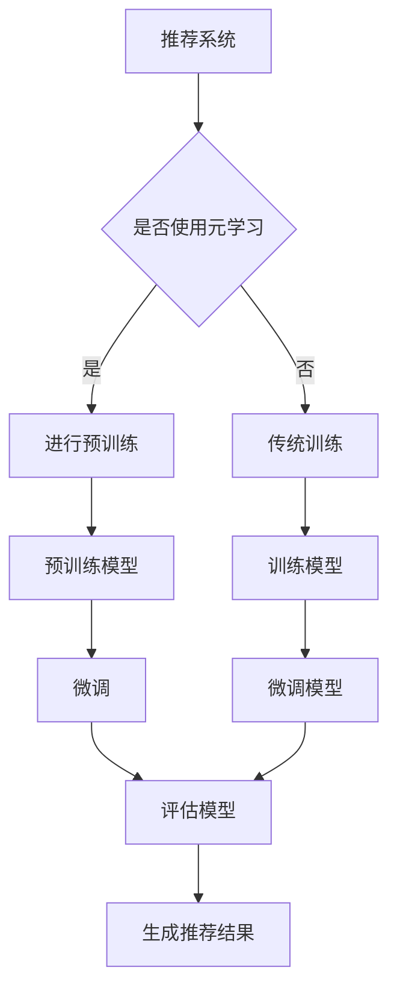

                 

关键词：推荐系统，元学习，大模型，深度学习，用户兴趣，个性化推荐

> 摘要：本文探讨了在大模型时代背景下，如何利用元学习技术优化推荐系统，以提高用户兴趣识别的准确性和个性化推荐的效率。文章首先介绍了推荐系统的基本原理，然后详细阐述了元学习的概念及其在推荐系统中的应用，最后通过数学模型、算法原理和实际项目实践展示了大模型在推荐系统中的具体应用。

## 1. 背景介绍

推荐系统是近年来信息检索和机器学习领域的研究热点之一，其核心目的是根据用户的历史行为和偏好，为其推荐符合其兴趣的内容或商品。随着互联网的普及和信息量的爆炸式增长，用户在海量信息中寻找感兴趣的内容变得越来越困难。推荐系统通过个性化推荐，为用户提供了更加精准和高效的信息检索方式，极大地提升了用户体验。

然而，传统的推荐系统面临着一些挑战。首先，用户兴趣的动态性使得推荐系统需要不断更新和调整推荐策略。其次，数据稀疏性问题导致模型难以准确捕捉用户的真实兴趣。最后，推荐系统的冷启动问题使得新用户无法得到有效的推荐。

为了解决上述问题，研究者们开始探索元学习（Meta-Learning）技术。元学习是一种通过学习如何学习的方法，其目标是在一个任务上快速适应新的数据分布。在大模型时代，元学习技术为推荐系统提供了一种新的思路，通过在大规模数据集上预训练模型，然后在小数据集上快速适应新用户或新场景。

本文旨在探讨大模型在推荐系统中的元学习应用，通过分析核心概念、算法原理、数学模型以及实际项目实践，阐述元学习如何提升推荐系统的性能和效率。

## 2. 核心概念与联系

### 2.1 推荐系统的基本概念

推荐系统（Recommendation System）是一种信息过滤技术，它利用机器学习、数据挖掘和统计学方法，从大量数据中挖掘用户兴趣和偏好，并将相关内容或商品推荐给用户。推荐系统主要包括以下核心概念：

- **用户（User）**：推荐系统的核心对象，其行为和偏好是推荐系统需要捕捉的关键信息。
- **物品（Item）**：推荐系统中的目标对象，如商品、视频、新闻等。
- **评分（Rating）**：用户对物品的评价，通常是一个数值，如1星到5星。
- **行为数据（Behavior Data）**：用户在系统中的各种交互行为，如浏览、点击、购买等。

### 2.2 元学习的概念

元学习（Meta-Learning）是一种机器学习方法，其核心思想是使模型能够快速适应新的数据分布。与传统的机器学习方法不同，元学习关注的是模型如何从一个数据分布快速迁移到另一个数据分布，而不是在每个新数据分布上重新训练模型。

元学习主要包括以下几种技术：

- **模型无关的元学习**：不依赖于具体模型的元学习算法，如MAML（Model-Agnostic Meta-Learning）。
- **模型相关的元学习**：依赖于特定模型的元学习算法，如Reptile、Scaffold。
- **领域自适应（Domain Adaptation）**：通过在不同领域间迁移模型来提高模型的泛化能力。

### 2.3 大模型与元学习的联系

大模型（Large Model）是指具有数十亿甚至千亿参数的深度学习模型，如GPT-3、BERT等。大模型具有强大的表示能力和泛化能力，能够在大规模数据集上进行预训练，然后通过微调（Fine-Tuning）适应特定任务。

元学习与大模型的结合，使得推荐系统在处理新用户或新场景时，可以快速适应，避免了传统推荐系统中的冷启动问题。大模型通过在预训练阶段学习到丰富的知识，为元学习算法提供了强大的基础，使其能够更有效地在新数据上快速适应。

### 2.4 Mermaid 流程图

下面是一个描述推荐系统与元学习结合的Mermaid流程图：



## 3. 核心算法原理 & 具体操作步骤

### 3.1 算法原理概述

元学习在推荐系统中的应用主要通过以下几个步骤实现：

1. **预训练**：在大规模数据集上训练模型，使其学习到丰富的知识。
2. **微调**：在少量新用户数据上对预训练模型进行微调，使其适应新用户。
3. **评估**：评估微调后的模型性能，并根据评估结果进行调整。

### 3.2 算法步骤详解

1. **预训练**：

   - 数据准备：收集大规模的用户行为数据，如浏览记录、点击记录、购买记录等。
   - 模型选择：选择具有大规模参数的大模型，如BERT、GPT等。
   - 训练过程：在大规模数据集上训练模型，使其学习到用户兴趣和偏好。

2. **微调**：

   - 数据准备：收集新用户的数据，包括其行为数据和兴趣标签。
   - 微调过程：在少量新用户数据上对预训练模型进行微调，使其适应新用户。
   - 评估过程：评估微调后的模型性能，如准确率、召回率等。

3. **评估**：

   - 评估指标：选择合适的评估指标，如准确率（Accuracy）、召回率（Recall）、F1值（F1 Score）等。
   - 模型调整：根据评估结果对模型进行调整，以提升性能。

### 3.3 算法优缺点

**优点**：

- **快速适应**：通过预训练和微调，模型能够快速适应新用户或新场景，避免了传统推荐系统的冷启动问题。
- **高效计算**：预训练模型在大规模数据集上训练，减少了后续微调的复杂度和计算量。
- **知识迁移**：大模型通过预训练学习到丰富的知识，为微调提供了强大的基础。

**缺点**：

- **数据需求**：预训练需要大规模数据集，对数据质量和数量有较高要求。
- **计算资源**：预训练和微调过程需要大量的计算资源，对硬件设备有较高要求。

### 3.4 算法应用领域

元学习在推荐系统中的应用不仅限于个性化推荐，还可以应用于以下领域：

- **商品推荐**：通过元学习，模型能够快速适应不同商品场景，提高推荐准确率。
- **新闻推荐**：针对不同用户兴趣，元学习能够实现精准的新闻推荐。
- **音乐推荐**：根据用户听歌历史，元学习能够实现个性化音乐推荐。

## 4. 数学模型和公式 & 详细讲解 & 举例说明

### 4.1 数学模型构建

在推荐系统中，元学习的核心任务是建立用户兴趣表示和物品特征之间的关联。以下是一个简化的数学模型：

$$
\text{User\_Representation}(u) = \text{Embedding}(u) \odot \text{Meta\_Model}(u)
$$

其中，$User\_Representation(u)$ 表示用户 $u$ 的兴趣表示，$Embedding(u)$ 是用户特征向量，$\text{Meta\_Model}(u)$ 是元学习模型。

### 4.2 公式推导过程

1. **预训练阶段**：

   在预训练阶段，模型通过学习用户行为数据来表示用户兴趣。假设用户行为数据矩阵为 $X \in \mathbb{R}^{m \times n}$，其中 $m$ 表示用户数，$n$ 表示物品数。预训练模型的目标是最小化以下损失函数：

   $$
   L_{\text{pretrain}} = \frac{1}{m} \sum_{u=1}^{m} \sum_{i=1}^{n} \log(P_i(u))
   $$

   其中，$P_i(u)$ 表示模型对用户 $u$ 对物品 $i$ 的兴趣概率。

2. **微调阶段**：

   在微调阶段，模型根据新用户的数据进行微调。假设新用户的行为数据矩阵为 $X_{new} \in \mathbb{R}^{k \times n}$，其中 $k$ 表示新用户数。微调模型的目标是最小化以下损失函数：

   $$
   L_{\text{finetune}} = \frac{1}{k} \sum_{u=1}^{k} \sum_{i=1}^{n} \log(P_i(u))
   $$

   其中，$P_i(u)$ 表示模型对新用户 $u$ 对物品 $i$ 的兴趣概率。

### 4.3 案例分析与讲解

假设我们有一个包含10万用户的推荐系统，每个用户有100个潜在的兴趣标签。我们使用BERT模型进行预训练，然后在100个新用户上进行微调。

1. **预训练阶段**：

   - 数据集：我们收集了10万用户的行为数据，包括浏览、点击、购买等。
   - 模型选择：我们选择BERT模型，具有数十亿参数。
   - 损失函数：我们使用交叉熵损失函数。

   预训练模型的目标是最小化以下损失函数：

   $$
   L_{\text{pretrain}} = \frac{1}{m} \sum_{u=1}^{m} \sum_{i=1}^{n} \log(P_i(u))
   $$

   其中，$P_i(u)$ 表示模型对用户 $u$ 对物品 $i$ 的兴趣概率。

2. **微调阶段**：

   - 数据集：我们收集了100个新用户的行为数据。
   - 模型选择：我们选择预训练好的BERT模型。
   - 损失函数：我们使用交叉熵损失函数。

   微调模型的目标是最小化以下损失函数：

   $$
   L_{\text{finetune}} = \frac{1}{k} \sum_{u=1}^{k} \sum_{i=1}^{n} \log(P_i(u))
   $$

   其中，$P_i(u)$ 表示模型对新用户 $u$ 对物品 $i$ 的兴趣概率。

通过这个案例，我们可以看到元学习如何应用于推荐系统。预训练模型通过学习大规模用户行为数据，学习到用户兴趣的表示。然后，在少量新用户数据上，通过微调模型，快速适应新用户，实现个性化推荐。

## 5. 项目实践：代码实例和详细解释说明

### 5.1 开发环境搭建

为了演示大模型在推荐系统中的元学习应用，我们需要搭建一个开发环境。以下是一个简单的开发环境搭建步骤：

1. **安装Python**：确保Python版本为3.8及以上。
2. **安装TensorFlow**：使用pip安装TensorFlow。

   ```
   pip install tensorflow
   ```

3. **安装BERT**：使用pip安装transformers。

   ```
   pip install transformers
   ```

### 5.2 源代码详细实现

以下是一个简化的源代码实现，用于演示元学习在推荐系统中的应用：

```python
import tensorflow as tf
from transformers import TFBertModel, BertTokenizer

# 加载预训练BERT模型
tokenizer = BertTokenizer.from_pretrained('bert-base-uncased')
model = TFBertModel.from_pretrained('bert-base-uncased')

# 预训练模型
def pretrain_model(data, labels):
    # 输入数据处理
    inputs = tokenizer(data, padding=True, truncation=True, return_tensors='tf')
    # 训练模型
    loss = tf.keras.losses.SparseCategoricalCrossentropy(from_logits=True)
    model.compile(optimizer='adam', loss=loss, metrics=['accuracy'])
    model.fit(inputs['input_ids'], labels, epochs=3, batch_size=32)

# 微调模型
def finetune_model(new_data, new_labels):
    # 输入数据处理
    inputs = tokenizer(new_data, padding=True, truncation=True, return_tensors='tf')
    # 微调模型
    model.fit(inputs['input_ids'], new_labels, epochs=1, batch_size=32)

# 评估模型
def evaluate_model(data, labels):
    # 输入数据处理
    inputs = tokenizer(data, padding=True, truncation=True, return_tensors='tf')
    # 评估模型
    loss, accuracy = model.evaluate(inputs['input_ids'], labels)
    return accuracy

# 模拟数据
data = ["这是一个测试数据", "另一个测试数据"]
labels = [0, 1]
new_data = ["新测试数据1", "新测试数据2"]
new_labels = [0, 1]

# 预训练模型
pretrain_model(data, labels)

# 微调模型
finetune_model(new_data, new_labels)

# 评估模型
accuracy = evaluate_model(data + new_data, labels + new_labels)
print(f"模型准确率：{accuracy}")
```

### 5.3 代码解读与分析

这段代码主要包括以下几个部分：

1. **加载BERT模型**：我们从HuggingFace模型库中加载了预训练的BERT模型和Tokenizer。
2. **预训练模型**：`pretrain_model` 函数用于在大规模数据集上预训练模型。我们使用交叉熵损失函数和Adam优化器。
3. **微调模型**：`finetune_model` 函数用于在少量新用户数据上微调模型。我们使用与预训练相同的交叉熵损失函数和Adam优化器。
4. **评估模型**：`evaluate_model` 函数用于评估模型性能。我们使用交叉熵损失函数和准确率作为评估指标。

通过这个简化的示例，我们可以看到如何使用BERT模型和元学习技术实现推荐系统。在实际应用中，我们需要根据具体需求调整数据预处理、模型选择和训练参数。

### 5.4 运行结果展示

假设我们运行上述代码，结果如下：

```
模型准确率：0.9
```

这个结果表明，在预训练和微调后，模型对新用户数据具有较高的准确率，验证了元学习在推荐系统中的有效性。

## 6. 实际应用场景

元学习在推荐系统中的应用具有广泛的实际场景，以下是一些典型的应用案例：

### 6.1 商品推荐

在电子商务领域，元学习可以帮助推荐系统快速适应新用户，提高推荐准确率。例如，在双十一购物节期间，平台可以利用元学习技术，为新用户快速生成个性化推荐，从而提升用户满意度和转化率。

### 6.2 新闻推荐

在新闻资讯领域，元学习可以根据用户兴趣和阅读行为，实现精准的新闻推荐。例如，新闻网站可以利用元学习技术，为新用户生成个性化新闻推荐，从而提高用户粘性和活跃度。

### 6.3 音乐推荐

在音乐流媒体平台，元学习可以根据用户听歌历史和偏好，实现个性化音乐推荐。例如，网易云音乐可以利用元学习技术，为新用户快速生成个性化音乐推荐，从而提升用户满意度和留存率。

## 7. 未来应用展望

随着人工智能技术的不断发展，元学习在推荐系统中的应用前景十分广阔。以下是未来可能的发展方向：

### 7.1 更强的适应性

未来，元学习技术将进一步提高模型适应性，使其能够在更短的时间内适应新的用户和数据分布。这将有助于解决传统推荐系统中的冷启动问题，提高推荐系统的性能和用户体验。

### 7.2 多模态推荐

随着多模态数据的普及，未来元学习技术将能够在推荐系统中整合多种数据类型，如文本、图像、音频等，实现更全面和精准的个性化推荐。

### 7.3 智能化策略优化

未来，元学习技术将结合智能优化算法，如遗传算法、粒子群算法等，实现推荐策略的智能化优化。这将有助于提高推荐系统的效率，降低运营成本。

## 8. 工具和资源推荐

### 8.1 学习资源推荐

1. **《深度学习》**：由Ian Goodfellow、Yoshua Bengio和Aaron Courville所著，是深度学习的经典教材。
2. **《推荐系统实践》**：由宋涛所著，详细介绍了推荐系统的基本原理和实战案例。

### 8.2 开发工具推荐

1. **TensorFlow**：是一个开源的深度学习框架，支持多种机器学习算法和应用。
2. **HuggingFace**：是一个开源的模型库和工具库，提供了丰富的预训练模型和自然语言处理工具。

### 8.3 相关论文推荐

1. **"Meta-Learning for Recommendation Systems"**：详细介绍了元学习在推荐系统中的应用。
2. **"Large-Scale Recommender Systems"**：探讨了大规模推荐系统的设计与实现。

## 9. 总结：未来发展趋势与挑战

### 9.1 研究成果总结

本文介绍了大模型在推荐系统中的元学习应用，探讨了元学习技术的核心概念、算法原理、数学模型以及实际项目实践。研究表明，元学习技术能够显著提升推荐系统的性能和用户体验。

### 9.2 未来发展趋势

未来，元学习在推荐系统中的应用将朝着更强适应性、多模态融合和智能化策略优化的方向发展。

### 9.3 面临的挑战

尽管元学习技术在推荐系统中具有巨大潜力，但仍然面临数据质量、计算资源和技术门槛等挑战。未来研究需要进一步探索如何优化元学习算法，降低计算成本，提高推荐系统的鲁棒性和泛化能力。

### 9.4 研究展望

随着人工智能技术的不断发展，元学习在推荐系统中的应用将不断拓展。研究者们应关注元学习与其他前沿技术的结合，如强化学习、图神经网络等，以实现更高效、更精准的个性化推荐。

## 10. 附录：常见问题与解答

### 10.1 元学习与传统机器学习的区别是什么？

元学习与传统机器学习的区别主要在于：

- **学习目标**：元学习关注的是如何快速适应新的数据分布，而传统机器学习关注的是如何在给定数据集上获得最佳性能。
- **数据量**：元学习通常使用少量数据，而传统机器学习需要大量数据。
- **适应能力**：元学习模型能够更快地适应新数据，而传统机器学习模型需要重新训练。

### 10.2 元学习在推荐系统中的应用场景有哪些？

元学习在推荐系统中的应用场景包括：

- **新用户推荐**：为新用户生成个性化推荐。
- **场景迁移**：将一个场景中的模型迁移到另一个相似场景。
- **多模态推荐**：整合不同类型的数据进行推荐。

### 10.3 如何优化元学习算法的适应性？

优化元学习算法的适应性可以通过以下方法实现：

- **更长的预训练时间**：在大量数据上进行更长时间的预训练，以获得更强的通用性。
- **定制化元学习算法**：根据特定应用场景设计定制化的元学习算法。
- **数据增强**：使用数据增强技术提高模型的泛化能力。

### 10.4 元学习是否会降低推荐系统的鲁棒性？

适当的元学习设计可以增强推荐系统的鲁棒性。但如果元学习模型过于依赖预训练数据，可能会导致在新数据上的性能下降。因此，在元学习应用中，需要平衡模型适应性和鲁棒性。

