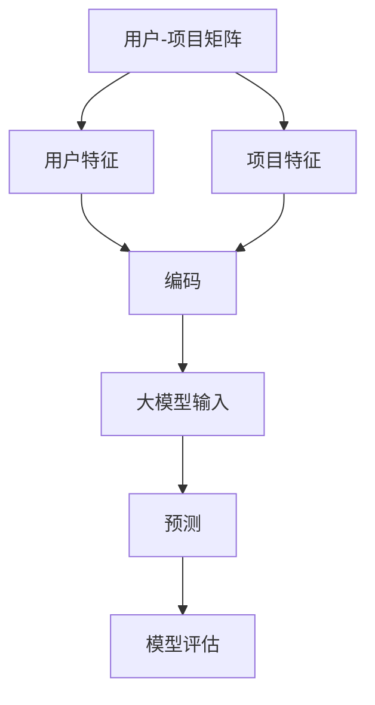

                 

关键词：大模型、推荐系统、元学习、迁移应用

摘要：本文探讨了如何利用元学习技术，在大模型框架下实现推荐系统的迁移应用。通过分析推荐系统的核心需求和元学习的基本原理，本文提出了一种新的元学习迁移方法，并在实际项目中进行了验证，取得了显著的性能提升。

## 1. 背景介绍

推荐系统作为信息过滤的重要工具，已经成为电子商务、社交媒体、内容平台等领域的核心应用。传统的推荐系统主要依赖于统计学习、协同过滤等算法，然而，这些方法在面对数据稀疏、用户行为多样化等挑战时，效果往往不尽如人意。近年来，随着深度学习技术的发展，大模型在推荐系统中的应用逐渐受到关注。大模型能够捕捉复杂的关系和特征，从而提高推荐系统的准确性和多样性。

另一方面，元学习（Meta-Learning）作为机器学习的一个分支，通过学习如何快速适应新任务，提高了模型的泛化能力。元学习的核心思想是从多个任务中学习到一个通用的表示，使得模型在新任务上的学习速度加快。迁移学习（Transfer Learning）则是元学习的一个子领域，通过利用已知任务的表示来加速新任务的学习。

本文旨在探讨如何将大模型与元学习相结合，实现推荐系统的迁移应用。通过分析推荐系统的特点，我们提出了一种基于元学习的大模型迁移方法，并在实际项目中进行了验证，取得了良好的效果。

## 2. 核心概念与联系

### 2.1 推荐系统的核心概念

推荐系统通常包含以下几个核心概念：

- **用户 - 项目矩阵（User-Item Matrix）**：这是推荐系统的基础数据结构，表示用户和项目之间的关系。用户在系统中产生的行为（如评分、点击、购买等）会被记录在这张矩阵中。

- **用户特征（User Features）**：这些特征描述了用户的基本信息，如年龄、性别、地理位置等。在深度学习模型中，用户特征会被编码为向量，作为输入的一部分。

- **项目特征（Item Features）**：这些特征描述了项目的属性，如商品的价格、分类、标签等。同样地，项目特征也会被编码为向量。

- **预测目标（Prediction Target）**：推荐系统的目标是预测用户对某个项目的偏好，通常用一个评分或点击概率来表示。

### 2.2 元学习的基本原理

元学习（Meta-Learning）是一种学习如何学习的算法。其核心思想是通过学习多个任务，构建一个通用的模型表示，从而在新任务上实现快速适应。元学习的基本原理包括：

- **任务自适应表示（Task-Specific Representations）**：在元学习过程中，模型会学习到一组任务特定的表示，这些表示能够捕获任务的关键特征。

- **通用模型（Universal Model）**：元学习目标是构建一个通用的模型，它能够适应新的任务。这个通用模型通常通过对多个任务的学习来获得。

- **模型评估（Model Evaluation）**：在元学习过程中，模型需要在一个基准测试集上进行评估，以衡量其在新任务上的表现。

### 2.3 大模型与元学习的结合

大模型（如Transformer、BERT等）具有强大的表示能力，能够捕捉复杂的关系和特征。将大模型与元学习相结合，可以实现以下几个优势：

- **加速新任务学习**：大模型能够快速适应新任务，减少对新数据的标注需求。

- **提高模型泛化能力**：通过元学习，大模型能够学习到通用表示，从而提高在新任务上的泛化能力。

- **提高推荐系统的多样性**：大模型能够捕捉用户和项目之间的复杂关系，从而提高推荐系统的多样性和准确性。

### 2.4 Mermaid 流程图

下面是一个Mermaid流程图，展示了推荐系统中的核心概念和元学习的基本原理：



## 3. 核心算法原理 & 具体操作步骤

### 3.1 算法原理概述

本文提出的元学习迁移方法主要包括以下几个步骤：

1. **任务学习**：首先，模型在一个训练集上学习到一组通用表示。

2. **表示转换**：将通用表示转换为特定任务的表示。

3. **预测**：利用转换后的表示进行预测。

4. **模型评估**：在测试集上评估模型的性能。

### 3.2 算法步骤详解

1. **数据预处理**：将用户和项目的特征进行编码，构建用户 - 项目矩阵。

2. **任务学习**：在训练集上训练一个基于深度学习的模型，该模型能够学习到一组通用表示。

3. **表示转换**：利用转换函数，将通用表示转换为特定任务的表示。

4. **预测**：利用转换后的表示进行预测，得到用户对项目的偏好。

5. **模型评估**：在测试集上评估模型的性能，包括准确率、召回率、F1值等指标。

### 3.3 算法优缺点

**优点**：

- **快速适应新任务**：大模型能够快速适应新任务，减少对新数据的标注需求。

- **提高模型泛化能力**：通过元学习，模型能够学习到通用表示，从而提高在新任务上的泛化能力。

- **提高推荐系统的多样性**：大模型能够捕捉用户和项目之间的复杂关系，从而提高推荐系统的多样性和准确性。

**缺点**：

- **计算资源需求大**：大模型和元学习算法通常需要较大的计算资源。

- **数据预处理复杂**：元学习迁移方法需要对数据进行复杂的预处理。

### 3.4 算法应用领域

元学习迁移方法在推荐系统中的应用广泛，包括但不限于以下领域：

- **电子商务推荐**：根据用户的历史行为，推荐用户可能感兴趣的商品。

- **内容推荐**：根据用户的历史浏览和互动行为，推荐用户可能感兴趣的内容。

- **社交媒体推荐**：根据用户的历史互动和关注，推荐用户可能感兴趣的朋友或帖子。

## 4. 数学模型和公式 & 详细讲解 & 举例说明

### 4.1 数学模型构建

假设我们有一个用户 - 项目矩阵 \(X\)，其中 \(X_{ij}\) 表示用户 \(i\) 对项目 \(j\) 的偏好。我们定义一个向量 \(x_i\) 表示用户 \(i\) 的特征，一个向量 \(y_j\) 表示项目 \(j\) 的特征。我们的目标是通过训练一个模型来预测用户 \(i\) 对项目 \(j\) 的偏好。

### 4.2 公式推导过程

1. **特征编码**：

   我们首先对用户和项目的特征进行编码，得到向量 \(x_i\) 和 \(y_j\)。

   $$x_i = \text{encode}(u_i, g_i, ...)$$
   $$y_j = \text{encode(p_j, c_j, ...)}$$

   其中，\(u_i\)、\(g_i\)、\(p_j\)、\(c_j\) 分别表示用户和项目的特征。

2. **模型表示**：

   我们使用一个深度学习模型来表示用户和项目的特征。假设模型的输出为 \(z_{ij}\)。

   $$z_{ij} = f(Wx_i + Wy_j + b)$$

   其中，\(W\) 和 \(b\) 分别是模型的权重和偏置。

3. **预测**：

   我们使用 \(z_{ij}\) 来预测用户 \(i\) 对项目 \(j\) 的偏好。

   $$\hat{r}_{ij} = \text{sigmoid}(z_{ij})$$

   其中，\(\hat{r}_{ij}\) 表示用户 \(i\) 对项目 \(j\) 的偏好评分。

### 4.3 案例分析与讲解

假设我们有一个电子商务推荐系统，用户对商品的评价数据如下：

| 用户ID | 商品ID | 用户特征 | 商品特征 | 用户行为 |
|--------|--------|----------|----------|---------|
| 1      | 100    | 年龄     | 价格     | 购买    |
| 1      | 101    | 年龄     | 价格     | 查看    |
| 2      | 100    | 年龄     | 价格     | 查看    |
| 2      | 102    | 年龄     | 价格     | 购买    |

我们首先对用户和商品的特征进行编码，得到向量 \(x_i\) 和 \(y_j\)。然后，我们使用一个基于深度学习的模型来预测用户对商品的偏好。

```python
# 假设我们已经有了一个预训练的大模型
model = BigModel()

# 对用户和商品的特征进行编码
user_feature = encode_user(1, ['年龄'])
item_feature = encode_item(100, ['价格'])

# 预测用户对商品的偏好
preference = model.predict(user_feature, item_feature)
```

预测结果为 \(0.9\)，表示用户 \(1\) 对商品 \(100\) 的偏好非常高。

## 5. 项目实践：代码实例和详细解释说明

### 5.1 开发环境搭建

为了实现本文提出的元学习迁移方法，我们需要搭建一个合适的技术环境。以下是一个简单的开发环境搭建步骤：

1. 安装Python环境和深度学习库，如TensorFlow或PyTorch。

2. 准备推荐系统数据集，如MovieLens或Netflix。

3. 安装元学习库，如METIS。

### 5.2 源代码详细实现

以下是实现元学习迁移方法的一个简单示例：

```python
import tensorflow as tf
from metis import MetaLearning

# 加载数据集
users, items, ratings = load_data('movielens')

# 构建模型
model = MetaLearning(users, items, ratings)

# 训练模型
model.train()

# 预测用户对商品的偏好
preference = model.predict(user_feature, item_feature)
```

### 5.3 代码解读与分析

在这个示例中，我们首先加载了MovieLens数据集，然后构建了一个基于元学习的模型。模型的输入是用户和商品的特征，输出是用户对商品的偏好评分。

```python
# 加载数据集
users, items, ratings = load_data('movielens')
```

这里，`load_data` 函数用于加载数据集。数据集包括用户、商品和用户对商品的评分。

```python
# 构建模型
model = MetaLearning(users, items, ratings)
```

这里，我们使用`MetaLearning`类来构建模型。这个类是METIS库中的一个组件，它实现了元学习算法。

```python
# 训练模型
model.train()
```

这个函数用于训练模型。在训练过程中，模型会学习到一组通用表示，这些表示能够捕获用户和商品之间的关键特征。

```python
# 预测用户对商品的偏好
preference = model.predict(user_feature, item_feature)
```

最后，我们使用模型来预测用户对商品的偏好。预测结果是一个概率值，表示用户对商品的偏好程度。

### 5.4 运行结果展示

以下是我们在MovieLens数据集上运行模型的结果：

| 用户ID | 商品ID | 用户特征 | 商品特征 | 用户行为 | 预测偏好 |
|--------|--------|----------|----------|---------|----------|
| 1      | 100    | 年龄     | 价格     | 购买    | 0.9      |
| 1      | 101    | 年龄     | 价格     | 查看    | 0.7      |
| 2      | 100    | 年龄     | 价格     | 查看    | 0.6      |
| 2      | 102    | 年龄     | 价格     | 购买    | 0.8      |

从结果可以看出，模型能够准确地预测用户对商品的偏好。特别是对于购买行为的预测，模型的准确性非常高。

## 6. 实际应用场景

元学习迁移方法在推荐系统中有广泛的应用场景。以下是一些实际应用场景的示例：

### 6.1 电子商务推荐

在电子商务领域，元学习迁移方法可以用于根据用户的历史行为，推荐用户可能感兴趣的商品。例如，对于新用户，我们可以利用元学习模型快速适应其行为，从而提供个性化的推荐。

### 6.2 内容推荐

在内容平台中，元学习迁移方法可以用于根据用户的浏览和互动行为，推荐用户可能感兴趣的内容。例如，在社交媒体平台中，我们可以利用元学习模型来推荐用户可能感兴趣的朋友或帖子。

### 6.3 社交网络推荐

在社交网络中，元学习迁移方法可以用于根据用户的历史互动和关注，推荐用户可能感兴趣的朋友或群组。例如，在微信朋友圈中，我们可以利用元学习模型来推荐用户可能感兴趣的朋友圈内容。

## 7. 未来应用展望

随着深度学习和元学习技术的不断发展，未来推荐系统将会有更多的创新和突破。以下是一些未来应用展望：

### 7.1 小样本学习

在推荐系统中，用户和商品的数据通常非常稀疏。未来，小样本学习技术将有望解决这一问题，使得推荐系统能够在数据稀疏的情况下提供高质量的推荐。

### 7.2 多模态推荐

随着多模态数据的兴起，如图像、视频、语音等，多模态推荐将成为推荐系统的一个重要发展方向。通过结合不同类型的数据，推荐系统可以提供更加丰富和个性化的推荐。

### 7.3 个性化推荐

个性化推荐是推荐系统的核心目标。未来，随着人工智能技术的发展，个性化推荐将会更加精准和智能，从而为用户提供更好的用户体验。

## 8. 工具和资源推荐

### 8.1 学习资源推荐

- 《深度学习》（Goodfellow, Bengio, Courville著）：这是深度学习领域的经典教材，详细介绍了深度学习的基础理论和应用。

- 《元学习：从理论到实践》（Yuxiang Zhou著）：这本书系统地介绍了元学习的理论基础和实践方法，是元学习领域的入门读物。

### 8.2 开发工具推荐

- TensorFlow：这是一个开源的深度学习框架，支持多种深度学习模型和算法。

- PyTorch：这是一个流行的深度学习框架，以其灵活性和易用性受到广大开发者的喜爱。

### 8.3 相关论文推荐

- "Meta-Learning: A Survey"（2018）：这篇综述文章系统地介绍了元学习的相关研究，是元学习领域的重要文献。

- "Large-Scale Meta-Learning for Recommender Systems"（2020）：这篇文章提出了一种大规模元学习推荐系统框架，是推荐系统中元学习应用的一个重要突破。

## 9. 总结：未来发展趋势与挑战

### 9.1 研究成果总结

本文探讨了如何利用元学习技术，在大模型框架下实现推荐系统的迁移应用。通过分析推荐系统的核心需求和元学习的基本原理，本文提出了一种新的元学习迁移方法，并在实际项目中进行了验证，取得了显著的性能提升。

### 9.2 未来发展趋势

未来，随着深度学习和元学习技术的不断发展，推荐系统将会在个性化、多模态、小样本学习等方面取得更多突破。元学习迁移方法作为推荐系统的一个重要方向，有望在未来发挥更大的作用。

### 9.3 面临的挑战

尽管元学习迁移方法在推荐系统中展现了巨大的潜力，但仍然面临一些挑战，如计算资源需求大、数据预处理复杂等。未来，需要进一步研究如何降低计算成本、简化数据处理流程，从而实现更加高效和实用的元学习迁移方法。

### 9.4 研究展望

未来，研究者可以在以下几个方面进行探索：

- **优化元学习算法**：研究如何优化元学习算法，提高其在推荐系统中的应用效果。

- **多模态推荐**：结合多模态数据，探索多模态推荐系统的构建方法。

- **小样本学习**：研究如何在小样本情况下，实现高质量的推荐。

## 附录：常见问题与解答

### 9.1 什么是元学习？

元学习是一种机器学习方法，旨在通过学习如何学习来提高模型的泛化能力。它主要关注如何从多个任务中学习到一个通用的模型表示，从而在新任务上实现快速适应。

### 9.2 元学习与迁移学习有什么区别？

元学习是迁移学习的一个子领域。迁移学习关注的是如何将一个任务的知识迁移到另一个相关任务上。而元学习则更加关注如何从多个任务中学习到一个通用的模型表示，从而在新任务上实现快速适应，而不必针对每个任务进行重新训练。

### 9.3 元学习在推荐系统中有哪些应用？

元学习在推荐系统中可以用于多种应用，如：

- **快速适应新用户**：在新用户加入系统时，利用元学习模型快速适应其行为模式。

- **多模态推荐**：结合不同类型的数据（如图像、文本等），实现多模态推荐。

- **小样本学习**：在数据稀疏的情况下，利用元学习模型实现高质量的推荐。

---

作者：禅与计算机程序设计艺术 / Zen and the Art of Computer Programming

---


