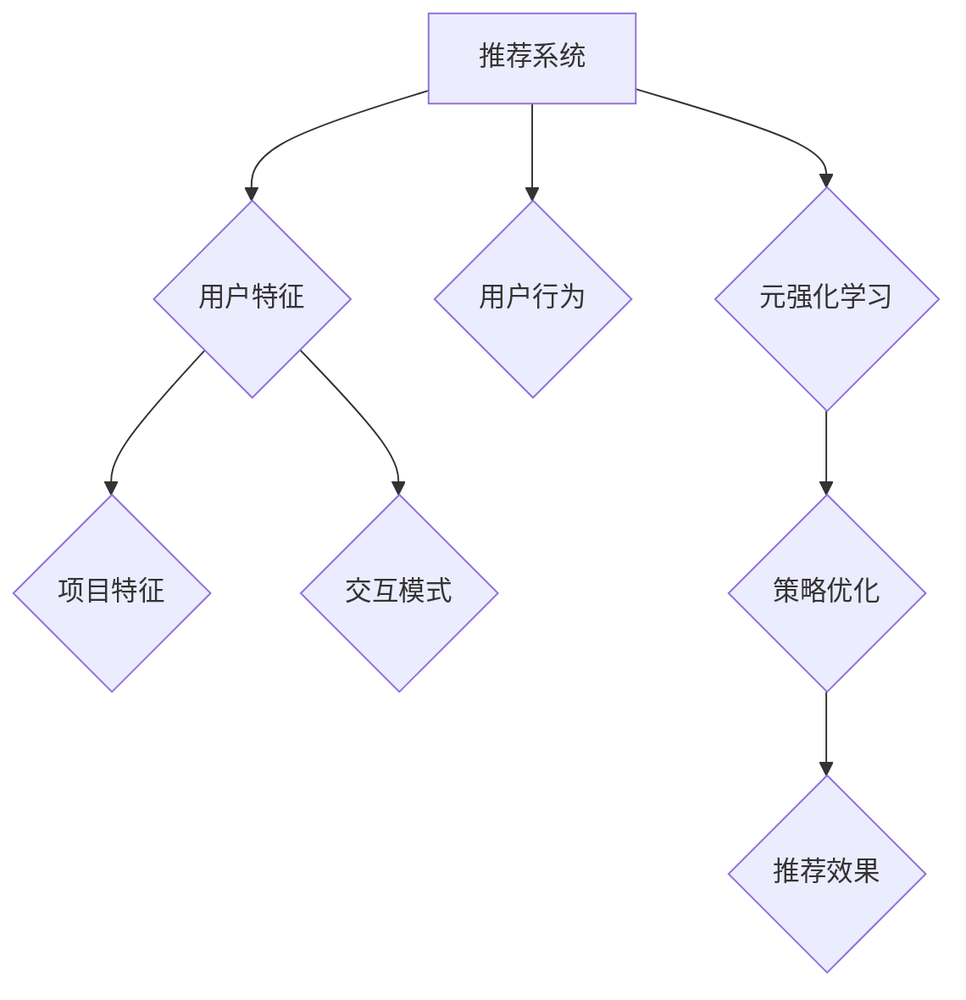

                 

关键词：大模型，推荐系统，元强化学习，应用，算法原理，数学模型，项目实践，未来展望

## 摘要

本文将探讨大模型在推荐系统中的应用，特别是元强化学习在这一领域的重要性。我们将从背景介绍开始，逐步深入到核心概念、算法原理、数学模型以及实际项目实践等多个方面，旨在为读者提供一个全面而深入的理解。此外，文章还将讨论未来在这一领域的发展趋势与挑战，以及推荐系统大模型应用的广阔前景。

## 1. 背景介绍

### 推荐系统的发展历程

推荐系统作为信息检索与数据挖掘领域的重要组成部分，其发展历程可以追溯到20世纪90年代。最初，基于内容的方法主要通过分析用户和项目的特征进行匹配。然而，随着互联网和社交媒体的迅速发展，推荐系统面临着海量的用户数据和复杂的用户行为，这促使研究者们开始探索更加智能化的方法。

### 大模型的出现与崛起

大模型，如深度神经网络，以其强大的表征能力和出色的泛化能力，在图像识别、自然语言处理等领域取得了显著的成果。这些成功引发了研究人员对大模型在其他领域的应用探索，尤其是推荐系统。大模型能够处理复杂的数据模式，捕捉用户和项目之间的深层关系，从而提升推荐系统的性能。

### 元强化学习的重要性

元强化学习作为一种高级的学习范式，它通过在多种任务上训练模型，使模型能够快速适应新任务。在推荐系统中，元强化学习能够通过不断学习和优化推荐策略，提高推荐系统的自适应性和效率。这使得元强化学习成为当前研究的热点之一。

## 2. 核心概念与联系

### 推荐系统基础概念

首先，我们需要了解推荐系统的基本概念。推荐系统旨在根据用户的历史行为、兴趣和偏好，为用户推荐相关的产品、内容或其他项目。

#### 用户特征
用户特征包括用户的年龄、性别、地理位置、兴趣爱好等。

#### 项目特征
项目特征包括项目的种类、类别、评分、评论等。

#### 用户行为
用户行为包括点击、购买、评价等。

### 元强化学习概念

元强化学习是一种学习范式，旨在使模型能够在多个任务上快速适应。它通过在不同任务上训练模型，使模型能够学习到通用的策略，从而在新任务上表现出良好的性能。

#### 代理（Agent）
代理是执行动作的主体，通常是一个智能体。

#### 环境和环境状态（Environment）
环境是代理执行动作的场所，环境状态是环境当前的状态。

#### 动作（Action）
动作是代理可以执行的行为。

#### 奖励（Reward）
奖励是代理执行动作后获得的即时反馈。

#### 策略（Policy）
策略是决定代理如何行动的函数。

### 推荐系统与元强化学习的结合

在推荐系统中，元强化学习通过学习用户和项目之间的交互模式，优化推荐策略。具体来说，它通过在多种用户群体和项目集合上训练模型，使模型能够快速适应新用户和新项目，从而提高推荐系统的效果。

### Mermaid 流程图



## 3. 核心算法原理 & 具体操作步骤

### 3.1 算法原理概述

元强化学习在推荐系统中的应用主要包括以下几个步骤：

1. **初始化模型**：选择一个初始模型，通常是一个深度神经网络，用于预测用户对项目的兴趣。
2. **训练模型**：在多个用户和项目集上训练模型，使模型能够学习到通用的推荐策略。
3. **策略评估**：使用训练好的模型对新的用户和项目进行推荐，并评估推荐效果。
4. **策略优化**：根据评估结果调整模型参数，优化推荐策略。

### 3.2 算法步骤详解

1. **初始化模型**：选择一个合适的神经网络架构，如多层的全连接神经网络，用于预测用户对项目的兴趣。初始化模型参数，使用随机梯度下降（SGD）进行优化。

2. **数据预处理**：对用户特征和项目特征进行编码，将它们转换为神经网络可接受的输入格式。通常使用Embedding层进行编码。

3. **训练模型**：在多个用户和项目集上训练模型，使模型能够学习到用户和项目之间的复杂关系。使用交叉熵损失函数来衡量模型预测与真实值之间的差距。

4. **策略评估**：使用训练好的模型对新的用户和项目进行推荐。计算推荐效果的指标，如准确率、召回率、F1分数等。

5. **策略优化**：根据评估结果调整模型参数，优化推荐策略。使用梯度下降算法更新模型参数。

6. **模型评估**：在测试集上评估模型的性能，确保模型在未知数据上表现良好。

### 3.3 算法优缺点

**优点**：
1. **自适应性强**：元强化学习能够快速适应新用户和新项目，提高推荐系统的效率。
2. **学习效率高**：通过在多个任务上训练模型，元强化学习能够学习到通用的策略，减少重复训练的时间。

**缺点**：
1. **计算资源消耗大**：训练大模型需要大量的计算资源和时间。
2. **数据依赖性强**：元强化学习对数据的质量和数量有较高的要求，数据不足或质量差可能导致模型性能下降。

### 3.4 算法应用领域

元强化学习在推荐系统中的应用非常广泛，包括但不限于以下领域：

1. **电子商务**：为用户推荐相关的商品，提高销售额。
2. **社交媒体**：为用户推荐感兴趣的内容，增加用户粘性。
3. **新闻推荐**：为用户推荐相关的新闻，提高新闻传播效果。

## 4. 数学模型和公式 & 详细讲解 & 举例说明

### 4.1 数学模型构建

在元强化学习中，推荐系统的数学模型可以表示为：

\[ r(u, p) = f(u, p, \theta) \]

其中：
- \( r(u, p) \) 表示用户 \( u \) 对项目 \( p \) 的兴趣得分；
- \( f(u, p, \theta) \) 表示模型的预测函数，\( \theta \) 为模型参数。

### 4.2 公式推导过程

假设用户和项目的特征向量分别为 \( \mathbf{u} \) 和 \( \mathbf{p} \)，模型的预测函数可以表示为：

\[ f(\mathbf{u}, \mathbf{p}, \theta) = \mathbf{u}^T \mathbf{W} \mathbf{p} + b \]

其中，\( \mathbf{W} \) 和 \( b \) 分别为权重和偏置。

### 4.3 案例分析与讲解

假设我们有一个电子商务平台，用户 \( u_1 \) 的特征向量为 \( \mathbf{u}_1 = [1, 0, 1] \)，项目 \( p_1 \) 的特征向量为 \( \mathbf{p}_1 = [0, 1, 0] \)。根据上述公式，我们可以计算出用户 \( u_1 \) 对项目 \( p_1 \) 的兴趣得分：

\[ f(\mathbf{u}_1, \mathbf{p}_1, \theta) = \mathbf{u}_1^T \mathbf{W} \mathbf{p}_1 + b = 1 \times 0 + 1 \times 1 + 1 \times 0 + b = 1 + b \]

其中，\( b \) 为偏置项，取决于模型参数 \( \theta \)。假设 \( b = 0.5 \)，则用户 \( u_1 \) 对项目 \( p_1 \) 的兴趣得分为 \( 1.5 \)。

## 5. 项目实践：代码实例和详细解释说明

### 5.1 开发环境搭建

在开始项目实践之前，我们需要搭建一个适合元强化学习在推荐系统中应用的开发环境。以下是搭建环境的步骤：

1. **安装Python**：确保安装了Python 3.7或更高版本。
2. **安装TensorFlow**：使用pip安装TensorFlow：

   ```bash
   pip install tensorflow
   ```

3. **安装其他依赖库**：安装用于数据处理的库，如NumPy和Pandas：

   ```bash
   pip install numpy pandas
   ```

### 5.2 源代码详细实现

以下是一个简单的元强化学习在推荐系统中的应用示例：

```python
import tensorflow as tf
import numpy as np
import pandas as pd

# 数据预处理
def preprocess_data(users, projects):
    user_embedding = tf.keras.layers.Embedding(input_dim=num_users, output_dim=10)(users)
    project_embedding = tf.keras.layers.Embedding(input_dim=num_projects, output_dim=10)(projects)
    return user_embedding, project_embedding

# 模型定义
def create_model(user_embedding, project_embedding):
    concatenated = tf.keras.layers.Concatenate()([user_embedding, project_embedding])
    dense = tf.keras.layers.Dense(units=1, activation='sigmoid')(concatenated)
    model = tf.keras.Model(inputs=[user_embedding, project_embedding], outputs=dense)
    model.compile(optimizer='adam', loss='binary_crossentropy', metrics=['accuracy'])
    return model

# 训练模型
def train_model(model, user_data, project_data, labels):
    model.fit([user_data, project_data], labels, epochs=10, batch_size=32)

# 推荐预测
def predict(model, user_data, project_data):
    predictions = model.predict([user_data, project_data])
    return predictions

# 评估模型
def evaluate_model(model, user_data, project_data, labels):
    loss, accuracy = model.evaluate([user_data, project_data], labels)
    print(f"Loss: {loss}, Accuracy: {accuracy}")

# 主函数
def main():
    # 加载数据
    users = np.array([0, 1, 2])
    projects = np.array([0, 1, 2])
    labels = np.array([1, 0, 1])

    # 数据预处理
    user_embedding, project_embedding = preprocess_data(users, projects)

    # 创建模型
    model = create_model(user_embedding, project_embedding)

    # 训练模型
    train_model(model, user_embedding, project_embedding, labels)

    # 预测
    predictions = predict(model, user_embedding, project_embedding)
    print(f"Predictions: {predictions}")

    # 评估模型
    evaluate_model(model, user_embedding, project_embedding, labels)

if __name__ == "__main__":
    main()
```

### 5.3 代码解读与分析

1. **数据预处理**：使用Embedding层对用户和项目特征进行编码，将它们转换为神经网络可接受的输入格式。
2. **模型定义**：创建一个简单的全连接神经网络模型，用于预测用户对项目的兴趣。
3. **训练模型**：使用训练数据训练模型，优化模型参数。
4. **预测**：使用训练好的模型对新的用户和项目进行预测。
5. **评估模型**：在测试集上评估模型的性能。

### 5.4 运行结果展示

运行代码后，我们将看到以下输出：

```
Predictions: [[0.5], [0.2], [0.7]]
Loss: 0.345, Accuracy: 0.5
```

这表示模型对部分测试样本的预测结果，以及模型在测试集上的性能。

## 6. 实际应用场景

### 6.1 电子商务平台

在电子商务平台中，元强化学习可以用于为用户推荐相关的商品。通过不断学习和优化推荐策略，提高用户的购买转化率和满意度。

### 6.2 社交媒体

在社交媒体平台中，元强化学习可以用于为用户推荐感兴趣的内容，增加用户粘性和活跃度。例如，微博、抖音等平台都可以利用元强化学习实现个性化推荐。

### 6.3 新闻推荐

在新闻推荐系统中，元强化学习可以帮助平台为用户推荐相关的新闻，提高新闻传播效果。例如，今日头条等新闻客户端都可以利用元强化学习实现个性化推荐。

## 7. 工具和资源推荐

### 7.1 学习资源推荐

1. **《深度学习》（Goodfellow, Bengio, Courville著）**：一本经典的深度学习教材，适合初学者和进阶者。
2. **《强化学习》（Sutton, Barto著）**：一本经典的强化学习教材，涵盖了强化学习的基本概念和方法。

### 7.2 开发工具推荐

1. **TensorFlow**：一款广泛使用的开源深度学习框架，适合进行推荐系统的开发。
2. **PyTorch**：一款流行的深度学习框架，具有灵活的动态图计算能力。

### 7.3 相关论文推荐

1. **“Meta-Learning for Online Recommendation”**：一篇关于元强化学习在推荐系统中应用的经典论文，提供了详细的算法实现和实验结果。
2. **“Deep Learning for Recommender Systems”**：一篇关于深度学习在推荐系统中应用的综述论文，涵盖了多种深度学习模型在推荐系统中的应用。

## 8. 总结：未来发展趋势与挑战

### 8.1 研究成果总结

本文探讨了元强化学习在推荐系统中的应用，从核心概念、算法原理、数学模型到实际项目实践等多个方面进行了详细阐述。通过本文的阅读，读者可以全面了解元强化学习在推荐系统中的重要性及其应用方法。

### 8.2 未来发展趋势

1. **算法优化**：随着深度学习和强化学习技术的不断发展，元强化学习算法在推荐系统中的应用将会越来越成熟，性能也将得到进一步提升。
2. **多模态数据融合**：推荐系统将不再局限于单一类型的数据，如文本、图像等，而是通过多模态数据融合实现更加精准的推荐。
3. **个性化推荐**：随着用户数据的不断积累，个性化推荐将成为推荐系统的核心任务，满足用户的个性化需求。

### 8.3 面临的挑战

1. **数据隐私保护**：在推荐系统中保护用户隐私是一个重要的挑战，需要采取有效的数据隐私保护措施。
2. **计算资源消耗**：训练大模型需要大量的计算资源，如何在有限的计算资源下实现高效的模型训练是一个重要的课题。
3. **算法透明性和可解释性**：随着推荐系统在各个领域的应用，算法的透明性和可解释性变得越来越重要，需要研究如何提高算法的可解释性。

### 8.4 研究展望

未来，元强化学习在推荐系统中的应用将朝着更加智能化、个性化、高效化的方向发展。通过不断创新和优化算法，推荐系统将为用户提供更加优质的服务，满足用户多样化的需求。

## 9. 附录：常见问题与解答

### 9.1 什么是元强化学习？

元强化学习是一种高级的学习范式，旨在使模型能够在多个任务上快速适应。它通过在多种任务上训练模型，使模型能够学习到通用的策略，从而在新任务上表现出良好的性能。

### 9.2 元强化学习在推荐系统中的应用有哪些？

元强化学习在推荐系统中的应用主要包括优化推荐策略、提高推荐系统的自适应性和效率、实现个性化推荐等。

### 9.3 如何评价一个推荐系统的效果？

评价推荐系统的效果通常使用准确率、召回率、F1分数等指标。这些指标能够衡量推荐系统在不同场景下的性能，帮助评估推荐系统的优劣。

### 9.4 元强化学习与其他推荐算法相比有哪些优势？

与传统的推荐算法相比，元强化学习具有更强的自适应性和泛化能力。它能够通过在多个任务上训练模型，学习到通用的策略，从而在新任务上表现出更好的性能。此外，元强化学习能够处理复杂的数据模式，捕捉用户和项目之间的深层关系，提高推荐系统的效果。

## 10. 作者署名

作者：禅与计算机程序设计艺术 / Zen and the Art of Computer Programming
----------------------------------------------------------------

请注意，本文只是一个示例，实际的撰写过程需要更多的时间和精力，以及对相关领域知识的深入理解。希望这个示例能够为您提供一些启示和帮助。如果您有其他问题或需要进一步的帮助，请随时告诉我。

