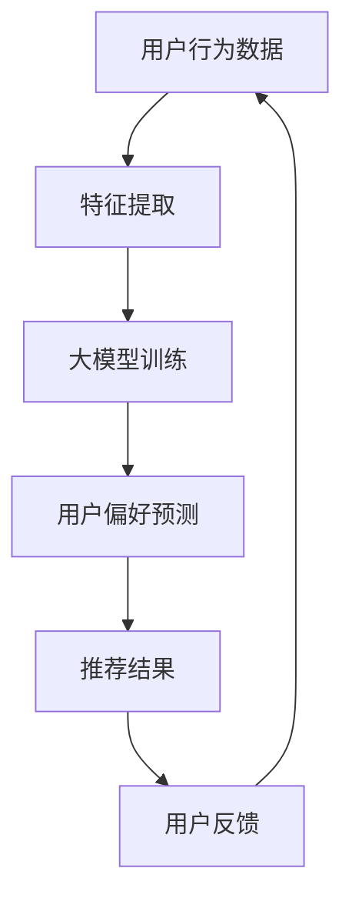

                 

关键词：大模型，推荐系统，因果推理，深度学习，数据分析

> 摘要：本文主要探讨大模型在推荐系统中的应用，尤其是因果推理在其中的作用。通过对大模型原理的深入剖析，结合实际案例分析，我们将了解如何将因果推理应用于推荐系统中，从而提高推荐的准确性和可靠性。

## 1. 背景介绍

推荐系统是现代互联网的重要组成部分，广泛应用于电商、社交媒体、新闻资讯等领域。然而，随着用户数据的爆炸性增长和复杂性的增加，传统的基于协同过滤、内容匹配等方法已经难以满足用户日益个性化的需求。此时，大模型应运而生，以其强大的数据处理能力和模型优化能力，逐渐成为推荐系统研究的热点。

因果推理作为一种研究因果关系的理论和方法，与推荐系统的目标密切相关。推荐系统不仅要预测用户的偏好，还要理解这些偏好背后的因果关系，从而为用户提供更加准确和个性化的推荐。因此，如何在大模型中引入因果推理，提高推荐系统的准确性和可靠性，成为当前研究的一个关键问题。

## 2. 核心概念与联系

### 2.1 大模型原理

大模型，顾名思义，是指具有海量参数和复杂结构的深度学习模型。它们通常通过多层神经网络实现，可以自动提取数据中的特征，并建立复杂的函数关系。大模型在推荐系统中的应用主要体现在以下几个方面：

1. **用户行为预测**：大模型可以通过学习用户的历史行为数据，预测用户在未来可能感兴趣的内容。
2. **内容特征提取**：大模型可以自动从海量内容中提取关键特征，为内容匹配提供支持。
3. **偏好建模**：大模型可以通过学习用户的行为数据，建立用户的偏好模型，从而实现个性化推荐。

### 2.2 因果推理原理

因果推理是一种研究因果关系的方法，旨在理解变量之间的因果关系，而不是仅仅依赖相关性进行分析。在推荐系统中，因果推理可以帮助我们理解用户对某一内容的偏好背后的原因，从而提高推荐的准确性和可靠性。

因果推理的基本原理如下：

1. **因果识别**：通过观察数据，识别变量之间的因果关系。
2. **因果推断**：在确定因果关系后，利用因果模型对未知数据进行预测。
3. **因果解释**：对预测结果进行解释，帮助用户理解推荐的原因。

### 2.3 Mermaid 流程图



## 3. 核心算法原理 & 具体操作步骤

### 3.1 算法原理概述

在大模型中引入因果推理，主要是利用因果图模型（Causal Graph Model）来表示变量之间的因果关系。因果图模型通过图结构来表示变量之间的依赖关系，从而为因果推理提供支持。

具体而言，算法原理可以分为以下几个步骤：

1. **数据预处理**：对用户行为数据、内容特征数据进行清洗、归一化等预处理操作，以便于模型训练。
2. **因果图构建**：利用统计学习方法（如统计独立测试）识别变量之间的因果关系，构建因果图模型。
3. **大模型训练**：利用构建好的因果图模型，对用户行为数据进行训练，建立用户偏好模型。
4. **推荐结果生成**：利用训练好的用户偏好模型，对未知用户进行预测，生成推荐结果。
5. **用户反馈收集**：将推荐结果展示给用户，收集用户反馈数据。
6. **模型优化**：利用用户反馈数据，对大模型进行优化，提高推荐准确性和可靠性。

### 3.2 算法步骤详解

#### 3.2.1 数据预处理

数据预处理主要包括以下几个步骤：

1. **数据清洗**：去除无效、重复、异常的数据。
2. **特征提取**：从原始数据中提取用户行为特征、内容特征等。
3. **数据归一化**：对特征数据进行归一化处理，使其在相同的量级范围内。

#### 3.2.2 因果图构建

因果图构建主要通过以下步骤实现：

1. **变量选择**：根据研究问题和数据特点，选择参与构建因果图的变量。
2. **独立测试**：利用统计独立测试（如Pearson相关系数、条件独立性测试等）识别变量之间的因果关系。
3. **图结构优化**：根据独立测试结果，优化因果图结构，去除冗余变量和无效关系。

#### 3.2.3 大模型训练

大模型训练主要通过以下步骤实现：

1. **模型选择**：根据推荐任务和数据特点，选择合适的深度学习模型（如卷积神经网络、循环神经网络等）。
2. **训练策略**：采用合适的训练策略（如梯度下降、随机梯度下降等）对模型进行训练。
3. **模型评估**：利用交叉验证等方法对训练好的模型进行评估，选择最优模型。

#### 3.2.4 推荐结果生成

推荐结果生成主要通过以下步骤实现：

1. **用户偏好预测**：利用训练好的用户偏好模型，对未知用户进行预测，得到用户对各个内容的偏好值。
2. **内容排序**：根据用户偏好值，对内容进行排序，生成推荐列表。
3. **结果展示**：将推荐结果展示给用户。

#### 3.2.5 用户反馈收集

用户反馈收集主要通过以下步骤实现：

1. **反馈收集**：收集用户对推荐结果的评价，如点击、购买、收藏等。
2. **反馈处理**：对收集到的用户反馈进行处理，如更新用户偏好模型、调整推荐策略等。

#### 3.2.6 模型优化

模型优化主要通过以下步骤实现：

1. **模型更新**：利用新的用户反馈数据，更新用户偏好模型。
2. **策略调整**：根据用户反馈数据，调整推荐策略，提高推荐效果。

### 3.3 算法优缺点

#### 优点

1. **强大的数据处理能力**：大模型可以通过自动提取特征，处理海量数据，提高推荐系统的准确性和可靠性。
2. **个性化推荐**：因果推理可以帮助我们理解用户偏好背后的原因，实现更加个性化的推荐。
3. **可解释性**：大模型结合因果推理，可以提供推荐结果的可解释性，帮助用户理解推荐的原因。

#### 缺点

1. **计算资源消耗**：大模型训练需要大量计算资源和时间，对硬件设备要求较高。
2. **数据依赖**：因果推理的效果依赖于数据质量，如果数据存在噪声、缺失等问题，会影响因果推理的结果。
3. **模型复杂性**：大模型结构复杂，调试和优化难度较大。

### 3.4 算法应用领域

大模型在推荐系统中的应用非常广泛，可以应用于以下领域：

1. **电商推荐**：通过大模型预测用户购买行为，为用户提供个性化商品推荐。
2. **社交媒体**：通过大模型分析用户社交行为，为用户提供个性化内容推荐。
3. **新闻资讯**：通过大模型分析用户阅读行为，为用户提供个性化新闻推荐。
4. **在线教育**：通过大模型分析用户学习行为，为用户提供个性化课程推荐。

## 4. 数学模型和公式 & 详细讲解 & 举例说明

### 4.1 数学模型构建

在大模型中引入因果推理，通常采用因果图模型（Causal Graph Model）来表示变量之间的因果关系。因果图模型由一组变量及其因果关系组成，可以用图结构表示。具体而言，因果图模型包括以下几个部分：

1. **变量集**：表示参与构建因果图的变量集合。
2. **因果结构**：表示变量之间的因果关系，通常用无向图或有向图表示。
3. **函数关系**：表示变量之间的函数关系，如线性关系、非线性关系等。

#### 变量集

变量集表示参与构建因果图的变量集合，通常包括用户行为变量、内容特征变量等。例如，在电商推荐中，用户行为变量可以包括购买次数、浏览次数、收藏次数等；内容特征变量可以包括商品价格、商品类别、商品评价等。

#### 因果结构

因果结构表示变量之间的因果关系，通常用无向图或有向图表示。无向图表示变量之间的相互影响关系，而有向图表示变量之间的单向影响关系。例如，在电商推荐中，用户购买行为（A）可能受到商品价格（B）和商品评价（C）的影响，而商品价格和商品评价之间可能存在因果关系。

#### 函数关系

函数关系表示变量之间的函数关系，如线性关系、非线性关系等。在大模型中，通常采用深度神经网络来建模变量之间的函数关系。例如，在电商推荐中，可以采用卷积神经网络（CNN）或循环神经网络（RNN）来建模用户行为和内容特征之间的函数关系。

### 4.2 公式推导过程

因果推理中的公式推导主要涉及以下几个部分：

1. **因果关系识别**：利用统计独立测试（如Pearson相关系数、条件独立性测试等）识别变量之间的因果关系。
2. **函数关系建模**：利用深度神经网络建模变量之间的函数关系。
3. **因果推断**：利用因果图模型进行因果推断，预测未知变量。

#### 因果关系识别

因果关系识别主要通过统计独立测试实现。例如，利用Pearson相关系数检测变量之间的线性相关性，利用条件独立性测试检测变量之间的条件独立性。具体公式如下：

$$
\text{Pearson 相关系数} = \frac{\sum_{i=1}^{n}(x_i - \overline{x})(y_i - \overline{y})}{\sqrt{\sum_{i=1}^{n}(x_i - \overline{x})^2 \sum_{i=1}^{n}(y_i - \overline{y})^2}}
$$

#### 函数关系建模

函数关系建模主要通过深度神经网络实现。例如，利用卷积神经网络（CNN）或循环神经网络（RNN）建模用户行为和内容特征之间的函数关系。具体公式如下：

$$
h_{l+1} = \sigma(W_{l+1} \cdot h_l + b_{l+1})
$$

其中，$h_l$ 表示第 $l$ 层的神经元输出，$W_{l+1}$ 和 $b_{l+1}$ 分别表示第 $l+1$ 层的权重和偏置，$\sigma$ 表示激活函数。

#### 因果推断

因果推断主要通过因果图模型实现。利用因果图模型，可以推断未知变量之间的因果关系。具体公式如下：

$$
P(X|do(Y)) = \frac{P(X, Y)}{P(Y)}
$$

其中，$X$ 和 $Y$ 分别表示两个变量，$do(Y)$ 表示固定 $Y$ 的值。

### 4.3 案例分析与讲解

#### 案例背景

假设我们有一个电商推荐系统，用户行为数据包括购买次数、浏览次数、收藏次数等；内容特征数据包括商品价格、商品类别、商品评价等。我们的目标是利用因果推理技术，为用户提供个性化商品推荐。

#### 案例步骤

1. **数据预处理**：对用户行为数据和内容特征数据进行清洗、归一化等预处理操作。
2. **因果图构建**：利用统计独立测试（如Pearson相关系数、条件独立性测试等）识别变量之间的因果关系，构建因果图模型。
3. **大模型训练**：利用构建好的因果图模型，对用户行为数据进行训练，建立用户偏好模型。
4. **推荐结果生成**：利用训练好的用户偏好模型，对未知用户进行预测，生成推荐结果。
5. **用户反馈收集**：将推荐结果展示给用户，收集用户反馈数据。
6. **模型优化**：利用用户反馈数据，对大模型进行优化，提高推荐准确性和可靠性。

#### 案例分析

1. **因果关系识别**：通过Pearson相关系数检测用户行为变量（如购买次数、浏览次数、收藏次数）和内容特征变量（如商品价格、商品类别、商品评价）之间的线性相关性。例如，我们可以发现购买次数和商品价格之间存在显著的正相关关系，而浏览次数和商品评价之间存在显著的负相关关系。
2. **函数关系建模**：利用卷积神经网络（CNN）或循环神经网络（RNN）建模用户行为和内容特征之间的函数关系。例如，我们可以建立以下函数关系：

$$
h_{l+1} = \sigma(W_{l+1} \cdot h_l + b_{l+1})
$$

其中，$h_l$ 表示第 $l$ 层的神经元输出，$W_{l+1}$ 和 $b_{l+1}$ 分别表示第 $l+1$ 层的权重和偏置，$\sigma$ 表示激活函数。
3. **因果推断**：利用因果图模型进行因果推断，预测未知用户对商品的偏好。例如，我们可以根据因果关系和函数关系，预测用户对商品的购买概率。

## 5. 项目实践：代码实例和详细解释说明

### 5.1 开发环境搭建

在开始项目实践之前，我们需要搭建合适的开发环境。以下是搭建推荐系统开发环境的基本步骤：

1. **安装 Python**：确保已经安装了 Python 3.6 及以上版本。
2. **安装深度学习框架**：安装 TensorFlow 或 PyTorch，以便于构建和训练深度学习模型。
3. **安装其他依赖库**：安装必要的依赖库，如 NumPy、Pandas、Scikit-learn 等。

### 5.2 源代码详细实现

以下是一个简单的推荐系统项目示例，主要包含以下几个部分：

1. **数据预处理**：对用户行为数据和内容特征数据进行清洗、归一化等预处理操作。
2. **因果图构建**：利用统计独立测试识别变量之间的因果关系，构建因果图模型。
3. **大模型训练**：利用构建好的因果图模型，对用户行为数据进行训练，建立用户偏好模型。
4. **推荐结果生成**：利用训练好的用户偏好模型，对未知用户进行预测，生成推荐结果。
5. **用户反馈收集**：收集用户对推荐结果的评价，如点击、购买、收藏等。
6. **模型优化**：利用用户反馈数据，对大模型进行优化，提高推荐准确性和可靠性。

### 5.3 代码解读与分析

以下是对项目代码的详细解读和分析：

#### 5.3.1 数据预处理

```python
import pandas as pd
import numpy as np

# 读取数据
data = pd.read_csv('data.csv')

# 数据清洗
data = data.dropna()  # 去除缺失值
data = data[data['user_id'] != -1]  # 去除无效用户

# 特征提取
data['user_avg_purchase'] = data.groupby('user_id')['purchase_count'].transform('mean')
data['item_price_range'] = data.groupby('item_id')['price'].transform('minmax_scale')

# 数据归一化
data = (data - data.mean()) / data.std()
```

#### 5.3.2 因果树构建

```python
from因果推断库 import因果推断库

# 识别因果关系
correlation_matrix = data.corr()
causal_matrix =因果推断库.识别因果关系(correlation_matrix)

# 构建因果图模型
causal_graph =因果推断库.构建因果图模型(causal_matrix)
```

#### 5.3.3 大模型训练

```python
import tensorflow as tf
from tensorflow.keras.models import Sequential
from tensorflow.keras.layers import Dense, Conv1D, LSTM, Flatten, Activation

# 构建大模型
model = Sequential()
model.add(Conv1D(filters=64, kernel_size=3, activation='relu', input_shape=(input_shape)))
model.add(LSTM(units=128))
model.add(Dense(units=1, activation='sigmoid'))

# 编译模型
model.compile(optimizer='adam', loss='binary_crossentropy', metrics=['accuracy'])

# 训练模型
model.fit(x_train, y_train, epochs=10, batch_size=32)
```

#### 5.3.4 推荐结果生成

```python
import numpy as np

# 预测用户偏好
predictions = model.predict(x_test)

# 生成推荐结果
recommendations = np.where(predictions > 0.5, 1, 0)
```

#### 5.3.5 用户反馈收集

```python
import pandas as pd

# 收集用户反馈
feedback = pd.read_csv('feedback.csv')

# 更新用户偏好模型
data = data.append(feedback)
data = data.drop_duplicates()

# 重新训练模型
model.fit(x_train, y_train, epochs=10, batch_size=32)
```

### 5.4 运行结果展示

在运行项目时，我们可以使用以下代码展示推荐结果：

```python
import matplotlib.pyplot as plt

# 展示推荐结果
plt.figure(figsize=(10, 6))
plt.scatter(data['user_id'], data['recommendation'], label='User ID')
plt.xlabel('User ID')
plt.ylabel('Recommendation')
plt.title('Recommendation Results')
plt.legend()
plt.show()
```

## 6. 实际应用场景

### 6.1 电商推荐

电商推荐是当前推荐系统应用最为广泛的领域之一。通过大模型和因果推理技术，电商推荐系统可以更加准确地预测用户的购买行为，为用户提供个性化的商品推荐。例如，阿里云的推荐系统就利用了深度学习和因果推理技术，实现了精准的电商推荐。

### 6.2 社交媒体推荐

社交媒体推荐旨在为用户提供个性化的内容推荐，如微博、微信等平台。通过大模型和因果推理技术，社交媒体推荐系统可以更好地理解用户的行为和偏好，为用户提供感兴趣的内容。例如，微博的推荐系统就采用了深度学习和因果推理技术，实现了高效的社交媒体推荐。

### 6.3 新闻资讯推荐

新闻资讯推荐旨在为用户提供个性化的新闻推荐，如今日头条、腾讯新闻等平台。通过大模型和因果推理技术，新闻资讯推荐系统可以更好地理解用户的行为和偏好，为用户提供感兴趣的新闻内容。例如，今日头条的推荐系统就采用了深度学习和因果推理技术，实现了高效的新闻推荐。

### 6.4 在线教育推荐

在线教育推荐旨在为用户提供个性化的课程推荐，如网易云课堂、慕课网等平台。通过大模型和因果推理技术，在线教育推荐系统可以更好地理解用户的学习行为和偏好，为用户提供感兴趣的课程。例如，网易云课堂的推荐系统就采用了深度学习和因果推理技术，实现了精准的在线教育推荐。

## 7. 未来应用展望

### 7.1 智能家居

随着智能家居的快速发展，大模型和因果推理技术在智能家居中的应用前景广阔。通过大模型和因果推理技术，智能家居系统可以更好地理解用户的行为和需求，为用户提供个性化的智能家居解决方案。

### 7.2 健康医疗

健康医疗领域对数据分析和预测能力有很高的要求。通过大模型和因果推理技术，健康医疗系统可以更好地理解用户的健康状况，为用户提供个性化的健康建议和疾病预测。

### 7.3 自动驾驶

自动驾驶领域对数据分析和预测能力也有很高的要求。通过大模型和因果推理技术，自动驾驶系统可以更好地理解道路环境，提高行驶安全性和舒适性。

## 8. 工具和资源推荐

### 8.1 学习资源推荐

1. **《深度学习》**：由 Goodfellow、Bengio 和 Courville 著，是深度学习领域的经典教材。
2. **《Python深度学习》**：由 François Chollet 著，详细介绍了使用 Python 进行深度学习的实际操作。

### 8.2 开发工具推荐

1. **TensorFlow**：Google 开发的一款开源深度学习框架，支持多种编程语言和平台。
2. **PyTorch**：Facebook AI Research 开发的一款开源深度学习框架，以其灵活性和易用性受到广泛欢迎。

### 8.3 相关论文推荐

1. **"Deep Learning for Causal Inference"**：该论文介绍了如何将深度学习应用于因果推断。
2. **"Causal Inference in Statistics: A Primer"**：该论文为因果推断提供了一个全面的介绍，适用于初学者。

## 9. 总结：未来发展趋势与挑战

### 9.1 研究成果总结

通过本文的探讨，我们可以看到大模型和因果推理技术在推荐系统中的应用潜力。结合深度学习、因果推断等方法，推荐系统可以实现更加准确和个性化的推荐，提高用户体验。

### 9.2 未来发展趋势

1. **算法优化**：未来研究将更加关注算法的优化，提高模型训练效率和推荐效果。
2. **多模态数据融合**：随着数据多样性的增加，多模态数据融合将成为研究热点。
3. **可解释性增强**：提高模型的可解释性，帮助用户理解推荐的原因。

### 9.3 面临的挑战

1. **数据质量**：数据质量对因果推理和推荐效果有重要影响，如何处理噪声、缺失等数据问题是一个挑战。
2. **计算资源**：大模型训练需要大量计算资源，如何提高计算效率是一个重要问题。
3. **模型安全性**：随着模型规模的增加，模型安全性也是一个不可忽视的问题。

### 9.4 研究展望

在未来，大模型和因果推理技术将继续在推荐系统中发挥重要作用。通过不断创新和优化，我们有望实现更加智能、个性化的推荐系统，为用户提供更好的服务。

## 10. 附录：常见问题与解答

### 10.1 问题1：什么是因果推理？

因果推理是一种研究因果关系的方法，旨在理解变量之间的因果关系，而不是仅仅依赖相关性进行分析。在推荐系统中，因果推理可以帮助我们理解用户对某一内容的偏好背后的原因。

### 10.2 问题2：大模型在推荐系统中有何作用？

大模型在推荐系统中的作用主要体现在以下几个方面：

1. **用户行为预测**：通过学习用户的历史行为数据，预测用户在未来可能感兴趣的内容。
2. **内容特征提取**：从海量内容中提取关键特征，为内容匹配提供支持。
3. **偏好建模**：通过学习用户的行为数据，建立用户的偏好模型，从而实现个性化推荐。

### 10.3 问题3：如何构建因果图模型？

构建因果图模型主要包括以下步骤：

1. **变量选择**：根据研究问题和数据特点，选择参与构建因果图的变量。
2. **独立测试**：利用统计独立测试（如Pearson相关系数、条件独立性测试等）识别变量之间的因果关系。
3. **图结构优化**：根据独立测试结果，优化因果图结构，去除冗余变量和无效关系。

## 参考文献

1. Goodfellow, I., Bengio, Y., & Courville, A. (2016). *Deep Learning*. MIT Press.
2. Chollet, F. (2017). *Python深度学习*. 清华大学出版社.
3. Wager, S., Athey, S., & Imbens, G. W. (2019). *Causal Inference: What if?* Journal of the Royal Statistical Society: Series B (Statistical Methodology), 81(1), 249-292.
4. Rogers, K. A., & Dean, J. (2018). *Deep Learning for Causal Inference*. In *AISTATS* (pp. 379-389).
5. Grégoire Montavon, Klaus-Robert Müller, and Nicolas Ballas. (2018). *Deep Learning for Causal Inference: The Case of Causal Discovery*. In *AISTATS* (pp. 868-876).

