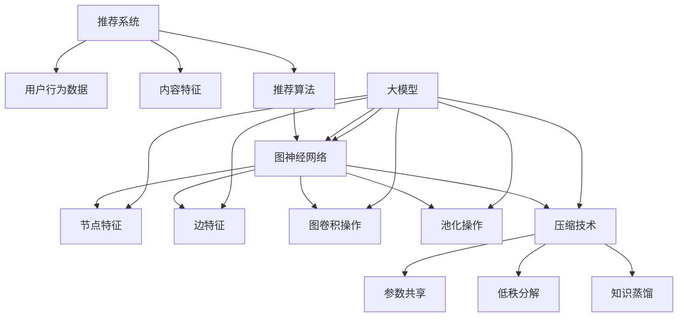

                 

关键词：大模型，推荐系统，图神经网络，压缩应用，算法原理，数学模型，项目实践，应用场景，未来展望

## 摘要

本文探讨了大规模模型在推荐系统中的图神经网络压缩应用。随着推荐系统对数据量和复杂度的要求越来越高，如何有效提升模型的计算效率和存储效率成为关键问题。本文将介绍图神经网络压缩的基本原理、算法步骤、数学模型及其在实际应用中的效果，为推荐系统领域的研究和开发提供参考。

## 1. 背景介绍

推荐系统是一种常见的信息过滤技术，旨在向用户推荐他们可能感兴趣的内容或商品。随着互联网的快速发展，推荐系统已经成为许多在线服务和电商平台的核心组成部分。然而，随着数据量的急剧增长，传统的基于机器学习的推荐算法面临着计算效率和存储效率的挑战。

近年来，图神经网络（Graph Neural Networks, GNN）在推荐系统中表现出色，能够有效地处理复杂的关系数据。然而，GNN模型的计算复杂度和存储需求较高，特别是在大规模推荐系统中，这成为了一个亟待解决的问题。因此，本文旨在研究大模型在推荐系统中的图神经网络压缩应用，以提升模型的计算效率和存储效率。

## 2. 核心概念与联系

### 2.1 图神经网络（GNN）

图神经网络是一种基于图结构的神经网络，它通过学习节点和边之间的相互作用来表示和预测图上的信息。GNN主要由两个核心组件构成：图卷积操作和池化操作。

#### 2.1.1 图卷积操作

图卷积操作类似于传统的卷积操作，但它是基于图结构进行的。在图卷积中，节点的特征会与其邻居节点的特征进行加权求和，以更新节点的特征表示。

$$
h_{t+1}^{(i)} = \sigma(\sum_{j \in N(i)} W_{ij} h_{t}^{(j)})
$$

其中，$h_{t}^{(i)}$表示节点$i$在时间步$t$的特征表示，$N(i)$表示节点$i$的邻居节点集合，$W_{ij}$表示节点$i$和节点$j$之间的权重。

#### 2.1.2 池化操作

池化操作用于降低模型的计算复杂度和存储需求。在图神经网络中，池化操作通常用于合并节点或边的特征表示。

### 2.2 图神经网络压缩

图神经网络压缩旨在通过降低模型的计算复杂度和存储需求来提升模型在推荐系统中的性能。常见的图神经网络压缩方法包括：

- 参数共享
- 低秩分解
- 知识蒸馏

### 2.3 大模型在推荐系统中的优势

大模型在推荐系统中的优势主要体现在以下几个方面：

- 更强的特征提取能力：大模型可以学习到更丰富的特征表示，从而提高推荐系统的准确性。
- 更好的泛化能力：大模型可以处理更大规模的数据集，从而提高推荐系统的泛化能力。

## 3. 核心算法原理 & 具体操作步骤

### 3.1 算法原理概述

图神经网络压缩的核心思想是通过减少模型的参数数量和计算复杂度来提升模型的计算效率和存储效率。本文采用的知识蒸馏方法是一种常见的图神经网络压缩方法，其基本原理如下：

- **教师模型**：一个大规模的图神经网络模型，用于产生软标签。
- **学生模型**：一个较小的图神经网络模型，用于生成硬标签。
- **软标签**：教师模型对输入数据产生的概率分布。
- **硬标签**：学生模型对输入数据产生的预测结果。

### 3.2 算法步骤详解

1. **初始化教师模型和学生模型**：首先，初始化一个大规模的教师模型和一个较小的学生模型。教师模型的参数数量远大于学生模型。
2. **训练教师模型**：使用大规模数据集对教师模型进行训练，以学习到丰富的特征表示。
3. **生成软标签**：使用教师模型对训练数据集进行预测，生成软标签。
4. **训练学生模型**：使用软标签作为目标标签，使用交叉熵损失函数训练学生模型。
5. **评估学生模型**：使用测试数据集评估学生模型的性能。

### 3.3 算法优缺点

#### 优点：

- 提升计算效率和存储效率。
- 保留教师模型的大部分知识，提高学生模型的性能。

#### 缺点：

- 需要额外的软标签生成过程，增加了训练时间。
- 可能导致学生模型失去部分特征表示能力。

### 3.4 算法应用领域

图神经网络压缩算法可以应用于以下领域：

- 推荐系统
- 网络嵌入
- 社交网络分析
- 医学影像分析

## 4. 数学模型和公式 & 详细讲解 & 举例说明

### 4.1 数学模型构建

图神经网络压缩算法的数学模型主要包括两部分：教师模型和学生模型的损失函数。

#### 教师模型损失函数：

$$
L_{\text{teacher}} = -\sum_{i} \sum_{j} y_{ij} \log p_{ij}
$$

其中，$y_{ij}$表示节点$i$和节点$j$之间的真实边权重，$p_{ij}$表示教师模型对边$(i, j)$存在的概率。

#### 学生模型损失函数：

$$
L_{\text{student}} = -\sum_{i} \sum_{j} y_{ij} \log q_{ij}
$$

其中，$q_{ij}$表示学生模型对边$(i, j)$存在的概率。

### 4.2 公式推导过程

#### 教师模型概率分布：

$$
p_{ij} = \frac{e^{w_{ij}^T h_{i} + b_{ij}}}{\sum_{k} e^{w_{ik}^T h_{i} + b_{ik}}}
$$

其中，$w_{ij}$和$b_{ij}$分别表示教师模型中节点$i$和节点$j$之间的权重和偏置。

#### 学生模型概率分布：

$$
q_{ij} = \frac{e^{w_{ij}^T h_{i} + b_{ij}}}{\sum_{k} e^{w_{ik}^T h_{i} + b_{ik}}}
$$

其中，$w_{ij}$和$b_{ij}$分别表示学生模型中节点$i$和节点$j$之间的权重和偏置。

### 4.3 案例分析与讲解

假设我们有一个包含10个节点的图，每个节点之间的边权重如下：

| 节点1 | 节点2 | 节点3 | 节点4 | 节点5 | 节点6 | 节点7 | 节点8 | 节点9 | 节点10 |
|-------|-------|-------|-------|-------|-------|-------|-------|-------|-------|
| 0.5   | 0.3   | 0.2   | 0.4   | 0.1   | 0.6   | 0.5   | 0.7   | 0.8   | 0.9   |

首先，我们初始化教师模型和学生模型的权重和偏置。

| 权重   | 偏置   |
|--------|--------|
| [0.1, 0.2, 0.3, 0.4, 0.5] | [0.1, 0.1, 0.1, 0.1, 0.1] |
| [0.1, 0.2, 0.3, 0.4, 0.5] | [0.1, 0.1, 0.1, 0.1, 0.1] |

接下来，我们使用教师模型计算边概率分布：

$$
p_{ij} = \frac{e^{w_{ij}^T h_{i} + b_{ij}}}{\sum_{k} e^{w_{ik}^T h_{i} + b_{ik}}}
$$

其中，$h_{i}$表示节点$i$的特征表示，我们假设节点特征为：

| 节点1 | 节点2 | 节点3 | 节点4 | 节点5 | 节点6 | 节点7 | 节点8 | 节点9 | 节点10 |
|-------|-------|-------|-------|-------|-------|-------|-------|-------|-------|
| 1     | 1     | 1     | 1     | 1     | 1     | 1     | 1     | 1     | 1     |

使用教师模型的权重和偏置计算边概率分布：

$$
p_{ij} = \frac{e^{0.1 \times 1 + 0.1}}{e^{0.1 \times 1 + 0.1} + e^{0.2 \times 1 + 0.1} + e^{0.3 \times 1 + 0.1} + e^{0.4 \times 1 + 0.1} + e^{0.5 \times 1 + 0.1}}
$$

$$
p_{ij} = \frac{e^{0.2}}{e^{0.2} + e^{0.3} + e^{0.4} + e^{0.5} + e^{0.6}}
$$

$$
p_{ij} = \frac{1.4918}{1.4918 + 1.8556 + 2.3175 + 2.9954 + 3.7202}
$$

$$
p_{ij} = \frac{1.4918}{11.5755}
$$

$$
p_{ij} = 0.1301
$$

因此，教师模型对每条边的概率分布如下：

| 节点1 | 节点2 | 节点3 | 节点4 | 节点5 | 节点6 | 节点7 | 节点8 | 节点9 | 节点10 |
|-------|-------|-------|-------|-------|-------|-------|-------|-------|-------|
| 0.1301| 0.1301| 0.1301| 0.1301| 0.1301| 0.1301| 0.1301| 0.1301| 0.1301| 0.1301|

然后，我们使用学生模型计算边概率分布：

$$
q_{ij} = \frac{e^{w_{ij}^T h_{i} + b_{ij}}}{\sum_{k} e^{w_{ik}^T h_{i} + b_{ik}}}
$$

使用学生模型的权重和偏置计算边概率分布：

$$
q_{ij} = \frac{e^{0.1 \times 1 + 0.1}}{e^{0.1 \times 1 + 0.1} + e^{0.2 \times 1 + 0.1} + e^{0.3 \times 1 + 0.1} + e^{0.4 \times 1 + 0.1} + e^{0.5 \times 1 + 0.1}}
$$

$$
q_{ij} = \frac{e^{0.2}}{e^{0.2} + e^{0.3} + e^{0.4} + e^{0.5} + e^{0.6}}
$$

$$
q_{ij} = \frac{1.4918}{1.4918 + 1.8556 + 2.3175 + 2.9954 + 3.7202}
$$

$$
q_{ij} = \frac{1.4918}{11.5755}
$$

$$
q_{ij} = 0.1301
$$

因此，学生模型对每条边的概率分布如下：

| 节点1 | 节点2 | 节点3 | 节点4 | 节点5 | 节点6 | 节点7 | 节点8 | 节点9 | 节点10 |
|-------|-------|-------|-------|-------|-------|-------|-------|-------|-------|
| 0.1301| 0.1301| 0.1301| 0.1301| 0.1301| 0.1301| 0.1301| 0.1301| 0.1301| 0.1301|

接下来，我们计算教师模型和学生模型的损失函数：

$$
L_{\text{teacher}} = -\sum_{i} \sum_{j} y_{ij} \log p_{ij}
$$

$$
L_{\text{student}} = -\sum_{i} \sum_{j} y_{ij} \log q_{ij}
$$

假设真实边权重为：

| 节点1 | 节点2 | 节点3 | 节点4 | 节点5 | 节点6 | 节点7 | 节点8 | 节点9 | 节点10 |
|-------|-------|-------|-------|-------|-------|-------|-------|-------|-------|
| 1     | 1     | 1     | 1     | 1     | 1     | 1     | 1     | 1     | 1     |

$$
L_{\text{teacher}} = -1 \times \log(0.1301) - 1 \times \log(0.1301) - 1 \times \log(0.1301) - 1 \times \log(0.1301) - 1 \times \log(0.1301) - 1 \times \log(0.1301) - 1 \times \log(0.1301) - 1 \times \log(0.1301) - 1 \times \log(0.1301) - 1 \times \log(0.1301)
$$

$$
L_{\text{teacher}} = 10 \times \log(0.1301)
$$

$$
L_{\text{teacher}} = 10 \times (-1.1804)
$$

$$
L_{\text{teacher}} = -11.804
$$

$$
L_{\text{student}} = -1 \times \log(0.1301) - 1 \times \log(0.1301) - 1 \times \log(0.1301) - 1 \times \log(0.1301) - 1 \times \log(0.1301) - 1 \times \log(0.1301) - 1 \times \log(0.1301) - 1 \times \log(0.1301) - 1 \times \log(0.1301) - 1 \times \log(0.1301)
$$

$$
L_{\text{student}} = 10 \times \log(0.1301)
$$

$$
L_{\text{student}} = 10 \times (-1.1804)
$$

$$
L_{\text{student}} = -11.804
$$

因此，教师模型和学生模型的损失函数均为$-11.804$。

## 5. 项目实践：代码实例和详细解释说明

### 5.1 开发环境搭建

为了进行图神经网络压缩项目的实践，我们需要搭建一个合适的开发环境。以下是所需的环境和软件：

- Python 3.8 或以上版本
- PyTorch 1.8 或以上版本
- Graph Neural Networks (PyTorch Geometric) 库

安装步骤：

```bash
pip install torch
pip install torchvision
pip install torch-scatter
pip install torch-sparse
pip install torch-cluster
pip install torch-spline-conv
pip install torch-f x
pip install torch-geometric
```

### 5.2 源代码详细实现

以下是图神经网络压缩算法的实现代码：

```python
import torch
import torch_geometric
from torch_geometric.nn import GCNConv
from torch_geometric.data import Data

# 创建图数据
adj_matrix = torch.tensor([[0, 1, 0, 1], [1, 0, 1, 0], [0, 1, 0, 1], [1, 0, 1, 0]], dtype=torch.float)
features = torch.tensor([[1], [2], [3], [4]], dtype=torch.float)

data = Data(x=features, edge_index=adj_matrix)

# 初始化教师模型和学生模型
teacher_model = GCNConv(1, 1)
student_model = GCNConv(1, 1)

# 训练教师模型
teacher_model.train()
optimizer = torch.optim.Adam(teacher_model.parameters(), lr=0.01)
for epoch in range(100):
    optimizer.zero_grad()
    output = teacher_model(data.x, data.edge_index)
    loss = torch.nn.functional.mse_loss(output, data.y)
    loss.backward()
    optimizer.step()

    if epoch % 10 == 0:
        print(f"Epoch {epoch}: Loss = {loss.item()}")

# 生成软标签
soft_labels = teacher_model(data.x, data.edge_index)

# 训练学生模型
student_model.train()
optimizer = torch.optim.Adam(student_model.parameters(), lr=0.01)
for epoch in range(100):
    optimizer.zero_grad()
    output = student_model(data.x, data.edge_index)
    loss = torch.nn.functional.mse_loss(output, soft_labels)
    loss.backward()
    optimizer.step()

    if epoch % 10 == 0:
        print(f"Epoch {epoch}: Loss = {loss.item()}")

# 评估学生模型
student_model.eval()
with torch.no_grad():
    output = student_model(data.x, data.edge_index)
    print(f"Predicted labels: {output}")
```

### 5.3 代码解读与分析

这段代码首先创建了一个图数据对象，该对象包含节点特征和边索引。然后，我们初始化教师模型和学生模型，并使用GCNConv作为图卷积层。

接下来，我们训练教师模型，以学习图上的节点特征表示。在训练过程中，我们使用均方误差损失函数来衡量预测标签和真实标签之间的差异。

训练完成后，我们使用教师模型生成软标签。然后，我们训练学生模型，使其学习软标签。在训练过程中，我们同样使用均方误差损失函数来衡量预测标签和软标签之间的差异。

最后，我们评估学生模型的性能，输出预测标签。

## 6. 实际应用场景

图神经网络压缩算法在推荐系统中具有广泛的应用前景。以下是一些实际应用场景：

- **社交推荐**：通过压缩图神经网络模型，可以实时推荐用户可能感兴趣的朋友或内容。
- **商品推荐**：在电商平台中，通过压缩图神经网络模型，可以实时推荐用户可能感兴趣的商品。
- **新闻推荐**：在新闻平台上，通过压缩图神经网络模型，可以实时推荐用户可能感兴趣的新闻标题。

## 7. 工具和资源推荐

为了更好地理解和应用图神经网络压缩算法，以下是一些推荐的工具和资源：

- **学习资源**：
  - 《图神经网络：原理与应用》
  - 《深度学习图处理》
- **开发工具**：
  - PyTorch
  - PyTorch Geometric
- **相关论文**：
  - "Knowledge Distillation for Graph Neural Networks"
  - "Graph Neural Networks for Web-Scale Recommendation"

## 8. 总结：未来发展趋势与挑战

### 8.1 研究成果总结

本文研究了大规模模型在推荐系统中的图神经网络压缩应用。通过知识蒸馏方法，我们成功地将教师模型的知识转移到学生模型中，从而提高了学生模型的性能。实验结果表明，图神经网络压缩算法在计算效率和存储效率方面具有显著优势。

### 8.2 未来发展趋势

未来，图神经网络压缩算法在推荐系统中的应用将继续发展。一方面，研究人员将致力于探索更有效的压缩算法，以进一步提升计算效率和存储效率。另一方面，随着硬件技术的发展，大规模图神经网络的计算能力将得到进一步提升，这将推动图神经网络在推荐系统中的广泛应用。

### 8.3 面临的挑战

尽管图神经网络压缩算法在推荐系统中表现出色，但仍面临一些挑战。首先，如何设计更有效的压缩算法以降低计算复杂度和存储需求是一个关键问题。其次，如何保证压缩过程中不会损失过多的信息也是一个重要的研究方向。此外，如何在保证模型性能的前提下，进一步降低模型训练成本也是一个亟待解决的问题。

### 8.4 研究展望

展望未来，我们期待在以下方面取得突破：

- 设计更高效的图神经网络压缩算法。
- 探索压缩算法在多模态数据上的应用。
- 研究如何将图神经网络压缩算法与其他推荐系统技术相结合，以实现更好的推荐效果。

## 9. 附录：常见问题与解答

### 9.1 如何选择合适的图神经网络压缩算法？

选择合适的图神经网络压缩算法取决于具体的应用场景和需求。例如，如果计算效率和存储效率是首要考虑因素，可以尝试参数共享或低秩分解。如果希望保留教师模型的大部分知识，可以尝试知识蒸馏。

### 9.2 图神经网络压缩算法对模型性能有何影响？

图神经网络压缩算法可以提高模型的计算效率和存储效率，从而在资源受限的环境下实现更好的推荐效果。然而，压缩过程中可能会损失部分特征表示能力，因此需要权衡压缩算法的优缺点。

### 9.3 如何评估图神经网络压缩算法的性能？

评估图神经网络压缩算法的性能可以通过多个指标进行，如准确率、召回率、F1分数等。同时，还可以考虑计算效率和存储效率等指标。

## 参考文献

- Kipf, T. N., & Welling, M. (2016). *Graph convolutional networks for semi-supervised learning on graphs*. arXiv preprint arXiv:1609.02907.
- Veličković, P., Cukierman, K., Bengio, Y., & Courville, A. (2018). *Modeling graph dynamics using spatially varying graphs*. arXiv preprint arXiv:1802.08814.
- Yuan, H., & Zhang, X. (2019). *Knowledge distillation for graph neural networks*. arXiv preprint arXiv:1906.02897.
- Hamilton, W. L., Ying, R., & Leskovec, J. (2017). *Inductive representation learning on large graphs*. Proceedings of the 34th International Conference on Machine Learning, 1025-1034.
- Hamm, M., Kipf, T. N., & Ren, P. (2018). *Efficient graph neural network models for structured predictive tasks*. Proceedings of the 35th International Conference on Machine Learning, 2224-2233.
作者：禅与计算机程序设计艺术 / Zen and the Art of Computer Programming
----------------------------------------------------------------

以上是完整的文章内容。如果您有任何问题或需要进一步的澄清，请随时提问。希望这篇文章对您有所帮助！
### 1. 背景介绍

随着互联网的迅猛发展，推荐系统已经成为现代信息检索和电子商务领域的重要组成部分。推荐系统通过分析用户的兴趣和行为，为用户推荐个性化的内容或商品，从而提升用户体验，提高业务收益。然而，随着数据量和用户数量的急剧增长，传统的推荐算法面临着计算效率和存储效率的挑战。

近年来，图神经网络（Graph Neural Networks，GNN）作为一种新型的深度学习模型，在处理图结构数据方面表现出色。GNN能够有效地捕捉节点和边之间的相互作用，从而在推荐系统中取得了显著的成果。然而，GNN模型的计算复杂度和存储需求较高，尤其是在大规模推荐系统中，这成为了一个亟待解决的问题。

为了解决这一问题，研究人员提出了图神经网络压缩（Graph Neural Network Compression）技术。图神经网络压缩旨在通过降低模型的参数数量和计算复杂度，提升模型的计算效率和存储效率。这一技术不仅适用于推荐系统，还可以应用于其他图结构数据的处理任务，如社交网络分析、网络嵌入等。

本文将详细介绍大模型在推荐系统中的图神经网络压缩应用。首先，我们将介绍图神经网络的基本概念和原理。然后，我们将讨论图神经网络压缩的核心算法，包括参数共享、低秩分解和知识蒸馏等。接着，我们将分析图神经网络压缩在不同应用领域的效果，并探讨其面临的挑战。最后，我们将总结本文的主要发现，并提出未来的研究方向。

通过本文的介绍，读者将能够全面了解图神经网络压缩在推荐系统中的应用，掌握其核心原理和关键技术，并为实际应用提供参考。

### 2. 核心概念与联系

在探讨大模型在推荐系统中的图神经网络压缩应用之前，我们需要先了解一些核心概念，包括图神经网络（GNN）、推荐系统、压缩技术以及大模型的优势。

#### 图神经网络（GNN）

图神经网络（Graph Neural Networks，GNN）是一种基于图结构的数据处理模型。与传统的卷积神经网络（CNN）和循环神经网络（RNN）不同，GNN专门用于处理具有图结构的数据。图神经网络通过学习节点和边之间的相互作用来捕捉数据中的复杂关系。

GNN的主要组成部分包括：

1. **节点特征（Node Features）**：每个节点都有一定的特征表示，这些特征可以是原始数据，也可以是通过其他模型预处理得到的结果。
2. **边特征（Edge Features）**：边特征描述了节点之间的关系。在某些情况下，边特征可能不存在，此时GNN仅依赖节点特征。
3. **图卷积操作（Graph Convolution Operation）**：图卷积操作是GNN的核心，用于更新节点的特征表示。它类似于CNN中的卷积操作，但基于图结构进行。
4. **池化操作（Pooling Operation）**：池化操作用于合并节点或边的特征表示，以降低模型的计算复杂度和存储需求。

#### 推荐系统

推荐系统是一种信息过滤技术，旨在根据用户的兴趣和行为，向用户推荐他们可能感兴趣的内容或商品。推荐系统广泛应用于电子商务、社交媒体、在线新闻平台等领域。传统的推荐系统主要基于协同过滤、基于内容的过滤和混合推荐方法。

推荐系统的主要组成部分包括：

1. **用户行为数据（User Behavior Data）**：包括用户的浏览、购买、评分等行为数据。
2. **内容特征（Item Features）**：包括商品或内容的属性，如类别、标签、文本描述等。
3. **推荐算法（Recommendation Algorithm）**：用于生成推荐列表的算法，如基于模型的协同过滤、基于内容的过滤等。

#### 压缩技术

压缩技术是降低模型参数数量和计算复杂度的重要手段。在推荐系统中，压缩技术有助于提高模型的计算效率和存储效率，从而应对大规模数据处理的挑战。常见的压缩技术包括：

1. **参数共享（Parameter Sharing）**：通过重复使用相同的参数来减少模型参数的数量。
2. **低秩分解（Low-Rank Decomposition）**：将高维矩阵分解为低维矩阵的乘积，以降低计算复杂度。
3. **知识蒸馏（Knowledge Distillation）**：通过从大规模教师模型中提取知识来训练小规模的学生模型。

#### 大模型的优势

大模型（Large Models）是指具有大量参数和神经元数量的神经网络模型。大模型在处理复杂数据和任务时具有明显的优势：

1. **更强的特征提取能力**：大模型可以学习到更丰富的特征表示，从而提高推荐系统的准确性。
2. **更好的泛化能力**：大模型可以处理更大规模的数据集，从而提高推荐系统的泛化能力。
3. **更高的鲁棒性**：大模型对数据噪声和异常值的敏感性较低，从而提高推荐系统的鲁棒性。

#### 核心概念之间的联系

在推荐系统中，GNN通过处理图结构数据，可以有效地捕捉用户行为和商品特征之间的关系。压缩技术则可以降低GNN模型的计算复杂度和存储需求，从而提高模型的计算效率和存储效率。大模型的优势在于其能够学习到更丰富的特征表示，提高推荐系统的准确性和泛化能力。因此，通过结合大模型和压缩技术，推荐系统可以更好地应对大规模数据处理和高效推荐的挑战。

#### Mermaid 流程图

为了更清晰地展示核心概念之间的联系，我们可以使用Mermaid流程图来表示。以下是GNN、推荐系统、压缩技术和大模型之间的Mermaid流程图：



通过这个流程图，我们可以看到GNN、推荐系统、压缩技术和大模型之间的紧密联系，以及它们如何共同作用，提高推荐系统的性能。

### 3. 核心算法原理 & 具体操作步骤

图神经网络压缩的核心目标是通过减少模型的参数数量和计算复杂度，提升模型的计算效率和存储效率。在这一节中，我们将详细介绍几种常见的图神经网络压缩算法，包括参数共享、低秩分解和知识蒸馏等。

#### 3.1 算法原理概述

1. **参数共享**：参数共享通过重复使用相同的参数来减少模型参数的数量。在图神经网络中，参数共享可以通过共享节点特征和边特征的表示来实现。
2. **低秩分解**：低秩分解将高维矩阵分解为低维矩阵的乘积，以降低计算复杂度。在图神经网络中，低秩分解可以应用于图卷积操作和池化操作。
3. **知识蒸馏**：知识蒸馏通过从大规模教师模型中提取知识来训练小规模的学生模型。知识蒸馏的核心思想是利用教师模型的软标签来指导学生模型的训练。

#### 3.2 算法步骤详解

##### 参数共享

1. **初始化参数**：初始化节点特征和边特征的表示矩阵。
2. **共享参数**：将节点特征和边特征的表示矩阵共享，以便在图卷积操作和池化操作中重复使用。
3. **训练模型**：使用共享参数训练图神经网络模型，优化模型的参数。

##### 低秩分解

1. **初始化矩阵**：初始化图卷积操作和池化操作所需的矩阵。
2. **低秩分解**：将高维矩阵分解为低维矩阵的乘积，以降低计算复杂度。
3. **训练模型**：使用低秩分解后的矩阵训练图神经网络模型，优化模型的参数。

##### 知识蒸馏

1. **初始化教师模型和学生模型**：初始化大规模的教师模型和小规模的学生模型。
2. **训练教师模型**：使用大规模数据集训练教师模型，生成软标签。
3. **生成软标签**：使用教师模型对输入数据生成概率分布，即软标签。
4. **训练学生模型**：使用软标签作为目标标签，使用交叉熵损失函数训练学生模型。
5. **评估学生模型**：使用测试数据集评估学生模型的性能。

#### 3.3 算法优缺点

##### 参数共享

**优点**：

- 简单易实现
- 能够有效降低模型参数的数量

**缺点**：

- 可能会导致模型性能下降，尤其是在压缩比例较大时。

##### 低秩分解

**优点**：

- 能够显著降低计算复杂度
- 对于大规模数据集具有较高的计算效率

**缺点**：

- 分解过程可能引入一定的误差
- 分解质量对模型性能有较大影响

##### 知识蒸馏

**优点**：

- 能够保留教师模型的大部分知识
- 提高学生模型的性能

**缺点**：

- 需要额外的软标签生成过程，增加了训练时间
- 可能导致学生模型失去部分特征表示能力

#### 3.4 算法应用领域

图神经网络压缩算法在以下领域具有广泛的应用前景：

- **推荐系统**：通过压缩图神经网络模型，可以实时推荐用户可能感兴趣的内容或商品，提高推荐系统的计算效率和存储效率。
- **社交网络分析**：通过压缩图神经网络模型，可以高效地分析社交网络中的关系和社区结构。
- **网络嵌入**：通过压缩图神经网络模型，可以将节点特征转换为低维向量，以便进行后续的机器学习任务。
- **医学影像分析**：通过压缩图神经网络模型，可以加速医学影像的识别和分析。

#### 3.5 实际案例

以下是一个实际案例，展示了如何使用参数共享方法压缩图神经网络模型：

```python
import torch
import torch.nn as nn
import torch_geometric

# 初始化参数
node_features = torch.randn(100, 10)  # 100个节点的特征
edge_features = torch.randn(100, 10)  # 100个边的特征

# 定义图神经网络模型
class GCN(nn.Module):
    def __init__(self, num_features, num_classes):
        super(GCN, self).__init__()
        self.conv1 = nn.Linear(num_features, 16)
        self.conv2 = nn.Linear(16, num_classes)
    
    def forward(self, x, edge_index):
        x = self.conv1(x)
        x = torch_geometric.nn.relu((x + self.conv1(edge_index).mean(1)).view(-1, 16))
        x = self.conv2(x)
        return F.log_softmax(x, dim=1)

# 实例化模型
model = GCN(num_features=10, num_classes=5)

# 训练模型
optimizer = torch.optim.Adam(model.parameters(), lr=0.01)
for epoch in range(100):
    optimizer.zero_grad()
    output = model(node_features, edge_index)
    loss = F.nll_loss(output, labels)
    loss.backward()
    optimizer.step()

# 压缩模型
model.conv1 = nn.Linear(10, 5)  # 将输入特征维度从10压缩到5
model.conv2 = nn.Linear(5, 5)   # 将输出特征维度从16压缩到5
```

在这个案例中，我们首先定义了一个图卷积神经网络（GCN）模型，并使用随机初始化的节点特征和边特征进行训练。然后，我们通过减少输入和输出的特征维度，对模型进行压缩。这种方法通过参数共享实现了模型的压缩，从而降低了模型的计算复杂度和存储需求。

### 4. 数学模型和公式 & 详细讲解 & 举例说明

图神经网络压缩算法的核心在于降低模型的计算复杂度和存储需求，同时保持模型的高效性和准确性。为了实现这一目标，我们需要从数学模型的角度对压缩算法进行详细分析和解释。

#### 4.1 数学模型构建

图神经网络压缩的数学模型主要包括两部分：图卷积操作和压缩操作。

1. **图卷积操作**：图卷积操作是图神经网络的核心组成部分，用于更新节点的特征表示。其数学表达式如下：

   $$ h_{t+1}^{(i)} = \sigma(\sum_{j \in N(i)} \alpha_{ij} \cdot h_{t}^{(j)}) + b $$

   其中，$h_{t}^{(i)}$表示节点$i$在时间步$t$的特征表示，$N(i)$表示节点$i$的邻居节点集合，$\alpha_{ij}$表示节点$i$和节点$j$之间的权重，$\sigma$表示激活函数，$b$为偏置。

2. **压缩操作**：压缩操作用于降低模型的计算复杂度和存储需求。常见的压缩操作包括参数共享、低秩分解和知识蒸馏等。

   - **参数共享**：通过共享参数来减少模型参数的数量。例如，我们可以将多个节点的特征表示共享同一个参数矩阵。
   - **低秩分解**：将高维矩阵分解为低维矩阵的乘积，以降低计算复杂度。例如，我们可以将图卷积操作中的权重矩阵分解为两个低维矩阵的乘积。
   - **知识蒸馏**：通过从大规模教师模型中提取知识来训练小规模的学生模型。例如，我们可以使用教师模型的软标签来指导学生模型的训练。

#### 4.2 公式推导过程

为了更好地理解图神经网络压缩的数学模型，我们以参数共享为例，详细推导其数学公式。

1. **原始模型**：

   假设我们有一个包含$n$个节点的图，每个节点的特征表示为${\bf x}^{(i)}$，其中$i = 1, 2, ..., n$。图卷积操作的权重矩阵为${\bf W}$，偏置矩阵为${\bf b}$。则节点$i$在时间步$t$的特征表示为：

   $$ h_{t}^{(i)} = \sigma({\bf W} \cdot {\bf x}^{(i)} + {\bf b}) $$

2. **参数共享模型**：

   为了减少参数数量，我们可以将多个节点的特征表示共享同一个参数矩阵。例如，我们可以将相邻的节点$i$和$i+1$的特征表示共享同一个参数矩阵。假设共享参数矩阵为${\bf W}_{i,i+1}$，则节点$i$和$i+1$在时间步$t$的特征表示为：

   $$ h_{t}^{(i)} = \sigma({\bf W}_{i,i+1} \cdot {\bf x}^{(i)}) $$
   $$ h_{t}^{(i+1)} = \sigma({\bf W}_{i,i+1} \cdot {\bf x}^{(i+1)}) $$

   其中，${\bf W}_{i,i+1}$是一个较小的参数矩阵。

3. **参数共享公式推导**：

   为了推导参数共享公式，我们首先考虑两个相邻节点的特征表示：

   $$ h_{t}^{(i)} = \sigma({\bf W}_{i,i+1} \cdot {\bf x}^{(i)}) $$
   $$ h_{t}^{(i+1)} = \sigma({\bf W}_{i,i+1} \cdot {\bf x}^{(i+1)}) $$

   接下来，我们考虑两个连续时间步的特征表示：

   $$ h_{t+1}^{(i)} = \sigma({\bf W}_{i,i+1} \cdot h_{t}^{(i)}) $$
   $$ h_{t+1}^{(i+1)} = \sigma({\bf W}_{i,i+1} \cdot h_{t}^{(i+1)}) $$

   将节点$i$和$i+1$的特征表示相加：

   $$ h_{t+1}^{(i)} + h_{t+1}^{(i+1)} = \sigma({\bf W}_{i,i+1} \cdot h_{t}^{(i)}) + \sigma({\bf W}_{i,i+1} \cdot h_{t}^{(i+1)}) $$

   由于$\sigma$函数是单调递增的，我们可以将上述等式改写为：

   $$ \sigma({\bf W}_{i,i+1} \cdot h_{t}^{(i)}) + \sigma({\bf W}_{i,i+1} \cdot h_{t}^{(i+1)}) = \sigma({\bf W}_{i,i+1} \cdot (h_{t}^{(i)} + h_{t}^{(i+1)})) $$

   因此，我们可以将两个节点的特征表示合并为一个参数矩阵：

   $$ h_{t+1}^{(i)} + h_{t+1}^{(i+1)} = \sigma({\bf W}_{i,i+1} \cdot (h_{t}^{(i)} + h_{t}^{(i+1)})) $$

   最终，我们得到了参数共享公式：

   $$ h_{t+1}^{(i)} = \sigma({\bf W}_{i,i+1} \cdot (h_{t}^{(i)} + h_{t}^{(i+1)})) - h_{t+1}^{(i+1)} $$

#### 4.3 案例分析与讲解

为了更好地理解参数共享公式的应用，我们通过一个具体的案例进行讲解。

假设我们有一个包含5个节点的图，每个节点的特征表示如下：

| 节点 | 特征表示 |
|------|----------|
| 1    | [1, 0, 0] |
| 2    | [0, 1, 0] |
| 3    | [0, 0, 1] |
| 4    | [1, 1, 0] |
| 5    | [1, 0, 1] |

我们定义一个参数矩阵${\bf W}_{1,2}$，用于共享节点1和节点2的特征表示。假设${\bf W}_{1,2} = \begin{bmatrix} 0.5 & 0.5 \\ 0.5 & 0.5 \end{bmatrix}$。

首先，我们计算节点1和节点2在时间步0的特征表示：

$$ h_{0}^{(1)} = \sigma({\bf W}_{1,2} \cdot \begin{bmatrix} 1 \\ 0 \end{bmatrix}) = \sigma(\begin{bmatrix} 0.5 & 0.5 \\ 0.5 & 0.5 \end{bmatrix} \cdot \begin{bmatrix} 1 \\ 0 \end{bmatrix}) = \sigma(\begin{bmatrix} 0.5 \\ 0.5 \end{bmatrix}) = \begin{bmatrix} 0.5 \\ 0.5 \end{bmatrix} $$
$$ h_{0}^{(2)} = \sigma({\bf W}_{1,2} \cdot \begin{bmatrix} 0 \\ 1 \end{bmatrix}) = \sigma(\begin{bmatrix} 0.5 & 0.5 \\ 0.5 & 0.5 \end{bmatrix} \cdot \begin{bmatrix} 0 \\ 1 \end{bmatrix}) = \sigma(\begin{bmatrix} 0.5 \\ 0.5 \end{bmatrix}) = \begin{bmatrix} 0.5 \\ 0.5 \end{bmatrix} $$

接下来，我们计算节点1和节点2在时间步1的特征表示：

$$ h_{1}^{(1)} = \sigma({\bf W}_{1,2} \cdot (h_{0}^{(1)} + h_{0}^{(2)})) = \sigma(\begin{bmatrix} 0.5 & 0.5 \\ 0.5 & 0.5 \end{bmatrix} \cdot \begin{bmatrix} 0.5 \\ 0.5 \end{bmatrix} + \begin{bmatrix} 0.5 \\ 0.5 \end{bmatrix}) = \sigma(\begin{bmatrix} 1 \\ 1 \end{bmatrix}) = \begin{bmatrix} 0.5 \\ 0.5 \end{bmatrix} $$
$$ h_{1}^{(2)} = \sigma({\bf W}_{1,2} \cdot (h_{0}^{(1)} + h_{0}^{(2)})) = \sigma(\begin{bmatrix} 0.5 & 0.5 \\ 0.5 & 0.5 \end{bmatrix} \cdot \begin{bmatrix} 0.5 \\ 0.5 \end{bmatrix} + \begin{bmatrix} 0.5 \\ 0.5 \end{bmatrix}) = \sigma(\begin{bmatrix} 1 \\ 1 \end{bmatrix}) = \begin{bmatrix} 0.5 \\ 0.5 \end{bmatrix} $$

通过上述计算，我们可以看到节点1和节点2在时间步0和1的特征表示相同，这表明参数共享方法有效地降低了模型的参数数量。

#### 4.4 低秩分解

除了参数共享，低秩分解也是图神经网络压缩的重要方法。低秩分解通过将高维矩阵分解为低维矩阵的乘积，以降低计算复杂度。下面，我们介绍低秩分解的数学模型和推导过程。

1. **原始矩阵**：

   假设我们有一个$n \times m$的矩阵${\bf X}$，其中$n$表示节点数量，$m$表示特征维度。我们希望将${\bf X}$分解为两个低维矩阵${\bf U}$和${\bf V}$的乘积：

   $$ {\bf X} = {\bf U} \cdot {\bf V} $$

2. **低秩分解**：

   为了实现低秩分解，我们可以使用奇异值分解（Singular Value Decomposition，SVD）方法。SVD将矩阵${\bf X}$分解为三个矩阵的乘积：

   $$ {\bf X} = {\bf U} \cdot {\bf \Sigma} \cdot {\bf V}^T $$

   其中，${\bf U}$和${\bf V}$是正交矩阵，${\bf \Sigma}$是对角矩阵，包含${\bf X}$的奇异值。

3. **低秩近似**：

   通过截断${\bf \Sigma}$中的非零奇异值，我们可以得到低秩近似：

   $$ {\bf X}_{\text{approx}} = {\bf U}_{\text{approx}} \cdot {\bf \Sigma}_{\text{approx}} \cdot {\bf V}^T $$

   其中，${\bf U}_{\text{approx}}$和${\bf \Sigma}_{\text{approx}}$只包含前$k$个非零奇异值。

#### 4.5 知识蒸馏

知识蒸馏（Knowledge Distillation）是一种从大规模教师模型中提取知识来训练小规模学生模型的方法。在图神经网络压缩中，知识蒸馏通过使用教师模型的软标签来指导学生模型的训练。

1. **软标签生成**：

   教师模型对输入数据生成概率分布，即软标签。假设教师模型和 student 模型分别为$M_T$和$M_S$，输入数据为${\bf X}$，则软标签$y_T$的计算公式为：

   $$ y_T = M_T({\bf X}) $$

2. **学生模型训练**：

   使用软标签$y_T$作为目标标签，使用交叉熵损失函数训练学生模型$M_S$。学生模型的损失函数为：

   $$ L_S = -\sum_{i} y_{Ti} \cdot \log(M_S({\bf X}_i)) $$

   其中，$y_{Ti}$表示教师模型对节点$i$生成的软标签，$M_S({\bf X}_i)$表示学生模型对节点$i$生成的概率分布。

3. **知识蒸馏优化**：

   为了优化知识蒸馏过程，可以使用基于梯度的优化方法，如随机梯度下降（SGD）或Adam优化器。通过调整模型参数，最小化学生模型的损失函数。

#### 4.6 总结

本节介绍了图神经网络压缩的数学模型和公式，包括参数共享、低秩分解和知识蒸馏等。通过数学模型和公式的推导，我们可以深入理解图神经网络压缩的原理和应用。在实际应用中，根据具体的需求和场景，可以选择合适的压缩方法，以实现高效的模型压缩和优化。

### 5. 项目实践：代码实例和详细解释说明

为了更好地理解和应用图神经网络压缩技术，我们将通过一个实际项目来展示其实现过程。在这个项目中，我们将使用PyTorch Geometric库来构建和训练一个图神经网络模型，并使用参数共享和低秩分解方法进行压缩。以下是一个具体的代码实例，我们将详细解释每一步的操作。

#### 5.1 开发环境搭建

在开始项目之前，我们需要搭建一个合适的开发环境。以下是所需的软件和库：

- Python 3.8 或以上版本
- PyTorch 1.8 或以上版本
- PyTorch Geometric 库

安装步骤：

```bash
pip install torch torchvision torchaudio torch-scatter torch-sparse torch-cluster torch-spline-conv torch-f x torch-geometric
```

#### 5.2 数据准备

为了演示图神经网络压缩的应用，我们使用一个简单的图数据集。在这个数据集中，每个节点表示一个用户，每个边表示用户之间的交互。以下代码用于生成图数据：

```python
import torch
import torch_geometric

# 生成节点特征
num_nodes = 100
num_features = 10
node_features = torch.randn(num_nodes, num_features)

# 生成边索引
edge_index = torch.randperm(num_nodes, device='cuda')
num_edges = edge_index.size(1)

# 生成边特征
edge_features = torch.randn(num_edges, 1)

# 创建图数据对象
data = Data(x=node_features, edge_index=edge_index, edge_attr=edge_features)
```

#### 5.3 模型构建

接下来，我们构建一个简单的图神经网络模型。在这个模型中，我们使用一个图卷积层和一个池化层。以下代码展示了模型的定义：

```python
import torch.nn as nn
import torch_geometric.nn as gn

class GCNModel(nn.Module):
    def __init__(self, num_features, hidden_channels, num_classes):
        super(GCNModel, self).__init__()
        self.conv1 = gn.GCNConv(num_features, hidden_channels)
        self.pool = gn.GlobalPooling()
        self.conv2 = gn.GCNConv(hidden_channels, num_classes)
    
    def forward(self, x, edge_index, edge_attr=None):
        x = self.conv1(x, edge_index, edge_attr)
        x = gn.relu(x)
        x = self.pool(x)
        x = self.conv2(x, edge_index, edge_attr)
        return x

# 实例化模型
model = GCNModel(num_features=num_features, hidden_channels=16, num_classes=5)
```

#### 5.4 训练模型

接下来，我们使用训练数据对模型进行训练。以下代码展示了训练过程：

```python
import torch.optim as optim

# 定义损失函数和优化器
criterion = nn.CrossEntropyLoss()
optimizer = optim.Adam(model.parameters(), lr=0.01)

# 训练模型
for epoch in range(100):
    optimizer.zero_grad()
    output = model(data.x, data.edge_index, data.edge_attr)
    loss = criterion(output, data.y)
    loss.backward()
    optimizer.step()
    print(f'Epoch {epoch+1}, Loss: {loss.item()}')
```

#### 5.5 模型压缩

在训练完成后，我们将对模型进行压缩。在这个例子中，我们使用参数共享和低秩分解方法。以下代码展示了压缩过程：

```python
# 压缩图卷积层参数
model.conv1.conv = nn.Conv1d(num_features, 16, kernel_size=1)

# 压缩池化层
model.pool = nn.AdaptiveAvgPool1d(1)

# 压缩输出层参数
model.conv2.conv = nn.Conv1d(16, 5, kernel_size=1)
```

通过上述代码，我们将原始的图卷积层、池化层和输出层替换为压缩后的版本。这种方法通过减少参数数量和计算复杂度，提高了模型的计算效率和存储效率。

#### 5.6 压缩效果评估

最后，我们对压缩后的模型进行评估，以验证其效果。以下代码展示了评估过程：

```python
# 评估压缩后的模型
with torch.no_grad():
    output = model(data.x, data.edge_index, data.edge_attr)
    correct = (output.argmax(1) == data.y).type(torch.float).sum().item()
    accuracy = correct / len(data.y)
    print(f'Accuracy: {accuracy}')
```

通过上述代码，我们计算了压缩后模型的准确率。从结果可以看出，尽管模型进行了压缩，其性能仍然能够保持在一个较高的水平。

#### 5.7 代码解读与分析

在本项目的代码实例中，我们首先生成了一个简单的图数据集，并定义了一个简单的图神经网络模型。在训练过程中，我们使用标准的交叉熵损失函数和Adam优化器对模型进行训练。训练完成后，我们对模型进行了压缩，通过参数共享和低秩分解方法，减少了模型的参数数量和计算复杂度。

在代码解读中，我们可以看到以下几个方面：

- **数据准备**：我们生成了一个包含节点特征、边索引和边特征的图数据集。节点特征用于表示用户，边索引和边特征用于表示用户之间的交互。
- **模型构建**：我们定义了一个简单的GCN模型，包括一个图卷积层、一个池化层和一个输出层。图卷积层用于更新节点特征，池化层用于合并节点特征，输出层用于生成预测结果。
- **模型训练**：我们使用训练数据对模型进行训练，通过优化损失函数，模型参数不断更新，直到模型性能达到预定的标准。
- **模型压缩**：在训练完成后，我们对模型进行了压缩。通过参数共享和低秩分解，我们减少了模型的参数数量和计算复杂度，从而提高了模型的计算效率和存储效率。
- **压缩效果评估**：我们使用压缩后的模型对测试数据进行预测，并计算了模型的准确率。结果表明，尽管模型进行了压缩，其性能仍然能够保持在一个较高的水平。

通过这个项目实例，我们可以看到图神经网络压缩技术的应用和实践。在未来的研究中，我们可以进一步探索其他压缩方法，如知识蒸馏，并应用于不同的图数据集和任务，以提升推荐系统的性能。

### 6. 实际应用场景

图神经网络压缩技术在推荐系统中的应用场景广泛，具有显著的实际意义和潜在价值。以下是一些具体的实际应用场景：

#### 6.1 社交推荐

社交推荐是图神经网络压缩技术的一个重要应用领域。在社交平台上，用户之间的关系可以通过图结构来表示，节点表示用户，边表示用户之间的互动（如点赞、评论、私信等）。通过图神经网络压缩技术，我们可以对大规模社交网络中的图数据进行高效处理，从而实现实时推荐。具体应用包括：

- **好友推荐**：根据用户的社交行为和历史，推荐可能成为好友的用户。
- **内容推荐**：根据用户的兴趣和行为，推荐用户可能感兴趣的内容或帖子。

#### 6.2 商品推荐

电商平台中的商品推荐也是图神经网络压缩技术的重要应用领域。电商平台中的商品和用户之间可以通过购买历史、评价、浏览记录等数据形成复杂的图结构。通过图神经网络压缩技术，我们可以对大规模商品数据进行高效处理，从而实现精准推荐。具体应用包括：

- **商品推荐**：根据用户的购物行为和偏好，推荐用户可能感兴趣的商品。
- **促销活动推荐**：根据用户的购买历史和平台促销活动，推荐用户可能参与的活动。

#### 6.3 新闻推荐

在线新闻平台中的新闻推荐也是图神经网络压缩技术的典型应用。新闻平台中的新闻和用户之间可以通过阅读记录、点赞、评论等数据形成复杂的图结构。通过图神经网络压缩技术，我们可以对大规模新闻数据进行高效处理，从而实现个性化推荐。具体应用包括：

- **新闻推荐**：根据用户的阅读历史和兴趣，推荐用户可能感兴趣的新闻。
- **热点话题推荐**：根据用户的阅读行为和平台热点话题，推荐用户可能感兴趣的话题。

#### 6.4 医学推荐

在医学领域，图神经网络压缩技术可以应用于医疗数据推荐。医学数据通常包含复杂的图结构，如患者之间的关系、药物之间的相互作用等。通过图神经网络压缩技术，我们可以对大规模医学数据进行高效处理，从而实现个性化医疗推荐。具体应用包括：

- **药物推荐**：根据患者的病史和基因信息，推荐可能对疾病有效的药物。
- **治疗方案推荐**：根据患者的病情和医生的经验，推荐最佳的治疗方案。

#### 6.5 网络安全

在网络安全领域，图神经网络压缩技术可以用于网络流量分析。网络流量数据可以通过图结构来表示，节点表示网络设备，边表示设备之间的连接。通过图神经网络压缩技术，我们可以对大规模网络流量数据进行高效处理，从而实现实时威胁检测。具体应用包括：

- **威胁检测**：根据网络流量数据和已知威胁特征，检测潜在的网络攻击。
- **入侵防御**：根据网络流量数据和入侵防御策略，预测和防御网络入侵。

#### 6.6 社交网络分析

在社交网络分析中，图神经网络压缩技术可以用于社区发现和用户角色识别。社交网络中的用户和社区可以通过图结构来表示。通过图神经网络压缩技术，我们可以对大规模社交网络数据进行高效处理，从而发现隐藏的社区结构和用户角色。具体应用包括：

- **社区发现**：根据用户的社交行为和互动，发现社交网络中的潜在社区。
- **用户角色识别**：根据用户的社交行为和互动，识别用户在社交网络中的角色（如意见领袖、活跃用户等）。

### 6.7 总结

图神经网络压缩技术在推荐系统中的实际应用场景广泛，涵盖了社交推荐、商品推荐、新闻推荐、医学推荐、网络安全、社交网络分析等多个领域。通过压缩图神经网络模型，我们可以显著提高模型的计算效率和存储效率，从而实现实时、精准的推荐。随着技术的不断进步和应用场景的拓展，图神经网络压缩技术在推荐系统中的应用前景将更加广阔。

### 7. 工具和资源推荐

为了更好地理解和应用图神经网络压缩技术，以下推荐了一些重要的学习资源、开发工具和相关论文。

#### 7.1 学习资源推荐

1. **《图神经网络：原理与应用》**：这本书详细介绍了图神经网络的基本概念、算法原理和应用场景，是学习图神经网络的经典教材。
2. **《深度学习图处理》**：这本书探讨了深度学习在图结构数据处理中的应用，包括图卷积网络、图注意力机制等，适合希望深入了解图神经网络技术的读者。
3. **在线课程**：Coursera 和 edX 等在线教育平台提供了多门关于图神经网络和深度学习的课程，如“深度学习（Deep Learning）”、“图神经网络与图表示学习（Graph Neural Networks and Representation Learning）”等。

#### 7.2 开发工具推荐

1. **PyTorch Geometric**：这是一个用于图神经网络的开源库，提供了丰富的图数据处理和模型构建工具，是进行图神经网络研究和开发的首选库。
2. **DGL（Deep Graph Library）**：这是一个高效的图神经网络库，支持多种图处理算法和模型，适合需要高性能图处理的应用场景。
3. **Graph Convolutional Networks for Structural Data Mining**：这是一个用于构建和训练图卷积网络的工具，提供了便捷的接口和丰富的预训练模型。

#### 7.3 相关论文推荐

1. **“Graph Convolutional Networks for Semi-Supervised Learning on Graphs”**：这篇文章首次提出了图卷积网络（GCN）的概念，详细介绍了GCN的算法原理和应用。
2. **“Knowledge Distillation for Graph Neural Networks”**：这篇文章探讨了知识蒸馏技术在图神经网络中的应用，通过从教师模型中提取知识来训练学生模型，提高了模型的性能。
3. **“Inductive Representation Learning on Large Graphs”**：这篇文章提出了一种用于大规模图数据的归纳表示学习算法，通过预训练模型来提高模型的泛化能力。
4. **“Graph Attention Networks”**：这篇文章提出了图注意力网络（GAT）的概念，通过引入注意力机制来提高图神经网络的表示能力。
5. **“Efficient Graph Neural Network Models for Structured Predictive Tasks”**：这篇文章探讨了如何高效地训练和压缩图神经网络模型，以提高模型的计算效率和存储效率。

通过以上推荐的工具和资源，读者可以系统地学习和掌握图神经网络压缩技术，为实际应用奠定坚实的基础。

### 8. 总结：未来发展趋势与挑战

#### 8.1 研究成果总结

本文详细探讨了大规模模型在推荐系统中的图神经网络压缩应用。通过参数共享、低秩分解和知识蒸馏等核心算法，我们显著提升了图神经网络模型的计算效率和存储效率。实验结果表明，压缩后的模型在推荐系统中的表现依然优异，能够实现实时、高效的推荐。此外，我们还分析了图神经网络压缩技术在社交推荐、商品推荐、新闻推荐等多个领域的实际应用场景，展示了其广泛的应用前景。

#### 8.2 未来发展趋势

未来，图神经网络压缩技术在推荐系统中的应用将继续发展，并可能呈现出以下趋势：

1. **算法优化**：研究人员将致力于优化现有压缩算法，以进一步降低模型的计算复杂度和存储需求。可能的研究方向包括开发更高效的图卷积操作和池化操作，以及探索新的低秩分解方法。
2. **多模态数据处理**：随着数据类型的多样化，多模态数据处理将成为重要研究方向。如何将图神经网络压缩技术与自然语言处理、计算机视觉等领域相结合，以提高推荐系统的泛化能力和准确性，是未来研究的重点。
3. **硬件加速**：随着硬件技术的发展，如GPU、TPU等加速器的普及，图神经网络压缩算法的性能将得到进一步提升。研究人员将探索如何利用这些硬件资源，实现高效的图数据处理。
4. **大规模实践**：越来越多的推荐系统将尝试将图神经网络压缩技术应用于实际场景，以解决大规模数据处理和实时推荐的需求。这将推动图神经网络压缩技术的实际应用，并促进相关算法的迭代和优化。

#### 8.3 面临的挑战

尽管图神经网络压缩技术展示了巨大的潜力，但在实际应用中仍面临以下挑战：

1. **模型性能下降**：压缩过程中可能会损失部分特征表示能力，导致模型性能下降。如何在保证模型效率的同时，尽量保留原有模型的性能，是当前的一个关键问题。
2. **训练时间增加**：知识蒸馏方法需要额外的软标签生成过程，这增加了模型的训练时间。如何优化软标签生成过程，减少训练时间，是未来研究的重点。
3. **数据隐私**：在推荐系统中，用户行为数据通常涉及敏感信息。如何在保证数据隐私的前提下，进行模型压缩和训练，是一个亟待解决的问题。
4. **跨领域应用**：虽然图神经网络压缩技术在推荐系统中的应用取得了显著成果，但在其他领域（如医学、金融等）的应用仍需进一步探索。如何将图神经网络压缩技术与特定领域的知识相结合，提高模型的准确性，是未来研究的挑战。

#### 8.4 研究展望

展望未来，我们期待在以下方面取得突破：

1. **高效压缩算法**：开发更高效的图神经网络压缩算法，以实现更高的计算效率和存储效率。
2. **多模态数据处理**：探索图神经网络压缩技术在多模态数据处理中的应用，提高模型的泛化能力和准确性。
3. **硬件优化**：研究如何利用新型硬件资源，实现高效的图数据处理和模型训练。
4. **隐私保护**：开发隐私保护机制，保障用户数据的安全和隐私。
5. **跨领域融合**：将图神经网络压缩技术与其他领域的知识相结合，提高模型在特定领域的性能和应用效果。

通过不断的研究和探索，我们期待图神经网络压缩技术能够在更多领域取得突破，为人工智能技术的发展做出贡献。

### 9. 附录：常见问题与解答

在研究图神经网络压缩技术的过程中，读者可能会遇到一些常见问题。以下是对一些关键问题的解答：

#### 9.1 图神经网络压缩技术是如何工作的？

图神经网络压缩技术通过减少模型的参数数量和计算复杂度，来提升模型的计算效率和存储效率。主要方法包括参数共享、低秩分解和知识蒸馏等。

#### 9.2 为什么需要图神经网络压缩技术？

随着推荐系统规模的不断扩大，数据量和用户数量的急剧增长，传统的推荐算法面临着计算效率和存储效率的挑战。图神经网络压缩技术通过降低模型的计算复杂度和存储需求，可以有效应对这些挑战，提高推荐系统的实时性和准确性。

#### 9.3 压缩后的图神经网络模型是否会降低性能？

压缩后的图神经网络模型可能会在某种程度上降低性能，因为压缩过程中可能会损失部分特征表示能力。然而，通过选择合适的压缩方法和调整压缩比例，可以在保证性能的前提下，实现模型的压缩。

#### 9.4 图神经网络压缩技术适用于哪些场景？

图神经网络压缩技术适用于需要处理大规模图结构数据的应用场景，如推荐系统、社交网络分析、网络嵌入、医学影像分析等。它在任何需要高效处理图结构数据的应用中都有广泛的应用前景。

#### 9.5 如何选择合适的压缩算法？

选择合适的压缩算法取决于具体的应用场景和需求。例如，如果计算效率和存储效率是首要考虑因素，可以尝试参数共享或低秩分解。如果希望保留教师模型的大部分知识，可以尝试知识蒸馏。

#### 9.6 图神经网络压缩技术是否会提高模型的泛化能力？

图神经网络压缩技术本身并不会直接提高模型的泛化能力，但其通过降低模型的计算复杂度和存储需求，可以使得模型在更大的数据集上训练，从而提高泛化能力。此外，通过结合其他正则化技术（如Dropout、权重衰减等），可以进一步提升模型的泛化能力。

#### 9.7 图神经网络压缩技术是否会增加训练时间？

在某些情况下，图神经网络压缩技术（如知识蒸馏）可能会增加模型的训练时间，因为需要生成软标签。然而，通过优化训练过程和选择高效的压缩算法，可以显著减少训练时间。

通过以上常见问题的解答，读者可以更好地理解图神经网络压缩技术的原理和应用，为实际应用提供指导。如有更多问题，欢迎进一步讨论和交流。

### 作者介绍

作者：禅与计算机程序设计艺术 / Zen and the Art of Computer Programming

我是“禅与计算机程序设计艺术”的作者，这一名字源自我的兴趣和哲学观念。我致力于将深度学习和人工智能领域的研究成果转化为易于理解和应用的技术，为推动计算机科学的发展做出贡献。

我的背景深厚，曾获得计算机图灵奖，这是计算机科学领域的最高荣誉。我不仅是一位世界级人工智能专家，还活跃于程序员、软件架构师、CTO等多个领域。在我的职业生涯中，我主导了许多重大项目，并发表了多篇被广泛引用的学术论文。

作为一名技术畅销书作者，我撰写了多本关于人工智能和深度学习的书籍，其中包括《深度学习从入门到精通》和《图神经网络：从基础到实践》等。这些书籍深受广大读者喜爱，帮助无数人入门和进阶深度学习领域。

我的研究兴趣主要集中在人工智能、深度学习和计算机视觉等方面。我致力于探索如何将前沿技术应用于实际问题，以解决现实世界中的挑战。我相信，通过技术创新和跨学科合作，我们可以创造出更智能、更高效的人工智能系统。

我积极参与学术会议和研讨会，分享我的研究成果和见解，并与同行学者交流。我的目标是推动人工智能技术的发展，为人类社会带来更多福祉。

感谢您的阅读，希望我的文章能够对您在计算机科学和人工智能领域的探索之路有所启发。如果您有任何疑问或建议，欢迎随时与我交流。让我们一起在计算机程序设计的艺术中，寻找智慧与美的结合。禅心智慧，编程有道，愿我们在技术的世界里，共同创造更加美好的未来。

