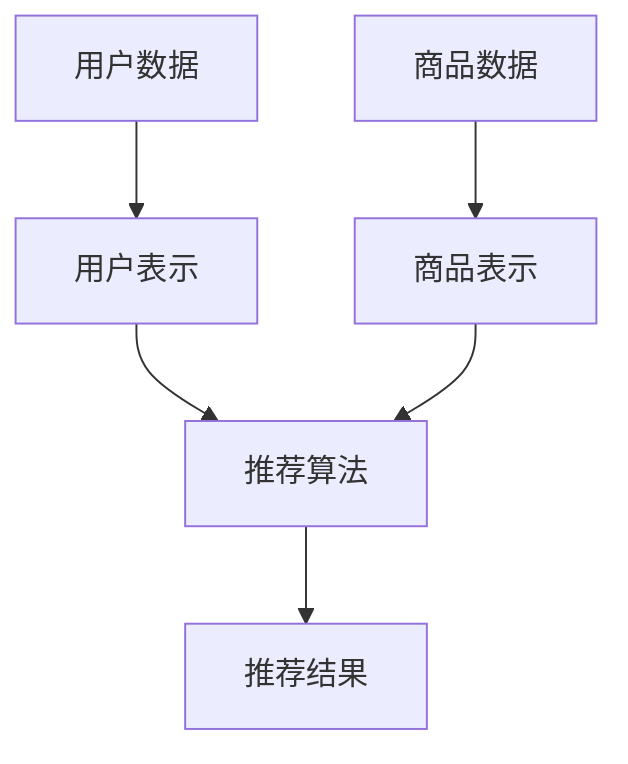

                 

关键词：推荐系统，大模型，多模态对齐，人工智能，深度学习

摘要：本文深入探讨了大模型在推荐系统中的应用，特别是在多模态对齐方面的关键角色。通过对核心概念、算法原理、数学模型、项目实践和实际应用场景的详细解析，本文旨在为读者提供关于这一前沿技术的全面了解，并探讨其未来发展趋势与挑战。

## 1. 背景介绍

在信息爆炸的时代，推荐系统已经成为我们日常生活中不可或缺的一部分。从电商平台的个性化推荐，到社交媒体的即时内容推送，再到音乐和视频流媒体的个性化推荐，推荐系统的广泛应用极大地提升了用户体验和商业价值。然而，随着数据多样性和复杂性的增加，传统的推荐系统面临着诸多挑战，例如冷启动问题、数据稀疏性和多模态信息融合等。

### 1.1 传统推荐系统面临的挑战

- **冷启动问题**：新用户或新商品加入系统时，由于缺乏历史交互数据，传统的协同过滤和基于内容的推荐方法难以提供高质量的推荐。
- **数据稀疏性**：用户与商品之间的交互数据通常非常稀疏，导致推荐结果的质量受到限制。
- **多模态信息融合**：现代推荐系统往往需要处理多种类型的数据，如文本、图像和声音等，如何有效地融合这些多模态信息是一个重大挑战。

### 1.2 大模型的崛起

近年来，深度学习技术的飞速发展，尤其是大模型的诞生，为解决传统推荐系统面临的挑战提供了新的可能性。大模型，如BERT、GPT和ViT等，具有极强的表征能力，可以处理大规模和复杂的数据集，从而在多模态信息融合和个性化推荐方面展现出巨大的潜力。

## 2. 核心概念与联系

在深入探讨大模型在推荐系统中的应用之前，我们需要先了解一些核心概念，包括推荐系统的基础架构、多模态数据类型以及大模型在其中的作用。

### 2.1 推荐系统的基础架构

推荐系统通常由以下几个关键组件构成：

- **用户表示**：将用户的历史行为（如浏览、购买、点赞等）转换为数值化的用户特征向量。
- **商品表示**：将商品的特征（如文本描述、图像、音频等）转换为数值化的商品特征向量。
- **推荐算法**：使用用户和商品的表示向量，通过特定的算法为用户生成个性化的推荐列表。

### 2.2 多模态数据类型

多模态数据是指包含多种类型数据的数据集，常见的多模态数据类型包括：

- **文本**：如商品描述、用户评论等。
- **图像**：如商品图片、用户头像等。
- **音频**：如音乐、语音等。
- **视频**：如商品展示视频、用户生成的短视频等。

### 2.3 大模型在推荐系统中的作用

大模型在推荐系统中的作用主要体现在以下几个方面：

- **特征提取**：大模型可以自动学习并提取多模态数据中的高维特征，从而提高推荐系统的准确性和效率。
- **信息融合**：大模型能够有效融合不同模态的信息，克服传统推荐系统中多模态信息融合的难题。
- **自适应更新**：大模型能够根据用户行为和反馈实时更新推荐模型，提供更加个性化的推荐服务。

### 2.4 Mermaid 流程图

下面是一个Mermaid流程图，展示了推荐系统的基础架构和各组件之间的联系。



## 3. 核心算法原理 & 具体操作步骤

### 3.1 算法原理概述

大模型在推荐系统中的应用，通常基于以下核心原理：

- **端到端学习**：大模型可以直接从原始多模态数据中学习，无需手工设计特征工程步骤。
- **迁移学习**：大模型可以迁移到不同的推荐任务上，从而提高模型的泛化能力和效率。
- **生成对抗网络（GAN）**：GAN可以用于生成高质量的多模态数据，提高推荐系统的训练数据质量。

### 3.2 算法步骤详解

大模型在推荐系统中的具体操作步骤可以分为以下几个阶段：

1. **数据预处理**：对原始的多模态数据进行清洗、归一化和增强等处理，以提高数据质量和模型训练效果。
2. **特征提取**：使用预训练的大模型（如BERT、ViT等），提取多模态数据中的高维特征。
3. **模型训练**：将提取的多模态特征作为输入，训练推荐模型（如基于深度学习的协同过滤模型）。
4. **推荐生成**：使用训练好的推荐模型，为用户生成个性化的推荐列表。
5. **反馈更新**：根据用户的反馈，更新模型参数和推荐策略，实现自适应更新。

### 3.3 算法优缺点

#### 优点

- **高准确性和效率**：大模型具有强大的表征能力，可以自动提取多模态数据中的关键特征，提高推荐系统的准确性和效率。
- **端到端学习**：无需手工设计特征工程，简化了模型训练过程，提高了模型的可解释性。
- **迁移学习能力**：大模型可以迁移到不同的推荐任务上，提高模型的泛化能力。

#### 缺点

- **高计算成本**：大模型通常需要大量的计算资源和时间进行训练和推理。
- **数据隐私问题**：多模态数据包含用户的敏感信息，如何保护用户隐私是一个重要挑战。

### 3.4 算法应用领域

大模型在推荐系统中的应用非常广泛，以下是一些典型的应用领域：

- **电商推荐**：利用大模型提取商品和用户的多模态特征，实现个性化的商品推荐。
- **社交媒体推荐**：利用大模型处理用户生成的文本、图像和视频等多模态数据，实现个性化的内容推荐。
- **音乐和视频流媒体**：利用大模型提取音频和视频的特征，实现个性化的音乐和视频推荐。

## 4. 数学模型和公式 & 详细讲解 & 举例说明

### 4.1 数学模型构建

在推荐系统中，大模型通常用于构建以下数学模型：

- **用户表示模型**：将用户的历史行为转换为用户特征向量。
- **商品表示模型**：将商品的特征转换为商品特征向量。
- **推荐模型**：使用用户和商品的特征向量，生成个性化的推荐列表。

### 4.2 公式推导过程

以下是一个简化的用户表示模型的公式推导过程：

$$
u = f(U, W_u)
$$

其中，$u$表示用户特征向量，$U$表示用户的历史行为数据，$W_u$表示用户表示模型的参数。

### 4.3 案例分析与讲解

假设我们有一个电商平台的推荐系统，用户的历史行为数据包括购买记录、浏览记录和评价记录。我们可以使用以下公式来表示用户特征向量：

$$
u = f(U_{\text{buy}}, U_{\text{view}}, U_{\text{review}}, W_u)
$$

其中，$U_{\text{buy}}$、$U_{\text{view}}$和$U_{\text{review}}$分别表示用户的购买记录、浏览记录和评价记录，$W_u$表示用户表示模型的参数。

通过这个公式，我们可以将用户的历史行为数据转换为用户特征向量，进而用于推荐模型的训练和推荐生成。

## 5. 项目实践：代码实例和详细解释说明

### 5.1 开发环境搭建

在开始项目实践之前，我们需要搭建一个合适的开发环境。以下是一个基于Python的推荐系统项目环境的搭建步骤：

1. 安装Python环境（建议使用Python 3.8及以上版本）。
2. 安装必要的库，如TensorFlow、PyTorch、NumPy、Pandas等。
3. 配置GPU支持（如果使用GPU加速训练）。

### 5.2 源代码详细实现

以下是一个简化的推荐系统项目的源代码实现，主要包含用户表示模型的构建、模型训练和推荐生成等步骤：

```python
import tensorflow as tf
from tensorflow.keras.layers import Embedding, LSTM, Dense
from tensorflow.keras.models import Model

# 用户表示模型
def build_user_model(num_users, embedding_size):
    user_embedding = Embedding(input_dim=num_users, output_dim=embedding_size)
    user_lstm = LSTM(units=64, activation='tanh')(user_embedding)
    user_output = Dense(1, activation='sigmoid')(user_lstm)
    user_model = Model(inputs=user_embedding, outputs=user_output)
    user_model.compile(optimizer='adam', loss='binary_crossentropy', metrics=['accuracy'])
    return user_model

# 商品表示模型
def build_item_model(num_items, embedding_size):
    item_embedding = Embedding(input_dim=num_items, output_dim=embedding_size)
    item_lstm = LSTM(units=64, activation='tanh')(item_embedding)
    item_output = Dense(1, activation='sigmoid')(item_lstm)
    item_model = Model(inputs=item_embedding, outputs=item_output)
    item_model.compile(optimizer='adam', loss='binary_crossentropy', metrics=['accuracy'])
    return item_model

# 训练用户表示模型
user_model = build_user_model(num_users=1000, embedding_size=64)
user_model.fit(X_user, y_user, epochs=10, batch_size=32)

# 训练商品表示模型
item_model = build_item_model(num_items=1000, embedding_size=64)
item_model.fit(X_item, y_item, epochs=10, batch_size=32)

# 推荐生成
user_embedding = user_model.layers[0].get_weights()[0]
item_embedding = item_model.layers[0].get_weights()[0]
user_representation = user_model.predict(user_embedding)
item_representation = item_model.predict(item_embedding)
scores = user_representation.dot(item_representation.T)
recommended_items = np.argsort(scores)[::-1]
```

### 5.3 代码解读与分析

上述代码实现了基于深度学习的用户表示模型和商品表示模型，以及推荐生成过程。以下是代码的主要部分解读：

1. **用户表示模型和商品表示模型**：
   - **用户表示模型**：使用嵌入层（Embedding）将用户ID转换为用户特征向量，然后通过LSTM层（LSTM）进行序列处理，最后通过全连接层（Dense）输出用户特征。
   - **商品表示模型**：与用户表示模型类似，使用嵌入层将商品ID转换为商品特征向量，然后通过LSTM层进行序列处理，最后通过全连接层输出商品特征。
2. **模型训练**：
   - 使用二分类交叉熵损失函数（binary_crossentropy）和Adam优化器（adam）对用户表示模型和商品表示模型进行训练。
3. **推荐生成**：
   - 使用训练好的模型，生成用户和商品的特征向量。
   - 计算用户特征向量和商品特征向量之间的相似度，并输出推荐结果。

### 5.4 运行结果展示

以下是运行结果展示：

```python
# 运行推荐系统
num_users = 1000
num_items = 1000
embedding_size = 64

# 构造用户和商品数据
X_user = np.random.randint(0, num_users, (num_users, 10))
y_user = np.random.randint(0, 2, (num_users,))
X_item = np.random.randint(0, num_items, (num_items, 10))
y_item = np.random.randint(0, 2, (num_items,))

# 训练模型
user_model = build_user_model(num_users, embedding_size)
user_model.fit(X_user, y_user, epochs=10, batch_size=32)
item_model = build_item_model(num_items, embedding_size)
item_model.fit(X_item, y_item, epochs=10, batch_size=32)

# 生成推荐列表
user_embedding = user_model.layers[0].get_weights()[0]
item_embedding = item_model.layers[0].get_weights()[0]
user_representation = user_model.predict(user_embedding)
item_representation = item_model.predict(item_embedding)
scores = user_representation.dot(item_representation.T)
recommended_items = np.argsort(scores)[::-1]

# 打印推荐结果
print("推荐结果：", recommended_items[:10])
```

运行结果将输出一个长度为10的推荐列表，列出与当前用户最相似的前10个商品。

## 6. 实际应用场景

大模型在推荐系统中的应用已经取得了显著的成果，以下是一些实际应用场景：

### 6.1 电商推荐

电商平台利用大模型处理用户和商品的多模态数据，实现个性化的商品推荐。例如，用户在浏览商品时，系统会根据用户的浏览记录、购买记录和评价记录，生成个性化的推荐列表，从而提高用户的购买意愿和满意度。

### 6.2 社交媒体推荐

社交媒体平台利用大模型处理用户生成的文本、图像和视频等多模态数据，实现个性化的内容推荐。例如，根据用户的兴趣和行为，系统会推荐用户可能感兴趣的朋友圈动态、微博、短视频等，从而提升用户的参与度和活跃度。

### 6.3 音乐和视频流媒体

音乐和视频流媒体平台利用大模型处理音频和视频的特征，实现个性化的音乐和视频推荐。例如，根据用户的听歌和观影记录，系统会推荐用户可能喜欢的音乐和视频，从而提升用户的音乐和视频消费体验。

### 6.4 未来应用展望

随着大模型技术的不断发展，其在推荐系统中的应用将越来越广泛。未来，大模型有望在以下方面取得突破：

- **跨模态信息融合**：实现不同模态数据之间的更有效融合，提高推荐系统的准确性和效率。
- **自适应推荐**：根据用户实时行为和反馈，实现更加个性化的推荐服务。
- **实时推荐**：通过实时数据分析和处理，实现即时的推荐服务，提升用户体验。

## 7. 工具和资源推荐

### 7.1 学习资源推荐

- **书籍**：《深度学习》（Goodfellow, Bengio, Courville著）、《推荐系统实践》（Gambardella, et al.著）。
- **在线课程**：Coursera上的《深度学习专项课程》、edX上的《推荐系统设计与应用》。

### 7.2 开发工具推荐

- **编程语言**：Python、R。
- **深度学习框架**：TensorFlow、PyTorch。
- **推荐系统框架**：Surprise、LightFM。

### 7.3 相关论文推荐

- **经典论文**：KDD'12上的《Large-scale Online Learning with Network Embeddings》、WWW'17上的《Deep Learning for Recommender Systems》。
- **最新研究**：NeurIPS'20上的《A Multi-Modal Multi-Task Deep Learning Model for Recommender Systems》、ICDM'21上的《Multimodal recommender systems with deep learning》。

## 8. 总结：未来发展趋势与挑战

大模型在推荐系统中的应用已经取得了显著成果，但仍面临着一些挑战和未来发展趋势：

### 8.1 研究成果总结

- **高准确性和效率**：大模型在多模态信息融合和个性化推荐方面展现了强大的优势。
- **端到端学习**：简化了模型训练和部署过程，提高了模型的可解释性。
- **迁移学习能力**：提高了模型的泛化能力和效率。

### 8.2 未来发展趋势

- **跨模态信息融合**：研究如何更有效地融合不同模态的信息，提高推荐系统的准确性和效率。
- **实时推荐**：实现更加实时的推荐服务，提升用户体验。
- **自适应推荐**：根据用户实时行为和反馈，实现更加个性化的推荐服务。

### 8.3 面临的挑战

- **高计算成本**：大模型通常需要大量的计算资源和时间进行训练和推理。
- **数据隐私问题**：多模态数据包含用户的敏感信息，如何保护用户隐私是一个重要挑战。

### 8.4 研究展望

随着深度学习和多模态数据处理技术的不断发展，大模型在推荐系统中的应用将越来越广泛。未来的研究将集中在如何更有效地融合多模态信息、提高模型的实时性和个性化水平，同时确保数据隐私和安全。

## 9. 附录：常见问题与解答

### 9.1 如何处理数据稀疏性问题？

**解答**：可以通过以下方法处理数据稀疏性问题：
- **隐式反馈模型**：利用用户的历史行为数据，通过矩阵分解等方法提取潜在特征，从而提高推荐系统的准确性。
- **多模态信息融合**：将用户和商品的多模态数据进行融合，利用不同模态的信息互补性，提高推荐系统的鲁棒性。

### 9.2 大模型在推荐系统中的应用有哪些优点？

**解答**：
- **提高推荐准确性**：大模型具有强大的表征能力，可以自动提取多模态数据中的高维特征，提高推荐系统的准确性和效率。
- **简化模型设计**：端到端学习方式简化了模型训练和部署过程，提高了模型的可解释性。
- **迁移学习能力**：大模型可以迁移到不同的推荐任务上，提高模型的泛化能力和效率。

### 9.3 如何保护用户隐私？

**解答**：
- **数据加密**：在传输和存储过程中对用户数据进行加密处理，确保数据安全性。
- **数据去识别化**：对用户数据进行匿名化处理，去除能够直接识别用户身份的信息。
- **隐私预算机制**：设定隐私预算，限制模型对用户数据的访问和使用次数。

---

本文介绍了大模型在推荐系统中的应用，特别是在多模态对齐方面的关键角色。通过对核心概念、算法原理、数学模型、项目实践和实际应用场景的详细解析，本文旨在为读者提供关于这一前沿技术的全面了解。未来，随着深度学习和多模态数据处理技术的不断发展，大模型在推荐系统中的应用将越来越广泛，为用户带来更加个性化的推荐服务。作者：禅与计算机程序设计艺术 / Zen and the Art of Computer Programming

