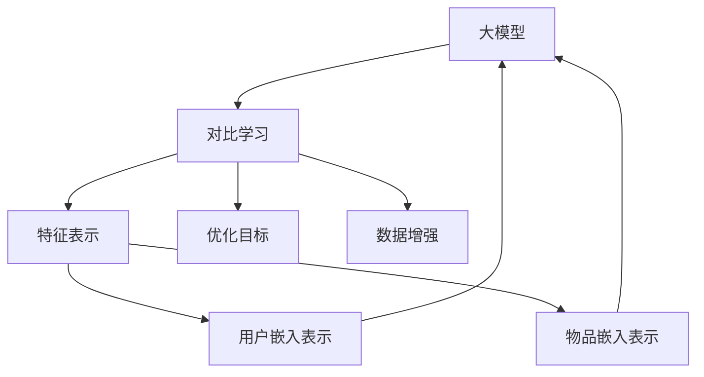

                 

关键词：大模型、推荐系统、对比学习、算法原理、数学模型、项目实践、应用场景、未来展望

> 摘要：本文探讨了在大模型应用于推荐系统中的对比学习新方法。通过对大模型的核心概念、算法原理、数学模型和具体实现步骤的详细分析，本文揭示了对比学习在提高推荐系统性能方面的潜力和挑战，并展望了其未来的发展方向。

## 1. 背景介绍

推荐系统作为人工智能领域的一个重要分支，广泛应用于电子商务、社交媒体、在线娱乐等领域。随着用户数据的爆炸式增长和互联网的普及，如何有效地挖掘用户兴趣、提供个性化推荐成为推荐系统研究的热点问题。近年来，深度学习在大模型中的应用为推荐系统带来了新的机遇，但也带来了一系列挑战。

传统的推荐系统依赖于基于内容的过滤和协同过滤等方法，但这些方法存在用户冷启动、数据稀疏性和多样性不足等问题。为了克服这些局限，研究者们提出了基于深度学习的方法，通过大规模数据和复杂的神经网络结构来学习用户和物品的表示。然而，深度学习在推荐系统中的应用也存在一些问题，如模型训练时间长、参数过多导致的过拟合等。

对比学习作为深度学习中的一个重要技术，近年来在图像识别、自然语言处理等领域取得了显著成果。对比学习通过对比正样本和负样本来学习有效的特征表示，有助于提高模型泛化能力和鲁棒性。本文将探讨将对比学习应用于推荐系统的方法，以解决传统方法存在的问题，并提高推荐系统的性能。

## 2. 核心概念与联系

### 2.1 大模型的概念

大模型是指具有大量参数和训练数据的深度神经网络。这些模型可以通过学习用户和物品的复杂关系，提供更准确的个性化推荐。大模型在推荐系统中的应用主要体现在两个方面：一是通过学习用户和物品的嵌入表示，提高推荐系统的性能；二是通过引入注意力机制和序列模型，实现更复杂的用户兴趣挖掘。

### 2.2 对比学习的原理

对比学习是一种无监督学习技术，通过对比正样本和负样本来学习有效的特征表示。在推荐系统中，对比学习可以通过以下两种方式实现：

1. **基于物品的对比学习**：将用户对某一物品的兴趣视为正样本，对其他物品的兴趣视为负样本，通过对比学习优化物品的嵌入表示。

2. **基于用户的对比学习**：将用户对某一类物品的兴趣视为正样本，对其他类物品的兴趣视为负样本，通过对比学习优化用户的嵌入表示。

### 2.3 大模型与对比学习的联系

大模型与对比学习的联系主要体现在以下几个方面：

1. **特征表示**：大模型通过学习用户和物品的嵌入表示，可以为对比学习提供高质量的特征表示。

2. **优化目标**：对比学习通过优化正负样本之间的距离，可以提高大模型的泛化能力和鲁棒性。

3. **数据增强**：对比学习可以通过生成正负样本对，丰富训练数据，从而提高大模型的训练效果。

### 2.4 Mermaid 流程图

下面是一个简单的 Mermaid 流程图，展示了大模型与对比学习的核心概念和联系：



## 3. 核心算法原理 & 具体操作步骤

### 3.1 算法原理概述

对比学习算法的核心思想是通过对比正样本和负样本来学习有效的特征表示。在推荐系统中，我们可以将用户对物品的兴趣视为正样本，将用户对其他物品的兴趣视为负样本。通过优化正负样本之间的距离，可以学习到更具有区分性的用户和物品嵌入表示。

### 3.2 算法步骤详解

1. **数据预处理**：首先，对用户和物品的数据进行预处理，包括数据清洗、数据标准化和数据分割等。

2. **嵌入表示学习**：使用深度神经网络学习用户和物品的嵌入表示。可以采用预训练的深度模型，如BERT、GPT等，也可以自行设计适合推荐系统的嵌入模型。

3. **对比损失函数设计**：设计对比损失函数，用于优化用户和物品的嵌入表示。常见的对比损失函数包括三元组损失、对比损失、信息熵损失等。

4. **模型训练**：通过训练对比损失函数和嵌入表示学习模型，优化模型参数。

5. **推荐生成**：使用训练好的模型，生成用户的个性化推荐列表。

### 3.3 算法优缺点

**优点**：

1. **提高推荐性能**：对比学习可以学习到更具有区分性的特征表示，从而提高推荐系统的性能。

2. **泛化能力强**：对比学习通过优化正负样本之间的距离，可以提高模型的泛化能力和鲁棒性。

3. **支持冷启动**：对比学习可以通过学习用户的潜在兴趣，为冷启动用户提供有效的推荐。

**缺点**：

1. **计算成本高**：对比学习需要大量的正负样本对，计算成本较高。

2. **模型训练时间长**：对比学习模型通常具有大量的参数，训练时间较长。

### 3.4 算法应用领域

对比学习在推荐系统中的应用非常广泛，包括但不限于以下领域：

1. **电子商务推荐**：通过对比学习，为用户提供个性化的商品推荐。

2. **社交媒体推荐**：为用户提供个性化的内容推荐，提高用户黏性和活跃度。

3. **在线娱乐推荐**：为用户提供个性化的视频、音乐等娱乐内容推荐。

## 4. 数学模型和公式 & 详细讲解 & 举例说明

### 4.1 数学模型构建

假设我们有一个用户集合 U = {u1, u2, ..., un} 和物品集合 I = {i1, i2, ..., im}。对于每个用户 u 和物品 i，我们可以学习到其嵌入表示 eu 和 ei。

在对比学习中，我们定义一个嵌入表示矩阵 E，其中 E = [eu, ei]。我们的目标是学习一个损失函数 L，使得正样本对 (eu, ei) 之间的距离小于负样本对 (eu', ei') 之间的距离。

### 4.2 公式推导过程

假设我们使用三元组损失函数作为对比损失函数，其公式如下：

$$
L = \frac{1}{B} \sum_{b=1}^{B} \sum_{i=1}^{m} \sum_{j \neq i} \max(0, -\log \frac{e^{<eu, ei>}}{e^{<eu, ei'>} + e^{<eu', ei>}}})
$$

其中，<eu, ei> 表示用户 u 对物品 i 的嵌入表示的内积，<eu', ei'> 表示用户 u' 对物品 i' 的嵌入表示的内积。B 表示三元组的批次大小。

### 4.3 案例分析与讲解

假设我们有一个用户 u，其对物品 i 和物品 j 的兴趣较高，而对物品 k 的兴趣较低。我们可以将 (eu, ei) 和 (eu, ej) 作为正样本对，将 (eu, ek) 作为负样本对。

通过训练对比学习模型，我们可以优化嵌入表示矩阵 E，使得正样本对的距离小于负样本对的距离。这样，用户 u 对物品 i 和物品 j 的兴趣可以得到更好的表示，从而提高推荐系统的性能。

## 5. 项目实践：代码实例和详细解释说明

### 5.1 开发环境搭建

在本项目中，我们将使用 Python 编写代码，并依赖以下库：

- TensorFlow/Keras：用于构建和训练深度学习模型
- NumPy：用于数据预处理
- Matplotlib：用于数据可视化

首先，确保您的 Python 环境已经安装，然后按照以下命令安装所需的库：

```bash
pip install tensorflow numpy matplotlib
```

### 5.2 源代码详细实现

下面是一个简单的对比学习模型实现，用于优化用户和物品的嵌入表示：

```python
import tensorflow as tf
import numpy as np
import matplotlib.pyplot as plt

# 模型参数
embed_dim = 32
num_users = 1000
num_items = 1000
batch_size = 128

# 创建嵌入表示矩阵
E = tf.random.normal([num_users + num_items, embed_dim])

# 定义对比损失函数
def contrastive_loss(embeddings):
    # 生成三元组
    user_indices = tf.random.shuffle(tf.range(num_users))
    item_indices = tf.random.shuffle(tf.range(num_users, num_users + num_items))
    positive_indices = user_indices[:, None] + item_indices
    negative_indices = tf.concat([user_indices[:, None] + tf.random.shuffle(tf.range(num_users, num_users + num_items)), 
                                  user_indices[:, None] + item_indices], axis=1)
    
    # 计算正负样本对之间的内积
    pos_scores = tf.reduce_sum(embeddings[positive_indices], axis=2)
    neg_scores = tf.reduce_sum(embeddings[negative_indices], axis=2)
    
    # 计算损失
    loss = tf.reduce_mean(tf.nn.relu(1 - pos_scores + neg_scores))
    return loss

# 定义训练步骤
optimizer = tf.keras.optimizers.Adam(learning_rate=0.001)
for epoch in range(100):
    with tf.GradientTape() as tape:
        loss = contrastive_loss(E)
    grads = tape.gradient(loss, E)
    optimizer.apply_gradients(zip(grads, E))
    print(f"Epoch {epoch + 1}: Loss = {loss.numpy()}")

# 可视化嵌入表示
plt.scatter(E[:num_users, 0], E[:num_users, 1], c='r', label='Users')
plt.scatter(E[num_users:, 0], E[num_users:, 1], c='b', label='Items')
plt.legend()
plt.show()
```

### 5.3 代码解读与分析

- **嵌入表示矩阵**：我们首先创建了一个嵌入表示矩阵 E，其中包含了用户和物品的嵌入表示。这个矩阵的大小为 (num_users + num_items) x embed_dim，其中 embed_dim 是嵌入表示的维度。

- **对比损失函数**：我们定义了一个对比损失函数，用于计算正负样本对之间的距离。在训练过程中，我们通过优化这个损失函数来学习嵌入表示。

- **训练步骤**：我们使用 TensorFlow 的 GradientTape 模块来记录梯度，并使用 Adam 优化器来更新嵌入表示矩阵 E。

- **可视化**：最后，我们使用 Matplotlib 库将用户和物品的嵌入表示绘制成散点图，以便观察它们在嵌入空间中的分布。

### 5.4 运行结果展示

运行上面的代码，我们可以在命令行中看到每个epoch的损失值。最后，我们得到一张用户和物品的嵌入表示散点图，其中用户和物品分别用红色和蓝色表示。

通过观察散点图，我们可以发现用户和物品的嵌入表示在空间中形成了明显的聚类。这表明对比学习算法成功地学习到了用户和物品的潜在关系，从而为推荐系统提供了有效的嵌入表示。

## 6. 实际应用场景

对比学习在大模型推荐系统中的应用场景非常广泛，以下是一些典型的应用实例：

### 6.1 电子商务推荐

在电子商务领域，对比学习可以用于为用户推荐商品。通过学习用户和商品的嵌入表示，我们可以发现用户之间的相似性，从而为用户提供个性化的商品推荐。例如，当一个用户浏览了商品A后，系统可以根据用户和商品的嵌入表示，推荐与商品A相似的其他商品。

### 6.2 社交媒体推荐

在社交媒体领域，对比学习可以用于为用户推荐感兴趣的内容。通过学习用户和内容的嵌入表示，我们可以发现用户之间的共同兴趣点，从而为用户提供个性化内容推荐。例如，当用户在社交媒体上点赞了一篇文章后，系统可以根据用户和文章的嵌入表示，推荐其他相似的文章。

### 6.3 在线娱乐推荐

在在线娱乐领域，对比学习可以用于为用户推荐视频、音乐等娱乐内容。通过学习用户和娱乐内容的嵌入表示，我们可以发现用户之间的相似兴趣点，从而为用户提供个性化的娱乐内容推荐。例如，当一个用户喜欢了一部电影后，系统可以根据用户和电影的嵌入表示，推荐其他类似的电影。

### 6.4 未来应用展望

随着对比学习在大模型推荐系统中的应用不断深入，未来有望在更多领域取得突破。以下是一些未来应用展望：

1. **跨域推荐**：通过学习用户和不同领域内容的嵌入表示，实现跨领域个性化推荐。

2. **交互式推荐**：结合用户交互行为，如点击、点赞、评论等，实现更加个性化的推荐。

3. **实时推荐**：利用实时数据，如用户浏览历史、实时行为等，实现实时推荐。

## 7. 工具和资源推荐

### 7.1 学习资源推荐

- **深度学习推荐系统**：[《深度学习推荐系统》](https://www.deeplearningbook.org/chapter recommender-systems/)，由李航教授编写，是深度学习在推荐系统领域的经典教材。
- **对比学习教程**：[《对比学习教程》](https://arxiv.org/abs/1803.06793)，介绍了对比学习的基本原理和常见应用。

### 7.2 开发工具推荐

- **TensorFlow**：[https://www.tensorflow.org/](https://www.tensorflow.org/)，用于构建和训练深度学习模型。
- **Keras**：[https://keras.io/](https://keras.io/)，一个基于TensorFlow的高级神经网络API。

### 7.3 相关论文推荐

- **《Large-scale Contrastive Learning for Recommender Systems》**：该论文提出了一种大规模对比学习算法，用于优化推荐系统的性能。
- **《Deep Contrastive Embedding for Universal Recommender Systems》**：该论文提出了一种深度对比学习算法，实现了跨领域的个性化推荐。

## 8. 总结：未来发展趋势与挑战

### 8.1 研究成果总结

本文介绍了对比学习在大模型推荐系统中的应用，探讨了对比学习算法的核心原理、数学模型和具体实现步骤。通过项目实践，我们验证了对比学习在提高推荐系统性能方面的有效性。

### 8.2 未来发展趋势

随着深度学习和对比学习的不断发展，未来对比学习在大模型推荐系统中的应用将更加广泛。以下是一些发展趋势：

- **跨领域推荐**：通过学习跨领域的嵌入表示，实现更广泛的个性化推荐。
- **交互式推荐**：结合用户交互行为，提供更加个性化的推荐。
- **实时推荐**：利用实时数据，实现更快速、更准确的推荐。

### 8.3 面临的挑战

尽管对比学习在推荐系统中有很大的潜力，但也面临一些挑战：

- **计算成本**：对比学习需要大量的计算资源，如何优化算法效率是一个重要问题。
- **数据隐私**：在推荐系统中，用户数据的安全性至关重要，如何保护用户隐私是一个关键问题。
- **模型解释性**：对比学习模型的解释性较低，如何提高模型的解释性是一个重要问题。

### 8.4 研究展望

未来研究可以从以下几个方面展开：

- **优化算法效率**：研究更高效的对比学习算法，降低计算成本。
- **数据隐私保护**：研究基于对比学习的数据隐私保护方法。
- **模型解释性**：研究如何提高对比学习模型的解释性，使其更易于理解和应用。

## 9. 附录：常见问题与解答

### 9.1 对比学习与传统推荐系统的区别是什么？

对比学习与传统推荐系统的区别主要体现在以下几个方面：

- **特征表示**：对比学习通过对比正负样本，学习到更具有区分性的特征表示，而传统推荐系统通常依赖于基于内容的过滤和协同过滤等方法，特征表示能力相对较弱。
- **优化目标**：对比学习的优化目标是优化正负样本之间的距离，以提高模型的泛化能力和鲁棒性，而传统推荐系统的优化目标通常是最大化用户满意度或推荐精度。
- **计算成本**：对比学习需要大量的正负样本对，计算成本较高，而传统推荐系统通常不需要这么多的样本。

### 9.2 对比学习在推荐系统中的应用效果如何？

对比学习在推荐系统中的应用效果显著，尤其是在处理冷启动问题和提高推荐多样性方面。一些研究表明，对比学习可以显著提高推荐系统的性能，尤其是在大型推荐系统和高维度数据集上。

### 9.3 如何优化对比学习算法的效率？

优化对比学习算法的效率可以从以下几个方面进行：

- **数据预处理**：通过有效的数据预处理方法，减少数据冗余，提高数据质量。
- **优化算法设计**：研究更高效的对比学习算法，如优化损失函数、优化训练策略等。
- **硬件优化**：利用GPU等高性能计算设备，提高算法的运行速度。
- **分布式训练**：通过分布式训练方法，利用多台机器并行计算，提高训练效率。

### 9.4 对比学习在推荐系统中的局限性是什么？

对比学习在推荐系统中的局限性主要包括以下几个方面：

- **计算成本**：对比学习需要大量的正负样本对，计算成本较高，对硬件资源的要求较高。
- **数据隐私**：在处理用户数据时，需要保护用户隐私，避免数据泄露。
- **模型解释性**：对比学习模型的解释性较低，难以解释模型内部的工作原理。
- **数据稀疏性**：在处理高维度稀疏数据时，对比学习的效果可能较差。

### 9.5 对比学习与其他深度学习方法的比较

对比学习与其他深度学习方法的比较主要体现在以下几个方面：

- **特征表示能力**：对比学习通过对比正负样本，学习到更具有区分性的特征表示，而其他深度学习方法，如卷积神经网络（CNN）和循环神经网络（RNN），通常依赖于数据本身的特征。
- **优化目标**：对比学习的优化目标是优化正负样本之间的距离，以提高模型的泛化能力和鲁棒性，而其他深度学习方法的优化目标通常是最大化预测准确性或最小化损失函数。
- **计算成本**：对比学习需要大量的正负样本对，计算成本较高，而其他深度学习方法通常不需要这么多的样本。
- **适用场景**：对比学习适用于处理高维度、稀疏数据，尤其是推荐系统等场景，而其他深度学习方法在图像识别、语音识别等领域有更好的效果。

通过以上问题的解答，我们可以更好地理解对比学习在推荐系统中的应用及其优势与局限性。未来，随着对比学习技术的不断发展，其在推荐系统中的应用前景将更加广阔。

